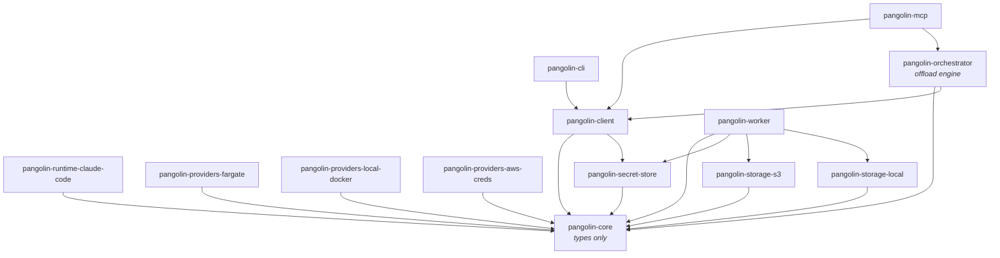

# Pangolin Scale

> Secure, deterministic, auditable execution of AI agents — submit a DAG of tasks, fan out safely across an isolated, credential-sealed worker pool, and get back a reviewable patch artifact and a verifiable audit trail of exactly what ran — tamper-detecting by default, tamper-evident at the external-immutable (S3 Object Lock) tier.

A registry-backed dispatch SDK for sub-agent compute workloads. Integrators
register **capabilities**, **subagents**, and **env bundles** once at deploy
time, then **dispatch** against them at run time — the same code path
running locally against Docker as in production against Fargate + S3.
Provider seams (compute, credentials, storage, secret store, channel,
result sink) keep the registry shape and dispatch contract identical
across environments. The orchestrator layer adds a DAG planner on top:
disjoint resource locks fan out in parallel; shared locks serialize; each
finished task yields a reviewable patch (`result_ref`); the whole run
produces a tamper-evident audit trail — verifiable at the
external-immutable tier (S3 Object Lock), tamper-detecting on the local
default path.

Pangolin Scale is **source-available** under the Business Source License 1.1 — see
[LICENSE](./LICENSE) and [LICENSING.md](./LICENSING.md).

📖 **Docs:** https://quarrysystems.github.io/pangolin

## Install

```bash
pnpm add @quarry-systems/pangolin-client
```

The caller-side SDK pulls in `@quarry-systems/pangolin-core` (interface
contracts only) transitively. Provider packages — `pangolin-providers-*`,
`pangolin-storage-*` — are composed at the deployment boundary; install only
the ones your target stack uses.

## Hello World

```typescript
import { PangolinClient, NoopCredentialProvider, StdoutResultSink } from '@quarry-systems/pangolin-client';
import { LocalStorageProvider } from '@quarry-systems/pangolin-storage-local';
import { LocalDockerProvider } from '@quarry-systems/pangolin-providers-local-docker';

const client = new PangolinClient({
  namespace: 'hello-world',
  compute: { 'local-docker': new LocalDockerProvider({ allowUnpinnedImage: true }) },
  credentials: { none: new NoopCredentialProvider() },
  storage: new LocalStorageProvider({ rootDir: '/tmp/pangolin' }),
  targets: { local: { compute: 'local-docker', credentials: 'none' } },
  resultSink: new StdoutResultSink(),
});

await client.capabilities.register({ name: 'echo-cap', files: { 'pangolin-setup.sh': '#!/bin/sh\necho "hello from pangolin-worker"\n' } });
await client.subagent.register({ name: 'echo', systemPrompt: 'Just exit.', capabilities: ['echo-cap'] });
await client.env.register({ name: 'minimal', values: { LOG_LEVEL: 'info' } });

const result = await client.dispatch({ subagent: 'echo', env: 'minimal', target: 'local', workerImage: 'ghcr.io/quarrysystems/pangolin-worker:latest' });
console.log(result.stdout);
```

The full runnable version (with mkdtemp + cleanup, comments, and a
Fargate + S3 production variant) lives at
[`examples/hello-world/`](examples/hello-world/).

## Offload

The orchestrator surfaces as the `pangolin orch` subcommand. A `plan.json`
describes a DAG of agent tasks with `depends_on`, `resourceLocks`, and
per-task subagent/env/target bindings. Disjoint resource locks fan out in
parallel; shared locks serialize automatically. Each finished task drops a
reviewable patch artifact (`result_ref`). The run produces a tamper-evident
audit bundle — verifiable at the external-immutable tier (S3 Object Lock),
tamper-detecting on the local path.

```sh
pangolin orch serve              # long-running driver (sole DB owner)
pangolin orch validate plan.json # pre-flight plan validation, no submit
pangolin orch submit plan.json   # non-blocking; prints a run id
pangolin orch watch <run-id>     # follow the run to completion
pangolin orch audit <run-id>     # exportable evidence bundle (verifies; names the guarantee tier)
pangolin orch audit <run-id> --out bundle.json   # write the bundle to a file
pangolin verify bundle.json      # re-verify an exported bundle against its external anchor
pangolin pipeline register|validate|list         # manage declared worker pipelines
```

See [`examples/offload-fanout/`](examples/offload-fanout/) for the runnable
demo — a three-task fan-out plan that exercises parallel locks, patch
artifacts, and the audit command end-to-end.

### Typed-product handoff

Tasks in a plan can now declare dependent inputs with `needs` instead of
hand-wiring `depends_on` — a downstream item names what it consumes and
which upstream task produces it, and the dependency edge is derived
automatically:

```json
"needs": { "patch": { "from": "edit-a", "select": { "kind": "patch" } } }
```

The orchestrator validates the whole DAG at submit (every `needs` must
resolve to a real upstream item and the graph must stay acyclic), then at
fire time resolves each upstream task's content-addressed product and hands
it to the worker, which materializes it under `inputs/` before the agent
runs (e.g. `inputs/patch`). Both consumed `inputRefs` and produced
`outputRefs` are sealed into the dispatch manifest and the audit
evidence, and `pangolin verify` proves **provenance closure** — every
consumed input ref must be a sealed product of a completed task in the
same run — surfaced as a fifth `handoff` check row alongside the
existing chain / root / signature / anchor checks. See
[`examples/handoff-dag/`](examples/handoff-dag/) for the runnable demo —
a two-task plan where `edit-a` produces a patch and `apply-patch` binds
it via `needs` and applies it with `git apply inputs/patch`.

## What's in this repo

Thirteen packages under `packages/`:

| Package | One-liner |
|---|---|
| [`pangolin-core`](packages/pangolin-core/) | Types-only contract package. Every other pangolin package depends on this; nothing depends on anything else by default. |
| [`pangolin-client`](packages/pangolin-client/) | Caller-side SDK. `PangolinClient` is the single entry point integrators construct: registration + dispatch surface, with wired-in providers. |
| [`pangolin-cli`](packages/pangolin-cli/) | The `pangolin` binary. Thin CLI over `PangolinClient` that resolves `pangolin.config.{ts,js,mjs}` and dispatches to subcommands. Canonical privileged entry point. |
| [`pangolin-mcp`](packages/pangolin-mcp/) | Stdio MCP server exposing exactly nine run-time, orchestration-safe tools. `register` / `assign` are deliberately absent — privileged ops never reach the AI loop. |
| [`pangolin-worker`](packages/pangolin-worker/) | Container-side runtime. One process per dispatch. Fetches bundles, verifies integrity, overlays the workspace, resolves secrets, hands off to a `RuntimeAdapter`. The runtime is a block-pipeline runner — agent / script / capture blocks, seal auto-appended. |
| [`pangolin-runtime-claude-code`](packages/pangolin-runtime-claude-code/) | MVP `RuntimeAdapter` implementation. Prompt rendering, `claude --print` invocation, Claude-specific merge rules, `needs_input` sentinel detection. |
| [`pangolin-providers-fargate`](packages/pangolin-providers-fargate/) | `ComputeProvider` backed by AWS ECS Fargate (`RunTask` / `DescribeTasks` / `StopTask`). Production target. |
| [`pangolin-providers-local-docker`](packages/pangolin-providers-local-docker/) | `ComputeProvider` backed by the local Docker daemon via `dockerode`. Developer iteration + local smoke suite. |
| [`pangolin-providers-aws-creds`](packages/pangolin-providers-aws-creds/) | `CredentialProvider` wrapping the AWS SDK default credential chain. Lazy resolution, no extra caching. |
| [`pangolin-storage-s3`](packages/pangolin-storage-s3/) | `StorageProvider` backed by S3. Content-addressed object layout, integrity-verified on read. Production target. |
| [`pangolin-storage-local`](packages/pangolin-storage-local/) | `StorageProvider` backed by the local filesystem. Pairs with `pangolin-providers-local-docker` for the local stack. |
| [`pangolin-secret-store`](packages/pangolin-secret-store/) | `SecretStore` seam plus impls — `AwsSecretStore` (AWS Secrets Manager), `LocalSecretStore` (on-disk), and a `storeFromConfig` factory. `pangolin-client` takes injected per-target stores (`secretStores`); the worker builds its store via `storeFromConfig`. |
| [`pangolin-orchestrator`](packages/pangolin-orchestrator/) | Orchestrator engine (codename *pangolin-offload*): named queues, `depends_on` resolution, resource locks, a fire-and-reconcile tick loop, SQLite run-state, typed-product handoff (`needs` → content-addressed `inputRefs`), per-queue execution patterns with audited dynamic spawn, and provenance-closure verification, behind pluggable `Executor` / `Trigger` seams. |

Plus:

- [`examples/`](examples/) — runnable worked examples:
  [`hello-world/`](examples/hello-world/) (the §4.4 worked example, also the
  integrator on-ramp); [`offload-fanout/`](examples/offload-fanout/) (the
  headline offload demo — locks + deps + concurrency + patch escape + audit);
  [`handoff-dag/`](examples/handoff-dag/) (typed-product handoff: B builds on
  A's patch); [`pattern-mapreduce/`](examples/pattern-mapreduce/) (dynamic
  fan-out: one item grows to five, provenance-verified);
  [`pattern-dogfood/`](examples/pattern-dogfood/) (gated circle-back via
  spawn); [`data-mapreduce/`](examples/data-mapreduce/) (the `data` pack: a
  second domain on the same engine, fully offline).
- [Architecture decisions](https://quarrysystems.github.io/pangolin/explanation/decisions/) — ADRs for the substantive design
  decisions taken during MVP design (published in the docs site).
- [`docker/`](docker/) — the published worker OCI image build context.

## User guides

Start here if you're new:

- [Getting started](https://quarrysystems.github.io/pangolin/tutorials/first-dispatch/) — zero-to-first-dispatch on
  local Docker. Build the worker image, write `pangolin.config.mjs`, wire the
  CLI and MCP server, register and dispatch.
- [Your first offload run](https://quarrysystems.github.io/pangolin/tutorials/first-offload-run/) — submit a
  small DAG, watch it fan out under resource locks, and verify the audit bundle.

Reference:

- [Dispatch lifecycle](https://quarrysystems.github.io/pangolin/reference/dispatch-lifecycle/) — what each event in the
  worker stdout stream means, which lifecycle step each `dispatch.failed`
  reason maps to.
- [Worker file layout](https://quarrysystems.github.io/pangolin/how-to/worker-file-layout/) — where to put files so the
  worker picks them up (skills, settings, plugins, setup scripts), and the
  `pangolin-setup.sh` single-slot constraint that catches first-time authors.
- [Sync capabilities & subagents](https://quarrysystems.github.io/pangolin/how-to/sync-capabilities-subagents/) — `pangolin capabilities sync` /
  `pangolin subagent sync` reference, the `claude-code` and `stoa` providers
  shipped today, and how to author a new one.
- [Handle needs_input](https://quarrysystems.github.io/pangolin/how-to/handle-needs-input/) — how a sub-agent pauses for
  clarification, what the orchestrator does with the question, and how
  re-dispatch threads continuity through `partial_state`.
- [How an offload run executes](https://quarrysystems.github.io/pangolin/explanation/how-offload-runs/) — run a DAG of agent
  tasks unattended with `pangolin orch serve | submit | watch | cancel | audit`:
  queues/deps/resource-locks, the patch escape (`result_ref`), and the
  verifiable audit bundle + guarantee tiers.

Extension + deployment:

- [Writing a provider](https://quarrysystems.github.io/pangolin/how-to/write-a-provider/) — plug in a new compute
  backend, storage layer, credential source, or result sink.
- [Remote Docker dispatch](https://quarrysystems.github.io/pangolin/how-to/remote-docker-dispatch/) — orchestrate
  from one machine, run workers on another machine's Docker daemon.

## Architecture

> For the **end-to-end runtime process** (register → CLI/MCP surfaces + the
> §10.6 privilege boundary → `dispatch` vs `orch` → worker sandbox → patch escape
> → tamper-evident audit), see the
> [Architecture overview](https://quarrysystems.github.io/pangolin/explanation/architecture-overview/) — one rendered diagram
> of the whole flow. The graph below is the complementary **package dependency**
> view.

The package dependency graph (§8 of the spec). `pangolin-core` is the
types-only sink; every arrow flows toward it:



ASCII rendering of the same graph:

```text
pangolin-core                              (types only)
   ▲
   ├── pangolin-client                     (caller-side SDK)
   │     ▲
   │     ├── pangolin-cli                  (binary `pangolin`)
   │     ├── pangolin-mcp                  (stdio MCP server, run-time tools only; also depends on pangolin-orchestrator)
   │     └── pangolin-orchestrator         (offload engine — queues/deps/locks, serve, operations API, tamper-evident audit; CLI `pangolin orch` + client MCP tools)
   ├── pangolin-worker                     (container-side runtime; also depends on pangolin-secret-store + both storage packages)
   ├── pangolin-runtime-claude-code        (RuntimeAdapter impl)
   ├── pangolin-providers-fargate          (ComputeProvider, AWS Fargate)
   ├── pangolin-providers-local-docker     (ComputeProvider, local Docker)
   ├── pangolin-providers-aws-creds        (CredentialProvider, AWS)
   ├── pangolin-storage-s3                 (StorageProvider, S3)
   ├── pangolin-storage-local              (StorageProvider, local FS)
   └── pangolin-secret-store               (SecretStore seam: AWS + Local; pangolin-client and pangolin-worker also depend on it)
```

No Pangolin Scale package depends on another Quarry Systems library (Stoa,
Bedrock, RaState, etc.). The constraint is enforced by a CI allowlist
check on `package.json` dependencies.

## Documentation

- [Roadmap](ROADMAP.md) — what's shipped in V1, what's planned next (V1.1, additive), and what's left as a branch. Also as a [docs-site page](https://quarrysystems.github.io/pangolin/explanation/project-status-roadmap/).
- [Changelog](CHANGELOG.md) — notable changes per release. [Releasing](RELEASING.md) documents how a release is cut (manual today).
- [Full MVP design spec](docs/superpowers/specs/2026-05-21-agora-mvp-design.md) — the §1–§11 design canon.
- [Orchestrator architecture spec](docs/superpowers/specs/2026-05-28-agora-orchestrator-design.md) — the *pangolin-offload* design: registries, effect tiers, queues/deps/locks, the intent outbox, and the trunk trap-check driving the `pangolin-orchestrator` package.
- [Offload V1 delivery spec](docs/superpowers/specs/2026-05-29-agora-offload-v1-design.md) — the shipped V1 slice (`serve` + escape + tamper-evident audit + operator surface), the security/determinism/auditability edge, and the honesty constraints. See also [How an offload run executes](https://quarrysystems.github.io/pangolin/explanation/how-offload-runs/).
- [Architecture decisions](https://quarrysystems.github.io/pangolin/explanation/decisions/) — eighteen ADRs covering
  package scope, repo location, runtime-adapter seam, secret TTL,
  lifecycle vocabulary, MCP auth model, the source-available (BSL) license,
  orchestration-as-a-separate-layer (ADR-0018, superseding ADR-0010), and more.
- [Examples](examples/) — worked, runnable demonstrations against the
  local provider stack.

## Common commands

```sh
pnpm install            # install workspace deps
pnpm -r run lint        # lint every package
pnpm -r run test        # test every package
pnpm -r run typecheck   # typecheck every package
pnpm -r run build       # build every package
```

## License

Pangolin Scale is **source-available** under the Business Source License 1.1 — see
[LICENSE](./LICENSE) and [LICENSING.md](./LICENSING.md).
