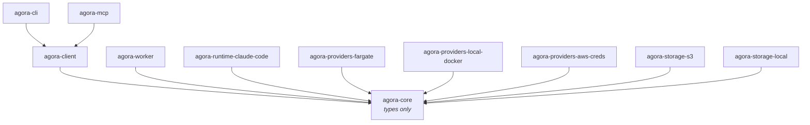

# agora

A registry-backed dispatch SDK for sub-agent compute workloads. Integrators
register **capabilities**, **subagents**, and **env bundles** once at deploy
time, then **dispatch** against them at run time — the same code path
running locally against Docker as in production against Fargate + S3.
Provider seams (compute, credentials, storage, channel, result sink) keep
the registry shape and dispatch contract identical across environments.

## Install

```bash
pnpm add @quarry-systems/agora-client
```

The caller-side SDK pulls in `@quarry-systems/agora-core` (interface
contracts only) transitively. Provider packages — `agora-providers-*`,
`agora-storage-*` — are composed at the deployment boundary; install only
the ones your target stack uses.

## Hello World

```typescript
import { AgoraClient, NoopCredentialProvider, StdoutResultSink } from '@quarry-systems/agora-client';
import { LocalStorageProvider } from '@quarry-systems/agora-storage-local';
import { LocalDockerProvider } from '@quarry-systems/agora-providers-local-docker';

const client = new AgoraClient({
  namespace: 'hello-world',
  compute: { 'local-docker': new LocalDockerProvider({ allowUnpinnedImage: true }) },
  credentials: { none: new NoopCredentialProvider() },
  storage: new LocalStorageProvider({ rootDir: '/tmp/agora' }),
  targets: { local: { compute: 'local-docker', credentials: 'none' } },
  resultSink: new StdoutResultSink(),
});

await client.capabilities.register({ name: 'echo-cap', files: { 'agora-setup.sh': '#!/bin/sh\necho "hello from agora-worker"\n' } });
await client.subagent.register({ name: 'echo', systemPrompt: 'Just exit.', capabilities: ['echo-cap'] });
await client.env.register({ name: 'minimal', values: { LOG_LEVEL: 'info' } });

const result = await client.dispatch({ subagent: 'echo', env: 'minimal', target: 'local', workerImage: 'ghcr.io/quarrysystems/agora-worker:latest' });
console.log(result.stdout);
```

The full runnable version (with mkdtemp + cleanup, comments, and a
Fargate + S3 production variant) lives at
[`examples/hello-world/`](examples/hello-world/).

## What's in this repo

Eleven packages under `packages/`:

| Package | One-liner |
|---|---|
| [`agora-core`](packages/agora-core/) | Types-only contract package. Every other agora package depends on this; nothing depends on anything else by default. |
| [`agora-client`](packages/agora-client/) | Caller-side SDK. `AgoraClient` is the single entry point integrators construct: registration + dispatch surface, with wired-in providers. |
| [`agora-cli`](packages/agora-cli/) | The `agora` binary. Thin CLI over `AgoraClient` that resolves `agora.config.{ts,js,mjs}` and dispatches to subcommands. Canonical privileged entry point. |
| [`agora-mcp`](packages/agora-mcp/) | Stdio MCP server exposing exactly six run-time, orchestration-safe tools. `register` / `assign` are deliberately absent — privileged ops never reach the AI loop. |
| [`agora-worker`](packages/agora-worker/) | Container-side runtime. One process per dispatch. Fetches bundles, verifies integrity, overlays the workspace, resolves secrets, hands off to a `RuntimeAdapter`. |
| [`agora-runtime-claude-code`](packages/agora-runtime-claude-code/) | MVP `RuntimeAdapter` implementation. Prompt rendering, `claude --print` invocation, Claude-specific merge rules, `needs_input` sentinel detection. |
| [`agora-providers-fargate`](packages/agora-providers-fargate/) | `ComputeProvider` backed by AWS ECS Fargate (`RunTask` / `DescribeTasks` / `StopTask`). Production target. |
| [`agora-providers-local-docker`](packages/agora-providers-local-docker/) | `ComputeProvider` backed by the local Docker daemon via `dockerode`. Developer iteration + local smoke suite. |
| [`agora-providers-aws-creds`](packages/agora-providers-aws-creds/) | `CredentialProvider` wrapping the AWS SDK default credential chain. Lazy resolution, no extra caching. |
| [`agora-storage-s3`](packages/agora-storage-s3/) | `StorageProvider` backed by S3. Content-addressed object layout, integrity-verified on read. Production target. |
| [`agora-storage-local`](packages/agora-storage-local/) | `StorageProvider` backed by the local filesystem. Pairs with `agora-providers-local-docker` for the local stack. |

Plus:

- [`examples/`](examples/) — runnable worked examples, beginning with
  [`hello-world/`](examples/hello-world/) (the §4.4 worked example, also
  the integrator on-ramp).
- [`docs/decisions/`](docs/decisions/) — ADRs for the substantive design
  decisions taken during MVP design.
- [`docker/`](docker/) — the published worker OCI image build context.

## User guides

Start here if you're new:

- [Getting started](docs/getting-started.md) — zero-to-first-dispatch on
  local Docker. Build the worker image, write `agora.config.mjs`, wire the
  CLI and MCP server, register and dispatch.

Reference:

- [Dispatch lifecycle](docs/dispatch-lifecycle.md) — what each event in the
  worker stdout stream means, which lifecycle step each `dispatch.failed`
  reason maps to.
- [Capability recipes](docs/capability-recipes.md) — where to put files so the
  worker picks them up (skills, settings, plugins, setup scripts), and the
  `agora-setup.sh` single-slot constraint that catches first-time authors.
- [Sync providers](docs/sync-providers.md) — `agora capabilities sync` /
  `agora subagent sync` reference, the `claude-code` and `stoa` providers
  shipped today, and how to author a new one.
- [needs_input](docs/needs-input.md) — how a sub-agent pauses for
  clarification, what the orchestrator does with the question, and how
  re-dispatch threads continuity through `partial_state`.

Extension + deployment:

- [Writing a provider](docs/writing-a-provider.md) — plug in a new compute
  backend, storage layer, credential source, or result sink.
- [Remote dispatch over SSH](docs/remote-dispatch-windows.md) — orchestrate
  from one machine, run workers on another machine's Docker daemon.

## Architecture

The package dependency graph (§8 of the spec). `agora-core` is the
types-only sink; every arrow flows toward it:



ASCII rendering of the same graph:

```text
agora-core                              (types only)
   ▲
   ├── agora-client                     (caller-side SDK)
   │     ▲
   │     ├── agora-cli                  (binary `agora`)
   │     └── agora-mcp                  (stdio MCP server, run-time tools only)
   ├── agora-worker                     (container-side runtime)
   ├── agora-runtime-claude-code        (RuntimeAdapter impl)
   ├── agora-providers-fargate          (ComputeProvider, AWS Fargate)
   ├── agora-providers-local-docker     (ComputeProvider, local Docker)
   ├── agora-providers-aws-creds        (CredentialProvider, AWS)
   ├── agora-storage-s3                 (StorageProvider, S3)
   └── agora-storage-local              (StorageProvider, local FS)
```

No agora package depends on another Quarry Systems library (Stoa,
Bedrock, RaState, etc.). The constraint is enforced by a CI allowlist
check on `package.json` dependencies.

## Documentation

- [Full MVP design spec](docs/superpowers/specs/2026-05-21-agora-mvp-design.md) — the §1–§11 design canon.
- [Architecture decisions](docs/decisions/) — sixteen ADRs covering
  package scope, repo location, runtime-adapter seam, secret TTL,
  lifecycle vocabulary, MCP auth model, and more.
- [Examples](examples/) — worked, runnable demonstrations against the
  local provider stack.

## Common commands

```sh
pnpm install            # install workspace deps
pnpm -r run lint        # lint every package
pnpm -r run test        # test every package
pnpm -r run typecheck   # typecheck every package
pnpm -r run build       # build every package
```

## License

See [`LICENSE`](LICENSE).
