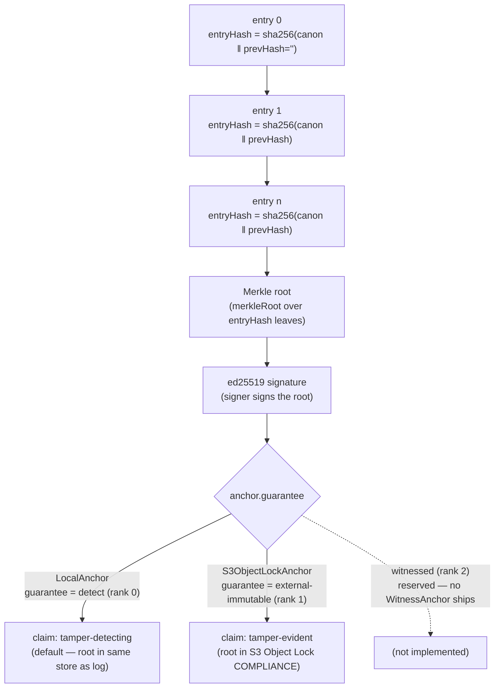
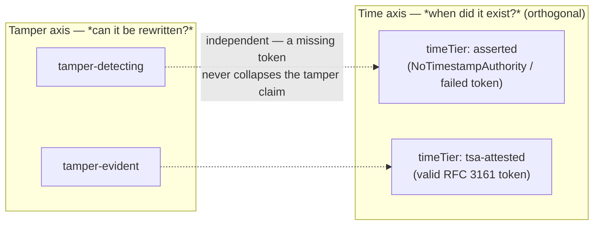

When an offload run finishes, Pangolin Scale can produce a verifiable record of exactly
what ran, with what inputs, under whose authority, and what each item produced.
That record is the **audit bundle**. But "verifiable" is a word that earns very
different weight depending on *where the proof lives* — and Pangolin Scale is deliberate,
to the point of pedantry, about not claiming more than the deployment can prove.

This page explains how the trail is built, the two strengths of claim it can
carry, and — just as importantly — what each strength does **not** buy you.

## How the trail is built

The audit trail for a run is an append-only, hash-linked log sealed under a
single signed root. Three pieces work together.

**1. A per-entry hash chain.** Every meaningful event in a run — `run.submitted`,
`item.fired`, `item.reconciled`, `item.retried`, `item.skipped`,
`run.cancelled`, `run.completed` — is recorded as an `AuditEntry` and stored as a
row carrying two extra fields: `entryHash` and `prevHash`. Each entry's hash is
computed over its canonical serialization *plus the previous entry's hash*:
`sha256(canonStr + prevHash)`, with the genesis entry's `prevHash` being the
empty string. Because each link folds in the one before it, you cannot alter,
reorder, insert, or drop a single entry without breaking the chain from that
point forward.

**2. A Merkle root over the chain.** The entry hashes become the leaves of a
Merkle tree, and the tree is reduced to a single 32-byte **root**. This root is a
compact commitment to the *entire* sequence of entries: change anything anywhere
and the recomputed root no longer matches.

**3. A signed, anchored root.** The root (optionally signed) is handed to an
**anchor**, which persists it somewhere and hands back a receipt. The anchor is
the part that decides how strong the eventual guarantee is — and it is configured
by the operator at deploy time, never asserted by the run itself.

The assembled `AuditBundle` the CLI emits carries the manifests, the audit log
(entries + anchored root), the per-item outcomes (refs only — never the patch
values themselves), and a `VerificationReport` that names the anchor and the
guarantee tier.

The whole pipeline — from hash-linked entries to the tier the anchor decides —
looks like this:



The `claim` is never asserted by the anchor directly: `verify` derives
`tamper-evident` only when `GUARANTEE_RANK[g] >= GUARANTEE_RANK['external-immutable']`
**and** every check passed; any failure collapses the claim back to
`tamper-detecting`, so the local tier is never labelled tamper-evident.

## What verification actually checks

`verify(runId, …)` does not trust a stored verdict; it recomputes everything and
compares. In order, it:

1. Replays the hash chain from genesis, recomputing each `entryHash` and checking
   the `prevHash` linkage — any break fails as `chain`.
2. Recomputes the Merkle root from the entry hashes.
3. **Fetches the anchored root from the anchor** — pointedly from the external
   anchor, not a local copy held next to the log. A missing or unreachable root
   fails as `anchor-missing`.
4. Compares the recomputed root to the anchored root — a difference fails as
   `root-mismatch`.
5. If the anchored root is signed and a verifier was supplied, checks the
   signature — a bad signature fails as `signature`.

Any one of these failures makes the report `intact: false`, and — this is the
crux — the report's `claim` collapses to `tamper-detecting` regardless of which
anchor was configured. You do not get to advertise a strong guarantee for a run
that did not verify.

## The two claims

The report carries a `claim` field with exactly two possible values, and the rule
deciding between them is one line in `verify.ts`:

```ts
const claim =
  GUARANTEE_RANK[g] >= GUARANTEE_RANK['external-immutable']
    ? 'tamper-evident'
    : 'tamper-detecting';
```

`GUARANTEE_RANK` orders the tiers `detect: 0`, `external-immutable: 1`,
`witnessed: 2`. So a run is licensed to call itself **`tamper-evident`** *only*
when its anchor's guarantee is at rank `external-immutable` or higher — and only
when verification passed end-to-end. Everything else is **`tamper-detecting`**.

| `claim` | When | What it means |
|---|---|---|
| `tamper-detecting` | anchor guarantee `detect`, or any verification failure | The log is internally consistent and any modification *will be caught on verify*. |
| `tamper-evident` | anchor guarantee ≥ `external-immutable` **and** verification passed | The anchored root lives in a separate trust domain that resists rewriting, so the record stands even against an actor who controls the run database. |

## The anchor tiers

The `Guarantee` union has three members. Two have implementations today; one is
reserved.

### `detect` — `LocalAnchor` (the default)

`LocalAnchor` stores the signed root in the **same store as the log** (in the
offload service, the run-state SQLite database). Its `id` is `local` and its
`guarantee` is `detect`. This is the default tier, and it is genuinely useful: it
catches accidental corruption, a clumsy hand-edit, a buggy migration — anything
that mutates the log without also recomputing and re-anchoring a matching root
will be caught when `verify` recomputes the Merkle root and compares.

What it **does not** do: defend against an actor who has write access to the
store. Because the log and the root it is checked against live in the *same*
place, someone who can rewrite the log can also rewrite the root to match. The
recomputed root would then agree with the anchored root and verification would
pass. `LocalAnchor` therefore proves *consistency*, not *immutability* — which is
exactly why a `detect`-tier run reports only `tamper-detecting`, never
`tamper-evident`.

### `external-immutable` — `S3ObjectLockAnchor`

`S3ObjectLockAnchor` writes the signed root to an **S3 object under Object Lock in
COMPLIANCE mode**, with a retention period (default 3650 days). Its `guarantee` is
`external-immutable`. COMPLIANCE-mode Object Lock means the object cannot be
overwritten or deleted before its retention expires — *not even by the account
root user*. The root now lives in a different trust domain from the run database.

This is the tier that resists the attack `LocalAnchor` cannot. An actor who
rewrites the log and recomputes a fresh root still cannot replace the *anchored*
root — it is locked in S3. So `verify` fetches the immutable anchored root, finds
the recomputed root no longer matches, and fails as `root-mismatch`. The tamper is
caught precisely because the evidence of "what the root was" is held somewhere the
tamperer cannot reach. This is the only tier whose successful verification earns
the `tamper-evident` claim.

Its strength is also bounded honestly: it is exactly as strong as S3 Object Lock
COMPLIANCE mode. It is not a third-party witness, not a notarization, not a
certification — it is "an immutable object in your own (or your customer's) AWS
account."

### `witnessed` — reserved, not implemented

`witnessed` (rank 2) exists in the `Guarantee` union and in `GUARANTEE_RANK`, but
**there is no anchor that returns it** — no `WitnessAnchor` class ships today. The
intended meaning is pushing the root to a *cross-organization* witness (an RFC
3161 timestamp authority or a transparency log), for parties who will not trust
even their own WORM administrator. It is a reserved tier, additive by design, and
deliberately left as a type member so the verification rule already accommodates
it the day an implementation lands. Until then, the highest claim any real
deployment can earn is `tamper-evident` via `external-immutable`.

## Trusted time — a separate dimension

The anchor tiers above answer **"can the record be rewritten?"** They say nothing
about **"can you prove *when* the record existed?"** Those are different questions,
and Pangolin Scale keeps them as **separate, orthogonal dimensions** so that one
never silently weakens the other.

Trusted time is carried by a `timeTier` field on the report, with exactly two
values:

| `timeTier` | When | What it means |
|---|---|---|
| `asserted` | No timestamp token, or a token that could not be obtained/verified | The timestamps in the log are **self-asserted** by the run — true if you trust the operator's clock, but not independently provable. This is the **floor**, and it is self-evidencing: an `asserted` report openly says "this time is asserted, not attested." |
| `tsa-attested` | A valid RFC 3161 timestamp token over the anchored root | A **third-party time-stamping authority** has cryptographically attested that the root existed at a given instant. Independently provable, independent of the operator's clock. |

Trusted time is produced by a pluggable **`TimestampAuthority`** seam, configured on
the `AuditLog` at deploy time (never asserted by the run). Three implementations
ship:

- **`NoTimestampAuthority`** — the default and the floor. Emits **no token** and
  makes **no egress**. The report's `timeTier` is `asserted`.
- **`Rfc3161TimestampAuthority({ url })`** — calls a real RFC 3161 TSA at the given
  URL and attaches the returned token to the anchored root. A successful token earns
  `timeTier: 'tsa-attested'`.
- **`LocalCaTimestampAuthority`** — an offline/test authority that issues tokens
  from a local CA, for exercising the `tsa-attested` path without network egress.

The wiring: `AuditLog` gained an optional `timestamper` (the authority) and an
optional `onTimestampFailure` hook; `AnchoredRoot` gained an optional `timestamp`
token alongside the root and its signature.

**The key invariant — time is orthogonal to the tamper claim.** A failed,
unreachable, or absent timestamp **never** downgrades the `claim`. A
`tamper-evident` run with no TSA configured is still `tamper-evident`; it is simply
`tamper-evident` + `timeTier: asserted`. The only thing a timestamp failure does is
leave (or set) `timeTier: 'asserted'`. The two axes compose freely:



This is the same honesty discipline as the tamper claim, applied to time: the report
states *exactly* what it can prove on each axis, and a weaker result on one axis
leaves the other untouched.

## What each tier does *not* guarantee

Being precise about the ceiling matters as much as the floor.

- **No tier proves the *content* of the work was correct, safe, or reproducible.**
  The audit trail proves *what ran and what it produced* (by reference), not that
  the output is good. Pangolin Scale's copy says "compliance-ready," never "compliant,"
  "certified," or "reproducible AI output."
- **`tamper-detecting` does not prevent or survive a determined rewrite.** An actor
  with write access to the store can rewrite both the log and the local root so
  that verification passes. The local tier catches *modification on verify* under
  an honest store; it is not evidence against someone who controls the database.
- **`tamper-evident` is only as strong as S3 Object Lock COMPLIANCE.** It survives a
  DB-side tamper because the anchored root is external and immutable — but its
  guarantee is bounded by that one mechanism, not by any cross-org attestation.
- **A failed or unanchored verification is never `tamper-evident`.** A missing
  anchored root, an unreachable anchor, or any mismatch drops the report to
  `tamper-detecting` no matter which anchor was configured. The claim describes
  *this verification of this run*, not the deployment's aspirations.

## The honesty constraints

Pangolin Scale enforces a vocabulary discipline, and it is intentional rather than
incidental:

- The word **"tamper-evident"** is licensed *only* at the `external-immutable` tier
  (or higher) on a run that actually verified. A `detect`-tier run is
  **"tamper-detecting"** and nothing stronger.
- Public copy says **"compliance-ready,"** never "compliant," "certified," or
  "reproducible."
- The `LocalAnchor` is **never** described as "tamper-evident" or "compliant" —
  this constraint is written into the acceptance example's own README and into the
  V1 design spec's honesty rules.

The reason is trust, not modesty for its own sake. The whole value of an audit
trail is that someone relying on it can take its claim at face value. A guarantee
that overstates itself is worse than a weaker one stated accurately, because it
fails exactly when it is leaned on. So Pangolin Scale makes the system, the report, and the
docs all say the same conservative thing — and where the code is conservative,
this page is too.

## Where to go next

- [Export & verify an audit bundle](/pangolin/how-to/verify-audit-bundle/) — produce a
  bundle and read its report, tier and all.
- [CLI reference](/pangolin/reference/cli/) — the `pangolin orch audit` command and its
  output shape.
