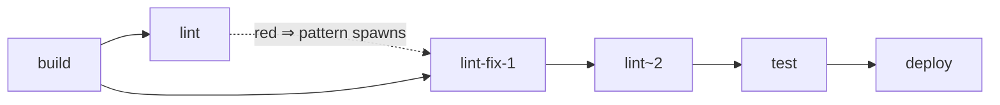

The core tick engine described in [How an offload run executes](/agora/explanation/how-offload-runs/)
handles one responsibility: advancing a fixed DAG of **WorkItems** through their
status lattice. Execution patterns are a separate layer built *on top of* that
engine — they let a queue answer a richer question: "now that some items have
finished, should the run grow?" This page explains the pattern layer, how you
configure it per queue, and the invariants that keep dynamically grown graphs
safe and auditable.

## What execution patterns are

An **execution pattern** is a per-queue strategy object that the orchestrator
consults *after* the engine tick has advanced item states. The pattern contract
has two hooks:

- `plan(run)` — runs once at `submitRun` time, before `validateRun`. It may
  expand or normalize the submitted run (and may throw a descriptive `Error` on
  malformed pattern config, which `submitRun` surfaces before the store is
  touched). `static-dag` returns the run unchanged.
- `onTaskDone(item, ctx)` — called for each terminal item of every in-scope run,
  on every tick, until the run seals. The pattern returns either `null` (no
  spawn) or a `SpawnDirective` carrying a list of new `WorkItem`s to append. The
  call is pure: `ctx.runItems` is a snapshot of the run's items, de-namespaced,
  and the pattern never touches the store directly.

Three patterns ship in the engine:

- **`static-dag`** — `plan` is the identity; `onTaskDone` always returns `null`.
  The run's DAG is fully specified at submit time and never changes.
- **`pipeline`** — `plan` linearizes the submitted items into a chain (each
  item with `depends_on: []` after the first gets a dependency on its
  predecessor). At runtime, `onTaskDone` watches for a **gate item** —
  identified by an `inputs.gate: GateConfig` payload — that lands in a "red"
  state (`failed`, or `done` with `verify.passed === false`). On a red gate with
  `onRed: 'spawn-fix'`, the pattern spawns a remediation lineage (see
  [Gate/respawn below](#gaterespawn-the-pipeline-circle-back)).
- **`map-reduce`** — `plan` validates that the run carries at most one splitter
  item (an item with `inputs.mapReduce: MapReduceConfig`). At runtime, when the
  splitter is `done`, `onTaskDone` reads its `outputRefs` and spawns one
  `map-<key>` item per output key. When every spawned `map-<key>` is `done`,
  `onTaskDone` then spawns a single `reduce` item whose `needs` bind each map's
  output.

All three implement the same `Pattern` interface and reuse the identical engine.
The pattern layer is purely an *item producer* — scheduling, locking, and
concurrency remain the engine's job.

## Queue-level pattern binding

Patterns are bound to queues programmatically through `AgoraOrchestratorOptions`,
not via a config file. A queue without a `pattern` has no pattern phase at all;
binding `staticDag` explicitly produces the same behaviour with one no-op call
per terminal item.

```ts
import { AgoraOrchestrator } from '@quarry-systems/agora-orchestrator';
import { mapReduce, pipeline } from '@quarry-systems/agora-orchestrator/patterns';

const orchestrator = new AgoraOrchestrator({
  store,
  executors,
  triggers,
  queues: {
    default: { concurrency: 1 },                       // no pattern → static behaviour
    nightly: { concurrency: 4, pattern: mapReduce },
    ci:      { concurrency: 2, pattern: pipeline   },
  },
});
```

`QueueConfig` is the minimal shape `{ concurrency: number; pattern?: Pattern }`.
There are no string-keyed `pattern.type` selectors and no queue-level
`splitterExecutor`/`mapExecutor`/`reduceExecutor`/`stages`/`gateExecutor`
fields — per-pattern configuration travels on the *items themselves* (the
splitter carries `inputs.mapReduce`; gate items carry `inputs.gate`).

There is no startup-time pattern-config validation step. Pattern config is
validated at `submitRun` inside `pattern.plan(run)`, which runs *before*
`normalizeRun` and `validateRun`. A throwing `plan` rejects the submission
before `saveRun` is called, so a malformed `inputs.mapReduce` payload (for
example) becomes a submit-time `Error`, not a per-run runtime failure, and the
store stays clean. The orchestrator keeps the per-queue bindings in a plain
`Record<string, Pattern | undefined>` (no dedicated registry type).

At runtime, after each `tick()` call on a queue, the orchestrator runs the
**pattern phase**: it groups the queue's items by `runId`, builds a
de-namespaced logical view, and calls `collectSpawns(view, pattern)`.
`collectSpawns` walks each terminal item and calls
`pattern.onTaskDone(item, { runItems: view })` once per terminal item; each
non-null `SpawnDirective` becomes one `extendRun` call. Runs whose audit epoch
has already sealed are skipped using the same guard as the seal block.

## The `extendRun` seam

Spawn directives from the pattern phase are not applied directly. They flow
through **`extendRun`**, the single audited gateway for all post-submit
mutations to a run:

1. **Id-skip.** Any spawn item whose namespaced id already exists in the store
   is dropped silently. This makes pattern replay idempotent: if the
   orchestrator crashes mid-extension and the pattern phase re-runs, the
   duplicate directive is absorbed as a no-op.
2. **Runaway fuse.** If `existing.length + fresh.length` would exceed
   `maxItemsPerRun` (default 1000), `extendRun` throws and no items are written.
3. **Validate.** The fresh items are normalized (auto-unioning
   `needs[*].from` into `depends_on`) and merged with the existing run graph
   in logical-id space; the merged graph is run through the same `validateRun`
   call used at submit time. Any item that references a non-existent dependency,
   names an invalid lock key, or conflicts with an existing item id causes
   `extendRun` to throw — the store is left unchanged.
4. **Write.** Valid items are namespaced and saved through the same `saveRun`
   path used at submit. Items land as `pending`.
5. **Audit.** `extendRun` appends a single `run.extended` audit entry per call
   (per spawn batch). The append is wrapped in a try/catch — a failing audit
   sink must not abort the write — and the entry names the cause item, but does
   not carry the spawn payload.

Because the pattern phase runs **before** the seal check in the same tick, a
run whose graph just grew has `pending` items in it when the seal check
inspects it. A run never seals with phantom-unseen items: the engine always
drains what the pattern produced before declaring the run complete.

`extendRun` is marked internal in v1: the pattern phase is its sole intended
caller. The orchestrator's `applyPatternPhase` wraps each `extendRun` call in a
try/catch so that a spawn-validation failure for one run logs to stderr but
does not abort the tick — best-effort posture per spec §4.

## `run.extended` audit entries

```jsonc
// excerpt from an audit bundle
{
  "kind": "run.extended",
  "runId": "nightly@2026-06-07T02:00:00Z",
  "itemId": "split",
  "actor": "pattern:nightly",
  "at": "2026-06-07T02:00:12.345Z"
}
```

The `itemId` field names the **cause item** — the terminal item whose
completion produced the spawn — and `actor` is the literal string
`pattern:<queue-name>`. There is no `queueName`, no `causeResultRef`, no
`spawnedItems` payload, and no embedded directive. The entry is a single-line
marker; the appended items themselves are visible through the store, and the
cause's `resultRef` / `outputRefs` can be read from the same audit export as
part of the cause item's row.

To reconstruct *why* a dynamically appended item exists, an auditor cross-walks
the run: the `run.extended` entries record which cause-item completion drove
each spawn batch, and the per-item audit rows (with their `resultRef`,
`outputRefs`, and `dispatchHash`) anchor the artifacts the pattern was reading
from.

## Gate/respawn: the pipeline circle-back

The `pipeline` pattern introduces a named **gate item** between stages. A gate
is any item that carries an `inputs.gate: GateConfig` payload:

```ts
interface GateConfig {
  onRed: 'advance' | 'spawn-fix';
  subject: string;              // itemId whose product is being gated
  fixTemplate?: SpawnTemplate;
  maxFixAttempts?: number;      // default 1
}
```

The pipeline's `onTaskDone` only fires when a gate item with
`onRed: 'spawn-fix'` reaches a red terminal state. "Red" means either
`status === 'failed'` *or* `status === 'done'` with `verify.passed === false`.
A green gate produces no spawn — downstream stages already depend on the gate
via the static chain set up by `plan`, so they advance through the engine's
normal path. A `cancelled` gate also produces no spawn.

On a red gate, the pattern calls `respawnLineage`, which produces a
deterministic lineage:

- **Fix item.** Id `${base}-fix-${attempt}` (where `base`/`attempt` come from
  `parseAttempt(gate.id)`), executor and inputs from `config.fixTemplate`,
  `depends_on: [config.subject]`, `needs.work` bound to the subject's `patch`
  output. If the gate is `done`-but-red and exposed an `outputRefs.findings`
  artifact, `needs.findings` is bound to it; if the gate `failed`, the gate's
  `reason` is folded into the fix's inputs as `gateReason` (a failed gate has
  no outputRefs).
- **Gate copy.** Id `${base}~${attempt+1}`. Carries the same executor / inputs
  / locks as the original gate, but its `depends_on` and `needs[*].from` are
  remapped through a substitution map that sends `config.subject → fixId` and
  `gate.id → gateCopyId`. The copy therefore depends on the fix instead of the
  subject directly.
- **Skipped-descendant copies.** Items that depend on the failed gate
  (directly or transitively) and ended this tick as `skipped` are reissued as
  `${parseAttempt(d).base}~${attempt+1}`, with their edges remapped through the
  same substitution map.

Respawn is blocked in three cases: no `fixTemplate` configured, any lineage
member observed in `cancelled` state, or the gate's parsed `attempt` already
exceeds `maxFixAttempts`.



`lint` and `lint~2` are distinct item ids. Solid arrows are `depends_on`
edges; the dotted arrow marks the pattern's spawn trigger, not a graph edge.
The failed `lint` stays permanently in history; the fix and gate copy extend
the run forward.

## The forward-arc-never-rewind invariant

All of the above rests on one structural guarantee: **spawned items may only
introduce edges that point at already-existing items. No existing item is ever
mutated to point at a newly spawned item.**

Concretely: `extendRun` only ever *appends* items. It calls `saveRun` with a
batch of fresh items; it never updates the depends_on of items already in the
store. The merged-graph `validateRun` call confirms that every `depends_on` in
the spawn batch resolves against the merged set (existing logical items plus
fresh ones). Existing topology is immutable once written.

This invariant is what keeps execution patterns safe:

- **Acyclicity is preserved.** Because new items only point backward, and
  existing items are never rewritten to point forward at new items, the merged
  graph cannot gain a cycle. The engine's `depends_on` semantics rely on the
  DAG being acyclic.
- **Replay is deterministic.** Patterns are pure functions of the run snapshot,
  and spawn ids are derived deterministically from item-level facts —
  `map-<outputKey>` from the splitter's `outputRefs` keys (sorted) and the
  literal `reduce` in map-reduce; `${base}-fix-${attempt}` and
  `${base}~${attempt+1}` from `parseAttempt(gate.id)` in respawn. Queue name
  does not enter into spawn ids. `extendRun`'s id-skip absorbs duplicates
  silently, so a crash mid-extension and re-run of the pattern phase reproduces
  the same outcome.
- **Audit closure is total.** Because no existing item ever points at a newly
  spawned item, every product consumed by a spawned item was already recorded
  before the extension. `agora verify`'s provenance-closure check can walk the
  entire graph — including dynamically grown branches — using exactly the same
  algorithm it applies to static DAGs.

The invariant can be summarised as: **the past is append-only, the future is
forward-only**. A pipeline circle-back is not a loop in the graph — it is a
new lineage appended ahead of the failed branch, with no edge reaching backward
into already-sealed history.

## Interaction with sealing and the tick order

The full per-tick order on a pattern-bound queue is:

1. **Engine tick** — the standard ready/reconcile/fire/cascade flow.
2. **Pattern phase** — `applyPatternPhase(queue)` groups items by `runId`,
   builds a de-namespaced view, and calls `collectSpawns(view, pattern)`, which
   invokes `pattern.onTaskDone(item, ctx)` once per terminal item.
3. **`extendRun` per directive** — each non-null `SpawnDirective` is applied
   through `extendRun`, with each spawn failure caught and logged to stderr so
   that one bad spawn does not abort the tick.
4. **Seal check** — for each `runId` on the queue whose audit epoch is not yet
   sealed, if every item is in a terminal status (`done` / `failed` / `skipped`
   / `cancelled`), append a `run.completed` audit entry and call
   `sealEpoch(runId)`. Both calls are best-effort: an audit failure must not
   throw out of `tick()`.

Steps 2–3 are a no-op for queues without a pattern (the orchestrator returns
immediately when `patterns[queue]` is `undefined`). For queues bound to
`staticDag`, the loop still runs but every `onTaskDone` call returns `null`, so
no `extendRun` calls happen. In either case the seal check at step 4 always
sees the post-extension state, so a run extended in step 3 defers sealing to a
future tick — its freshly inserted items are `pending`, not terminal.

If the pattern phase produces no spawns (either because no items newly
terminated this tick, or because all terminal items were already absorbed by
id-skip), steps 2–3 add no overhead beyond the pattern's `onTaskDone` calls,
which are expected to be O(terminal items) and free of I/O.

## See also

- [How an offload run executes](/agora/explanation/how-offload-runs/) — the core
  tick engine that execution patterns sit above.
- [plan.json schema](/agora/reference/plan-json/) — the WorkItem fields that
  patterns populate when spawning (`depends_on`, `resourceLocks`, `executor`,
  `needs`).
- [Audit & guarantee tiers](/agora/explanation/audit-guarantee-tiers/) — how
  `run.extended` entries are covered by the audit bundle and what `agora verify`
  checks.
- [Architecture overview](/agora/explanation/architecture-overview/) — where
  patterns fit in the whole system.
