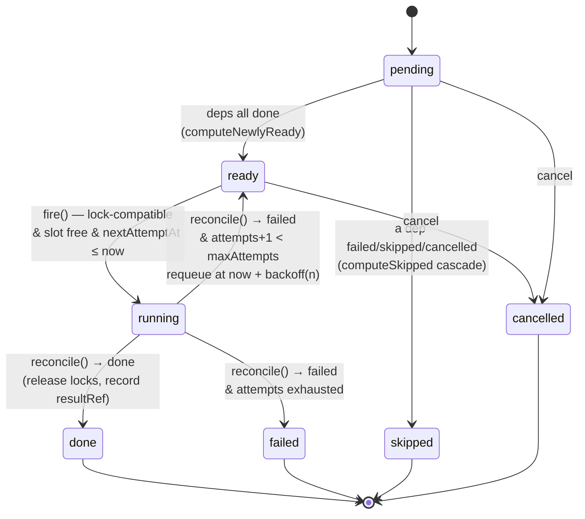

A single [`agora dispatch`](/agora/reference/cli/) runs one unit of work *now* and
blocks until it exits. An **offload run** is different: you submit a whole DAG of
work, and a long-running daemon fans it out safely across an isolated worker pool,
unattended, producing a verifiable audit trail of exactly what ran. This page
explains *how* that scheduling happens — the mechanics behind the
[first offload run tutorial](/agora/tutorials/first-offload-run/), grounded in the
`agora-orchestrator` engine.

For the *shape* of a plan see the [plan.json reference](/agora/reference/plan-json/);
for where the run sits in the whole system see the
[architecture overview](/agora/explanation/architecture-overview/). This page is
about the algorithm in the middle.

## The model: Queue, Run, WorkItem

Three nouns carry the whole model.

- **Queue** — a long-lived named bucket with a fixed **concurrency** budget: the
  cap on how many items run at once. The example registers one queue, `default`,
  at `concurrency: 2`. Items are scheduled *per queue* — a tick advances exactly
  one queue.
- **Run** — one plan submission: a set of **WorkItems** and their `depends_on`
  edges, placed on a queue. It lives until every item reaches a terminal state.
- **WorkItem** — one dispatchable node: an `executor` plus `inputs`, with
  `depends_on` edges and `resourceLocks`.

Item ids are namespaced by run id internally (`${runId}\x1f${id}`) so two runs
that both contain an item called `verify` never collide; run ids and lock keys are
**not** namespaced — cross-run resource locks are intentional, so two runs on the
same queue contending for the same file serialize against each other.

## Two independent mechanisms for safe parallelism

Eligibility and parallelism are decided by two *orthogonal* mechanisms. This
separation is the heart of the design.

### `depends_on` — DAG ordering

An item is `pending` until **every** id in its `depends_on` has reached `done`.
The resolver is exact:

```ts
// engine/dep-resolver.ts — computeNewlyReady
items.filter((i) =>
  i.status === 'pending' &&
  i.depends_on.every((d) => status.get(d) === 'done'),
)
```

Note the bar is `done` specifically — not merely "terminal." An item whose
dependency `failed`, `skipped`, or was `cancelled` can *never* ready; instead it
**skip-cascades** (below). `depends_on` answers "is it allowed to run *yet*?"

### `resourceLocks` — file-level mutual exclusion

`resourceLocks` are opaque string keys (file paths by convention) that serialize
contending items *within a queue*. Two items whose lock sets are **disjoint** can
run at the same time; two items sharing **any** key cannot. Lock selection is a
greedy, stable-order pass over the ready items:

```ts
// engine/lock-manager.ts — selectRunnable
for (const c of candidates) {
  if (out.length >= slots) break;
  if (c.resourceLocks.some((k) => taken.has(k))) continue; // contends — skip this tick
  for (const k of c.resourceLocks) taken.add(k);
  out.push(c);
}
```

So the canonical "rename a symbol across the repo" job — one item per file, a lock
per file — fans out to the full queue concurrency, because every item's lock set
is disjoint. But anything touching a shared `package.json` declares that path as a
lock, and every item holding it serializes against every other. `resourceLocks`
answers "is it *safe* to run alongside what's already running?"

In the [fan-out example](/agora/tutorials/first-offload-run/) the three `edit-*`
items have disjoint per-file locks, so they are all eligible at once but only two
run together (the queue is `concurrency: 2`); the third starts as soon as a slot
frees. `verify` `depends_on` all three, so it waits regardless of locks.

## The fire-and-reconcile tick loop

The daemon never *pushes* work and never blocks on a running item. It **polls**:
each `tick()` advances one queue by one step, and the [`serve`](/agora/reference/cli/)
loop calls `tick()` on a fixed interval (2 s in the example). A single tick runs
four ordered phases:

1. **Ready.** Mark every `pending` item whose dependencies are all `done` as
   `ready` (`computeNewlyReady`).
2. **Reconcile.** For each `running` item, ask its executor `reconcile(dispatchHash)`.
   A still-running dispatch returns nothing and is left alone. A terminal result
   sets the item `done`/`failed`, **releases its locks**, and on success records
   the `resultRef`. Because reconcile may have just unblocked dependents, the ready
   phase is re-run once if anything reconciled.
3. **Fire.** Compute the open budget — `queueConcurrency - runningCount` — then
   `selectRunnable` picks that many lock-compatible `ready` items in array order,
   skipping any whose backoff gate (`nextAttemptAt`) is still in the future. Each
   selected item acquires its locks, the executor `fire()`s it (producing a signed
   dispatch manifest, refs only), and it moves to `running`.
4. **Cascade.** Any `pending` item with a dependency that is now
   `failed`/`skipped`/`cancelled` is set `skipped` — it can never ready. The
   cascade is single-pass per tick, so a deep chain settles over successive ticks
   rather than all at once.

This **fire-and-reconcile** split — fire is "start it and remember the handle,"
reconcile is "poll the handle later" — is what lets one daemon supervise many
concurrent dispatches without holding a thread per item, and it is the seam that
makes local→remote a config swap: the executor decides *how* a dispatch is fired
and polled.

Pulling the four phases together, a single item walks the `RunStatus` lattice
(`pending → ready → running` then a terminal status) like this:



The `running → ready` edge is the retry loop: a failed reconcile with attempts
remaining releases locks and requeues behind the `nextAttemptAt` backoff gate
(`backoff(n) = 1000 * 2 ** n` ms); only when `attempts + 1 < maxAttempts` is
false does the item go terminally `failed` and let the next tick's cascade
`skipped`-mark its dependents.

### Retry, skip-cascade, and settling

A `failed` reconcile with attempts remaining (default `maxAttempts: 2`) does not go
terminal: the item releases its locks and is **requeued** with an exponential
backoff (`1000 * 2 ** n` ms). Only when retries are exhausted does it become
terminally `failed`, at which point the next tick's cascade phase skips its
transitive dependents. A run is **settled** when nothing is `pending`, `ready`, or
`running` — every item terminal. The audit logging is deliberately **best-effort**:
a failing audit append is caught and dropped so it can never abort a tick or
corrupt run state.

### Crash recovery and idempotency

`submitRun` is idempotent — re-submitting a run whose items already exist is a
no-op, so a retried inbox delivery cannot double-ingest. On startup the daemon runs
`recoverStranded`: any item left `running` by a crashed process is treated as a
consumed attempt, has its locks released, and is requeued, so the run resumes
rather than wedging. `serve` also does one reconcile-first tick before entering its
loop.

## The patch escape: how results leave the sandbox

The sandbox is the product — by default nothing leaves the container. So how do
you get the work back? On a successful item, the worker captures its workspace diff
(`git diff`, excluding `.agora/`), uploads it to the `StorageProvider` as a
**content-addressed patch artifact**, and writes the artifact's ref into the
sentinel `.agora/output.json`. On reconcile, the executor reads that `patchRef` and
records it as the item's **`result_ref`**:

```
agora://<namespace>/artifact/<dispatchId>/sha256:<hash>
```

This is the one thing that escapes the sandbox by default, and it escapes as a
*reference*, not a value — `status`, `watch`, and the audit bundle all expose
`resultRef` per item, never the patch contents inline. You fetch the patch through
storage to review it. A run that changes nothing produces no `result_ref`. The
audit bundle's per-item records, likewise, carry refs only — never secret values —
so the bundle is safe to hand an auditor (see
[audit & guarantee tiers](/agora/explanation/audit-guarantee-tiers/)).

## See also

- [Your first offload run](/agora/tutorials/first-offload-run/) — run this end to end.
- [plan.json schema](/agora/reference/plan-json/) — every field of a Run / WorkItem.
- [Architecture overview](/agora/explanation/architecture-overview/) — where the run sits in the whole system.
- [Audit & guarantee tiers](/agora/explanation/audit-guarantee-tiers/) — what the audit bundle proves.
