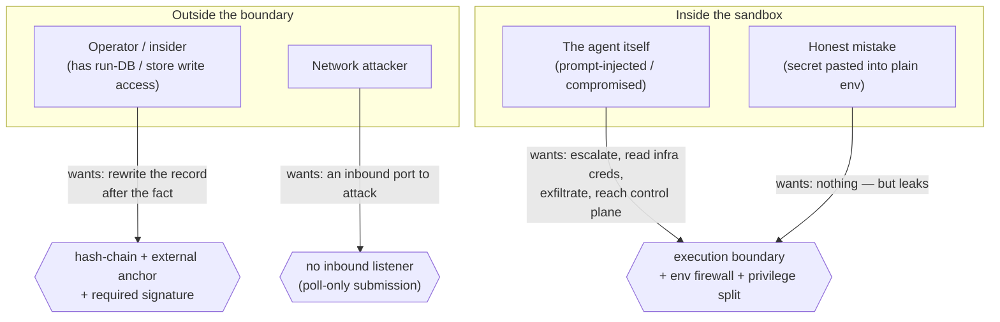

Most "secure agent" pitches list features. This page lists **threats** — the specific
attacks Pangolin Scale is built to blunt, where they show up when you actually run
autonomous agents, the mechanism that mitigates each one, and (just as deliberately)
the ones it does **not** defend against. Everything here is grounded in the shipping
code; where a control is roadmap or a non-goal, it says so.

## The stance

Pangolin Scale assumes the agent is **untrusted code** — a non-deterministic text
generator that may be steered by anything it reads (a repo file, a fetched web page, a
document it's summarizing, a tool result). So control cannot live *inside* the agent's
own toolbox, where a prompt can route around it. It lives in the **execution boundary**:
a throwaway sandbox that gets only the capabilities and secrets you grant at dispatch
time, and a control plane the agent has no verbs to reach. See
[Sandboxing AI agents](/pangolin/explanation/sandboxing-ai-agents/) for the "why."

The second half of the model is **evidence integrity**. Even with a perfect sandbox,
the value proposition — *prove what your agent did, and that it was allowed to* — fails
if the person operating the system can quietly rewrite the record afterward. So the
audit trail is built to resist tampering even by an actor who controls the run database.
See [Audit & guarantee tiers](/pangolin/explanation/audit-guarantee-tiers/).

One sentence: **the agent can't reach what it wasn't granted, and nobody — including the
operator — can silently rewrite what it did.**

## The adversaries

Pangolin Scale is designed against four distinct adversaries. They want different things
and are countered by different mechanisms.

**Who Pangolin Scale does _not_ defend against** — stated up front, because a threat model
that hides its assumptions is worthless:

- A **kernel or container-runtime escape (0-day)**. Isolation is container/namespace
  isolation, not a hardened microVM sandbox. A breakout vulnerability in the runtime is
  out of scope.
- A **malicious operator who holds the signing key**. The seal proves the record wasn't
  changed *after* signing; it cannot stop someone who legitimately controls the key from
  signing a false record in the first place. (Key custody is itself a
  [tracked gap](#non-goals--roadmap).)
- The **correctness, safety, or reproducibility of the work itself**. The audit proves
  *what ran and what it produced*, by reference — not that the output is good. Pangolin's
  copy says "compliance-ready," never "compliant" or "certified."
- **Whatever your storage backend's ACLs don't cover.** Submission authority is delegated
  to the storage layer (see [supply chain & network](#supply-chain--network)).

## Threat catalog

Each threat below is *where it shows up → how Pangolin mitigates it → the honest limit*.
The mitigations link to the deep-dive pages rather than restate them.

### Sandbox & privilege escalation

The agent is steerable by its inputs. The threats here are about what a steered agent can
*reach*.

| Threat | Where it shows up | Mitigation | Honest limit |
|---|---|---|---|
| **Privilege escalation** — the agent registers its own capabilities/subagents to grant itself more authority | Injected text in a repo or document tells the agent to "register a capability that runs X" | The verbs that define what a worker *is* (`register`/`assign`) are **operator/CLI-only and never on the agent's tool surface**. The MCP server exposes a frozen set of **nine run-time tools**; a CI allowlist fails the build if any `*_register`/`*_assign` name appears. See [The privilege boundary](/pangolin/explanation/privilege-boundary/). | Freezes the *tool surface*; what a (human-registered) capability does once it runs is governed by the firewall + redaction below, not this gate. |
| **Identity theft** — the agent inherits the worker's cloud creds and impersonates it to reach other tenants' data | A prompt-injected agent runs `env`/`printenv` and finds the worker's AWS chain or callback key | The worker→runtime **env firewall is default-DENY** (since [PR #71](https://github.com/quarrysystems/pangolin/pull/71)): only an allow-list of non-credential system vars crosses into the agent; every `PANGOLIN_*` var and the whole AWS credential chain are dropped. Creds the agent genuinely needs arrive separately via the scoped secret lane. See [credentials](#credentials). | An operator can re-open it via `PANGOLIN_RUNTIME_ENV_ALLOW`; a bare `*` re-opens everything. Operator footgun, documented in code, not blocked. |
| **Control-plane access** — the agent drives privileged/service verbs (cancel others' runs, the scheduler loop, the seal machinery) | The agent has legitimate `submit`/`status`/`watch` and probes for more | A privilege registry tags every operation `client`/`privileged`/`service` with an MCP-eligibility bit; only `submit`/`status`/`watch` are eligible. `cancel`, `serve`, `tick`, `audit` are never exposed as agent tools, enforced by the same CI gate. | Keeps privileged verbs off the AI surface; it does not itself authenticate the operator who runs the CLI-only verbs (that's a deploy boundary). |
| **Workspace breakout** — a crafted input key (`../../etc/...`) writes outside the sandbox | A malicious upstream node feeds an input keyed with path traversal | Input keys are rejected before they touch disk if they are absolute, contain `\`, or contain any `..`/empty segment; failure routes to `integrity-failed` and the agent never runs (`pangolin-worker/src/entrypoint.ts`). | The guard covers the **inputs** lane. Capability-bundle internal paths rely on register-time trust + content-hash pinning ([supply chain](#supply-chain--network)), not a second write-time traversal check. |
| **Cross-dispatch contamination** — one (compromised) dispatch leaves state a later one can read | Two dispatches share a host/daemon | Each dispatch runs in a **fresh container and a fresh temp workspace**; setup/verify children are time-bounded and the whole process group is killed on timeout; the per-dispatch secret dir is mounted **read-only**; worker images are **digest-pinned** (unpinned throws). | This is container/namespace isolation, **not** a hardened sandbox — no defense against kernel/runtime escape or side channels. |

### Credentials

The whole point of credential-sealing is that secrets reach the agent **scoped**, and
never leak into the places people read afterward (logs, the audit bundle).

| Threat | Where it shows up | Mitigation | Honest limit |
|---|---|---|---|
| **Secret in the logs** — a secret is echoed and lands in the worker's log stream / CloudWatch | A setup script or the agent prints `$API_KEY`; a tool logs a Basic-auth header | Per-dispatch **redaction that doesn't depend on classification**: the worker registers every resolved secret value **and** every plain env-bundle value (since PR #71) and substring-redacts them from all structured output before it's written. | Redaction is exact-substring: a secret that is **base64/URL-encoded or otherwise transformed** before printing won't match. It scrubs the worker's own stream, not bytes the agent sends over a network it was given access to. |
| **Secret in the evidence** — a resolved key ends up in the tamper-evident bundle the auditor reads | The manifest embeds an API key next to the image digest | The manifest carries secret **references only, never values**; `buildManifest` hard-rejects any non-string ref. The sealed bundle is refs + hashes. | A *reference* (e.g. an ARN) is recorded in the clear by design — it discloses account/secret-name/region, not the value. |
| **Over-broad environment** — a worker infra cred is handed to the agent | Naive "pass the whole env through" | Default-deny env firewall (above). **Asymmetry to know:** allow-listed pass-through vars are *not* added to the redaction set — so **never allow-list a credential**; route every credential through the scoped, redacted secret lane. | The asymmetry is a real operator footgun; it is documented, not prevented. |
| **Creds in plain env (honest mistake)** | A developer pastes an AWS key into an env bundle's `values:` instead of `secrets:` | A **credential-shape scanner** runs at registration and throws on AWS/GitHub/Anthropic/OpenAI/Google/Slack/Stripe/JWT/PEM/Bearer shapes, disclosing only the first 8 chars in the error. | It's a *shape heuristic*, not a classifier — it misses generic high-entropy secrets, raw DB passwords, and unknown token formats. This is exactly why redaction (above) now covers plain values too: belt and suspenders. |
| **Secret at rest** | Staged plaintext on the dispatch host | Local store writes each value `0600` in a private scratch dir; AWS uses Secrets Manager (KMS-managed); the dir is mounted read-only into the container; per-dispatch secrets carry a TTL and a `dispatchId` tag swept on teardown. | `0600` doesn't protect against root or a same-uid process; the "private scratch dir" rule is a documented contract, not a runtime assertion. |

### Audit integrity

These adversaries don't attack the run — they attack the **record of the run**, after the
fact. The mechanisms and the exact strength of each claim are detailed in
[Audit & guarantee tiers](/pangolin/explanation/audit-guarantee-tiers/); this is the
threat-indexed view.

| Threat | Where it shows up | Mitigation | Honest limit |
|---|---|---|---|
| **Hiding an action** — delete/reorder/insert an entry and re-link the log to look consistent | An insider removes the `item.fired` row for an action they want hidden | A per-entry **hash chain** folds in the previous hash, a **Merkle root** commits to the whole sequence, and verify enforces **sequence contiguity** — so a deleted-then-re-linked entry is still caught. | This is detection on *verify*. Under the default local anchor it proves *consistency*, not *immutability* (next row). |
| **Rewriting the whole log** — someone with DB write access rewrites the log and recomputes a matching root | A privileged insider edits the run database | The signed root is anchored **externally** in **S3 Object Lock (COMPLIANCE mode)** — immutable even to the account root for the retention window. Verify fetches the *anchored* root, not a local copy, and a mismatch fails. This is the only tier that earns **`tamper-evident`**. | Exactly as strong as S3 Object Lock COMPLIANCE — not a notarization or cross-org witness. The default `LocalAnchor` is only `tamper-detecting`. The `witnessed` tier is reserved, not implemented. |
| **Forging the anchored root** — re-PUT a newer S3 version, or slip an unsigned forgery in | An attacker with bucket write tries to supersede the locked root | Verify reads the **earliest (original) S3 version**, so a later forged version is ignored ([PR #69](https://github.com/quarrysystems/pangolin/pull/69)); and the `tamper-evident` claim **requires a verified signature** ([PR #70](https://github.com/quarrysystems/pangolin/pull/70)), so a same-second unsigned forgery collapses the claim to `tamper-detecting`. | The signature is only as trustworthy as the signing key — see the [custody gap](#non-goals--roadmap). |
| **Disputing _when_ it ran** | "You backdated this; you just set the clock" | An orthogonal **trusted-time** axis: an RFC 3161 timestamp token over the root yields `timeTier: tsa-attested`; without one it's honestly `asserted`. Time never silently weakens the tamper claim. | `tsa-attested` requires the auditor to supply trusted TSA CA certs; the default emits no token (floor: `asserted`). |
| **"Trust us" verification** | An auditor must verify without trusting the vendor | A **standalone `pangolin-verify`** binary takes a bundle in and a report out, recomputing everything (it never trusts a stored verdict) and checking signatures against an auditor-supplied **published public key**. | Offline (no live anchor fetch) caps at `tamper-detecting`; the published-key trust root is the auditor's to distribute. |

#### Signing-key trust: the anchor and the trust root are not the same thing

Two of the rows above lean on the signing key (forging the anchored root, "trust us" verification), so it is worth being precise about *where the key's authenticity comes from* — because it is a common point of confusion. Pangolin has **two** "roots", and they defend different things:

- The **WORM anchor** is an S3 Object-Lock store that holds the Merkle **root hash**. It proves the ledger was not altered after sealing. It is a live bucket written to at seal time.
- The **trust root** is a published, static, **public** file that holds the signing **public key(s)** — keyed by a stable `keyRef`, with a lifecycle status. It proves *which key* signed a bundle. It contains no secrets, runs nothing, and is read only by the verifier.

The designed resolution to the [signing-key-custody gap](#non-goals--roadmap) follows from that split: in production the private key lives in a **KMS/HSM** and never leaves it, while the matching **public key is published out-of-band** as that static trust-root file (a docs-site URL over TLS, a signed git tag, a CDN object, or a direct handoff). The verifier resolves the key by `keyRef` from the trust root the auditor already trusts — and **never** from the audit bundle. That last rule is the load-bearing one: a bundle-supplied key is self-attesting (a forger would simply ship their own key plus a matching signature), the same forgery class the earliest-version read and required-signature work ([#69](https://github.com/quarrysystems/pangolin/pull/69)/[#70](https://github.com/quarrysystems/pangolin/pull/70)) already closed. Rotation adds an entry to the file; revocation flips an entry to `revoked`, and a bundle signed under it fails unless a trusted (`tsa-attested`) timestamp proves it was signed before the revocation time.

**Honest limit:** this is the *designed* production answer — it is **not yet built** (see [Non-goals & roadmap](#non-goals--roadmap)); today the seal signs with a local, ephemeral key, so a demo bundle's signature is demo-grade and should be described that way. And even in production, KMS custody stops key *exfiltration* and enables rotation/revocation — it does **not** stop an operator who legitimately holds signing access from signing a false record (that remains the [malicious-operator-with-the-key](#the-adversaries) non-goal, defended by the anchor + chain, not the key).

### Supply chain & network

| Threat | Where it shows up | Mitigation | Honest limit |
|---|---|---|---|
| **Swapped artifact** — a capability/subagent/env/input is replaced between register and run | An attacker rewrites a registered tarball in the storage backend | Every bundle is fetched by its **content-addressed** ref and **re-hashed** before use; any mismatch throws `integrity-failed` and the dispatch never proceeds. Identity is the content hash, not a mutable name. | Proves bytes match the ref; the ref's authority comes from the submission/manifest seal. If an attacker rewrites *both* the bytes and the pinned hash that reaches the worker, the check passes. |
| **"Which bytes actually ran?"** | A post-run dispute over which version executed | The manifest pins the **content hash** of the subagent, every capability and env, plus the **digest-pinned worker image** and the requested model identity, all under the self-hashed manifest. | The manifest pins the **requested** model; the actual served model(s) and cost are reported by the runtime separately and are **not** (verified) sealed into the manifest. |
| **Inbound attack surface** | A remote attacker scans for a port to hit | **There is no inbound listener.** Submission is a storage-prefix mailbox the service **polls**; the MCP server is **stdio**, not a network port. The attack surface is the storage backend, not a Pangolin socket. | Security shifts to the **storage backend's ACLs**: anyone who can write the submissions prefix can inject a run. `actor` is an identity stamp, **not** authorization. |
| **Malicious channel adapter** | A capability names a channel adapter that throws or hangs | Adapter failures are isolated (logged, never fail the dispatch) and teardown is bounded at 10s. | Adapters run **in-process, unsandboxed**, loaded from the image (not per-dispatch hash-verified). Trust is "it's baked into your image." |

## Non-goals & roadmap

Stated plainly, because overclaiming is the one thing an audit tool can't afford.

- **Outbound egress filtering — not built (roadmap).** The container runs with normal
  outbound network access; Pangolin does not restrict where the agent connects. The
  mitigations above *reduce what is worth exfiltrating* (scoped secrets, refs-only
  evidence) but do not block the network. A deployment that needs egress control must
  impose it externally (Docker network policy, host firewall, a locked-down provider).
- **Fine-grained policy / action-denial — wired, not shipped.** Today enforcement is
  grant-scoping + operator-only control + sandbox isolation + audit. A policy engine that
  *denies a specific action an agent attempts*, with on-behalf-of delegation, is designed
  but not shipped. We won't show you a denial we haven't built.
- **Production signing-key custody — demo-grade today.** The seal currently signs with a
  local, ephemeral key. The production design — a KMS/HSM-held key, a published public key
  in the verify trust root, and rotation/revocation — is recorded as a decision but not yet
  built (see [Signing-key trust](#signing-key-trust-the-anchor-and-the-trust-root-are-not-the-same-thing)
  for how the trust root resolves it). Until it is, treat a demo bundle's signature as
  demo-grade and say so.
- **Submission authorization — delegated to storage.** `actor` is identity, not authz;
  authorizing *who may submit* is the storage backend's ACLs.
- **A hardened sandbox — out of scope.** Container/namespace isolation, not a microVM;
  kernel/runtime-escape 0-days are not in the model.
- **Content correctness — not a security claim.** The trail proves what ran, not that it
  was right, safe, or reproducible.

## Verify it yourself

None of this asks you to trust a dashboard. Produce a bundle and check it with the
standalone verifier — it recomputes the chain, the Merkle root, the anchored-root
comparison and the signature, and prints exactly which tier the run earned:

- [Export & verify an audit bundle](/pangolin/how-to/verify-audit-bundle/)
- [Audit & guarantee tiers](/pangolin/explanation/audit-guarantee-tiers/) — the precise
  meaning of each claim, and what each does *not* buy you.
- [Sandboxing AI agents](/pangolin/explanation/sandboxing-ai-agents/) and
  [The privilege boundary](/pangolin/explanation/privilege-boundary/) — the execution-side
  controls in depth.
