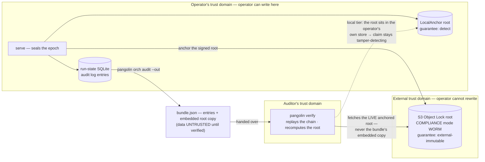

import { Aside } from '@astrojs/starlight/components';

After a run seals, `pangolin orch audit <run-id>` assembles a verifiable evidence
bundle: the per-item dispatch manifests, the hash-chained lifecycle log, the
per-item outcomes, and a **verification report** that recomputes the Merkle root
and checks it against the live anchor. This guide produces the bundle, reads the
result, and explains which guarantee tier the report can honestly assert.

`audit` is **read-only** and CLI-only — it never mutates run state, and it is
deliberately not exposed on MCP (auditing is an operator action, not an
AI-loop action).

## 1. Run `pangolin orch audit <run-id>`

With your `pangolin.config` orch context wired (transport + anchor + storage),
point `audit` at a run that has sealed:

```sh
pangolin orch audit <run-id>
```

By default the full bundle is printed to stdout as pretty JSON. To write it to a
file instead, pass `--out`:

```sh
pangolin orch audit <run-id> --out bundle.json
```

The bundle is the §6.5 compliance artifact. Its top-level shape (from
`AuditBundle` in `packages/pangolin-orchestrator/src/contracts/audit.ts`):

```jsonc
{
  "runId": "...",
  "manifests": [ /* per-item DispatchManifest — refs only, never secret values */ ],
  "auditLog": {
    "entries": [ /* AuditEntryRow[] — hash-chained lifecycle events */ ],
    "root": { /* AnchoredRoot — the anchored (optionally signed) Merkle root */ }
  },
  "items":  [ { "id": "...", "status": "...", "attempts": 1, "actor": "...", "resultRef": "...", "manifestRef": "..." } ],
  "report": {
    "runId": "...", "intact": true, "anchorId": "local", "guarantee": "detect", "claim": "tamper-detecting",
    "checks": { "chain": { "ok": true }, "root": { "ok": true }, "signature": { "ok": "n/a" }, "anchor": { "ok": true } }
  }
}
```

<Aside type="caution" title="The run must have sealed first">
`audit` reads the audit export the service published to the outbox on epoch
seal. If no export has been published yet, the command throws
`no audit export published yet for run <run-id>`. Let the run reach a terminal
state (`pangolin orch watch <run-id>`) before auditing. The context must also carry
an `anchor` and `storage`, or `audit` throws
`audit requires anchor + storage in the orch context`.
</Aside>

## 2. Read the verification result

The `report` object is the headline. The CLI computes it by re-running
`verify()`: it recomputes each entry's chain hash, recomputes the Merkle root
from the entry hashes, fetches the anchored root **from the live anchor** (not a
copy embedded in the bundle), and compares.

The report fields (`VerificationReport`, `contracts/audit.ts:33`):

| Field | Meaning |
|---|---|
| `runId` | The run this report covers. |
| `intact` | `true` only when the chain, the recomputed root, the anchored root, and any signature all agree. |
| `anchorId` | The anchor in force — `"local"` for `LocalAnchor`, `"s3:<bucket>"` for `S3ObjectLockAnchor`. |
| `guarantee` | The anchor's tier: `"detect"`, `"external-immutable"`, or `"witnessed"`. |
| `claim` | What verification can *prove*: `"tamper-detecting"` or `"tamper-evident"`. |
| `failure` | Present only when `intact` is `false`: the **first** failing check — one of `chain`, `anchor-missing`, `root-mismatch`, `signature`. |
| `checks` | Collect-all per-check results: `chain`, `root`, `signature`, `anchor`, each `{ ok: true \| false \| 'n/a'; detail? }`. Every check is evaluated (no early return), so a failing bundle reports the state of all four. This is what `pangolin verify` renders as a checklist. |

**`report.intact === true`** means every check passed: the lifecycle log has not
been altered, and the recomputed root matches what the anchor holds.

**`report.intact === false`** means a check failed, and `report.failure` names
which one:

- `chain` — an entry's hash or its `prevHash` link does not recompute; the
  lifecycle log was edited or reordered.
- `anchor-missing` — no anchored root was found for this run; verification
  cannot compare against an external truth.
- `root-mismatch` — the recomputed Merkle root differs from the anchored root.
- `signature` — a signature was present and a verifier was supplied, but the
  signature did not verify.

The CLI sets a **non-zero exit code** when the bundle does not verify
(`if (!bundle.report.intact) process.exitCode = 1;` in
`packages/pangolin-cli/src/cmd-orch.ts`), so `audit` is safe to gate a CI step or
an incident-review script on.

## 3. Interpret the guarantee tier

`report.claim` is the honest, anchor-scoped statement of what verification
proves. It is derived in `verify.ts` from the anchor's `guarantee` — the
`tamper-evident` claim is licensed **only** at `external-immutable` or higher:

| Anchor | `guarantee` | report `claim` | What it proves | What it does NOT prove |
|---|---|---|---|---|
| `LocalAnchor` (default) | `detect` | **`tamper-detecting`** | Catches accidental or clumsy mutation of the log. | The anchored root lives in the **same store** as the log — it is *not* evidence against an attacker who controls that store. |
| `S3ObjectLockAnchor` | `external-immutable` | **`tamper-evident`** | The signed root lives in S3 Object Lock (compliance mode) — a separate trust domain that survives a DB-side tamper attempt. | It records *what ran* (environment + inputs by hash); it does not reproduce the agent's *output*, and it is not a compliance certification. |

<Aside type="caution" title="Why the claim can downgrade">
The claim is scoped to what `verify()` can actually prove at audit time, not to
the anchor you configured. **Any verification failure forces
`claim: 'tamper-detecting'`** regardless of the anchor — including a missing or
unreachable anchored root (`failure: 'anchor-missing'`). So an `S3ObjectLockAnchor`
that cannot be reached at audit time yields a `tamper-detecting` report, not a
false `tamper-evident` one. Use `tamper-evident` only when the report itself
says so.
</Aside>

**What a clean run prints.** The acceptance demo (`examples/offload-fanout`) runs
on the default `LocalAnchor` and prints the report fields:

```text
=== Audit bundle ===
  intact:    true
  claim:     tamper-detecting
  anchorId:  local
  guarantee: detect
```

**What tamper detected looks like.** If the log is altered, `intact` flips to
`false`, `claim` is forced down to `tamper-detecting`, and `failure` names the
failing check — for an edited log entry:

```text
=== Audit bundle ===
  intact:    false
  claim:     tamper-detecting
  anchorId:  s3:my-audit-bucket
  guarantee: external-immutable
  failure:   root-mismatch
```

The process exits non-zero in this case.

## 4. Hand the bundle to a third party — `pangolin verify`

The bundle written by `--out` is a self-contained JSON file. It carries the
dispatch manifests (refs only — `secretRefs` are references, never secret
values), the full hash-chained `auditLog` (entries plus the anchored root), the
per-item outcomes, and the report from the run that produced it.

An independent party re-verifies it with the top-level `pangolin verify` command:

```sh
pangolin verify bundle.json
```

`verify` rebuilds an in-memory audit store from the bundle's entries, re-runs the
same `verify()` logic, and prints a human-readable checklist + hash-chained
ledger. On a clean bundle:

```text
  pangolin verify  ·  run_a3f9c2                  ✓ TAMPER-EVIDENT
  ──────────────────────────────────────────────────────────
  ✓ chain        10 entries, hash-linked, no gaps
  ✓ root         merkle c4f1a9…  =  anchored root
  ✓ signature    ed25519 / pangolin-prod  valid
  ✓ anchor       s3:my-audit-bucket  (external-immutable)
  …
```

If any entry was altered after sealing, the verdict flips to `✗ TAMPERED`, the
failing check is marked (and the offending ledger row flagged), and the command
**exits non-zero** — so `verify` is safe to gate a CI step or an incident-review
script on. Pass `--json` to emit the raw `VerificationReport` instead, or `--full`
to print every ledger row.

<Aside type="caution" title="verify consults the LIVE anchor — not the bundle's embedded root">
`pangolin verify` is **not** a pure function of the bundle file. Like `verify()`
itself, it fetches the anchored root from the **live anchor**, never the copy
embedded in the bundle (see the comment in `bundle.ts`: *"the data is UNTRUSTED;
integrity comes from verify() comparing the recomputed root to the LIVE anchored
root"*). A bundle that carried its own trusted root would let a tamperer rewrite
the log and the root together.

So a third party still needs two things, and configures the anchor in their own
`pangolin.config` (the same `orch` context `orch audit` uses):

1. **The bundle file** — carries the log entries (`auditLog.entries`).
2. **Read access to the same anchor** that sealed the run. For the
   `external-immutable` tier this is the `S3ObjectLockAnchor` bucket — grant the
   auditor read access to that S3 location (`audit/roots/<run-id>.json`).

For the local tier the anchored root lives in the operator's own store, so
"independent" re-verification is only as independent as that store — which is
exactly why the local tier claims `tamper-detecting`, not `tamper-evident`: the
trust domain of the anchor is the same as the trust domain of the log.
</Aside>

The trust boundaries, drawn out — the entire difference between the two tiers
is *which trust domain holds the anchored root* the verifier compares against:



For programmatic use, the same check is the `verifyBundle(bundle, { anchor })`
library entry point, exported from `@quarry-systems/pangolin-orchestrator` so an
auditor can re-verify a handed-over bundle inside their own tooling.

## Next steps

<Aside type="note" title="Next steps">
For the full model — why the tiers exist, what each guarantee means, and the
honesty rules that keep the vocabulary truthful — read
[Audit & guarantee tiers](/pangolin/explanation/audit-guarantee-tiers/).
</Aside>
