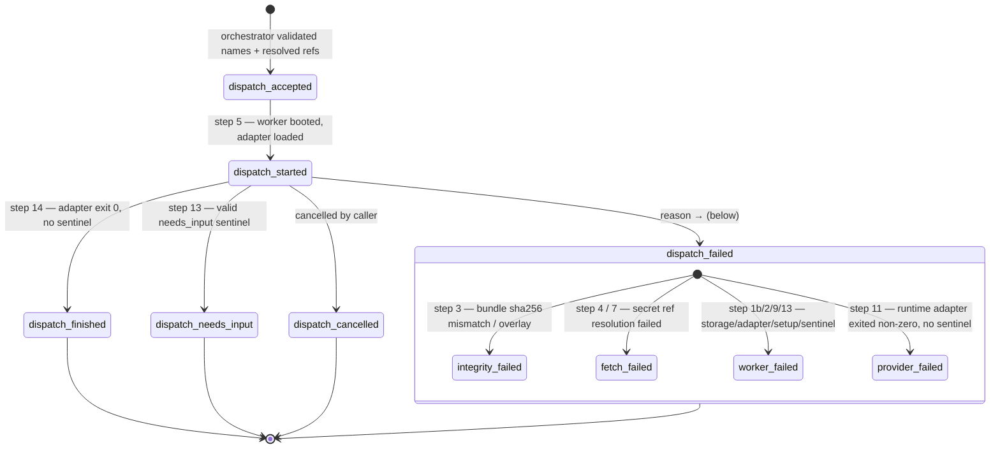

What actually happens between `agora dispatch run` and the JSON you get
back. Useful for reading worker stdout, diagnosing failures, and
understanding which layer to blame when something breaks.

The authoritative source is `packages/agora-worker/src/entrypoint.ts` —
its 14-step prologue is the worker's runbook. This doc is the readable
overview.

## The two halves

A dispatch has two halves:

1. **Orchestrator side** (your machine, where `agora` runs): resolves
   names → registered hashes, picks a `ComputeProvider`, asks the provider
   to start a worker container, then awaits its exit.
2. **Worker side** (inside the container): fetches the bundles, overlays
   them onto a workspace, runs an optional `agora-setup.sh`, hands off to
   the `RuntimeAdapter` (claude binary), and emits a terminal lifecycle
   event.

Most of what you see in stdout is the worker's structured-log stream.

## The 14 worker steps (collapsed)

```
1. parse env vars               ← AGORA_* env tells the worker what to fetch
2. load runtime adapter         ← .js plugin per `AGORA_ADAPTER` (claude-code by default)
3. fetch + integrity-verify bundles  ← StorageProvider.get each ref, sha256-check
4. wire callback HMAC + LifecycleEmitter
5. emit `dispatch.started`
6. overlay capability bundles   ← writes files to <workspace>/, merge rules per §6.3
7. resolve env-bundle secrets   ← Secrets Manager lookups for `secrets:` entries
8. merge env                    ← base + bundles + per-dispatch secrets
9. run agora-setup.sh           ← if present at workspace root, bounded by timeout
10. start channel subscription  ← background poll for inbound channel messages
11. invoke runtime adapter      ← claude --print <prompt>, captures stdout/stderr
12. stop channel subscription
13. resolve needs_input sentinel ← stat <workspace>/.agora/needs_input.json
14. emit terminal event         ← dispatch.finished / .needs_input / .failed / .cancelled
```

Everything after step 5 is bracketed by the appropriate lifecycle event so
the orchestrator can attribute failures.

## The 6 lifecycle events (closed vocabulary)

| Event | Meaning | Worker exit code |
|---|---|---|
| `dispatch.accepted` | Orchestrator validated names + resolved refs; worker has not started yet | n/a |
| `dispatch.started` | Worker container booted, runtime adapter loaded, ready to overlay | n/a |
| `dispatch.finished` | Adapter exited 0, no needs_input sentinel | 0 |
| `dispatch.needs_input` | Adapter wrote a valid needs_input sentinel; orchestrator should re-dispatch with the answer | 0 |
| `dispatch.failed` | Anything else — see failure reasons below | non-zero |
| `dispatch.cancelled` | `agora dispatch cancel <id>` was honored mid-flight | n/a |

The vocabulary is intentionally closed. Future kinds would require an ADR
amendment (see [ADR-0004 — lifecycle vocabulary closed at six](/agora/explanation/decisions/0004-lifecycle-vocabulary-closed-at-six/)).

Ordered across the worker's steps, the six events and the four
`dispatch.failed` reason branch points look like this:



The diagram follows the code (`packages/agora-worker/src/entrypoint.ts`):
`fetch-failed` covers both the step-4 callback-HMAC-key resolution and the
step-7 env-bundle secret resolution, and `worker-failed` is the catch-all for
several infra steps (storage construction 1b, adapter load 2, setup-script 9,
and a malformed/oversized needs_input sentinel 13) — the single-step mappings in
the table above are the most common case for each reason, not the only one.

## What `dispatch.failed.reason` means

| Reason | Maps to | What it means |
|---|---|---|
| `integrity-failed` | Step 3 | A bundle's actual sha256 didn't match its declared `contentHash`. Storage tampering or a backend bug. |
| `fetch-failed` | Step 7 | A secret reference couldn't be resolved (typo, missing IAM, AWS outage). |
| `worker-failed` | Step 9 / 13 | `agora-setup.sh` exited non-zero or timed out; OR the needs_input sentinel was malformed (unparseable JSON, missing `question`, >1 MiB serialized). |
| `provider-failed` | Step 11 | Runtime adapter (claude binary) exited non-zero with no sentinel. Most common cause in dev: missing `ANTHROPIC_API_KEY`. |

Each terminal event includes `durationMs` measured from `dispatch.started`.

## Reading worker stdout

The worker emits one JSON object per line. Typical successful dispatch:

```
{"kind":"worker.boot","dispatchId":"..."}
{"kind":"setup-script.ran","exitCode":0,"durationMs":17,"stdout":"hello\n","stderr":""}
{"kind":"runtime.adapter.ran","exitCode":0,"durationMs":23248,"stdout":"<agent output>","stderr":""}
{"kind":"dispatch.finished","dispatchId":"...","exitCode":0}
```

Event field semantics:

- **`runtime.adapter.ran`** carries the runtime adapter's captured
  stdout/stderr/exitCode/durationMs. For the Claude Code adapter, `stdout`
  is whatever `claude --print` wrote — the agent's final text response
  (tool invocations and their results don't appear in `--print` output;
  only the final synthesized reply does). This is the primary signal for
  "what did the agent actually do/say." Symmetric in shape with
  `setup-script.ran`.

Notable absences:

- **No `setup-script.ran` event when there's no `agora-setup.sh`.** Absent
  is the success state; the worker just moves to step 10.
- **`runtime.adapter.ran` is only emitted when the adapter returns**
  (whether with exit 0 or non-zero). If `adapter.invoke()` THROWS — e.g.,
  the binary is missing or the spawn fails — the dispatch goes straight
  to `dispatch.failed` with `reason: 'worker-failed'` and no
  `runtime.adapter.ran` event is emitted.

## Claude Code permission modes

The Claude Code runtime adapter reads `AGORA_CLAUDE_PERMISSION_MODE` from
the dispatch's merged env to decide whether to pass
`--dangerously-skip-permissions` to the spawned `claude --print`:

| Mode | Behavior | Use case |
|---|---|---|
| `bypass` (default) | Flag passed. Claude's interactive tool-call gate is disabled. | Production default — the worker container IS the sandbox; there is no human inside to approve tool calls. Without this, every `Bash`/`Edit`/`Write` the agent attempts is silently denied. |
| `strict` | Flag NOT passed. Claude's default gate applies. With no approver, all tool calls are denied. | Read-only / analytical dispatches that should produce text but make no filesystem or process changes. |

Unrecognized values fall back to `bypass` with a `console.warn` so a typo
never silently leaves dispatches paralysed.

A `scoped` mode (an allow-list in `.claude/settings.json` plus the
needs-input helper teaching "denied → write sentinel") is tracked as a
follow-up; not shipped today.

## Where `stdout` / `stderr` end up in the result

The dispatch result JSON returned by `agora dispatch run` has both:

```json
{
  "stdout": "<the structured worker event stream>",
  "stderr": "<unstructured stderr — node warnings, adapter complaints>",
  "exitCode": 0,
  "durationMs": 14149,
  "resolved": { "subagent": {}, "capabilities": [], "env": [] }
}
```

The `resolved` block is the audit trail: exactly which `contentHash` of
each artifact actually ran. It's what `agora dispatch describe <id>`
returns later.

## Common diagnostic patterns

**"exit 0 but I don't see my work happening."** The adapter ran cleanly
but its output isn't structured. Use a `ResultSink` to capture, or write
a setup script that produces visible diagnostics (`ls`, `cat`, etc.) —
its stdout DOES show up in the `setup-script.ran` event.

**"`provider-failed` with `runtime exited with code 1`."** Almost always
missing `ANTHROPIC_API_KEY` in the dispatch's env. Check
`result.resolved.env` for the env bundle that ran, then confirm the bundle
includes the key (`agora env get <name>` shows the ref; the actual values
require `agora env get` upgrades or a manual storage inspection).

**"setup-script.ran shows only one of my N skills installed."** Multiple
capabilities each shipped an `agora-setup.sh`. Only one wins
(last-write-wins on the filename). See
[Worker file layout](/agora/how-to/worker-file-layout/) — files at adapter-
reserved paths (`.claude/skills/<name>/`) compose; setup scripts don't.

**"runtime.adapter.ran stdout says 'git commands are being denied' / 'requires approval'."**
You're hitting Claude Code's interactive permission gate inside a worker
with no human to approve. Either you've set
`AGORA_CLAUDE_PERMISSION_MODE=strict` deliberately, or your worker image
predates the bypass-by-default change. Fix: leave the env var unset (or
set it to `bypass`) and rebuild the worker image if you're running an old
one.

**"dispatch.failed integrity-failed."** Something is corrupting storage.
For local FS storage, check disk space + permissions on the `rootDir`.
For S3, check that nothing else is writing to the same prefix.

## See also

- [ADR-0004 — why the lifecycle vocabulary is closed at six kinds](/agora/explanation/decisions/0004-lifecycle-vocabulary-closed-at-six/).
- [ADR-0008](/agora/explanation/decisions/0008-needs-input-request-stop-restart/), [ADR-0009](/agora/explanation/decisions/0009-needs-input-sentinel-file-vs-exit-code/) — the needs_input convention.
- [MVP spec](https://github.com/quarrysystems/agora/blob/main/docs/superpowers/specs/2026-05-21-agora-mvp-design.md) §6.2 (the 14-step lifecycle), §6.3 (overlay/merge), §5.7 (lifecycle event types).
