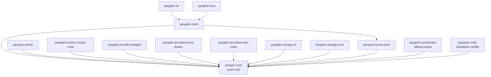

Pangolin Scale ships as fourteen packages under `packages/`, all published under the
`@quarry-systems/` npm scope. `pangolin-core` is the types-only contract sink;
every other package depends on it and nothing else by default.

## The fourteen packages

| Package | One-liner |
|---|---|
| `pangolin-core` | Types-only contract package, and the single source of truth for the audit/verify core — the hash chain, Merkle root, canonicalization, `verify` / `verifyBundle`, and the audit + manifest types all live here. Every other Pangolin Scale package depends on this; nothing depends on anything else by default. |
| `pangolin-client` | Caller-side SDK. `PangolinClient` is the single entry point integrators construct: registration + dispatch surface, with wired-in providers. |
| `pangolin-cli` | The `pangolin` binary. Thin CLI over `PangolinClient` that resolves `pangolin.config.{ts,js,mjs}` and dispatches to subcommands. Canonical privileged entry point. |
| `pangolin-mcp` | Stdio MCP server exposing the run-time, orchestration-safe tool surface. `register` / `assign` are deliberately absent — privileged ops never reach the AI loop. |
| `pangolin-worker` | Container-side runtime. One process per dispatch. Fetches bundles, verifies integrity, overlays the workspace, resolves secrets, hands off to a `RuntimeAdapter`. |
| `pangolin-runtime-claude-code` | MVP `RuntimeAdapter` implementation. Prompt rendering, `claude --print` invocation, Claude-specific merge rules, `needs_input` sentinel detection. |
| `pangolin-providers-fargate` | `ComputeProvider` backed by AWS ECS Fargate (`RunTask` / `DescribeTasks` / `StopTask`). Production target. |
| `pangolin-providers-local-docker` | `ComputeProvider` backed by the local Docker daemon via `dockerode`. Developer iteration + local smoke suite. |
| `pangolin-providers-aws-creds` | `CredentialProvider` wrapping the AWS SDK default credential chain. Lazy resolution, no extra caching. |
| `pangolin-storage-s3` | `StorageProvider` backed by S3. Content-addressed object layout, integrity-verified on read. Production target. |
| `pangolin-storage-local` | `StorageProvider` backed by the local filesystem. Pairs with `pangolin-providers-local-docker` for the local stack. |
| `pangolin-secret-store` | `SecretStore` seam plus impls — `InlineSecretStager` (AWS Secrets Manager) and `LocalSecretStore` (on-disk staging). `pangolin-client` also depends on it. |
| `pangolin-orchestrator` | Orchestrator engine (codename *pangolin-offload*): named queues, `depends_on` resolution, resource locks, a fire-and-reconcile tick loop, SQLite run-state, and a verifiable audit trail (tamper-detecting by default, tamper-evident at the S3 Object Lock tier), behind pluggable `Executor` / `Trigger` seams. The chain/Merkle/verify core + audit types now live in `pangolin-core`; the orchestrator re-exports them as shims for back-compat. Surfaces as `pangolin orch` + the client MCP tools. |
| `pangolin-verify` | Standalone, **zero-orchestrator-dependency** audit-bundle verifier. Bin: `npx @quarry-systems/pangolin-verify <bundle.json> [--anchor <verify-context.json>] [--json] [--full]`. Depends only on `pangolin-core`. Exports `verifyBundle` plus the `TimestampAuthority` impls. Lets an auditor re-verify a handed-over bundle without installing the orchestrator. |

:::note
The README labels the pangolin-mcp tool surface as "exactly six run-time tools."
The shipped server exposes **nine** — see [MCP tools](/pangolin/reference/mcp-tools/).
:::

## Dependency graph

`pangolin-core` is the types-only sink; every arrow flows toward it. The only
package that depends on more than `pangolin-core` is `pangolin-client` (which also
depends on `pangolin-secret-store`), and the two consumer packages `pangolin-cli` /
`pangolin-mcp`, which depend on `pangolin-client`.

No Pangolin Scale package depends on another Quarry Systems library (Stoa, Bedrock,
RaState, etc.). The constraint is enforced by a CI allowlist check on
`package.json` dependencies.
