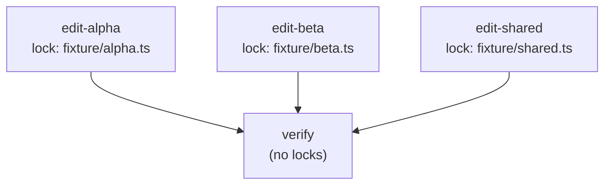

In the [first dispatch tutorial](/agora/tutorials/first-dispatch/) you ran one
agent in one container. This tutorial graduates to the orchestrator: you submit
a small DAG of tasks, the `agora orch` daemon fans them out in parallel under
per-file locks, each task escapes its work as a content-addressed patch
artifact, and at the end you pull a tamper-detecting audit bundle that proves
exactly what ran.

The runnable version of everything below lives in the
[`offload-fanout` example](https://github.com/quarrysystems/agora/tree/main/examples/offload-fanout).
This tutorial walks the CLI path; the example also ships a one-command scripted
run (`pnpm --filter offload-fanout-example start:env`) if you would rather see
it drive itself first.

## Before you start

You need everything from the first dispatch tutorial — Docker running, the
worker image built, and `ANTHROPIC_API_KEY` set — plus an `agora.config.mjs`
that exports an `orch` context alongside the `AgoraClient`. The orchestrator
verbs resolve a named `orch` export from your config (the same way `dispatch`
resolves the default `AgoraClient`). The
[`offload-fanout` example config](https://github.com/quarrysystems/agora/tree/main/examples/offload-fanout)
is a ready-made one: it wires a `SqliteRunStateStore`, a `LocalAnchor`, a local
signer, a `MailboxSubmissionTransport`, and a pre-built `serve` loop, and
exports them all as `orch`.

For what each of those pieces is and why, see the
[CLI reference](/agora/reference/cli/) and the
[audit & guarantee tiers explanation](/agora/explanation/audit-guarantee-tiers/).
This tutorial just runs them.

## The plan

A plan is a JSON file describing a `Run`: an `id`, a `queue`, and a list of
`items`. Each item names an `executor`, its `inputs`, the items it `depends_on`,
and the `resourceLocks` it needs to hold while it runs.

Here is the three-edits-plus-verify fan-out from the example, `plan.json`:

```json
{
  "id": "fanout-1",
  "queue": "default",
  "items": [
    {
      "id": "edit-alpha",
      "executor": "dispatch",
      "inputs": { "subagent": "code-edit", "workerInput": { "file": "alpha.ts" } },
      "depends_on": [],
      "resourceLocks": ["fixture/alpha.ts"]
    },
    {
      "id": "edit-beta",
      "executor": "dispatch",
      "inputs": { "subagent": "code-edit", "workerInput": { "file": "beta.ts" } },
      "depends_on": [],
      "resourceLocks": ["fixture/beta.ts"]
    },
    {
      "id": "edit-shared",
      "executor": "dispatch",
      "inputs": { "subagent": "code-edit", "workerInput": { "file": "shared.ts" } },
      "depends_on": [],
      "resourceLocks": ["fixture/shared.ts"]
    },
    {
      "id": "verify",
      "executor": "dispatch",
      "inputs": { "subagent": "verify" },
      "depends_on": ["edit-alpha", "edit-beta", "edit-shared"],
      "resourceLocks": []
    }
  ]
}
```

The three `edit-*` items have no dependencies, so they are all eligible at once.
Each holds a distinct per-file `resourceLock`, so they fan out in parallel (the
example queue runs at `concurrency: 2`). The `verify` item `depends_on` all
three edits, so the orchestrator holds it back until every edit reaches `done` —
it is the DAG gate. For the full field-by-field shape, see the
[plan.json reference](/agora/reference/plan-json/).



The three `edit-*` nodes have disjoint `resourceLocks`, so they fan out in
parallel (gated only by the queue's `concurrency: 2`); `verify` `depends_on` all
three and holds no locks, so it serializes after every edit reaches `done`.

## Run it

### 1. Start the daemon

From your deploy dir (the one with the `orch`-exporting `agora.config.mjs`),
start the long-running serve loop. It owns the run-state DB, polls the inbox,
runs the reconcile tick loop, and publishes status plus the audit export. Run it
in the background so you can submit against it:

```sh
agora orch serve &
```

It exits cleanly on Ctrl-C / SIGTERM.

### 2. Submit the plan

```sh
agora orch submit plan.json
```

`submit` writes the run to the inbox and prints a run id. It is non-blocking —
it returns as soon as the run is queued, not when it finishes. Copy that run id;
the next two commands take it as an argument.

### 3. Watch it fan out

```sh
agora orch watch <run-id>
```

`watch` follows the run, printing each status update as a line of JSON until the
run reaches a terminal state (Ctrl-C to stop early). You will see the three
`edit-*` items move through to `done` — two at a time, since the queue
concurrency is 2 — and then `verify` start once all three edits are done.

As each edit completes, its status carries a `resultRef`: a content-addressed
storage URI for the patch that worker produced. **The patch itself never lives
in the run-state database** — only the ref does. That ref is the escaped
artifact you review later.

### 4. Pull the audit bundle

Once the run is terminal, assemble the audit bundle:

```sh
agora orch audit <run-id>
```

This prints the §6.5 evidence bundle as JSON (use `--out <path>` to write it to
a file instead). On a clean run the bundle's `report.intact` is `true` and its
`report.claim` is `'tamper-detecting'`. The command exits non-zero if the bundle
fails to verify, so it doubles as a check you can wire into CI.

The example uses `LocalAnchor`, which stores the Merkle root in the local SQLite
DB — that is the **tamper-detecting** tier (`report.guarantee` reads
`'external-immutable'` only when you swap in a stronger anchor like
`S3ObjectLockAnchor`). What the tiers mean, and why `LocalAnchor` is
tamper-detecting rather than tamper-evident or compliant, is covered in the
[audit & guarantee tiers explanation](/agora/explanation/audit-guarantee-tiers/).

### 5. Stop the daemon

When you are done, stop the serve loop you backgrounded:

```sh
kill %1
```

## Next steps

- [Export & verify an audit bundle](/agora/how-to/verify-audit-bundle/) — take
  the bundle you just produced, export it, and verify it independently.
- [Audit & guarantee tiers](/agora/explanation/audit-guarantee-tiers/) — what
  `tamper-detecting` actually guarantees, and how to reach the stronger
  `external-immutable` tier.
- [How an offload run executes](/agora/explanation/how-offload-runs/) — the
  scheduling mechanics (queues, `depends_on`, resource-locks, the fire-and-reconcile
  tick loop) behind what you just ran.
