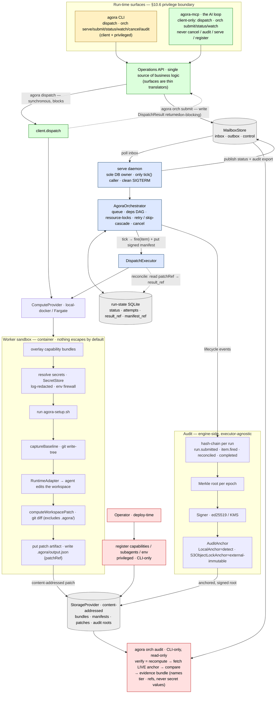

# Agora — end-to-end process overview

One picture of how the whole system fits together: from an operator registering
what an agent *is* and *gets*, through the two run-time entry paths (a single
synchronous `dispatch` and the orchestrated `orch` offload), into the isolated
worker sandbox, out through the patch escape, and into the tamper-evident audit
trail — with the §10.6 privilege boundary marked throughout.

This is the *process* view. For the *package* dependency graph see the README's
Architecture section; for the in-container detail see
[Dispatch lifecycle](dispatch-lifecycle.md); for the orchestrated path's
operator how-to see [Offload orchestration](offload-orchestration.md).

**Legend (colour = privilege tier):** 🔴 privileged / deploy-time, CLI-only (register, cancel, `audit`) · 🔵 service — only the `serve` daemon (sole DB owner, only `tick()` caller) · 🟢 client — reachable from the AI loop (MCP) · 🟡 the CLI surface · ⬜ storage seams.

## Walking the path

1. **Register (deploy-time, privileged).** The operator registers capabilities,
   subagents, and env bundles; they land in the content-addressed
   `StorageProvider`. These verbs are **never** on the MCP surface (ADR-0005).

2. **Two run-time entry paths, one logic core.** Both the CLI and the AI-loop
   MCP server are thin translators over a single **Operations API**:
   - **`agora dispatch`** — run one unit *now*, synchronously; returns a
     `DispatchResult`. The low-level primitive.
   - **`agora orch submit`** — write a *Run* (a DAG of WorkItems) to the
     `MailboxStore` inbox and return immediately. Unattended.

3. **`serve` — the engine (orchestrated path only).** The long-running daemon is
   the **sole** opener of the run-state DB and the only caller of `tick()` (D3).
   It polls the inbox, and the `AgoraOrchestrator` resolves queues, `depends_on`
   edges, and file-level **resource locks** (disjoint locks fan out to the
   queue's concurrency; shared locks serialize), with retry/backoff,
   skip-cascade, and cancel. Each fired item gets a **signed dispatch manifest**
   (refs only). `serve` publishes status + the audit export back to the outbox.

4. **Worker sandbox.** Every dispatch — single or orchestrated — runs in a fresh
   container that gets *only* the granted capabilities and secrets. Secrets are
   resolved inside the worker (log-redacted; the env firewall strips the
   control-plane and ambient credentials). A git baseline is captured, the
   runtime adapter runs the agent, and the workspace diff is captured.

5. **Escape.** The diff is uploaded as a **content-addressed patch artifact**;
   the sentinel `.agora/output.json` carries its `patchRef`. On reconcile the
   executor records it as the item's **`result_ref`** — the one thing that
   leaves the sandbox by default.

6. **Tamper-evident audit (engine-side).** The lifecycle stream is hash-chained
   per run, accumulated into a **Merkle root per epoch**, signed, and handed to a
   pluggable **`AuditAnchor`**. `agora orch audit` (CLI-only) verifies by
   recomputing the root and comparing it to the root fetched from the **live**
   anchor, then emits the evidence bundle whose report **names the anchor and its
   guarantee tier**.

## Two load-bearing invariants the diagram encodes

- **The §10.6 privilege boundary.** Everything red/blue (register, `cancel`,
  `audit`, `serve`, `tick`) is unreachable from the AI loop; the MCP surface is
  green-only (`submit`/`status`/`watch`). A CI allowlist check fails the build if
  that boundary is ever crossed.
- **Secret + value discipline.** Secret *values* flow only into the worker
  (log-redacted). Manifests and audit entries record **references only** — so the
  manifest and the evidence bundle are safe to hand an auditor.

## See also

- [Offload orchestration](offload-orchestration.md) — operator how-to for the orchestrated path.
- [Dispatch lifecycle](dispatch-lifecycle.md) — the 14 worker steps + the six lifecycle events.
- [Offload V1 delivery spec §2.1](superpowers/specs/2026-05-29-agora-offload-v1-design.md) — the detailed ASCII flow + the compliance/audit edge.
- [Orchestrator architecture spec](superpowers/specs/2026-05-28-agora-orchestrator-design.md) — registries, queues/deps/locks, the operations-API consolidation.
