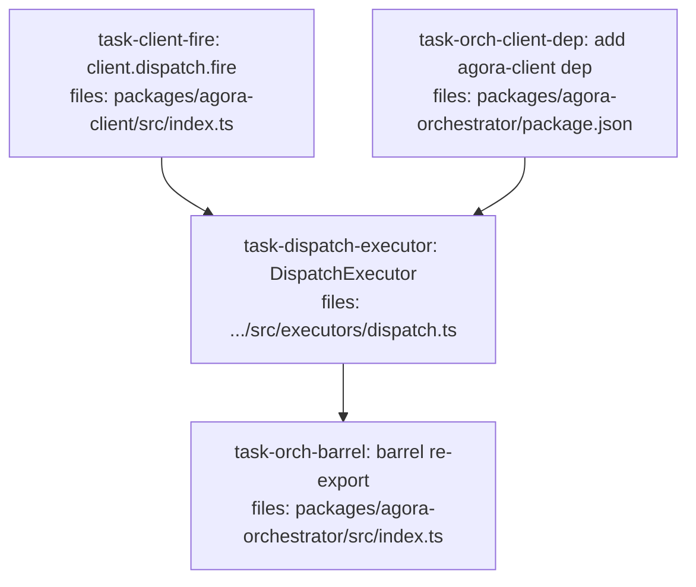

> **For agentic workers:** REQUIRED SUB-SKILL: Use parallel-dag-execution:executing-dag-plans to execute this plan. Per-task `status` frontmatter is the source of truth.



## Context

PR3 of the agora-orchestrator build — the first concrete `Executor`. Spec:
`docs/superpowers/specs/2026-05-29-agora-dispatch-executor-design.md`.

The `DispatchExecutor` bridges PR2's non-blocking `Executor.reconcile` poll to PR1's blocking
`InFlightDispatch.awaitExit`: `fire` starts the dispatch and runs `awaitExit` in the background,
storing the in-flight handle in an in-memory map keyed by `dispatchId`; `reconcile` polls that
map (`null` while running, terminal `ExecutionResult` once the background await settles). `target`
and `workerImage` are deploy-time executor config (never from `WorkItem.inputs` — §10.6 security
boundary); each item's `inputs` carries `{ subagent, env?, workerInput }`.

Everything the executor consumes already exists on `main`: PR2's `Executor`/`ExecutionResult`/
`WorkItem` contracts + `AgoraOrchestrator`/`SqliteRunStateStore`/`ManualTrigger`, and PR1's
`fireWork`/`InFlightDispatch` (exported from `@quarry-systems/agora-client`). PR3 adds an
ergonomic `client.dispatch.fire(...)` wrapper, the orchestrator's `agora-client` dependency, the
`DispatchExecutor` itself, and its barrel export.

Crash-recovery reattach-by-handle, the `SubagentShape`/pack system, and output-schema validation
are explicitly deferred (spec §6).

**Convention:** `files:` lists production files only; test files are named in each task's
"Test file:" line. All paths are repo-root-relative.

## Tasks

## Task: client dispatch.fire method

```yaml
id: task-client-fire
depends_on: []
files:
  - packages/agora-client/src/index.ts
status: pending
model_hint: standard
```

Add an ergonomic `client.dispatch.fire(workAndOpts): Promise<InFlightDispatch>` to the
`AgoraClient` dispatch callable — a thin wrapper over the already-exported `fireWork`, mirroring
how `client.dispatch(...)` wraps `dispatchWork` and `.describe`/`.cancel` are attached. Additive;
no change to existing `dispatch`/`describe`/`cancel` behavior. (Spec §2.7.)

## Implementation

```typescript
// packages/agora-client/src/index.ts
// 1. Ensure fireWork + InFlightDispatch are imported as VALUES/TYPES for the getter
//    (they are already re-exported; add a local import so the getter can call fireWork):
import { dispatchWork, fireWork, type ClientDispatchOpts, type InFlightDispatch } from './dispatch.js';

// 2. Add `fire` to the callable's type:
export interface AgoraClientDispatchFn {
  (work: DispatchWork & ClientDispatchOpts): Promise<DispatchResult>;
  fire(work: DispatchWork & ClientDispatchOpts): Promise<InFlightDispatch>;
  describe(dispatchId: string): Promise<DispatchResult>;
  cancel(dispatchId: string): Promise<void>;
}

// 3. In the `dispatch` prototype getter, after building `fn` and before the return,
//    attach `.fire` (arrow binds `this` = the AgoraClient instance, matching the
//    existing .describe/.cancel pattern):
fn.fire = (workAndOpts: DispatchWork & ClientDispatchOpts): Promise<InFlightDispatch> => {
  const { workerImage, defaultDispatchTimeoutSeconds, ...work } = workAndOpts;
  return fireWork(this, work as DispatchWork, { workerImage, defaultDispatchTimeoutSeconds });
};
```

```typescript
// packages/agora-client/test/dispatch-fire.test.ts  (NEW — imports the barrel so the
// prototype getter is installed)
import { describe, it, expect, vi, beforeEach } from 'vitest';
import { AgoraClient } from '../src/index.js';
import type { ComputeProvider, TaskExit } from '@quarry-systems/agora-core';
import * as secretsManager from '../src/secrets-manager.js';

// (reuse the memory-storage / credentials fakes from dispatch.test.ts patterns)
it('client.dispatch.fire starts the dispatch and returns an InFlightDispatch WITHOUT awaiting exit', async () => {
  let awaitExitCalls = 0;
  let runCalls = 0;
  const compute: ComputeProvider = {
    name: 'fake',
    async run() { runCalls += 1; return { providerTaskId: 'p1' }; },
    async awaitExit(): Promise<TaskExit> { awaitExitCalls += 1; return { exitCode: 0, startedAt: new Date(0), finishedAt: new Date(1), stdout: '', stderr: '' }; },
  };
  // ...construct AgoraClient with { compute:{default:compute}, memory storage (seed subagent 's'),
  //    credentials, targets:{prod:{compute:'default',credentials:'default'}} }, stub InlineSecretStager...
  const inflight = await client.dispatch.fire({ subagent: 's', target: 'prod', workerImage: 'img' });
  expect(runCalls).toBe(1);
  expect(awaitExitCalls).toBe(0);                 // fire does NOT await exit
  expect(typeof inflight.awaitExit).toBe('function');
  expect(typeof inflight.reconcile).toBe('function');
  expect(typeof inflight.cleanup).toBe('function');
  expect(inflight.dispatchId).toMatch(/^[0-9a-f-]{36}$/);
});
```

## Acceptance criteria

- `AgoraClientDispatchFn` declares `fire(work): Promise<InFlightDispatch>`; `client.dispatch.fire` is callable on a constructed client.
- `fire` calls `provider.run` (once) but does NOT call `provider.awaitExit` — it returns the `InFlightDispatch` (with `awaitExit`/`reconcile`/`cleanup`/`dispatchId`).
- Existing `client.dispatch(...)`, `.describe`, `.cancel` behavior unchanged; full `@quarry-systems/agora-client` suite stays green.
- `pnpm -F @quarry-systems/agora-client typecheck` + `lint` pass.

Test file: `packages/agora-client/test/dispatch-fire.test.ts`.

## Task: orchestrator agora-client dependency

```yaml
id: task-orch-client-dep
depends_on: []
files:
  - packages/agora-orchestrator/package.json
status: pending
is_wiring_task: true
model_hint: cheap
```

Add `@quarry-systems/agora-client` as a runtime dependency of `agora-orchestrator` so the
`DispatchExecutor` can import it. Run `pnpm install` from the repo root to link the new workspace
edge. (The orchestrator currently deps only `agora-core` + `better-sqlite3`.)

Add to `packages/agora-orchestrator/package.json` `dependencies`:

```json
    "@quarry-systems/agora-client": "workspace:*"
```

(Keep the existing `@quarry-systems/agora-core` + `better-sqlite3`.)

## Acceptance criteria

- `packages/agora-orchestrator/package.json` lists `@quarry-systems/agora-client` (`workspace:*`) alongside the existing deps.
- `pnpm install` succeeds and links the edge (root `pnpm-lock.yaml` updated; stage it with this task).
- No dependency cycle: `agora-client` does NOT depend on `agora-orchestrator`.

Test file: none (wiring task — verified by install + the downstream executor task's typecheck).

## Task: DispatchExecutor

```yaml
id: task-dispatch-executor
depends_on: [task-client-fire, task-orch-client-dep]
files:
  - packages/agora-orchestrator/src/executors/dispatch.ts
status: pending
model_hint: standard
```

Implement `DispatchExecutor implements Executor` (spec §2): `fire` maps `item.inputs`
(`{ subagent, env?, workerInput }`) + executor config (`target`, `workerImage`) to
`client.dispatch.fire`, runs `awaitExit` in the background, and records an in-memory in-flight
entry keyed by `dispatchId`; `reconcile` polls that entry (`null` while running; terminal
`ExecutionResult` once settled, with `cleanup()`).

## Implementation

```typescript
// packages/agora-orchestrator/src/executors/dispatch.ts
import type { AgoraClient, InFlightDispatch } from '@quarry-systems/agora-client';
import type { Executor, ExecutionResult, WorkItem } from '../contracts/index.js';

export interface DispatchExecutorOptions {
  /** A fully-wired AgoraClient (namespace, compute, credentials, storage). */
  client: AgoraClient;
  /** Deploy-time: which AgoraClient target to dispatch against (NOT from WorkItem inputs). */
  target: string;
  /** Deploy-time: digest-pinned worker image (NOT from WorkItem inputs). */
  workerImage: string;
}

type Settled =
  | { kind: 'exit'; exit: Awaited<ReturnType<InFlightDispatch['awaitExit']>> }
  | { kind: 'error'; error: unknown };

interface InFlightEntry {
  inflight: InFlightDispatch;
  settled: Settled | null;
}

/** First concrete Executor: runs WorkItems as agora container dispatches (spec §2). */
export class DispatchExecutor implements Executor {
  readonly id = 'dispatch';
  private readonly inflight = new Map<string, InFlightEntry>();

  constructor(private readonly opts: DispatchExecutorOptions) {}

  async fire(item: WorkItem): Promise<{ dispatchHash: string }> {
    const subagent = item.inputs.subagent;
    if (typeof subagent !== 'string' || subagent.length === 0) {
      throw new Error(`DispatchExecutor: WorkItem '${item.id}' is missing a string inputs.subagent`);
    }
    const flight = await this.opts.client.dispatch.fire({
      subagent,
      env: item.inputs.env as string | string[] | undefined,
      input: (item.inputs.workerInput as Record<string, unknown> | undefined) ?? {},
      target: this.opts.target,
      workerImage: this.opts.workerImage,
    });
    const entry: InFlightEntry = { inflight: flight, settled: null };
    // Detached background await — never throws out; records terminal state for reconcile().
    void flight.awaitExit().then(
      (exit) => { entry.settled = { kind: 'exit', exit }; },
      (error) => { entry.settled = { kind: 'error', error }; },
    );
    this.inflight.set(flight.dispatchId, entry);
    return { dispatchHash: flight.dispatchId };
  }

  async reconcile(dispatchHash: string): Promise<ExecutionResult | null> {
    const entry = this.inflight.get(dispatchHash);
    if (!entry || entry.settled === null) return null; // unknown or still running
    this.inflight.delete(dispatchHash);
    if (entry.settled.kind === 'error') {
      entry.inflight.cleanup();
      return { status: 'failed', output: { error: String(entry.settled.error) } };
    }
    const result = await entry.inflight.reconcile(entry.settled.exit);
    entry.inflight.cleanup();
    return { status: result.exitCode === 0 ? 'done' : 'failed', output: result };
  }
}
```

```typescript
// packages/agora-orchestrator/test/executors/dispatch.test.ts (failing test first)
import { describe, it, expect } from 'vitest';
import { DispatchExecutor } from '../../src/executors/dispatch.js';
import type { WorkItem } from '../../src/contracts/index.js';
// Build an AgoraClient over a fake ComputeProvider whose awaitExit resolves on command
// (deferred promise), memory storage seeded with subagent 's'. Then:
const item: WorkItem = { id: 'a', executor: 'dispatch', inputs: { subagent: 's', workerInput: { x: 1 } }, depends_on: [], resourceLocks: [] };

it('fire returns a hash without awaiting exit; reconcile is null until the dispatch exits, then done', async () => {
  const ex = new DispatchExecutor({ client, target: 'prod', workerImage: 'img' });
  const { dispatchHash } = await ex.fire(item);
  expect(dispatchHash).toMatch(/^[0-9a-f-]{36}$/);
  expect(await ex.reconcile(dispatchHash)).toBeNull();   // awaitExit still pending
  resolveExit({ exitCode: 0, stdout: 'ok', stderr: '', startedAt: new Date(0), finishedAt: new Date(1) });
  await new Promise((r) => setImmediate(r));              // let the background .then run
  const res = await ex.reconcile(dispatchHash);
  expect(res?.status).toBe('done');
});
```

Add these further cases (expand from the shape above):
- non-zero exit → `reconcile` returns `{ status: 'failed' }`.
- `awaitExit` rejects → `reconcile` returns `{ status: 'failed' }` and does NOT throw.
- terminal `reconcile` invokes `inflight.cleanup()` (spy/fake the InFlightDispatch cleanup).
- `fire` on an item with no/non-string `inputs.subagent` throws.
- `reconcile` on an unknown hash returns `null`.

**Also add the integration test** `packages/agora-orchestrator/test/executors/dispatch-orchestrator.int.test.ts`:
register `{ dispatch: new DispatchExecutor({ client, target, workerImage }) }` +
`{ manual: new ManualTrigger() }` in an `AgoraOrchestrator` over a real `SqliteRunStateStore()`
(`:memory:`); `submitRun` a 1-item run with `inputs.subagent: 's'`; `await orch.tick()` (fires);
resolve the fake provider's exit; `await orch.tick()` (reconciles); assert `getStatus(runId)`
shows the item `done`. Import `AgoraOrchestrator`/`SqliteRunStateStore`/`ManualTrigger` from
`../../src/index.js` (pre-existing barrel exports) and `DispatchExecutor` from
`../../src/executors/dispatch.js`.

## Acceptance criteria

- `fire(item)` calls `client.dispatch.fire` with `subagent`/`env`/`input` from `item.inputs` and `target`/`workerImage` from executor config; returns `{ dispatchHash: <dispatchId> }`; does NOT block on exit.
- `reconcile(hash)` returns `null` while the background `awaitExit` is unsettled; once settled returns `{ status: 'done' }` (exit 0) / `{ status: 'failed' }` (non-zero exit OR `awaitExit` rejection), calls `inflight.cleanup()`, and removes the in-flight entry. Unknown hash → `null`.
- Missing/non-string `inputs.subagent` → `fire` throws a clear error.
- Integration: an `AgoraOrchestrator` with the `DispatchExecutor` drives a 1-item run to `done` across two ticks.
- `target`/`workerImage` are read ONLY from executor config, never from `item.inputs`.

Test file: `packages/agora-orchestrator/test/executors/dispatch.test.ts` (unit) and `packages/agora-orchestrator/test/executors/dispatch-orchestrator.int.test.ts` (integration).

## Task: barrel re-export DispatchExecutor

```yaml
id: task-orch-barrel
depends_on: [task-dispatch-executor]
files:
  - packages/agora-orchestrator/src/index.ts
status: pending
is_wiring_task: true
model_hint: cheap
```

Re-export `DispatchExecutor` (+ its options type) from the `agora-orchestrator` barrel so
consumers import it from `@quarry-systems/agora-orchestrator`.

Add to `packages/agora-orchestrator/src/index.ts`:

```typescript
export { DispatchExecutor } from './executors/dispatch.js';
export type { DispatchExecutorOptions } from './executors/dispatch.js';
```

## Acceptance criteria

- `import { DispatchExecutor } from '@quarry-systems/agora-orchestrator'` resolves at type-check time.
- `pnpm -F @quarry-systems/agora-orchestrator build` + `typecheck` pass; `pnpm -F @quarry-systems/agora-orchestrator test` is fully green (unit + integration + the prior PR2 suite).

Test file: none (wiring task — verified by build + typecheck + the package suite).
