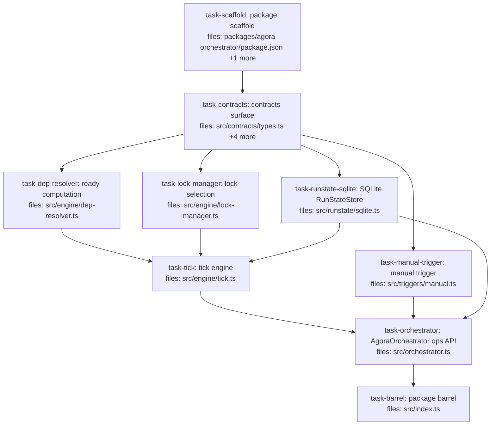

> **For agentic workers:** REQUIRED SUB-SKILL: Use parallel-dag-execution:executing-dag-plans to execute this plan with continuous parallel subagent dispatch. Per-task `status` frontmatter is the source of truth; the mermaid block is regenerated on every save.



## Context

This is **PR2** of the agora-orchestrator build (decision D-series in
`docs/superpowers/specs/2026-05-28-agora-orchestrator-design.md`). It creates the
new `packages/agora-orchestrator` package as a **self-contained, fully-testable
engine** with zero dependency on remote deployment or a real worker.

**Scope (the skeleton "proves the core in isolation"):**
- Contracts (`Executor`, `Trigger`, `RunStateStore`, `WorkItem`, `Run`,
  `WorkItemResult`, `RunStatus`, `EffectTier`) — interfaces + minimal data types.
- `RunStateStore` SQLite implementation (`better-sqlite3`) — the first DB in the
  repo, confined behind the seam (D2/D5/B5). Single-writer (D3).
- Engine: a pure dep-resolver, a pure lock-manager, and a `tick()` that readies →
  dispatches to an `Executor` → reconciles → persists (D6 fire-and-reconcile).
- `AgoraOrchestrator` ops API: static-map constructor (D8), `submitRun` /
  `getStatus` / `tick`, the `default` queue, the `manual` trigger.

**Out of scope (each pulled by a later PR, no refactor):** the real
`dispatch-executor` (PR3) · S3 `SubmissionTransport` + the `serve` long-running
loop · `dev` pack + `SubagentShape` · `dev.open-pr` interpreter + `Intent`/outbox
· `.agora/output.json` worker channel · `cron` trigger · CLI `orch` + MCP tools.

**Testing posture:** no real executor exists in PR2, so the tick + orchestrator
tests **inline a fake `Executor`** (a few lines each — deliberately not hoisted to
a shared helper). The store is tested with `better-sqlite3` `:memory:`. The fake
`Executor` models D6: `fire(item)` returns a `dispatchHash` and marks the item
in-flight; `reconcile(hash)` returns a terminal result (immediately, or after N
ticks to exercise the reconcile loop).

**Conventions (from spec §13.1 / extracted from the repo):** package scope
`@quarry-systems/*`; `package.json` is `private`, `main`/`types` point at `dist/`;
`tsconfig.json` extends `../../tsconfig.base.json`; tests in a `test/` dir at
package root; `vitest`. Dependency direction stays downhill: this package depends
on `agora-core` (types) only — it does NOT depend on `agora-client` in PR2 (the
`dispatch-executor` that needs the client lands in PR3).

**File paths** in `files:` are repo-root-relative. Test files are named in each
task's "Test file:" line (not in `files:`), per the plan-format convention.

## Tasks

## Task: package scaffold

```yaml
id: task-scaffold
depends_on: []
files:
  - packages/agora-orchestrator/package.json
  - packages/agora-orchestrator/tsconfig.json
status: pending
is_wiring_task: true
model_hint: cheap
```

Scaffold the new `@quarry-systems/agora-orchestrator` package so subsequent tasks
have somewhere to compile and test. Mirrors the manifest/build conventions of the
existing impl packages (e.g. `agora-storage-local`). Declares the `better-sqlite3`
runtime dependency (the only new external dep this PR introduces) and the
`@quarry-systems/agora-core` workspace dependency.

`package.json`:

```json
{
  "name": "@quarry-systems/agora-orchestrator",
  "version": "0.0.0",
  "private": true,
  "main": "dist/index.js",
  "types": "dist/index.d.ts",
  "scripts": {
    "lint": "eslint src --ext .ts",
    "test": "vitest run",
    "typecheck": "tsc --noEmit",
    "build": "tsc",
    "clean": "rm -rf dist"
  },
  "dependencies": {
    "@quarry-systems/agora-core": "workspace:*",
    "better-sqlite3": "^11.0.0"
  },
  "devDependencies": {
    "@types/better-sqlite3": "^7.6.0"
  }
}
```

`tsconfig.json`:

```json
{
  "extends": "../../tsconfig.base.json",
  "compilerOptions": { "outDir": "dist", "rootDir": "src" },
  "include": ["src/**/*"]
}
```

## Acceptance criteria

- `pnpm install` succeeds with the new package present (workspace picks it up; `better-sqlite3` + `@types/better-sqlite3` resolve).
- `pnpm -F @quarry-systems/agora-orchestrator typecheck` runs (passes trivially — no `src` files yet, or once contracts land).
- `package.json` declares exactly the two runtime deps above (`agora-core`, `better-sqlite3`) and the `@types/better-sqlite3` devDep; no `agora-client` dependency (deferred to PR3).

Test file: none (wiring task — verified by install + typecheck).

## Task: contracts surface

```yaml
id: task-contracts
depends_on: [task-scaffold]
files:
  - packages/agora-orchestrator/src/contracts/types.ts
  - packages/agora-orchestrator/src/contracts/executor.ts
  - packages/agora-orchestrator/src/contracts/trigger.ts
  - packages/agora-orchestrator/src/contracts/runstate-store.ts
  - packages/agora-orchestrator/src/contracts/index.ts
status: pending
model_hint: cheap
```

Define the narrow-waist contracts every other task consumes (spec §3–§7, scoped to
the skeleton). Pure interfaces + minimal data types, co-located under
`src/contracts/` per spec §13. `RUN_STATUSES` is a runtime const tuple (drives
validation + gives the contracts task a real failing test).

## Implementation

```typescript
// packages/agora-orchestrator/src/contracts/types.ts
export const RUN_STATUSES = ['pending', 'ready', 'running', 'done', 'failed', 'skipped'] as const;
export type RunStatus = (typeof RUN_STATUSES)[number];

export type EffectTier = 'pure' | 'read-impure' | 'write-impure';

/** A single dispatchable unit (skeleton shape — packs/effect-policy/budget deferred). */
export interface WorkItem {
  id: string;
  /** id of the registered Executor that runs this item. */
  executor: string;
  inputs: Record<string, unknown>;
  /** ids of WorkItems in the same Run that must reach `done` before this readies. */
  depends_on: string[];
  /** shared resource keys that serialize contending items. */
  resourceLocks: string[];
}

/** One plan submission: a set of WorkItems + their edges, placed on a queue. */
export interface Run {
  id: string;
  queue: string;
  items: WorkItem[];
}

/** Persisted per-item run-state row (WorkItem + mutable state). */
export interface ItemState extends WorkItem {
  runId: string;
  queue: string;
  status: RunStatus;
  dispatchHash?: string;
}

/** Terminal-ish result for one item (skeleton — intents/signals/audit deferred). */
export interface WorkItemResult {
  itemId: string;
  status: RunStatus;
  output?: unknown;
}
```

```typescript
// packages/agora-orchestrator/src/contracts/executor.ts
import type { WorkItem } from './types.js';

/** Outcome of reconciling a fired dispatch. `null` from reconcile = still running. */
export interface ExecutionResult {
  status: 'done' | 'failed';
  output?: unknown;
}

/**
 * Mechanism for carrying out a WorkItem (D6 fire-and-reconcile). The skeleton ships
 * NO concrete Executor; tests inline a fake. The real dispatch-executor lands in PR3.
 */
export interface Executor {
  id: string;
  /** Start the work; return a content-address handle. Must not block to completion. */
  fire(item: WorkItem): Promise<{ dispatchHash: string }>;
  /** Poll a fired dispatch; return its terminal result, or null if still running. */
  reconcile(dispatchHash: string): Promise<ExecutionResult | null>;
}
```

```typescript
// packages/agora-orchestrator/src/contracts/trigger.ts
import type { Run } from './types.js';

/** Policy that readies work. The skeleton ships only `manual`. */
export interface Trigger {
  id: string;
  /** ids of items to mark ready the moment a run is submitted (e.g. its roots). */
  initialReady(run: Run): string[];
}
```

```typescript
// packages/agora-orchestrator/src/contracts/runstate-store.ts
import type { ItemState, Run, RunStatus } from './types.js';

/**
 * Mutable run-state persistence (D2 split-store). The orchestrator service is the
 * SINGLE exclusive writer (D3). SQLite impl lands in task-runstate-sqlite.
 */
export interface RunStateStore {
  ensureQueue(name: string, concurrency: number): void;
  saveRun(run: Run): void;
  markReady(itemIds: string[]): void;
  setRunning(itemId: string, dispatchHash: string): void;
  setStatus(itemId: string, status: RunStatus): void;
  getItems(runId?: string): ItemState[];
  runningCount(queue: string): number;
  queueConcurrency(queue: string): number;
  heldLockKeys(): string[];
  /** Atomically acquire ALL keys for an item; returns false (acquiring none) on any contention. */
  acquireLocks(itemId: string, keys: string[]): boolean;
  releaseLocks(itemId: string): void;
  close(): void;
}
```

```typescript
// packages/agora-orchestrator/src/contracts/index.ts
export * from './types.js';
export * from './executor.js';
export * from './trigger.js';
export * from './runstate-store.js';
```

```typescript
// packages/agora-orchestrator/test/contracts.test.ts
import { describe, it, expect } from 'vitest';
import { RUN_STATUSES } from '../src/contracts/index.js';
import type { WorkItem } from '../src/contracts/index.js';

describe('contracts', () => {
  it('RUN_STATUSES covers the six lifecycle states', () => {
    expect([...RUN_STATUSES]).toEqual(['pending', 'ready', 'running', 'done', 'failed', 'skipped']);
  });
  it('WorkItem shape compiles', () => {
    const w: WorkItem = { id: 'a', executor: 'fake', inputs: {}, depends_on: [], resourceLocks: [] };
    expect(w.id).toBe('a');
  });
});
```

## Acceptance criteria

- `RUN_STATUSES` is a readonly tuple equal to `['pending','ready','running','done','failed','skipped']`; `RunStatus` is its element union.
- `WorkItem`, `Run`, `ItemState`, `WorkItemResult`, `Executor`, `ExecutionResult`, `Trigger`, `RunStateStore`, `EffectTier` are all exported from `src/contracts/index.js`.
- `Executor` is the fire-and-reconcile shape (`fire` returns `{ dispatchHash }`; `reconcile` returns `ExecutionResult | null`).
- `pnpm -F @quarry-systems/agora-orchestrator typecheck` passes.

Test file: `packages/agora-orchestrator/test/contracts.test.ts`.

## Task: SQLite RunStateStore

```yaml
id: task-runstate-sqlite
depends_on: [task-contracts]
files:
  - packages/agora-orchestrator/src/runstate/sqlite.ts
status: pending
model_hint: standard
```

Implement `RunStateStore` over `better-sqlite3` (the first DB in the repo, confined
here behind the seam). Synchronous API (better-sqlite3 is synchronous). The file
MUST carry a header comment recording the D3 single-writer invariant. Atomic claim
/ lock acquisition use single UPDATE/INSERT statements so concurrency is the DB's
job, not hand-rolled.

## Implementation

```typescript
// packages/agora-orchestrator/src/runstate/sqlite.ts
//
// SINGLE-WRITER INVARIANT (D3): this DB is the orchestrator service's exclusive
// property. Do NOT open it from the CLI, MCP, or any other process — those are
// clients of the running service, not of this file. Concurrent writers from
// separate processes are unsupported and will corrupt run-state.
//
import Database from 'better-sqlite3';
import type { ItemState, Run, RunStatus, RunStateStore } from '../contracts/index.js';

const SCHEMA = `
CREATE TABLE IF NOT EXISTS queues (name TEXT PRIMARY KEY, concurrency INTEGER NOT NULL);
CREATE TABLE IF NOT EXISTS items (
  id TEXT PRIMARY KEY, run_id TEXT NOT NULL, queue TEXT NOT NULL, executor TEXT NOT NULL,
  inputs TEXT NOT NULL, depends_on TEXT NOT NULL, resource_locks TEXT NOT NULL,
  status TEXT NOT NULL, dispatch_hash TEXT
);
CREATE TABLE IF NOT EXISTS locks (key TEXT PRIMARY KEY, item_id TEXT NOT NULL);
`;

export class SqliteRunStateStore implements RunStateStore {
  private db: Database.Database;
  constructor(path = ':memory:') {
    this.db = new Database(path);
    this.db.pragma('journal_mode = WAL');
    this.db.exec(SCHEMA);
  }
  ensureQueue(name: string, concurrency: number): void {
    this.db.prepare('INSERT INTO queues(name,concurrency) VALUES(?,?) ON CONFLICT(name) DO UPDATE SET concurrency=excluded.concurrency').run(name, concurrency);
  }
  saveRun(run: Run): void {
    const ins = this.db.prepare('INSERT INTO items(id,run_id,queue,executor,inputs,depends_on,resource_locks,status,dispatch_hash) VALUES(?,?,?,?,?,?,?,?,NULL)');
    const tx = this.db.transaction((r: Run) => {
      for (const it of r.items) ins.run(it.id, r.id, r.queue, it.executor, JSON.stringify(it.inputs), JSON.stringify(it.depends_on), JSON.stringify(it.resourceLocks), 'pending');
    });
    tx(run);
  }
  markReady(itemIds: string[]): void {
    const upd = this.db.prepare("UPDATE items SET status='ready' WHERE id=? AND status='pending'");
    const tx = this.db.transaction((ids: string[]) => { for (const id of ids) upd.run(id); });
    tx(itemIds);
  }
  setRunning(itemId: string, dispatchHash: string): void {
    this.db.prepare("UPDATE items SET status='running', dispatch_hash=? WHERE id=?").run(dispatchHash, itemId);
  }
  setStatus(itemId: string, status: RunStatus): void {
    this.db.prepare('UPDATE items SET status=? WHERE id=?').run(status, itemId);
  }
  getItems(runId?: string): ItemState[] {
    const rows = runId
      ? this.db.prepare('SELECT * FROM items WHERE run_id=?').all(runId)
      : this.db.prepare('SELECT * FROM items').all();
    return (rows as any[]).map(this.rowToItem);
  }
  runningCount(queue: string): number {
    return (this.db.prepare("SELECT COUNT(*) c FROM items WHERE queue=? AND status='running'").get(queue) as any).c;
  }
  queueConcurrency(queue: string): number {
    return (this.db.prepare('SELECT concurrency FROM queues WHERE name=?').get(queue) as any)?.concurrency ?? 0;
  }
  heldLockKeys(): string[] {
    return (this.db.prepare('SELECT key FROM locks').all() as any[]).map((r) => r.key);
  }
  acquireLocks(itemId: string, keys: string[]): boolean {
    if (keys.length === 0) return true;
    const ins = this.db.prepare('INSERT INTO locks(key,item_id) VALUES(?,?)'); // PK conflict throws
    const tx = this.db.transaction((ks: string[]) => { for (const k of ks) ins.run(k, itemId); });
    try { tx(keys); return true; } catch { return false; }
  }
  releaseLocks(itemId: string): void {
    this.db.prepare('DELETE FROM locks WHERE item_id=?').run(itemId);
  }
  close(): void { this.db.close(); }
  private rowToItem = (r: any): ItemState => ({
    id: r.id, runId: r.run_id, queue: r.queue, executor: r.executor,
    inputs: JSON.parse(r.inputs), depends_on: JSON.parse(r.depends_on),
    resourceLocks: JSON.parse(r.resource_locks), status: r.status, dispatchHash: r.dispatch_hash ?? undefined,
  });
}
```

```typescript
// packages/agora-orchestrator/test/runstate-sqlite.test.ts
import { describe, it, expect } from 'vitest';
import { SqliteRunStateStore } from '../src/runstate/sqlite.js';
import type { Run } from '../src/contracts/index.js';

const run: Run = { id: 'r1', queue: 'default', items: [
  { id: 'a', executor: 'fake', inputs: {}, depends_on: [], resourceLocks: ['f.ts'] },
] };

describe('SqliteRunStateStore', () => {
  it('saves a run and round-trips items as pending', () => {
    const s = new SqliteRunStateStore();
    s.saveRun(run);
    expect(s.getItems('r1')[0]).toMatchObject({ id: 'a', status: 'pending', runId: 'r1' });
    s.close();
  });
  it('acquireLocks is exclusive: a second holder of the same key fails atomically', () => {
    const s = new SqliteRunStateStore();
    expect(s.acquireLocks('a', ['f.ts'])).toBe(true);
    expect(s.acquireLocks('b', ['f.ts'])).toBe(false);
    expect(s.heldLockKeys()).toEqual(['f.ts']);
    s.releaseLocks('a');
    expect(s.acquireLocks('b', ['f.ts'])).toBe(true);
    s.close();
  });
});
```

## Acceptance criteria

- File header comment states the D3 single-writer invariant verbatim-in-spirit ("orchestrator service's exclusive property; do not open from CLI/MCP").
- `saveRun` persists items as `pending`; `getItems(runId)` round-trips every field (inputs/depends_on/resourceLocks JSON-decoded).
- `acquireLocks(item, keys)` is all-or-nothing and exclusive: a second item requesting a held key gets `false` and acquires none; `releaseLocks` frees them.
- `markReady` only promotes `pending`→`ready`; `setRunning`/`setStatus` persist; `runningCount`/`queueConcurrency` read correctly.
- Tests use `better-sqlite3` `:memory:`.

Test file: `packages/agora-orchestrator/test/runstate-sqlite.test.ts`.

## Task: ready computation

```yaml
id: task-dep-resolver
depends_on: [task-contracts]
files:
  - packages/agora-orchestrator/src/engine/dep-resolver.ts
status: pending
model_hint: cheap
```

Pure function: given the full item set, return the ids of `pending` items whose every
`depends_on` predecessor is `done`. No I/O — operates on `ItemState[]` passed in.

## Implementation

```typescript
// packages/agora-orchestrator/src/engine/dep-resolver.ts
import type { ItemState } from '../contracts/index.js';

/** ids of currently-`pending` items whose every dependency is `done`. */
export function computeNewlyReady(items: ItemState[]): string[] {
  const status = new Map(items.map((i) => [i.id, i.status]));
  return items
    .filter((i) => i.status === 'pending' && i.depends_on.every((d) => status.get(d) === 'done'))
    .map((i) => i.id);
}
```

```typescript
// packages/agora-orchestrator/test/dep-resolver.test.ts
import { describe, it, expect } from 'vitest';
import { computeNewlyReady } from '../src/engine/dep-resolver.js';
import type { ItemState } from '../src/contracts/index.js';

const mk = (id: string, deps: string[], status: ItemState['status']): ItemState =>
  ({ id, executor: 'fake', inputs: {}, depends_on: deps, resourceLocks: [], runId: 'r', queue: 'default', status });

describe('computeNewlyReady', () => {
  it('readies roots (no deps) that are pending', () => {
    expect(computeNewlyReady([mk('a', [], 'pending')])).toEqual(['a']);
  });
  it('holds an item whose dep is not done', () => {
    expect(computeNewlyReady([mk('a', [], 'running'), mk('b', ['a'], 'pending')])).toEqual([]);
  });
  it('readies an item once all deps are done', () => {
    expect(computeNewlyReady([mk('a', [], 'done'), mk('b', ['a'], 'pending')])).toEqual(['b']);
  });
});
```

## Acceptance criteria

- Root (`depends_on: []`) `pending` items are returned as newly ready.
- An item with any non-`done` dependency is NOT returned.
- An item whose every dependency is `done` IS returned; already-`ready`/`running`/`done` items are never returned.
- Pure: same input → same output; no mutation of the input array.

Test file: `packages/agora-orchestrator/test/dep-resolver.test.ts`.

## Task: lock selection

```yaml
id: task-lock-manager
depends_on: [task-contracts]
files:
  - packages/agora-orchestrator/src/engine/lock-manager.ts
status: pending
model_hint: cheap
```

Pure function: from a list of ready candidates, pick up to `slots` that can run
without contending on already-held resource locks or on each other. No I/O — the
engine reads held keys from the store and performs the actual acquire.

## Implementation

```typescript
// packages/agora-orchestrator/src/engine/lock-manager.ts
import type { ItemState } from '../contracts/index.js';

/**
 * Greedily select up to `slots` candidates whose resourceLocks intersect neither
 * `heldKeys` nor each other. Candidates are considered in array order (stable).
 */
export function selectRunnable(candidates: ItemState[], heldKeys: string[], slots: number): ItemState[] {
  const taken = new Set(heldKeys);
  const out: ItemState[] = [];
  for (const c of candidates) {
    if (out.length >= slots) break;
    if (c.resourceLocks.some((k) => taken.has(k))) continue;
    for (const k of c.resourceLocks) taken.add(k);
    out.push(c);
  }
  return out;
}
```

```typescript
// packages/agora-orchestrator/test/lock-manager.test.ts
import { describe, it, expect } from 'vitest';
import { selectRunnable } from '../src/engine/lock-manager.js';
import type { ItemState } from '../src/contracts/index.js';

const mk = (id: string, locks: string[]): ItemState =>
  ({ id, executor: 'fake', inputs: {}, depends_on: [], resourceLocks: locks, runId: 'r', queue: 'default', status: 'ready' });

describe('selectRunnable', () => {
  it('skips a candidate contending on an already-held key', () => {
    expect(selectRunnable([mk('a', ['f'])], ['f'], 5).map((i) => i.id)).toEqual([]);
  });
  it('serializes two candidates sharing a key (only the first runs this pass)', () => {
    expect(selectRunnable([mk('a', ['f']), mk('b', ['f'])], [], 5).map((i) => i.id)).toEqual(['a']);
  });
  it('fans out disjoint-lock candidates up to the slot limit', () => {
    expect(selectRunnable([mk('a', ['x']), mk('b', ['y']), mk('c', ['z'])], [], 2).map((i) => i.id)).toEqual(['a', 'b']);
  });
});
```

## Acceptance criteria

- A candidate whose lock is in `heldKeys` is excluded.
- Two candidates sharing a lock key: only the first (array order) is selected this pass.
- Disjoint-lock candidates fan out, capped at `slots`.
- Items with empty `resourceLocks` are limited only by `slots`. Pure; no input mutation.

Test file: `packages/agora-orchestrator/test/lock-manager.test.ts`.

## Task: manual trigger

```yaml
id: task-manual-trigger
depends_on: [task-contracts]
files:
  - packages/agora-orchestrator/src/triggers/manual.ts
status: pending
model_hint: cheap
```

The `manual` trigger: on submission, ready the run's root items (those with no
dependencies). Ongoing readying as deps complete is the engine's job (dep-resolver),
not the trigger's.

## Implementation

```typescript
// packages/agora-orchestrator/src/triggers/manual.ts
import type { Run, Trigger } from '../contracts/index.js';

export class ManualTrigger implements Trigger {
  readonly id = 'manual';
  /** Root items (no deps) are ready the moment the run is submitted. */
  initialReady(run: Run): string[] {
    return run.items.filter((i) => i.depends_on.length === 0).map((i) => i.id);
  }
}
```

```typescript
// packages/agora-orchestrator/test/manual-trigger.test.ts
import { describe, it, expect } from 'vitest';
import { ManualTrigger } from '../src/triggers/manual.js';
import type { Run } from '../src/contracts/index.js';

const run: Run = { id: 'r', queue: 'default', items: [
  { id: 'a', executor: 'fake', inputs: {}, depends_on: [], resourceLocks: [] },
  { id: 'b', executor: 'fake', inputs: {}, depends_on: ['a'], resourceLocks: [] },
] };

describe('ManualTrigger', () => {
  it('readies only root items on submit', () => {
    expect(new ManualTrigger().initialReady(run)).toEqual(['a']);
  });
});
```

## Acceptance criteria

- `id` is `'manual'`.
- `initialReady(run)` returns exactly the ids of items with `depends_on: []`.
- Non-root items are NOT readied by the trigger.

Test file: `packages/agora-orchestrator/test/manual-trigger.test.ts`.

## Task: tick engine

```yaml
id: task-tick
depends_on: [task-dep-resolver, task-lock-manager, task-runstate-sqlite]
files:
  - packages/agora-orchestrator/src/engine/tick.ts
status: pending
model_hint: standard
```

The heart of the engine (D6 fire-and-reconcile). One `tick` advances a queue once:
(1) ready newly-satisfied items; (2) reconcile in-flight items, releasing their
locks on terminal status; (3) within remaining concurrency slots, select
lock-compatible ready items and fire them. Storage-agnostic (operates through the
`RunStateStore` interface); tested against the real `:memory:` SQLite store with an
inline fake `Executor`.

## Implementation

```typescript
// packages/agora-orchestrator/src/engine/tick.ts
import type { Executor, RunStateStore } from '../contracts/index.js';
import { computeNewlyReady } from './dep-resolver.js';
import { selectRunnable } from './lock-manager.js';

/** Advance one queue by a single tick. Returns counts for observability/tests. */
export async function tick(
  store: RunStateStore,
  executors: Record<string, Executor>,
  queue: string,
): Promise<{ readied: number; fired: number; reconciled: number }> {
  // 1. Ready newly-satisfied items.
  const newlyReady = computeNewlyReady(store.getItems());
  store.markReady(newlyReady);

  // 2. Reconcile in-flight items; release locks on terminal status.
  let reconciled = 0;
  for (const it of store.getItems().filter((i) => i.status === 'running')) {
    const ex = executors[it.executor];
    if (!ex) throw new Error(`tick: no executor registered for '${it.executor}'`);
    const res = await ex.reconcile(it.dispatchHash!);
    if (res) {
      store.setStatus(it.id, res.status);
      store.releaseLocks(it.id);
      reconciled++;
    }
  }

  // 3. Fire ready items within remaining concurrency + lock budget.
  const slots = store.queueConcurrency(queue) - store.runningCount(queue);
  const ready = store.getItems().filter((i) => i.queue === queue && i.status === 'ready');
  const runnable = selectRunnable(ready, store.heldLockKeys(), Math.max(0, slots));
  let fired = 0;
  for (const it of runnable) {
    if (!store.acquireLocks(it.id, it.resourceLocks)) continue;
    const ex = executors[it.executor];
    if (!ex) throw new Error(`tick: no executor registered for '${it.executor}'`);
    const { dispatchHash } = await ex.fire(it);
    store.setRunning(it.id, dispatchHash);
    fired++;
  }
  return { readied: newlyReady.length, fired, reconciled };
}
```

```typescript
// packages/agora-orchestrator/test/tick.test.ts
import { describe, it, expect } from 'vitest';
import { tick } from '../src/engine/tick.js';
import { SqliteRunStateStore } from '../src/runstate/sqlite.js';
import type { Executor, Run } from '../src/contracts/index.js';

// Inline fake Executor (no real executor in PR2): fires immediately, finishes on next reconcile.
function fakeExecutor(): Executor & { fired: string[] } {
  const fired: string[] = [];
  return {
    id: 'fake', fired,
    async fire(item) { fired.push(item.id); return { dispatchHash: `h-${item.id}` }; },
    async reconcile() { return { status: 'done' as const }; },
  };
}

const run: Run = { id: 'r', queue: 'default', items: [
  { id: 'a', executor: 'fake', inputs: {}, depends_on: [], resourceLocks: [] },
  { id: 'b', executor: 'fake', inputs: {}, depends_on: ['a'], resourceLocks: [] },
] };

describe('tick', () => {
  it('readies + fires roots, then readies + fires dependents after reconcile, respecting deps', async () => {
    const store = new SqliteRunStateStore();
    store.ensureQueue('default', 5);
    store.saveRun(run);
    store.markReady(['a']); // manual trigger seeded the root

    const ex = fakeExecutor();
    const t1 = await tick(store, { fake: ex }, 'default');
    expect(t1.fired).toBe(1);                       // a fired
    expect(ex.fired).toEqual(['a']);
    expect(store.getItems('r').find((i) => i.id === 'b')!.status).toBe('pending'); // b still blocked

    const t2 = await tick(store, { fake: ex }, 'default');
    expect(t2.reconciled).toBe(1);                  // a -> done
    expect(store.getItems('r').find((i) => i.id === 'a')!.status).toBe('done');
    expect(ex.fired).toContain('b');                // b readied + fired now that a is done
    store.close();
  });

  it('honors the queue concurrency cap', async () => {
    const store = new SqliteRunStateStore();
    store.ensureQueue('default', 1);
    store.saveRun({ id: 'r2', queue: 'default', items: [
      { id: 'x', executor: 'fake', inputs: {}, depends_on: [], resourceLocks: [] },
      { id: 'y', executor: 'fake', inputs: {}, depends_on: [], resourceLocks: [] },
    ] });
    store.markReady(['x', 'y']);
    // reconcile returns null (never finishes) so running items stay running
    const ex: Executor = { id: 'fake', async fire(i) { return { dispatchHash: `h-${i.id}` }; }, async reconcile() { return null; } };
    const t = await tick(store, { fake: ex }, 'default');
    expect(t.fired).toBe(1); // cap=1 → only one of x,y fires this pass
    store.close();
  });
});
```

## Acceptance criteria

- A tick readies newly-dep-satisfied items (via `computeNewlyReady`) before firing.
- Ready items are fired via `Executor.fire`, marked `running` with the returned `dispatchHash`; a dependent is NOT fired until its dependency reaches `done`.
- Running items are reconciled via `Executor.reconcile`; a non-null result sets the terminal status AND releases the item's locks.
- Firing respects `queueConcurrency - runningCount` (concurrency cap) and `selectRunnable` (lock budget); locks are acquired via `store.acquireLocks` before firing.
- An unregistered `executor` id throws a clear error.

Test file: `packages/agora-orchestrator/test/tick.test.ts`.

## Task: AgoraOrchestrator ops API

```yaml
id: task-orchestrator
depends_on: [task-tick, task-manual-trigger, task-runstate-sqlite]
files:
  - packages/agora-orchestrator/src/orchestrator.ts
status: pending
model_hint: standard
```

The operations API and the single authority for business logic (spec §10.2),
mirroring `AgoraClient`'s static-map constructor (D8). Holds the `RunStateStore`,
the executor + trigger maps, and queue config. `submitRun` persists + seeds via the
`manual` trigger; `getStatus` renders the item tree with blocking reasons; `tick`
delegates to the engine. Crash-recovery falls out of D2: a fresh orchestrator over
the same store sees persisted state and continues.

## Implementation

```typescript
// packages/agora-orchestrator/src/orchestrator.ts
import type { Executor, ItemState, Run, RunStateStore, Trigger } from './contracts/index.js';
import { tick } from './engine/tick.js';

export interface QueueConfig { concurrency: number; }
export interface AgoraOrchestratorOptions {
  store: RunStateStore;
  executors: Record<string, Executor>;
  triggers: Record<string, Trigger>;
  queues: Record<string, QueueConfig>;
  defaultQueue?: string; // defaults to 'default'
}

/** method → privilege tag (mechanism for the §10.6 CLI/MCP split; surfaces land later). */
export const PRIVILEGE = {
  submitRun: 'client', getStatus: 'client', tick: 'service',
} as const;

export interface StatusItem { id: string; status: string; blockedBy: string[]; }

export class AgoraOrchestrator {
  private readonly store: RunStateStore;
  private readonly executors: Record<string, Executor>;
  private readonly triggers: Record<string, Trigger>;
  private readonly defaultQueue: string;
  constructor(opts: AgoraOrchestratorOptions) {
    this.store = opts.store;
    this.executors = opts.executors;
    this.triggers = opts.triggers;
    this.defaultQueue = opts.defaultQueue ?? 'default';
    if (!opts.queues[this.defaultQueue]) throw new Error(`AgoraOrchestrator: default queue '${this.defaultQueue}' not configured`);
    for (const [name, q] of Object.entries(opts.queues)) this.store.ensureQueue(name, q.concurrency);
  }
  submitRun(run: Run): string {
    const trigger = this.triggers['manual'];
    if (!trigger) throw new Error("AgoraOrchestrator: no 'manual' trigger registered");
    this.store.saveRun(run);
    this.store.markReady(trigger.initialReady(run));
    return run.id;
  }
  async tick(queue = this.defaultQueue) { return tick(this.store, this.executors, queue); }
  getStatus(runId?: string): StatusItem[] {
    const items = this.store.getItems(runId);
    const byId = new Map(items.map((i) => [i.id, i]));
    return items.map((i: ItemState) => ({
      id: i.id, status: i.status,
      blockedBy: i.depends_on.filter((d) => byId.get(d)?.status !== 'done'),
    }));
  }
}
```

```typescript
// packages/agora-orchestrator/test/orchestrator.test.ts
import { describe, it, expect } from 'vitest';
import { AgoraOrchestrator } from '../src/orchestrator.js';
import { ManualTrigger } from '../src/triggers/manual.js';
import { SqliteRunStateStore } from '../src/runstate/sqlite.js';
import type { Executor, Run } from '../src/contracts/index.js';

const fake = (): Executor => ({ id: 'fake', async fire(i) { return { dispatchHash: `h-${i.id}` }; }, async reconcile() { return { status: 'done' as const }; } });
const run: Run = { id: 'r', queue: 'default', items: [
  { id: 'a', executor: 'fake', inputs: {}, depends_on: [], resourceLocks: [] },
  { id: 'b', executor: 'fake', inputs: {}, depends_on: ['a'], resourceLocks: [] },
] };

function makeOrch(store: SqliteRunStateStore) {
  return new AgoraOrchestrator({ store, executors: { fake: fake() }, triggers: { manual: new ManualTrigger() }, queues: { default: { concurrency: 5 } } });
}

describe('AgoraOrchestrator', () => {
  it('throws if the default queue is not configured', () => {
    expect(() => new AgoraOrchestrator({ store: new SqliteRunStateStore(), executors: {}, triggers: {}, queues: {} })).toThrow(/default queue/);
  });
  it('submitRun seeds roots; getStatus reports blocking reasons', () => {
    const store = new SqliteRunStateStore();
    const o = makeOrch(store);
    o.submitRun(run);
    const st = o.getStatus('r');
    expect(st.find((s) => s.id === 'a')!.status).toBe('ready');
    expect(st.find((s) => s.id === 'b')!.blockedBy).toEqual(['a']); // b waits on a
    store.close();
  });
  it('drives a run to completion across ticks, and a fresh orchestrator over the same store resumes (crash-recovery)', async () => {
    const store = new SqliteRunStateStore();
    makeOrch(store).submitRun(run);
    await makeOrch(store).tick();              // fires a
    await makeOrch(store).tick();              // reconciles a -> done, fires b (NEW instance, same store)
    await makeOrch(store).tick();              // reconciles b -> done
    const statuses = makeOrch(store).getStatus('r').map((s) => s.status);
    expect(statuses).toEqual(['done', 'done']);
    store.close();
  });
});
```

## Acceptance criteria

- Constructor uses static maps (D8) and throws if the default queue is not configured; it calls `ensureQueue` for every configured queue.
- `submitRun(run)` persists the run and readies its roots via the `manual` trigger; returns the run id.
- `getStatus(runId?)` returns each item's `status` plus `blockedBy` (the not-yet-`done` dependency ids).
- `tick()` delegates to the engine for the default queue.
- Crash-recovery: constructing a NEW `AgoraOrchestrator` over the SAME store and ticking continues the run to completion (state lives in the store, not the instance).

Test file: `packages/agora-orchestrator/test/orchestrator.test.ts`.

## Task: package barrel

```yaml
id: task-barrel
depends_on: [task-orchestrator]
files:
  - packages/agora-orchestrator/src/index.ts
status: pending
is_wiring_task: true
model_hint: cheap
```

Re-export the package's public surface so consumers (and a later CLI/MCP/PR3
dispatch-executor) import from `@quarry-systems/agora-orchestrator`.

```typescript
// packages/agora-orchestrator/src/index.ts
export * from './contracts/index.js';
export { SqliteRunStateStore } from './runstate/sqlite.js';
export { ManualTrigger } from './triggers/manual.js';
export { tick } from './engine/tick.js';
export { computeNewlyReady } from './engine/dep-resolver.js';
export { selectRunnable } from './engine/lock-manager.js';
export { AgoraOrchestrator, PRIVILEGE } from './orchestrator.js';
export type { AgoraOrchestratorOptions, QueueConfig, StatusItem } from './orchestrator.js';
```

## Acceptance criteria

- `import { AgoraOrchestrator, SqliteRunStateStore, ManualTrigger } from '@quarry-systems/agora-orchestrator'` resolves at type-check time.
- The contracts (`WorkItem`, `Run`, `Executor`, `Trigger`, `RunStateStore`, `RunStatus`, …) are re-exported from the barrel.
- `pnpm -F @quarry-systems/agora-orchestrator build` and `typecheck` pass; `pnpm -F @quarry-systems/agora-orchestrator test` is fully green.

Test file: none (wiring task — verified by build + typecheck + the package's existing suite).
