```mermaid
flowchart TD
    task-secretref-rename["task-secretref-rename: SecretRef -> {ref}<br/>files: packages/agora-core/src/refs.ts"]:::done
    task-core-secretstore-dir["task-core-secretstore-dir: SecretStore.dir<br/>files: packages/agora-core/src/providers.ts"]:::done
    task-store-factory["task-store-factory: storeFromConfig<br/>files: agora-secret-store/src/store-from-config.ts +1 more"]:::done
    task-local-store-dir["task-local-store-dir: expose LocalSecretStore.dir<br/>files: agora-secret-store/src/local-secret-store.ts"]:::done
    task-client-ctor["task-client-ctor: per-target secretStores<br/>files: packages/agora-client/src/client.ts +1 more"]:::done
    task-ttl-extract["task-ttl-extract: extract computeInlineSecretTtl<br/>files: packages/agora-client/src/secret-ttl.ts +1 more"]:::done
    task-worker-env-parser["task-worker-env-parser: parse AGORA_SECRET_STORE_KIND<br/>files: packages/agora-worker/src/env-parser.ts"]:::done
    task-callback-hmac["task-callback-hmac: HMAC via SecretStore<br/>files: packages/agora-client/src/callback-hmac.ts +1 more"]:::done
    task-dispatch-migrate["task-dispatch-migrate: dispatch staging via store<br/>files: packages/agora-client/src/dispatch.ts +3 more"]:::done
    task-worker-resolve["task-worker-resolve: resolve via SecretStore<br/>files: packages/agora-worker/src/entrypoint.ts +4 more"]:::done
    task-envregister-ref["task-envregister-ref: SecretRef field rename<br/>files: packages/agora-client/src/env-register.ts +1 more"]:::done
    task-cli-refs["task-cli-refs: CLI opaque ref input<br/>files: packages/agora-cli/src/cmd-env.ts +2 more"]:::done
    task-e2e-wiring["task-e2e-wiring: wire secretStores in e2e<br/>files: test/e2e/helpers/make-client.ts +5 more"]:::done
    task-example-offload["task-example-offload: wire secretStores in example<br/>files: examples/orchestrator-offload/src/index.ts +2 more"]:::done

    task-secretref-rename --> task-callback-hmac
    task-secretref-rename --> task-dispatch-migrate
    task-secretref-rename --> task-envregister-ref
    task-secretref-rename --> task-cli-refs
    task-core-secretstore-dir --> task-local-store-dir
    task-core-secretstore-dir --> task-dispatch-migrate
    task-client-ctor --> task-dispatch-migrate
    task-callback-hmac --> task-dispatch-migrate
    task-ttl-extract --> task-dispatch-migrate
    task-store-factory --> task-worker-resolve
    task-worker-env-parser --> task-worker-resolve
    task-client-ctor --> task-e2e-wiring
    task-callback-hmac --> task-e2e-wiring
    task-dispatch-migrate --> task-e2e-wiring
    task-worker-resolve --> task-e2e-wiring
    task-client-ctor --> task-example-offload
    task-local-store-dir --> task-example-offload
    task-dispatch-migrate --> task-example-offload

    classDef done fill:#90ee90,stroke:#333
    classDef ready fill:#fffacd,stroke:#333
    classDef running fill:#87ceeb,stroke:#333
    classDef failed fill:#ffb6c1,stroke:#333
    classDef skipped fill:#d3d3d3,stroke:#333,stroke-dasharray: 5 5
```

## Context

Drives PR4a of the SecretStore unification spec
(`docs/superpowers/specs/2026-05-29-secretstore-unification-design.md`). PR4a is
the behavior-preserving refactor: route per-dispatch secrets, the callback HMAC
key, and worker env-bundle resolution through the `SecretStore` adapter that
already exists; inject the store per-target on `AgoraClient`; generalize
`SecretRef` to an opaque `{ ref }`; delete the bespoke `SecretResolver`. AWS
behavior stays byte-identical (still ARNs). `env-register` keeps
`InlineSecretStager` in this PR — its full migration + store-kind-on-blob +
compatibility check + local battle-test are PR4b.

**De-risking decisions baked into the tasks:**
- `AgoraClientOptions.secretStores` defaults to `{}` and `TargetConfig.secretStore`
  is optional, so only secret-*staging* paths require a store. Every non-secret
  client construction keeps compiling untouched.
- `SecretRef` keeps its **type name**; only its field changes `arn` → `ref`. The
  barrel re-exports and docstrings referencing the name `SecretRef` stay valid.

**Mid-flight note:** `task-secretref-rename` changes a shared type. Until all of
its consumer tasks (`task-callback-hmac`, `task-dispatch-migrate`,
`task-envregister-ref`, `task-cli-refs`) land, a *global* typecheck is
transiently red — each consumer task is green within its own scope, and the
final state compiles. This is expected for a cross-package contract change.

**Audit corrections (2026-05-29).** A read of the worker internals surfaced
three gaps now folded into the tasks:

- **Fourth resolution site.** The worker resolves the callback HMAC key via raw
  `secretsClient.send(GetSecretValueCommand)` (`entrypoint.ts:233–259`, Step 4),
  *not* through a `SecretStore`. Staging it via the injected store (PR4a) without
  migrating this would break local callbacks. `task-worker-resolve` now also
  moves the `SecretStore` construction **above Step 4** and resolves the callback
  ref through `secretStore.resolve`.
- **`SecretStore.dir` is load-bearing.** The local-docker provider bind-mounts off
  `spec.env.AGORA_SECRET_STORE_DIR` (`providers-local-docker/src/index.ts:161`).
  With an injected `LocalSecretStore`, `dispatch.ts` can only emit that var if it
  can read the store's `dir` — so `dir?` is added to the `SecretStore` contract
  (`task-core-secretstore-dir`) and exposed on `LocalSecretStore`
  (`task-local-store-dir`).
- **Client-injection seam preserved.** `storeFromConfig` threads an optional
  `client?: SecretsManagerClient` so the worker's `deps.secretsManagerClient` test
  seam (`entrypoint.ts:101`) still works on the AWS path.

**Behavior-preservation mechanism (AWS):** `task-worker-env-parser` defaults
`secretStoreKind` to `"aws-secrets-manager"` when `AGORA_SECRET_STORE_KIND` is
unset, so dispatches that emit no kind resolve via AWS exactly as before. This
default is load-bearing for keeping the AWS e2e suite green.

**Lifecycle change (local cleanup):** per-dispatch cleanup moves from
`rm(<mkdtemp dir>)` to `store.cleanupByTag('agora:dispatchId', id)`. The injected
`LocalSecretStore` dir is now caller-owned and persists across dispatches; only
the dispatch's tagged secret files are swept. This is intentional and more
correct than destroying a shared dir.

## Tasks

## Task: rename SecretRef to opaque ref

```yaml
id: task-secretref-rename
depends_on: []
files:
  - packages/agora-core/src/refs.ts
status: done
```

Generalize the public `SecretRef` from `{ arn: string }` to `{ ref: string }`
per spec decision 5. The type name stays `SecretRef`; only the field changes.
This is the contract every client/CLI consumer task depends on.

## Implementation

```typescript
// packages/agora-core/src/refs.ts
/**
 * Reference to an already-staged secret in the active SecretStore. Opaque:
 * an ARN for the AWS adapter, a `local-secret://` URI for the local adapter.
 * Callers never parse it.
 */
export type SecretRef = { ref: string };
```

```typescript
// packages/agora-core/test/refs.test.ts
import type { SecretRef } from "../src/refs.js";

it("SecretRef discriminates on the `ref` field", () => {
  const r: SecretRef = { ref: "arn:aws:secretsmanager:...:secret:x" };
  expect("ref" in r).toBe(true);
  // @ts-expect-error — `arn` is no longer part of the shape
  const _bad: SecretRef = { arn: "x" };
});
```

## Acceptance criteria

- `SecretRef` is `{ ref: string }`; the symbol name `SecretRef` is unchanged.
- A `{ arn: ... }` literal assigned to `SecretRef` is a compile error.
- `agora-core` builds and its existing type tests pass.

Test file: `packages/agora-core/test/refs.test.ts`.

## Task: add SecretStore.dir to the contract

```yaml
id: task-core-secretstore-dir
depends_on: []
files:
  - packages/agora-core/src/providers.ts
status: done
```

Add an optional `readonly dir?: string` to the `SecretStore` interface so a
caller can read a file-backed store's directory and emit it as
`AGORA_SECRET_STORE_DIR` for the local-docker bind-mount (audit C2). AWS adapters
leave it undefined; only file-backed stores set it.

## Implementation

```typescript
// packages/agora-core/src/providers.ts  (addition to the SecretStore interface)
export interface SecretStore {
  readonly name: string;
  /**
   * For file-backed stores, the host directory holding staged secret files.
   * The dispatcher reads this to emit AGORA_SECRET_STORE_DIR for the provider
   * bind-mount. Undefined for stores with no on-disk directory (e.g. AWS).
   */
  readonly dir?: string;
  stage(args: StageSecretArgs): Promise<StagedSecret>;
  resolve(ref: string): Promise<string>;
  cleanupByTag(tagKey: string, tagValue: string): Promise<void>;
}
```

```typescript
// packages/agora-core/test/providers.test.ts
import type { SecretStore } from "../src/providers.js";

it("permits a SecretStore with an optional dir", () => {
  const s: SecretStore = {
    name: "x", dir: "/tmp/secrets",
    stage: async () => ({ ref: "r", ttlSeconds: 1 }),
    resolve: async () => "v", cleanupByTag: async () => {},
  };
  expect(s.dir).toBe("/tmp/secrets");
  const noDir: SecretStore = { name: "y", stage: s.stage, resolve: s.resolve, cleanupByTag: s.cleanupByTag };
  expect(noDir.dir).toBeUndefined();
});
```

## Acceptance criteria

- `SecretStore` gains `readonly dir?: string`; a store without `dir` still
  satisfies the interface (optional).
- `agora-core` builds; existing implementers (`AwsSecretStore`, `LocalSecretStore`)
  still satisfy the interface without modification (the field is optional).

Test file: `packages/agora-core/test/providers.test.ts`.

## Task: add storeFromConfig factory

```yaml
id: task-store-factory
depends_on: []
files:
  - packages/agora-secret-store/src/store-from-config.ts
  - packages/agora-secret-store/src/index.ts
status: done
```

A factory that reconstructs a `SecretStore` from a kind token + config, keyed on
the adapters' own `.name` values. The worker uses it to rebuild the adapter from
`AGORA_*` env (spec decision 4).

## Implementation

```typescript
// packages/agora-secret-store/src/store-from-config.ts
import type { SecretStore } from "@quarry-systems/agora-core";
import type { SecretsManagerClient } from "@aws-sdk/client-secrets-manager";
import { AwsSecretStore } from "./aws-secret-store.js";
import { LocalSecretStore } from "./local-secret-store.js";

export type SecretStoreKind = "aws-secrets-manager" | "local-file";

export interface SecretStoreConfig {
  kind: SecretStoreKind;
  /** Required when kind === "local-file": the per-secret file directory. */
  dir?: string;
  /**
   * Optional Secrets Manager client for the AWS kind — preserves the worker's
   * `deps.secretsManagerClient` test seam (audit C3). Ignored for local-file.
   */
  client?: SecretsManagerClient;
}

export function storeFromConfig(cfg: SecretStoreConfig): SecretStore {
  switch (cfg.kind) {
    case "aws-secrets-manager":
      return new AwsSecretStore({ client: cfg.client });
    case "local-file":
      if (!cfg.dir) throw new Error("storeFromConfig: local-file requires dir");
      return new LocalSecretStore({ dir: cfg.dir });
    default:
      throw new Error(`storeFromConfig: unknown kind ${(cfg as { kind: string }).kind}`);
  }
}
```

```typescript
// packages/agora-secret-store/test/store-from-config.test.ts
import { storeFromConfig } from "../src/store-from-config.js";

it("throws on unknown kind", () => {
  expect(() => storeFromConfig({ kind: "redis" as never })).toThrow(/unknown kind/);
});
```

## Acceptance criteria

- `storeFromConfig({ kind: "aws-secrets-manager" })` returns an `AwsSecretStore`
  whose `.name === "aws-secrets-manager"`.
- `storeFromConfig({ kind: "local-file", dir })` returns a `LocalSecretStore`;
  omitting `dir` throws.
- Unknown kind throws naming the kind.
- A `client` passed for the AWS kind is forwarded to `AwsSecretStore`
  (preserves the worker test seam); it is ignored for `local-file`.
- `storeFromConfig` is re-exported from `agora-secret-store/src/index.ts`.

Test file: `packages/agora-secret-store/test/store-from-config.test.ts`.

## Task: expose LocalSecretStore.dir

```yaml
id: task-local-store-dir
depends_on: [task-core-secretstore-dir]
files:
  - packages/agora-secret-store/src/local-secret-store.ts
status: done
```

Make the `LocalSecretStore` directory publicly readable so the dispatcher can
emit it as `AGORA_SECRET_STORE_DIR` (audit C2). Satisfies the optional
`SecretStore.dir` contract added in `task-core-secretstore-dir`.

## Implementation

```typescript
// packages/agora-secret-store/src/local-secret-store.ts  (visibility change)
export class LocalSecretStore implements SecretStore {
  readonly name = "local-file";
  readonly dir: string; // was: private readonly dir

  constructor(opts: LocalSecretStoreOpts) {
    this.dir = opts.dir;
  }
  // ...stage/resolve/cleanupByTag unchanged...
}
```

```typescript
// packages/agora-secret-store/test/local-secret-store.test.ts  (added)
it("exposes its dir for bind-mount emission", () => {
  const store = new LocalSecretStore({ dir: "/tmp/agora-secrets" });
  expect(store.dir).toBe("/tmp/agora-secrets");
});
```

## Acceptance criteria

- `LocalSecretStore.dir` is a public `readonly` field equal to the constructor's
  `dir`; all internal `this.dir` uses still compile.
- Existing `local-secret-store` tests (stage/resolve/cleanupByTag) still pass.

Test file: `packages/agora-secret-store/test/local-secret-store.test.ts`.

## Task: inject per-target secret stores into AgoraClient

```yaml
id: task-client-ctor
depends_on: []
files:
  - packages/agora-client/src/client.ts
  - packages/agora-client/test/client.test.ts
status: done
```

Add per-target `SecretStore` injection to the client constructor, mirroring the
existing `compute` / `credentials` / `targets` pattern (spec decision 3).
`secretStores` defaults to `{}` so non-secret constructions are unaffected.

## Implementation

```typescript
// packages/agora-client/src/client.ts  (additions)
import type { SecretStore } from "@quarry-systems/agora-core";

export interface TargetConfig {
  compute: string;
  credentials: string;
  /** Name of the SecretStore (in secretStores) used for this target's secrets. */
  secretStore?: string;
  defaultResources?: { cpu?: number; memory?: number };
}

export interface AgoraClientOptions {
  // ...existing fields...
  /** Per-target secret stores. Defaults to {} — no implicit AWS store. */
  secretStores?: Record<string, SecretStore>;
}

// in the class: readonly secretStores: Record<string, SecretStore>;
// in the constructor: validate that any target.secretStore names an entry in
// secretStores, then `this.secretStores = opts.secretStores ?? {};`
```

```typescript
// packages/agora-client/test/client.test.ts
it("rejects a target naming an undefined secretStore", () => {
  expect(() => new AgoraClient({
    namespace: "n", storage: fakeStorage, compute: { c: fakeCompute },
    credentials: { cr: fakeCreds },
    targets: { prod: { compute: "c", credentials: "cr", secretStore: "missing" } },
  })).toThrow(/unknown secretStore missing/);
});
```

## Acceptance criteria

- `secretStores` is an optional constructor field defaulting to `{}`.
- `TargetConfig.secretStore` is optional; when set, the constructor throws if it
  doesn't resolve in `secretStores` (same shape as the compute/credentials checks).
- Existing constructions that omit `secretStores` still build and pass.

Test file: `packages/agora-client/test/client.test.ts`.

## Task: extract computeInlineSecretTtl helper

```yaml
id: task-ttl-extract
depends_on: []
files:
  - packages/agora-client/src/secret-ttl.ts
  - packages/agora-client/src/secrets-manager.ts
status: done
```

Move the pure `computeInlineSecretTtl` out of `secrets-manager.ts` into its own
module so `dispatch.ts` can import it without importing `InlineSecretStager`
(which stays for `env-register` until PR4b). `secrets-manager.ts` re-imports it.

## Implementation

```typescript
// packages/agora-client/src/secret-ttl.ts
export function computeInlineSecretTtl(opts: {
  explicit?: number;
  dispatchTimeoutSeconds?: number;
}): number {
  if (opts.explicit !== undefined) return opts.explicit;
  return (opts.dispatchTimeoutSeconds ?? 7200) + 300;
}
```

```typescript
// packages/agora-client/test/secret-ttl.test.ts
import { computeInlineSecretTtl } from "../src/secret-ttl.js";

it("honors explicit 0 and falls back to timeout + 300", () => {
  expect(computeInlineSecretTtl({ explicit: 0 })).toBe(0);
  expect(computeInlineSecretTtl({ dispatchTimeoutSeconds: 100 })).toBe(400);
});
```

## Acceptance criteria

- `computeInlineSecretTtl` is defined and exported from `secret-ttl.ts`.
- `secrets-manager.ts` imports it from `secret-ttl.js` (no duplicate definition);
  `InlineSecretStager` still works and its existing test passes.
- `explicit: 0` is honored; default formula is `(timeout ?? 7200) + 300`.

Test file: `packages/agora-client/test/secret-ttl.test.ts`.

## Task: parse AGORA_SECRET_STORE_KIND in worker env

```yaml
id: task-worker-env-parser
depends_on: []
files:
  - packages/agora-worker/src/env-parser.ts
status: done
```

Parse the explicit `AGORA_SECRET_STORE_KIND` env var into `WorkerConfig` so the
worker can build the right adapter via `storeFromConfig` (spec decision 4).
Defaults to `"aws-secrets-manager"` when absent (preserves current AWS behavior).

## Implementation

```typescript
// packages/agora-worker/src/env-parser.ts  (additions to WorkerConfig + parse)
export interface WorkerConfig {
  // ...existing...
  secretStoreKind: "aws-secrets-manager" | "local-file";
}

// in parseWorkerEnv():
const secretStoreKind =
  (env.AGORA_SECRET_STORE_KIND as WorkerConfig["secretStoreKind"]) ??
  "aws-secrets-manager";
// return { ...existing, secretStoreKind };
```

```typescript
// packages/agora-worker/test/env-parser.test.ts  (added case)
it("defaults secretStoreKind to aws-secrets-manager when unset", () => {
  const cfg = parseWorkerEnv({ ...baseEnv });
  expect(cfg.secretStoreKind).toBe("aws-secrets-manager");
});
it("reads local-file from AGORA_SECRET_STORE_KIND", () => {
  const cfg = parseWorkerEnv({ ...baseEnv, AGORA_SECRET_STORE_KIND: "local-file" });
  expect(cfg.secretStoreKind).toBe("local-file");
});
```

## Acceptance criteria

- `WorkerConfig` gains `secretStoreKind`.
- Unset env → `"aws-secrets-manager"`; `AGORA_SECRET_STORE_KIND=local-file` →
  `"local-file"`.
- Existing `env-parser` tests still pass (`secretStoreDir` parsing unchanged).

Test file: `packages/agora-worker/test/env-parser.test.ts`.

## Task: mint callback HMAC through SecretStore

```yaml
id: task-callback-hmac
depends_on: [task-secretref-rename]
files:
  - packages/agora-client/src/callback-hmac.ts
  - packages/agora-client/test/callback-hmac.test.ts
status: done
```

Replace the direct `CreateSecret` call in `mintCallbackHmac` with
`store.stage(...)` on an injected `SecretStore`, returning the opaque `ref`
(spec data-flow). `signCallback` is untouched.

## Implementation

```typescript
// packages/agora-client/src/callback-hmac.ts
import { randomBytes, createHmac } from "node:crypto";
import type { SecretStore } from "@quarry-systems/agora-core";

export async function mintCallbackHmac(opts: {
  store: SecretStore;
  dispatchId: string;
  dispatchTimeoutSeconds?: number;
  namePrefix?: string;
}): Promise<{ ref: string; ttlSeconds: number }> {
  const namePrefix = opts.namePrefix ?? "agora/callback-hmac";
  const ttlSeconds = (opts.dispatchTimeoutSeconds ?? 7200) + 300;
  const key = randomBytes(32).toString("hex");
  const { ref } = await opts.store.stage({
    name: `${namePrefix}/${opts.dispatchId}`,
    value: key,
    ttlSeconds,
    tags: { "agora:dispatchId": opts.dispatchId },
  });
  return { ref, ttlSeconds };
}
// signCallback unchanged
```

```typescript
// packages/agora-client/test/callback-hmac.test.ts
it("stages the HMAC key via the injected store and returns its ref", async () => {
  const staged: unknown[] = [];
  const store = { name: "fake", stage: async (a: unknown) => { staged.push(a); return { ref: "local-secret://k", ttlSeconds: 7500 }; }, resolve: async () => "", cleanupByTag: async () => {} };
  const { ref } = await mintCallbackHmac({ store: store as never, dispatchId: "d1" });
  expect(ref).toBe("local-secret://k");
  expect(staged).toHaveLength(1);
});
```

## Acceptance criteria

- `mintCallbackHmac` takes a `store: SecretStore` and stages via `store.stage`,
  with name `agora/callback-hmac/<dispatchId>` and tag `agora:dispatchId`.
- Returns `{ ref, ttlSeconds }` (was `{ arn, ttlSeconds }`); no direct AWS SDK
  import remains in this file.
- `signCallback` behavior is unchanged (existing round-trip test passes).

Test file: `packages/agora-client/test/callback-hmac.test.ts`.

## Task: migrate dispatch staging to injected store

```yaml
id: task-dispatch-migrate
depends_on: [task-secretref-rename, task-core-secretstore-dir, task-client-ctor, task-callback-hmac, task-ttl-extract]
files:
  - packages/agora-client/src/dispatch.ts
  - packages/agora-client/src/index.ts
  - packages/agora-client/test/dispatch.test.ts
  - packages/agora-client/test/dispatch-fire.test.ts
status: done
```

Replace the `file://`-URI store sniffing with the target's injected store. Per-
dispatch secrets stage via `store.stage`; `mintCallbackHmac` gets the store;
emit `AGORA_SECRET_STORE_KIND` (= `store.name`) and `AGORA_SECRET_STORE_DIR`
(= `store.dir`, when set); update the `isSecretRef` guard to `'ref'`; import
`computeInlineSecretTtl` from `secret-ttl.js`. Cleanup moves to
`store.cleanupByTag` (the injected dir is caller-owned — no `rm`).

## Implementation

```typescript
// packages/agora-client/src/dispatch.ts  (staging section, replacing isLocalStorage sniffing)
import { computeInlineSecretTtl } from "./secret-ttl.js";
import { mintCallbackHmac } from "./callback-hmac.js";

const store = targetCfg.secretStore ? client.secretStores[targetCfg.secretStore] : undefined;
const needsStore = Object.values(work.secrets ?? {}).some((e) => !isSecretRef(e)) || !!work.callback;
if (needsStore && !store) {
  throw new Error(`dispatchWork: target ${work.target} stages secrets but has no secretStore configured`);
}

const perDispatchSecretRefs: Record<string, string> = {};
for (const [envName, entry] of Object.entries(work.secrets ?? {})) {
  if (isSecretRef(entry)) { perDispatchSecretRefs[envName] = entry.ref; continue; }
  const { ref } = await store!.stage({
    name: `${dispatchId}/${envName}`,
    value: entry.inline,
    ttlSeconds: computeInlineSecretTtl({ explicit: entry.ttlSeconds, dispatchTimeoutSeconds: effectiveTimeoutSeconds }),
    tags: { "agora:dispatchId": dispatchId },
  });
  perDispatchSecretRefs[envName] = ref;
}
// ...callback: const minted = await mintCallbackHmac({ store: store!, dispatchId, dispatchTimeoutSeconds: effectiveTimeoutSeconds }); callbackTokenRef = minted.ref;
// ...envVars:
//   if (store) envVars.AGORA_SECRET_STORE_KIND = store.name;       // store.name === SecretStoreKind token
//   if (store?.dir) envVars.AGORA_SECRET_STORE_DIR = store.dir;    // file-backed stores only; drives the provider bind-mount
// ...cleanup: store?.cleanupByTag("agora:dispatchId", dispatchId).catch(() => {});  // replaces rm(localSecretsDir)

function isSecretRef(v: SecretRef | InlineSecret): v is SecretRef { return "ref" in v; }
```

```typescript
// packages/agora-client/test/dispatch.test.ts  (added)
it("stages per-dispatch inline secrets via the target's store and emits kind + dir", async () => {
  const staged: Array<{ name: string; value: string }> = [];
  const store = {
    name: "local-file", dir: "/tmp/agora-secrets",
    stage: async (a: { name: string; value: string }) => { staged.push(a); return { ref: "local-secret://x", ttlSeconds: 1 }; },
    resolve: async () => "", cleanupByTag: async () => {},
  };
  const client = makeClient({ secretStores: { s: store as never }, targetSecretStore: "s" });
  const inflight = await fireWork(client, { target: "t", subagent: "a", secrets: { TOKEN: { inline: "v" } } }, { workerImage: "img" });
  expect(staged).toHaveLength(1);
  expect(staged[0].name).toBe(`${inflight.dispatchId}/TOKEN`);
  expect(staged[0].value).toBe("v");
  // env emitted to the worker carries the kind + dir for the provider bind-mount:
  expect(capturedSpec.env.AGORA_SECRET_STORE_KIND).toBe("local-file");
  expect(capturedSpec.env.AGORA_SECRET_STORE_DIR).toBe("/tmp/agora-secrets");
});
```

## Acceptance criteria

- The `file://`-URI sniffing and `InlineSecretStager` import are gone from
  `dispatch.ts`; per-dispatch staging + callback minting use the target's store.
- `AGORA_SECRET_STORE_KIND` is set to `store.name` when a store is used;
  `AGORA_SECRET_STORE_DIR` is set to `store.dir` whenever the store exposes one
  (file-backed stores) — the contract field added in `task-core-secretstore-dir`.
- A dispatch that stages inline secrets or sets a callback but whose target has
  no `secretStore` throws a clear error.
- `isSecretRef` discriminates on `'ref'`; `entry.ref` flows into the refs map.
- Cleanup calls `store.cleanupByTag('agora:dispatchId', dispatchId)` and no longer
  `rm`s a dispatcher-created dir.

Test file: `packages/agora-client/test/dispatch.test.ts`.

## Task: resolve worker secrets through SecretStore

```yaml
id: task-worker-resolve
depends_on: [task-store-factory, task-worker-env-parser]
files:
  - packages/agora-worker/src/entrypoint.ts
  - packages/agora-worker/src/secret-resolver.ts
  - packages/agora-worker/src/index.ts
  - packages/agora-worker/test/index.test.ts
  - packages/agora-worker/test/secret-resolver.test.ts
status: done
```

Route **all three** worker resolution paths through one `SecretStore` built via
`storeFromConfig(cfg)`: the callback HMAC key (Step 4), env-bundle secrets
(Step 7), and per-dispatch secrets (Step 7b). This requires **constructing the
store above Step 4** (today it's built at Step 7b, after the callback resolution
at `entrypoint.ts:233–259`). Thread the existing `secretsClient`
(`deps.secretsManagerClient ?? new SecretsManagerClient({})`) into
`storeFromConfig` so the AWS test seam survives. Delete the bespoke
`SecretResolver` and its test; map any `resolve` throw to `fetch-failed`.

## Implementation

```typescript
// packages/agora-worker/src/entrypoint.ts
import { storeFromConfig } from "@quarry-systems/agora-secret-store";

// Construct the SecretStore ONCE, before Step 4 (callback). secretsClient stays
// the AWS test seam; storeFromConfig forwards it for the aws-secrets-manager kind.
const secretsClient = deps.secretsManagerClient ?? new SecretsManagerClient({});
const secretStore = deps.secretStore ?? storeFromConfig({
  kind: cfg.secretStoreKind,
  dir: cfg.secretStoreDir,
  client: secretsClient,
});

// Step 4 — callback HMAC key now resolves through secretStore (was a raw
// secretsClient.send(GetSecretValueCommand)):
if (cfg.callbackUrl && cfg.callbackTokenRef) {
  let key: string;
  try { key = await secretStore.resolve(cfg.callbackTokenRef); }
  catch (err) { return failWith("fetch-failed", `callback HMAC key fetch failed: ${(err as Error).message}`); }
  logger.registerSecret(key);
  hmacKeyForNotifications = key;
  lifecycleEmitter = new LifecycleEmitter({ callbackUrl: cfg.callbackUrl, hmacKey: key, fetchImpl: deps.fetchImpl });
}

// Step 7 — env-bundle secrets through secretStore.resolve (replaces SecretResolver):
for (const envBundle of bundles.envs) {
  const def = envBundle.def as { values?: Record<string,string>; secretRefs?: Record<string,string> };
  const resolvedSecrets: Record<string, string> = {};
  for (const [k, ref] of Object.entries(def.secretRefs ?? {})) {
    let value: string;
    try { value = await secretStore.resolve(ref); }
    catch (err) { return failWith("fetch-failed", `env-bundle ${envBundle.name} secret ${k}: ${(err as Error).message}`); }
    logger.registerSecret(value);
    resolvedSecrets[k] = value;
  }
  envBundles.push({ values: def.values ?? {}, secrets: resolvedSecrets });
}
// Step 7b (per-dispatch) already uses secretStore.resolve — now the SAME instance.
// `defaultSecretStore`, `SecretResolver`, and the GetSecretValueCommand import are
// deleted; secret-resolver.ts removed; agora-worker/src/index.ts drops the re-export.
```

```typescript
// packages/agora-worker/test/index.test.ts  (added)
it("resolves env-bundle secrets through the SecretStore and redacts them", async () => {
  const store = { name: "local-file", resolve: async (r: string) => `val-${r}`, stage: async () => ({ ref: "x", ttlSeconds: 1 }), cleanupByTag: async () => {} };
  // run entrypoint with one env bundle carrying secretRefs and a fake redaction logger;
  // assert the resolved value is registered for redaction and lands in merged env.
});
```

## Acceptance criteria

- `SecretResolver`, `secret-resolver.ts` (and its test), `defaultSecretStore`,
  and the `GetSecretValueCommand` import are deleted; no re-export remains in
  `agora-worker/src/index.ts`.
- The `secretStore` is constructed once **before Step 4**; the callback HMAC key,
  env-bundle secrets, and per-dispatch secrets all resolve through that single
  instance, and every resolved value is registered for redaction.
- `storeFromConfig` receives `secretsClient` for the AWS kind, so tests injecting
  `deps.secretsManagerClient` resolve against their fake (no behavior change).
- Any `resolve` throw yields `reason: 'fetch-failed'` naming the failing item.
- The AWS path (`secretStoreKind` default) resolves identically to before.

Test file: `packages/agora-worker/test/index.test.ts`.

## Task: rename SecretRef field in env-register

```yaml
id: task-envregister-ref
depends_on: [task-secretref-rename]
files:
  - packages/agora-client/src/env-register.ts
  - packages/agora-client/test/env-register.test.ts
status: done
```

Field-rename ripple only: `env-register` keeps `InlineSecretStager` (its full
store migration is PR4b). Update the `isSecretRef` guard to `'ref'` and the
ARN-form passthrough to `entry.ref`.

## Implementation

```typescript
// packages/agora-client/src/env-register.ts  (guard + passthrough)
function isSecretRef(v: SecretRef | InlineSecret): v is SecretRef {
  return "ref" in v;
}
// in the secrets loop, the arn-form branch becomes:
//   if (isSecretRef(entry)) { secretRefs[key] = entry.ref; }
// inline-secret staging via InlineSecretStager is UNCHANGED in PR4a.
```

```typescript
// packages/agora-client/test/env-register.test.ts  (adjusted)
it("passes through an opaque ref-form secret unchanged", async () => {
  const ref = await registerEnv(client, { name: "b", secrets: { K: { ref: "arn:...:x" } } });
  // assert the stored bundle's secretRefs.K === "arn:...:x"
});
```

## Acceptance criteria

- `isSecretRef` discriminates on `'ref'`; ref-form secrets pass through via
  `entry.ref`.
- Inline-secret staging path (`InlineSecretStager`) is unchanged; the existing
  idempotency/hash behavior and its tests still pass.
- `env-register` builds against the new `SecretRef`.

Test file: `packages/agora-client/test/env-register.test.ts`.

## Task: generalize CLI secret refs to opaque form

```yaml
id: task-cli-refs
depends_on: [task-secretref-rename]
files:
  - packages/agora-cli/src/cmd-env.ts
  - packages/agora-cli/src/manifest-parser.ts
  - packages/agora-cli/src/cmd-deploy.ts
status: done
```

Update the CLI/manifest secret input surface to the opaque `{ ref }` shape and
broaden the `--secret` ref-detection heuristic to recognize `local-secret://`
alongside `arn:` (spec decision 5).

## Implementation

```typescript
// packages/agora-cli/src/cmd-env.ts
type SecretRef = { ref: string };
const REF_PREFIXES = ["arn:", "local-secret://"];
// in the --secret parse loop:
//   if (REF_PREFIXES.some((p) => v.startsWith(p))) secrets[k] = { ref: v };
//   else secrets[k] = { inline: v };
```

```typescript
// packages/agora-cli/test/cmd-env.test.ts  (added)
it("treats arn: and local-secret:// values as opaque refs, others as inline", () => {
  expect(parseSecretArg("K=arn:aws:...:x")).toEqual({ K: { ref: "arn:aws:...:x" } });
  expect(parseSecretArg("K=local-secret://abc")).toEqual({ K: { ref: "local-secret://abc" } });
  expect(parseSecretArg("K=plaintext")).toEqual({ K: { inline: "plaintext" } });
});
```

## Acceptance criteria

- `cmd-env`'s `--secret` parsing maps `arn:`- and `local-secret://`-prefixed
  values to `{ ref }`, everything else to `{ inline }`.
- `manifest-parser`'s secret shape is `{ ref: string } | { inline: ...}`.
- `cmd-deploy` comments/types reference `{ ref }`; the CLI builds.

Test file: `packages/agora-cli/test/cmd-env.test.ts`.

## Task: wire secretStores into e2e secret tests

```yaml
id: task-e2e-wiring
depends_on: [task-client-ctor, task-callback-hmac, task-dispatch-migrate, task-worker-resolve]
files:
  - test/e2e/helpers/make-client.ts
  - test/e2e/inline-secret-lifecycle.test.ts
  - test/e2e/runtime-secret-redaction.test.ts
  - test/e2e/callback-signing-roundtrip.test.ts
  - test/e2e/fargate-cloud-path.test.ts
  - test/e2e/credentials-rejection.test.ts
status: done
```

Update the shared `make-client` helper to optionally wire an `AwsSecretStore`
(default for the AWS e2e path) under a named target, and update the secret-
exercising e2e tests to the new construction + `{ ref }` shape. The AWS
behavioral assertions stay identical — this is construction plumbing.

> Single task despite >5 files: all six tests share `make-client.ts`, so they
> cannot run as parallel branches (file-scope conflict) — they belong together.

## Implementation

```typescript
// test/e2e/helpers/make-client.ts  (additive)
import { AwsSecretStore } from "@quarry-systems/agora-secret-store";
// add optional opts.secretStores (default { aws: new AwsSecretStore() }) and set
// targets.<name>.secretStore = "aws" so existing AWS secret tests resolve a store.
```

```typescript
// test/e2e/inline-secret-lifecycle.test.ts  (assertion unchanged, construction updated)
it("stages and resolves an inline secret over the full lifecycle", async () => {
  const client = makeClient(); // now carries an AwsSecretStore under target "aws"
  // ...existing lifecycle assertions, now with { ref } where { arn } was used...
});
```

## Acceptance criteria

- `make-client` wires a default `AwsSecretStore` so AWS secret e2e tests resolve
  a store; the helper signature stays backward-compatible for non-secret tests.
- The five secret-exercising e2e tests pass with their original behavioral
  assertions, updated only for `{ ref }` and the new construction.
- No reference to `InlineSecretStager`/`SecretResolver`/`.arn` remains in these
  test files.

Test file: `test/e2e/inline-secret-lifecycle.test.ts`.

## Task: wire secretStores into orchestrator-offload example

```yaml
id: task-example-offload
depends_on: [task-client-ctor, task-local-store-dir, task-dispatch-migrate]
files:
  - examples/orchestrator-offload/src/index.ts
  - examples/orchestrator-offload/package.json
  - pnpm-lock.yaml
status: done
is_wiring_task: true
```

The orchestrator-offload example stages deploy-time secrets (PR #12), so it must
now provide a `SecretStore` for its target. Wire a `LocalSecretStore` over a
**real host directory** (the old inline `mkdtemp` is gone — pick a stable path the
local-docker provider can bind-mount) into `secretStores`, and point the target
at it. Pure construction wiring; the full local-Docker secret battle-test is PR4b.

## Acceptance criteria

- The example constructs `AgoraClient` with
  `secretStores: { local: new LocalSecretStore({ dir: <host path> }) }` and
  `targets.<name>.secretStore = "local"`.
- The example type-checks and builds against the new client surface.
- No `file://`-sniffing assumption remains; the store (and its dir) is explicit.

Test file: `examples/orchestrator-offload/test/smoke.test.ts` (build/type check; the
full local-Docker secret battle-test lands in PR4b).
