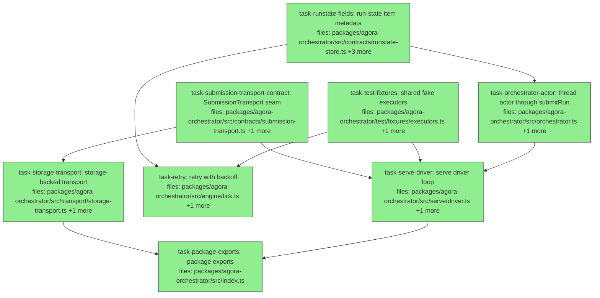

## Context

Driven by the Agora Offload V1 spec (`docs/superpowers/specs/2026-05-29-agora-offload-v1-design.md`).
This is the **`offload-runner`** wave (spec §9) — the first offload wave, building
on the merged secret-store unification (PR4a #13 + PR4b #14): the `serve` driver +
storage-backed `SubmissionTransport` (§1.1.1–1.1.2, D5/D10), plus the run-state
metadata that retry and attribution need. After this wave a client can write a Run
to an inbox, the service ingests + drives it to terminal unattended, and publishes
status to an outbox — **no inbound networking, the service is the sole DB owner** (D3).

> Naming note: the repo's "PR4" is the secret-store unification (#13/#14). The
> offload waves are content-named (`offload-runner` → `offload-launch`) to avoid
> colliding with the repo's merge-order PR numbers.

**Explicitly out of this wave (later DAG plans):** sandbox-escape + dispatch
manifest (`offload-escape`), the audit log + `Signer`/`AuditAnchor` seam
(`offload-audit`), the operator CLI/MCP surface (`offload-surface`), the
`offload-fanout` demo + BSL packaging (`offload-launch`). Each is additive on this spine.

**Scope notes:**
- *Persistent run-state* (D4) needs no new code — `SqliteRunStateStore` already
  takes a file path; the `serve` driver constructs it with one. This wave adds
  only the new *columns/methods* (actor, attempts, backoff).
- *Actor* here is a **mechanism** — an identity primitive recorded on submit
  (spec §6.4). It is NOT authorization policy; agora never owns policy (spec
  §1.2, "authz is implementor-owned"). This wave just persists who submitted.
- The `SubmissionTransport` and `AuditAnchor` seams keep S3→HTTP and the audit
  layer additive; this wave touches only the transport seam.

## Tasks

## Task: Submission transport contract

```yaml
id: task-submission-transport-contract
depends_on: []
files:
  - packages/agora-orchestrator/src/contracts/submission-transport.ts
  - packages/agora-orchestrator/src/contracts/index.ts
status: done
```

Define the `SubmissionTransport` seam (spec §1.1.2, D5/D10): clients write a Run +
submitter actor to an inbox; the service polls and ingests; status/completion go
to an outbox. Pure contract — no storage logic here. Re-export from the contracts
barrel.

## Implementation

```typescript
// packages/agora-orchestrator/src/contracts/submission-transport.ts
import type { Run } from './types.js';

/** A client submission: the plan plus who submitted it (identity primitive — not authz). */
export interface SubmissionEnvelope {
  run: Run;
  actor: string;        // e.g. "human:brett" | "agent:<id>"
  submittedAt: string;  // ISO-8601
}

export const OUTBOX_KINDS = ['status', 'completed'] as const;
export type OutboxKind = (typeof OUTBOX_KINDS)[number];

/** One record the service publishes for clients to read (status / watch). */
export interface OutboxRecord {
  runId: string;
  kind: OutboxKind;
  body: unknown;        // status tree or completion summary
  at: string;           // ISO-8601
}

/**
 * Inbox/outbox over a prefix convention (D10). Storage-backed impls live in
 * src/transport/. No inbound networking: the service polls, never listens.
 */
export interface SubmissionTransport {
  submit(env: SubmissionEnvelope): Promise<string>;   // client → inbox; returns run id
  pollInbox(): Promise<SubmissionEnvelope[]>;          // service: claim new, un-ingested submissions
  publish(rec: OutboxRecord): Promise<void>;           // service → outbox
  readOutbox(runId: string): Promise<OutboxRecord[]>;  // client: read status/completion
}
```

```typescript
// packages/agora-orchestrator/test/submission-transport.test.ts
import { describe, it, expect } from 'vitest';
import { OUTBOX_KINDS } from '../src/contracts/submission-transport.js';

describe('submission transport contract', () => {
  it('enumerates exactly the status and completed outbox kinds', () => {
    expect([...OUTBOX_KINDS]).toEqual(['status', 'completed']);
  });
});
```

## Acceptance criteria

- `SubmissionEnvelope`, `OutboxRecord`, `OutboxKind`, `SubmissionTransport`, and
  `OUTBOX_KINDS` are exported and reachable via `../contracts/index.js`.
- `OUTBOX_KINDS` is `['status','completed']`; `OutboxKind` is its element union.
- `tsc --noEmit` is clean; no runtime logic in this file beyond the const.

Test file: `packages/agora-orchestrator/test/submission-transport.test.ts`.

## Task: Run-state item metadata columns

```yaml
id: task-runstate-fields
depends_on: []
files:
  - packages/agora-orchestrator/src/contracts/runstate-store.ts
  - packages/agora-orchestrator/src/contracts/types.ts
  - packages/agora-orchestrator/src/runstate/sqlite.ts
  - packages/agora-orchestrator/test/runstate-sqlite.test.ts
status: done
```

Extend run-state with the per-item fields retry and attribution need: `actor`
(who submitted), `attempts` (retry counter), and `nextAttemptAt` (backoff gate).
New `ItemState` fields are optional/defaulted so existing consumers (`tick`,
`getStatus`) are unaffected. Adds the store methods and a guarded migration.

## Implementation

```typescript
// packages/agora-orchestrator/src/contracts/types.ts — extend ItemState (new fields optional)
export interface ItemState extends WorkItem {
  runId: string;
  queue: string;
  status: RunStatus;
  dispatchHash?: string;
  actor?: string;          // submitter identity (mechanism, not authz)
  attempts?: number;       // retry counter; absent === 0
  nextAttemptAt?: number;  // epoch ms; item not fired before this (backoff). absent === fire now
}

// packages/agora-orchestrator/src/contracts/runstate-store.ts — extend RunStateStore
export interface RunStateStore {
  // ...existing members unchanged...
  saveRun(run: Run, actor?: string): void;             // CHANGED: optional actor, stamped per item
  getActor(itemId: string): string | undefined;
  getAttempts(itemId: string): number;
  bumpAttempt(itemId: string): void;                   // attempts += 1
  requeue(itemId: string, notBeforeMs: number): void;  // status -> 'ready', nextAttemptAt = notBeforeMs
}
```

```typescript
// packages/agora-orchestrator/test/runstate-sqlite.test.ts
import { describe, it, expect } from 'vitest';
import { SqliteRunStateStore } from '../src/runstate/sqlite.js';

describe('run-state metadata', () => {
  it('stamps actor and starts attempts at zero', () => {
    const s = new SqliteRunStateStore();
    s.ensureQueue('default', 1);
    s.saveRun({ id: 'r', queue: 'default', items: [
      { id: 'a', executor: 'x', inputs: {}, depends_on: [], resourceLocks: [] } ] }, 'human:brett');
    expect(s.getActor('a')).toBe('human:brett');
    expect(s.getAttempts('a')).toBe(0);
    s.bumpAttempt('a');
    expect(s.getAttempts('a')).toBe(1);
  });

  it('round-trips an item saved without the new fields (backward compat)', () => {
    const s = new SqliteRunStateStore();
    s.ensureQueue('default', 1);
    s.saveRun({ id: 'r', queue: 'default', items: [
      { id: 'a', executor: 'x', inputs: {}, depends_on: [], resourceLocks: [] } ] }); // no actor
    const item = s.getItems().find((i) => i.id === 'a')!;
    expect(item.actor).toBeUndefined();
    expect(item.attempts ?? 0).toBe(0);          // absent reads as 0
    expect(item.nextAttemptAt).toBeUndefined();  // absent === fire now
  });
});
```

## Acceptance criteria

- New columns `actor`, `attempts` (default 0), `next_attempt_at` exist on `items`;
  opening a pre-existing db without them runs the guarded `ALTER TABLE` without error.
- `saveRun(run, 'human:brett')` makes `getActor(itemId) === 'human:brett'` for each item.
- `getAttempts` returns 0 before any bump and increments by 1 per `bumpAttempt`.
- `requeue(id, t)` sets the item back to `ready` and `nextAttemptAt === t`.
- Existing run-state round-trip tests still pass (new `ItemState` fields are optional).
- An item saved with no actor/attempts/nextAttemptAt round-trips through `getItems`
  with those fields `undefined`; `getAttempts` reads absent as `0` (tested).

Test file: `packages/agora-orchestrator/test/runstate-sqlite.test.ts`.

## Task: Shared test executors fixture

```yaml
id: task-test-fixtures
depends_on: []
files:
  - packages/agora-orchestrator/test/fixtures/executors.ts
  - packages/agora-orchestrator/test/fixtures/executors.test.ts
status: done
```

One owner for the fake `Executor`s the retry and serve tests both need, so they
are not reinvented per test (audit DRY/S7). Provides an `immediateExecutor`
(reconciles to `done`), a `failingExecutor` (reconciles to `failed`), and
`setupOneFiredItem` (a store with one item already fired under a named executor).

## Implementation

```typescript
// packages/agora-orchestrator/test/fixtures/executors.ts
import { SqliteRunStateStore } from '../../src/runstate/sqlite.js';
import type { Executor, RunStateStore } from '../../src/contracts/index.js';

export const immediateExecutor = (): Executor => ({
  id: 'x',
  async fire() { return { dispatchHash: 'h' }; },
  async reconcile() { return { status: 'done' }; },
});

export const failingExecutor = (): Executor => ({
  id: 'x',
  async fire() { return { dispatchHash: 'h' }; },
  async reconcile() { return { status: 'failed' }; },
});

/** A store with item `id` already `running` under executor 'x' (ready to reconcile). */
export function setupOneFiredItem(id: string): { store: RunStateStore; executors: Record<string, Executor> } {
  const store = new SqliteRunStateStore();
  store.ensureQueue('default', 1);
  store.saveRun({ id: 'r', queue: 'default', items: [
    { id, executor: 'x', inputs: {}, depends_on: [], resourceLocks: [] } ] });
  store.markReady([id]);
  store.setRunning(id, 'h');
  return { store, executors: { x: failingExecutor() } };
}
```

```typescript
// packages/agora-orchestrator/test/fixtures/executors.test.ts
import { describe, it, expect } from 'vitest';
import { immediateExecutor, failingExecutor } from './executors.js';

describe('test executor fixtures', () => {
  it('immediate reconciles done, failing reconciles failed', async () => {
    expect((await immediateExecutor().reconcile('h'))?.status).toBe('done');
    expect((await failingExecutor().reconcile('h'))?.status).toBe('failed');
  });
});
```

## Acceptance criteria

- `immediateExecutor().reconcile()` yields `{ status: 'done' }`; `failingExecutor()`
  yields `{ status: 'failed' }`.
- `setupOneFiredItem('a')` returns a store whose item `a` is `running` plus an
  `executors` map keyed `'x'`.
- No production code imports these fixtures (test-only).

Test file: `packages/agora-orchestrator/test/fixtures/executors.test.ts`.

## Task: Storage-backed submission transport

```yaml
id: task-storage-transport
depends_on: [task-submission-transport-contract]
files:
  - packages/agora-orchestrator/src/transport/storage-transport.ts
  - packages/agora-orchestrator/test/storage-transport.test.ts
status: done
```

Implement `SubmissionTransport` over the existing `StorageProvider` seam (D10) —
inbox/outbox are prefix conventions, so local FS and S3 both work with no new
storage code. Ingestion is idempotent under the **single-poller invariant** (D3:
exactly one `serve` process owns ingestion); the `.claimed` marker dedupes
re-polls within that one process. Multi-replica ingestion would need a
distributed lock — explicitly out of scope (D3 forbids >1 owner). Storage-boundary
failures are wrapped with run-id context rather than leaking raw provider errors.

## Implementation

```typescript
// packages/agora-orchestrator/src/transport/storage-transport.ts
import type { StorageProvider } from '@quarry-systems/agora-core';
import type { SubmissionTransport, SubmissionEnvelope, OutboxRecord } from '../contracts/index.js';

const enc = (v: unknown) => new TextEncoder().encode(JSON.stringify(v));
const dec = (b: Uint8Array) => JSON.parse(new TextDecoder().decode(b));

export class StorageSubmissionTransport implements SubmissionTransport {
  constructor(private readonly storage: StorageProvider, private readonly ns = 'orchestrator') {}
  private inbox = (id: string) => `${this.ns}/submissions/${id}.json`;
  private claimed = (id: string) => `${this.ns}/submissions/${id}.claimed`;
  private outbox = (id: string, at: string) => `${this.ns}/outbox/${id}/${at}.json`;

  async submit(env: SubmissionEnvelope): Promise<string> {
    try {
      await this.storage.put(this.inbox(env.run.id), enc(env));
      return env.run.id;
    } catch (err) {
      throw new Error(`submit run ${env.run.id} failed`, { cause: err });
    }
  }
  async pollInbox(): Promise<SubmissionEnvelope[]> {
    const entries = await this.storage.list(`${this.ns}/submissions/`);
    const out: SubmissionEnvelope[] = [];
    for (const e of entries) {
      if (!e.uri.endsWith('.json')) continue;
      const env = dec(await this.storage.get(e.uri)) as SubmissionEnvelope;
      if (await this.isClaimed(env.run.id)) continue;     // already ingested
      await this.storage.put(this.claimed(env.run.id), enc({ at: env.submittedAt }));
      out.push(env);
    }
    return out;
  }
  async publish(rec: OutboxRecord): Promise<void> {
    await this.storage.put(this.outbox(rec.runId, rec.at), enc(rec));
  }
  async readOutbox(runId: string): Promise<OutboxRecord[]> {
    const entries = await this.storage.list(`${this.ns}/outbox/${runId}/`);
    const out: OutboxRecord[] = [];
    for (const e of entries) {
      const body = await this.storage.get(e.uri);
      if (!body?.length) continue;            // tolerate a partial/empty write
      out.push(dec(body) as OutboxRecord);
    }
    return out;
  }
  private async isClaimed(id: string): Promise<boolean> {
    return (await this.storage.list(`${this.ns}/submissions/`)).some((e) => e.uri.endsWith(`${id}.claimed`));
  }
}
```

```typescript
// packages/agora-orchestrator/test/storage-transport.test.ts
import { describe, it, expect } from 'vitest';
import type { StorageProvider } from '@quarry-systems/agora-core';
import { StorageSubmissionTransport } from '../src/transport/storage-transport.js';

function memStorage(): StorageProvider {
  const m = new Map<string, Uint8Array>();
  return {
    name: 'mem',
    async put(uri, c) { m.set(uri, c); return { contentHash: 'h' }; },
    async get(uri) { return m.get(uri)!; },
    async list(prefix) { return [...m.keys()].filter((k) => k.startsWith(prefix))
      .map((uri) => ({ uri, contentHash: 'h', registeredAt: '' })); },
  } as unknown as StorageProvider;
}

describe('storage submission transport', () => {
  it('round-trips a submission and never re-ingests a claimed one', async () => {
    const t = new StorageSubmissionTransport(memStorage());
    await t.submit({ run: { id: 'r1', queue: 'default', items: [] }, actor: 'human:b', submittedAt: '2026-05-30T00:00:00Z' });
    expect((await t.pollInbox()).map((e) => e.run.id)).toEqual(['r1']);
    expect(await t.pollInbox()).toEqual([]); // claimed — not returned twice
  });
});
```

## Acceptance criteria

- `submit(env)` then `pollInbox()` returns that envelope exactly once; a second
  `pollInbox()` returns `[]` (idempotent ingest via the `.claimed` marker).
- `publish(rec)` then `readOutbox(rec.runId)` returns the record; an empty/partial
  outbox object is skipped, not thrown on.
- A failing `storage.put` in `submit` throws an error whose message names the run
  id and whose `cause` is the provider error (no raw provider error leaks).
- Uses only `StorageProvider.put/get/list`; works against any provider impl.
- Inbox/outbox are pure prefix conventions under the configurable namespace.
- Documented single-poller assumption (D3); no atomic-CAS needed because only one
  `serve` process ingests.

Test file: `packages/agora-orchestrator/test/storage-transport.test.ts`.

## Task: Thread submitter actor through submitRun

```yaml
id: task-orchestrator-actor
depends_on: [task-runstate-fields]
files:
  - packages/agora-orchestrator/src/orchestrator.ts
  - packages/agora-orchestrator/test/orchestrator.test.ts
status: done
```

Make `submitRun` accept the submitter `actor` and pass it to `store.saveRun`, so
attribution is recorded at submission (spec §6.4, mechanism only). Backward
compatible: `actor` is optional. Also surface `runId` on `StatusItem` so callers
(the `serve` driver's outbox publish) key records by run without parsing item ids.

## Implementation

```typescript
// packages/agora-orchestrator/src/orchestrator.ts — submitRun threads actor; StatusItem gains runId
export interface StatusItem { id: string; runId: string; status: string; blockedBy: string[]; }

  submitRun(run: Run, actor?: string): string {
    const trigger = this.triggers['manual'];
    if (!trigger) throw new Error("AgoraOrchestrator: no 'manual' trigger registered");
    this.store.saveRun(run, actor);          // CHANGED: pass actor through
    this.store.markReady(trigger.initialReady(run));
    return run.id;
  }
  // getStatus(): include runId in each StatusItem -> ({ id: i.id, runId: i.runId, status: i.status, blockedBy })
```

```typescript
// packages/agora-orchestrator/test/orchestrator.test.ts
import { describe, it, expect } from 'vitest';
import { AgoraOrchestrator, SqliteRunStateStore, ManualTrigger } from '../src/index.js';

describe('submitRun attribution', () => {
  it('records the submitter actor on the run items', () => {
    const store = new SqliteRunStateStore();
    const orch = new AgoraOrchestrator({ store, executors: {}, triggers: { manual: new ManualTrigger() }, queues: { default: { concurrency: 1 } } });
    orch.submitRun({ id: 'r', queue: 'default', items: [
      { id: 'a', executor: 'x', inputs: {}, depends_on: [], resourceLocks: [] } ] }, 'agent:claude');
    expect(store.getActor('a')).toBe('agent:claude');
  });
});
```

## Acceptance criteria

- `submitRun(run, actor)` records `actor` on every item of the run (`getActor`
  returns it).
- `submitRun(run)` with no actor still works (actor is `undefined`).
- `getStatus()` items each carry `runId` (the owning run's id).
- Existing `submitRun`/`getStatus` tests still pass.

Test file: `packages/agora-orchestrator/test/orchestrator.test.ts`.

## Task: Retry with backoff on failed reconcile

```yaml
id: task-retry
depends_on: [task-runstate-fields, task-test-fixtures]
files:
  - packages/agora-orchestrator/src/engine/tick.ts
  - packages/agora-orchestrator/test/tick.test.ts
status: done
```

When a reconcile returns `failed` and the item has attempts remaining, requeue it
with exponential backoff instead of terminally failing (spec §4). The fire step
skips ready items whose `nextAttemptAt` is still in the future. `maxAttempts` is a
tick option (default 2); `now` is injectable for deterministic tests.

## Implementation

```typescript
// packages/agora-orchestrator/src/engine/tick.ts — retry-aware reconcile + backoff-gated fire
export async function tick(
  store: RunStateStore, executors: Record<string, Executor>, queue: string,
  opts: { maxAttempts?: number; now?: number; backoffMs?: (n: number) => number } = {},
): Promise<{ readied: number; fired: number; reconciled: number }> {
  const maxAttempts = opts.maxAttempts ?? 2;
  const now = opts.now ?? Date.now();
  const backoff = opts.backoffMs ?? ((n) => 1000 * 2 ** n);
  // ...existing ready + reconcile loop, except on a failed result:
  //   if (res.status === 'failed' && store.getAttempts(it.id) + 1 < maxAttempts) {
  //     store.bumpAttempt(it.id); store.releaseLocks(it.id);
  //     store.requeue(it.id, now + backoff(store.getAttempts(it.id)));
  //   } else { store.setStatus(it.id, res.status); store.releaseLocks(it.id); }
  // ...fire step: among ready items, skip any with (nextAttemptAt ?? 0) > now.
}
```

```typescript
// packages/agora-orchestrator/test/tick.test.ts
import { describe, it, expect } from 'vitest';
import { tick } from '../src/engine/tick.js';
import { setupOneFiredItem } from './fixtures/executors.js';   // shared fixture (DRY)
describe('retry with backoff', () => {
  it('requeues a failed item with attempts remaining instead of failing it', async () => {
    const { store, executors } = setupOneFiredItem('a'); // item 'a' running, executor reconciles 'failed'
    await tick(store, executors, 'default', { maxAttempts: 2, now: 1000 });
    const a = store.getItems().find((i) => i.id === 'a')!;
    expect(a.status).toBe('ready');
    expect(a.attempts).toBe(1);
    expect(a.nextAttemptAt).toBeGreaterThan(1000);
  });
});
```

## Acceptance criteria

- A `failed` reconcile with `attempts + 1 < maxAttempts` requeues the item
  (`status === 'ready'`), bumps `attempts`, releases its locks, and sets
  `nextAttemptAt = now + backoff(attempts)`.
- Once attempts are exhausted, the item becomes terminally `failed` (existing
  cascade-to-`skipped` for dependents is unchanged).
- The fire step does not fire a ready item whose `nextAttemptAt > now`.
- `now` and `maxAttempts` are injectable; default `maxAttempts` is 2.
- Existing `tick` tests still pass (no retry path when reconcile succeeds).

Test file: `packages/agora-orchestrator/test/tick.test.ts`.

## Task: The serve driver loop

```yaml
id: task-serve-driver
depends_on: [task-submission-transport-contract, task-orchestrator-actor, task-test-fixtures]
files:
  - packages/agora-orchestrator/src/serve/driver.ts
  - packages/agora-orchestrator/test/serve-driver.test.ts
status: done
```

The long-running driver (spec §5, D3): the sole `tick()` caller and DB owner. Each
loop: poll the inbox → ingest via `submitRun(run, actor)` → `tick` → publish a
status record → sleep. Stops cleanly on an `AbortSignal`. Startup is
reconcile-first: the first iteration reconciles in-flight items before the loop
reports running.

## Implementation

```typescript
// packages/agora-orchestrator/src/serve/driver.ts
import type { AgoraOrchestrator } from '../orchestrator.js';
import type { SubmissionTransport } from '../contracts/index.js';

export interface ServeOptions {
  orchestrator: AgoraOrchestrator;
  transport: SubmissionTransport;
  queue?: string;
  tickIntervalMs?: number;
  signal?: AbortSignal;
  now?: () => number;            // injectable clock for tests
}

export async function serve(opts: ServeOptions): Promise<void> {
  const queue = opts.queue ?? 'default';
  const interval = opts.tickIntervalMs ?? 2000;
  await opts.orchestrator.tick(queue);                       // reconcile-first pass on startup
  while (!opts.signal?.aborted) {
    for (const env of await opts.transport.pollInbox()) opts.orchestrator.submitRun(env.run, env.actor);
    await opts.orchestrator.tick(queue);
    const at = new Date(opts.now?.() ?? Date.now()).toISOString();
    const byRun = new Map<string, unknown[]>();          // group items by their run (StatusItem.runId)
    for (const s of opts.orchestrator.getStatus()) (byRun.get(s.runId) ?? byRun.set(s.runId, []).get(s.runId)!).push(s);
    for (const [runId, items] of byRun) await opts.transport.publish({ runId, kind: 'status', body: items, at });
    await sleep(interval, opts.signal);
  }
}
// sleep(ms, signal): resolves early if the signal aborts.
```

```typescript
// packages/agora-orchestrator/test/serve-driver.test.ts
import { describe, it, expect } from 'vitest';
import { AgoraOrchestrator, SqliteRunStateStore, ManualTrigger } from '../src/index.js';
import { serve } from '../src/serve/driver.js';
import { immediateExecutor } from './fixtures/executors.js';   // shared fixture (DRY)
// fakeTransport: pollInbox yields one envelope once, then []
describe('serve driver', () => {
  it('ingests a submitted run, drives it to terminal, and stops on abort', async () => {
    const store = new SqliteRunStateStore();
    const orch = new AgoraOrchestrator({ store, executors: { x: immediateExecutor() }, triggers: { manual: new ManualTrigger() }, queues: { default: { concurrency: 1 } } });
    const ac = new AbortController();
    const transport = fakeTransport({ run: { id: 'r', queue: 'default', items: [
      { id: 'a', executor: 'x', inputs: {}, depends_on: [], resourceLocks: [] } ] }, actor: 'human:b', submittedAt: '' }, ac);
    await serve({ orchestrator: orch, transport, tickIntervalMs: 1, signal: ac.signal });
    expect(store.getItems().find((i) => i.id === 'a')!.status).toBe('done');
    expect(transport.published.length).toBeGreaterThan(0);
  });
});
```

## Acceptance criteria

- `serve` ingests every envelope from `pollInbox()` via `submitRun(run, actor)`,
  ticks the queue, and publishes **one** status `OutboxRecord` **per run** per
  iteration (items grouped by `StatusItem.runId`).
- The loop exits promptly when `signal` is aborted (no hang); `sleep` is
  abort-aware.
- The startup reconcile-first pass runs before the main loop.
- A submitted single-item run reaches `done` under an immediate executor.
- `serve` calls `orchestrator.tick` only (it never opens the DB directly).

Test file: `packages/agora-orchestrator/test/serve-driver.test.ts`.

## Task: Package exports

```yaml
id: task-package-exports
depends_on: [task-storage-transport, task-serve-driver]
is_wiring_task: true
files:
  - packages/agora-orchestrator/src/index.ts
status: done
```

Expose the new runner surface from the package root. The `SubmissionTransport`
contract types already flow through `export * from './contracts/index.js'`; this
task adds the concrete `StorageSubmissionTransport` and the `serve` driver (plus
its `ServeOptions` type).

## Acceptance criteria

- `import { StorageSubmissionTransport, serve } from '@quarry-systems/agora-orchestrator'`
  resolves after this task.
- `ServeOptions` is exported as a type.
- Existing exports (`AgoraOrchestrator`, `DispatchExecutor`, `SqliteRunStateStore`,
  `ManualTrigger`, the contracts barrel, etc.) are preserved; the file is valid TS.

Test file: `packages/agora-orchestrator/test/index.test.ts`.
