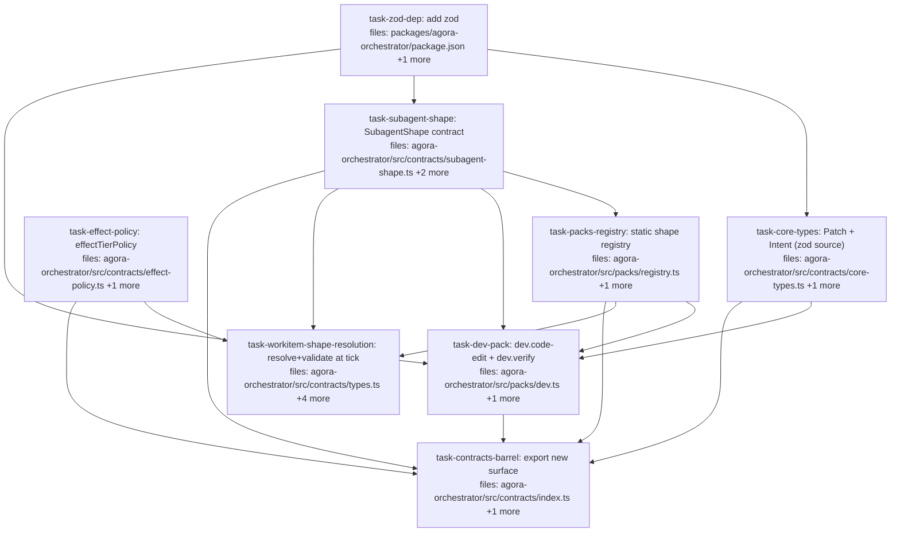

## Context

PR5 of the orchestrator ladder: the **dev pack + SubagentShape** rung (spec:
`docs/superpowers/specs/2026-05-28-agora-orchestrator-design.md` §1–§4). Turns the
orchestrator from "dispatch opaque `subagent` strings" into "dispatch typed,
schema-validated work shapes." Builds on the shipped skeleton (registries, core
types, `EffectTier`) and the dispatch-executor (PR3). The secret substrate
underneath is now solid (PR4a/PR4b merged).

**Scope (what PR5 delivers):**
- `SubagentShape` contract — `{ id, effectTier, inputSchema, outputSchema, capability }`.
- A static **packs registry** with construction-time duplicate-id + field validation (D8).
- A **dev pack** contributing `dev.code-edit` (write-impure) and `dev.verify` (read-impure).
- `WorkItem` gains an optional `subagentShape` id; the **tick resolves the shape, validates `inputs` against `inputSchema` at the boundary, and reads `effectTier`**.
- **effectTier is declared on every shape, validated at registration, and read by the policy engine** (`effectTierPolicy`) — the user-requested fold-in.

**Decisions (resolved):**
- **Schema lib = `zod`.** The spec allows "Zod/JSON Schema"; zod is the TS-idiomatic pick. It is **net-new to the monorepo** (used nowhere today) — a conscious choice to adopt a schema lib. Added as an `agora-orchestrator` dependency.
- **Single source of truth for shared shapes.** `core-types.ts` defines the zod schemas (`patchSchema`, `intentSchema`) and derives the TS types via `z.infer`; packs import the schemas — never re-inline them (DRY).
- **Input validated, output declared-not-enforced.** `outputSchema` lives on the shape, but enforcement via `.agora/output.json` is **D7 → PR6**. PR5 validates the *input* side.
- **Invalid input / unknown shape FAILS THE ITEM, not the tick.** The orchestrator is a long-running service (D3); a malformed `WorkItem` marks *that item* `failed` with a reason and the tick keeps going — it never throws out of the tick loop.
- **`effectTierPolicy` is read, not enforced** in PR5 — surfaces `{ cacheable, needsSnapshot, gated }`; snapshot/intent-gating enforcement is PR6+.
- **`WorkItem.subagentShape` + the `packs` registry are OPTIONAL** on `tick()` and `AgoraOrchestratorOptions` — existing executor-only items and orchestrator constructions are untouched; resolution engages only when a shape id is present.
- **`Patch` + `Intent` only** enter core types now (§11; `Claim` reserved for Mneme; `Document`/`FileRef` await a second consumer).
- **Executors stay mechanism-only** — resolution/validation live in the tick/orchestrator layer, never inside `dispatch-executor`.

**Audit revisions (2026-05-30):** folded in DRY single-source schemas (#1), the
grep'd tick/orchestrator consumer cascade + corrected test paths (#2), fail-the-item
error handling (#3), and a shared test fixture (#4). `task-workitem-shape-resolution`
is intentionally one vertical slice (the `subagentShape` field is inert without its
resolver) rather than split into a stub contract task (#5). Cross-task imports use
direct module paths; the barrels are wired last by `task-contracts-barrel`.

## Tasks

## Task: add zod dependency

```yaml
id: task-zod-dep
depends_on: []
files:
  - packages/agora-orchestrator/package.json
  - pnpm-lock.yaml
status: pending
is_wiring_task: true
```

Add `zod` as an `agora-orchestrator` dependency so SubagentShape can hold typed
input/output schemas, `core-types` can be the single zod source, and the tick can
validate inputs at the boundary. zod is currently used nowhere in the monorepo.

## Acceptance criteria

- `zod` (`^3`) is in `packages/agora-orchestrator/package.json` dependencies.
- `pnpm install` succeeds; `pnpm-lock.yaml` gains the new edge only.
- `pnpm --filter @quarry-systems/agora-orchestrator typecheck` still passes (no usage yet).

Test file: none (dependency wiring; verified by the consuming tasks' builds).

## Task: define narrow-waist core types

```yaml
id: task-core-types
depends_on: [task-zod-dep]
files:
  - packages/agora-orchestrator/src/contracts/core-types.ts
  - packages/agora-orchestrator/test/core-types.test.ts
status: pending
```

The narrow-waist shared types packs interop through (spec §2). Trunk builds only
`Patch` (a unified diff against a declared base commit) and `Intent` (a structured
side-effect proposal). **The zod schema is the single source of truth**; the TS
types are derived via `z.infer` so packs and validators can never drift.

## Implementation

```typescript
// packages/agora-orchestrator/src/contracts/core-types.ts
import { z } from "zod";

/** A unified diff against a declared base commit hash. */
export const patchSchema = z.object({
  baseCommit: z.string(),   // commit hash the diff applies against
  diff: z.string(),         // unified-diff text
});
export type Patch = z.infer<typeof patchSchema>;

/** A structured proposal for a side effect; realized later by an IntentInterpreter (write-impure). */
export const intentSchema = z.object({
  kind: z.string(),                 // e.g. "open-pr", "post-comment"
  payload: z.record(z.unknown()),
});
export type Intent = z.infer<typeof intentSchema>;
```

```typescript
// packages/agora-orchestrator/test/core-types.test.ts
import { patchSchema, intentSchema, type Patch } from "../src/contracts/core-types.js";
it("patchSchema is the source of truth and the type is inferred from it", () => {
  const p: Patch = { baseCommit: "abc123", diff: "--- a\n+++ b\n" };
  expect(patchSchema.safeParse(p).success).toBe(true);
  expect(patchSchema.safeParse({ baseCommit: 1, diff: "x" }).success).toBe(false);
  expect(intentSchema.safeParse({ kind: "open-pr", payload: {} }).success).toBe(true);
});
```

## Acceptance criteria

- `patchSchema`/`intentSchema` (zod) and the `z.infer`-derived `Patch`/`Intent` types are exported from `core-types.ts` — types are NOT hand-written separately from the schemas.
- No other core types are added (Claim/Document/FileRef deferred per §2).
- Valid values parse; malformed values fail `safeParse`.

Test file: `packages/agora-orchestrator/test/core-types.test.ts`.

## Task: effectTierPolicy classifier

```yaml
id: task-effect-policy
depends_on: []
files:
  - packages/agora-orchestrator/src/contracts/effect-policy.ts
  - packages/agora-orchestrator/test/effect-policy.test.ts
status: pending
```

The policy engine's read of the effect-tier spine (spec §1). A pure function
mapping an `EffectTier` to a policy decision the orchestrator can act on. PR5
surfaces the classification; enforcement (snapshot/gate) is PR6+.

## Implementation

```typescript
// packages/agora-orchestrator/src/contracts/effect-policy.ts
import type { EffectTier } from "./types.js";

export interface EffectPolicy {
  cacheable: boolean;       // pure work is replayable/cacheable
  needsSnapshot: boolean;   // read-impure: snapshot live state pre-dispatch
  gated: boolean;           // write-impure: intent must pass interpreter policy
}

export function effectTierPolicy(tier: EffectTier): EffectPolicy {
  switch (tier) {
    case "pure":         return { cacheable: true,  needsSnapshot: false, gated: false };
    case "read-impure":  return { cacheable: false, needsSnapshot: true,  gated: false };
    case "write-impure": return { cacheable: false, needsSnapshot: false, gated: true  };
  }
}
```

```typescript
// packages/agora-orchestrator/test/effect-policy.test.ts
import { effectTierPolicy } from "../src/contracts/effect-policy.js";
it("classifies each tier", () => {
  expect(effectTierPolicy("pure").cacheable).toBe(true);
  expect(effectTierPolicy("read-impure").needsSnapshot).toBe(true);
  expect(effectTierPolicy("write-impure").gated).toBe(true);
});
```

## Acceptance criteria

- `effectTierPolicy(tier)` returns the documented `EffectPolicy` for each tier (exhaustive switch; a missing case is a compile error).
- Pure function — no I/O, deterministic.

Test file: `packages/agora-orchestrator/test/effect-policy.test.ts`.

## Task: SubagentShape contract

```yaml
id: task-subagent-shape
depends_on: [task-zod-dep]
files:
  - packages/agora-orchestrator/src/contracts/subagent-shape.ts
  - packages/agora-orchestrator/test/subagent-shape.test.ts
  - packages/agora-orchestrator/test/support/make-shape.ts
status: pending
```

The pack-contributed declaration of what work can be done (spec §3). Holds typed
zod schemas for input/output, the effect tier (read by the policy engine), and the
capability descriptor. Includes a `validateShape` guard the registry uses. Also
owns the shared `make-shape.ts` test fixture (imported by the registry + dev tests)
so the `SubagentShape` fixture isn't hand-rebuilt in three places (DRY).

## Implementation

```typescript
// packages/agora-orchestrator/src/contracts/subagent-shape.ts
import { z } from "zod";
import type { EffectTier } from "./types.js";

export interface Capability {
  imageDigest: string;                     // pinned container image
  permissions: Record<string, unknown>;    // capability-scoped policy
  contextShape: string;                    // declarative description of staged context
}

export interface SubagentShape {
  id: string;                              // "<pack>.<name>", e.g. "dev.code-edit"
  effectTier: EffectTier;
  inputSchema: z.ZodType<unknown>;
  outputSchema: z.ZodType<unknown>;        // declared now; enforced via .agora/output.json in PR6
  capability: Capability;
}

const ID_RE = /^[a-z0-9-]+\.[a-z0-9-]+$/;  // pack-prefixed

/** Throws on a malformed shape. Used at registry construction (D8). */
export function validateShape(s: SubagentShape): void {
  if (!ID_RE.test(s.id)) throw new Error(`SubagentShape: id "${s.id}" must be "<pack>.<name>"`);
  if (!["pure", "read-impure", "write-impure"].includes(s.effectTier))
    throw new Error(`SubagentShape ${s.id}: invalid effectTier ${s.effectTier}`);
  if (!s.capability?.imageDigest) throw new Error(`SubagentShape ${s.id}: capability.imageDigest required`);
}
```

```typescript
// packages/agora-orchestrator/test/support/make-shape.ts  (shared fixture; imported by registry + dev tests)
import { z } from "zod";
import type { SubagentShape } from "../../src/contracts/subagent-shape.js";

export function makeShape(over: Partial<SubagentShape> = {}): SubagentShape {
  return {
    id: "dev.x", effectTier: "pure",
    inputSchema: z.object({}), outputSchema: z.object({}),
    capability: { imageDigest: "sha256:1", permissions: {}, contextShape: "" },
    ...over,
  };
}
```

```typescript
// packages/agora-orchestrator/test/subagent-shape.test.ts
import { validateShape } from "../src/contracts/subagent-shape.js";
import { makeShape } from "./support/make-shape.js";
it("rejects an unprefixed id", () => {
  expect(() => validateShape(makeShape({ id: "noprefix" }))).toThrow(/<pack>\.<name>/);
});
it("requires capability.imageDigest", () => {
  expect(() => validateShape(makeShape({ capability: { imageDigest: "", permissions: {}, contextShape: "" } }))).toThrow(/imageDigest/);
});
```

## Acceptance criteria

- `SubagentShape` + `Capability` interfaces exported; `inputSchema`/`outputSchema` are `z.ZodType`.
- `validateShape` rejects: non `<pack>.<name>` ids, invalid `effectTier`, missing `capability.imageDigest`; a well-formed shape passes.
- `test/support/make-shape.ts` exports a `makeShape(overrides)` fixture used by this task's test (and consumed by the registry + dev tests).

Test file: `packages/agora-orchestrator/test/subagent-shape.test.ts`.

## Task: static packs registry

```yaml
id: task-packs-registry
depends_on: [task-subagent-shape]
files:
  - packages/agora-orchestrator/src/packs/registry.ts
  - packages/agora-orchestrator/test/packs/registry.test.ts
status: pending
```

A static (construction-time) registry of `SubagentShape`s keyed by id, rejecting
duplicates and malformed shapes at build (D8 — static maps, not a dynamic
registry). The orchestrator resolves shapes through it.

## Implementation

```typescript
// packages/agora-orchestrator/src/packs/registry.ts
import { validateShape, type SubagentShape } from "../contracts/subagent-shape.js";

export class PackRegistry {
  private readonly shapes = new Map<string, SubagentShape>();
  constructor(shapes: SubagentShape[]) {
    for (const s of shapes) {
      validateShape(s);
      if (this.shapes.has(s.id)) throw new Error(`PackRegistry: duplicate shape id ${s.id}`);
      this.shapes.set(s.id, s);
    }
  }
  get(id: string): SubagentShape | undefined { return this.shapes.get(id); }
  has(id: string): boolean { return this.shapes.has(id); }
}
```

```typescript
// packages/agora-orchestrator/test/packs/registry.test.ts
import { PackRegistry } from "../../src/packs/registry.js";
import { makeShape } from "../support/make-shape.js";
it("rejects duplicate ids at construction", () => {
  expect(() => new PackRegistry([makeShape({ id: "dev.a" }), makeShape({ id: "dev.a" })])).toThrow(/duplicate shape id dev\.a/);
});
it("resolves a registered shape by id", () => {
  const r = new PackRegistry([makeShape({ id: "dev.a" })]);
  expect(r.get("dev.a")?.id).toBe("dev.a");
  expect(r.has("dev.b")).toBe(false);
});
```

## Acceptance criteria

- `PackRegistry` constructor runs `validateShape` on each shape and throws on a duplicate id.
- `get(id)` / `has(id)` resolve registered shapes; `get` returns `undefined` for unknown ids.
- Construction-time only — no runtime mutation API.

Test file: `packages/agora-orchestrator/test/packs/registry.test.ts`.

## Task: build the dev pack

```yaml
id: task-dev-pack
depends_on: [task-zod-dep, task-core-types, task-subagent-shape, task-packs-registry]
files:
  - packages/agora-orchestrator/src/packs/dev.ts
  - packages/agora-orchestrator/test/packs/dev.test.ts
status: pending
```

The first concrete pack: `dev.code-edit` (write-impure — emits a `Patch`/`Intent`)
and `dev.verify` (read-impure — runs checks against a snapshot). Demonstrates
shapes carrying effect tiers + core-type-referencing schemas, registered through
`PackRegistry`. **Imports `patchSchema`/`intentSchema` from `core-types`** — never
re-inlines the patch shape (DRY single source).

## Implementation

```typescript
// packages/agora-orchestrator/src/packs/dev.ts
import { z } from "zod";
import { patchSchema, intentSchema } from "../contracts/core-types.js";
import type { SubagentShape } from "../contracts/subagent-shape.js";
import { PackRegistry } from "./registry.js";

const WORKER_IMAGE = "sha256:PLACEHOLDER"; // pin to the real worker image digest

export const devCodeEdit: SubagentShape = {
  id: "dev.code-edit",
  effectTier: "write-impure",
  inputSchema: z.object({ baseCommit: z.string(), instructions: z.string() }),
  outputSchema: z.object({ patch: patchSchema, intents: z.array(intentSchema).optional() }),
  capability: { imageDigest: WORKER_IMAGE, permissions: {}, contextShape: "repo worktree at baseCommit" },
};

export const devVerify: SubagentShape = {
  id: "dev.verify",
  effectTier: "read-impure",
  inputSchema: z.object({ patch: patchSchema }),
  outputSchema: z.object({ passed: z.boolean(), report: z.string() }),
  capability: { imageDigest: WORKER_IMAGE, permissions: {}, contextShape: "repo snapshot + patch applied" },
};

export const devPack: SubagentShape[] = [devCodeEdit, devVerify];
export const devRegistry = (): PackRegistry => new PackRegistry(devPack);
```

```typescript
// packages/agora-orchestrator/test/packs/dev.test.ts
import { devPack, devCodeEdit, devVerify } from "../../src/packs/dev.js";
import { PackRegistry } from "../../src/packs/registry.js";
it("dev shapes declare effect tiers and register without collision", () => {
  expect(devCodeEdit.effectTier).toBe("write-impure");
  expect(devVerify.effectTier).toBe("read-impure");
  const r = new PackRegistry(devPack);
  expect(r.get("dev.code-edit")?.inputSchema.safeParse({ baseCommit: "a", instructions: "do x" }).success).toBe(true);
  expect(r.get("dev.code-edit")?.inputSchema.safeParse({ baseCommit: 1 }).success).toBe(false);
});
```

## Acceptance criteria

- `dev.code-edit` (write-impure) + `dev.verify` (read-impure) exported; each has zod input/output schemas; `code-edit`'s output uses the imported `patchSchema`/`intentSchema` (no re-inlined patch shape).
- `devPack` registers through `PackRegistry` with no id collision.
- The shapes' `inputSchema` accepts valid input and rejects malformed input (safeParse).

Test file: `packages/agora-orchestrator/test/packs/dev.test.ts`.

## Task: wire shape resolution into the tick

```yaml
id: task-workitem-shape-resolution
depends_on: [task-subagent-shape, task-effect-policy, task-packs-registry]
files:
  - packages/agora-orchestrator/src/contracts/types.ts
  - packages/agora-orchestrator/src/engine/tick.ts
  - packages/agora-orchestrator/src/orchestrator.ts
  - packages/agora-orchestrator/test/tick.test.ts
  - packages/agora-orchestrator/test/orchestrator.test.ts
status: pending
```

Wire the spine in: `WorkItem` gains an optional `subagentShape` id; when set, the
tick resolves it via the (optional) `PackRegistry`, validates `item.inputs` against
the shape's `inputSchema` BEFORE acquiring locks/firing, and reads `effectTier`
through `effectTierPolicy`. A resolution/validation failure **marks that item
`failed` with a reason and continues the tick** — it does NOT throw (D3: a malformed
item must not crash the queue). One deliberate vertical slice: the `subagentShape`
field is inert without its resolver, so the contract bump + engine wiring land
together rather than as a stub contract task.

## Implementation

```typescript
// packages/agora-orchestrator/src/contracts/types.ts  (additive optional field)
export interface WorkItem {
  id: string;
  executor: string;
  /** Optional id of a registered SubagentShape; when set, inputs are validated against its inputSchema. */
  subagentShape?: string;
  inputs: Record<string, unknown>;
  depends_on: string[];
  resourceLocks: string[];
}
```

```typescript
// packages/agora-orchestrator/src/engine/tick.ts  (OPTIONAL packs param; fail-the-item, not throw)
// Signature gains an optional trailing param so existing callers `tick(store, executors, queue)` still compile:
//   tick(store, executors, queue, packs?: PackRegistry)
// In the fire loop, BEFORE store.acquireLocks(...) for an item with a subagentShape:
//   if (it.subagentShape) {
//     const shape = packs?.get(it.subagentShape);
//     if (!shape) { store.setStatus(it.id, 'failed'); continue; }              // unknown shape → fail item
//     const parsed = shape.inputSchema.safeParse(it.inputs);
//     if (!parsed.success) { store.setStatus(it.id, 'failed'); continue; }     // bad input → fail item
//     void effectTierPolicy(shape.effectTier);   // read the tier (PR5: surfaced, enforcement is PR6+)
//   }
// Items WITHOUT a subagentShape fire exactly as before. The unknown-EXECUTOR throw is left unchanged (out of scope).
// orchestrator.ts: AgoraOrchestratorOptions gains an optional `packs?: PackRegistry`; the orchestrator stores it
// and passes it as the 4th arg to tick(). Omitting packs keeps every existing construction working.
```

## Acceptance criteria

- `WorkItem.subagentShape?: string` added (optional — existing items unaffected; `ItemState`/sqlite round-trip the field when present).
- `tick` accepts an OPTIONAL `packs: PackRegistry`; existing `tick(store, executors, queue)` calls still compile and behave identically.
- For an item with a `subagentShape`: unknown shape id OR input failing `inputSchema` marks the item `failed` (terminal) and the tick continues — **no throw out of the tick**. A valid item resolves, reads `effectTier` via `effectTierPolicy`, and fires.
- `AgoraOrchestratorOptions` gains an optional `packs`; the orchestrator threads it into `tick`. Existing orchestrator/tick/executor tests pass unchanged; new tests cover the fail-item and happy paths.

Test file: `packages/agora-orchestrator/test/tick.test.ts`.

## Task: export the new pack/shape surface

```yaml
id: task-contracts-barrel
depends_on: [task-core-types, task-subagent-shape, task-effect-policy, task-packs-registry, task-dev-pack]
files:
  - packages/agora-orchestrator/src/contracts/index.ts
  - packages/agora-orchestrator/src/index.ts
status: pending
is_wiring_task: true
```

Wire the new surface into the package barrels (matching the existing pattern:
`contracts/index.ts` does `export * from './<file>.js'`; `src/index.ts` re-exports
`contracts/index.js` plus named concrete exports). Adds the contract modules +
`PackRegistry` + the `dev` pack so external consumers (CLI, MCP, future packs) can import them.

## Acceptance criteria

- `contracts/index.ts` adds `export * from './core-types.js'`, `'./subagent-shape.js'`, `'./effect-policy.js'`.
- `src/index.ts` named-exports `PackRegistry` and the `dev` pack (`devPack`/`devCodeEdit`/`devVerify`/`devRegistry`).
- `pnpm --filter @quarry-systems/agora-orchestrator typecheck` + `test` are green; no import cycle introduced.

Test file: `packages/agora-orchestrator/test/index.test.ts` (existing — extend to confirm the new exports resolve via the barrel).
