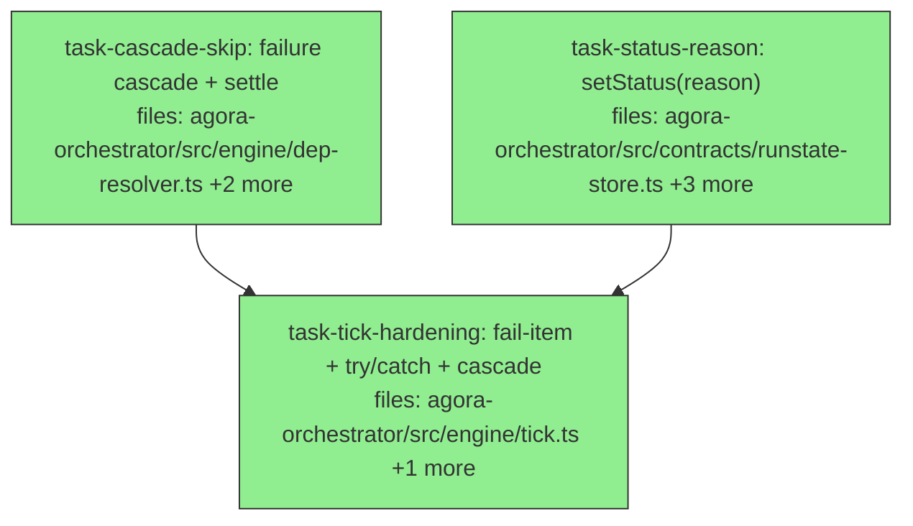

## Context

A robustness hardening wave for the orchestrator core, driven by an adversarial
pressure-test of three real-life scenarios (overnight dev flow / hostile
submission / lock contention) against the post-PR5 engine. The happy path and
lock selection are sound, but three independent failure modes leave a real
unattended run silently stuck or deadlocked. This wave fixes them. Stacks on the
PR5 branch (`pr5-dev-pack-subagent-shape`); rebase onto `main` once PR5 (#15) merges.

**Findings fixed (severity from the pressure-test):**
- **🟠 #2 No failure cascade.** A `failed` item orphans its dependents forever —
  `computeNewlyReady` needs deps `=== 'done'`, so a failed dep leaves dependents
  `pending` as zombies; the run never settles. → add `computeSkipped` (cascade
  `failed`/`skipped` to transitive dependents) + `isSettled`, wired into the tick.
- **🟠 #3 `ex.fire()` throw deadlocks a lock.** The fire loop acquires locks then
  calls `await ex.fire(it)` with no try/catch; a fire failure escapes the tick,
  the item stays `ready` holding its lock, and self-deadlocks (its own held lock
  filters it out next tick). → try/catch around fire: release locks + fail the item.
- **🟠 #4 Unregistered-executor `throw` is a queue DoS.** One typo'd `executor`
  string throws out of the tick (`tick.ts:25` reconcile + `:65` fire), halting the
  whole queue. → fail-the-item (consistent with shape-validation failures), don't throw.
- **🟡 #5 Fail-item records no reason.** Terminal `failed`/`skipped` carry no
  diagnostic. → `setStatus(id, status, reason?)` persisted alongside the status.

**Explicitly out of scope:** #1 (dep output→input threading — PR6, needs output
capture via `.agora/output.json`) and #6 (lock fairness/priority — deferred).

**Design notes:**
- `setStatus`'s `reason?` is OPTIONAL so the existing tick `setStatus(id, 'failed')`
  call sites compile unchanged; the hardening then passes reasons at the new sites.
- The failure cascade marks transitive dependents `skipped` (not `failed`) — they
  never ran. After a cascade pass every blocked item terminalizes, so the run reaches
  a settled state (`isSettled` = no `pending`/`ready`/`running` left).
- Migration caveat (same as PR5's `subagent_shape`): the new `reason` column is added
  via `CREATE TABLE IF NOT EXISTS`; a pre-existing file-backed DB won't gain it. The
  service-deploy migration story is a known separate concern, not this wave's job.

## Tasks

## Task: cascade failed-dependency items

```yaml
id: task-cascade-skip
depends_on: []
files:
  - packages/agora-orchestrator/src/engine/dep-resolver.ts
  - packages/agora-orchestrator/src/index.ts
  - packages/agora-orchestrator/test/dep-resolver.test.ts
status: done
```

Add the failure-cascade + run-settle helpers next to `computeNewlyReady`. A
`pending` item whose any dependency is `failed` or `skipped` can never become ready
(it would never see that dep reach `done`), so it must be cascaded to `skipped`.

## Implementation

```typescript
// packages/agora-orchestrator/src/engine/dep-resolver.ts  (additions)
import type { ItemState } from '../contracts/index.js';

/** ids of `pending` items with at least one dependency already `failed` or `skipped`
 *  (they can never ready, so they cascade to `skipped`). Single-pass; the tick loops
 *  ticks, so transitive chains settle across repeated calls. */
export function computeSkipped(items: ItemState[]): string[] {
  const status = new Map(items.map((i) => [i.id, i.status]));
  return items
    .filter((i) => i.status === 'pending' && i.depends_on.some((d) => {
      const s = status.get(d);
      return s === 'failed' || s === 'skipped';
    }))
    .map((i) => i.id);
}

/** A run/queue is settled when nothing can still move (no pending/ready/running). */
export function isSettled(items: ItemState[]): boolean {
  return !items.some((i) => i.status === 'pending' || i.status === 'ready' || i.status === 'running');
}
```

Export both from `src/index.ts` alongside the existing `computeNewlyReady` export.

```typescript
// packages/agora-orchestrator/test/dep-resolver.test.ts  (added)
import { computeSkipped, isSettled } from '../src/engine/dep-resolver.js';
const item = (id: string, status: string, deps: string[] = []) => ({ id, runId: 'r', queue: 'q', executor: 'e', inputs: {}, depends_on: deps, resourceLocks: [], status } as any);
it('cascades a pending item whose dep failed', () => {
  expect(computeSkipped([item('a','failed'), item('b','pending',['a'])])).toEqual(['b']);
});
it('does not cascade when the dep is still pending/running', () => {
  expect(computeSkipped([item('a','running'), item('b','pending',['a'])])).toEqual([]);
});
it('isSettled is false while anything is pending/ready/running', () => {
  expect(isSettled([item('a','done'), item('b','skipped')])).toBe(true);
  expect(isSettled([item('a','pending')])).toBe(false);
});
```

## Acceptance criteria

- `computeSkipped(items)` returns `pending` items with ≥1 dependency in `failed`/`skipped`; ignores items whose deps are still `pending`/`running`/`done`.
- `isSettled(items)` is `true` iff no item is `pending`/`ready`/`running`.
- Both exported from `src/index.ts` (alongside `computeNewlyReady`).
- Single-pass (the tick re-invokes across ticks for transitive chains) — no recursion needed.

Test file: `packages/agora-orchestrator/test/dep-resolver.test.ts`.

## Task: setStatus carries a failure reason

```yaml
id: task-status-reason
depends_on: []
files:
  - packages/agora-orchestrator/src/contracts/runstate-store.ts
  - packages/agora-orchestrator/src/contracts/types.ts
  - packages/agora-orchestrator/src/runstate/sqlite.ts
  - packages/agora-orchestrator/test/runstate-sqlite.test.ts
status: done
```

Make terminal status diagnosable: `setStatus` gains an OPTIONAL `reason`, persisted
and surfaced on `ItemState`. Optional so existing 2-arg call sites compile unchanged.

## Implementation

```typescript
// contracts/runstate-store.ts — widen the signature:
//   setStatus(itemId: string, status: TerminalStatus, reason?: string): void;

// contracts/types.ts — ItemState gains:
//   /** Set when status is failed/skipped: why it failed or was cascaded. */
//   reason?: string;

// runstate/sqlite.ts:
//   - items table DDL: add `reason TEXT` column.
//   - saveRun INSERT: add reason column, value NULL.
//   - setStatus: `UPDATE items SET status=?, reason=? WHERE id=?` with `reason ?? null`.
//   - rowToItem: map `reason: r.reason ?? undefined`.
```

```typescript
// test/runstate-sqlite.test.ts  (added)
it('persists and round-trips a failure reason on setStatus', () => {
  // saveRun with one item; store.setStatus(id, 'failed', 'inputs failed dev.code-edit schema');
  // reload via getItems → assert loaded.status === 'failed' && loaded.reason === 'inputs failed dev.code-edit schema'.
});
it('setStatus without a reason leaves reason undefined', () => {
  // store.setStatus(id, 'done'); getItems → reason === undefined (not null).
});
```

## Acceptance criteria

- `RunStateStore.setStatus` accepts an optional third `reason?: string`; existing 2-arg callers still compile.
- `ItemState` gains optional `reason`; the sqlite `items` table has a nullable `reason` column.
- `setStatus(id, status, reason)` persists the reason; `setStatus(id, status)` leaves it `undefined` (null → undefined on read).
- Existing `runstate-sqlite` tests pass unchanged.

Test file: `packages/agora-orchestrator/test/runstate-sqlite.test.ts`.

## Task: harden the tick's failure handling

```yaml
id: task-tick-hardening
depends_on: [task-cascade-skip, task-status-reason]
files:
  - packages/agora-orchestrator/src/engine/tick.ts
  - packages/agora-orchestrator/test/tick.test.ts
status: done
```

Make the tick survive every scenario the pressure-test broke: a missing executor or
a throwing `fire()` fails just that item (with a reason) instead of crashing the
queue or leaking a lock, and failed items cascade their dependents to `skipped`.

## Implementation

```typescript
// packages/agora-orchestrator/src/engine/tick.ts
import { computeNewlyReady, computeSkipped } from './dep-resolver.js';
// import effectTierPolicy, selectRunnable as before.

// #4 reconcile loop (currently throws on missing executor): fail-the-item instead.
//   const ex = executors[it.executor];
//   if (!ex) { store.setStatus(it.id, 'failed', `no executor registered for '${it.executor}'`); store.releaseLocks(it.id); continue; }
//   ...existing reconcile; on res.status==='failed' the cascade pass below handles dependents.

// After the reconcile loop (and after any fire-time fail), CASCADE:
//   for (const id of computeSkipped(queueItems())) store.setStatus(id, 'skipped', 'dependency failed or skipped');
//   (run after status changes; loop is fine — across ticks transitive chains fully settle.)

// #4 fire loop missing executor: same fail-item-with-reason pattern (was tick.ts:65 throw).
// #3 fire safety: wrap the dispatch so a throw releases locks + fails the item, not the tick:
//   if (!store.acquireLocks(it.id, it.resourceLocks)) continue;
//   const ex = executors[it.executor];
//   if (!ex) { store.setStatus(it.id, 'failed', `no executor registered for '${it.executor}'`); store.releaseLocks(it.id); continue; }
//   try {
//     const { dispatchHash } = await ex.fire(it);
//     store.setRunning(it.id, dispatchHash); fired++;
//   } catch (err) {
//     store.releaseLocks(it.id);                                  // <- no lock leak
//     store.setStatus(it.id, 'failed', `fire failed: ${(err as Error).message}`);
//   }
// Keep the existing shape-validation fail-item (now also pass a reason, e.g. 'unknown shape <id>' / 'inputs failed <id> schema').
```

```typescript
// packages/agora-orchestrator/test/tick.test.ts  (added — use the file's in-memory store helper)
// 1. item with an unregistered executor → ends 'failed' (with reason), tick does NOT throw, sibling items still fire.
// 2. an executor whose fire() rejects → item 'failed' with a 'fire failed' reason, its lock is RELEASED
//    (a second item contending on the same lock fires on the next tick — proves no deadlock).
// 3. a failed item with a dependent → after the tick, the dependent is 'skipped' (cascade), and isSettled() becomes true.
// 4. existing happy-path / lock / shape tests still pass unchanged.
```

## Acceptance criteria

- A `WorkItem` referencing an unregistered `executor` ends `failed` (with a reason) in BOTH the reconcile and fire paths; the tick does not throw; other items in the queue still progress.
- A `fire()` that rejects fails that item (`failed` + a `fire failed:` reason) and RELEASES its locks — no lock leak, no self-deadlock (a contender on the same lock fires next tick).
- After an item reaches `failed`/`skipped`, the tick cascades its `pending` dependents to `skipped` (via `computeSkipped`), so a run with a failure settles instead of leaving zombies.
- Shape-validation failures now record a reason too.
- All pre-existing tick tests pass unchanged; new tests cover the three failure modes.

Test file: `packages/agora-orchestrator/test/tick.test.ts`.
