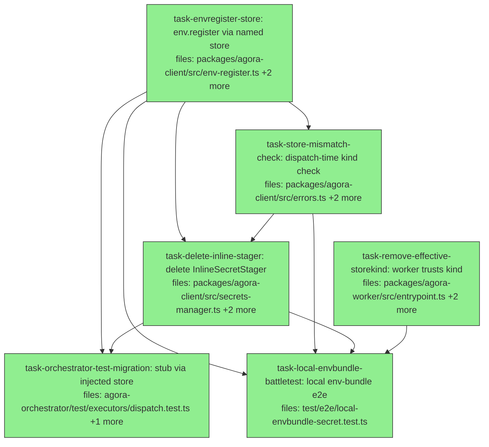

## Context

Drives PR4b of the SecretStore unification spec
(`docs/superpowers/specs/2026-05-29-secretstore-unification-design.md`). PR4b is
the payoff: migrate `env-register` onto the per-target store, record the store
kind on the bundle blob, add a dispatch-time compatibility check, delete the last
bespoke `InlineSecretStager`, and prove local env-bundle secrets work end-to-end
on real Docker with zero AWS — which also retires the one failing AWS-gated
integration test and the PR4a `effectiveStoreKind` tech debt. Stacks on PR #13
(`pr4a-secretstore-unification`).

**Design decision (env.register store selection):** "name a store" —
`env.register({ ..., secretStore: "<name>" })` resolves
`client.secretStores["<name>"]`, stages inline secrets there, and records that
store's `.name` (kind) on the bundle blob. `secretStore` is required only when
the bundle has inline secrets; pure values / pre-staged-ref bundles omit it. This
decouples a bundle from any single target — compatibility is checked by store
kind at dispatch time.

**Hash/idempotency:** env-register's deterministic-placeholder-name hash trick is
preserved (placeholder name for the content hash; the real opaque ref goes into
the blob). Adding the `store` field changes the env-bundle content hash — see the
follow-up note below.

**Follow-up to verify (not a gating task):** adding `store` to the env-bundle def
shifts env-bundle content hashes. `test/e2e/content-hash-versioning.test.ts` (e2e
suite, not in the unit gate) may pin an expected env hash and need its fixture
updated. `task-envregister-store` should `grep` for env-bundle hash assertions and
flag any it cannot fix within scope.

**Cascade note:** deleting `InlineSecretStager` breaks the `agora-orchestrator`
tests, which currently stub AWS via `vi.spyOn(InlineSecretStager.prototype, …)`.
`task-orchestrator-test-migration` rewrites them to inject a fake `SecretStore`
via `client.secretStores`.

## Tasks

## Task: env.register stages via a named store

```yaml
id: task-envregister-store
depends_on: []
files:
  - packages/agora-client/src/env-register.ts
  - packages/agora-client/test/env-register.test.ts
  - packages/agora-client/test/integration.test.ts
status: done
```

Migrate `registerEnv` off `InlineSecretStager` onto the caller-named store:
add `secretStore?: string` to `RegisterEnvOpts`, resolve
`client.secretStores[opts.secretStore]`, stage inline secrets via `store.stage`,
and record `store: <store.name>` on the bundle blob `def`. `secretStore` is
required iff the bundle carries inline secrets. Remove the `stager` injection
option and the `InlineSecretStager` import.

## Implementation

```typescript
// packages/agora-client/src/env-register.ts  (shape)
export interface RegisterEnvOpts extends CredentialPatternCheckOpts {
  name: string;
  values?: Record<string, string>;
  secrets?: Record<string, SecretRef | InlineSecret>;
  /** Name of the SecretStore (in client.secretStores) to stage inline secrets into.
   *  Required only when `secrets` contains at least one inline entry. */
  secretStore?: string;
}

// inside registerEnv(client, opts):
const inlineKeys = Object.entries(secrets).filter(([, e]) => !isSecretRef(e)).map(([k]) => k);
let store: SecretStore | undefined;
if (inlineKeys.length > 0) {
  if (!opts.secretStore) throw new Error("registerEnv: secretStore is required when the bundle has inline secrets");
  store = client.secretStores[opts.secretStore];
  if (!store) throw new Error(`registerEnv: unknown secretStore ${opts.secretStore}`);
}
// def now records the store kind for the dispatch-time compatibility check:
const def = { kind: "env-bundle" as const, name: opts.name, values, secretRefs, store: store?.name };
// hash over def (placeholder refs for inline, as before); stage real refs via store.stage
// (name = inlineSecretPlaceholder(opts.name, key), tags { 'agora:dispatchId': `env-${opts.name}` }) after the
// idempotency check, writing real opaque refs into the stored blob.
```

```typescript
// packages/agora-client/test/env-register.test.ts  (replace stager injection with a fake SecretStore)
it("stages inline secrets via the named store and records the store kind on the blob", async () => {
  const staged: Array<{ name: string }> = [];
  const store = { name: "local-file", stage: async (a: { name: string }) => { staged.push(a); return { ref: "local-secret://x", ttlSeconds: 1 }; }, resolve: async () => "", cleanupByTag: async () => {} };
  const client = makeClient({ secretStores: { local: store } });
  await registerEnv(client, { name: "b", secretStore: "local", secrets: { K: { inline: "v" } } });
  // assert the stored blob def has store === "local-file" and secretRefs.K === "local-secret://x"
  expect(staged).toHaveLength(1);
});
```

## Acceptance criteria

- `RegisterEnvOpts` gains `secretStore?: string`; the `stager` option and
  `InlineSecretStager` import are removed.
- Inline secrets stage via `client.secretStores[opts.secretStore].stage`; a bundle
  with inline secrets and no `secretStore` (or an unknown name) throws a clear error.
- The stored bundle blob `def` records `store: <store.name>`; the opaque ref (not
  the inline value) is written into `secretRefs`.
- The placeholder-name content-hash idempotency behavior is preserved (re-register
  with identical inputs returns the existing `EnvRef` without re-staging).
- Pure values / ref-only bundles still register with no `secretStore`.

Test file: `packages/agora-client/test/env-register.test.ts`.

## Task: dispatch-time store-kind compatibility check

```yaml
id: task-store-mismatch-check
depends_on: [task-envregister-store]
files:
  - packages/agora-client/src/errors.ts
  - packages/agora-client/src/dispatch.ts
  - packages/agora-client/test/dispatch.test.ts
status: done
```

Fail loud at dispatch time when an env bundle's recorded store kind doesn't match
the dispatch target's store kind. Add a typed `SecretStoreMismatchError` and check
it while flattening env-bundle secrets in `dispatch.ts`.

## Implementation

```typescript
// packages/agora-client/src/errors.ts
export class SecretStoreMismatchError extends Error {
  constructor(public readonly bundle: string, public readonly bundleKind: string, public readonly targetKind: string | undefined) {
    super(`env bundle "${bundle}" was staged for store kind "${bundleKind}" but target uses "${targetKind ?? "(none)"}"`);
    this.name = "SecretStoreMismatchError";
  }
}
```

```typescript
// packages/agora-client/src/dispatch.ts  (inside flattenEnvBundleSecrets / the env-bundle loop)
// for each resolved bundle blob `def`:
//   const bundleKind = (def as { store?: string }).store;
//   if (bundleKind && bundleKind !== store?.name) {
//     throw new SecretStoreMismatchError(env.name, bundleKind, store?.name);
//   }
// (Only enforced when the bundle recorded a store kind — legacy/no-secret bundles skip the check.)
```

```typescript
// packages/agora-client/test/dispatch.test.ts  (added)
it("throws SecretStoreMismatchError when a bundle's store kind != the target store kind", async () => {
  // stage/stub a bundle blob with store: "local-file"; dispatch to a target whose store.name === "aws-secrets-manager"
  await expect(fireWork(client, { target: "awsTarget", subagent: "a", env: "localBundle" }, { workerImage: "img" }))
    .rejects.toThrow(/staged for store kind "local-file"/);
});
```

## Acceptance criteria

- `SecretStoreMismatchError` (in `errors.ts`) carries bundle name, bundle kind, target kind.
- Dispatch throws it before firing when a bundle's recorded `store` kind differs
  from the target store's `.name`.
- Bundles with no recorded `store` kind (values-only / ref-only / legacy) do not trigger the check.
- A matching kind dispatches normally.

Test file: `packages/agora-client/test/dispatch.test.ts`.

## Task: delete InlineSecretStager

```yaml
id: task-delete-inline-stager
depends_on: [task-envregister-store, task-store-mismatch-check]
files:
  - packages/agora-client/src/secrets-manager.ts
  - packages/agora-client/test/secrets-manager.test.ts
  - packages/agora-client/src/index.ts
status: done
is_wiring_task: true
```

With `env-register` migrated, `secrets-manager.ts` holds only `InlineSecretStager`
plus a `computeInlineSecretTtl` re-export. Delete the file and its test; re-point
the barrel: `index.ts` drops the `InlineSecretStager` / `InlineSecretStagerOpts`
exports, re-exports `computeInlineSecretTtl` from `./secret-ttl.js` directly, and
adds the `SecretStoreMismatchError` export.

## Acceptance criteria

- `packages/agora-client/src/secrets-manager.ts` and
  `packages/agora-client/test/secrets-manager.test.ts` are deleted.
- `index.ts` no longer exports `InlineSecretStager` / `InlineSecretStagerOpts`;
  `computeInlineSecretTtl` is re-exported from `./secret-ttl.js`;
  `SecretStoreMismatchError` is exported from `./errors.js`.
- `pnpm --filter @quarry-systems/agora-client typecheck` + `test` are green
  (no remaining importer of `./secrets-manager.js`).

Test file: `packages/agora-client/test/secret-ttl.test.ts` (confirms `computeInlineSecretTtl` still resolves via the barrel).

## Task: migrate orchestrator tests off InlineSecretStager

```yaml
id: task-orchestrator-test-migration
depends_on: [task-envregister-store, task-delete-inline-stager]
files:
  - packages/agora-orchestrator/test/executors/dispatch.test.ts
  - packages/agora-orchestrator/test/executors/dispatch-orchestrator.int.test.ts
status: done
```

Both orchestrator executor tests stub AWS by spying on
`InlineSecretStager.prototype.{stage,cleanup}`. That symbol no longer exists.
Migrate them to inject a fake `SecretStore` via `client.secretStores` (with the
target's `secretStore` set), asserting per-dispatch staging + cleanup through the
fake instead of the prototype spy.

## Implementation

```typescript
// packages/agora-orchestrator/test/executors/dispatch.test.ts  (new stubbing pattern)
function makeFakeStore() {
  const staged: string[] = [];
  const cleaned: string[] = [];
  return {
    store: { name: "local-file", dir: "/tmp/x", stage: async (a: { name: string }) => { staged.push(a.name); return { ref: `local-secret://${a.name}`, ttlSeconds: 1 }; }, resolve: async () => "v", cleanupByTag: async (_k: string, v: string) => { cleaned.push(v); } },
    staged, cleaned,
  };
}
// build the AgoraClient with secretStores: { local: fake.store } and target.secretStore = "local";
// assert cleanup ran by checking fake.cleaned contains the dispatchId (replaces the InlineSecretStager.prototype.cleanup spy).
```

```typescript
// packages/agora-orchestrator/test/executors/dispatch.test.ts  (migrated assertion)
it("terminal reconcile invokes inflight.cleanup (via the injected store's cleanupByTag)", async () => {
  const fake = makeFakeStore();
  // ...drive the executor tick to terminal...
  expect(fake.cleaned).toContain(dispatchId);
});
```

## Acceptance criteria

- Neither test imports `InlineSecretStager`; no `vi.spyOn(InlineSecretStager.prototype, …)` remains.
- Per-dispatch staging + cleanup are asserted through an injected fake `SecretStore`
  (`client.secretStores`), preserving the original tests' behavioral intent.
- `pnpm --filter @quarry-systems/agora-orchestrator test` is green.

Test file: `packages/agora-orchestrator/test/executors/dispatch.test.ts`.

## Task: worker trusts AGORA_SECRET_STORE_KIND (remove effectiveStoreKind)

```yaml
id: task-remove-effective-storekind
depends_on: []
files:
  - packages/agora-worker/src/entrypoint.ts
  - packages/agora-worker/test/index.test.ts
  - packages/agora-worker/test/entrypoint.test.ts
status: done
```

Remove the PR4a `effectiveStoreKind` shim (the `file://` + `secretStoreDir`
auto-detect that could override an explicit `kind`). The dispatcher now always
emits `AGORA_SECRET_STORE_KIND`, so the worker builds its store directly from
`cfg.secretStoreKind`. Update worker tests that relied on the auto-detect to set
the kind explicitly.

## Implementation

```typescript
// packages/agora-worker/src/entrypoint.ts  (store construction, simplified)
const secretsClient = deps.secretsManagerClient ?? new SecretsManagerClient({});
const secretStore = deps.secretStore ?? storeFromConfig({
  kind: cfg.secretStoreKind,     // trusted directly — no file:// auto-detect
  dir: cfg.secretStoreDir,
  client: secretsClient,
});
// delete the effectiveStoreKind computation entirely.
```

```typescript
// packages/agora-worker/test/index.test.ts  (local-path test sets the kind explicitly)
it("uses LocalSecretStore when AGORA_SECRET_STORE_KIND=local-file + dir is set", async () => {
  // run runWorker with cfg.secretStoreKind = "local-file" and a secretStoreDir;
  // assert local resolution (no AWS), with no reliance on storageUri sniffing.
});
```

## Acceptance criteria

- The `effectiveStoreKind` variable / `file://` auto-detect is gone; the store is
  built from `cfg.secretStoreKind` directly.
- An explicit `AGORA_SECRET_STORE_KIND=aws-secrets-manager` is never overridden by a
  `file://` storage URI.
- `pnpm --filter @quarry-systems/agora-worker test` is green (tests that previously
  leaned on auto-detect now set the kind). If a worker test outside this file needs
  updating, report it rather than editing out of scope.

Test file: `packages/agora-worker/test/index.test.ts`.

## Task: local env-bundle secret battle-test (real Docker)

```yaml
id: task-local-envbundle-battletest
depends_on: [task-envregister-store, task-store-mismatch-check, task-delete-inline-stager, task-remove-effective-storekind]
files:
  - test/e2e/local-envbundle-secret.test.ts
status: done
```

The headline proof: register an env bundle carrying an inline secret against a
`LocalSecretStore`, dispatch it to a local-Docker target, and assert the worker
resolves the bundle secret from the bind-mounted dir and the subagent sees it —
with **zero AWS calls**. Docker-gated (`itIfDocker`), mirroring the PR3 battle-test.

## Implementation

```typescript
// test/e2e/local-envbundle-secret.test.ts  (setup: a local-docker target wired to a LocalSecretStore)
import { LocalSecretStore } from "@quarry-systems/agora-secret-store";
import { mkdtempSync } from "node:fs";
import { tmpdir } from "node:os";
import { join } from "node:path";

function makeLocalClient() {
  const dir = mkdtempSync(join(tmpdir(), "agora-e2e-secrets-"));
  const store = new LocalSecretStore({ dir });
  // construct AgoraClient with file:// storage + a LocalDockerProvider target whose
  // secretStore: "local" points at this store; an AWS client that THROWS if called,
  // to prove the path makes zero Secrets Manager requests.
  return { client: /* AgoraClient { secretStores: { local: store }, targets: { local: { ..., secretStore: "local" } } } */ undefined as never, dir, store };
}
```

```typescript
// test/e2e/local-envbundle-secret.test.ts  (the battle-test)
itIfDocker("resolves a local env-bundle inline secret end-to-end with no AWS", async () => {
  const dir = /* a real host scratch dir */;
  const store = new LocalSecretStore({ dir });
  const client = makeClient({ secretStores: { local: store }, /* local-docker target with secretStore: "local" */ });
  const bundle = await client.env.register({ name: "deploy", secretStore: "local", secrets: { DEPLOY_TOKEN: { inline: "s3cr3t" } } });
  const result = await client.dispatch.run({ target: "local", subagent: "echo-env", env: bundle, /* ... */ });
  // assert: subagent observed DEPLOY_TOKEN === "s3cr3t"; the value is redacted in worker logs;
  // assert: no AWS Secrets Manager client was constructed / called (inject a throwing AWS client to prove it).
});
```

## Acceptance criteria

- A locally-registered env bundle with an inline secret is resolved inside the
  worker container from the bind-mounted `LocalSecretStore` dir; the subagent reads
  the value.
- The run makes no AWS Secrets Manager calls (proven by injecting a throwing/asserting
  AWS client, or asserting the local store's `resolve` was the path used).
- The resolved value is registered for log redaction.
- Docker-gated so CI without Docker skips cleanly.

Test file: `test/e2e/local-envbundle-secret.test.ts`.
