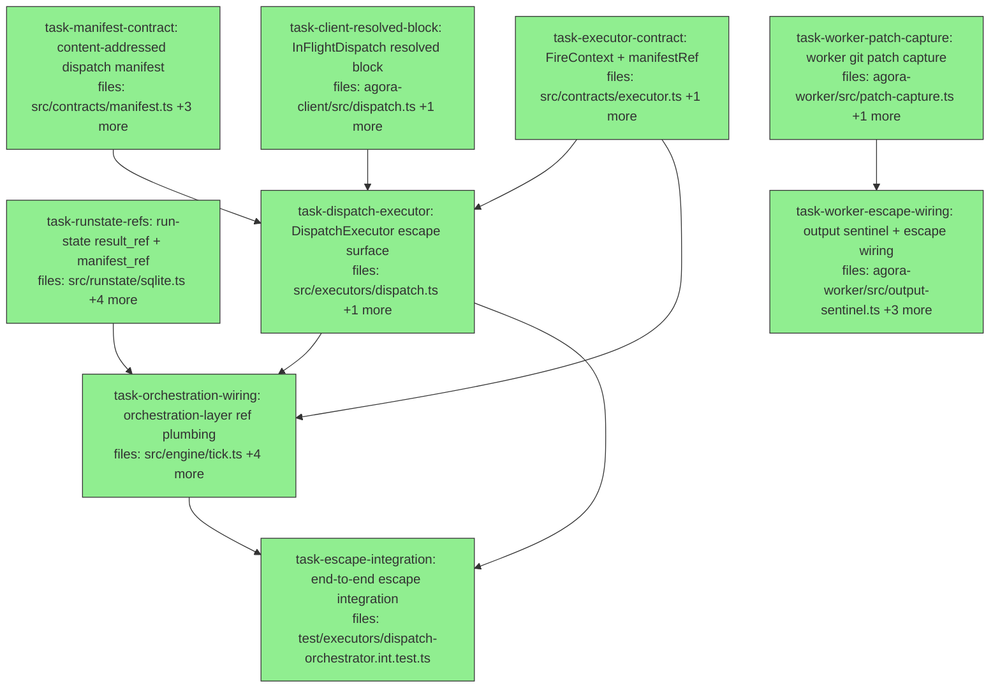

## Context

This plan implements the **`offload-escape`** wave of agora-offload, per
`docs/superpowers/specs/2026-05-29-agora-offload-v1-design.md` §3 (sandbox
escape) and §6.2 (dispatch manifest). **PR #18 (the `serve` + mailbox +
run-state + retry runner) has merged to `main` (squash commit `ca52bca`)**, so
this branch (`feat/offload-escape`) is rooted on `origin/main` — which also
carries PR5 (dev pack / `SubagentShape` / `packs/`) and the hardening wave. The
current file shapes this plan targets reflect that merged state (e.g.
`sqlite.ts` already has `subagent_shape`/`reason` columns and a tuple-based
`MIGRATIONS` array; `tick(store, executors, queue, packs?, opts)` carries a
`packs` param; `setStatus(itemId, status, reason?)` takes a reason).

**The problem:** a finished dispatch currently yields only an exit code +
lifecycle events; the agent's filesystem edits die with the container. This wave
builds the minimal escape path (workspace diff → content-addressed artifact →
`result_ref`) plus the content-addressed dispatch manifest that records "exactly
what ran."

**Three deliverables (from the wave brief):**

1. **Worker patch capture** — after the RuntimeAdapter finishes a successful
   run, compute the workspace diff, upload it as a content-addressed artifact via
   the existing `StorageProvider`, and write a minimal `.agora/output.json`
   sentinel `{ schemaVersion:1, patchRef?, summary? }` (a forward-compatible
   subset of D7).
2. **`result_ref` plumbing** — `DispatchExecutor.reconcile()` reads `patchRef`
   from the sentinel → returns it; the tick loop persists it on the run-state
   row; status/outbox surface it; the client can fetch the patch.
3. **Executor-polymorphic dispatch manifest (§6.2)** — on fire, write a
   content-addressed manifest: an executor-agnostic envelope
   (runId/itemId/executor/secretRefs[REFS ONLY]/actor/timestamps/manifestHash) +
   an executor-specific `executorManifest` block (subagent/capabilities/env/
   workerImage/model). The manifest is the content-addressed "what ran" record.

**Explicitly OUT of this wave** (the separate `offload-audit` wave): tamper-
evident anchoring — `Signer`, `AuditAnchor`, Merkle-per-epoch, `verify`. The
manifest type carries an OPTIONAL `signature?` field for forward-compatibility,
but no signing key is configured and no signer runs here. `manifestHash` (the
content-addressed self-hash) IS computed.

### Load-bearing design decisions (the spec defers these "to the plan")

- **Sentinel handoff worker → reconcile.** The container filesystem is ephemeral,
  so the worker uploads `.agora/output.json` to the deterministic per-dispatch
  storage key `buildDispatchRecordUri(namespace, dispatchId, 'output.json')`
  (the existing reserved `dispatches/` prefix, URI-addressed/overwritable).
  `reconcile()` reads it back by `dispatchId`. The patch *artifact* itself is a
  separate **content-addressed blob** (`StorageProvider.put` → contentHash),
  honoring the seam rule: content-addressed artifacts → StorageProvider; mutable
  per-dispatch records → the `dispatches/` prefix.
- **Diff strategy: git-based.** `git` is already in the worker image
  (`docker/agora-worker/Dockerfile`). Baseline = `git add -A && git write-tree`
  captured after setup, before adapter invoke (no commit, no HEAD movement, does
  not pollute a pre-existing repo). Capture = `git add -A && git diff --cached
  <baselineTree> -- . ':(exclude).agora'` → unified-diff bytes; `.agora/` is
  excluded so the sentinel never appears in its own patch. Returns `null`/empty
  when nothing changed.
- **Engine stays executor-agnostic (V1-D4).** `result_ref` and `manifest_ref`
  are **opaque string columns**; `Executor.fire` gains a generic `FireContext`
  (`runId`/`actor`/`submittedAt` — no AI concepts) and returns an optional
  `manifestRef`. All dispatch-specific manifest content lives in
  `executors/dispatch.ts` + the generic `audit/manifest.ts` builder (which
  treats `executorManifest` as opaque).
- **Manifest written on fire** (per the wave brief), not reconcile — the "what
  ran" record exists the moment an item is launched, even if the run never
  finishes.

### Execution constraint (read before running)

Another instance may share the main working tree. This plan executes in an
**isolated worktree** and tasks run **SEQUENTIALLY** — concurrent implementers
would race the single git index. The DAG edges below are therefore correctness
ordering, not a parallelism target; the worker chain
(`task-worker-*`) is genuinely independent of the orchestrator chain but still
runs serially. Each task's gate MUST run **`typecheck`** (vitest uses esbuild
and silently passes type errors) in addition to the package test suite.

## Tasks

## Task: content-addressed dispatch manifest

```yaml
id: task-manifest-contract
depends_on: []
files:
  - packages/agora-orchestrator/src/contracts/manifest.ts
  - packages/agora-orchestrator/src/audit/manifest.ts
  - packages/agora-orchestrator/src/contracts/index.ts
  - packages/agora-orchestrator/src/index.ts
  - packages/agora-orchestrator/test/audit/manifest.test.ts
status: done
```

Define the §6.2 dispatch-manifest types (executor-agnostic envelope + opaque
`executorManifest` block) and a pure `buildManifest` builder that canonicalizes
and self-hashes the envelope. Executor-agnostic by construction: the builder
treats `executorManifest` as opaque `unknown` and never inspects it (V1-D4).
This task owns both barrel files (`contracts/index.ts`, `src/index.ts`) so no
other task edits a barrel.

## Implementation

```typescript
// packages/agora-orchestrator/src/contracts/manifest.ts
// §6.2 dispatch manifest. Envelope is executor-agnostic; executor-specific
// detail nests in one content-hashed `executorManifest` block (V1-D4).

/** Optional cryptographic signature. Populated by the SEPARATE offload-audit
 *  wave when a Signer is configured; absent in offload-escape. */
export interface ManifestSignature {
  alg: string;
  /** base64 of the signature bytes. */
  bytes: string;
  keyRef?: string;
}

export interface DispatchManifest {
  schemaVersion: 1;
  runId: string;
  itemId: string;
  parent: string;            // "run:<runId>"
  executor: string;          // which executor kind ran this (e.g. "dispatch")
  executorManifest: unknown; // executor-defined, content-hashed, OPAQUE here
  secretRefs: string[];      // REFERENCES ONLY — never values (all executors)
  actor: string;             // "human:<id>" | "agent:<id>"
  submittedAt?: string;      // ISO-8601, when the run was submitted (if known)
  firedAt: string;           // ISO-8601, when this item was fired
  manifestHash: string;      // sha256:<hex> self-hash over all fields above
  signature?: ManifestSignature; // offload-audit; omitted in offload-escape
}

/** The dispatch executor's `executorManifest` block shape (one concrete
 *  executor's contribution). A future `command` executor nests a different
 *  shape under the same `executorManifest` key — the envelope is unchanged. */
export interface DispatchExecutorManifest {
  subagent: { name: string; contentHash: string };
  capabilities: Array<{ name: string; contentHash: string }>;
  env: Array<{ name: string; contentHash: string }>;
  workerImage: string;       // digest-pinned, e.g. ghcr.io/.../agora-worker@sha256:...
  model: { id: string; temperature: number; maxTokens: number };
}
```

```typescript
// packages/agora-orchestrator/src/audit/manifest.ts
import { canonicalJsonString, computeContentHash } from '@quarry-systems/agora-core';
import type { DispatchManifest } from '../contracts/manifest.js';

export interface BuildManifestInput {
  runId: string;
  itemId: string;
  executor: string;
  executorManifest: unknown;
  secretRefs: string[];
  actor: string;
  firedAt: string;
  submittedAt?: string;
}

/** Build a manifest and compute its self-hash. The hash is taken over the
 *  canonical JSON of every field EXCEPT `manifestHash` and `signature`, so the
 *  hash is stable regardless of later signing. Returns the manifest plus the
 *  canonical bytes to persist (content-addressing happens at the storage layer). */
export function buildManifest(input: BuildManifestInput): {
  manifest: DispatchManifest;
  bytes: Uint8Array;
} {
  if (input.secretRefs.some((r) => typeof r !== 'string')) {
    throw new Error('buildManifest: secretRefs must be string references only');
  }
  const base = {
    schemaVersion: 1 as const,
    runId: input.runId,
    itemId: input.itemId,
    parent: `run:${input.runId}`,
    executor: input.executor,
    executorManifest: input.executorManifest,
    secretRefs: input.secretRefs,
    actor: input.actor,
    submittedAt: input.submittedAt,
    firedAt: input.firedAt,
  };
  // computeContentHash canonicalizes objects internally (sorted keys, drops
  // undefined — so an absent submittedAt does not perturb the hash).
  const manifestHash = computeContentHash(base);
  const manifest: DispatchManifest = { ...base, manifestHash };
  const bytes = new TextEncoder().encode(canonicalJsonString(manifest));
  return { manifest, bytes };
}
```

Also add `export * from './manifest.js';` to `contracts/index.ts`, and re-export
`buildManifest` + the manifest types from `src/index.ts`.

```typescript
// packages/agora-orchestrator/test/audit/manifest.test.ts
import { describe, it, expect } from 'vitest';
import { buildManifest } from '../../src/audit/manifest.js';

it('is deterministic and self-hashes; hash is independent of field insertion order', () => {
  const a = buildManifest({ runId: 'r', itemId: 'i', executor: 'dispatch',
    executorManifest: { b: 1, a: 2 }, secretRefs: ['agora://secrets/x'],
    actor: 'human:brett', firedAt: '2026-05-31T00:00:00.000Z' });
  const b = buildManifest({ runId: 'r', itemId: 'i', executor: 'dispatch',
    executorManifest: { a: 2, b: 1 }, secretRefs: ['agora://secrets/x'],
    actor: 'human:brett', firedAt: '2026-05-31T00:00:00.000Z' });
  expect(a.manifest.manifestHash).toBe(b.manifest.manifestHash);
  expect(a.manifest.manifestHash).toMatch(/^sha256:[0-9a-f]{64}$/);
  expect(a.manifest.parent).toBe('run:r');
});
```

## Acceptance criteria

- `buildManifest` returns a `DispatchManifest` with `parent === "run:<runId>"`,
  `schemaVersion === 1`, and `manifestHash` matching `/^sha256:[0-9a-f]{64}$/`.
- `manifestHash` is identical for two calls whose `executorManifest` objects
  differ only in key insertion order (canonical-JSON stability).
- `manifestHash` is computed over the envelope EXCLUDING `manifestHash` and
  `signature` (adding a signature later does not change the hash).
- `buildManifest` throws if any `secretRefs` entry is not a string.
- No `signature` field is set by this builder (offload-audit owns signing).
- `buildManifest`, `DispatchManifest`, `DispatchExecutorManifest` are exported
  from the orchestrator package root.

Test file: `packages/agora-orchestrator/test/audit/manifest.test.ts`.

## Task: run-state result_ref + manifest_ref columns

```yaml
id: task-runstate-refs
depends_on: []
files:
  - packages/agora-orchestrator/src/runstate/sqlite.ts
  - packages/agora-orchestrator/src/contracts/runstate-store.ts
  - packages/agora-orchestrator/src/contracts/types.ts
  - packages/agora-orchestrator/test/runstate-sqlite.test.ts
  - packages/agora-orchestrator/test/tick.test.ts
status: done
```

Add three opaque columns to the run-state row — `result_ref`, `manifest_ref`,
`submitted_at` — via the existing tuple-based `MIGRATIONS` array, plus
`setResultRef`/`setManifestRef` setters and a `submittedAt` argument on
`saveRun`. These are executor-agnostic opaque strings (V1-D4): the store never
interprets them. Because `setResultRef`/`setManifestRef` are added as **required**
`RunStateStore` methods, the change must also extend the hand-rolled
`makeMemStore` fake in `tick.test.ts` (line ~25) so the package still
type-checks — disciplined "change the interface, fix every implementor in the
same change" (the only two implementors are `SqliteRunStateStore` and that fake).

## Implementation

```typescript
// packages/agora-orchestrator/src/contracts/types.ts — ItemState additions
// (NOTE: ItemState already has `reason?`, `actor?`, `attempts?`, `nextAttemptAt?`,
//  `subagentShape?` on main — add ONLY the three below.)
export interface ItemState extends WorkItem {
  // ...existing fields unchanged...
  resultRef?: string;     // opaque escape artifact ref (e.g. patch URI)
  manifestRef?: string;   // opaque dispatch-manifest ref
  submittedAt?: string;   // ISO-8601 submission time (if recorded)
}

// packages/agora-orchestrator/src/contracts/runstate-store.ts — interface additions
//   saveRun(run: Run, actor?: string, submittedAt?: string): void;  // widen existing
//   setResultRef(itemId: string, ref: string): void;                // new
//   setManifestRef(itemId: string, ref: string): void;              // new
```

```typescript
// packages/agora-orchestrator/src/runstate/sqlite.ts — match the CURRENT shape:
//  - extend the tuple array MIGRATIONS with the three new columns:
const MIGRATIONS: ReadonlyArray<readonly [string, string]> = [
  ['subagent_shape', 'TEXT'], ['reason', 'TEXT'], ['actor', 'TEXT'],
  ['attempts', 'INTEGER NOT NULL DEFAULT 0'], ['next_attempt_at', 'REAL'],
  ['result_ref', 'TEXT'], ['manifest_ref', 'TEXT'], ['submitted_at', 'TEXT'], // new
];
//  - add the same three columns to the CREATE TABLE in SCHEMA and to `interface ItemRow`.
//  - widen saveRun(run, actor?, submittedAt?); the INSERT column list gains
//    result_ref, manifest_ref, submitted_at (result_ref/manifest_ref insert NULL,
//    submitted_at inserts the param). The existing INSERT already lists
//    subagent_shape + reason — preserve those.
setResultRef(itemId: string, ref: string): void {
  this.db.prepare('UPDATE items SET result_ref=? WHERE id=?').run(ref, itemId);
}
setManifestRef(itemId: string, ref: string): void {
  this.db.prepare('UPDATE items SET manifest_ref=? WHERE id=?').run(ref, itemId);
}
// rowToItem maps result_ref/manifest_ref/submitted_at → resultRef/manifestRef/submittedAt.
```

```typescript
// packages/agora-orchestrator/test/runstate-sqlite.test.ts — failing test
// (Also: extend makeMemStore in tick.test.ts with no-op-ish setResultRef/setManifestRef
//  that write into its in-memory item map, so tick.test.ts type-checks.)
it('persists and reads back result_ref, manifest_ref and submitted_at', () => {
  const store = new SqliteRunStateStore();
  store.ensureQueue('default', 1);
  store.saveRun({ id: 'r1', queue: 'default', items: [
    { id: 'a', executor: 'x', inputs: {}, depends_on: [], resourceLocks: [] }] },
    'human:brett', '2026-05-31T00:00:00.000Z');
  store.setResultRef('a', 'agora://ns/artifact/a/sha256:deadbeef');
  store.setManifestRef('a', 'agora://ns/manifest/a/sha256:cafe');
  const it = store.getItems('r1').find((i) => i.id === 'a')!;
  expect(it.resultRef).toBe('agora://ns/artifact/a/sha256:deadbeef');
  expect(it.manifestRef).toBe('agora://ns/manifest/a/sha256:cafe');
  expect(it.submittedAt).toBe('2026-05-31T00:00:00.000Z');
});
```

## Acceptance criteria

- A fresh DB has `result_ref`, `manifest_ref`, `submitted_at` columns; an
  existing DB without them is migrated additively via `MIGRATIONS` (idempotent —
  the existing migration test covering subagent_shape/reason/actor/attempts/
  next_attempt_at still passes).
- `setResultRef`/`setManifestRef` persist and round-trip via `getItems` as
  `resultRef`/`manifestRef`.
- `saveRun(run, actor, submittedAt)` persists `submitted_at`; omitting it stores
  `NULL` and reads back as `undefined`.
- Absent columns read back as `undefined` (not empty string).
- `makeMemStore` in `tick.test.ts` implements the widened `RunStateStore`
  interface (package `typecheck` passes).
- All pre-existing `runstate-sqlite.test.ts` and `tick.test.ts` cases still pass.

Test file: `packages/agora-orchestrator/test/runstate-sqlite.test.ts`.

## Task: executor contract — FireContext + manifestRef

```yaml
id: task-executor-contract
depends_on: []
files:
  - packages/agora-orchestrator/src/contracts/executor.ts
  - packages/agora-orchestrator/test/contracts.test.ts
status: done
```

Extend the `Executor` contract so `fire` accepts a generic, executor-agnostic
`FireContext` (identity + timestamps, no AI concepts) and returns an optional
`manifestRef`; and so `ExecutionResult` carries an optional `resultRef`. All
additions are optional, so existing fake executors that implement `fire(item)`
returning `{ dispatchHash }` remain valid.

## Implementation

```typescript
// packages/agora-orchestrator/src/contracts/executor.ts
import type { WorkItem } from './types.js';

export interface ExecutionResult {
  status: 'done' | 'failed';
  output?: unknown;
  /** Opaque ref to the escaped artifact (e.g. patch URI). Surfaced as result_ref. */
  resultRef?: string;
}

/** Generic, executor-agnostic context passed at fire time. NO AI/dispatch
 *  concepts (V1-D4) — just run identity + submission metadata. */
export interface FireContext {
  runId?: string;
  actor?: string;
  submittedAt?: string;
}

export interface Executor {
  id: string;
  /** Start the work; return a content-address handle plus an optional opaque
   *  manifest ref. Must not block to completion. */
  fire(item: WorkItem, ctx?: FireContext): Promise<{ dispatchHash: string; manifestRef?: string }>;
  reconcile(dispatchHash: string): Promise<ExecutionResult | null>;
}
```

```typescript
// packages/agora-orchestrator/test/contracts.test.ts — failing test
import { describe, it, expect } from 'vitest';
import type { Executor, FireContext } from '../src/contracts/index.js';

it('a minimal executor satisfies the extended fire signature', async () => {
  const seen: FireContext[] = [];
  const ex: Executor = {
    id: 'x',
    async fire(_item, ctx) { if (ctx) seen.push(ctx); return { dispatchHash: 'h1', manifestRef: 'm1' }; },
    async reconcile() { return { status: 'done', resultRef: 'r1' }; },
  };
  const fired = await ex.fire({ id: 'a', executor: 'x', inputs: {}, depends_on: [], resourceLocks: [] },
    { runId: 'r', actor: 'human:brett' });
  expect(fired).toEqual({ dispatchHash: 'h1', manifestRef: 'm1' });
  expect(seen[0]).toEqual({ runId: 'r', actor: 'human:brett' });
  expect(await ex.reconcile('h1')).toEqual({ status: 'done', resultRef: 'r1' });
});
```

## Acceptance criteria

- `ExecutionResult` has an optional `resultRef?: string`.
- `Executor.fire(item, ctx?: FireContext)` returns
  `{ dispatchHash: string; manifestRef?: string }`.
- `FireContext` contains only `runId?`, `actor?`, `submittedAt?` — no
  AI/dispatch-specific fields.
- A fake executor implementing `fire(item)` (ignoring `ctx`) and returning
  `{ dispatchHash }` (no `manifestRef`) still type-checks against `Executor`.
- `FireContext` is exported from the package contracts barrel.

Test file: `packages/agora-orchestrator/test/contracts.test.ts`.

## Task: client InFlightDispatch resolved block

```yaml
id: task-client-resolved-block
depends_on: []
files:
  - packages/agora-client/src/dispatch.ts
  - packages/agora-client/test/dispatch-fire.test.ts
status: done
```

Expose the already-computed resolved refs + merged secret refs + worker image on
the `InFlightDispatch` returned by `fireWork`, so the orchestrator's
`DispatchExecutor` can build the §6.2 manifest at fire time without re-resolving.
All values already exist as locals inside `fireWork` (`resolvedSubagent`,
`resolvedCapabilities`, `resolvedEnv`, `secretRefs`, `opts.workerImage`).

## Implementation

```typescript
// packages/agora-client/src/dispatch.ts — InFlightDispatch addition
export interface InFlightDispatch {
  readonly dispatchId: string;
  readonly handle: TaskHandle;
  /** Resolved inputs + environment for this dispatch — content-addressed refs
   *  and secret REFERENCES only (no values). Used to build the audit manifest. */
  readonly resolved: {
    subagent: SubagentRef;
    capabilities: CapabilityRef[];
    env: EnvRef[];
    secretRefs: Record<string, string>; // envName -> ref (references, never values)
    workerImage: string;
  };
  awaitExit(): Promise<TaskExit>;
  reconcile(exit: TaskExit): Promise<DispatchResult>;
  cleanup(): void;
}

// at the end of fireWork, include in the returned object:
//   resolved: {
//     subagent: resolvedSubagent,
//     capabilities: resolvedCapabilities,
//     env: resolvedEnv,
//     secretRefs,                 // the merged env-bundle + per-dispatch refs map
//     workerImage: opts.workerImage,
//   },
```

```typescript
// packages/agora-client/test/dispatch-fire.test.ts — failing assertion (extend existing)
it('exposes resolved refs + secret references (not values) on the in-flight dispatch', async () => {
  const flight = await fireWork(client, work, { workerImage: 'ghcr.io/x/worker@sha256:abc' });
  expect(flight.resolved.workerImage).toBe('ghcr.io/x/worker@sha256:abc');
  expect(flight.resolved.subagent.contentHash).toMatch(/^sha256:/);
  // secretRefs hold ARNs/URIs, never the literal secret value:
  for (const ref of Object.values(flight.resolved.secretRefs)) {
    expect(typeof ref).toBe('string');
  }
});
```

## Acceptance criteria

- `InFlightDispatch.resolved` exposes `subagent`, `capabilities`, `env`,
  `secretRefs`, and `workerImage`.
- `resolved.secretRefs` is the same merged `{ envName: ref }` map the TaskSpec
  carries — references only, no inline secret values.
- `resolved.workerImage` equals the `opts.workerImage` passed to `fireWork`.
- The blocking `dispatchWork` path and all existing `dispatch*.test.ts` cases
  still pass (additive field only).

Test file: `packages/agora-client/test/dispatch-fire.test.ts`.

## Task: DispatchExecutor escape surface

```yaml
id: task-dispatch-executor
depends_on: [task-manifest-contract, task-executor-contract, task-client-resolved-block]
files:
  - packages/agora-orchestrator/src/executors/dispatch.ts
  - packages/agora-orchestrator/test/executors/dispatch.test.ts
status: done
```

Give the `DispatchExecutor` its audit/escape surface: on `fire`, build and
persist the §6.2 dispatch manifest as a content-addressed blob and return its
ref; on `reconcile` of a successful dispatch, read the `.agora/output.json`
sentinel from storage by `dispatchId` and surface its `patchRef` as `resultRef`.
This is the single executor-specific home for dispatch manifest content (V1-D4).

## Implementation

```typescript
// packages/agora-orchestrator/src/executors/dispatch.ts (sketch of the new logic)
import { buildAgoraUri, buildDispatchRecordUri, computeContentHash } from '@quarry-systems/agora-core';
import { buildManifest } from '../audit/manifest.js';
import type { DispatchExecutorManifest } from '../contracts/manifest.js';
import type { Executor, ExecutionResult, FireContext, WorkItem } from '../contracts/index.js';

async fire(item: WorkItem, ctx?: FireContext): Promise<{ dispatchHash: string; manifestRef?: string }> {
  // The container starts HERE. Anything that throws BEFORE this is a clean
  // pre-start failure (tick marks the item failed). Anything AFTER must NOT
  // throw, or tick fails the item without recording the dispatchHash and the
  // running container is orphaned (never reconciled).
  const flight = await this.opts.client.dispatch.fire(/* ...existing... */);
  // ... existing inflight bookkeeping ...

  // Manifest is best-effort POST-START: the dispatch is already running, so a
  // storage/model failure here must log and degrade to manifestRef:undefined,
  // never throw out of fire(). (Pre-building the manifest before firing would
  // require re-resolving refs the client already resolved — a DRY violation;
  // the resolved block is only available post-fire.)
  let manifestRef: string | undefined;
  try {
    const r = flight.resolved;
    const model = await this.resolveModel(r.subagent); // reads subagent blob best-effort
    const executorManifest: DispatchExecutorManifest = {
      subagent: { name: r.subagent.name, contentHash: r.subagent.contentHash },
      capabilities: r.capabilities.map((c) => ({ name: c.name, contentHash: c.contentHash })),
      env: r.env.map((e) => ({ name: e.name, contentHash: e.contentHash })),
      workerImage: r.workerImage,
      model,
    };
    const { bytes } = buildManifest({
      runId: ctx?.runId ?? '', itemId: item.id, executor: this.id,
      executorManifest, secretRefs: Object.values(r.secretRefs),
      actor: ctx?.actor ?? '', firedAt: new Date().toISOString(), submittedAt: ctx?.submittedAt,
    });
    // Content-address: compute the hash FIRST, build the pinned URI, put to it.
    // Mirrors the register helpers (subagent-register.ts): round-trips on the
    // real LocalStorageProvider (verifies the pinned hash == byte hash) AND on
    // the in-memory test stub (stores by exact URI). Putting unpinned then
    // re-pinning would NOT round-trip on the stub.
    const ns = this.opts.client.namespace;
    const contentHash = computeContentHash(bytes);
    manifestRef = buildAgoraUri({ namespace: ns, type: 'manifest', name: flight.dispatchId, contentHash });
    await this.opts.client.storage.put(manifestRef, bytes);
  } catch {
    manifestRef = undefined; // log via the executor's logger; do NOT rethrow
  }
  return { dispatchHash: flight.dispatchId, manifestRef };
}

async reconcile(dispatchHash: string): Promise<ExecutionResult | null> {
  // ... existing settled/await logic; compute base result {status, output} ...
  if (status === 'done') {
    const resultRef = await this.readPatchRef(dispatchHash); // get sentinel, parse patchRef
    return { status, output: result, resultRef };
  }
  return { status, output: result };
}

// readPatchRef: storage.get(buildDispatchRecordUri(ns, dispatchHash, 'output.json')),
//   JSON.parse, return parsed.patchRef (undefined if missing/no-changes/not-found).
//   A missing sentinel or storage miss MUST NOT throw — return undefined.
```

```typescript
// packages/agora-orchestrator/test/executors/dispatch.test.ts — failing tests (extend)
it('writes a content-addressed manifest on fire and returns its ref', async () => {
  const { dispatchHash, manifestRef } = await executor.fire(item, { runId: 'r1', actor: 'human:brett' });
  expect(manifestRef).toMatch(/\/manifest\/.*\/sha256:[0-9a-f]{64}$/);
  const stored = JSON.parse(new TextDecoder().decode(await storage.get(manifestRef!)));
  expect(stored.runId).toBe('r1');
  expect(stored.executor).toBe('dispatch');
  expect(stored.executorManifest.workerImage).toBe(workerImage);
  // secret discipline: no secret VALUE appears anywhere in the manifest bytes.
  expect(JSON.stringify(stored)).not.toContain(SECRET_VALUE);
});

it('reads patchRef from the output sentinel and surfaces it as resultRef', async () => {
  // seed dispatches/<id>/output.json with { schemaVersion:1, patchRef:'agora://ns/artifact/..' }
  const res = await executor.reconcile(dispatchHash);
  expect(res?.resultRef).toBe('agora://ns/artifact/.../sha256:...');
});
```

## Acceptance criteria

- `fire` builds a `DispatchManifest` (executor `"dispatch"`, `executorManifest`
  populated from `flight.resolved`, `secretRefs` = the resolved secret-ref
  values), stores it as a content-addressed blob, and returns `manifestRef` =
  the pinned URI.
- The stored manifest contains NO secret values — only refs (assert a known
  secret value does not appear in the serialized manifest).
- `fire` uses `ctx.runId`/`ctx.actor`/`ctx.submittedAt` to populate the
  envelope; absent ctx yields empty strings / undefined `submittedAt` (no throw).
- **No-orphan guarantee:** `fire` only throws on a failure that occurs BEFORE
  `client.dispatch.fire` starts the container. Any failure AFTER the container
  starts (model read, `buildManifest`, manifest `put`) is caught, logged, and
  degrades to `manifestRef: undefined` — `fire` still returns the `dispatchHash`
  so the running dispatch is always reconcilable (a test asserts a throwing
  storage `put` still yields `{ dispatchHash }` and does not throw).
- `reconcile` of a `done` dispatch reads
  `buildDispatchRecordUri(ns, dispatchId, 'output.json')`, parses `patchRef`, and
  returns it as `resultRef`.
- A missing sentinel, a sentinel with no `patchRef`, or a storage miss yields
  `resultRef: undefined` and does NOT throw (the run still reconciles `done`).
- `model` is populated best-effort from the subagent definition; an unreadable/
  model-less subagent yields `{ id: '', temperature: 0, maxTokens: 0 }` without
  failing the fire.

Test file: `packages/agora-orchestrator/test/executors/dispatch.test.ts`.

## Task: orchestration-layer ref plumbing

```yaml
id: task-orchestration-wiring
depends_on: [task-runstate-refs, task-executor-contract, task-dispatch-executor]
files:
  - packages/agora-orchestrator/src/engine/tick.ts
  - packages/agora-orchestrator/src/orchestrator.ts
  - packages/agora-orchestrator/src/serve/driver.ts
  - packages/agora-orchestrator/test/tick-refs.test.ts
  - packages/agora-orchestrator/test/orchestrator.test.ts
status: done
```

Thread the opaque refs + fire context through the orchestration layer: tick
passes a `FireContext` to `fire`, persists the returned `manifestRef`, and on a
`done` reconcile persists `resultRef`; `getStatus`/`StatusItem` surface both
refs; `submitRun`/`saveRun` carry `submittedAt`; the serve driver forwards
`env.submittedAt`. The engine remains executor-agnostic — it moves opaque
strings, never inspecting them. New tick behavior lands in a fresh
`tick-refs.test.ts` (keeping `tick.test.ts`, owned by `task-runstate-refs` for
the `makeMemStore` fix, file-disjoint from this task).

## Implementation

```typescript
// packages/agora-orchestrator/src/engine/tick.ts
// (a) Reconcile branch — persist resultRef on a terminal `done` (the current
//     code calls store.setStatus(it.id, res.status, reason?) — add ONE line):
} else {
  store.setStatus(it.id, res.status, res.status === 'failed' ? 'executor reported failed' : undefined);
  if (res.status === 'done' && res.resultRef) store.setResultRef(it.id, res.resultRef);
  store.releaseLocks(it.id);
}
// (b) Fire site (inside the existing try) — pass FireContext, persist manifestRef:
const { dispatchHash, manifestRef } = await ex.fire(it, {
  runId: it.runId, actor: it.actor, submittedAt: it.submittedAt,
});
store.setRunning(it.id, dispatchHash);
if (manifestRef) store.setManifestRef(it.id, manifestRef);
fired++;
// NOTE: tick's signature is tick(store, executors, queue, packs?, opts) on main — unchanged here.
```

```typescript
// packages/agora-orchestrator/src/orchestrator.ts — StatusItem + wiring
export interface StatusItem {
  id: string; runId: string; status: string; blockedBy: string[];
  resultRef?: string; manifestRef?: string;
}
// submitRun(run, actor?, submittedAt?) → this.store.saveRun(nsRun, actor, submittedAt)
// wrappedExecutors: fire: (item, ctx) => ex.fire({ ...item, id: deNs(item.id),
//                          depends_on: item.depends_on.map(deNs) }, ctx)   // forward ctx
// getStatus maps i.resultRef / i.manifestRef onto each StatusItem (omit when undefined,
//   so existing field-level assertions that don't reference these keys stay green).

// packages/agora-orchestrator/src/serve/driver.ts:
//   opts.orchestrator.submitRun(env.run, env.actor, env.submittedAt);
```

```typescript
// packages/agora-orchestrator/test/tick-refs.test.ts — failing test (real store)
import { SqliteRunStateStore } from '../src/runstate/sqlite.js';
it('persists manifestRef on fire and resultRef on a done reconcile', async () => {
  const store = new SqliteRunStateStore();
  store.ensureQueue('default', 1);
  store.saveRun({ id: 'r', queue: 'default', items: [
    { id: 'a', executor: 'x', inputs: {}, depends_on: [], resourceLocks: [] }] }, 'human:brett');
  store.markReady(['a']);
  const ex = { id: 'x',
    async fire() { return { dispatchHash: 'd', manifestRef: 'm' }; },
    async reconcile() { return { status: 'done' as const, resultRef: 'rr' }; } };
  await tick(store, { x: ex }, 'default', undefined, { maxAttempts: 1 }); // fires
  await tick(store, { x: ex }, 'default', undefined, { maxAttempts: 1 }); // reconciles
  const it = store.getItems().find((i) => i.id === 'a')!;
  expect(it.manifestRef).toBe('m');
  expect(it.resultRef).toBe('rr');
});
```

## Acceptance criteria

- `tick` passes `{ runId, actor, submittedAt }` as `FireContext` to `fire` and
  persists a returned `manifestRef` via `setManifestRef` alongside `setRunning`.
- On a terminal `done` reconcile, `tick` persists `res.resultRef` via
  `setResultRef`; on retry/failed it does not (a retried item that later
  succeeds still records the final `resultRef`).
- `StatusItem` exposes optional `resultRef`/`manifestRef`; `getStatus` includes
  them when set and omits them (undefined) when absent — existing field-level
  status assertions in `serve-driver`/`pressure-runner`/`cross-process` remain
  green.
- `submitRun(run, actor, submittedAt)` forwards `submittedAt` to `saveRun`; the
  serve driver passes `env.submittedAt`.
- All pre-existing `tick.test.ts` and `orchestrator.test.ts` cases pass; the
  package `typecheck` is clean.

Test file: `packages/agora-orchestrator/test/tick-refs.test.ts`.

## Task: worker git patch capture

```yaml
id: task-worker-patch-capture
depends_on: []
files:
  - packages/agora-worker/src/patch-capture.ts
  - packages/agora-worker/test/patch-capture.test.ts
status: done
```

A self-contained git-based workspace diff capturer. `captureBaseline` snapshots
the post-overlay/post-setup tree without committing; `computeWorkspacePatch`
produces the unified diff of subsequent changes, excluding `.agora/`. Pure of
storage/sentinel concerns (§3 "diff strategy" open detail).

## Implementation

```typescript
// packages/agora-worker/src/patch-capture.ts
import { spawn } from 'node:child_process';

/** Opaque baseline handle (a git tree oid, or null when git is unavailable). */
export type WorkspaceBaseline = { treeOid: string } | { unavailable: true };

/** Init (idempotent) + stage everything + write-tree. No commit, no HEAD move,
 *  so a pre-existing repo is not polluted. Returns `{ unavailable: true }` if
 *  git cannot run — capture is best-effort and never fails the dispatch. */
export async function captureBaseline(workspaceDir: string): Promise<WorkspaceBaseline> {
  try {
    await git(workspaceDir, ['init', '-q']);
    await git(workspaceDir, ['add', '-A']);
    const treeOid = (await git(workspaceDir, ['write-tree'])).trim();
    return { treeOid };
  } catch { return { unavailable: true }; }
}

/** Stage current state and diff it against the baseline tree, excluding .agora/.
 *  Returns the unified-diff bytes, or null when there is no change / no baseline. */
export async function computeWorkspacePatch(
  workspaceDir: string, baseline: WorkspaceBaseline,
): Promise<Uint8Array | null> {
  if ('unavailable' in baseline) return null;
  await git(workspaceDir, ['add', '-A']);
  const diff = await git(workspaceDir, ['diff', '--cached', baseline.treeOid, '--', '.', ':(exclude).agora']);
  return diff.length === 0 ? null : new TextEncoder().encode(diff);
}

// git(): spawn `git -C <dir> -c safe.directory=* -c user.email=agora@local
//        -c user.name=agora -c commit.gpgsign=false <args...>`, resolve stdout,
//        reject on nonzero exit.
```

```typescript
// packages/agora-worker/test/patch-capture.test.ts — failing test
it('captures a baseline and diffs a subsequent file change, excluding .agora/', async () => {
  const dir = await mkdtemp(join(tmpdir(), 'pc-'));
  await writeFile(join(dir, 'a.txt'), 'one\n');
  const base = await captureBaseline(dir);
  await writeFile(join(dir, 'a.txt'), 'two\n');
  await mkdir(join(dir, '.agora'), { recursive: true });
  await writeFile(join(dir, '.agora', 'output.json'), '{}');
  const patch = await computeWorkspacePatch(dir, base);
  const text = new TextDecoder().decode(patch!);
  expect(text).toContain('a.txt');
  expect(text).toContain('+two');
  expect(text).not.toContain('.agora/output.json');
});

it('returns null when nothing changed', async () => {
  const dir = await mkdtemp(join(tmpdir(), 'pc-'));
  await writeFile(join(dir, 'a.txt'), 'one\n');
  const base = await captureBaseline(dir);
  expect(await computeWorkspacePatch(dir, base)).toBeNull();
});
```

## Acceptance criteria

- `captureBaseline` then `computeWorkspacePatch` returns a unified diff that
  includes a modified file's new content (`+two`) and the changed path.
- Changes under `.agora/` are excluded from the patch.
- New files and deletions relative to baseline appear in the diff.
- `computeWorkspacePatch` returns `null` when the workspace is unchanged.
- If git cannot run, `captureBaseline` returns `{ unavailable: true }` and
  `computeWorkspacePatch` returns `null` — neither throws.

Test file: `packages/agora-worker/test/patch-capture.test.ts`.

## Task: worker output sentinel + escape wiring

```yaml
id: task-worker-escape-wiring
depends_on: [task-worker-patch-capture]
files:
  - packages/agora-worker/src/output-sentinel.ts
  - packages/agora-worker/src/entrypoint.ts
  - packages/agora-worker/test/output-sentinel.test.ts
  - packages/agora-worker/test/entrypoint.test.ts
status: done
```

Build the `.agora/output.json` sentinel + artifact upload, and wire the escape
into the worker lifecycle: capture a baseline after setup (before adapter
invoke), and on a successful run upload the patch + sentinel before emitting
`dispatch.finished`. Escape is best-effort — a capture/upload failure logs and
the dispatch still succeeds (§3).

## Implementation

```typescript
// packages/agora-worker/src/output-sentinel.ts
import { buildAgoraUri, buildDispatchRecordUri, computeContentHash } from '@quarry-systems/agora-core';
import type { StorageProvider } from '@quarry-systems/agora-core';
import { computeWorkspacePatch, type WorkspaceBaseline } from './patch-capture.js';

export interface OutputSentinel { schemaVersion: 1; patchRef?: string; summary?: string; }

/** Compute the patch, upload it as a content-addressed artifact, write the
 *  in-workspace `.agora/output.json`, and upload the sentinel to the per-dispatch
 *  storage key so the orchestrator can read it. Returns the sentinel. */
export async function escapeWorkspace(opts: {
  workspaceDir: string; storage: StorageProvider; namespace: string;
  dispatchId: string; baseline: WorkspaceBaseline; summary?: string;
}): Promise<OutputSentinel> {
  const patch = await computeWorkspacePatch(opts.workspaceDir, opts.baseline);
  let patchRef: string | undefined;
  if (patch) {
    // Compute the hash FIRST, build the pinned artifact URI, put to it — same
    // round-trip-safe pattern the dispatch executor uses for the manifest.
    const contentHash = computeContentHash(patch);
    patchRef = buildAgoraUri({ namespace: opts.namespace, type: 'artifact', name: opts.dispatchId, contentHash });
    await opts.storage.put(patchRef, patch);
  }
  const sentinel: OutputSentinel = { schemaVersion: 1, patchRef, summary: opts.summary };
  // write .agora/output.json in the workspace (D7 on-disk shape), then
  // upload it to buildDispatchRecordUri(namespace, dispatchId, 'output.json')
  // (a dispatch-record URI — URI-addressed/overwrite, NOT content-addressed).
  return sentinel;
}
```

```typescript
// packages/agora-worker/src/entrypoint.ts — wiring (around steps 9–14)
// after setup (step 9), before adapter.invoke (step 11):
const baseline = await captureBaseline(workspaceDir);
// in the exitCode===0 success branch (step 14), BEFORE emit dispatch.finished:
try {
  await escapeWorkspace({ workspaceDir, storage, namespace: cfg.namespace,
    dispatchId: cfg.dispatchId, baseline });
} catch (err) {
  logger.log({ kind: 'escape.failed', dispatchId: cfg.dispatchId, detail: (err as Error).message });
}
```

```typescript
// packages/agora-worker/test/output-sentinel.test.ts — failing test
it('uploads a content-addressed patch and a sentinel referencing it', async () => {
  const storage = makeMemoryStorage();
  // baseline with a.txt='one', then change to 'two'
  const sentinel = await escapeWorkspace({ workspaceDir: dir, storage,
    namespace: 'ns', dispatchId: 'd1', baseline });
  expect(sentinel.schemaVersion).toBe(1);
  expect(sentinel.patchRef).toMatch(/\/artifact\/d1\/sha256:/);
  const got = await storage.get(buildDispatchRecordUri('ns', 'd1', 'output.json'));
  expect(JSON.parse(new TextDecoder().decode(got)).patchRef).toBe(sentinel.patchRef);
  // the patch artifact is fetchable at patchRef:
  expect((await storage.get(sentinel.patchRef!)).length).toBeGreaterThan(0);
});

it('omits patchRef when the run made no changes', async () => {
  const sentinel = await escapeWorkspace({ /* unchanged workspace */ });
  expect(sentinel.patchRef).toBeUndefined();
});
```

## Acceptance criteria

- `escapeWorkspace` uploads the patch as a content-addressed blob and the
  sentinel `{ schemaVersion:1, patchRef, summary? }` both in-workspace
  (`.agora/output.json`) and at `buildDispatchRecordUri(ns, dispatchId, 'output.json')`.
- The artifact is fetchable via `storage.get(sentinel.patchRef)`.
- When the run made no changes, `patchRef` is omitted and no artifact is
  uploaded; the sentinel is still written (with `schemaVersion:1`).
- The sentinel is a strict subset of the D7 schema (only `schemaVersion`,
  `patchRef`, `summary`).
- `entrypoint` captures the baseline after setup and runs `escapeWorkspace` only
  on the `exitCode===0` success path, before emitting `dispatch.finished`; an
  escape error logs `escape.failed` and does NOT change the exit code or
  terminal event.
- The worker now calls `storage.put` for the first time (previously `get`-only):
  `entrypoint.test.ts`'s `FakeStorage.put` (currently `throw new Error('not used
  in entrypoint tests')`) must be made functional (store + return a contentHash)
  so the escape round-trips in tests.
- All pre-existing `entrypoint.test.ts` cases pass unchanged in their assertions:
  escape is best-effort on the success path (a put/git failure logs
  `escape.failed` but leaves exit code + terminal event intact), and the
  failure/needs_input paths never reach the escape step.

Test file: `packages/agora-worker/test/output-sentinel.test.ts`.

## Task: end-to-end escape integration

```yaml
id: task-escape-integration
depends_on: [task-dispatch-executor, task-orchestration-wiring]
files:
  - packages/agora-orchestrator/test/executors/dispatch-orchestrator.int.test.ts
status: done
```

Prove the full escape + manifest path through a real `AgoraOrchestrator` +
`DispatchExecutor` against an in-memory storage/compute stack: submit → tick
(fire writes manifest) → reconcile (reads seeded sentinel) → `result_ref` and
`manifest_ref` surface on status, the manifest is content-addressed, and no
secret value leaks into the manifest. Extends the existing integration test.

## Implementation

```typescript
// Harness shape: an in-memory StorageProvider whose fake compute, on dispatch
// fire, writes the dispatch's output sentinel so reconcile can read it back.
// (Reuses the makeMemoryStorage stub already present in this test file.)
function seedSentinel(storage, namespace, dispatchId, patchRef) {
  // storage.put(buildDispatchRecordUri(namespace, dispatchId, 'output.json'),
  //   encode({ schemaVersion: 1, patchRef }))
  // and storage.put(<artifact blob>, patchBytes) so patchRef is fetchable.
}
```

```typescript
// packages/agora-orchestrator/test/executors/dispatch-orchestrator.int.test.ts — new case
it('surfaces result_ref + manifest_ref end to end and keeps secrets as refs', async () => {
  // wire AgoraOrchestrator + DispatchExecutor over the in-memory storage stub;
  // configure the fake compute so the worker "writes" dispatches/<id>/output.json
  // with { schemaVersion:1, patchRef:'agora://ns/artifact/<id>/sha256:...' }.
  const orch = new AgoraOrchestrator({ store, executors: { dispatch: executor },
    triggers: { manual: new ManualTrigger() }, queues: { default: { concurrency: 2 } } });
  orch.submitRun(run, 'human:brett', '2026-05-31T00:00:00.000Z');
  // drive ticks to completion
  const status = orch.getStatus(run.id).find((s) => s.id === 'edit-1')!;
  expect(status.status).toBe('done');
  expect(status.resultRef).toMatch(/\/artifact\/.*\/sha256:/);
  expect(status.manifestRef).toMatch(/\/manifest\/.*\/sha256:/);
  const manifest = JSON.parse(new TextDecoder().decode(await storage.get(status.manifestRef!)));
  expect(manifest.actor).toBe('human:brett');
  expect(JSON.stringify(manifest)).not.toContain(KNOWN_SECRET_VALUE);
});
```

## Acceptance criteria

- After driving the run to completion, the edit item's `StatusItem` carries both
  `resultRef` (pointing at a fetchable patch artifact) and `manifestRef`
  (pointing at a fetchable content-addressed manifest).
- The persisted manifest records `actor` and `runId` from the submission and
  contains NO secret value (refs only — assert a known secret value is absent
  from the serialized manifest).
- A run whose worker produced no sentinel still reconciles `done` with
  `resultRef` undefined (no throw).

Test file: `packages/agora-orchestrator/test/executors/dispatch-orchestrator.int.test.ts`.
