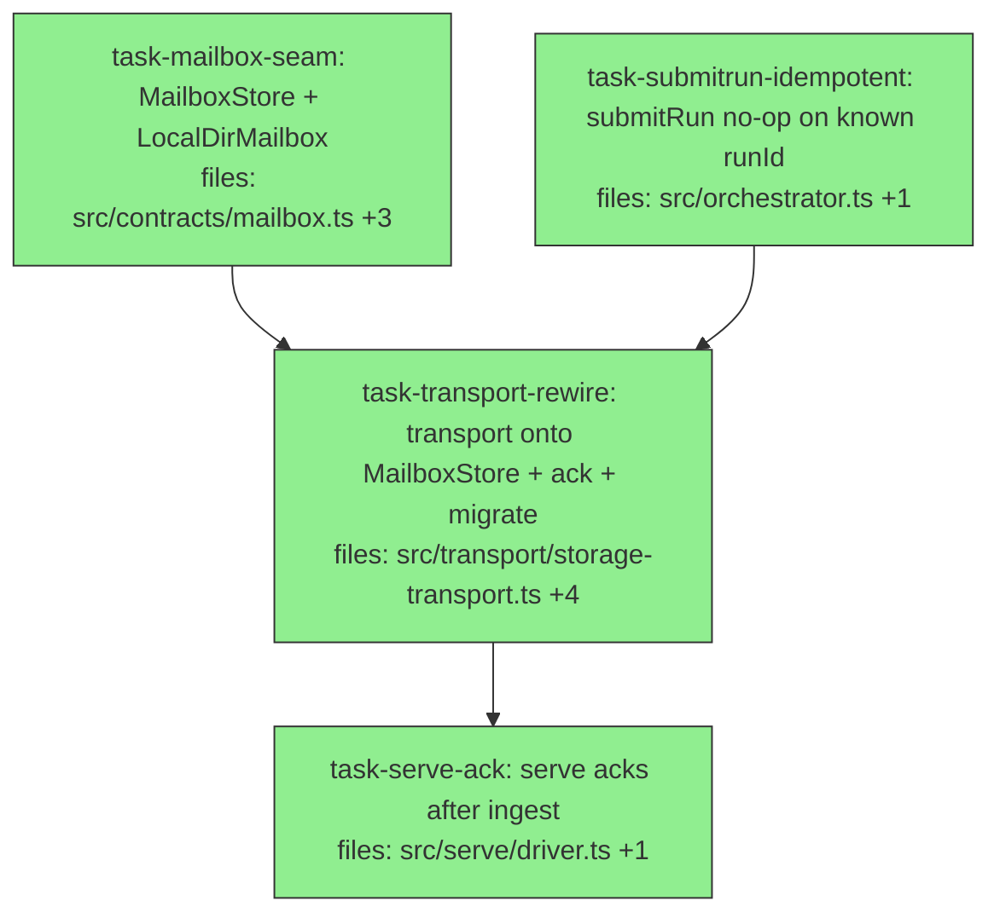

## Context

Implements the mailbox spec (`docs/superpowers/specs/2026-05-31-agora-offload-mailbox-design.md`):
give the submission transport a backend that *exists* — the shipped
`StorageProvider` is content-addressed (artifacts/manifests) and cannot serve as a
mutable name-addressed inbox/outbox. Adds a `MailboxStore` seam + a real
`LocalDirMailbox`, rewires the transport onto it, and proves the runner end-to-end
against a real local-dir backend (the pressure tests migrate off the hand-rolled
fake). All under `packages/agora-orchestrator/`. Executed **sequentially**
(shared-source overlap; concurrent edits race the single worktree index).

**Sequencing refinement vs spec §5:** the spec sketched `pollInbox(): InboxMessage[]`
with a per-message `ack()`. We instead keep `pollInbox()` returning
`SubmissionEnvelope[]` and add a separate **`ack(runId)`** method. Same delete-
after-ingest semantics, but additive — so the transport change doesn't force a
lockstep change to `serve`, keeping each task's suite green. `S3Mailbox` and the
`putIfAbsent` atomic claim remain deferred (spec §8).

## Tasks

## Task: MailboxStore seam and LocalDirMailbox

```yaml
id: task-mailbox-seam
depends_on: []
files:
  - packages/agora-orchestrator/src/contracts/mailbox.ts
  - packages/agora-orchestrator/src/contracts/index.ts
  - packages/agora-orchestrator/src/mailbox/local-dir.ts
  - packages/agora-orchestrator/test/mailbox/local-dir.test.ts
status: done
```

Add the `MailboxStore` seam (mutable, name-addressed key→bytes + prefix list +
delete) and a real filesystem impl. Purely additive — no consumer changes yet.

## Implementation

```typescript
// src/contracts/mailbox.ts
export interface MailboxStore {
  put(key: string, bytes: Uint8Array): Promise<void>;   // write/overwrite
  get(key: string): Promise<Uint8Array | null>;          // null if absent
  list(prefix: string): Promise<string[]>;               // logical keys under prefix
  delete(key: string): Promise<void>;                    // idempotent (no-op if absent)
}
// src/contracts/index.ts: add `export * from './mailbox.js';`
```

```typescript
// src/mailbox/local-dir.ts — node:fs only, OS-safe keys, atomic write
import { mkdir, readFile, writeFile, rename, unlink, readdir } from 'node:fs/promises';
import { join, dirname, relative, sep } from 'node:path';
// per-segment %-encode the Windows-illegal set (< > : " \ | ? * + control); '/' stays the delimiter.
export class LocalDirMailbox implements MailboxStore {
  constructor(private readonly root: string) {}
  // put: mkdir -p dirname(path(key)); write a temp file then rename (atomic).
  // get: readFile -> Uint8Array; return null on ENOENT.
  // list(prefix): recursive readdir of root; decode each file path -> logical key; filter by prefix.
  // delete: unlink; ignore ENOENT.
}
```

```typescript
// test/mailbox/local-dir.test.ts
it('round-trips a key containing a colon on any OS', async () => {
  const m = new LocalDirMailbox(await mkdtemp('...'));
  await m.put('outbox/r/2026-01-01T00:00:00Z.json', new TextEncoder().encode('x'));
  expect(await m.list('outbox/')).toContain('outbox/r/2026-01-01T00:00:00Z.json');
  expect(new TextDecoder().decode((await m.get('outbox/r/2026-01-01T00:00:00Z.json'))!)).toBe('x');
});
```

## Acceptance criteria
- `MailboxStore` exported and reachable via `../contracts/index.js`.
- `LocalDirMailbox` implements all four methods: `put` then `get` round-trips; `get`
  of an absent key returns `null`; `list(prefix)` returns the logical keys under the
  prefix (decoded); `delete` removes and is a no-op if absent.
- A logical key containing a Windows-illegal char (`:`) round-trips through
  put/list/get (OS-safe encoding).
- `put` is crash-safe (temp-file-then-rename), not a partial write.
- Existing suite still green.

Test file: `packages/agora-orchestrator/test/mailbox/local-dir.test.ts`.

## Task: idempotent submitRun

```yaml
id: task-submitrun-idempotent
depends_on: []
files:
  - packages/agora-orchestrator/src/orchestrator.ts
  - packages/agora-orchestrator/test/orchestrator.test.ts
status: done
```

Make `submitRun` a no-op for a run id already in the store, so a message
re-delivered after a missing ack (at-least-once ingest) is absorbed safely.

## Implementation

```typescript
// src/orchestrator.ts — guard at the top of submitRun
  submitRun(run: Run, actor?: string): string {
    if (this.store.getItems(run.id).length > 0) return run.id;   // already ingested — idempotent no-op
    // …existing trigger/saveRun(run, actor)/markReady…
    return run.id;
  }
```

```typescript
// test/orchestrator.test.ts
it('submitRun is idempotent for an already-ingested run', () => {
  // submit the same run twice; assert items not duplicated and second call returns the run id
});
```

## Acceptance criteria
- Submitting the same `run.id` twice does not duplicate items (the store holds one
  copy) and the second `submitRun` returns the run id without re-readying.
- A first submit still behaves exactly as before.
- Existing submitRun/getStatus tests pass.

Test file: `packages/agora-orchestrator/test/orchestrator.test.ts`.

## Task: rewire transport onto MailboxStore, add ack, migrate pressure tests

```yaml
id: task-transport-rewire
depends_on: [task-mailbox-seam, task-submitrun-idempotent]
files:
  - packages/agora-orchestrator/src/contracts/submission-transport.ts
  - packages/agora-orchestrator/src/transport/storage-transport.ts
  - packages/agora-orchestrator/test/storage-transport.test.ts
  - packages/agora-orchestrator/src/index.ts
  - packages/agora-orchestrator/test/pressure-runner.test.ts
status: done
```

Rewire the transport from `StorageProvider` to `MailboxStore`, rename it
`MailboxSubmissionTransport`, add `ack(runId)` (delete the inbox key), and migrate
the pressure tests onto a real `LocalDirMailbox` (delete the hand-rolled
`fileStorage` fake — this becomes the real-backend integration proof).

## Implementation

```typescript
// src/contracts/submission-transport.ts — additive: add ack to the interface (pollInbox unchanged)
export interface SubmissionTransport {
  submit(env: SubmissionEnvelope): Promise<string>;
  pollInbox(): Promise<SubmissionEnvelope[]>;
  ack(runId: string): Promise<void>;                    // NEW: consume an ingested submission
  publish(rec: OutboxRecord): Promise<void>;
  readOutbox(runId: string): Promise<OutboxRecord[]>;
}
```

```typescript
// src/transport/storage-transport.ts — now over MailboxStore
import type { MailboxStore, SubmissionTransport, SubmissionEnvelope, OutboxRecord } from '../contracts/index.js';
export class MailboxSubmissionTransport implements SubmissionTransport {
  private seq = 0;
  constructor(private readonly mbox: MailboxStore, private readonly ns = 'orchestrator') {}
  private inbox = (id: string) => `${this.ns}/submissions/${id}.json`;
  private outbox = (id: string) => `${this.ns}/outbox/${id}/${String(++this.seq).padStart(12, '0')}.json`;
  // submit: mbox.put(inbox(runId), enc(env))
  // pollInbox: mbox.list(`${ns}/submissions/`) -> get -> decode  (NO .claimed marker, NO delete here)
  // ack(runId): mbox.delete(inbox(runId))
  // publish: mbox.put(outbox(rec.runId), enc(rec))
  // readOutbox: mbox.list(`${ns}/outbox/${runId}/`) -> sort by key -> get -> decode
}
```

```typescript
// src/index.ts — rename the transport export, add the mailbox surface
export { MailboxSubmissionTransport } from './transport/storage-transport.js';   // was StorageSubmissionTransport
export { LocalDirMailbox } from './mailbox/local-dir.js';
// MailboxStore type flows via `export * from './contracts/index.js'` already.
```

```typescript
// test/pressure-runner.test.ts — migrate to the REAL backend (delete the fileStorage helper)
const transport = new MailboxSubmissionTransport(new LocalDirMailbox(join(root, 'mbox')));
```

## Acceptance criteria
- `MailboxSubmissionTransport(MailboxStore)` implements the full `SubmissionTransport`
  (incl. `ack`): submit→pollInbox returns the envelope; `ack(runId)` deletes the inbox
  key so a subsequent pollInbox no longer returns it; publish→readOutbox round-trips in
  publish order.
- `src/index.ts` exports `MailboxSubmissionTransport` (old `StorageSubmissionTransport`
  name removed) and `LocalDirMailbox`.
- The pressure tests run against a real `LocalDirMailbox` (the `fileStorage` fake is
  deleted) and all three scenarios still pass — this is the real-backend integration proof.
- No use of `StorageProvider` remains in the transport.
- Full suite + typecheck + build green.

Test file: `packages/agora-orchestrator/test/storage-transport.test.ts`.

## Task: serve acks after ingest

```yaml
id: task-serve-ack
depends_on: [task-transport-rewire]
files:
  - packages/agora-orchestrator/src/serve/driver.ts
  - packages/agora-orchestrator/test/serve-driver.test.ts
  - packages/agora-orchestrator/test/pressure-runner.test.ts
status: done
```

Make `serve` call `transport.ack(env.run.id)` after a successful `submitRun`, so an
ingested submission is consumed (deleted) rather than re-polled every tick. Ingest-
then-ack gives at-least-once; the idempotent `submitRun` absorbs a re-delivery.

## Implementation

```typescript
// src/serve/driver.ts — inside the loop body, after ingest
for (const env of await opts.transport.pollInbox()) {
  opts.orchestrator.submitRun(env.run, env.actor);
  await opts.transport.ack(env.run.id);          // consume it (ingest-then-ack)
}
```

```typescript
// test/serve-driver.test.ts — ack-aware fake transport
it('acks a submission after ingesting it (not re-ingested next poll)', async () => {
  // fakeTransport records ack(runId) calls; after serve drives the run, assert ack was called for it
});
```

## Acceptance criteria
- `serve` calls `transport.ack(runId)` exactly once per ingested envelope, after
  `submitRun`.
- A submission is not re-ingested on the next poll (the ack deleted it); the run still
  completes; abort/recover/error-guard behavior from the hardening wave is preserved.
- Existing serve-driver + pressure tests pass; full suite green.

Test file: `packages/agora-orchestrator/test/serve-driver.test.ts`.
