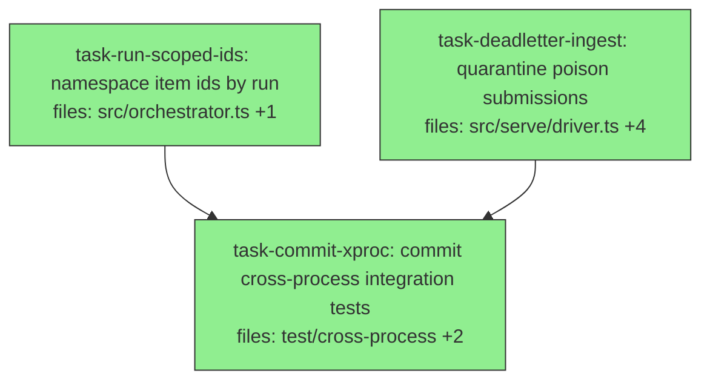

## Context

Fixes the two findings from the cross-process pressure test (`test/cross-process/`):
**(F1)** the `items` table uses a *global* `id` PK, so two runs that share an item
id (`build`/`verify`/…) collide on `submitRun` — broken for the multi-run case
that is the orchestrator's whole purpose. **(F2)** because `serve` acks only after a
*successful* `submitRun`, a submission that always throws is re-polled and re-failed
forever (poison-message livelock). Sequential execution (shared-source). All under
`packages/agora-orchestrator/`.

## Tasks

## Task: namespace item ids by run

```yaml
id: task-run-scoped-ids
depends_on: []
files:
  - packages/agora-orchestrator/src/orchestrator.ts
  - packages/agora-orchestrator/test/orchestrator.test.ts
status: done
```

Make item ids run-scoped internally so two runs can share natural item ids. The
store keeps a single-id key; the orchestrator namespaces ids as `${runId}\x1f${id}`
on the way in (`submitRun`) and de-namespaces on the way out (`getStatus`). The
store, `tick`, `dep-resolver`, lock-manager, `recoverStranded`, and the executor are
unchanged — they operate on whatever ids the store holds (the executor uses
`inputs`, not the id). Resource-lock keys are NOT namespaced (cross-run locks are
intentional).

## Implementation

```typescript
// src/orchestrator.ts
const NS = '\x1f';
const ns = (runId: string, id: string) => `${runId}${NS}${id}`;
const deNs = (id: string) => { const i = id.indexOf(NS); return i < 0 ? id : id.slice(i + 1); };

  submitRun(run: Run, actor?: string): string {
    if (this.store.getItems(run.id).length > 0) return run.id;   // idempotent (run id is NOT namespaced)
    const trigger = this.triggers['manual'];
    if (!trigger) throw new Error("AgoraOrchestrator: no 'manual' trigger registered");
    const nsRun: Run = { ...run, items: run.items.map((it) => ({
      ...it, id: ns(run.id, it.id), depends_on: it.depends_on.map((d) => ns(run.id, d)) })) };
    this.store.saveRun(nsRun, actor);
    this.store.markReady(trigger.initialReady(nsRun));           // initialReady over the ns run -> ns ids
    return run.id;
  }
  // getStatus(): de-namespace id + blockedBy for the public surface
  //   ({ id: deNs(i.id), runId: i.runId, status: i.status, blockedBy: blockedBy.map(deNs) })
```

```typescript
// test/orchestrator.test.ts
it('two runs can share an item id without colliding (run-scoped ids)', () => {
  const store = new SqliteRunStateStore();
  const orch = new AgoraOrchestrator({ store, executors: {}, triggers: { manual: new ManualTrigger() }, queues: { default: { concurrency: 2 } } });
  const mk = (rid: string) => ({ id: rid, queue: 'default', items: [ { id: 't', executor: 'x', inputs: {}, depends_on: [], resourceLocks: [] } ] });
  orch.submitRun(mk('r1')); orch.submitRun(mk('r2'));      // both have item 't' — must NOT throw
  expect(orch.getStatus('r1').map((s) => s.id)).toEqual(['t']);   // de-namespaced for output
  expect(orch.getStatus('r2').map((s) => s.id)).toEqual(['t']);
});
```

## Acceptance criteria
- Submitting two runs that each contain an item with the same id does NOT throw; both
  persist independently (no `UNIQUE constraint` error).
- `getStatus(runId)` returns the ORIGINAL (de-namespaced) item ids and `blockedBy`
  ids; `runId` is correct.
- `depends_on` still resolves correctly within a run (a within-run dependency readies
  as before) — verified by an existing or new DAG test.
- Resource-lock contention across runs is unchanged (lock keys not namespaced).
- Existing tests pass; full suite + typecheck green.

Test file: `packages/agora-orchestrator/test/orchestrator.test.ts`.

## Task: quarantine poison submissions (dead-letter ingest)

```yaml
id: task-deadletter-ingest
depends_on: []
files:
  - packages/agora-orchestrator/src/contracts/submission-transport.ts
  - packages/agora-orchestrator/src/transport/storage-transport.ts
  - packages/agora-orchestrator/test/storage-transport.test.ts
  - packages/agora-orchestrator/src/serve/driver.ts
  - packages/agora-orchestrator/test/serve-driver.test.ts
status: done
```

Stop a submission that always fails ingest from livelocking the daemon. Add a
`deadLetter(runId)` to the transport (move the inbox object to a `dead/` prefix) and
have `serve` wrap each envelope's ingest in its own try/catch: on `submitRun`
failure, `onError` + `deadLetter` instead of leaving it to re-poll.

## Implementation

```typescript
// src/contracts/submission-transport.ts — additive
  deadLetter(runId: string): Promise<void>;   // quarantine an un-ingestable submission

// src/transport/storage-transport.ts — move inbox -> dead, then delete inbox
  async deadLetter(runId: string): Promise<void> {
    const k = this.inbox(runId);
    const b = await this.mbox.get(k);
    if (b) await this.mbox.put(`${this.ns}/dead/${runId}.json`, b);
    await this.mbox.delete(k);
  }
```

```typescript
// src/serve/driver.ts — per-envelope guard inside the existing loop
  for (const env of await opts.transport.pollInbox()) {
    try {
      opts.orchestrator.submitRun(env.run, env.actor);
      await opts.transport.ack(env.run.id);
    } catch (err) {
      opts.onError?.(err);
      await opts.transport.deadLetter(env.run.id);   // poison -> dead-letter, not infinite re-poll
    }
  }
```

```typescript
// test/serve-driver.test.ts
it('dead-letters a submission whose submitRun always throws (no infinite respin)', async () => {
  // orchestrator stub whose submitRun throws; fake transport returns the same envelope once,
  // records deadLetter(runId); assert serve dead-letters it and does NOT loop forever.
});
```

## Acceptance criteria
- `SubmissionTransport.deadLetter(runId)` moves the inbox object to a `dead/<runId>.json`
  key and removes it from the inbox (subsequent `pollInbox` no longer returns it).
- In `serve`, a `submitRun` that throws causes the envelope to be dead-lettered (and
  `onError` invoked), NOT re-polled; a healthy submission in the same batch still
  ingests + acks normally.
- The outer loop guard (tick/publish errors) and ack-on-success path are preserved.
- Existing tests pass; full suite + typecheck green.

Test file: `packages/agora-orchestrator/test/serve-driver.test.ts`.

## Task: commit the cross-process integration tests

```yaml
id: task-commit-xproc
depends_on: [task-run-scoped-ids, task-deadletter-ingest]
files:
  - packages/agora-orchestrator/test/cross-process/cross-process.xproc.ts
  - packages/agora-orchestrator/test/cross-process/serve-daemon.mjs
  - packages/agora-orchestrator/vitest.xproc.config.ts
  - packages/agora-orchestrator/package.json
status: done
```

Commit the 3 cross-process scenarios as a real integration suite, run via a dedicated
`test:xproc` script (they spawn child processes importing the built `dist`, so they
need a build step and must NOT run in the default unit suite).

## Implementation
- Rename `test/cross-process/cross-process.test.ts` → `cross-process.xproc.ts` so the
  DEFAULT `vitest run` (include `*.test.ts`) ignores it. Update the concurrent-load
  scenario to use a SHARED item id (`'t'`) across all runs again — now a regression
  guard proving F1 is fixed.
- Quiet the daemon: drop the 1s status heartbeat; KEEP the `onError`→stderr wiring.
- Add `vitest.xproc.config.ts`:
  ```typescript
  import { defineConfig } from 'vitest/config';
  export default defineConfig({ test: { include: ['test/cross-process/**/*.xproc.ts'], testTimeout: 30000 } });
  ```
- Add to `package.json` scripts: `"test:xproc": "tsc && vitest run --config vitest.xproc.config.ts"`.

## Acceptance criteria
- Default `pnpm --filter @quarry-systems/agora-orchestrator test` does NOT run the
  cross-process tests (they're `*.xproc.ts`, outside the default include) and stays
  fast/green.
- `pnpm --filter @quarry-systems/agora-orchestrator test:xproc` builds, then runs all
  3 cross-process scenarios green — including the concurrent-load test with a SHARED
  item id (regression guard for F1).
- The daemon no longer emits the heartbeat; `onError` still surfaces loop errors.

Test file: `packages/agora-orchestrator/test/cross-process/cross-process.xproc.ts`.
