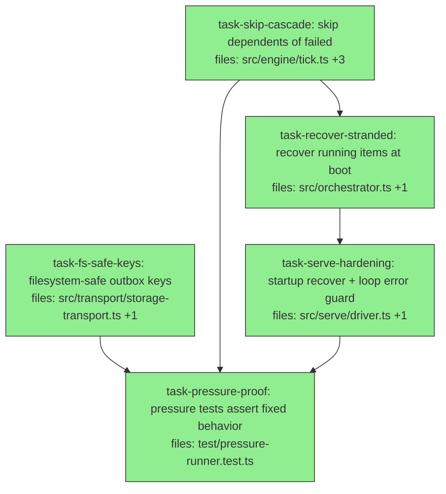

## Context

Hardening wave fixing the 4 findings from the offload-runner pressure test
(`test/pressure-runner.test.ts`). The runner's happy-path/concurrency/retry are
solid; the gaps are all in failure/durability edges — exactly where "unattended"
lives. Executed **sequentially** (shared-source overlap; concurrent edits race the
single worktree git index). All paths under `packages/agora-orchestrator/`.

Findings → tasks:
- **F2 (High) no skip-cascade** → `task-skip-cascade`: a dependent of a terminally-
  `failed` item stays `pending` forever; spec §4 says it must be `skipped`. Resolve
  the spec↔impl↔test contradiction in favor of the spec.
- **F1 (High) crash strands in-flight** → `task-recover-stranded` + the serve call:
  items `running` at a crash can't be reconciled by a fresh process → requeue them
  at boot so the run progresses (at-least-once recovery).
- **F4 (Med) serve loop unguarded** → `task-serve-hardening`: a transient storage
  error became an unhandled rejection that would kill the daemon; guard the loop.
- **F3 (Med) outbox keys not fs-safe** → `task-fs-safe-keys`: outbox object keys use
  a raw ISO timestamp (colons) — illegal in Windows filenames, breaks the local-FS
  dev stack; also same-ms collisions. Make keys safe + unique.
- `task-pressure-proof` re-asserts the FIXED behavior (S2 dependent now `skipped`;
  S3 run now completes after restart), turning the pressure tests green.

**Rescope (2026-05-31):** `task-fs-safe-keys` landed (`eaa7299`) but it addressed a
*test-only* symptom. Investigation showed the shipped `StorageProvider` impls
(`agora-storage-local`/`-s3`) are **content-addressed with a structured `agora://`
URI scheme** — they are NOT the generic prefix-listable key→bytes store the
`SubmissionTransport` assumes, so the transport currently runs only against test
fakes. The real fix is a dedicated **inbox/outbox mailbox seam** (generic keys +
prefix list + delete) with a real local-dir impl — split out as its own
design+build (`offload-mailbox`), separate from these engine fixes. The colon-key
commit is kept (the counter key is correct regardless). The three remaining tasks
here are engine/orchestrator-level and storage-independent.

## Tasks

## Task: filesystem-safe outbox keys

```yaml
id: task-fs-safe-keys
depends_on: []
files:
  - packages/agora-orchestrator/src/transport/storage-transport.ts
  - packages/agora-orchestrator/test/storage-transport.test.ts
status: done
```

The `outbox(id, at)` key uses the raw ISO timestamp (`…/<id>/2026-…:…:….json`).
Colons are illegal in Windows filenames (breaks any filesystem-backed
`StorageProvider`), and two records published in the same millisecond collide.
Make the key filesystem-safe and unique with a per-transport monotonic counter;
keep `OutboxRecord.at` (the human timestamp) in the body unchanged.

## Acceptance criteria
- Outbox object keys contain no `:` (and no other Windows-illegal char): assert the
  key path used in `publish` matches `/^[\w./-]+$/`.
- Two `publish` calls for the same run in the same ms both round-trip via
  `readOutbox` (no collision) — assert 2 records returned.
- `readOutbox` ordering is stable/monotonic by publish order.
- Existing storage-transport tests still pass.

Test file: `packages/agora-orchestrator/test/storage-transport.test.ts`.

## Task: skip dependents of a failed item

```yaml
id: task-skip-cascade
depends_on: []
files:
  - packages/agora-orchestrator/src/engine/tick.ts
  - packages/agora-orchestrator/src/engine/dep-resolver.ts
  - packages/agora-orchestrator/test/tick.test.ts
  - packages/agora-orchestrator/test/orchestrator.test.ts
status: done
```

When an item reaches terminal `failed` in `tick`, mark its **transitive** same-run
dependents `skipped` (spec §4) so the run can reach a terminal state instead of
hanging `pending` forever. Add a `transitiveDependents(items, failedIds)` helper to
`dep-resolver.ts`. Update the existing `orchestrator.test.ts` assertion that
currently expects a failed dependency to leave dependents "blocked"/`pending` — it
must now expect `skipped` (resolving the spec↔test contradiction).

## Acceptance criteria
- A terminally-`failed` item causes every transitive dependent in the same run to
  become `skipped` (status set via the store), not left `pending`.
- `transitiveDependents` returns the full downstream closure (multi-hop), excludes
  already-terminal items, and is order-independent.
- After a failure, the run reaches a terminal state (no item stuck `pending` solely
  because an ancestor failed).
- The retry path is unaffected: an item with attempts remaining still requeues; only
  a *terminally* failed item triggers the cascade.
- `orchestrator.test.ts` updated to expect `skipped` (was `pending`); a new
  `tick.test.ts` case proves multi-hop cascade. Existing tests pass.

Test file: `packages/agora-orchestrator/test/tick.test.ts`.

## Task: recover stranded running items at boot

```yaml
id: task-recover-stranded
depends_on: [task-skip-cascade]
files:
  - packages/agora-orchestrator/src/orchestrator.ts
  - packages/agora-orchestrator/test/orchestrator.test.ts
status: done
```

Add `AgoraOrchestrator.recoverStranded(now?: number): number` for crash recovery:
items left in `running` by a crashed process can't be reconciled by a fresh
executor (the dispatch handle was in-memory), so requeue them. For each `running`
item: release its locks; if attempts remain (`getAttempts+1 < maxAttempts`),
`bumpAttempt` + `requeue(id, now)` (re-dispatch — at-least-once semantics); else
mark it terminally `failed` (which the tick will then skip-cascade). Returns the
count recovered. Idempotent: a no-op when nothing is `running`.

## Acceptance criteria
- `recoverStranded()` requeues every `running` item to `ready` (locks released,
  `attempts` bumped) when attempts remain; returns the count.
- A `running` item whose attempts are exhausted is set terminal `failed` instead of
  requeued.
- No effect on items in any non-`running` status; safe to call repeatedly.
- Honors the orchestrator's configured `maxAttempts`.
- Existing tests pass.

Test file: `packages/agora-orchestrator/test/orchestrator.test.ts`.

## Task: serve startup recovery + loop error guard

```yaml
id: task-serve-hardening
depends_on: [task-recover-stranded]
files:
  - packages/agora-orchestrator/src/serve/driver.ts
  - packages/agora-orchestrator/test/serve-driver.test.ts
status: done
```

Two robustness fixes to the daemon: (1) call `orchestrator.recoverStranded()` at
startup, before the reconcile-first tick, so a restarted process re-dispatches
items stranded by a crash; (2) wrap the loop body (poll/ingest/tick/publish) in a
try/catch so a transient error (e.g. a failed `publish`) is swallowed-and-continued
rather than becoming an unhandled rejection that kills the daemon. An optional
`onError?: (err: unknown) => void` hook on `ServeOptions` surfaces caught errors.

## Acceptance criteria
- On startup `serve` calls `orchestrator.recoverStranded()` before the first tick;
  a store pre-seeded with a `running` item has it requeued and driven to terminal.
- A `transport.publish` (or `pollInbox`) that throws does NOT crash `serve`: the
  loop continues, `onError` is invoked if provided, and the run still completes.
- The abort-aware exit and per-run publish behavior from the runner wave are
  preserved.
- Existing serve-driver tests pass.

Test file: `packages/agora-orchestrator/test/serve-driver.test.ts`.

## Task: pressure tests assert the fixed behavior

```yaml
id: task-pressure-proof
depends_on: [task-fs-safe-keys, task-skip-cascade, task-serve-hardening]
files:
  - packages/agora-orchestrator/test/pressure-runner.test.ts
status: done
```

Update the three pressure scenarios to assert the hardened behavior, proving the
fixes end-to-end: Scenario 1 unchanged (still passes); Scenario 2's dependent of the
failed item must now be **`skipped`** (was `pending`); Scenario 3 must now
**complete after restart** — `recoverStranded` re-dispatches the stranded in-flight
item so all items reach `done`. Keep the file's filesystem `StorageProvider`.

## Acceptance criteria
- S1 still asserts fan-out + lock-serialization + all done.
- S2 asserts the dependent of the always-failing item ends `skipped` (not `pending`),
  and the run reaches a terminal state.
- S3 asserts that after crash+restart the run completes (every item `done`), with
  idempotent ingest (`reIngested === 0`) and no re-execution of items completed
  pre-crash.
- The full `pnpm --filter @quarry-systems/agora-orchestrator test` suite is green.

Test file: `packages/agora-orchestrator/test/pressure-runner.test.ts`.
