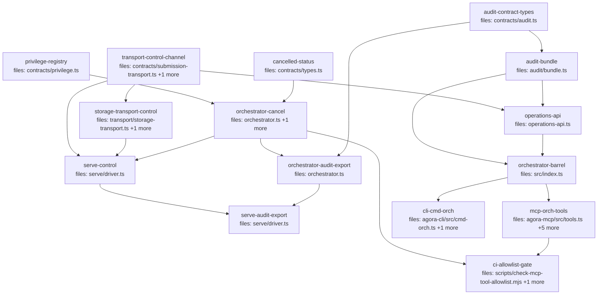

## Context

This plan implements the **offload-surface** wave — the operator surface for
agora-offload — per the wave design at
`docs/superpowers/specs/2026-05-31-agora-offload-surface-design.md` and the V1
canon (`2026-05-29-agora-offload-v1-design.md` §1.1 item 5, §6.4, §6.5; the
orchestrator spec §10.2/§10.4–10.6). It consolidates the operations API and
exposes it via CLI + MCP as **pure translators**, adds **minimal CLI-only
cancel** (control channel; no in-flight force-kill), surfaces the §6.5 audit
evidence bundle (**service-exported, client-verified against the live anchor**,
reusing the existing `verify()`), and adds the **§10.6 CI allowlist gate**.

**Execution note (load-bearing):** another instance may share the main tree, so
tasks execute **one at a time, sequentially**. The `depends_on:` edges encode
correct ordering, not parallel width. Two tasks share `orchestrator.ts`
(`orchestrator-cancel` → `orchestrator-audit-export`) and two share
`serve/driver.ts` (`serve-control` → `serve-audit-export`); each pair is
serialized by an explicit edge. Per-task gate runs BOTH `pnpm --filter <pkg>
typecheck` AND `pnpm --filter <pkg> test`.

All file paths below are relative to `packages/agora-orchestrator/src/` unless a
`packages/…` or `scripts/…` prefix is given.

## Tasks

## Task: privilege registry

```yaml
id: task-privilege-registry
depends_on: []
files:
  - packages/agora-orchestrator/src/contracts/privilege.ts
  - packages/agora-orchestrator/src/contracts/index.ts
status: done
```

Formalize the §10.6 method→privilege map into a single contract module — the
mechanism the CLI/MCP split and the CI gate both consume. Replaces the ad-hoc
3-entry `PRIVILEGE` const currently inlined in `orchestrator.ts`.

## Implementation

```typescript
// contracts/privilege.ts
export type PrivilegeTag = 'client' | 'privileged' | 'service';
export interface MethodPolicy { tag: PrivilegeTag; mcp: boolean; }

/** Single source of method→policy. `mcp:true` ⇔ tag==='client' && method!=='audit'
 *  (audit is client + read-only but a CLI-only operator action — never on MCP). */
export const PRIVILEGE: Record<string, MethodPolicy> = {
  submit: { tag: 'client',     mcp: true  },
  status: { tag: 'client',     mcp: true  },
  watch:  { tag: 'client',     mcp: true  },
  cancel: { tag: 'privileged', mcp: false },
  audit:  { tag: 'client',     mcp: false },
  serve:  { tag: 'service',    mcp: false },
  tick:   { tag: 'service',    mcp: false },
};

/** True iff a method is eligible to be exposed as an MCP tool. */
export function isMcpEligible(method: string): boolean {
  return PRIVILEGE[method]?.mcp === true;
}
```

Add `export * from './privilege.js';` to `contracts/index.ts` (append one line;
do not reorder existing exports).

```typescript
// test
import { PRIVILEGE, isMcpEligible } from '../../src/contracts/privilege.js';
import { it, expect } from 'vitest';

it('keeps privileged and service methods off the MCP surface', () => {
  expect(isMcpEligible('submit')).toBe(true);
  expect(isMcpEligible('cancel')).toBe(false); // privileged
  expect(isMcpEligible('serve')).toBe(false);  // service
  expect(isMcpEligible('audit')).toBe(false);  // client but CLI-only
});
```

## Acceptance criteria

- `PRIVILEGE` contains entries for exactly `submit|status|watch|cancel|audit|serve|tick`.
- `isMcpEligible` returns `true` only for `submit|status|watch`; `false` for `cancel|audit|serve|tick`.
- `mcp:true` holds iff `tag==='client'` AND the method is not `audit`.
- `contracts/privilege.ts` is re-exported through `contracts/index.ts`.

Test file: `packages/agora-orchestrator/test/privilege.test.ts`.

## Task: cancelled run status

```yaml
id: task-cancelled-status
depends_on: []
files:
  - packages/agora-orchestrator/src/contracts/types.ts
  - packages/agora-orchestrator/test/contracts.test.ts
status: done
```

Add `cancelled` as a terminal run status so an operator-cancelled item is
distinguishable from a dependency-`skipped` one (§5). Pure type widening —
`TerminalStatus` is consumed only as a parameter type (e.g. `tick.test.ts:49`),
so widening is backward-compatible.

## Implementation

```typescript
// contracts/types.ts — extend the two status declarations only
export const RUN_STATUSES = ['pending', 'ready', 'running', 'done', 'failed', 'skipped', 'cancelled'] as const;
export type RunStatus = (typeof RUN_STATUSES)[number];

/** The subset of RunStatus an item can hold once it stops moving. */
export type TerminalStatus = 'done' | 'failed' | 'skipped' | 'cancelled';
```

```typescript
// test
import { RUN_STATUSES } from '../../src/contracts/types.js';
import type { TerminalStatus } from '../../src/contracts/types.js';
import { it, expect } from 'vitest';

it('admits cancelled as a terminal status', () => {
  expect(RUN_STATUSES).toContain('cancelled');
  const s: TerminalStatus = 'cancelled'; // compiles
  expect(s).toBe('cancelled');
});
```

## Acceptance criteria

- `RUN_STATUSES` includes `'cancelled'`; `RunStatus` admits it.
- `TerminalStatus` admits `'cancelled'`.
- `test/contracts.test.ts:8` (an exact-tuple assertion, the only one in the package) is updated to the seven-element tuple including `'cancelled'`; rename its `it(...)` from "six lifecycle states" to "seven". `index.test.ts`'s `Array.isArray` check is backward-compatible and untouched.

Test file: `packages/agora-orchestrator/test/cancelled-status.test.ts` (new) + the updated `test/contracts.test.ts`.

## Task: submission-transport control channel

```yaml
id: task-transport-control-channel
depends_on: []
files:
  - packages/agora-orchestrator/src/contracts/submission-transport.ts
  - packages/agora-orchestrator/test/submission-transport.test.ts
status: done
```

Add the cancel control channel (no inbound networking — the service polls) and the
`'audit'` outbox kind (§6.5), both as **additive** contract surface.
**Interface segregation (load-bearing):** the control methods go on a SEPARATE
`ControlChannel` interface, NOT on `SubmissionTransport` — `SubmissionTransport`
has one real implementor (`MailboxSubmissionTransport`) plus three test fakes in
`serve-driver.test.ts`, and widening it with required methods would break all of
them at this task's own gate before task 5 implements them. A new unused interface
breaks nothing. Also update the `OUTBOX_KINDS` tuple assertion
(`submission-transport.test.ts:5`).

## Implementation

```typescript
// contracts/submission-transport.ts — additive; SubmissionTransport is UNCHANGED
export const OUTBOX_KINDS = ['status', 'completed', 'audit'] as const;
export type OutboxKind = (typeof OUTBOX_KINDS)[number];

/** A privileged control request (cancel in V1). Identity-stamped, never authz. */
export interface ControlEnvelope {
  kind: 'cancel';
  target: string;       // run-id or item-id
  actor: string;        // "human:<id>" — recorded on the audit entry
  at: string;           // ISO-8601
}

/** Optional capability a transport MAY also implement — the cancel path. Kept
 *  separate from SubmissionTransport so existing impls/fakes are unaffected. */
export interface ControlChannel {
  control(env: ControlEnvelope): Promise<void>;          // client → control inbox
  pollControl(): Promise<ControlEnvelope[]>;             // service: claim control requests
  ackControl(target: string): Promise<void>;             // service: consume one
}
```

Update the existing test to assert the three-kind tuple:

```typescript
// submission-transport.test.ts — replace the tuple assertion
expect([...OUTBOX_KINDS]).toEqual(['status', 'completed', 'audit']);
```

## Acceptance criteria

- `OUTBOX_KINDS` deep-equals `['status','completed','audit']`; `OutboxKind` admits `'audit'`.
- A new `ControlChannel` interface declares `control`, `pollControl`, `ackControl`; `ControlEnvelope` carries `kind:'cancel'`, `target`, `actor`, `at`.
- `SubmissionTransport` is **unchanged** (no methods added to it) — existing implementors and the `serve-driver.test.ts` fakes still typecheck.
- `submission-transport.test.ts` is green against the new tuple; the full orchestrator package typecheck + test stays green.

Test file: `packages/agora-orchestrator/test/submission-transport.test.ts`.

## Task: audit contract types

```yaml
id: task-audit-contract-types
depends_on: []
files:
  - packages/agora-orchestrator/src/contracts/audit.ts
status: done
```

Define the two audit data shapes the surface needs: `AuditExport` (the refs-only
outbox body the service publishes) and `AuditBundle` (the assembled §6.5 evidence
artifact the CLI emits). Both reuse existing `AuditEntryRow`/`AnchoredRoot`/
`VerificationReport` in the same file. Executor-agnostic — refs only, no values.

## Implementation

```typescript
// contracts/audit.ts — append (reuses AuditEntryRow, AnchoredRoot, VerificationReport above)
import type { DispatchManifest } from './manifest.js';

/** Per-item outcome row carried in an audit export — references only, never values. */
export interface AuditItemOutcome {
  id: string; status: string; attempts?: number; actor?: string;
  resultRef?: string; manifestRef?: string;
}

/** Refs-only audit export the service publishes to the outbox on epoch seal (§6.5). */
export interface AuditExport {
  runId: string;
  entries: AuditEntryRow[];
  root: AnchoredRoot | undefined;   // undefined when the run never sealed
  items: AuditItemOutcome[];
}

/** The assembled, verifiable §6.5 evidence bundle the CLI emits. */
export interface AuditBundle {
  runId: string;
  manifests: DispatchManifest[];
  auditLog: { entries: AuditEntryRow[]; root: AnchoredRoot | undefined };
  items: AuditItemOutcome[];
  report: VerificationReport;       // names the anchor + guarantee tier
}
```

```typescript
// test
import type { AuditExport, AuditBundle } from '../../src/contracts/audit.js';
import { it, expect } from 'vitest';

it('shapes an export and a bundle with refs only', () => {
  const exp: AuditExport = { runId: 'r1', entries: [], root: undefined, items: [{ id: 'a', status: 'done', resultRef: 'agora://artifacts/x' }] };
  const keys = Object.keys(exp.items[0]);
  expect(keys).not.toContain('secret');           // refs only — no value fields
  expect<AuditBundle['runId']>('r1').toBe('r1');
});
```

## Acceptance criteria

- `AuditExport` has `runId`, `entries`, `root` (optional), `items: AuditItemOutcome[]`.
- `AuditBundle` has `runId`, `manifests`, `auditLog`, `items`, `report`.
- `AuditItemOutcome` carries only id/status/attempts/actor/resultRef/manifestRef — no value-bearing fields.
- Both types reuse the existing `AuditEntryRow`/`AnchoredRoot`/`VerificationReport`.

Test file: `packages/agora-orchestrator/test/audit-contract-types.test.ts`.

## Task: storage-transport control implementation

```yaml
id: task-storage-transport-control
depends_on: [task-transport-control-channel]
files:
  - packages/agora-orchestrator/src/transport/storage-transport.ts
  - packages/agora-orchestrator/test/storage-transport-control.test.ts
status: done
```

Implement the `ControlChannel` capability on `MailboxSubmissionTransport` over a
`control/` mailbox prefix, mirroring the existing `submissions/` convention.
Additive — the existing `SubmissionTransport` methods are untouched; the class now
declares `implements SubmissionTransport, ControlChannel`. Tests land in a NEW file
to avoid clobbering `task-transport-control-channel`'s edits to
`submission-transport.test.ts`.

## Implementation

```typescript
// storage-transport.ts
import type { ControlEnvelope, ControlChannel, SubmissionTransport } from '../contracts/index.js';
// class MailboxSubmissionTransport implements SubmissionTransport, ControlChannel {

  private control_ = (id: string) => `${this.ns}/control/${id}.json`;
  async control(env: ControlEnvelope): Promise<void> {
    await this.mbox.put(this.control_(env.target), enc(env));
  }
  async pollControl(): Promise<ControlEnvelope[]> {
    const keys = await this.mbox.list(`${this.ns}/control/`);
    const out: ControlEnvelope[] = [];
    for (const k of keys) { if (!k.endsWith('.json')) continue; const b = await this.mbox.get(k); if (b) out.push(dec(b) as ControlEnvelope); }
    return out;
  }
  async ackControl(target: string): Promise<void> { await this.mbox.delete(this.control_(target)); }
```

```typescript
// test
import { MailboxSubmissionTransport } from '../src/transport/storage-transport.js';
import { LocalDirMailbox } from '../src/mailbox/local-dir.js';
import { it, expect } from 'vitest';

it('round-trips a cancel control request and acks it', async () => {
  const t = new MailboxSubmissionTransport(new LocalDirMailbox(/* tmp dir */ makeTmp()));
  await t.control({ kind: 'cancel', target: 'run-1', actor: 'human:brett', at: '2026-05-31T00:00:00Z' });
  expect((await t.pollControl()).map((c) => c.target)).toEqual(['run-1']);
  await t.ackControl('run-1');
  expect(await t.pollControl()).toEqual([]);
});
```

## Acceptance criteria

- `MailboxSubmissionTransport` declares `implements SubmissionTransport, ControlChannel` and satisfies both (typecheck green).
- `control()` writes one envelope under `<ns>/control/<target>.json`; `pollControl()` returns all pending; `ackControl()` deletes one.
- A cancel envelope round-trips: write → poll sees it → ack → poll empty.
- Existing `submit`/`pollInbox`/`publish`/`readOutbox` behavior is unchanged (existing transport tests stay green).

Test file: `packages/agora-orchestrator/test/storage-transport-control.test.ts`.

## Task: orchestrator cancel support

```yaml
id: task-orchestrator-cancel
depends_on: [task-privilege-registry, task-cancelled-status]
files:
  - packages/agora-orchestrator/src/orchestrator.ts
  - packages/agora-orchestrator/src/engine/dep-resolver.ts
status: done
```

Add `cancelRun`/`cancelItem`: mark `pending|ready` items terminally `cancelled`,
release their locks, leave `running` items to reconcile (no force-kill, §5), append
a `run.cancelled` audit entry with the actor. Dependents are cascaded to `skipped`
by the EXISTING `tick → computeSkipped` path — **not** a hand-rolled cascade (DRY):
`computeSkipped` is extended to treat a `cancelled` dependency as non-satisfiable,
exactly as it already treats `failed`/`skipped`, so cancel reuses the same failure-
cascade machinery (which settles across ticks). Also add `'cancelled'` to the
internal `TERMINAL_STATUSES` set and source `PRIVILEGE` from
`contracts/privilege.ts` (drop the inlined 3-entry const; re-export so
`src/index.ts:8` keeps working).

## Implementation

```typescript
// engine/dep-resolver.ts — computeSkipped now treats a cancelled dep as non-satisfiable too
return items
  .filter((i) => i.status === 'pending' && i.depends_on.some((d) => {
    const s = status.get(d);
    return s === 'failed' || s === 'skipped' || s === 'cancelled';
  }))
  .map((i) => i.id);
```

```typescript
// orchestrator.ts
export { PRIVILEGE } from './contracts/privilege.js'; // was: inlined `export const PRIVILEGE = {...}`
const TERMINAL_STATUSES = new Set(['done', 'failed', 'skipped', 'cancelled']);

  /** Operator cancel (privileged): stop a run. pending|ready → cancelled + locks released;
   *  running items reconcile naturally (no force-kill). Dependents cascade to `skipped`
   *  on the next tick via the existing computeSkipped path — no cascade is duplicated here. */
  cancelRun(runId: string, actor?: string): void {
    for (const it of this.store.getItems(runId)) {
      if (it.status === 'pending' || it.status === 'ready') {
        this.store.releaseLocks(it.id);
        this.store.setStatus(it.id, 'cancelled', 'operator cancelled');
      }
    }
    try { this.auditLog?.append({ kind: 'run.cancelled', runId, actor, at: new Date().toISOString() }); } catch { /* best-effort */ }
  }
  /** Cancel a single namespaced item id within a run; same per-item logic + audit. */
  cancelItem(runId: string, itemId: string, actor?: string): void { /* ns(runId,itemId) → setStatus 'cancelled' + audit */ }
```

```typescript
// test
import { AgoraOrchestrator } from '../src/orchestrator.js';
it('cancels pending/ready items; a following tick skips dependents; running untouched', async () => {
  // submit a→b (b depends_on a); cancelRun(runId) → a:'cancelled'; await tick() → b:'skipped'
  // a run.cancelled audit entry carrying the actor is recorded
});
```

## Acceptance criteria

- `cancelRun(runId, actor)` sets every `pending|ready` item of the run to `cancelled` and releases their locks; `running` items are NOT touched.
- After a subsequent `tick()`, transitive dependents of the cancelled items are `skipped` — via the extended `computeSkipped`, not a cascade reimplemented in `cancelRun`.
- `computeSkipped` treats a `cancelled` dependency as non-satisfiable (same branch as `failed`/`skipped`); the existing `dep-resolver.test.ts` stays green.
- A `run.cancelled` audit entry carrying `actor` is appended (best-effort — a failing append does not throw).
- `cancelItem(runId, itemId, actor)` cancels a single item the same way (its dependents skip on the next tick).
- `PRIVILEGE` is imported/re-exported from `contracts/privilege.ts`; `src/index.ts` still exports it; `TERMINAL_STATUSES` includes `'cancelled'`.

Test file: `packages/agora-orchestrator/test/orchestrator-cancel.test.ts`.

## Task: orchestrator audit export

```yaml
id: task-orchestrator-audit-export
depends_on: [task-orchestrator-cancel, task-audit-contract-types]
files:
  - packages/agora-orchestrator/src/orchestrator.ts
status: done
```

Add `getAuditExport(runId)` — a read that assembles the refs-only `AuditExport`
from the orchestrator's own store (entries + sealed root + per-item outcomes). The
driver publishes it on seal (§6.5). Keeps the store encapsulated in the
orchestrator (D3). Shares `orchestrator.ts` with `task-orchestrator-cancel`, so it
is serialized after it.

## Implementation

```typescript
// orchestrator.ts
import type { AuditExport } from './contracts/index.js';

  /** Refs-only audit export for a (typically sealed) run. `root` is undefined if unsealed. */
  getAuditExport(runId: string): AuditExport {
    const auditStore = this.store as unknown as {
      getAuditEntries(runId: string): import('./contracts/index.js').AuditEntryRow[];
      getAuditRoot(epochId: string): import('./contracts/index.js').AnchoredRoot | undefined;
    };
    const items = this.store.getItems(runId).map((i) => ({
      id: deNs(i.id), status: i.status, attempts: i.attempts, actor: i.actor,
      resultRef: i.resultRef, manifestRef: i.manifestRef,
    }));
    return { runId, entries: auditStore.getAuditEntries(runId), root: auditStore.getAuditRoot(runId), items };
  }
```

```typescript
// test
it('exports refs-only entries, sealed root, and per-item outcomes', () => {
  // submit + tick a one-item run to done under an AuditLog → getAuditExport(runId)
  // expect entries non-empty, root defined, items[0].resultRef present, no value fields
});
```

## Acceptance criteria

- `getAuditExport(runId)` returns `{ runId, entries, root, items }` from the store.
- `items` carry de-namespaced ids + status/attempts/actor/resultRef/manifestRef — references only, no secret values.
- `root` is `undefined` for a run whose epoch has not sealed; defined once sealed.
- Reads the store only (no DB opened elsewhere); throws nothing for an unknown runId (returns empty entries/items).

Test file: `packages/agora-orchestrator/test/orchestrator-audit-export.test.ts`.

## Task: audit bundle assembler

```yaml
id: task-audit-bundle
depends_on: [task-audit-contract-types]
files:
  - packages/agora-orchestrator/src/audit/bundle.ts
status: done
```

Client-side assembly of the §6.5 evidence bundle from an `AuditExport`: reconstruct
an in-memory `AuditStore` over the (untrusted) exported entries+root, fetch manifest
blobs from storage by ref, and run the EXISTING `verify(runId,{store,anchor})`
against the **live** anchor — a tampered export recomputes a root that no longer
matches the live anchored root, dropping the claim to `tamper-detecting` (§6.3).
Verification is NOT reimplemented here. Executor-agnostic.

`verifySignature` is **optional** and only checked by `verify()` when both the
anchored root carries a signature AND a verifier is supplied (`verify.ts:45`). Use
`verifyEd25519(root, sig, spkiDer)` (audit/signer.ts) only when a **stable** public
key is configured (KMS, or a persisted SPKI key). Do NOT build a verifier from a
fresh `createLocalSigner()` — it mints an ephemeral keypair per process, so a CLI
process can never verify serve's local signature. Under the dev `LocalSigner`/
`LocalAnchor` stack the bundle therefore verifies **chain + root-vs-anchor only**
(signature step skipped); the report's `claim` is still correct (`tamper-detecting`
at the `detect` tier — the guarantee is driven by the anchor + intact chain/root,
not the signature).

## Implementation

```typescript
// audit/bundle.ts
import type { AuditExport, AuditBundle, AuditStore, AuditAnchor, AuditEntryRow, AnchoredRoot, Signature, DispatchManifest } from '../contracts/index.js';
import { verify } from './verify.js';

interface StorageLike { get(ref: string): Promise<Uint8Array>; }

/** Minimal read-only AuditStore over an export — the data is UNTRUSTED; integrity
 *  comes from verify() comparing the recomputed root to the LIVE anchored root. */
function exportStore(exp: AuditExport): AuditStore {
  return {
    getAuditEntries: (r) => (r === exp.runId ? exp.entries : []),
    getAuditChainHead: () => exp.entries.at(-1)?.entryHash ?? '',
    getAuditRoot: (e) => (e === exp.runId ? exp.root : undefined),
    appendAuditEntry: () => { throw new Error('read-only'); },
    putAuditRoot: () => { throw new Error('read-only'); },
  };
}

export async function assembleBundle(
  exp: AuditExport,
  deps: { anchor: AuditAnchor; storage: StorageLike; verifySignature?: (root: Uint8Array, sig: Signature) => boolean },
): Promise<AuditBundle> {
  const manifests: DispatchManifest[] = [];
  for (const it of exp.items) {
    if (!it.manifestRef) continue;
    try { manifests.push(JSON.parse(new TextDecoder().decode(await deps.storage.get(it.manifestRef)))); }
    catch { /* a missing manifest is reported via the bundle, not thrown */ }
  }
  const report = await verify(exp.runId, { store: exportStore(exp), anchor: deps.anchor, verifySignature: deps.verifySignature });
  return { runId: exp.runId, manifests, auditLog: { entries: exp.entries, root: exp.root }, items: exp.items, report };
}
```

```typescript
// test
import { assembleBundle } from '../src/audit/bundle.js';
it('verifies a faithful export and reports tamper-detecting under a detect-tier anchor', async () => {
  // build entries+root via the real AuditLog + LocalAnchor, export them,
  // assembleBundle(export, {anchor, storage}) → report.intact === true, report.claim === 'tamper-detecting'
});
it('fails verification when an exported entry is mutated', async () => {
  // flip a byte in exp.entries[0].entryHash → report.intact === false, failure==='chain'
});
```

## Acceptance criteria

- `assembleBundle` returns `{ runId, manifests, auditLog, items, report }`.
- `manifests` are fetched from storage by `manifestRef`; a missing/unfetchable manifest is skipped, not thrown.
- `report` is the verbatim output of the existing `verify()` run against the LIVE anchor (no re-implementation).
- A faithful export under `LocalAnchor` yields `report.intact===true`, `report.claim==='tamper-detecting'`.
- A mutated exported entry yields `report.intact===false` with `failure==='chain'` (or `root-mismatch`).

Test file: `packages/agora-orchestrator/test/audit-bundle.test.ts`.

## Task: operations API

```yaml
id: task-operations-api
depends_on: [task-transport-control-channel, task-audit-bundle]
files:
  - packages/agora-orchestrator/src/operations-api.ts
status: done
```

The single client-facing operations API (§10.2) — `submit`/`status`/`watch`/
`cancel`/`audit` as pure transport/anchor/storage-backed methods, **never** opening
the DB (D3). Holds the operator-side business logic the CLI and MCP both translate
over (so the surfaces carry none). Captures `actor` on `submit`/`cancel` (§6.4).

## Implementation

```typescript
// operations-api.ts
import type { SubmissionTransport, ControlChannel, ControlEnvelope, OutboxRecord, Run, AuditAnchor, AuditBundle, AuditExport } from './contracts/index.js';
import { assembleBundle } from './audit/bundle.js';

interface StorageLike { get(ref: string): Promise<Uint8Array>; }
export interface OperationsApiDeps {
  transport: SubmissionTransport & ControlChannel; anchor?: AuditAnchor; storage?: StorageLike;
  verifySignature?: (root: Uint8Array, sig: import('./contracts/index.js').Signature) => boolean; // optional; see audit-bundle
  nowIso?: () => string;
}

export class OperationsApi {
  constructor(private readonly deps: OperationsApiDeps) {}
  async submit(run: Run, actor: string): Promise<string> {
    return this.deps.transport.submit({ run, actor, submittedAt: this.now() });
  }
  async status(runId: string): Promise<OutboxRecord | undefined> {
    const recs = await this.deps.transport.readOutbox(runId);
    return recs.filter((r) => r.kind === 'status').at(-1) ?? recs.at(-1);
  }
  async cancel(target: string, actor: string): Promise<void> {
    const env: ControlEnvelope = { kind: 'cancel', target, actor, at: this.now() };
    await this.deps.transport.control(env);
  }
  async audit(runId: string): Promise<AuditBundle> {
    if (!this.deps.anchor || !this.deps.storage) throw new Error('audit requires anchor + storage in the orch context');
    const recs = await this.deps.transport.readOutbox(runId);
    const exp = recs.filter((r) => r.kind === 'audit').at(-1)?.body as AuditExport | undefined;
    if (!exp) throw new Error(`no audit export published yet for run ${runId}`);
    return assembleBundle(exp, { anchor: this.deps.anchor, storage: this.deps.storage, verifySignature: this.deps.verifySignature });
  }
  // watch: async generator polling status until the run is terminal (poll cadence supplied by caller)
  private now() { return this.deps.nowIso?.() ?? new Date().toISOString(); }
}
```

```typescript
// test
import { OperationsApi } from '../src/operations-api.js';
it('submit stamps actor + submittedAt and writes via the transport, never the DB', async () => {
  const writes: unknown[] = [];
  const api = new OperationsApi({ transport: fakeTransport({ onSubmit: (e) => writes.push(e) }) });
  await api.submit({ id: 'r1', queue: 'default', items: [] }, 'human:brett');
  expect(writes).toHaveLength(1); // and the envelope carries actor:'human:brett'
});
```

## Acceptance criteria

- `submit(run, actor)` writes a `SubmissionEnvelope` (actor + `submittedAt`) via `transport.submit`; returns the run id; opens no DB.
- `status(runId)` returns the latest `status` outbox record (or latest record).
- `cancel(target, actor)` writes a `kind:'cancel'` `ControlEnvelope` via `transport.control`.
- `audit(runId)` reads the latest `audit` outbox record and returns `assembleBundle(...)`; throws a clear error if `anchor`/`storage` are absent or no export exists yet.
- `watch` polls `status` until the run is terminal (no streaming protocol — v1 polling model).

Test file: `packages/agora-orchestrator/test/operations-api.test.ts`.

## Task: serve driver — control inbox poll

```yaml
id: task-serve-control
depends_on: [task-transport-control-channel, task-storage-transport-control, task-orchestrator-cancel]
files:
  - packages/agora-orchestrator/src/serve/driver.ts
status: done
```

Make the `serve` loop poll the control inbox each iteration and apply cancels via
`orchestrator.cancelRun` BEFORE the tick, then `ackControl`. Single responsibility:
control ingestion. Shares `serve/driver.ts` with `task-serve-audit-export`
(serialized). Widen `ServeOptions.transport` to `SubmissionTransport &
Partial<ControlChannel>` and guard the control calls with `?.` so the existing
`serve-driver.test.ts` fakes (plain `SubmissionTransport`) still satisfy the type
and run unchanged (they simply expose no control channel).

## Implementation

```typescript
// serve/driver.ts — ServeOptions.transport: SubmissionTransport & Partial<ControlChannel>
// inside the while-loop, before tick():
for (const ctl of (await opts.transport.pollControl?.()) ?? []) {
  try {
    if (ctl.kind === 'cancel') opts.orchestrator.cancelRun(ctl.target, ctl.actor); // run-id form in V1
    await opts.transport.ackControl?.(ctl.target);
  } catch (err) { opts.onError?.(err); }
}
await opts.orchestrator.tick(queue);
```

```typescript
// test
it('applies a queued cancel before the next tick and acks it', async () => {
  // submit a run, transport.control({kind:'cancel',target:runId,...}), run serve one iteration
  // → run items are cancelled/skipped; control inbox is empty afterward
});
```

## Acceptance criteria

- Each loop iteration drains `pollControl()` and applies `kind:'cancel'` via `orchestrator.cancelRun` before `tick()`.
- Each applied control request is `ackControl`'d (not re-polled next loop).
- A control-handling error is routed to `onError` and does not crash the loop.
- Existing serve behavior (inbox ingest, tick, status publish, signal handling) is unchanged.

Test file: `packages/agora-orchestrator/test/serve-control.test.ts`.

## Task: serve driver — publish audit export on seal

```yaml
id: task-serve-audit-export
depends_on: [task-serve-control, task-orchestrator-audit-export]
status: done
files:
  - packages/agora-orchestrator/src/serve/driver.ts
```

After `tick()`, for each run that has newly sealed (terminal + has an anchored
root), publish its `getAuditExport(runId)` to the outbox as `kind:'audit'` so the
CLI `audit` verb can fetch it remotely (§6.5). Idempotent — publish once per run.

## Implementation

```typescript
// serve/driver.ts — after tick() + status publish
//   track a Set<string> of runIds already audit-published (in-loop memory)
for (const runId of byRun.keys()) {
  if (publishedAudit.has(runId)) continue;
  const exp = opts.orchestrator.getAuditExport(runId);
  if (exp.root === undefined) continue;                 // not sealed yet
  await opts.transport.publish({ runId, kind: 'audit', body: exp, at });
  publishedAudit.add(runId);
}
```

```typescript
// test
it('publishes a kind:audit export once a run seals, exactly once', async () => {
  // serve a one-item run to completion under an AuditLog → outbox has one kind:'audit' record
  // whose body.entries is non-empty and body.root is defined; a second loop adds no duplicate
});
```

## Acceptance criteria

- Once a run's epoch seals (`getAuditExport(runId).root !== undefined`), the driver publishes one `kind:'audit'` outbox record whose body is the `AuditExport`.
- The audit export is published at most once per run (idempotent across loop iterations).
- An unsealed run publishes no audit record.
- The published body contains references only — no secret values (asserted by a grep-style check in the wave pressure test).

Test file: `packages/agora-orchestrator/test/serve-audit-export.test.ts`.

## Task: orchestrator barrel exports

```yaml
id: task-orchestrator-barrel
depends_on: [task-audit-bundle, task-operations-api]
files:
  - packages/agora-orchestrator/src/index.ts
status: done
is_wiring_task: true
```

Surface the new client-facing API and bundle assembler from the package barrel so
`agora-cli` and `agora-mcp` (which import the built package, not deep paths) can
reach them. `PRIVILEGE` and the new contract types are already re-exported (line 8
+ the `contracts/index.js` splat); this task adds only `OperationsApi` and
`assembleBundle`.

## Acceptance criteria

- `import { OperationsApi, assembleBundle } from '@quarry-systems/agora-orchestrator'` resolves after build.
- `OperationsApiDeps`, `AuditExport`, `AuditBundle`, `ControlEnvelope`, and `PRIVILEGE` are reachable from the package root.
- No existing barrel export is removed or reordered.

Test file: `packages/agora-orchestrator/test/barrel-surface.test.ts`.

## Task: MCP orchestrator client tools

```yaml
id: task-mcp-orch-tools
depends_on: [task-orchestrator-barrel]
files:
  - packages/agora-mcp/src/tools.ts
  - packages/agora-mcp/src/server.ts
  - packages/agora-mcp/src/bin.ts
  - packages/agora-mcp/src/index.ts
  - packages/agora-mcp/test/tool-allowlist.test.ts
  - packages/agora-mcp/test/integration.test.ts
  - packages/agora-mcp/test/barrel-and-bin.test.ts
status: done
```

Add the three client orchestrator tools (`agora_orchestrator_submit|_status|
_watch`) as pure translators over a client `OperationsApi`, extend
`AGORA_TOOL_NAMES`, and export an `AGORA_TOOL_METHODS` map (tool→operations
method) the CI gate consumes. `cancel`/`audit`/`serve` are NOT registered. The
three test files asserting the old six-name tuple are updated here (grep-for-
consumers: `AGORA_TOOL_NAMES` cascade). 6 files (S2) — a single contract bump that
necessarily ripples through this package's own tests; splitting would force
serialized edits to `tools.ts`.

## Implementation

```typescript
// tools.ts
import type { OperationsApi } from '@quarry-systems/agora-orchestrator';
export const AGORA_TOOL_NAMES = [
  'agora_dispatch', 'agora_dispatch_describe', 'agora_dispatch_cancel',
  'agora_capabilities_list', 'agora_subagents_list', 'agora_envs_list',
  'agora_orchestrator_submit', 'agora_orchestrator_status', 'agora_orchestrator_watch',
] as const;
/** orch tool → operations-API method (CI gate intersects this with PRIVILEGE). */
export const AGORA_TOOL_METHODS: Record<string, string> = {
  agora_orchestrator_submit: 'submit', agora_orchestrator_status: 'status', agora_orchestrator_watch: 'watch',
};
// registerAgoraTools(server, client, orch?: OperationsApi): wire submit/status/watch → orch.* when provided
```

```typescript
// tool-allowlist.test.ts — update the expected tuple
expect([...AGORA_TOOL_NAMES]).toEqual([
  'agora_dispatch','agora_dispatch_describe','agora_dispatch_cancel',
  'agora_capabilities_list','agora_subagents_list','agora_envs_list',
  'agora_orchestrator_submit','agora_orchestrator_status','agora_orchestrator_watch',
]);
it('exposes no privileged/service orchestrator method', () => {
  for (const t of AGORA_TOOL_NAMES) expect(t).not.toMatch(/_(cancel|audit|serve)$/);
});
```

## Acceptance criteria

- `AGORA_TOOL_NAMES` is the six existing tools plus `agora_orchestrator_submit|_status|_watch`, in that order.
- `AGORA_TOOL_METHODS` maps each orch tool to `submit|status|watch`; no entry for cancel/audit/serve.
- The three orch tools call `OperationsApi.submit|status|watch` and nothing else (pure translation; no business logic in `tools.ts`).
- `tool-allowlist.test.ts`, `integration.test.ts`, `barrel-and-bin.test.ts` are green against the nine-tool surface.
- No `agora_orchestrator_cancel`/`_audit`/`_serve` tool exists.

Test file: `packages/agora-mcp/test/tool-allowlist.test.ts`.

## Task: CLI orch command

```yaml
id: task-cli-cmd-orch
depends_on: [task-orchestrator-barrel]
files:
  - packages/agora-cli/src/cmd-orch.ts
  - packages/agora-cli/src/index.ts
  - packages/agora-cli/test/cmd-orch.test.ts
  - packages/agora-cli/test/integration.test.ts
  - packages/agora-cli/package.json
status: done
```

Add `agora orch` (alias `orchestrator`) with `serve|submit|status|watch|cancel|
audit`, all pure translators over `OperationsApi` (+ the existing `serve()` driver
for `serve`). Resolve an **orch context** from `agora.config` via a new
`ctx.getOrchContext()` that mirrors the existing `defaultGetClient()` resolution
(`index.ts:35`): look up `agora.config.{ts,js,mjs}` in cwd and read a named
`orch` export. Deploy-specific wiring (executors, store, secrets, anchor, signer)
stays in the operator's config — the CLI owns only translation, never construction
of the service graph (matches the `getClient` philosophy and the §10.2 rule). The
service graph for `serve` is provided by the config as `runService` so the verb
just drives it with a signal. `audit` is CLI-only, read-only; default output is a
JSON bundle to stdout, `--out <path>` writes a file.

**Actor (§6.4).** No actor convention exists in the repo yet; establish a minimal
one here as CLI input-gathering (not business logic): resolve in order `--actor
<id>` flag → `AGORA_ACTOR` env → `human:${os.userInfo().username}` fallback.

## Implementation

```typescript
// index.ts — extend CliContext + register the command
export interface CliContext {
  getClient: () => Promise<AgoraClient>;
  getOrchContext: () => Promise<import('./cmd-orch.js').OrchContext>;
}
// defaultGetOrchContext(): resolve agora.config.{ts,js,mjs} in cwd, read named `orch` export
// (same loop as defaultGetClient). buildProgram(): attachOrchCmd(program, ctx);
```

```typescript
// cmd-orch.ts
import { Command } from 'commander';
import { readFile, writeFile } from 'node:fs/promises';
import { userInfo } from 'node:os';
import { OperationsApi } from '@quarry-systems/agora-orchestrator';
import type { SubmissionTransport, ControlChannel, AuditAnchor, Signature } from '@quarry-systems/agora-orchestrator';
import type { CliContext } from './index.js';

/** Config-owned operator wiring. Client verbs use transport(+anchor/storage); `serve` uses runService. */
export interface OrchContext {
  transport: SubmissionTransport & ControlChannel;
  anchor?: AuditAnchor;
  storage?: { get(ref: string): Promise<Uint8Array> };
  verifySignature?: (root: Uint8Array, sig: Signature) => boolean;
  runService?: (signal: AbortSignal) => Promise<void>; // pre-wired serve() for the `serve` verb
}

const resolveActor = (flag?: string): string => flag ?? process.env.AGORA_ACTOR ?? `human:${userInfo().username}`;

export function attachOrchCmd(program: Command, ctx: CliContext): void {
  const o = program.command('orch').aliases(['orchestrator']).description('Submit, follow, cancel, and audit offload runs');
  o.command('submit <plan.json>').option('--queue <name>').option('--actor <id>').action(async (file, opts) => {
    const run = JSON.parse(await readFile(file, 'utf8'));
    if (opts.queue) run.queue = opts.queue;
    console.log(await new OperationsApi(await ctx.getOrchContext()).submit(run, resolveActor(opts.actor)));
  });
  o.command('audit <run-id>').option('--out <path>').action(async (runId, opts) => {
    const bundle = await new OperationsApi(await ctx.getOrchContext()).audit(runId);
    const json = JSON.stringify(bundle, null, 2);
    if (opts.out) await writeFile(opts.out, json); else console.log(json);
    if (!bundle.report.intact) process.exit(1);
  });
  // status / watch / cancel (--actor) / serve (ctx.getOrchContext().runService) — pure translation
}
```

```typescript
// test
it('orch submit translates a plan into OperationsApi.submit and prints the run id', async () => {
  // buildProgram with a fake getOrchContext → parseAsync(['orch','submit','plan.json'])
  // → stdout is the run id; no business logic executed in cmd-orch beyond translation
});
```

## Acceptance criteria

- `agora orch` exposes `serve|submit|status|watch|cancel|audit`; `orchestrator` is an alias.
- `submit` prints a run id and is non-blocking; `status`/`watch` render the outbox tree (watch polls until terminal); `cancel` writes a control request.
- `audit <run-id>` prints the JSON bundle (or writes `--out`), and exits non-zero when `report.intact === false`.
- Every verb is a pure translator — no orchestration/verification logic in `cmd-orch.ts` (it calls `OperationsApi`/`serve`/`assembleBundle` only).
- `serve` runs the existing `serve()` driver from the resolved orch context.

Test file: `packages/agora-cli/test/cmd-orch.test.ts`.

## Task: §10.6 CI allowlist gate

```yaml
id: task-ci-allowlist-gate
depends_on: [task-orchestrator-cancel, task-mcp-orch-tools]
files:
  - scripts/check-mcp-tool-allowlist.mjs
  - scripts/check-mcp-tool-allowlist.test.mjs
status: done
```

Make the allowlist check privilege-registry-driven (§10.6 hard gate): import the
BUILT `AGORA_TOOL_NAMES` + `AGORA_TOOL_METHODS` (agora-mcp dist) and `PRIVILEGE`
(agora-orchestrator dist); for every registered `agora_orchestrator_*` tool, fail
if its mapped method is not `mcp:true` in `PRIVILEGE` (i.e. any privileged/service
method, or `audit`). Keep the existing forbidden-pattern checks. Add a colocated
test (mirrors `scripts/check-dep-allowlist.test.mjs`) including a NEGATIVE case
that wires a privileged method onto MCP and asserts the check fails.

## Implementation

```javascript
// check-mcp-tool-allowlist.mjs — privilege-driven core (over the BUILT dist)
import { AGORA_TOOL_NAMES, AGORA_TOOL_METHODS } from '<agora-mcp dist>/index.js';
import { PRIVILEGE } from '<agora-orchestrator dist>/index.js';

const leaks = [];
for (const tool of AGORA_TOOL_NAMES) {
  const method = AGORA_TOOL_METHODS[tool];
  if (!method) continue;                       // non-orch tool: forbidden-pattern check still applies below
  const policy = PRIVILEGE[method];
  if (!policy || policy.mcp !== true) leaks.push(`${tool} → ${method} (${policy?.tag ?? 'unknown'}) is not MCP-eligible`);
}
if (leaks.length) { console.error('✗ §10.6 allowlist FAILED:\n  ' + leaks.join('\n  ')); process.exit(1); }
// ...retain the existing agora_*_register / agora_*_assign forbidden-pattern checks...
```

```javascript
// check-mcp-tool-allowlist.test.mjs
import { computeLeaks } from './check-mcp-tool-allowlist.mjs'; // export the pure check for testability
import { test } from 'node:test'; import assert from 'node:assert';
test('passes for the shipped client-only orch surface', () => {
  assert.deepEqual(computeLeaks(['agora_orchestrator_submit'], { agora_orchestrator_submit: 'submit' }, { submit: { tag: 'client', mcp: true } }), []);
});
test('FAILS when a privileged method (cancel) is wired to MCP', () => {
  const leaks = computeLeaks(['agora_orchestrator_cancel'], { agora_orchestrator_cancel: 'cancel' }, { cancel: { tag: 'privileged', mcp: false } });
  assert.equal(leaks.length, 1);
});
```

## Acceptance criteria

- The script fails (exit 1, clear message) if any registered orch tool maps to a non-`mcp:true` method (privileged, service, or `audit`).
- The script passes for the shipped surface (`submit|status|watch` only).
- The existing `agora_*_register` / `agora_*_assign` forbidden-pattern checks are retained.
- A colocated test asserts BOTH the passing case AND the negative case (a privileged method wired to MCP makes the check fail).
- The pure check (`computeLeaks` or equivalent) is exported so the test exercises it without spawning a process.

Test file: `scripts/check-mcp-tool-allowlist.test.mjs`.
