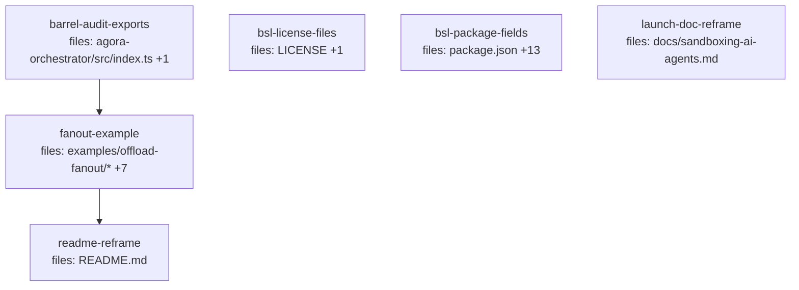

## Context

The fifth and final offload wave — the acceptance demo, the license, and the launch
framing — per the wave design at
`docs/superpowers/specs/2026-06-01-agora-offload-launch-design.md` and V1 spec §1.1
items 9–10, §7 (headline demo), §8 (BSL packaging). **Stacked on `offload-surface`
(PR #22)**: the demo uses the `agora orch` CLI + `OperationsApi` that wave shipped.

**Execution note:** tasks run **one at a time, sequentially** (another instance may
share the main tree). `depends_on` encodes ordering. Per-task gate runs BOTH
`typecheck` AND `test` for the affected package. Paths are repo-root-relative.

**Locked decisions (design §Locked):** BSL-1.1 (overrides the repo's FSL); both demo
forms (real-Docker `examples/offload-fanout` + a deterministic CI acceptance test);
the live container run is **operator-verified**, not a CI gate — the CI test is the
automated proof.

## Tasks

## Task: barrel-export audit primitives

```yaml
id: task-barrel-audit-exports
depends_on: []
files:
  - packages/agora-orchestrator/src/index.ts
  - packages/agora-orchestrator/test/barrel-audit-surface.test.ts
status: done
```

The example's `agora.config` and the CI acceptance test must wire an `AuditLog` +
`LocalAnchor` + a signer + run `verify`, but those live in `src/audit/*` and are NOT
barrel-exported (offload-surface added only `OperationsApi`/`assembleBundle`).
Additively export the audit primitives so consumers reach them from the package root.

## Implementation

```typescript
// packages/agora-orchestrator/src/index.ts — APPEND (do not reorder existing exports)
export { AuditLog } from './audit/audit-log.js';
export { LocalAnchor, S3ObjectLockAnchor } from './audit/anchor.js';
export type { S3LockClient } from './audit/anchor.js';
export { createLocalSigner, NoneSigner, verifyEd25519 } from './audit/signer.js';
export { verify } from './audit/verify.js';
// (Guarantee, AuditEntry/Row, AnchoredRoot, VerificationReport, AuditStore already
//  flow through `export * from './contracts/index.js'` — do NOT re-export them.)
```

```typescript
// test/barrel-audit-surface.test.ts
import { AuditLog, LocalAnchor, S3ObjectLockAnchor, createLocalSigner, NoneSigner, verify, verifyEd25519 } from '../src/index.js';
import { it, expect } from 'vitest';
it('exposes the audit primitives from the package root', () => {
  expect(typeof AuditLog).toBe('function');
  expect(typeof LocalAnchor).toBe('function');
  expect(typeof S3ObjectLockAnchor).toBe('function');
  expect(typeof createLocalSigner).toBe('function');
  expect(typeof verify).toBe('function');
  expect(typeof verifyEd25519).toBe('function');
  expect(NoneSigner).toBeDefined();
});
```

## Acceptance criteria

- `AuditLog`, `LocalAnchor`, `S3ObjectLockAnchor`, `createLocalSigner`, `NoneSigner`, `verifyEd25519`, `verify` are importable from `@quarry-systems/agora-orchestrator`.
- `S3LockClient` type is exported. No contract type already exported via the `contracts` splat is re-exported (no duplicate-export error).
- No existing barrel export removed or reordered.
- Whole orchestrator package typecheck + test green.

Test file: `packages/agora-orchestrator/test/barrel-audit-surface.test.ts`.

## Task: BSL license files

```yaml
id: task-bsl-license-files
depends_on: []
files:
  - LICENSE
  - LICENSING.md
status: done
is_wiring_task: true
```

Replace the repo's FSL-1.1-MIT `LICENSE` with a **Business Source License 1.1**
declaration (decision L1 / §8), and add a plain-language `LICENSING.md`. Packaging
artifact — the file content IS the deliverable.

**Filter-safe form (decided 2026-06-01):** reproducing the full verbatim BSL 1.1
boilerplate trips the content-reproduction filter, so `LICENSE` uses the standard BSL
**Parameters block + short Notice + incorporation-by-reference** to the canonical
terms — NOT the full copyrighted body. This is a legally-recognized BSL distribution
form; the project-specific grant is in-repo, the long boilerplate is referenced. The
`LICENSE` contains:
- A heading `Business Source License 1.1`.
- A **Parameters** block: Licensor **Quarry Systems**; Licensed Work **Agora (this
  repository), © 2026 Quarry Systems**; **Additional Use Grant** "You may make use of
  the Licensed Work, provided that you may not offer the Licensed Work, or a derivative
  of it, to third parties as a hosted or managed orchestration or agent-dispatch
  service."; **Change Date** 2030-06-01; **Change License** Apache License, Version 2.0.
- A short **Notice** stating BSL is not an Open Source license but the Licensed Work
  converts to the Change License on the Change Date.
- An incorporation line: the full BSL 1.1 terms at https://mariadb.com/bsl11/ are
  incorporated by reference and apply with the Parameters above; "Business Source
  License" is a trademark of MariaDB Corporation Ab.

`LICENSING.md` summarizes in plain language: source-available; self-host and build on
it freely; you may not resell it as a hosted/managed service; converts to Apache-2.0
on the Change Date; "source-available (BSL)" — not "open source"; the Change Date is
4 years from publish (2030-06-01 placeholder for v0.0.0); links to LICENSE + the
canonical terms.

## Acceptance criteria

- `LICENSE` declares BSL 1.1 with the Parameters block (Licensor=Quarry Systems, the verbatim hosted-service Additional Use Grant, Change Date 2030-06-01, Change License Apache-2.0), a short Notice, and the incorporation-by-reference line to https://mariadb.com/bsl11/. No FSL/"Functional Source License" text remains.
- `LICENSE` does NOT reproduce the full verbatim BSL terms (incorporation by reference instead) — filter-safe and legally standard.
- `LICENSING.md` exists with the plain-language summary + the "4 years from publish" Change-Date policy note + "source-available (BSL), not open source".
- Neither file claims "open source"; copy is consistent with §6.1 honesty.

Test file: none (packaging artifact; verified by inspection + the §8 acceptance review).

## Task: BSL license fields across package manifests

```yaml
id: task-bsl-package-fields
depends_on: []
files:
  - package.json
  - packages/agora-cli/package.json
  - packages/agora-client/package.json
  - packages/agora-core/package.json
  - packages/agora-mcp/package.json
  - packages/agora-orchestrator/package.json
  - packages/agora-providers-aws-creds/package.json
  - packages/agora-providers-fargate/package.json
  - packages/agora-providers-local-docker/package.json
  - packages/agora-runtime-claude-code/package.json
  - packages/agora-secret-store/package.json
  - packages/agora-storage-local/package.json
  - packages/agora-storage-s3/package.json
  - packages/agora-worker/package.json
status: done
is_wiring_task: true
```

Stamp the SPDX license identifier `"license": "BUSL-1.1"` into the root `package.json`
and every workspace package's `package.json` (§8). Mechanical metadata stamp across
the repo (hence `is_wiring_task` — the artifact is the field, spanning every package
subsystem). Do NOT touch `examples/*/package.json` here — the existing examples keep
their current manifests, and the new `examples/offload-fanout/package.json` is created
with the field by `task-fanout-example`.

Add a top-level `"license": "BUSL-1.1"` field to each listed `package.json` (preserve
all other fields, ordering, and formatting; insert near `version`/`private`). The root
`package.json` is `private: true` — it still gets the field for clarity.

## Acceptance criteria

- The root `package.json` and all 13 workspace package manifests carry `"license": "BUSL-1.1"`.
- No other field in any manifest is changed; JSON remains valid (a `node -e "require('./<pkg>/package.json')"` parse succeeds for each).
- `examples/*/package.json` are untouched by this task.

Test file: none (metadata stamp; verified by inspection + JSON-parse check in the §8 acceptance review).

## Task: offload-fanout example (demo + CI acceptance test)

```yaml
id: task-fanout-example
depends_on: [task-barrel-audit-exports]
files:
  - examples/offload-fanout/package.json
  - examples/offload-fanout/agora.config.mjs
  - examples/offload-fanout/plan.json
  - examples/offload-fanout/fixture/alpha.ts
  - examples/offload-fanout/fixture/beta.ts
  - examples/offload-fanout/fixture/shared.ts
  - examples/offload-fanout/src/index.ts
  - examples/offload-fanout/test/fanout.test.ts
  - examples/offload-fanout/README.md
status: done
```

The headline §7 demo as a self-contained example, modeled on
`examples/orchestrator-offload` (real-container, `pnpm start:env`). Ships BOTH forms
(design L2): a runnable real-Docker demo (`src/index.ts`) AND a deterministic,
no-Docker/no-LLM **CI acceptance test** (`test/fanout.test.ts`) — the latter is the
failing-test-first artifact and the automated proof of §7. `package.json` includes
`"license": "BUSL-1.1"` from creation. Big but cohesive (one example; S2 expected).

## Implementation

```jsonc
// plan.json — fan-out shape: per-file edits (disjoint locks fan out) + shared-file
// edit (serializes) + a verify item depending on all edits.
{
  "id": "fanout-1", "queue": "default",
  "items": [
    { "id": "edit-alpha",  "executor": "dispatch", "inputs": { "subagent": "code-edit", "workerInput": { "file": "alpha.ts" } }, "depends_on": [], "resourceLocks": ["fixture/alpha.ts"] },
    { "id": "edit-beta",   "executor": "dispatch", "inputs": { "subagent": "code-edit", "workerInput": { "file": "beta.ts" } },  "depends_on": [], "resourceLocks": ["fixture/beta.ts"] },
    { "id": "edit-shared", "executor": "dispatch", "inputs": { "subagent": "code-edit", "workerInput": { "file": "shared.ts" } },"depends_on": [], "resourceLocks": ["fixture/shared.ts"] },
    { "id": "verify",      "executor": "dispatch", "inputs": { "subagent": "verify" }, "depends_on": ["edit-alpha","edit-beta","edit-shared"], "resourceLocks": [] }
  ]
}
```

```typescript
// agora.config.mjs (sketch) — first real config; exercises CLI getClient + getOrchContext.
// default/client = wired AgoraClient (local-docker, LocalStorageProvider, LocalSecretStore,
//   ANTHROPIC_API_KEY as a deploy-time executor secret — never in a WorkItem).
// orch = { transport: new MailboxSubmissionTransport(new LocalDirMailbox(dir)),
//          storage: client.storage, anchor: new LocalAnchor(store),
//          verifySignature: (root,sig)=>verifyEd25519(root,sig,signer.publicKey),
//          runService: (signal) => serve({ orchestrator, transport, signal }) }
// orchestrator = new AgoraOrchestrator({ store, executors:{dispatch:new DispatchExecutor({client,target,workerImage,secrets})},
//   triggers:{manual:new ManualTrigger()}, queues:{default:{concurrency:2}}, auditLog: new AuditLog({store,signer,anchor}) })
```

```typescript
// test/fanout.test.ts — EXAMPLE-INTEGRATION smoke test (NO Docker / NO API key).
// DRY (LOAD-BEARING): the deep mechanics are ALREADY owned elsewhere and MUST NOT be
// re-implemented here — re-proving them is a DRY violation:
//   • lock fan-out / shared-lock serialize  -> pressure-runner.test.ts SCENARIO 1 (overlap() helper)
//   • audit verify / DB-tamper-fails / no-secret-in-export / guarantee tier
//        -> audit/acceptance.int.test.ts items 1-4  +  audit/bundle.test.ts
//   • OperationsApi.audit read + error paths -> operations-api.test.ts
// This test proves ONLY that the SHIPPED EXAMPLE ARTIFACTS compose and run:
import { AgoraOrchestrator, SqliteRunStateStore, ManualTrigger, OperationsApi,
         MailboxSubmissionTransport, LocalDirMailbox, AuditLog, LocalAnchor, NoneSigner } from '@quarry-systems/agora-orchestrator';
import { readFileSync } from 'node:fs';

it('plan.json is a valid fan-out Run (per-file resourceLocks; verify depends_on all edits)', () => {
  const plan = JSON.parse(readFileSync(new URL('../plan.json', import.meta.url), 'utf8'));
  // assert: 3 edit items each with one resourceLock; a verify item whose depends_on lists all edit ids
});
it('a fake-executor run over the EXAMPLE plan reaches completion and yields a verifiable bundle', async () => {
  // build a REAL AgoraOrchestrator (SqliteRunStateStore + AuditLog{store,NoneSigner,LocalAnchor})
  // with a FAKE deterministic executor (emits a refs-only manifest + a resultRef per item — NO Docker);
  // submitRun(the example's plan.json) -> tick to completion -> getAuditExport -> publish -> OperationsApi.audit.
  // assert: every item terminal (edits done, verify done); each edit item carries a resultRef;
  //         bundle.report.intact === true and report names the anchor + guarantee tier ('detect').
  // (This is an integration SMOKE over the example's real plan — NOT a re-test of lock/audit mechanics.)
});
```

```typescript
// src/index.ts (real-Docker demo, pnpm start:env) — sketch:
// load agora.config.mjs -> start runService(signal) -> OperationsApi.submit(plan) ->
// for await (rec of api.watch(runId)) renderTree(rec) -> fetch each result_ref patch ->
// const bundle = await api.audit(runId); print bundle.report (names anchor + guarantee tier).
// Honest outcome: non-zero exit if verify item failed or report.intact === false.
```

## Acceptance criteria

- `examples/offload-fanout/` exists with `package.json` (name `offload-fanout-example`, `"license": "BUSL-1.1"`, scripts `start`/`start:env`/`test: vitest run`/`typecheck`/`build` mirroring `orchestrator-offload` + `hello-world`), `agora.config.mjs` exporting `default`/`client` (AgoraClient) and `orch` (OrchContext), `plan.json` (the fan-out shape above), a `fixture/` workspace, `src/index.ts`, `README.md`, and `test/fanout.test.ts`.
- `agora.config.mjs` resolves the `ANTHROPIC_API_KEY` as a deploy-time executor secret (never in a WorkItem); concurrency ≥ 2. It is **import-safe**: it does NOT throw at module load when `ANTHROPIC_API_KEY` is absent (the live run checks the key in `src/index.ts`), so `typecheck`/CI can load it.
- `test/fanout.test.ts` (vitest, no Docker/API key) is an **example-integration smoke test**, NOT a re-test of mechanics. It proves: (a) `plan.json` is a valid fan-out Run (per-file `resourceLocks`; verify `depends_on` all edits); (b) a fake-executor run over the example's plan reaches completion with a `result_ref` per edit and an audit bundle whose `report.intact===true` and that **names the guarantee tier**. It does NOT duplicate lock-mechanics (owned by `pressure-runner.test.ts` SCENARIO 1) or audit verify/tamper/no-secret internals (owned by `audit/acceptance.int.test.ts` 1-4 + `audit/bundle.test.ts` + `operations-api.test.ts`) — a code comment cites those.
- `pnpm --filter offload-fanout-example typecheck` AND `pnpm --filter offload-fanout-example test` both pass.
- `src/index.ts` typechecks and is the runnable real-Docker demo (live run is operator-verified, not asserted here); README shows the `agora orch serve|submit|watch|audit` flow.

Test file: `examples/offload-fanout/test/fanout.test.ts`.

## Task: README reframe

```yaml
id: task-readme-reframe
depends_on: [task-fanout-example]
files:
  - README.md
status: done
is_wiring_task: true
```

Reframe the top of `README.md` to lead with the security / deterministic /
tamper-evident-audit edge (§0.1 thesis) and **"source-available (BSL)"**, and add an
**Offload** section pointing at `examples/offload-fanout` with the `agora orch` command
flow (decision L5). Keep the existing, still-accurate SDK/dispatch/provider-seam
content below the new framing. Docs artifact — prose, not code (hence `is_wiring_task`).

## Acceptance criteria

- The README opening leads with the offload edge (secure, deterministic, tamper-evident auditable execution) and states **"source-available (BSL)"** (never "open source").
- An **Offload** section references `examples/offload-fanout` and shows `agora orch serve | submit plan.json | watch <id> | audit <id>`.
- Copy honors §6.1 honesty: **"compliance-ready"** (never "compliant"/"certified"); **"tamper-evident"** only at `external-immutable` (else "tamper-detecting"); no "reproducible AI output".
- The pre-existing SDK/Hello-World/provider content is retained below the new framing (not deleted).

Test file: none (docs; verified by inspection against the §6.1 honesty checklist).

## Task: launch write-up reframe

```yaml
id: task-launch-doc-reframe
depends_on: []
files:
  - docs/sandboxing-ai-agents.md
status: done
is_wiring_task: true
```

**ADDITIVE, minimal.** The existing draft (2026-05-27) currently contains NO
license/"open-source"/"compliant"/"tamper-evident"/"reproducible" terms (verified by
grep) and its "v0.1 / policy-engine-not-shipped" honesty is still accurate
(effect-tier enforcement is V1-deferred, §1.2). So this task ADDS the source-available
framing and PRESERVES the existing honest security narrative — it does NOT rewrite the
draft into the offload-orchestration story (out of scope) and introduces no new claims
beyond what's earned. Docs artifact; no code dep.

## Acceptance criteria

- A **"source-available (BSL)"** line is added where licensing/openness is naturally introduced (never "open source").
- Any newly-added copy honors §6.1: **"compliance-ready"** (never "compliant"/"certified"); **"tamper-evident"** only at `external-immutable` (else "tamper-detecting"); no claim of reproducible AI *output*.
- The draft's existing structure, the v0.1 security narrative, and the honest "What's *not* done yet" section are PRESERVED (no offload-narrative rewrite; no new unearned claims).

Test file: none (docs; verified by inspection against the §6.1 honesty checklist).
