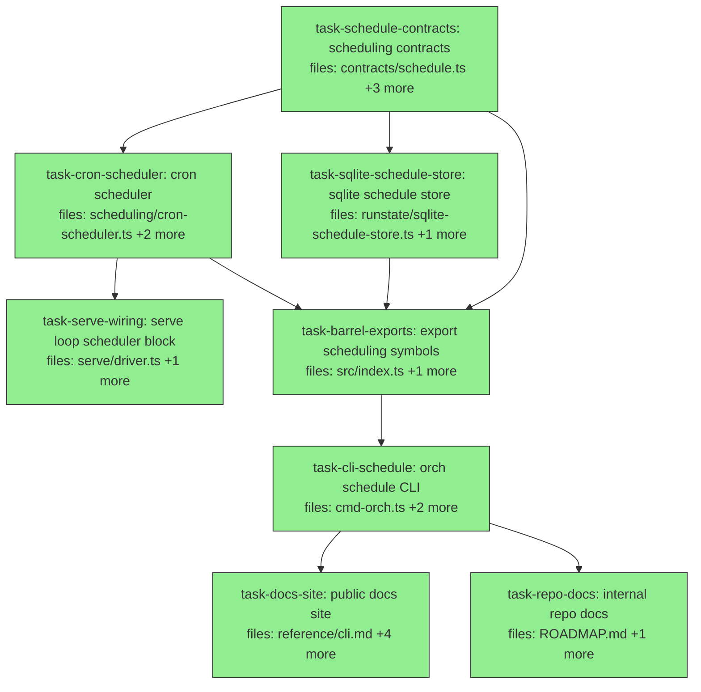

## Context

Implements the V1.1 cron-scheduling feature designed in
[`2026-06-02-agora-cron-trigger-design.md`](../specs/2026-06-02-agora-cron-trigger-design.md).

Per that spec's **D1**, cron is a Run *producer*, not a `Trigger` extension: a
`CronScheduler` that `serve` polls each tick emits submissions through the
existing `SubmissionTransport.submit()` inbox, after which the unchanged
`pollInbox → submitRun → ManualTrigger → tick` pipeline runs. The `Trigger` seam
and the engine are untouched.

Decomposition notes:
- The contract surface (`Schedule`, `ScheduleStore`) is a root task; the two
  implementations (`CronScheduler`, `SqliteScheduleStore`) depend on it and run
  in parallel (disjoint files).
- `SqliteScheduleStore` owns its own `schedules` table via
  `CREATE TABLE IF NOT EXISTS`, opening its own `better-sqlite3` connection to the
  same DB path as the run-state store (both WAL; separate tables → no contention).
  This keeps the existing `runstate/sqlite.ts` untouched and the migration purely
  additive (spec §5).
- `cron-parser` is introduced as a dependency by `task-cron-scheduler` (only that
  task touches `package.json`); UTC-only per spec §7 keeps the date math simple.
- Catch-up coalescing + deterministic per-slot runId (`<id>@<slotIso>`) live in
  the scheduler; dedup is free via `submitRun`'s existing idempotency guard
  (spec §4).
- Scheduling is an operator action → CLI only, no MCP tool (spec §0.2), so no
  task touches any `mcp` surface and the CI privilege-allowlist check is
  unaffected.
- **Test convention (audited against the repo):** tests use `vitest`
  (`import { describe, it, expect } from 'vitest'`) and define fakes **locally
  per test file** — the repo does not hoist transport/orchestrator/store fakes
  into a shared module (`test/support/` holds only `make-shape.ts`;
  `makeFakeTransport` is redefined locally in both `serve-driver.test.ts` and
  `cmd-orch.test.ts`). New test files follow suit: `serve-scheduler.test.ts`
  defines a submit-recording transport locally and drives a **real**
  `AgoraOrchestrator` (`SqliteRunStateStore` + `ManualTrigger` +
  `immediateExecutor` fixture); the CLI test uses the `new Command()` +
  `attachOrchCmd` + `parseAsync(..., { from: 'user' })` harness with a
  `makeOrchContext`-style fake. SQLite stores cast rows to an explicit named
  shape (e.g. `as ScheduleRow[]`), never `any`, matching `sqlite.ts`.

Documentation tasks (`task-docs-site`, `task-repo-docs`) both depend on
`task-cli-schedule` (the last behaviour task) so the docs describe the complete
shipped surface, including the CLI verbs. They are `is_wiring_task: true`: a
markdown edit has no unit test, so the H7 impl+failing-test requirement does not
apply; verification is the docs-site build / grep checks named in each task.

**Out of DAG — Knowledge-vault capture.** agora is its own git repo; the
Knowledge vault is a *separate* repo, and vault pages are authored via the vault
MCP tools under a frontmatter contract with agent-draft attribution — a
`dag-implementer` (which works in the agora repo under TDD) cannot produce one
cleanly. So recording the cron design as a vault `decision`/`synthesis` page is a
post-merge step done with the vault tools, **not** a task here. Tracked so it is
not forgotten.

**Heads-up for `task-repo-docs`:** `ROADMAP.md` has uncommitted working-tree
edits from the Tier-1 MinIO work at plan-authoring time. Commit or stash those
before this task runs so the cron promotion lands as a clean, separable diff.

DAG status: 8 tasks · 8 done · 0 running · 0 failed · 0 skipped · 0 pending — COMPLETE

| id | depends_on | status |
|---|---|---|
| task-schedule-contracts | — | ✓ done (b04955b) |
| task-cron-scheduler | task-schedule-contracts | ✓ done (988f0c1) |
| task-sqlite-schedule-store | task-schedule-contracts | ✓ done (eb86ada) |
| task-serve-wiring | task-cron-scheduler | ✓ done (fb9a7f4) |
| task-barrel-exports | task-schedule-contracts, task-cron-scheduler, task-sqlite-schedule-store | ✓ done (fb9a7f4) |
| task-cli-schedule | task-barrel-exports | ✓ done (8790341) |
| task-docs-site | task-cli-schedule | ✓ done (e0c5ab0) |
| task-repo-docs | task-cli-schedule | ✓ done (c4774fb) |

## Tasks

## Task: scheduling contracts

```yaml
id: task-schedule-contracts
depends_on: []
files:
  - packages/agora-orchestrator/src/contracts/schedule.ts
  - packages/agora-orchestrator/src/contracts/schedule-store.ts
  - packages/agora-orchestrator/src/contracts/index.ts
  - packages/agora-orchestrator/test/schedule-contracts.test.ts
status: done
```

Define the contract surface for cron scheduling: the `Schedule` shape (cron
expression, Run template, bookkeeping) and the `ScheduleStore` seam (persist /
query / advance). Export both through the existing contracts barrel so they flow
out of the package entry via its `export * from './contracts/index.js'`. Drives
spec §1.2.

## Implementation

```typescript
// packages/agora-orchestrator/src/contracts/schedule.ts
import type { Run } from './types.js';

/** A recurring submission source: a cron expression + a Run template. */
export interface Schedule {
  id: string;            // stable, user-chosen — e.g. "nightly-audit"
  cronExpr: string;      // standard 5-field cron (min hour dom mon dow), UTC
  run: Run;              // template; runId is rewritten per-fire to `${id}@${slotIso}`
  actor: string;         // identity stamped on every emitted submission
  lastFiredAt?: string;  // ISO-8601; undefined until first fire
  nextDueAt: string;     // ISO-8601; persisted for cheap due-checks
}
```

```typescript
// packages/agora-orchestrator/src/contracts/schedule-store.ts
import type { Schedule } from './schedule.js';

/** Persistence seam for schedules. Sole writer at runtime: serve. */
export interface ScheduleStore {
  due(nowMs: number): Schedule[];                                   // nextDueAt <= now
  markFired(id: string, firedAtMs: number, nextDueAt: string): void;
  upsert(s: Schedule): void;
  remove(id: string): void;
  list(): Schedule[];
}
```

Barrel addition (`contracts/index.ts`): append
`export * from './schedule.js';` and `export * from './schedule-store.js';`.

```typescript
// packages/agora-orchestrator/test/schedule-contracts.test.ts
import { it, expect } from 'vitest';
import type { Schedule, ScheduleStore } from '../src/contracts/index.js';

it("ScheduleStore is implementable and Schedule round-trips through it", () => {
  const rows = new Map<string, Schedule>();
  const store: ScheduleStore = {
    due: () => [],
    markFired: () => {},
    upsert: (s) => { rows.set(s.id, s); },
    remove: (id) => { rows.delete(id); },
    list: () => [...rows.values()],
  };
  const s: Schedule = { id: "nightly", cronExpr: "0 2 * * *", run: { id: "r", items: [] } as unknown as Schedule["run"], actor: "human:test", nextDueAt: "2026-06-03T02:00:00Z" };
  store.upsert(s);
  expect(store.list()).toEqual([s]);
});
```

## Acceptance criteria

- `Schedule` and `ScheduleStore` are importable from
  `@quarry-systems/agora-orchestrator` (via the contracts barrel → package entry).
- A minimal in-memory object satisfies `ScheduleStore` and a `Schedule` upserted
  then listed compares equal.
- `tsc` passes with no new type errors; the existing `barrel-surface.test.ts`
  still passes.

Test file: `packages/agora-orchestrator/test/schedule-contracts.test.ts`.

## Task: cron scheduler

```yaml
id: task-cron-scheduler
depends_on: [task-schedule-contracts]
files:
  - packages/agora-orchestrator/src/scheduling/cron-scheduler.ts
  - packages/agora-orchestrator/package.json
  - packages/agora-orchestrator/test/cron-scheduler.test.ts
status: done
```

Implement the `CronScheduler` (the Run producer `serve` polls) plus a standalone
`nextDueAfter` helper for computing the next slot from a cron expression. Adds
the `cron-parser` dependency to this package's `package.json` (the only task that
touches it; `pnpm-lock.yaml` regenerates as a side effect). Implements the
catch-up coalescing and deterministic per-slot runId of spec §4.

## Implementation

```typescript
// packages/agora-orchestrator/src/scheduling/cron-scheduler.ts
import parser from 'cron-parser';
import type { Schedule, ScheduleStore } from '../contracts/index.js';
import type { SubmissionEnvelope } from '../contracts/index.js';

/** Next scheduled slot strictly after `afterMs`, as an ISO-8601 string (UTC). */
export function nextDueAfter(cronExpr: string, afterMs: number): string {
  const it = parser.parseExpression(cronExpr, { currentDate: new Date(afterMs), tz: 'UTC' });
  return it.next().toDate().toISOString();
}

export class CronScheduler {
  constructor(private readonly store: ScheduleStore, private readonly now: () => number) {}

  /** For each due schedule: emit ONE envelope for the most-recent missed slot,
   *  then advance bookkeeping. Coalesces backlog → single catch-up (spec §4.2). */
  dueSubmissions(): SubmissionEnvelope[] {
    const nowMs = this.now();
    const out: SubmissionEnvelope[] = [];
    for (const s of this.store.due(nowMs)) {
      const slotIso = this.mostRecentSlotAtOrBefore(s.cronExpr, nowMs);  // <= now
      out.push({
        run: { ...s.run, id: `${s.id}@${slotIso}` },   // deterministic runId → free dedup
        actor: s.actor,
        submittedAt: new Date(nowMs).toISOString(),
      });
      this.store.markFired(s.id, nowMs, nextDueAfter(s.cronExpr, nowMs));
    }
    return out;
  }

  private mostRecentSlotAtOrBefore(cronExpr: string, nowMs: number): string {
    const it = parser.parseExpression(cronExpr, { currentDate: new Date(nowMs), tz: 'UTC' });
    return it.prev().toDate().toISOString();
  }
}
```

`package.json`: add `"cron-parser": "^4"` to `dependencies` so the import above
resolves.

```typescript
// packages/agora-orchestrator/test/cron-scheduler.test.ts
import { it, expect } from 'vitest';
import { CronScheduler, nextDueAfter } from '../src/scheduling/cron-scheduler.js';
import type { Schedule, ScheduleStore } from '../src/contracts/index.js';

it("coalesces a multi-slot backlog into ONE envelope for the most recent missed slot", () => {
  // hourly schedule; 'now' is 04:01 after downtime across 02:00 and 03:00
  const due: Schedule[] = [{ id: "nightly", cronExpr: "0 * * * *", run: { id: "tmpl", items: [] } as unknown as Schedule["run"], actor: "human:test", nextDueAt: "2026-06-03T02:00:00Z" }];
  const fired: Array<[string, string]> = [];
  const store: ScheduleStore = { due: () => due, markFired: (id, _at, next) => fired.push([id, next]), upsert: () => {}, remove: () => {}, list: () => due };
  const now = Date.parse("2026-06-03T04:01:00Z");
  const envs = new CronScheduler(store, () => now).dueSubmissions();

  expect(envs).toHaveLength(1);
  expect(envs[0].run.id).toBe("nightly@2026-06-03T04:00:00.000Z");   // most recent slot, deterministic id
  expect(fired[0][1]).toBe("2026-06-03T05:00:00.000Z");              // next future slot
});
```

## Acceptance criteria

- `nextDueAfter("0 2 * * *", Date.parse("2026-06-03T03:00:00Z"))` returns the
  next 02:00 UTC slot (`2026-06-04T02:00:00.000Z`).
- A due schedule whose slots were missed across downtime produces exactly **one**
  envelope, for the most-recent slot at-or-before `now`.
- The emitted `run.id` is deterministic: `${schedule.id}@${slotIso}` (so a
  re-emit of the same slot is byte-identical).
- `markFired` is called once per due schedule with `nextDueAt` = the next future
  slot.
- `cron-parser` resolves (declared in this package's `package.json`); `tsc` and
  the suite pass.

Test file: `packages/agora-orchestrator/test/cron-scheduler.test.ts`.

## Task: sqlite schedule store

```yaml
id: task-sqlite-schedule-store
depends_on: [task-schedule-contracts]
files:
  - packages/agora-orchestrator/src/runstate/sqlite-schedule-store.ts
  - packages/agora-orchestrator/test/runstate-schedule-store.test.ts
status: done
```

Implement `SqliteScheduleStore implements ScheduleStore`, backed by a new
`schedules` table created with `CREATE TABLE IF NOT EXISTS` (additive migration,
spec §5). Mirrors the existing `SqliteRunStateStore` constructor pattern
(`path = ':memory:'`, WAL pragma) and uses the already-declared `better-sqlite3`
dependency. Independent of the scheduler task (disjoint files) → runs in parallel.

## Implementation

```typescript
// packages/agora-orchestrator/src/runstate/sqlite-schedule-store.ts
import Database from 'better-sqlite3';
import type { Schedule, ScheduleStore } from '../contracts/index.js';

const SCHEMA = `
CREATE TABLE IF NOT EXISTS schedules (
  id            TEXT PRIMARY KEY,
  cron_expr     TEXT NOT NULL,
  run_template  TEXT NOT NULL,   -- JSON Run
  actor         TEXT NOT NULL,
  last_fired_at TEXT,
  next_due_at   TEXT NOT NULL
);
CREATE INDEX IF NOT EXISTS idx_schedules_due ON schedules(next_due_at);`;

// Explicit row shape (repo convention: cast to a named shape, not `any` — see sqlite.ts)
interface ScheduleRow { id: string; cron_expr: string; run_template: string; actor: string; last_fired_at: string | null; next_due_at: string; }

export class SqliteScheduleStore implements ScheduleStore {
  private db: Database.Database;
  constructor(path = ':memory:') {
    this.db = new Database(path);
    this.db.pragma('journal_mode = WAL');
    this.db.exec(SCHEMA);
  }
  upsert(s: Schedule): void {
    this.db.prepare(
      `INSERT INTO schedules(id,cron_expr,run_template,actor,last_fired_at,next_due_at)
       VALUES(@id,@cron,@run,@actor,@last,@next)
       ON CONFLICT(id) DO UPDATE SET cron_expr=@cron,run_template=@run,actor=@actor,next_due_at=@next`,
    ).run({ id: s.id, cron: s.cronExpr, run: JSON.stringify(s.run), actor: s.actor, last: s.lastFiredAt ?? null, next: s.nextDueAt });
  }
  due(nowMs: number): Schedule[] {
    const iso = new Date(nowMs).toISOString();
    return (this.db.prepare('SELECT * FROM schedules WHERE next_due_at <= ?').all(iso) as ScheduleRow[]).map(this.row);
  }
  markFired(id: string, firedAtMs: number, nextDueAt: string): void {
    this.db.prepare('UPDATE schedules SET last_fired_at=?, next_due_at=? WHERE id=?')
      .run(new Date(firedAtMs).toISOString(), nextDueAt, id);
  }
  remove(id: string): void { this.db.prepare('DELETE FROM schedules WHERE id=?').run(id); }
  list(): Schedule[] { return (this.db.prepare('SELECT * FROM schedules ORDER BY id').all() as ScheduleRow[]).map(this.row); }
  private row = (r: ScheduleRow): Schedule => ({ id: r.id, cronExpr: r.cron_expr, run: JSON.parse(r.run_template), actor: r.actor, lastFiredAt: r.last_fired_at ?? undefined, nextDueAt: r.next_due_at });
}
```

```typescript
// packages/agora-orchestrator/test/runstate-schedule-store.test.ts
import { describe, it, expect } from 'vitest';
import { SqliteScheduleStore } from '../src/runstate/sqlite-schedule-store.js';
import type { Schedule } from '../src/contracts/index.js';

const mk = (id: string, next: string): Schedule => ({ id, cronExpr: "0 2 * * *", run: { id, items: [] } as unknown as Schedule["run"], actor: "human:test", nextDueAt: next });

it("returns only schedules whose next_due_at is at or before now", () => {
  const store = new SqliteScheduleStore();
  store.upsert(mk("past", "2026-06-03T01:00:00.000Z"));
  store.upsert(mk("future", "2026-06-03T09:00:00.000Z"));
  const due = store.due(Date.parse("2026-06-03T02:00:00Z")).map((s) => s.id);
  expect(due).toEqual(["past"]);
});
```

## Acceptance criteria

- A fresh `SqliteScheduleStore(':memory:')` creates the `schedules` table
  idempotently (constructing twice against the same file does not error).
- `upsert` then `list` round-trips a `Schedule` including a deserialized `run`
  template; re-`upsert` of the same id updates rather than duplicates.
- `due(nowMs)` returns exactly the schedules with `next_due_at <= now`.
- `markFired` updates `last_fired_at` and `next_due_at`; `remove` deletes by id
  and is a no-op when absent.

Test file: `packages/agora-orchestrator/test/runstate-schedule-store.test.ts`.

## Task: serve loop scheduler block

```yaml
id: task-serve-wiring
depends_on: [task-cron-scheduler]
files:
  - packages/agora-orchestrator/src/serve/driver.ts
  - packages/agora-orchestrator/test/serve-scheduler.test.ts
status: done
```

Wire the scheduler into the `serve` loop: add an optional `scheduler` field to
`ServeOptions` and, each iteration before `tick()`, drain
`scheduler.dueSubmissions()` into `transport.submit()`. Mirrors the existing
cancel-control block at `driver.ts:53`. When `scheduler` is omitted, behaviour is
identical to V1 (spec §3).

## Implementation

```typescript
// packages/agora-orchestrator/src/serve/driver.ts — ServeOptions gains:
import type { CronScheduler } from '../scheduling/cron-scheduler.js';
export interface ServeOptions {
  // ...existing fields...
  scheduler?: CronScheduler;   // omit → V1 behaviour, no scheduling
}

// ...inside the while(!opts.signal?.aborted) loop body, before opts.orchestrator.tick(queue):
if (opts.scheduler) {
  for (const env of opts.scheduler.dueSubmissions()) {
    try { await opts.transport.submit(env); }   // same method a client uses
    catch (err) { opts.onError?.(err); }
  }
}
```

```typescript
// packages/agora-orchestrator/test/serve-scheduler.test.ts
import { describe, it, expect, vi } from 'vitest';
import { AgoraOrchestrator, SqliteRunStateStore, ManualTrigger } from '../src/index.js';
import type { SubmissionEnvelope, SubmissionTransport, OutboxRecord } from '../src/index.js';
import { serve } from '../src/serve/driver.js';
import { immediateExecutor } from './fixtures/executors.js';

// Local per-file fake (repo convention — see serve-driver.test.ts). Records submit() calls.
function makeSubmitRecordingTransport(): SubmissionTransport & { submitted: string[] } {
  const submitted: string[] = [];
  return {
    submitted,
    submit: async (e: SubmissionEnvelope) => { submitted.push(e.run.id); return e.run.id; },
    pollInbox: async () => [],
    ack: async () => {},
    deadLetter: async () => {},
    publish: async (_r: OutboxRecord) => {},
    readOutbox: async () => [],
  };
}

describe('serve + scheduler', () => {
  it('submits each due envelope through the transport for its due tick', async () => {
    const env: SubmissionEnvelope = { run: { id: 'nightly@slot', items: [] } as SubmissionEnvelope['run'], actor: 'human:test', submittedAt: '2026-06-03T04:00:00.000Z' };
    const scheduler = { dueSubmissions: vi.fn().mockReturnValueOnce([env]).mockReturnValue([]) };
    const transport = makeSubmitRecordingTransport();
    const orchestrator = new AgoraOrchestrator({ store: new SqliteRunStateStore(), executors: { immediate: immediateExecutor }, triggers: { manual: new ManualTrigger() }, queues: { default: { concurrency: 1 } } });
    const ac = new AbortController();
    const loop = serve({ orchestrator, transport, scheduler: scheduler as unknown as never, signal: ac.signal, tickIntervalMs: 1 });
    await new Promise((r) => setTimeout(r, 5)); ac.abort(); await loop;
    expect(transport.submitted).toContain('nightly@slot');
  });
});
```

## Acceptance criteria

- With a `scheduler` returning one envelope, `serve` calls `transport.submit`
  with that envelope exactly once for that due tick.
- A `scheduler.dueSubmissions()` that throws is caught via `onError` and does not
  crash the loop (matches the existing control-block error posture).
- Omitting `scheduler` leaves V1 behaviour unchanged: existing
  `serve-driver.test.ts` and `serve-control.test.ts` still pass.

Test file: `packages/agora-orchestrator/test/serve-scheduler.test.ts`.

## Task: export scheduling symbols

```yaml
id: task-barrel-exports
depends_on: [task-schedule-contracts, task-cron-scheduler, task-sqlite-schedule-store]
files:
  - packages/agora-orchestrator/src/index.ts
  - packages/agora-orchestrator/test/barrel-schedule-surface.test.ts
status: done
is_wiring_task: true
```

Expose the new runtime symbols from the package entry so downstream packages (the
CLI) can import them. The contracts already flow out via the existing
`export * from './contracts/index.js'`; this task adds the two classes and the
helper. Pure registration — no new logic.

```typescript
// packages/agora-orchestrator/src/index.ts — append:
export { CronScheduler, nextDueAfter } from './scheduling/cron-scheduler.js';
export { SqliteScheduleStore } from './runstate/sqlite-schedule-store.js';
```

## Acceptance criteria

- `CronScheduler`, `nextDueAfter`, and `SqliteScheduleStore` are importable from
  `@quarry-systems/agora-orchestrator` (package entry).
- `Schedule` and `ScheduleStore` types remain importable from the same entry
  (via the contracts re-export).
- `tsc` passes; a surface test asserts the three new symbols are defined on the
  package entry.

Test file: `packages/agora-orchestrator/test/barrel-schedule-surface.test.ts`.

## Task: orch schedule CLI

```yaml
id: task-cli-schedule
depends_on: [task-barrel-exports]
files:
  - packages/agora-cli/src/cmd-orch.ts
  - packages/agora-cli/test/cmd-orch-schedule.test.ts
  - packages/agora-cli/test/cmd-orch.test.ts
status: done
```

Add the `agora orch schedule add|list|rm` operator verbs (commander) and a
config-owned `scheduleStore` on `OrchContext` (mirroring the existing
`runService`/`transport` wiring). `add` validates the cron expression up front and
computes the first `nextDueAt` via `nextDueAfter`; re-running `add` with the same
id is an idempotent update; `rm` is a no-op when absent (spec §6). CLI only — no
MCP surface.

## Implementation

```typescript
// packages/agora-cli/src/cmd-orch.ts
import { nextDueAfter } from '@quarry-systems/agora-orchestrator';
import type { ScheduleStore, Schedule } from '@quarry-systems/agora-orchestrator';

export interface OrchContext {
  // ...existing fields...
  scheduleStore?: ScheduleStore;   // config-owned; required for `schedule` verbs
}

// inside attachOrchCmd, after the existing verbs:
const sched = o.command('schedule').description('Manage recurring submissions');

sched.command('add').requiredOption('--id <id>').requiredOption('--cron <expr>')
  .requiredOption('--plan <plan.json>').option('--actor <id>')
  .action(async (opts) => {
    const oc = await ctx.getOrchContext();
    if (!oc.scheduleStore) throw new Error('agora orch schedule: agora.config `orch` export provides no scheduleStore');
    const nextDueAt = nextDueAfter(opts.cron, Date.now());   // also validates the expr (throws on bad cron)
    const run = JSON.parse(await readFile(opts.plan, 'utf8'));
    const s: Schedule = { id: opts.id, cronExpr: opts.cron, run, actor: resolveActor(opts.actor), nextDueAt };
    oc.scheduleStore.upsert(s);
    console.log(`schedule '${opts.id}' next due ${nextDueAt}`);
  });

sched.command('list').action(async () => {
  const oc = await ctx.getOrchContext();
  for (const s of oc.scheduleStore?.list() ?? []) console.log(`${s.id}\t${s.cronExpr}\tlast=${s.lastFiredAt ?? '-'}\tnext=${s.nextDueAt}`);
});

sched.command('rm').requiredOption('--id <id>').action(async (opts) => {
  const oc = await ctx.getOrchContext();
  oc.scheduleStore?.remove(opts.id);
  console.log(`schedule '${opts.id}' removed`);
});
```

```typescript
// packages/agora-cli/test/cmd-orch-schedule.test.ts
import { describe, it, expect, beforeEach, afterEach } from 'vitest';
import { Command } from 'commander';
import { writeFile, mkdtemp, rm } from 'node:fs/promises';
import { join } from 'node:path';
import { tmpdir } from 'node:os';
import { attachOrchCmd, type OrchContext } from '../src/cmd-orch.js';
import type { CliContext } from '../src/index.js';
import type { Schedule, ScheduleStore } from '@quarry-systems/agora-orchestrator';

// Local per-file fakes (repo convention — see cmd-orch.test.ts).
function makeMemoryScheduleStore(): ScheduleStore & { rows: Map<string, Schedule> } {
  const rows = new Map<string, Schedule>();
  return { rows, upsert: (s) => rows.set(s.id, s), list: () => [...rows.values()], remove: (id) => { rows.delete(id); }, due: () => [], markFired: () => {} };
}
const makeCtx = (oc: OrchContext): CliContext => ({ getOrchContext: async () => oc } as unknown as CliContext);

describe('attachOrchCmd schedule', () => {
  let dir: string, planPath: string;
  beforeEach(async () => { dir = await mkdtemp(join(tmpdir(), 'agora-')); planPath = join(dir, 'plan.json'); await writeFile(planPath, JSON.stringify({ id: 'r', items: [] })); });
  afterEach(async () => { await rm(dir, { recursive: true, force: true }); });

  it('rejects an invalid cron expression before writing', async () => {
    const store = makeMemoryScheduleStore();
    const program = new Command();
    attachOrchCmd(program, makeCtx({ scheduleStore: store } as OrchContext));
    await expect(program.parseAsync(['orch', 'schedule', 'add', '--id', 'x', '--cron', 'nope', '--plan', planPath], { from: 'user' })).rejects.toThrow();
    expect(store.list()).toHaveLength(0);   // no write on invalid cron
  });

  it('add upserts with a computed nextDueAt', async () => {
    const store = makeMemoryScheduleStore();
    const program = new Command();
    attachOrchCmd(program, makeCtx({ scheduleStore: store } as OrchContext));
    await program.parseAsync(['orch', 'schedule', 'add', '--id', 'nightly', '--cron', '0 2 * * *', '--plan', planPath], { from: 'user' });
    expect(store.list()).toHaveLength(1);
    expect(store.list()[0].nextDueAt).toMatch(/T02:00:00\.000Z$/);
  });
});
```

## Acceptance criteria

- `orch schedule add --id X --cron "<expr>" --plan p.json` upserts a `Schedule`
  with `nextDueAt` computed from the cron expression and the plan loaded as the
  Run template.
- An invalid cron expression makes `add` exit non-zero (validation before any
  store write).
- `orch schedule list` prints id, cron, last-fired, next-due for each schedule.
- `orch schedule rm --id X` removes by id and is a no-op (no error) when X is
  absent.
- A `schedule` verb invoked with no configured `scheduleStore` fails with a clear
  message (matches the `serve`-without-`runService` posture).
- Existing `cmd-orch.test.ts` still passes (additions are purely additive).

Test file: `packages/agora-cli/test/cmd-orch-schedule.test.ts`.

## Task: public docs site

```yaml
id: task-docs-site
depends_on: [task-cli-schedule]
files:
  - docs-site/src/content/docs/reference/cli.md
  - docs-site/src/content/docs/reference/config.md
  - docs-site/src/content/docs/how-to/schedule-recurring-runs.md
  - docs-site/src/content/docs/explanation/how-offload-runs.md
  - docs-site/src/content/docs/explanation/project-status-roadmap.md
status: done
is_wiring_task: true
```

Document the cron feature across the published Diátaxis docs (Astro/Starlight
site). One author keeps the cross-references between the four pages consistent.
A documentation task, not code — verification is the docs-site build, not a unit
test (hence `is_wiring_task: true`).

Surfaces to update:
- **`reference/cli.md`** — add `schedule add | list | rm` rows to the existing
  `## agora orch` verb table (the table that currently documents `serve` at
  ~line 100), including each verb's options and the "no `scheduleStore`
  configured" error behaviour.
- **`reference/config.md`** — document the config-owned `scheduleStore` on the
  `orch` export (mirrors how `runService`/`transport` are documented).
- **`how-to/schedule-recurring-runs.md`** (NEW) — task-oriented page: wire a
  `scheduleStore`, `agora orch schedule add` a nightly run, verify it fires.
  Frontmatter: `title` + `description` (match the existing how-to pages).
- **`explanation/how-offload-runs.md`** — add a short "Recurring submission"
  subsection: cron is a producer feeding the same inbox; catch-up coalescing;
  deterministic per-slot runId (cite the design spec).
- **`explanation/project-status-roadmap.md`** — move `cron` from *Next* to *Now*
  (this page mirrors `ROADMAP.md`; keep them consistent — `ROADMAP.md` itself is
  owned by `task-repo-docs`).

## Acceptance criteria

- `reference/cli.md` lists `schedule add`, `schedule list`, and `schedule rm`
  with options and exit behaviour, under the `agora orch` section.
- A new `how-to/schedule-recurring-runs.md` exists with valid Starlight
  frontmatter (`title`, `description`) and walks add → fire → verify.
- `explanation/how-offload-runs.md` describes cron as an inbox producer with
  catch-up coalescing, linking the design spec.
- `explanation/project-status-roadmap.md` shows `cron` under *Now*, not *Next*.
- `pnpm --filter docs-site build` (Astro build) succeeds with no broken internal
  links or frontmatter errors.

Verification: `pnpm --filter docs-site build` (no unit test file — see
`is_wiring_task`).

## Task: internal repo docs

```yaml
id: task-repo-docs
depends_on: [task-cli-schedule]
files:
  - ROADMAP.md
  - CHANGELOG.md
status: done
is_wiring_task: true
```

Update the repo-root internal docs to reflect the shipped feature. A
documentation task — verification is content presence (grep), not a unit test
(hence `is_wiring_task: true`). See the plan Context heads-up: commit/stash the
pre-existing `ROADMAP.md` working-tree edits before this runs.

Surfaces to update:
- **`ROADMAP.md`** — move the `cron` trigger bullet from *Next — V1.1* to
  *Now*, and remove the "first item to pull into V1.1" framing now that it has
  shipped. Keep the rest of the *Next* list intact.
- **`CHANGELOG.md`** — add a bullet under `## [Unreleased]` → `### Added`
  describing `agora orch schedule add|list|rm` and recurring submission via the
  cron scheduler (Keep a Changelog format, matching the existing 0.1.0 entries).

## Acceptance criteria

- `ROADMAP.md` lists `cron` under the *Now* section; the *Next — V1.1* section no
  longer contains the cron bullet nor the "first item to pull" sentence.
- `CHANGELOG.md` has an `### Added` bullet under `## [Unreleased]` naming the
  `agora orch schedule` verbs and recurring/cron submission.
- Both edits are additive and leave all other roadmap/changelog content unchanged.

Verification: `grep -n "cron" ROADMAP.md CHANGELOG.md` shows the new entries in
the expected sections (no unit test file — see `is_wiring_task`).
