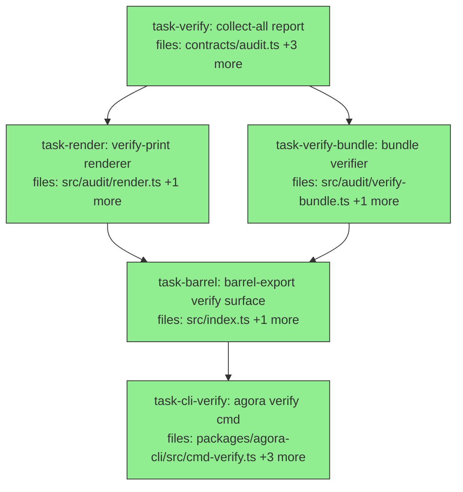

## Context

Drives `wikis/agora/specs/spec-agora-verify-print-design.md` (the demo brainstorming spec).
Goal: a human-readable `agora verify <bundle.json>` print — the demo's hero screen and the
third-party "verify it yourself" artifact — backed by a collect-all `VerificationReport`.

Grounded against the real code (`packages/agora-orchestrator/src/audit/verify.ts`,
`contracts/audit.ts`, `packages/agora-cli/src/cmd-orch.ts`). Two semantic guardrails inherited
from the spec: the print attests **integrity + provenance of the execution record** (the
"ran (to the byte)" half of the chain of custody), and must NOT imply authorization-scope,
toolchain-correctness, or intrusion/penetration detection — those fields do not exist on the
report and are deliberately out of scope here.

**Cascade containment.** Changing `VerificationReport` is additive: `checks` is added, and the
existing `failure` field is **kept** (now = the first failing check) so all current assertions
in `test/audit/verify.test.ts` (lines 56/63/87/103/145) and `test/audit/bundle.test.ts`
(line 93) stay green. Pre-DAG grep for `VerificationReport` / `.failure` / `.intact` confirmed
the only literal-constructors of the report are `verify.ts` and the two contract/verify tests —
all owned by `task-verify`. Consumers read `.intact` / `.claim` (unchanged) and are unaffected.

## Tasks

## Task: collect-all verification report

```yaml
id: task-verify
depends_on: []
files:
  - packages/agora-orchestrator/src/contracts/audit.ts
  - packages/agora-orchestrator/src/audit/verify.ts
  - packages/agora-orchestrator/test/audit/verify.test.ts
  - packages/agora-orchestrator/test/audit-contract-types.test.ts
status: done
```

Extend `VerificationReport` with a required per-check result set and rewrite `verify()` to run
every independent check (no early return) instead of returning on the first failure. Keep
`intact`, `claim`, and `failure` semantics identical (back-compat) — `failure` becomes the
first failing check, `undefined` when intact. Per spec §1, §3.

## Implementation

```typescript
// packages/agora-orchestrator/src/contracts/audit.ts  (additive)
export interface CheckResult {
  ok: boolean | 'n/a';   // 'n/a' = prerequisite genuinely absent (e.g. anchor missing) — never a false ✓
  detail?: string;       // e.g. "entry 7 hash ≠ recomputed"
}

export interface VerificationReport {
  runId: string; intact: boolean; anchorId: string; guarantee: Guarantee;
  claim: 'tamper-evident' | 'tamper-detecting';
  failure?: 'chain' | 'anchor-missing' | 'root-mismatch' | 'signature';  // first failing check (kept for back-compat)
  checks: { chain: CheckResult; root: CheckResult; signature: CheckResult; anchor: CheckResult };
}
```

```typescript
// packages/agora-orchestrator/src/audit/verify.ts  (collect-all rewrite — no early returns)
export async function verify(runId: string, deps: {
  store: AuditStore; anchor: AuditAnchor;
  verifySignature?: (root: Uint8Array, sig: Signature) => boolean;
}): Promise<VerificationReport> {
  const g = deps.anchor.guarantee;
  const entries = deps.store.getAuditEntries(runId);

  let prev = '', chainOk = true, badSeq: number | undefined;
  for (const e of entries) {
    if (chainHash(canonEntry(e), prev) !== e.entryHash || e.prevHash !== prev) { chainOk = false; badSeq = e.seq; break; }
    prev = e.entryHash;
  }
  const recomputed = merkleRoot(leavesFromEntryHashes(entries.map((e) => e.entryHash)));
  const anchored = (await deps.anchor.fetch({ epochId: runId }))[0];      // still fetched even on chain fail (collect-all)

  const anchorOk = !!anchored;
  const rootOk: boolean | 'n/a' = anchored
    ? Buffer.compare(Buffer.from(recomputed), Buffer.from(anchored.root)) === 0 : 'n/a';
  const sigOk: boolean | 'n/a' = anchored?.signature && deps.verifySignature
    ? deps.verifySignature(anchored.root, anchored.signature) : 'n/a';

  const checks = {
    chain: { ok: chainOk, detail: chainOk ? undefined : `entry ${badSeq} hash ≠ recomputed` },
    root: { ok: rootOk }, signature: { ok: sigOk }, anchor: { ok: anchorOk },
  };
  const intact = chainOk && anchorOk && rootOk !== false && sigOk !== false;
  const failure = !chainOk ? 'chain' as const : !anchorOk ? 'anchor-missing' as const
    : rootOk === false ? 'root-mismatch' as const : sigOk === false ? 'signature' as const : undefined;
  const claim = intact && GUARANTEE_RANK[g] >= GUARANTEE_RANK['external-immutable']
    ? 'tamper-evident' as const : 'tamper-detecting' as const;

  return { runId, anchorId: deps.anchor.id, guarantee: g, intact, claim, failure, checks };
}
```

```typescript
// packages/agora-orchestrator/test/audit/verify.test.ts  (new collect-all assertions; existing ones stay)
it('clean external-immutable run: all four checks ok', async () => {
  const store = new SqliteRunStateStore(); const root = seed(store, 'r');
  const r = await verify('r', { store, anchor: anchorOf(root, 'external-immutable') });
  expect(r.checks.chain.ok).toBe(true);
  expect(r.checks.root.ok).toBe(true);
  expect(r.checks.anchor.ok).toBe(true);
});

it('tampered entry: chain check fails and names the seq; anchor still evaluated (collect-all)', async () => {
  const store = new SqliteRunStateStore(); const root = seed(store, 'r');
  (store as any).db.prepare("UPDATE audit_entries SET actor='attacker' WHERE run_id='r' AND seq=0").run();
  const r = await verify('r', { store, anchor: anchorOf(root) });
  expect(r.checks.chain.ok).toBe(false);
  expect(r.checks.chain.detail).toContain('0');
  expect(r.checks.anchor.ok).toBe(true);   // no early return — anchor was fetched
  expect(r.failure).toBe('chain');         // back-compat preserved
});
```

## Acceptance criteria

- `VerificationReport.checks` has `chain`, `root`, `signature`, `anchor`, each a `CheckResult`.
- On a clean external-immutable run: `intact: true`, `claim: 'tamper-evident'`, all four `checks.*.ok === true`.
- On a tampered entry: `checks.chain.ok === false` with `detail` naming the failing seq; `checks.anchor.ok === true` (anchor still fetched — proves no early return); `failure === 'chain'`.
- `checks.root.ok === 'n/a'` and `checks.signature.ok === 'n/a'` when no anchored root is found.
- All pre-existing `verify.test.ts` assertions (intact/claim/failure for clean, chain, root-mismatch, signature, anchor-missing, zero-entry, sig-skipped) still pass unchanged.

Test file: `packages/agora-orchestrator/test/audit/verify.test.ts`.

## Task: verify-print renderer

```yaml
id: task-render
depends_on: [task-verify]
files:
  - packages/agora-orchestrator/src/audit/render.ts
  - packages/agora-orchestrator/test/audit/render.test.ts
status: done
model_hint: standard
```

Pure formatter: `renderVerification(bundle, opts?)` returns the combined checklist (verdict) +
ledger (hash-chained timeline) string from an `AuditBundle`. Green and tampered paths per
spec §2. Respects `NO_COLOR` / non-TTY (no ANSI when `color:false`); truncates hashes to ~6 hex;
ledger shows head+tail with `…(n more)` unless `full:true`.

## Implementation

```typescript
// packages/agora-orchestrator/src/audit/render.ts
import type { AuditBundle, CheckResult } from '../contracts/index.js';

export interface RenderOpts { color?: boolean; full?: boolean }

export function renderVerification(bundle: AuditBundle, opts: RenderOpts = {}): string {
  const r = bundle.report;
  const mark = (c: CheckResult) => (c.ok === true ? '✓' : c.ok === 'n/a' ? '─' : '✗');
  const verdict = r.intact ? `✓ ${r.claim.toUpperCase()}` : '✗ TAMPERED';
  const lines: string[] = [];
  lines.push(`  agora verify  ·  ${bundle.runId}                  ${verdict}`);
  lines.push('  ' + '─'.repeat(58));
  lines.push(`  ${mark(r.checks.chain)} chain        ${r.checks.chain.detail ?? `${bundle.auditLog.entries.length} entries, hash-linked, no gaps`}`);
  lines.push(`  ${mark(r.checks.root)} root         ${r.checks.root.detail ?? 'merkle = anchored root'}`);
  lines.push(`  ${mark(r.checks.signature)} signature    ${r.checks.signature.detail ?? r.checks.signature.ok}`);
  lines.push(`  ${mark(r.checks.anchor)} anchor       ${r.anchorId}  (${r.guarantee})`);
  lines.push('  ' + '─'.repeat(58));
  // ledger rows from bundle.auditLog.entries (head+tail unless opts.full), marking the failing seq
  // footer: N/N items reconciled · submitted by <actor> · ran <first>→<last> (unattended)
  return opts.color === false ? stripAnsi(lines.join('\n')) : lines.join('\n');
}
```

```typescript
// packages/agora-orchestrator/test/audit/render.test.ts
import { renderVerification } from '../../src/audit/render.js';

it('green bundle renders the tamper-evident verdict and four check rows', () => {
  const out = renderVerification(greenBundle(), { color: false });
  expect(out).toContain('TAMPER-EVIDENT');
  expect(out).toMatch(/✓ chain/);
  expect(out).toMatch(/✓ anchor/);
});

it('tampered bundle renders TAMPERED and surfaces the failing chain detail', () => {
  const out = renderVerification(tamperedBundle(), { color: false });
  expect(out).toContain('TAMPERED');
  expect(out).toMatch(/✗ chain.*entry \d/);
});
```

## Acceptance criteria

- Green `AuditBundle` (`report.intact === true`, external-immutable) renders a line containing `TAMPER-EVIDENT` and `✓` against all four check rows.
- Tampered bundle (`report.intact === false`, `checks.chain.ok === false`) renders `TAMPERED` and a `✗ chain` row containing the `detail` text (the failing seq).
- `checks.*.ok === 'n/a'` renders a `─` marker, never `✓`.
- `color: false` output contains no ANSI escape sequences.
- Ledger prints `…(n more)` when entries exceed the head+tail window and `full` is not set; prints every row when `full: true`.

Test file: `packages/agora-orchestrator/test/audit/render.test.ts`.

## Task: self-contained bundle verifier

```yaml
id: task-verify-bundle
depends_on: [task-verify]
files:
  - packages/agora-orchestrator/src/audit/verify-bundle.ts
  - packages/agora-orchestrator/test/audit/verify-bundle.test.ts
status: done
model_hint: standard
```

Library entry point for third-party verification: `verifyBundle(bundle, deps)` builds an
in-memory `AuditStore` from the bundle's embedded entries and delegates to `verify()`, re-fetching
the **external** anchor supplied by the caller (never trusting a root copy inside the bundle).
This is the reusable core behind the CLI's `agora verify` (spec §4) — it belongs in the library so
non-CLI consumers can verify a handed-over bundle too (justifies the separate module, not premature).

## Implementation

```typescript
// packages/agora-orchestrator/src/audit/verify-bundle.ts
import type { AuditBundle, AuditStore, AuditAnchor, Signature, VerificationReport } from '../contracts/index.js';
import { verify } from './verify.js';

export function verifyBundle(
  bundle: AuditBundle,
  deps: { anchor: AuditAnchor; verifySignature?: (root: Uint8Array, sig: Signature) => boolean },
): Promise<VerificationReport> {
  const entries = bundle.auditLog.entries;
  const store = { getAuditEntries: () => entries } as Pick<AuditStore, 'getAuditEntries'> as AuditStore;
  return verify(bundle.runId, { store, anchor: deps.anchor, verifySignature: deps.verifySignature });
}
```

```typescript
// packages/agora-orchestrator/test/audit/verify-bundle.test.ts
import { verifyBundle } from '../../src/audit/verify-bundle.js';

it('verifies a self-contained sealed bundle against the supplied external anchor', async () => {
  const r = await verifyBundle(sealedBundle, { anchor: anchorOf(sealedRoot, 'external-immutable') });
  expect(r.intact).toBe(true);
  expect(r.claim).toBe('tamper-evident');
});

it('a bundle whose entries were altered fails against the unchanged anchored root', async () => {
  const r = await verifyBundle(tamperedBundle, { anchor: anchorOf(sealedRoot) });
  expect(r.intact).toBe(false);
  expect(r.checks.chain.ok).toBe(false);
});
```

## Acceptance criteria

- `verifyBundle(sealedBundle, { anchor })` returns the same `VerificationReport` that `verify()` would for that run (`intact: true`, `claim` per anchor tier).
- The anchored root is taken from `deps.anchor.fetch()`, NOT from any field inside the bundle (altering `bundle.auditLog.root` does not flip a failing verification to passing).
- A bundle with an altered entry returns `intact: false` with `checks.chain.ok === false`.

Test file: `packages/agora-orchestrator/test/audit/verify-bundle.test.ts`.

## Task: barrel-export the verify surface

```yaml
id: task-barrel
depends_on: [task-render, task-verify-bundle]
files:
  - packages/agora-orchestrator/src/index.ts
  - packages/agora-orchestrator/test/barrel-audit-surface.test.ts
status: done
is_wiring_task: true
model_hint: cheap
```

Re-export `renderVerification`, `verifyBundle`, and the `CheckResult` type from the orchestrator
package barrel so the CLI (a separate package) can import them via `@quarry-systems/agora-orchestrator`.
Extend the audit-surface barrel test to assert the new exports are present.

## Acceptance criteria

- `import { renderVerification, verifyBundle } from '@quarry-systems/agora-orchestrator'` resolves (both are exported from `src/index.ts`).
- `CheckResult` is exported as a type from the barrel.
- `test/barrel-audit-surface.test.ts` asserts the presence of `renderVerification` and `verifyBundle` in the audit barrel surface and passes.

Test file: `packages/agora-orchestrator/test/barrel-audit-surface.test.ts`.

## Task: agora verify <bundle.json> command

```yaml
id: task-cli-verify
depends_on: [task-barrel]
files:
  - packages/agora-cli/src/cmd-verify.ts
  - packages/agora-cli/src/index.ts
  - packages/agora-cli/test/cmd-verify.test.ts
  - packages/agora-cli/test/integration.test.ts
status: done
model_hint: standard
```

Add a top-level `agora verify <bundle.json>` command: read and JSON-parse the exported bundle,
call `verifyBundle` with the operator-configured external anchor (`ctx.getOrchContext().anchor`),
print `renderVerification(...)`, and set a nonzero exit code when `report.intact` is false. Registered
on the program root (sibling to `orch`), per spec §4. `orch audit <run-id> --out bundle.json` remains
the exporter — unchanged.

## Implementation

```typescript
// packages/agora-cli/src/cmd-verify.ts
import { Command } from 'commander';
import { readFile } from 'node:fs/promises';
import { verifyBundle, renderVerification } from '@quarry-systems/agora-orchestrator';
import type { CliContext } from './index.js';

export function attachVerifyCmd(program: Command, ctx: CliContext): void {
  program.command('verify <bundle.json>')
    .description('Verify an exported audit bundle against its external anchor')
    .option('--json', 'emit the raw VerificationReport as JSON')
    .option('--full', 'print every ledger row')
    .action(async (file, opts) => {
      const bundle = JSON.parse(await readFile(file, 'utf8'));
      const { anchor, verifySignature } = await ctx.getOrchContext();
      if (!anchor) throw new Error('agora verify: agora.config `orch` export provides no anchor');
      const report = await verifyBundle({ ...bundle, report: bundle.report }, { anchor, verifySignature });
      console.log(opts.json ? JSON.stringify(report, null, 2)
        : renderVerification({ ...bundle, report }, { color: process.stdout.isTTY, full: opts.full }));
      if (!report.intact) process.exitCode = 1;
    });
}
```

```typescript
// packages/agora-cli/test/cmd-verify.test.ts
it('prints TAMPER-EVIDENT and exits 0 for a clean exported bundle', async () => {
  const { stdout, code } = await runCli(['verify', cleanBundlePath]);
  expect(stdout).toContain('TAMPER-EVIDENT');
  expect(code).toBe(0);
});

it('prints TAMPERED and exits 1 for an altered bundle', async () => {
  const { stdout, code } = await runCli(['verify', tamperedBundlePath]);
  expect(stdout).toContain('TAMPERED');
  expect(code).toBe(1);
});
```

## Acceptance criteria

- `agora verify <clean-bundle.json>` prints the renderer output containing `TAMPER-EVIDENT` and exits 0.
- `agora verify <tampered-bundle.json>` prints `TAMPERED` and exits 1.
- `--json` emits the raw `VerificationReport` (with `checks`) instead of the rendered text.
- The anchored root is re-fetched from the configured `anchor` (verification reflects the external anchor, not bundle-embedded data).
- `verify` is registered on the program root and visible in `agora --help`; `orch audit` is unchanged.

Test file: `packages/agora-cli/test/cmd-verify.test.ts`.
