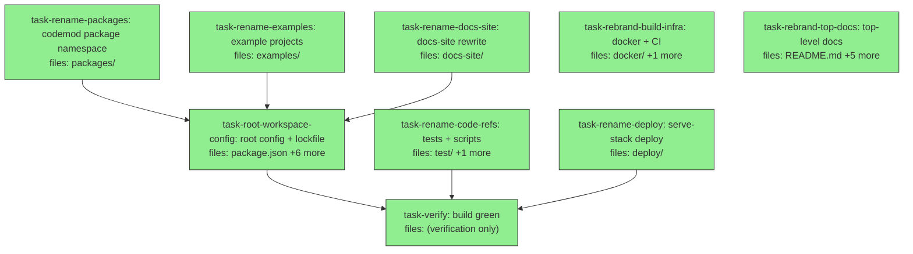

## Context

Mechanical rename of the monorepo **Agora → Pangolin Scale**, full code + brand, **clean break** (no back-compat shims). Driven by the brand decision [[wikis/agora/decisions/decision-2026-06-04-rebrand-agora-pangolin-scale-name-gate]]. Brand = "Pangolin Scale"; code namespace = `pangolin` (packages `@quarry-systems/pangolin-*`, CLI bin `pangolin`, config `pangolin.config.*`).

**Why this DAG shape.** The rename mapping is **deterministic and known upfront**, so each surface task applies the same fixed mapping to its own file scope without needing another task's output. That makes the six rename tasks file-disjoint parallel roots. Build-greenness is a *whole-workspace* property (pnpm only resolves when every member's `package.json` name + `workspace:*` deps are consistent), so it is asserted in a single terminal `task-verify` after `task-root-workspace-config` regenerates the lockfile — not per task. Intermediate states are intentionally broken; only `task-verify` asserts green.

**The deterministic mapping (every task applies this, nothing else):**

| From | To |
|---|---|
| `@quarry-systems/agora-core` | `@quarry-systems/pangolin-core` |
| `@quarry-systems/agora-client` | `@quarry-systems/pangolin-client` |
| `@quarry-systems/agora-orchestrator` | `@quarry-systems/pangolin-orchestrator` |
| `@quarry-systems/agora-worker` | `@quarry-systems/pangolin-worker` |
| `@quarry-systems/agora-cli` | `@quarry-systems/pangolin-cli` |
| `@quarry-systems/agora-mcp` | `@quarry-systems/pangolin-mcp` |
| `@quarry-systems/agora-secret-store` | `@quarry-systems/pangolin-secret-store` |
| `@quarry-systems/agora-storage-s3` | `@quarry-systems/pangolin-storage-s3` |
| `@quarry-systems/agora-storage-local` | `@quarry-systems/pangolin-storage-local` |
| `@quarry-systems/agora-providers-fargate` | `@quarry-systems/pangolin-providers-fargate` |
| `@quarry-systems/agora-providers-aws-creds` | `@quarry-systems/pangolin-providers-aws-creds` |
| `@quarry-systems/agora-providers-local-docker` | `@quarry-systems/pangolin-providers-local-docker` |
| `@quarry-systems/agora-runtime-claude-code` | `@quarry-systems/pangolin-runtime-claude-code` |
| CLI bin `agora` | `pangolin` |
| MCP bin `agora-mcp` | `pangolin-mcp` |
| config `agora.config.{ts,js,mjs}` | `pangolin.config.{ts,js,mjs}` |
| docker image / dir `agora-worker` | `pangolin-worker` |
| repo URL `github.com/QuarrySystems/agora` | `github.com/QuarrySystems/pangolin` |
| docs URL `quarrysystems.github.io/agora` | `quarrysystems.github.io/pangolin` |
| brand prose "Agora" | "Pangolin Scale" |
| MCP tool identifiers (`agora_*` strings, if any) | `pangolin_*` (kept in sync across server + allowlist) |

**Out of DAG — human-gated release steps (do NOT automate; sequence AFTER `task-verify` AND after the two preconditions below):**
- **Preconditions:** (1) promote the brand decision; (2) trademark clearance — confirm "Pangolin Scale" doesn't collide with the YC `pangolin.net` neighbor's marks in Class 9/42 (the word itself is registrable — an animal name is arbitrary, hence *strong*, for software; the open question is freedom-to-operate vs. an existing holder, not registrability).
- Publish `@quarry-systems/pangolin-*` to npm (2FA); deprecate `@quarry-systems/agora-*` with a "renamed to …" message.
- Push renamed GHCR/docker image; rename the GitHub repo `agora → pangolin-scale` (set up redirect); register `pangolinscale.com`; point the docs site.
- e2e suite (`pnpm test:e2e`, needs docker) re-run against the renamed worker image — verification beyond unit/integration.

All tasks are `is_wiring_task: true`: this is a mechanical rename; the load-bearing artifact is the file structure, not new implementation. Acceptance is grep/build-based.

## Tasks

## Task: codemod the package namespace

```yaml
id: task-rename-packages
depends_on: []
files:
  - packages/
status: done
is_wiring_task: true
```

Apply the deterministic mapping across `packages/**`: `git mv` each `packages/agora-*` directory to `packages/pangolin-*`; in every `package.json` set `name` to the mapped scope, rewrite all `@quarry-systems/agora-*` dependency keys (incl. `workspace:*`/`workspace:^`) to mapped names, update `repository.url`/`repository.directory`/`homepage`/`bugs.url`, and rewrite the description prose. Rewrite every source/test import specifier `@quarry-systems/agora-*` → mapped. Rename the CLI bin (`agora` → `pangolin`) and MCP bin (`agora-mcp` → `pangolin-mcp`) in their `package.json`. Update the config-file resolver to look for `pangolin.config.{ts,js,mjs}` (replacing `agora.config.*`). Rebrand MCP tool identifier strings in `packages/pangolin-mcp/src/tools.ts` to the `pangolin_*` form (keep the set of names recorded so the allowlist tasks match exactly).

## Acceptance criteria

- All 13 package directories are `packages/pangolin-*`; no `packages/agora-*` directory remains.
- `grep -rn "agora" packages/` returns zero matches except deliberate history/CHANGELOG-style residue (none expected in package sources).
- Every `package.json` under `packages/` has a `@quarry-systems/pangolin-*` name and all internal deps reference `@quarry-systems/pangolin-*`.
- `packages/pangolin-cli/package.json` exposes bin `pangolin`; the config resolver matches `pangolin.config.{ts,js,mjs}`.
- `packages/pangolin-mcp` exposes bin `pangolin-mcp`; tool identifiers use the `pangolin_*` form.

Verification: `grep -rni "agora" packages/ | grep -v node_modules` is empty; `pnpm -C packages/pangolin-cli typecheck` is deferred to `task-verify` (cross-package deps not yet wired).

## Task: codemod non-package code references

```yaml
id: task-rename-code-refs
depends_on: []
files:
  - test/
  - scripts/
status: done
is_wiring_task: true
```

Apply the mapping to the root integration/e2e suite and tooling scripts: rewrite all `@quarry-systems/agora-*` imports under `test/**`; update the worker-image name string in `test/e2e/helpers/worker-image.ts` to the renamed image (`pangolin-worker`); rewrite the MCP tool-name allowlist in `scripts/check-mcp-tool-allowlist.mjs` (+ its test) and any `agora`/image references in `scripts/check-dep-allowlist.mjs` to the mapped names, matching the `pangolin_*` tool identifiers chosen in `task-rename-packages`.

## Acceptance criteria

- `grep -rni "agora" test/ scripts/` returns zero matches.
- The MCP allowlist in `scripts/check-mcp-tool-allowlist.mjs` lists exactly the `pangolin_*` tool identifiers (same set as the renamed server).
- `test/e2e/helpers/worker-image.ts` references the `pangolin-worker` image name.

Verification: `grep -rni "agora" test/ scripts/` is empty.

## Task: codemod the example projects

```yaml
id: task-rename-examples
depends_on: []
files:
  - examples/
status: done
is_wiring_task: true
```

Apply the mapping across `examples/**`: rewrite each example `package.json` dependency on `@quarry-systems/agora-*` to mapped names; rename every `agora.config.mjs` to `pangolin.config.mjs` and update its contents/imports; rewrite source imports and README prose (brand + package names + CLI command `agora` → `pangolin`).

## Acceptance criteria

- No `agora.config.*` file remains under `examples/`; each renamed to `pangolin.config.*`.
- `grep -rni "agora" examples/` returns zero matches.
- Every example `package.json` references only `@quarry-systems/pangolin-*` workspace deps.

Verification: `grep -rni "agora" examples/` is empty; `find examples -name 'agora.config.*'` is empty.

## Task: rewrite docs-site for the new brand

```yaml
id: task-rename-docs-site
depends_on: []
files:
  - docs-site/
status: done
is_wiring_task: true
```

Apply the mapping across `docs-site/**`: update `package.json`/`astro.config.mjs` (any `@quarry-systems/agora-*` dep, base path, site URL `quarrysystems.github.io/agora` → `…/pangolin-scale`); rewrite all MDX/MD content — brand "Agora" → "Pangolin Scale", package names, CLI command, config filename, the ADR set under `explanation/decisions/`, and the reference pages (`reference/package-map.md`, `reference/cli.md`, `reference/mcp-tools.md`). Preserve old URL slugs via Astro redirects where a page path changes.

## Acceptance criteria

- `grep -rni "agora" docs-site/` returns zero matches outside intentional changelog/history notes.
- `docs-site/astro.config.mjs` site/base reflects the `pangolin-scale` repo path.
- Reference pages (`package-map`, `cli`, `mcp-tools`) list `@quarry-systems/pangolin-*`, bin `pangolin`, and `pangolin_*` tools.

Verification: `grep -rni "agora" docs-site/src` is empty (excluding any explicit "formerly Agora" note).

## Task: rebrand the build-infra surface

```yaml
id: task-rebrand-build-infra
depends_on: []
files:
  - docker/
  - .github/
status: done
is_wiring_task: true
```

Apply the mapping across container + CI infra: rename `docker/agora-worker/` → `docker/pangolin-worker/`, update the Dockerfile and `bin/agora-worker-entry.mjs` (rename + internal refs); rewrite `.github/workflows/*.yml` — image/build names in `agora-worker-image.yml`, the MCP tool-name list in `mcp-tool-allowlist.yml` (match the `pangolin_*` set), the dep allowlist in `dep-allowlist.yml`, and any `agora` references in `ci.yml`, `e2e.yml`, `docs.yml`, `typecheck.yml` (GHCR image, docs deploy path).

## Acceptance criteria

- No `docker/agora-worker` path remains; `docker/pangolin-worker/` exists with updated Dockerfile + entry script.
- `grep -rni "agora" docker/ .github/` returns zero matches.
- `.github/workflows/mcp-tool-allowlist.yml` lists the `pangolin_*` tool identifiers (same set as server + script).

Verification: `grep -rni "agora" docker/ .github/` is empty.

## Task: rebrand the top-level docs

```yaml
id: task-rebrand-top-docs
depends_on: []
files:
  - README.md
  - CHANGELOG.md
  - ROADMAP.md
  - RELEASING.md
  - LICENSING.md
  - LICENSE
status: done
is_wiring_task: true
```

Rebrand the repo-root documents: "Agora" → "Pangolin Scale", package names, CLI command, repo/docs URLs. In `CHANGELOG.md`, add a top entry recording the rename rather than rewriting history (prior "agora" references in dated past entries are intentional residue). Update the copyright/licensed-work name in `LICENSE`/`LICENSING.md` to the new product name.

## Acceptance criteria

- `README.md`, `ROADMAP.md`, `RELEASING.md` contain no "agora" references (all "Pangolin Scale" / `pangolin`).
- `CHANGELOG.md` has a new entry noting "Renamed Agora → Pangolin Scale"; historical entries are left intact.
- `LICENSE`/`LICENSING.md` name the Licensed Work as "Pangolin Scale".

Verification: `grep -ni "agora" README.md ROADMAP.md RELEASING.md` is empty.

## Task: codemod the serve-stack deploy surface

```yaml
id: task-rename-deploy
depends_on: []
files:
  - deploy/
status: done
is_wiring_task: true
```

Apply the mapping across `deploy/serve-stack/**` (added after this plan's first draft, PR #57): rename both `agora.config.mjs` files (root + `client/`) to `pangolin.config.mjs` and update their contents/imports; rewrite the `@quarry-systems/agora-*` deps and CLI command in `package.json`, `serve-entrypoint.mjs`, and the client kit (`client/smoke.mjs`); update the worker image name (`agora-worker` → `pangolin-worker`) and any `agora` brand/path refs in `Dockerfile`, `docker-compose.yml`, `scripts/init-buckets.sh`, and `RUNBOOK.md`. This surface is NOT a pnpm workspace member (the workspace globs are `packages/*`, `examples/*`, `docs-site` only), so it does not feed the root lockfile — it is a file-disjoint parallel root that only needs to land before `task-verify`'s repo-wide grep.

## Acceptance criteria

- No `agora.config.*` file remains under `deploy/`; both renamed to `pangolin.config.*`.
- `grep -rni "agora" deploy/` returns zero matches.
- `deploy/serve-stack` references the `pangolin-worker` image and `@quarry-systems/pangolin-*` packages only.

Verification: `grep -rni "agora" deploy/` is empty; `find deploy -name 'agora.config.*'` is empty.

## Task: regenerate the root workspace config

```yaml
id: task-root-workspace-config
depends_on: [task-rename-packages, task-rename-examples, task-rename-docs-site]
files:
  - package.json
  - pnpm-workspace.yaml
  - .npmrc
  - .eslintrc.cjs
  - tsconfig.base.json
  - vitest.e2e.config.ts
  - pnpm-lock.yaml
status: done
is_wiring_task: true
```

Wire the workspace root to the renamed members and regenerate the lockfile. Rename the root `package.json` `name` (`agora` → `pangolin-scale`) and description; confirm `pnpm-workspace.yaml` globs (`packages/*`, `examples/*`, `docs-site`) still match (no name change needed); update `.npmrc`, any `@quarry-systems/agora-*` path mappings/project references in `tsconfig.base.json` (note: there is no root `tsconfig.json` — only `tsconfig.base.json`), the brand/`agora-client` references in `.eslintrc.cjs`, and the `agora` reference in `vitest.e2e.config.ts`. Then run `pnpm install` to regenerate `pnpm-lock.yaml` against the renamed package names. Depends on the package/examples/docs-site renames because the lockfile resolves every workspace member's final name.

## Acceptance criteria

- Root `package.json` name is `pangolin-scale`; `grep -ni "agora" package.json pnpm-workspace.yaml .npmrc .eslintrc.cjs tsconfig.base.json vitest.e2e.config.ts` is empty.
- `pnpm install` completes; `pnpm-lock.yaml` contains no `@quarry-systems/agora-*` importer/specifier entries.

Verification: `pnpm install --frozen-lockfile=false` succeeds and `grep -n "agora-" pnpm-lock.yaml` is empty.

## Task: verify the renamed monorepo builds green

```yaml
id: task-verify
depends_on: [task-root-workspace-config, task-rename-code-refs, task-rename-deploy]
files: []
status: done
single_threaded: true
is_wiring_task: true
```

Whole-workspace correctness gate after all renames cohere. Run install + build + typecheck + the unit/integration suite and confirm zero `agora` references survive anywhere in tracked sources. (The docker-dependent e2e suite is a separate, gated follow-up per Context.)

## Acceptance criteria

- `pnpm install` then `pnpm -w build`, `pnpm -w typecheck`, and `pnpm -w test` all exit 0.
- `git grep -ni "agora" -- ':!CHANGELOG.md' ':!**/decisions/**' ':!docs/**'` returns zero matches (only the intentional CHANGELOG rename note, historical ADR text, and the historical `docs/superpowers/` plans/specs — including this rename plan — remain).
- CLI bin resolves as `pangolin`; MCP server starts and exposes the `pangolin_*` tools.

Verification: full `pnpm install && pnpm -w build && pnpm -w typecheck && pnpm -w test` green; `git grep -ni agora -- ':!CHANGELOG.md' ':!**/decisions/**' ':!docs/**'` reduced to the documented residue allowlist (empty).

> **Residue allowlist (audited 2026-06-07; verify run 2026-06-08 GREEN):** `CHANGELOG.md` (dated past entries + the new rename note), `**/decisions/**` (historical ADR text), and `docs/superpowers/**` (historical DAG plans/specs whose filenames encode the `agora-` names of past work — renaming them would rewrite the build record). After the gate run, two further *irreducible* intentional categories remain and are accepted: (a) `docs-site/astro.config.mjs` redirect **keys** that preserve the old `agora` URL slugs (required by the "preserve old slugs" spec — cannot be removed without breaking inbound links); (b) `README.md` link **targets** pointing at the `docs/superpowers/specs/…agora-*` residue files (the path must match the file that exists on disk). These are intentional and excluded from the zero-`agora` gate.
>
> **Final gate result (2026-06-08):** `pnpm install --frozen-lockfile` ✅ · `pnpm -w build` ✅ · `pnpm -w typecheck` ✅ · `pnpm -w test` ✅ · `pnpm -r lint` ✅ · CLI bin `pangolin` runs ("Pangolin Scale CLI") ✅ · MCP exposes `pangolin_*` tools ✅. `git grep -ni agora -- ':!CHANGELOG.md' ':!**/decisions/**' ':!docs/**'` → 6 matches, all in the (a)/(b) categories above.
