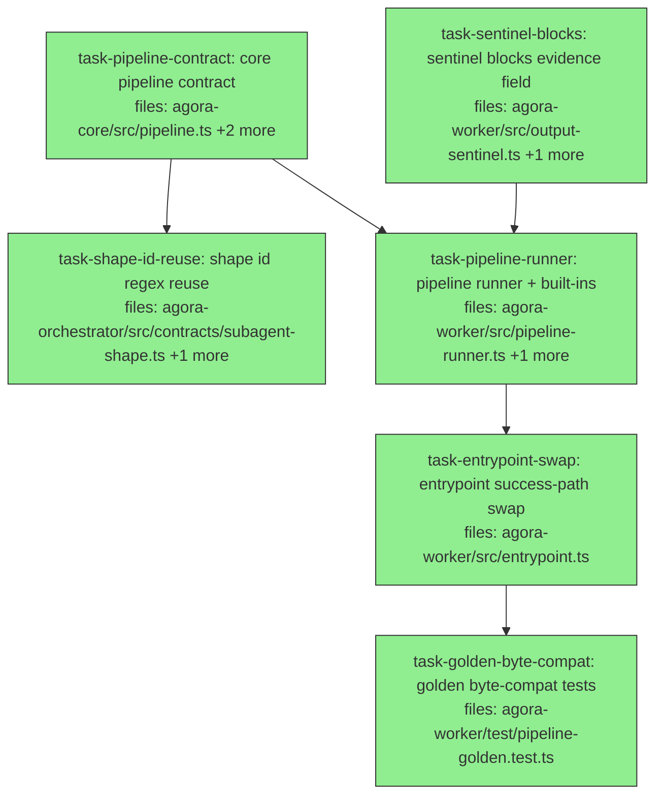

## Context

Implements **Wave 1 ONLY** of
`docs/superpowers/specs/2026-06-05-agora-block-runner-data-pack-design.md` — the
block-pipeline runner as a **BEHAVIOR-IDENTICAL** refactor of the worker's hardcoded
execution steps. Wave 2 (registration surface, bundle threading, the data pack, the
in-process executor, the demo) gets its own plan after this wave MERGES — its plan will
cite this wave's as-landed shapes.

THE governing invariant, stated once and enforced by every task: **dev dispatches behave
byte-identically before and after.** The existing suite (notably
`packages/agora-worker/test/entrypoint.test.ts` and `test/output-sentinel.test.ts`) is the
regression harness and MUST pass UNCHANGED — an implementer that needs to edit an existing
test to go green has broken the invariant and must STOP and report BLOCKED. The implicit
default pipeline writes the legacy sentinel byte-for-byte (`blocks?` evidence is written
ONLY for explicitly declared pipelines).

Wave-1 caveat: declared pipelines cannot yet REACH the worker (the `bundleRefs.pipeline`
kind is Wave 2). The entrypoint always builds the default pipeline in this wave; the
declared-pipeline path is exercised by runner unit tests calling `runPipeline` directly.

Key spec invariants:
- `BlockContext` stays worker-side — NEVER exported from agora-core (spec guardrail b).
- `PipelineSpec` carries `schemaVersion: 1` + optional-additive evolution from day 1
  (core is published; specs will be persisted content-addressed bundles).
- `seal` is structural: auto-appended inside `runPipeline`, rejected as a spec kind.
- Failure writes NO sentinel; needs_input aborts without sealing; adapter THROW stays
  `worker-failed` vs non-zero exit `provider-failed` (spec §5 pins 1/2/4).
- Zero diffs outside the declared files; `src/engine/`, `contracts/privilege.ts`, and the
  pattern layer untouched.

Type-placement fact (decided at planning, prevents a circular import): **`BlockOutcome`
lives in `output-sentinel.ts`** beside `OutputSentinel` (it is evidence-at-rest); the
runner imports it from there (runner → output-sentinel is the existing one-way direction).

Conventions: pnpm monorepo; tests at `packages/<pkg>/test/<name>.test.ts` (vitest); worker
tests inline their fakes per-file via the `RunWorkerDeps` seam (existing convention —
`entrypoint.test.ts` is the canonical example; read it before writing worker tests).
Controller gates include `pnpm -r lint` (pattern-layer lesson). Consumer-grep results:
`ID_RE` is private to `subagent-shape.ts` (single definition site, error messages
unchanged by the swap); `OutputSentinel` consumers (`readSentinel` in
`executors/dispatch.ts`) reconstruct defensively — an additive optional field is safe.

## Tasks

## Task: core pipeline contract

```yaml
id: task-pipeline-contract
depends_on: []
files:
  - packages/agora-core/src/pipeline.ts
  - packages/agora-core/src/index.ts
  - packages/agora-core/test/pipeline.test.ts
status: done
```

The pipeline contract as DATA in agora-core (spec §4): `BlockSpec` union, `PipelineSpec`,
the pure `validatePipelineSpec`, and the shared `isPackScopedId` (hoisted here so the
pack-id regex exists ONCE — the orchestrator reuses it in task-shape-id-reuse). No zod,
no new dependencies. Barrel-export from `agora-core/src/index.ts` following its existing
style.

## Implementation

```typescript
// packages/agora-core/src/pipeline.ts
export interface AgentBlockSpec   { kind: 'agent' }
export interface ScriptBlockSpec  {
  kind: 'script';
  command: string;                  // shell string, runBoundedCommand semantics
  timeoutSeconds?: number;          // positive when present; runner defaults 600
  lens?: 'gate' | 'verify';         // default 'gate'
}
export interface CaptureBlockSpec { kind: 'capture'; what: 'patch' | 'outputs' }
export type BlockSpec = AgentBlockSpec | ScriptBlockSpec | CaptureBlockSpec;

export interface PipelineSpec {
  schemaVersion: 1;
  id: string;                       // '<pack>.<name>'
  blocks: BlockSpec[];              // 'seal' NEVER appears — reserved, runner-appended
  outputEdgeType?: string;
  inputEdgeTypes?: Record<string, string>;
}

/** Pack-scoped id form shared with SubagentShape ('<pack>.<name>'). */
export function isPackScopedId(id: string): boolean {
  return /^[a-z0-9-]+\.[a-z0-9-]+$/.test(id);
}

/** PURE structural validator; empty array = valid. One validator, N callers. */
export function validatePipelineSpec(spec: PipelineSpec): string[] {
  const errors: string[] = [];
  if (spec.schemaVersion !== 1) errors.push(`unsupported schemaVersion ${String(spec.schemaVersion)}`);
  if (!isPackScopedId(spec.id)) errors.push(`id "${spec.id}" must be "<pack>.<name>"`);
  if (!Array.isArray(spec.blocks) || spec.blocks.length === 0) errors.push('blocks must be a non-empty array');
  for (const [i, b] of (spec.blocks ?? []).entries()) {
    if ((b as { kind?: string }).kind === 'seal') { errors.push(`blocks[${i}]: 'seal' is reserved — it is auto-appended by the runner; remove it`); continue; }
    // ... per-kind checks: known kind; script command non-empty string; timeoutSeconds
    //     positive number when present; lens within union; capture.what within union
  }
  // ... tag checks: outputEdgeType / inputEdgeTypes values non-empty strings when present
  return errors;
}
```

```typescript
// packages/agora-core/test/pipeline.test.ts
import { describe, it, expect } from 'vitest';
import { validatePipelineSpec, isPackScopedId } from '../src/pipeline.js';

it("rejects the reserved 'seal' kind with a pointed error", () => {
  const errors = validatePipelineSpec({
    schemaVersion: 1, id: 'data.split',
    blocks: [{ kind: 'script', command: 'true' }, { kind: 'seal' } as never],
  });
  expect(errors.some((e) => e.includes('reserved') && e.includes('auto-appended'))).toBe(true);
});
```

## Acceptance criteria

- `BlockSpec`, `PipelineSpec`, `validatePipelineSpec`, `isPackScopedId` importable from
  `@quarry-systems/agora-core` (the barrel).
- Validator: valid spec → `[]`; rejects schemaVersion ≠ 1, non-pack-scoped id, empty
  blocks, unknown kind, `'seal'` kind (error names "auto-appended"), empty script
  `command`, non-positive `timeoutSeconds`, invalid `lens`/`what`, empty-string tags.
  Collect-all (multiple errors reported in one pass, the `validateRun` style).
- `isPackScopedId`: true for `dev.code-edit`/`data.split`; false for `nodot`,
  `Upper.case`, `a.b.c`, empty.
- Zero new dependencies in agora-core's package.json; no zod; `BlockContext` does NOT
  appear anywhere in this package.
- `npx vitest run test/pipeline.test.ts` passes (from packages/agora-core).

Test file: `packages/agora-core/test/pipeline.test.ts`.

## Task: sentinel blocks evidence field

```yaml
id: task-sentinel-blocks
depends_on: []
files:
  - packages/agora-worker/src/output-sentinel.ts
  - packages/agora-worker/test/output-sentinel.test.ts
status: done
```

The additive per-block evidence channel (spec §5 pin 3): `BlockOutcome` is DEFINED HERE
(evidence-at-rest, beside `OutputSentinel` — prevents a runner↔sentinel circular import)
and `OutputSentinel` gains optional `blocks?: BlockOutcome[]`; `writeSentinel` gains
optional `blocks?` passthrough. Exactly the #37 `verify?` additive-field template:
absence leaves the sentinel hash unchanged.

## Implementation

```typescript
// packages/agora-worker/src/output-sentinel.ts (additions)
/** Per-block runtime evidence (spec §5). Written ONLY for explicitly declared
 *  pipelines — the implicit default pipeline writes the legacy sentinel byte-for-byte. */
export interface BlockOutcome {
  kind: string;
  ordinal: number;
  status: 'ok' | 'failed';
  exitCode?: number;
  durationMs: number;
  verify?: VerifyOutcome;
  patchRef?: string;
  outputs?: OutputEntry[];
}
// OutputSentinel gains: blocks?: BlockOutcome[];
// writeSentinel opts gain: blocks?: BlockOutcome[];  set on the sentinel only when defined
```

```typescript
// packages/agora-worker/test/output-sentinel.test.ts (added cases — existing cases UNCHANGED)
it('a sentinel without blocks is byte-identical to the pre-blocks shape', async () => {
  // write two sentinels with identical inputs, one via the old opts surface, one with
  // blocks: undefined — assert the stored bytes are identical (hash-stability contract)
});
it('blocks are serialized when provided', async () => {
  // writeSentinel({ ..., blocks: [{ kind: 'script', ordinal: 0, status: 'ok', durationMs: 5 }] })
  // → parsed sentinel.blocks deep-equals the input
});
```

## Acceptance criteria

- `BlockOutcome` + `OutputSentinel.blocks?` + `writeSentinel({ blocks? })` exported;
  field absent ⇒ stored sentinel bytes identical to today (asserted by test).
- EXISTING test cases in `output-sentinel.test.ts` pass unchanged (additions only).
- No other file modified; `capturePatch`/`captureOutputs` untouched.
- `npx vitest run test/output-sentinel.test.ts` passes (from packages/agora-worker).

Test file: `packages/agora-worker/test/output-sentinel.test.ts`.

## Task: shape id regex reuse

```yaml
id: task-shape-id-reuse
depends_on: [task-pipeline-contract]
files:
  - packages/agora-orchestrator/src/contracts/subagent-shape.ts
  - packages/agora-orchestrator/test/subagent-shape.test.ts
status: done
model_hint: cheap
```

DRY fix from the spec audit: `subagent-shape.ts`'s private `ID_RE` is replaced by core's
`isPackScopedId` — the pack-id form now has ONE definition site. Behavior-identical:
`validateShape`'s error messages and accept/reject set are unchanged.

## Implementation

```typescript
// packages/agora-orchestrator/src/contracts/subagent-shape.ts (change)
import { isPackScopedId } from '@quarry-systems/agora-core';
// delete: const ID_RE = /^[a-z0-9-]+\.[a-z0-9-]+$/;
// validateShape: if (!isPackScopedId(s.id)) throw new Error(`SubagentShape: id "${s.id}" must be "<pack>.<name>"`);
```

```typescript
// packages/agora-orchestrator/test/subagent-shape.test.ts (added case — existing cases UNCHANGED)
it('accepts/rejects the same ids as core isPackScopedId', () => {
  // valid: 'dev.code-edit' passes validateShape; invalid: 'nodot' throws with the
  // unchanged message text 'must be "<pack>.<name>"'
});
```

## Acceptance criteria

- `ID_RE` no longer exists anywhere in the repo (`grep -rn ID_RE packages/` → empty).
- `validateShape` error message text unchanged; existing `subagent-shape.test.ts` cases
  pass unchanged.
- Full orchestrator suite green: `npx vitest run` from packages/agora-orchestrator
  (report the count — must be the pre-task count).

Test file: `packages/agora-orchestrator/test/subagent-shape.test.ts`.

## Task: pipeline runner + built-ins

```yaml
id: task-pipeline-runner
depends_on: [task-pipeline-contract, task-sentinel-blocks]
files:
  - packages/agora-worker/src/pipeline-runner.ts
  - packages/agora-worker/test/pipeline-runner.test.ts
status: done
```

The interpreter runner (spec §5): registry of built-in `BlockImpl`s keyed by `kind`
(`agent` → `adapter.invoke`; `script` → `runBoundedCommand`, with `lens:'verify'`
DELEGATING to `runVerify` literally; `capture` → `capturePatch`/`captureOutputs`),
`buildDefaultPipeline` (today's hardcoded sequence as data, INCLUDING the entrypoint's
exact timeout guard), and `runPipeline` with the auto-appended seal INSIDE it. Read
`entrypoint.ts` steps 11–14 first — the runner's semantics are a transplant, not an
invention.

## Implementation

```typescript
// packages/agora-worker/src/pipeline-runner.ts
import type { PipelineSpec, BlockSpec } from '@quarry-systems/agora-core';
import type { RuntimeAdapter, StorageProvider, VerifyConfig } from '@quarry-systems/agora-core';
import { runBoundedCommand } from './bounded-command.js';
import { runVerify } from './verify.js';
import { capturePatch, captureOutputs, writeSentinel, type BlockOutcome, type OutputEntry, type OutputSentinel } from './output-sentinel.js';
import type { WorkspaceBaseline } from './patch-capture.js';

export interface BlockContext {            // worker-side ONLY (spec guardrail b)
  workspaceDir: string; env: Record<string, string>;
  storage: StorageProvider; namespace: string; dispatchId: string;
  adapter: RuntimeAdapter;
  subagent: { systemPrompt?: string; promptTemplate?: string; model?: string };
  inputJson?: string;
  baseline: WorkspaceBaseline;
  redact(s: string): string;
  log(event: Record<string, unknown>): void;
}

export type PipelineResult =
  | { kind: 'completed'; outcomes: BlockOutcome[]; sentinel?: OutputSentinel; declared: boolean }
  | { kind: 'failed'; outcomes: BlockOutcome[]; exitCode: number }
  | { kind: 'needs-input'; sentinelPath: string; outcomes: BlockOutcome[] };

/** Single owner of the verify-timeout default after this wave (the entrypoint's copy is
 *  DELETED by task-entrypoint-swap — leaving it would be an unused-var lint failure). */
export const DEFAULT_VERIFY_TIMEOUT_SECONDS = 600;

/** Today's hardcoded sequence as DATA — including the entrypoint's exact guard:
 *  falsy/non-positive verify timeout → DEFAULT_VERIFY_TIMEOUT_SECONDS. */
export function buildDefaultPipeline(subagent: { verify?: VerifyConfig }): PipelineSpec { /* ... */ }

/** Executes spec.blocks in order; auto-appends seal (writeSentinel) on the completed
 *  path — best-effort (failures log 'escape.failed' via ctx.log, result stays
 *  completed). Gate failure (script gate non-zero/timeout/start-error, agent non-zero
 *  exit) → 'failed' with exit code, NO sentinel. Agent needs_input → 'needs-input',
 *  NO sentinel, no further blocks. Adapter THROW propagates (chassis maps it to
 *  worker-failed — spec §5 pin 4). `blocks` evidence passed to writeSentinel ONLY
 *  when `declared` (spec §5 pin 3); the first verify-lens outcome populates
 *  sentinel.verify either way. The agent block emits the 'runtime.adapter.ran' log
 *  exactly as the entrypoint does today. */
export async function runPipeline(
  spec: PipelineSpec, ctx: BlockContext, opts: { declared: boolean },
): Promise<PipelineResult> { /* registry dispatch over spec.blocks */ }
```

```typescript
// packages/agora-worker/test/pipeline-runner.test.ts (fakes inline, the worker convention)
it('a gate script failure aborts the pipeline with no sentinel and the script exit code', async () => {
  // spec: [script gate 'exit 3', capture outputs]; fake storage records puts
  // → result.kind 'failed', exitCode 3, outcomes[0].status 'failed',
  //   zero sentinel puts, capture block never ran (outcomes.length === 1)
});
```

## Acceptance criteria

- `buildDefaultPipeline`: no verify → `[agent, capture(patch), capture(outputs)]`; with
  verify → verify-lens script inserted between captures, command verbatim,
  `timeoutSeconds` = entrypoint guard (`t > 0 ? t : 600`, including `t = 0`).
- `runPipeline` completed path: blocks run in order; seal auto-appended (a `writeSentinel`
  put observed) carrying aggregated `{ patchRef, verify, outputs }`; seal failure →
  `escape.failed` logged via ctx.log, result still `completed`.
- `blocks` evidence: present in the sentinel iff `opts.declared`; first verify-lens
  outcome populates `sentinel.verify` in both modes.
- Gate semantics: script `gate` non-zero/timeout/start-error and agent non-zero exit →
  `failed` + exit code + no sentinel + later blocks not run. Verify lens NEVER fails the
  pipeline and produces `runVerify`'s exact `VerifyOutcome` (delegation, not
  reimplementation — assert by behavior: timeout → `passed: false`).
- Agent block: invokes `ctx.adapter.invoke` with the same spec/ctx fields the entrypoint
  passes today; emits `runtime.adapter.ran` via ctx.log; `needsInputSentinelPath` →
  `needs-input` result, no sentinel, no further blocks; adapter throw propagates.
- Script output is `ctx.redact`-ed and bounded before landing in any outcome.
- Module imports nothing from agora-orchestrator; `BlockContext` not re-exported from any
  core barrel.
- `npx vitest run test/pipeline-runner.test.ts` passes (from packages/agora-worker).

Test file: `packages/agora-worker/test/pipeline-runner.test.ts`.

## Task: entrypoint success-path swap

```yaml
id: task-entrypoint-swap
depends_on: [task-pipeline-runner]
files:
  - packages/agora-worker/src/entrypoint.ts
status: done
is_wiring_task: true
```

The transplant (spec §5): `runWorker`'s step 11–14 execution core is replaced by ONE
runner invocation — `runPipeline(buildDefaultPipeline(subagent), ctx, { declared: false })`
(declared pipelines arrive in Wave 2) — with the chassis (steps 1–10/12, lifecycle
mapping, exit codes) unchanged. The runner's `needs-input` result feeds the existing
step-13 branch; `failed` feeds the existing `provider-failed` terminal; adapter throws
keep the existing `worker-failed` catch. **The existing
`packages/agora-worker/test/entrypoint.test.ts` MUST pass UNCHANGED — if any existing
assertion fails, STOP and report BLOCKED with the diff; do NOT edit that test file.**

## Acceptance criteria

- `entrypoint.ts` no longer contains the inline capturePatch/runVerify/captureOutputs/
  writeSentinel success sequence (moved to the runner); `captureBaseline` and all chassis
  steps remain.
- `DEFAULT_VERIFY_TIMEOUT_SECONDS` and the timeout guard are REMOVED from `entrypoint.ts`
  (the runner owns them now — a leftover unused constant is a lint failure, the exact
  fixId-class escape from the pattern-layer build). Verify with
  `pnpm --filter @quarry-systems/agora-worker lint` before committing.
- Behavior mapping preserved exactly: needs_input → `dispatch.needs_input` + exit 0;
  runner `failed` → `dispatch.failed`/`provider-failed` + runtime exit code carried;
  adapter throw → `worker-failed`; completed → `dispatch.finished` + exit 0.
- `npx vitest run test/entrypoint.test.ts` passes with ZERO modifications to that file.
- Full worker suite green: `npx vitest run` from packages/agora-worker (report count).
- This task modifies ONLY `entrypoint.ts`.

Test file: existing `packages/agora-worker/test/entrypoint.test.ts` (read-only regression
harness — do not modify).

## Task: golden byte-compat tests

```yaml
id: task-golden-byte-compat
depends_on: [task-entrypoint-swap]
files:
  - packages/agora-worker/test/pipeline-golden.test.ts
status: done
```

The load-bearing proof (spec §9/§11): for identical inputs, the runner-backed worker
produces a **byte-identical sentinel** to the legacy shape, and the failure/needs_input
paths emit the same lifecycle events and exit codes. Built on the `RunWorkerDeps` seam
(in-process `runWorker`, fake storage capturing puts, fake adapter — the
`entrypoint.test.ts` conventions; read it first). Treat any golden failure as a
ship-blocker to report, never a test to weaken.

## Implementation

```typescript
// packages/agora-worker/test/pipeline-golden.test.ts
it('default-pipeline sentinel bytes match the legacy golden shape (verify configured)', async () => {
  // run runWorker in-process with a fake adapter that edits a file + a verify command;
  // capture the dispatch-record sentinel PUT bytes; assert exact JSON equality against
  // the legacy field order/content: {"schemaVersion":1,"patchRef":...,"verify":...}
  // and assert NO 'blocks' key is present (implicit default pipeline).
});
it('failure path: non-zero adapter exit emits dispatch.failed/provider-failed, carries the exit code, writes no sentinel', async () => { /* ... */ });
it('needs_input path: valid sentinel → dispatch.needs_input, exit 0, no output sentinel', async () => { /* ... */ });
```

## Acceptance criteria

- Sentinel byte-equality asserted on the stored PUT bytes (not a parsed deep-equal) for:
  no-verify dispatch, verify-configured dispatch, dispatch with outputs/ deliverables —
  and `'blocks'` absent in all three.
- Failure parity: non-zero adapter exit → `dispatch.failed` with `reason:
  'provider-failed'`, worker exit code equals the adapter's, zero sentinel puts.
- needs_input parity: `dispatch.needs_input` emitted, exit 0, zero sentinel puts.
- Lifecycle event ORDER asserted via `onLifecycleEvent` (started → terminal), matching
  today.
- `npx vitest run test/pipeline-golden.test.ts` passes (from packages/agora-worker).

Test file: `packages/agora-worker/test/pipeline-golden.test.ts`.
