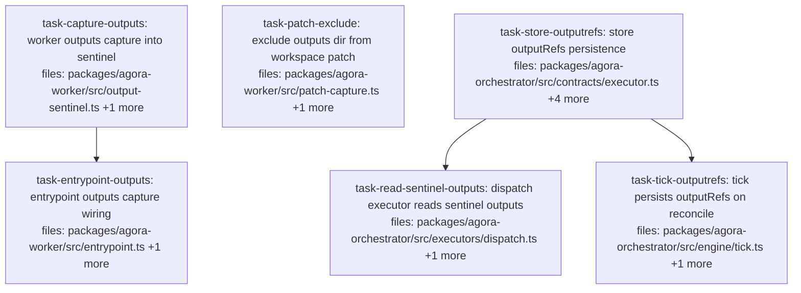

## Context

**Wave A of the typed-product handoff** — the output seam. Driven by
`docs/superpowers/specs/2026-06-04-agora-typed-product-handoff-design.md` §5 (output side), §4 (store
addition), §1a (the #37 template). Waves B (input seam + wiring) and C (provability + demo) follow in
separate plans.

This wave is **purely additive and report-only**: the worker captures everything written to
`workspace/outputs/` as content-addressed artifacts, seals them in the output sentinel, and the
orchestrator persists them per item — exactly mirroring how merged PR #37 threaded the `verify` signal
(sentinel additive field → defensive `readSentinel` → `ExecutionResult` → one guarded `tick` line →
`setX` store method → `MIGRATIONS` column). Nothing consumes `outputRefs` yet (Wave B's `needs`
resolver will).

**Pinned wire shape (cross-package contract, by design NOT a shared import):** the sentinel's
`outputs` field is `Array<{ path: string; ref: string }>` — `path` is posix-relative to `outputs/`,
`ref` is a pinned `agora://<ns>/artifact/<dispatchId>/<sha256-hash>` URI. The orchestrator side
re-parses this **defensively** (type guards + entry cap, never forwarding the raw object) and converts
to `Record<path, ref>` — matching #37's `verify` handling, because the sentinel is worker-written and
therefore untrusted input at the orchestrator boundary. Both task bodies below quote this shape; do
not drift from it.

Conventions this plan must follow (spec §10): SQLite columns via the idempotent `MIGRATIONS` array;
best-effort try/catch + `escape.failed` logging at the entrypoint boundary; content-addressing via
`computeContentHash`/`buildAgoraUri`/`storage.put` core primitives only.

## Tasks

## Task: worker outputs capture into sentinel

```yaml
id: task-capture-outputs
depends_on: []
files:
  - packages/agora-worker/src/output-sentinel.ts
  - packages/agora-worker/test/output-sentinel.test.ts
status: pending
```

Add `captureOutputs` (sibling of `capturePatch`) and the additive `outputs?` sentinel field per spec
§5. Walks `workspace/outputs/` recursively, content-addresses each file with the same core primitives
`capturePatch` uses, and returns the entries for `writeSentinel` to seal. Bounded ingestion: per-file
size cap and total entry cap (skip + caller-visible via logger is NOT available here — return entries
only; the entrypoint logs).

## Implementation

```typescript
// packages/agora-worker/src/output-sentinel.ts (additions)
export interface OutputEntry {
  /** Posix-relative path inside outputs/ (e.g. "report.pdf", "data/part-0.parquet"). */
  path: string;
  /** Pinned content-addressed URI: agora://<ns>/artifact/<dispatchId>/<sha256:...>. */
  ref: string;
}

export interface OutputSentinel {
  schemaVersion: 1;
  patchRef?: string;
  summary?: string;
  verify?: VerifyOutcome;
  /** Wave A (§5 output side): content-addressed deliverables captured from
   *  workspace/outputs/. Optional + additive — absence leaves the hash unchanged. */
  outputs?: OutputEntry[];
}

export const MAX_OUTPUT_FILE_BYTES = 100 * 1024 * 1024; // oversized files are skipped
export const MAX_OUTPUT_ENTRIES = 256;                  // walk stops after the cap

/** Walk workspaceDir/outputs (sorted, deterministic), content-address each file,
 *  upload via storage.put, return entries. undefined when outputs/ is missing or
 *  empty — so the sentinel (and its hash) is unchanged for runs with no outputs. */
export async function captureOutputs(opts: {
  workspaceDir: string;
  storage: StorageProvider;
  namespace: string;
  dispatchId: string;
}): Promise<OutputEntry[] | undefined> {
  // readdir(dir, { recursive: true }) — fine, repo engines pin node >= 20.
  // NORMALIZE path separators to '/' (path.relative gives '\' on Windows; the
  // repo's tests run on Windows too) and sort entries for determinism. Per file:
  //   const contentHash = computeContentHash(bytes);
  //   const ref = buildAgoraUri({ namespace, type: 'artifact', name: dispatchId, contentHash });
  //   await storage.put(ref, bytes);
}

// writeSentinel: add `outputs?: OutputEntry[]` to opts;
//   if (outputs !== undefined) sentinel.outputs = outputs;
// escapeWorkspace: pass-through param the same way verify is passed.
```

```typescript
// packages/agora-worker/test/output-sentinel.test.ts (new cases). Uses the file's
// existing MemoryStorage stub + `dir` workspace convention; NO initGitRepo needed —
// captureOutputs never touches git (only capturePatch does).
it('captures outputs/ files as content-addressed refs sealed in the sentinel', async () => {
  await mkdir(join(dir, 'outputs', 'data'), { recursive: true });
  await writeFile(join(dir, 'outputs', 'report.txt'), 'hello');
  await writeFile(join(dir, 'outputs', 'data', 'x.bin'), Buffer.from([1, 2, 3]));
  const outputs = await captureOutputs({ workspaceDir: dir, storage, namespace: 'ns', dispatchId: 'd1' });
  expect(outputs!.map((o) => o.path)).toEqual(['data/x.bin', 'report.txt']); // sorted, posix-relative
  for (const o of outputs!) await expect(storage.get(o.ref)).resolves.toBeInstanceOf(Uint8Array);
  const sentinel = await writeSentinel({ workspaceDir: dir, storage, namespace: 'ns', dispatchId: 'd1', outputs });
  expect(sentinel.outputs).toEqual(outputs);
});

it('returns undefined (and an outputs-free sentinel) when outputs/ is absent', async () => {
  expect(await captureOutputs({ workspaceDir: dir, storage, namespace: 'ns', dispatchId: 'd2' })).toBeUndefined();
  const sentinel = await writeSentinel({ workspaceDir: dir, storage, namespace: 'ns', dispatchId: 'd2' });
  expect('outputs' in sentinel).toBe(false); // hash-stable additive field, like verify
});
```

## Acceptance criteria

- `captureOutputs` returns sorted, posix-relative `{path, ref}` entries; every `ref` resolves via
  `storage.get` to the exact file bytes (round-trip asserted).
- Missing or empty `outputs/` → `undefined`; the written sentinel JSON then has **no** `outputs` key
  (byte-identical to a pre-Wave-A sentinel for the same inputs).
- Files over `MAX_OUTPUT_FILE_BYTES` are skipped (not uploaded, not in entries); entries stop at
  `MAX_OUTPUT_ENTRIES`.
- `writeSentinel`/`escapeWorkspace` accept and seal `outputs` exactly like `verify` (present only when
  provided).
- Existing output-sentinel tests pass unchanged.

Test file: `packages/agora-worker/test/output-sentinel.test.ts`.

## Task: exclude outputs dir from workspace patch

```yaml
id: task-patch-exclude
depends_on: []
files:
  - packages/agora-worker/src/patch-capture.ts
  - packages/agora-worker/test/patch-capture.test.ts
status: pending
model_hint: cheap
```

Deliberate deliverables in `outputs/` must never pollute the code diff (spec §5: same rationale as #37
capturing the patch before post-edit steps). Add `:(exclude)outputs` beside the existing
`:(exclude).agora` pathspec.

## Implementation

```typescript
// packages/agora-worker/src/patch-capture.ts — computeWorkspacePatch diff args
const diff = await git(workspaceDir, [
  'diff', '--cached', baseline.treeOid, '--', '.',
  ':(exclude).agora',
  ':(exclude)outputs',
]);
```

```typescript
// packages/agora-worker/test/patch-capture.test.ts (new top-level case — mirror the
// existing "excluding .agora/" exclusion test at :7, same setup helpers)
it('excludes outputs/ from the workspace patch', async () => {
  const dir = await makeWorkspace();           // whatever setup the :7 test uses
  const baseline = await captureBaseline(dir);
  await writeFile(join(dir, 'edited.txt'), 'changed');
  await mkdir(join(dir, 'outputs'), { recursive: true });
  await writeFile(join(dir, 'outputs', 'gen.bin'), 'deliverable');
  const patch = new TextDecoder().decode((await computeWorkspacePatch(dir, baseline))!);
  expect(patch).toContain('edited.txt');
  expect(patch).not.toContain('outputs/gen.bin');
});
```

## Acceptance criteria

- A file written under `outputs/` does not appear in the patch; a sibling source edit still does.
- A workspace whose only change is under `outputs/` produces a `null` patch (no-change behavior
  preserved).
- Existing patch-capture tests pass unchanged.

Test file: `packages/agora-worker/test/patch-capture.test.ts`.

## Task: entrypoint outputs capture wiring

```yaml
id: task-entrypoint-outputs
depends_on: [task-capture-outputs]
files:
  - packages/agora-worker/src/entrypoint.ts
  - packages/agora-worker/test/entrypoint.test.ts
status: pending
```

Wire `captureOutputs` into the success path with the spec §5 sequence
`capturePatch → self-verify → captureOutputs → writeSentinel`, best-effort like the surrounding steps
(a capture failure logs `escape.failed` and never changes the dispatch outcome).

## Implementation

```typescript
// packages/agora-worker/src/entrypoint.ts — after the self-verify block, before writeSentinel
let outputs: OutputEntry[] | undefined;
try {
  outputs = await captureOutputs({
    workspaceDir, storage, namespace: cfg.namespace, dispatchId: cfg.dispatchId,
  });
} catch (err) {
  logger.log({ kind: 'escape.failed', dispatchId: cfg.dispatchId, detail: (err as Error).message });
}
// existing call gains the param:
await writeSentinel({ workspaceDir, storage, namespace: cfg.namespace, dispatchId: cfg.dispatchId, patchRef, verify, outputs });
```

```typescript
// packages/agora-worker/test/entrypoint.test.ts (new case). Uses the REAL harness:
// extend setupHarness opts with an `onInvoke?: (spec: RuntimeInvocation) => Promise<void>`
// hook, called inside the stub adapter's invoke (keeps the invokeCalls counter intact) —
// the same opts-extension pattern as the existing `verify?:` opt.
it('seals outputs/ deliverables written by the adapter into the uploaded sentinel', async () => {
  const h = await setupHarness({
    onInvoke: async (spec) => {
      await mkdir(join(spec.workspaceDir, 'outputs'), { recursive: true });
      await writeFile(join(spec.workspaceDir, 'outputs', 'report.txt'), 'done');
    },
  });
  cleanupDirs.push(h.workDir, h.adaptersRoot);

  const code = await runWorker(h.env, makeDeps(h));
  expect(code).toBe(0);

  const sentinelUri = buildDispatchRecordUri('ns', 'd-1', 'output.json');
  const parsed = JSON.parse(new TextDecoder().decode(await h.storage.get(sentinelUri)));
  expect(parsed.outputs).toEqual([{ path: 'report.txt', ref: expect.stringMatching(/^agora:\/\//) }]);
});
```

## Acceptance criteria

- A run whose adapter writes `outputs/report.txt` uploads a sentinel whose `outputs` entry carries a
  resolvable content-addressed ref; the bytes at that ref equal the file written.
- Capture order is `capturePatch → self-verify → captureOutputs → writeSentinel` (assert via call
  order or observable artifacts).
- A `captureOutputs` throw logs `escape.failed` and the dispatch still succeeds with an outputs-free
  sentinel (outcome unchanged).
- A run that writes nothing to `outputs/` produces a sentinel with no `outputs` key (existing
  entrypoint tests pass unchanged).

Test file: `packages/agora-worker/test/entrypoint.test.ts`.

## Task: store outputRefs persistence

```yaml
id: task-store-outputrefs
depends_on: []
files:
  - packages/agora-orchestrator/src/contracts/executor.ts
  - packages/agora-orchestrator/src/contracts/types.ts
  - packages/agora-orchestrator/src/contracts/runstate-store.ts
  - packages/agora-orchestrator/src/runstate/sqlite.ts
  - packages/agora-orchestrator/test/runstate-sqlite.test.ts
status: pending
```

The `outputRefs` persistence contract — field-for-field the #37 `verify` column pattern (spec §4/§10):
optional field on `ExecutionResult` + `ItemState`, `setOutputRefs` on `RunStateStore`, and the SQLite
column via the idempotent `MIGRATIONS` array. No fake stores exist in the repo (verified — all tests
use `SqliteRunStateStore`), so the interface addition lands here alone.

## Implementation

```typescript
// contracts/executor.ts — ExecutionResult gains (beside verify):
/** Wave A (§5): content-addressed deliverable refs read from the worker's output
 *  sentinel, keyed by posix path inside outputs/. Report-only in this wave. */
outputRefs?: Record<string, string>;

// contracts/types.ts — ItemState gains (beside verify):
/** Content-addressed outputs/ deliverable refs (Wave A). Never interpreted by the store. */
outputRefs?: Record<string, string>;

// contracts/runstate-store.ts — RunStateStore gains (beside setVerify):
setOutputRefs(itemId: string, outputRefs: Record<string, string>): void; // persist deliverable refs

// runstate/sqlite.ts — the #37 column pattern verbatim:
//   ItemRow: output_refs: string | null;
//   CREATE TABLE: ..., output_refs TEXT, ...
//   MIGRATIONS: append ['output_refs', 'TEXT']
//   saveRun INSERT: one more NULL (set on completion, not submitted)
//   setOutputRefs(itemId, outputRefs) { UPDATE items SET output_refs=? ... JSON.stringify }
//   rowToItem: outputRefs: r.output_refs ? JSON.parse(r.output_refs) : undefined,
```

```typescript
// packages/agora-orchestrator/test/runstate-sqlite.test.ts (new cases, directly beside —
// and in the exact style of — the existing "persists and reads back verify" case at :260)
it('persists and reads back outputRefs', () => {
  const store = new SqliteRunStateStore();
  store.ensureQueue('default', 1);
  store.saveRun({ id: 'ro', queue: 'default', items: [
    { id: 'a', executor: 'x', inputs: {}, depends_on: [], resourceLocks: [] }] });
  store.setOutputRefs('a', { 'report.txt': 'agora://ns/artifact/d1/sha256:abc' });
  expect(store.getItems('ro').find((i) => i.id === 'a')!.outputRefs)
    .toEqual({ 'report.txt': 'agora://ns/artifact/d1/sha256:abc' });
});
// plus an "item without outputRefs reads back undefined" sibling, mirroring the verify one at :270
```

## Acceptance criteria

- `setOutputRefs` round-trips through `getItems` (`Record<string,string>` in === out).
- An item never given `outputRefs` reads back `undefined` (not `null`/`{}`).
- Migration is idempotent: opening a DB created before this change adds the column without error;
  opening twice is a no-op (matches existing `MIGRATIONS` behavior).
- `ExecutionResult.outputRefs` and `ItemState.outputRefs` are optional; all existing orchestrator
  tests compile and pass unchanged.

Test file: `packages/agora-orchestrator/test/runstate-sqlite.test.ts`.

## Task: dispatch executor reads sentinel outputs

```yaml
id: task-read-sentinel-outputs
depends_on: [task-store-outputrefs]
files:
  - packages/agora-orchestrator/src/executors/dispatch.ts
  - packages/agora-orchestrator/test/executors/dispatch.test.ts
status: pending
```

Extend `readSentinel` to extract `sentinel.outputs` **defensively** — the sentinel is worker-written
and untrusted; reconstruct a clean bounded copy exactly as the existing `verify` handling does (spec
§5, #37 pattern). Convert `Array<{path, ref}>` → `Record<path, ref>` for `ExecutionResult.outputRefs`.

## Implementation

```typescript
// executors/dispatch.ts — inside readSentinel, beside the verify block
const MAX_SENTINEL_OUTPUTS = 256;
const o = sentinel.outputs;
if (Array.isArray(o)) {
  const outputRefs: Record<string, string> = {};
  for (const e of o.slice(0, MAX_SENTINEL_OUTPUTS)) {
    if (e && typeof e.path === 'string' && typeof e.ref === 'string') outputRefs[e.path] = e.ref;
  }
  if (Object.keys(outputRefs).length > 0) out.outputRefs = outputRefs;
}
// reconcile(): return { status, output: result, resultRef: patchRef, verify, outputRefs };
```

```typescript
// test/executors/dispatch.test.ts (new cases). Follow the EXISTING sentinel-seeding
// pattern of the verify cases (dispatch.test.ts:527-599): fire, seed the sentinel at the
// dispatch-record URI, settle, reconcile, assert on the result.
it('reconcile of a done dispatch surfaces sentinel outputs as outputRefs', async () => {
  // ...fire via the existing fake-client harness, then:
  const sentinelUri = buildDispatchRecordUri('ns', dispatchHash, 'output.json');
  await storage.put(sentinelUri, new TextEncoder().encode(JSON.stringify({
    schemaVersion: 1,
    outputs: [{ path: 'report.txt', ref: 'agora://ns/artifact/d/sha256:' + 'a'.repeat(64) }],
  })));
  const res = await ex.reconcile(dispatchHash);
  expect(res?.outputRefs).toEqual({ 'report.txt': 'agora://ns/artifact/d/sha256:' + 'a'.repeat(64) });
});

it('reconcile sanitises outputs from the sentinel: drops malformed entries', async () => {
  // mirrors the existing "reconcile sanitises verify" case (dispatch.test.ts:561)
  // sentinel.outputs = [{ path: 7 }, 'junk', { path: 'ok.txt', ref: '<valid>' }]
  // expect res?.outputRefs to equal only { 'ok.txt': '<valid>' }
});
```

## Acceptance criteria

- A well-formed sentinel `outputs` array surfaces as `ExecutionResult.outputRefs`
  (`Record<path, ref>`).
- Malformed entries (non-string `path`/`ref`, non-object) are silently dropped; an all-malformed or
  absent `outputs` yields **no** `outputRefs` field (not `{}`).
- Entries beyond `MAX_SENTINEL_OUTPUTS` are ignored.
- A sentinel-read failure still returns `{}` (never throws) — existing behavior preserved; existing
  dispatch tests pass unchanged.

Test file: `packages/agora-orchestrator/test/executors/dispatch.test.ts`.

## Task: tick persists outputRefs on reconcile

```yaml
id: task-tick-outputrefs
depends_on: [task-store-outputrefs]
files:
  - packages/agora-orchestrator/src/engine/tick.ts
  - packages/agora-orchestrator/test/tick-refs.test.ts
status: pending
model_hint: cheap
```

One guarded line beside the existing `setResultRef`/`setVerify` wiring (spec §5, #37 pattern): on a
`done` reconcile carrying `outputRefs`, persist them.

## Implementation

```typescript
// engine/tick.ts — in the done branch, beside tick.ts:54-55
if (res.status === 'done' && res.outputRefs) store.setOutputRefs(it.id, res.outputRefs);
```

```typescript
// test/tick-refs.test.ts (extend the existing persists-refs test pattern)
it('persists outputRefs on a done reconcile', async () => {
  const store = new SqliteRunStateStore();
  store.ensureQueue('default', 1);
  store.saveRun({ id: 'r', queue: 'default', items: [
    { id: 'a', executor: 'x', inputs: {}, depends_on: [], resourceLocks: [] }] }, 'human:brett');
  store.markReady(['a']);
  const ex: Executor = { id: 'x',
    async fire() { return { dispatchHash: 'd' }; },
    async reconcile() { return { status: 'done' as const, outputRefs: { 'report.txt': 'agora://ns/artifact/d/sha256:abc' } }; } };
  await tick(store, { x: ex }, 'default', undefined, { maxAttempts: 1 }); // fires
  await tick(store, { x: ex }, 'default', undefined, { maxAttempts: 1 }); // reconciles
  expect(store.getItems().find((i) => i.id === 'a')!.outputRefs)
    .toEqual({ 'report.txt': 'agora://ns/artifact/d/sha256:abc' });
});
```

## Acceptance criteria

- A `done` reconcile with `outputRefs` persists them (read back via `getItems`).
- A `done` reconcile without `outputRefs` writes nothing (item reads back `undefined`).
- A `failed` reconcile never calls `setOutputRefs` even if the result carries `outputRefs`.
- Existing tick tests pass unchanged.

Test file: `packages/agora-orchestrator/test/tick-refs.test.ts`.
