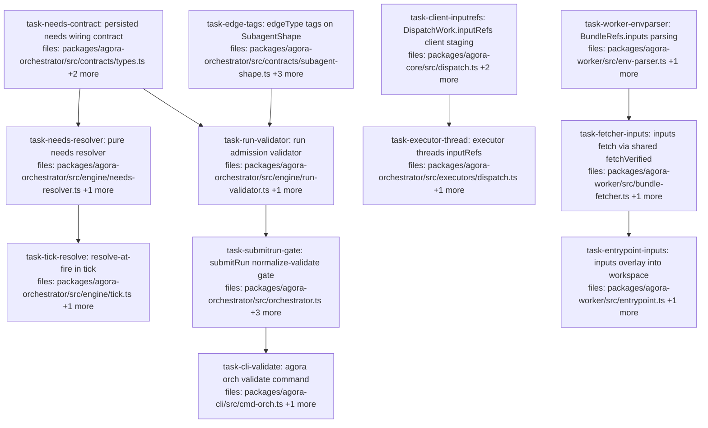

## Context

**Wave B of the typed-product handoff** — the input seam + wiring + validation. Driven by
`docs/superpowers/specs/2026-06-04-agora-typed-product-handoff-design.md` §3 (needs wiring), §4
(resolve-at-fire), §5 input side, §6 (validation). Authored against `feat/handoff-wave-a-output-seam`
(Wave A complete: `outputRefs` exist on `ItemState`/`ExecutionResult`; the worker `outputs/` capture is
live). Wave C (provability: manifest `inputRefs`, `verifyBundle` handoff check, dependent-edit demo)
follows in a separate plan.

After this wave, a static dependent DAG actually flows: `needs` declares "input X = upstream A's
product" → `submitRun` normalizes (auto-union into `depends_on`) and **validates** the whole DAG before
anything runs → `tick` resolves the refs at fire (store never mutated) → the executor threads them into
`DispatchWork.inputRefs` → the client ships them in the existing `AGORA_BUNDLE_REFS_JSON` channel → the
worker fetch-verifies and materializes them at `workspace/inputs/<key>` via the existing overlay engine.

### Pinned cross-task contracts (do not drift)

1. **`InputBinding` wire shape** (contracts):
   `needs?: Record<string, InputBinding>` where
   `InputBinding = { from: string; select: { kind: 'patch' } | { kind: 'output'; path: string } }`.
2. **Reserved carrier key** (tick → executor, NOT FireContext — the V1-D4 guard):
   the resolved item passed to `fire` carries `inputs.inputRefs: Record<string, string>`
   (input key → already-pinned `agora://…/sha256:…` URI of the upstream product).
3. **`bundleRefs.inputs` wire shape** (client → worker, cross-package, pinned like Wave A's sentinel):
   `Array<{ key: string; uri: string; contentHash: string }>` riding inside the existing
   `AGORA_BUNDLE_REFS_JSON` env var. `contentHash` is the `sha256:…` segment already embedded in the
   pinned URI. **No new env var; no new stager** — input refs are already-stored upstream products
   (spec §5: pass-through, no registration/serialization/credential-scan).
4. **Inputs fetch = RAW-BYTES hash verification** (capability-style, `computeContentHash(bytes)` — NOT
   canonical-JSON like subagent/env). Upstream products (patches, artifacts) are opaque bytes.
   `FetchedBundles.inputs: Array<{ key: string; bytes: Uint8Array }>`.
5. **edgeType tags, minimal v1** (shape additions, all optional):
   `outputEdgeType?: string` (the shape's primary product tag, e.g. `'patch-ref'`) and
   `inputEdgeTypes?: Record<string, string>` (input key → expected tag). Validation rule: when BOTH
   sides of an edge declare tags they must match; when either side is undeclared the edge passes
   structural checks only (permissive — tags are new; dev pack declares them).

### Spec deviation (recorded): validation gate lives in `orchestrator.submitRun`, not `OperationsApi.submit`

The spec (§6) named `operations-api.submit` as the chokepoint. Ground truth: `operations-api.ts` is
**D3-guarded client-only** ("MUST NOT import or reference: store, … dispatch" — `operations-api.ts:4`)
and has no `PackRegistry`; `AgoraOrchestrator` already holds `packs` (`orchestrator.ts:23,52`) and
**every ingestion path converges on `submitRun()`** right before `saveRun` (manual, serve driver
`driver.ts:49` — whose try/catch already dead-letters a throwing submission — and the cron producer via
serve). So: `normalizeRun` + `validateRun(run, this.packs)` run inside `submitRun` (authoritative,
fail-fast, before anything persists); the CLI `agora orch validate` calls the same pure `validateRun`
packs-less (structural checks). One pure validator, two callers — the DRY intent of §6 is preserved.

### Conventions (spec §10, proven in Wave A)

SQLite columns via the idempotent `MIGRATIONS` array; pure decision helpers in `engine/<name>.ts`
(`dep-resolver`/`lock-manager` pattern) — `tick` orchestrates, helpers decide; new barrel exports must
update `test/barrel-surface.test.ts`; every test snippet below quotes the REAL harness of the file it
extends — implementers must follow those harnesses, not invent new ones.

## Tasks

## Task: persisted needs wiring contract

```yaml
id: task-needs-contract
depends_on: []
files:
  - packages/agora-orchestrator/src/contracts/types.ts
  - packages/agora-orchestrator/src/runstate/sqlite.ts
  - packages/agora-orchestrator/test/runstate-sqlite.test.ts
status: pending
```

The `needs` contract (spec §3): `InputBinding`/`OutputSelector` types colocated with `WorkItem` in
`contracts/types.ts`, plus SQLite persistence via the exact Wave-A/#37 column pattern. `needs` is
*submitted* data (like `depends_on`): written in the `saveRun` INSERT, never mutated after.

## Implementation

```typescript
// contracts/types.ts — beside WorkItem (colocated, the contract-module convention)
/** Selects WHICH typed product of an upstream item a binding consumes (spec §3). */
export type OutputSelector =
  | { kind: 'patch' }                 // the upstream's resultRef (dev patchRef) — degenerate dev case
  | { kind: 'output'; path: string }; // a file the upstream wrote to outputs/ (Wave A outputRefs)

/** One typed-product handoff edge: input key -> upstream product. */
export interface InputBinding {
  from: string;            // upstream WorkItem id in the same Run
  select: OutputSelector;
}

// WorkItem gains (after depends_on):
/** Typed-product handoff wiring: input key -> upstream product (spec §3).
 *  Auto-unioned into depends_on at submit-normalization. */
needs?: Record<string, InputBinding>;

// runstate/sqlite.ts — the #37/Wave-A column pattern:
//   ItemRow: needs: string | null;
//   CREATE TABLE: ..., needs TEXT, ...   (beside depends_on)
//   MIGRATIONS: append ['needs', 'TEXT']
//   saveRun INSERT: needs is SUBMITTED data -> JSON.stringify(it.needs) ?? NULL in the insert values
//   rowToItem: needs: r.needs ? JSON.parse(r.needs) : undefined,
```

```typescript
// packages/agora-orchestrator/test/runstate-sqlite.test.ts (new cases, exact style of the
// existing "persists and reads back verify" case at :260 — queue 'default', getItems(runId))
it('persists and reads back needs through saveRun', () => {
  const store = new SqliteRunStateStore();
  store.ensureQueue('default', 1);
  store.saveRun({ id: 'rn', queue: 'default', items: [
    { id: 'b', executor: 'x', inputs: {}, depends_on: ['a'], resourceLocks: [],
      needs: { patch: { from: 'a', select: { kind: 'patch' } } } }] });
  expect(store.getItems('rn').find((i) => i.id === 'b')!.needs)
    .toEqual({ patch: { from: 'a', select: { kind: 'patch' } } });
});
// plus an "item without needs reads back undefined" sibling, mirroring the verify one at :270
```

## Acceptance criteria

- `saveRun` round-trips `needs` through `getItems` (deep-equal in === out); absent `needs` reads back
  `undefined` (not `null`).
- Migration is idempotent (pre-existing DB gains the column; double-open is a no-op — existing
  `MIGRATIONS` behavior).
- `needs` is optional everywhere; all existing orchestrator tests compile and pass unchanged.

Test file: `packages/agora-orchestrator/test/runstate-sqlite.test.ts`.

## Task: edgeType tags on SubagentShape

```yaml
id: task-edge-tags
depends_on: []
files:
  - packages/agora-orchestrator/src/contracts/subagent-shape.ts
  - packages/agora-orchestrator/src/packs/dev.ts
  - packages/agora-orchestrator/test/subagent-shape.test.ts
  - packages/agora-orchestrator/test/packs/dev.test.ts
status: pending
```

The typed-product tag surface (spec §6, pinned contract #5): two optional fields on `SubagentShape`,
light checks in `validateShape`, and the dev pack declares its tags (`patch-ref` end to end).

## Implementation

```typescript
// contracts/subagent-shape.ts — SubagentShape gains (after outputSchema):
/** Edge-type tag of this shape's primary product (e.g. 'patch-ref'). Optional;
 *  when both ends of a needs edge declare tags, validateRun requires a match. */
outputEdgeType?: string;
/** Expected edge-type tag per typed input key (e.g. { patch: 'patch-ref' }). */
inputEdgeTypes?: Record<string, string>;

// validateShape additions (same throw style as the existing checks):
//   if outputEdgeType is present it must be a non-empty string;
//   if inputEdgeTypes is present every value must be a non-empty string.

// packs/dev.ts:
//   devCodeEdit gains  outputEdgeType: 'patch-ref'
//   devVerify   gains  inputEdgeTypes: { patch: 'patch-ref' }
```

```typescript
// test/subagent-shape.test.ts (new cases in the existing makeShape() style)
it('rejects an empty outputEdgeType', () => {
  expect(() => validateShape(makeShape({ outputEdgeType: '' }))).toThrow(/outputEdgeType/);
});
it('accepts a shape with declared edge-type tags', () => {
  expect(() => validateShape(makeShape({
    outputEdgeType: 'patch-ref', inputEdgeTypes: { patch: 'patch-ref' },
  }))).not.toThrow();
});
```

## Acceptance criteria

- `validateShape` accepts shapes with/without tags; rejects empty-string tags
  (`outputEdgeType: ''`, `inputEdgeTypes: { x: '' }`) with a message naming the field.
- `devCodeEdit.outputEdgeType === 'patch-ref'`; `devVerify.inputEdgeTypes` maps `patch → 'patch-ref'`
  (asserted in `packs/dev.test.ts` beside the existing tier assertions).
- Existing shape/pack tests pass unchanged (the fields are optional).

Test file: `packages/agora-orchestrator/test/subagent-shape.test.ts`.

## Task: pure needs resolver

```yaml
id: task-needs-resolver
depends_on: [task-needs-contract]
files:
  - packages/agora-orchestrator/src/engine/needs-resolver.ts
  - packages/agora-orchestrator/test/needs-resolver.test.ts
status: pending
```

The resolve-at-fire decision helper (spec §4) as a **pure, IO-free** `engine/` module — the
`dep-resolver`/`lock-manager` pattern. Takes already-fetched items; returns the resolved ref map or an
error. `tick` (separate task) applies the result to the store.

## Implementation

```typescript
// packages/agora-orchestrator/src/engine/needs-resolver.ts (NEW)
import type { ItemState, OutputSelector } from '../contracts/types.js';

/** Selects the upstream product ref for one binding. undefined = product missing. */
export function selectProductRef(upstream: ItemState, sel: OutputSelector): string | undefined {
  if (sel.kind === 'patch') return upstream.resultRef;
  return upstream.outputRefs?.[sel.path];
}

/** PURE resolve-at-fire (spec §4): map each needs binding to its upstream product ref.
 *  Mirrors dep-resolver/lock-manager — no store, no IO; tick passes the items it already fetched. */
export function resolveInputRefs(
  item: ItemState,
  byId: Map<string, ItemState>,
): { inputRefs: Record<string, string> } | { error: string } {
  const inputRefs: Record<string, string> = {};
  for (const [key, binding] of Object.entries(item.needs ?? {})) {
    const upstream = byId.get(binding.from);
    if (!upstream) return { error: `unresolved needs '${key}': unknown upstream '${binding.from}'` };
    const ref = selectProductRef(upstream, binding.select);
    if (!ref) return { error: `unresolved needs '${key}': upstream '${binding.from}' has no such product` };
    inputRefs[key] = ref;
  }
  return { inputRefs };
}
```

```typescript
// packages/agora-orchestrator/test/needs-resolver.test.ts (NEW — pure-function tests,
// the dep-resolver.test.ts style: build ItemState literals, assert decisions)
it('resolves a patch binding to the upstream resultRef', () => {
  const a = { id: 'a', status: 'done', resultRef: 'agora://ns/artifact/d/sha256:aa' } as ItemState;
  const b = { id: 'b', needs: { patch: { from: 'a', select: { kind: 'patch' } } } } as unknown as ItemState;
  expect(resolveInputRefs(b, new Map([['a', a]])))
    .toEqual({ inputRefs: { patch: 'agora://ns/artifact/d/sha256:aa' } });
});
it('returns an error when the selected product is missing', () => {
  const a = { id: 'a', status: 'done' } as ItemState; // no resultRef
  const b = { id: 'b', needs: { patch: { from: 'a', select: { kind: 'patch' } } } } as unknown as ItemState;
  expect(resolveInputRefs(b, new Map([['a', a]]))).toEqual({ error: expect.stringContaining('patch') });
});
```

## Acceptance criteria

- `{ kind: 'patch' }` resolves to `upstream.resultRef`; `{ kind: 'output', path }` resolves to
  `upstream.outputRefs[path]` (both round-tripped in tests, including the output-path case).
- Unknown `from` and missing product each return `{ error }` naming the key and the upstream id —
  never throw.
- An item with no `needs` resolves to `{ inputRefs: {} }`.
- The module imports nothing beyond `contracts/types` (pure — no store/IO).

Test file: `packages/agora-orchestrator/test/needs-resolver.test.ts`.

## Task: run admission validator

```yaml
id: task-run-validator
depends_on: [task-needs-contract, task-edge-tags]
files:
  - packages/agora-orchestrator/src/engine/run-validator.ts
  - packages/agora-orchestrator/test/run-validator.test.ts
status: pending
```

The one pure validator, two callers (Context: spec-deviation note). `normalizeRun` auto-unions
`needs[*].from` into `depends_on` (spec §3); `validateRun(run, packs?)` returns an error list —
structural checks always, shape/edge-tag checks only when `packs` is provided.

## Implementation

```typescript
// packages/agora-orchestrator/src/engine/run-validator.ts (NEW)
import type { Run } from '../contracts/types.js';
import type { PackRegistry } from '../packs/registry.js';

/** Auto-union needs[*].from into depends_on (dedup; spec §3). Pure — returns a new Run. */
export function normalizeRun(run: Run): Run {
  return { ...run, items: run.items.map((it) => {
    const froms = Object.values(it.needs ?? {}).map((b) => b.from);
    return froms.length ? { ...it, depends_on: [...new Set([...it.depends_on, ...froms])] } : it;
  }) };
}

/** Whole-DAG, fail-fast validation (spec §6). Empty array = valid.
 *  Structural always: duplicate item ids; depends_on/needs.from reference existing items;
 *  needs ⊆ depends_on; no depends_on cycles (DFS).
 *  With packs: subagentShape ids resolve; edge-type tags match when BOTH ends declare them
 *  (upstream.outputEdgeType vs downstream.inputEdgeTypes[key]) — mismatch error names the edge:
 *  "edge a->b (patch): patch-ref->dataset-ref incompatible; needs an adapter block". */
export function validateRun(run: Run, packs?: PackRegistry): string[] { /* ... */ }
```

```typescript
// packages/agora-orchestrator/test/run-validator.test.ts (NEW — pure-function tests)
it('normalizeRun unions needs.from into depends_on without duplicates', () => {
  const run = { id: 'r', queue: 'q', items: [
    { id: 'a', executor: 'x', inputs: {}, depends_on: [], resourceLocks: [] },
    { id: 'b', executor: 'x', inputs: {}, depends_on: ['a'], resourceLocks: [],
      needs: { patch: { from: 'a', select: { kind: 'patch' as const } } } }] };
  expect(normalizeRun(run).items[1].depends_on).toEqual(['a']);
});
it('flags an edge whose declared tags mismatch', () => {
  // packs: upstream shape outputEdgeType 'patch-ref'; downstream inputEdgeTypes { x: 'dataset-ref' }
  // expect validateRun(normalizeRun(run), packs) to contain a string matching /incompatible.*adapter block/
});
it('detects a depends_on cycle', () => {
  // a depends_on b, b depends_on a -> ['run r: depends_on cycle involving a'] (message names an item)
});
```

## Acceptance criteria

- `normalizeRun` is idempotent (`normalizeRun(normalizeRun(r))` deep-equals `normalizeRun(r)`) and
  never drops existing `depends_on` entries.
- Structural errors each produce one human-readable string naming the item/edge: duplicate id, unknown
  `depends_on` ref, unknown `needs.from`, needs⊄depends_on (pre-normalized input), cycle.
- With `packs`: unknown `subagentShape` flagged; tag mismatch flagged with the
  `…incompatible; needs an adapter block` phrasing; **either end undeclared ⇒ no tag error** (permissive).
- `validateRun` on a valid normalized dev-pack run (code-edit → verify via `needs`) returns `[]`.

Test file: `packages/agora-orchestrator/test/run-validator.test.ts`.

## Task: resolve-at-fire in tick

```yaml
id: task-tick-resolve
depends_on: [task-needs-resolver]
files:
  - packages/agora-orchestrator/src/engine/tick.ts
  - packages/agora-orchestrator/test/tick-refs.test.ts
status: pending
```

`tick` applies the pure resolver in the fire path (spec §4): resolve **before** `inputSchema`
validation, merge into a transient resolved item under the reserved `inputs.inputRefs` carrier key
(pinned contract #2), fire the resolved item. The store is never mutated; `FireContext` untouched
(V1-D4 guard).

## Implementation

```typescript
// engine/tick.ts — in the fire loop (currently :82-118), BEFORE the subagentShape block:
const byId = new Map(store.getItems().map((i) => [i.id, i]));   // hoist once above the loop
// ...inside the loop:
let fireItem = it;
if (it.needs && Object.keys(it.needs).length > 0) {
  const r = resolveInputRefs(it, byId);
  if ('error' in r) {
    store.setStatus(it.id, 'failed', r.error);
    store.releaseLocks(it.id);
    continue;
  }
  fireItem = { ...it, inputs: { ...it.inputs, inputRefs: r.inputRefs } }; // reserved carrier key
}
// existing shape validation now parses fireItem.inputs; existing fire call becomes ex.fire(fireItem, {...})
```

```typescript
// test/tick-refs.test.ts (existing harness style — fake Executor capturing fire args)
it('resolves needs into inputs.inputRefs on the fired item', async () => {
  const store = new SqliteRunStateStore();
  store.ensureQueue('default', 2);
  store.saveRun({ id: 'r', queue: 'default', items: [
    { id: 'a', executor: 'x', inputs: {}, depends_on: [], resourceLocks: [] },
    { id: 'b', executor: 'x', inputs: { workerInput: { go: 1 } }, depends_on: ['a'], resourceLocks: [],
      needs: { patch: { from: 'a', select: { kind: 'patch' } } } }] }, 'human:brett');
  store.markReady(['a']);
  const fired: Record<string, unknown>[] = [];
  const ex: Executor = { id: 'x',
    async fire(item) { fired.push(item.inputs); return { dispatchHash: 'd-' + item.id }; },
    async reconcile() { return { status: 'done' as const, resultRef: 'agora://ns/artifact/a/sha256:aa' }; } };
  await tick(store, { x: ex }, 'default', undefined, { maxAttempts: 1 }); // fires a
  await tick(store, { x: ex }, 'default', undefined, { maxAttempts: 1 }); // reconciles a, readies+fires b
  expect(fired[1].inputRefs).toEqual({ patch: 'agora://ns/artifact/a/sha256:aa' });
});
```

## Acceptance criteria

- A downstream item with `needs` fires with `inputs.inputRefs` resolved from the upstream's stored
  `resultRef` (and, in a second case, from `outputRefs[path]` for `{ kind: 'output' }`).
- The SUBMITTED inputs in the store are unchanged after fire (read back via `getItems` — immutability).
- A missing product (upstream done but no `resultRef`) fails the item with the resolver's error and
  releases locks; it never fires.
- Items without `needs` fire exactly as before (`fireItem === it`); existing tick tests pass unchanged.

Test file: `packages/agora-orchestrator/test/tick-refs.test.ts`.

## Task: submitRun normalize-validate gate

```yaml
id: task-submitrun-gate
depends_on: [task-run-validator]
files:
  - packages/agora-orchestrator/src/orchestrator.ts
  - packages/agora-orchestrator/src/index.ts
  - packages/agora-orchestrator/test/orchestrator.test.ts
  - packages/agora-orchestrator/test/barrel-surface.test.ts
status: pending
```

The authoritative gate (Context: spec-deviation note): `submitRun` normalizes, validates against
`this.packs`, throws on errors (the serve driver's existing try/catch dead-letters it), and extends its
id-namespacing to `needs[*].from`. Barrel-exports the validator for the CLI.

## Implementation

```typescript
// orchestrator.ts — submitRun (currently :62-81) becomes:
submitRun(run: Run, actor?: string, submittedAt?: string): string {
  if (this.store.getItems(run.id).length > 0) return run.id; // idempotent no-op (unchanged)
  const normalized = normalizeRun(run);
  const errors = validateRun(normalized, this.packs);
  if (errors.length) throw new Error(`run '${run.id}' failed validation:\n${errors.join('\n')}`);
  // existing namespacing extends to needs.from:
  const nsRun: Run = { ...normalized, items: normalized.items.map((it) => ({
    ...it,
    id: ns(run.id, it.id),
    depends_on: it.depends_on.map((d) => ns(run.id, d)),
    ...(it.needs ? { needs: Object.fromEntries(Object.entries(it.needs).map(
      ([k, b]) => [k, { ...b, from: ns(run.id, b.from) }])) } : {}),
  })) };
  // ...saveRun / markReady / audit unchanged
}

// index.ts barrel additions:
export { validateRun, normalizeRun } from './engine/run-validator.js';
export { resolveInputRefs, selectProductRef } from './engine/needs-resolver.js';
```

```typescript
// test/orchestrator.test.ts (existing makeOrch(store) harness at :13)
it('rejects a run whose needs reference a missing item', () => {
  const store = new SqliteRunStateStore();
  const orch = makeOrch(store);
  expect(() => orch.submitRun({ id: 'r', queue: 'default', items: [
    { id: 'b', executor: 'x', inputs: {}, depends_on: [], resourceLocks: [],
      needs: { patch: { from: 'ghost', select: { kind: 'patch' } } } }] }, 'human:t'))
    .toThrow(/ghost/);
  expect(store.getItems('r')).toHaveLength(0); // nothing persisted on validation failure
});
it('auto-unions and namespaces needs.from so resolution works post-ingestion', () => {
  // submit a->b via needs only (no explicit depends_on on b); assert the stored b has
  // depends_on === [ns('r','a')] and needs.patch.from === ns('r','a')
});
```

## Acceptance criteria

- Invalid runs throw BEFORE `saveRun` (store stays empty) with all validation errors in the message.
- `needs`-only wiring works end to end post-ingestion: stored `depends_on` contains the namespaced
  upstream id and stored `needs[*].from` is namespaced identically (so tick's resolver finds it).
- Valid runs (with and without `needs`) submit exactly as before; existing orchestrator/serve/cron
  tests pass unchanged; the serve driver dead-letters an invalid submission (covered by the existing
  driver error path — assert via an orchestrator-level throw test, not a new serve test).
- `validateRun`/`normalizeRun`/`resolveInputRefs`/`selectProductRef` are importable from the package
  root (`barrel-surface.test.ts` extended in its existing style).

Test file: `packages/agora-orchestrator/test/orchestrator.test.ts`.

## Task: agora orch validate command

```yaml
id: task-cli-validate
depends_on: [task-submitrun-gate]
files:
  - packages/agora-cli/src/cmd-orch.ts
  - packages/agora-cli/test/cmd-orch.test.ts
status: pending
```

Pre-flight CLI surface (spec §6, corrected namespace `agora orch validate`): a `validate <plan.json>`
sibling of `submit` in `cmd-orch.ts`, calling the barrel-exported pure `validateRun` packs-less
(structural checks; the authoritative packs-aware gate runs server-side at submit).

## Implementation

```typescript
// packages/agora-cli/src/cmd-orch.ts — beside the submit command (:23), same conventions:
o.command('validate <plan.json>').description('Statically validate a run plan (structure, edges, cycles)')
  .action(async (file) => {
    const run = JSON.parse(await readFile(file, 'utf8'));
    const errors = validateRun(normalizeRun(run));
    if (errors.length) {
      for (const e of errors) console.error(e);
      process.exitCode = 1;
      return;
    }
    console.log(JSON.stringify({ valid: true, items: run.items.length }));
  });
// imports: validateRun, normalizeRun from '@quarry-systems/agora-orchestrator' (already a dependency —
// cmd-orch.ts imports OperationsApi from it today)
```

```typescript
// packages/agora-cli/test/cmd-orch.test.ts (existing harness: makeFakeTransport/makeOrchContext/
// makeCtx/captureLog + program.parseAsync([...], { from: 'user' }))
it('validate prints valid:true for a well-formed plan and makes no transport calls', async () => {
  const transport = makeFakeTransport();
  const ctx = makeCtx(makeOrchContext({ transport }));
  const planPath = join(tmpDir, 'plan.json');
  await writeFile(planPath, JSON.stringify({ id: 'r', queue: 'default', items: [
    { id: 'a', executor: 'noop', inputs: {}, depends_on: [], resourceLocks: [] }] }));
  const program = new Command();
  attachOrchCmd(program, ctx);
  const logs = await captureLog(() => program.parseAsync(['orch', 'validate', planPath], { from: 'user' }));
  expect(JSON.parse(logs[0]).valid).toBe(true);
  expect(transport._submissions).toHaveLength(0);
});
```

## Acceptance criteria

- Valid plan → single-line JSON `{ valid: true, items: N }` on stdout, exit code 0, zero transport calls.
- Invalid plan (e.g. `needs.from` referencing a missing item, or a cycle) → each error on stderr,
  `process.exitCode = 1`, zero transport calls.
- Existing orch subcommands unchanged (existing cmd-orch tests pass).

Test file: `packages/agora-cli/test/cmd-orch.test.ts`.

## Task: DispatchWork.inputRefs client staging

```yaml
id: task-client-inputrefs
depends_on: []
files:
  - packages/agora-core/src/dispatch.ts
  - packages/agora-client/src/dispatch.ts
  - packages/agora-client/test/dispatch-fire.test.ts
status: pending
is_wiring_task: true
```

Wires the per-dispatch input-ref channel across the core contract and the client staging path (pinned
contract #3): `DispatchWork.inputRefs` (key → already-pinned URI), passed through into the existing
`bundleRefs` object / `AGORA_BUNDLE_REFS_JSON` env var, and surfaced on `InFlightDispatch.resolved`
for the Wave-C manifest. No new env var, no registration, no scanning — pure ref pass-through.

## Implementation

```typescript
// agora-core/src/dispatch.ts — DispatchWork gains (NOT `resources`, which is {cpu,memory}):
/** Per-dispatch input artifacts by reference: input key -> already-pinned
 *  agora://…/sha256:… URI of an upstream product (typed-product handoff, spec §5).
 *  Pass-through refs — the blobs already exist in storage. */
inputRefs?: Record<string, string>;

// agora-client/src/dispatch.ts:
// (1) bundleRefs assembly (:183-211) gains:
//     inputs: Object.entries(work.inputRefs ?? {}).map(([key, uri]) => ({
//       key, uri, contentHash: 'sha256:' + uri.split('/sha256:')[1],  // hash segment of the pinned URI
//     })),
//     — reject (throw) an inputRefs URI that has no sha256 segment: unpinned refs are a caller bug.
// (2) InFlightDispatch.resolved (:332-341) gains: inputRefs: work.inputRefs ?? {},
//     and the `resolved` interface (:71-86) gains inputRefs: Record<string, string>;
```

```typescript
// packages/agora-client/test/dispatch-fire.test.ts (existing harness: makeMemoryStorage().seed(...),
// fake ComputeProvider capturing spec, then parse spec.env.AGORA_BUNDLE_REFS_JSON)
it('threads inputRefs into bundleRefs.inputs with the hash from the pinned URI', async () => {
  // ...standard harness setup (seed subagent, fake compute capturing spec)...
  const uri = 'agora://ns/artifact/d-up/sha256:' + 'a'.repeat(64);
  const inflight = await client.dispatch.fire({
    subagent: 's', target: 'prod', workerImage: 'img', inputRefs: { patch: uri },
  });
  const bundleRefs = JSON.parse(capturedSpec.env.AGORA_BUNDLE_REFS_JSON);
  expect(bundleRefs.inputs).toEqual([{ key: 'patch', uri, contentHash: 'sha256:' + 'a'.repeat(64) }]);
  expect(inflight.resolved.inputRefs).toEqual({ patch: uri });
});
```

## Acceptance criteria

- `bundleRefs.inputs` is `[{ key, uri, contentHash }]` inside `AGORA_BUNDLE_REFS_JSON`; `contentHash`
  equals the URI's `sha256:` segment; omitted/empty `inputRefs` yields `inputs: []` (old workers
  tolerate it — additive JSON field).
- An unpinned URI (no `sha256:` segment) throws a clear error BEFORE the container starts.
- `InFlightDispatch.resolved.inputRefs` carries the map verbatim (refs only — for the Wave-C manifest).
- Existing dispatch/dispatch-fire tests pass unchanged.

Test file: `packages/agora-client/test/dispatch-fire.test.ts`.

## Task: executor threads inputRefs

```yaml
id: task-executor-thread
depends_on: [task-client-inputrefs]
files:
  - packages/agora-orchestrator/src/executors/dispatch.ts
  - packages/agora-orchestrator/test/executors/dispatch.test.ts
status: pending
```

`DispatchExecutor.fire` reads the reserved `item.inputs.inputRefs` carrier (pinned contract #2 — set by
tick's resolve-at-fire) and threads it into `client.dispatch.fire({ …, inputRefs })` (spec §4). Shape
guard, not trust guard: the carrier is orchestrator-produced.

## Implementation

```typescript
// executors/dispatch.ts — in fire(), beside the existing inputs.{subagent,env,workerInput} reads (:42-56):
const rawRefs = item.inputs.inputRefs;
const inputRefs = rawRefs && typeof rawRefs === 'object'
  ? Object.fromEntries(Object.entries(rawRefs as Record<string, unknown>)
      .filter(([, v]) => typeof v === 'string')) as Record<string, string>
  : undefined;
const flight = await this.opts.client.dispatch.fire({
  subagent, env: ..., input: ..., target: ..., workerImage: ..., secrets: ...,
  ...(inputRefs && Object.keys(inputRefs).length ? { inputRefs } : {}),
});
```

```typescript
// test/executors/dispatch.test.ts (existing fake-client harness — the fire tests already
// capture the DispatchWork passed to client.dispatch.fire; extend in that style)
it('threads inputs.inputRefs into the dispatch work', async () => {
  // fire a WorkItem whose inputs carry { subagent: 's', inputRefs: { patch: 'agora://…sha256:aa' } }
  // assert the captured work.inputRefs deep-equals { patch: 'agora://…sha256:aa' }
});
it('omits inputRefs from the dispatch work when the carrier is absent', async () => {
  // fire a WorkItem without inputs.inputRefs; assert captured work.inputRefs is undefined
});
```

## Acceptance criteria

- `inputs.inputRefs` present → `DispatchWork.inputRefs` deep-equals it; absent/empty → the field is
  omitted from the dispatch work entirely.
- Non-string values in the carrier are dropped (shape guard) without failing the dispatch.
- Existing executor tests (incl. Wave A sentinel cases) pass unchanged.

Test file: `packages/agora-orchestrator/test/executors/dispatch.test.ts`.

## Task: BundleRefs.inputs parsing

```yaml
id: task-worker-envparser
depends_on: []
files:
  - packages/agora-worker/src/env-parser.ts
  - packages/agora-worker/test/env-parser.test.ts
status: pending
model_hint: cheap
```

Worker-side wire type for pinned contract #3: `BundleRefs` gains optional
`inputs?: Array<{ key: string; uri: string; contentHash: string }>`, tolerant when absent (old
clients), shape-validated when present (same throw style as the existing field checks).

## Implementation

```typescript
// env-parser.ts — beside BundleRef (:4-7):
export interface InputRefEntry { key: string; uri: string; contentHash: string; }
// BundleRefs (:9-13) gains: inputs?: InputRefEntry[];
// validation block (:83-92) extends: if bundleRefs.inputs is present and not an array of
// { key: string, uri: string, contentHash: string } objects -> throw the same
// "AGORA_BUNDLE_REFS_JSON ..." error style naming the inputs field.
```

```typescript
// test/env-parser.test.ts (existing baseEnv() helper style)
it('parses bundleRefs.inputs when present', () => {
  const env = baseEnv();
  env.AGORA_BUNDLE_REFS_JSON = JSON.stringify({
    subagent: { uri: 's3://b/sub', contentHash: 'sha256:aaa' }, capabilities: [], env: [],
    inputs: [{ key: 'patch', uri: 'agora://ns/artifact/d/sha256:bb', contentHash: 'sha256:bb' }],
  });
  expect(parseWorkerEnv(env).bundleRefs.inputs)
    .toEqual([{ key: 'patch', uri: 'agora://ns/artifact/d/sha256:bb', contentHash: 'sha256:bb' }]);
});
it('tolerates absent inputs (old clients)', () => {
  expect(parseWorkerEnv(baseEnv()).bundleRefs.inputs).toBeUndefined();
});
```

## Acceptance criteria

- Present + well-formed `inputs` round-trips; absent `inputs` parses to `undefined` (no throw).
- Malformed `inputs` (non-array, or an entry missing `key`/`uri`/`contentHash` strings) throws the
  existing `AGORA_BUNDLE_REFS_JSON` error style naming `inputs`.
- All existing env-parser tests pass unchanged.

Test file: `packages/agora-worker/test/env-parser.test.ts`.

## Task: inputs fetch via shared fetchVerified

```yaml
id: task-fetcher-inputs
depends_on: [task-worker-envparser]
files:
  - packages/agora-worker/src/bundle-fetcher.ts
  - packages/agora-worker/test/bundle-fetcher.test.ts
status: pending
```

The DRY fetch (spec §5/§10): a shared raw-bytes `fetchVerified` helper absorbs the new inputs fetch
instead of a 4th near-duplicate block, and the existing capability block (the other raw-bytes case)
folds onto it. Subagent/env blocks (canonical-JSON hashing) stay as they are. Inputs verify by RAW
bytes (pinned contract #4).

## Implementation

```typescript
// bundle-fetcher.ts:
/** Fetch raw bytes and verify their content hash (capability/input-style raw-bytes check). */
async function fetchVerified(uri: string, contentHash: string, storage: StorageProvider): Promise<Uint8Array> {
  const bytes = await storage.get(uri);
  const actual = computeContentHash(bytes);
  if (actual !== contentHash) throw new IntegrityMismatchError(contentHash, actual);
  return bytes;
}

// FetchedBundles (:32-36) gains: inputs: Array<{ key: string; bytes: Uint8Array }>;
// fetchBundles: capability block (:133-145) refactors onto fetchVerified (behavior identical);
// new block 4: for (const inp of refs.inputs ?? []) -> fetchVerified(inp.uri, inp.contentHash, storage)
//   -> inputs.push({ key: inp.key, bytes }); return { subagentDef, capabilities, envs, inputs };
```

```typescript
// test/bundle-fetcher.test.ts (existing FakeStorage.set + refs + fetchBundles style)
it('fetches and raw-bytes-verifies input refs', async () => {
  const bytes = new TextEncoder().encode('diff --git a/x b/x');
  const storage = new FakeStorage().set('agora://ns/artifact/d/sha256:p', bytes);
  const refs: BundleRefs = { subagent: subRef(storage), capabilities: [], env: [],
    inputs: [{ key: 'patch', uri: 'agora://ns/artifact/d/sha256:p', contentHash: computeContentHash(bytes) }] };
  const result = await fetchBundles(refs, storage);
  expect(result.inputs).toEqual([{ key: 'patch', bytes }]);
});
it('throws IntegrityMismatchError on a tampered input blob', async () => {
  // same setup, but contentHash: 'sha256:wrong' -> await expect(...).rejects.toBeInstanceOf(IntegrityMismatchError)
});
```

## Acceptance criteria

- Inputs fetch verifies RAW bytes (`computeContentHash(bytes)`), returns `{ key, bytes }` in declared
  order; absent `refs.inputs` yields `inputs: []`.
- Hash mismatch throws `IntegrityMismatchError` (the existing error type) — integrity-on-read.
- The capability block's behavior is unchanged after folding onto `fetchVerified` (existing capability
  tests, incl. the tamper test, pass unchanged); subagent/env canonical-JSON verification untouched.

Test file: `packages/agora-worker/test/bundle-fetcher.test.ts`.

## Task: inputs overlay into workspace

```yaml
id: task-entrypoint-inputs
depends_on: [task-fetcher-inputs]
files:
  - packages/agora-worker/src/entrypoint.ts
  - packages/agora-worker/test/entrypoint.test.ts
status: pending
```

Materialization (spec §5, pinned contract #2's worker end): Step 6 builds one extra `inputs` bundle
(`{ 'inputs/<key>': bytes }`) and passes it **in the same `overlayCapabilities` call** as the
capability bundles — one pass, no second code path. Consumption ≠ materialization: nothing interprets
the bytes; `inputs/` lands before `captureBaseline`, and the existing patch-capture excludes nothing
extra (an unchanged materialized input never diffs; agents shouldn't edit `inputs/`).

## Implementation

```typescript
// entrypoint.ts — Step 6 (:273-293): extend the bundles array in the SAME overlay call:
const capabilityBundles: CapabilityBundle[] = bundles.capabilities.map(...); // unchanged
const overlayBundles = [...capabilityBundles];
if (bundles.inputs.length > 0) {
  overlayBundles.push({
    name: 'inputs',
    files: Object.fromEntries(bundles.inputs.map((i) => [`inputs/${i.key}`, i.bytes])),
  });
}
await overlayCapabilities({ workspaceDir, bundles: overlayBundles, adapter });
```

```typescript
// test/entrypoint.test.ts (existing setupHarness/makeDeps/runWorker harness — extend
// setupHarness opts with an `inputs?:` entry that seeds the blob in FakeStorage and adds
// the bundleRefs.inputs entry, the same opts-extension pattern as `verify?:`/`onInvoke?:`)
it('materializes input refs at workspace/inputs/<key> before the adapter runs', async () => {
  const h = await setupHarness({
    inputs: [{ key: 'patch.diff', bytes: new TextEncoder().encode('diff --git a/x b/x') }],
    onInvoke: async (spec) => {
      const staged = await readFile(join(spec.workspaceDir, 'inputs', 'patch.diff'), 'utf8');
      if (!staged.startsWith('diff --git')) throw new Error('input not materialized before invoke');
    },
  });
  cleanupDirs.push(h.workDir, h.adaptersRoot);
  expect(await runWorker(h.env, makeDeps(h))).toBe(0);
});
```

## Acceptance criteria

- A dispatch with `bundleRefs.inputs` materializes each blob at `workspace/inputs/<key>` BEFORE the
  adapter is invoked (asserted from inside `onInvoke`); byte-exact content.
- A tampered input (hash mismatch) fails the dispatch with the existing `integrity-failed` path
  (fetch happens in Step 3 — assert the adapter was never invoked, mirroring the existing
  capability-tamper test).
- A dispatch with no inputs behaves exactly as before (existing entrypoint tests, incl. the Wave A
  outputs cases, pass unchanged).
- An untouched materialized input does NOT appear in the workspace patch (no-change diff behavior —
  baseline is captured after overlay).

Test file: `packages/agora-worker/test/entrypoint.test.ts`.
