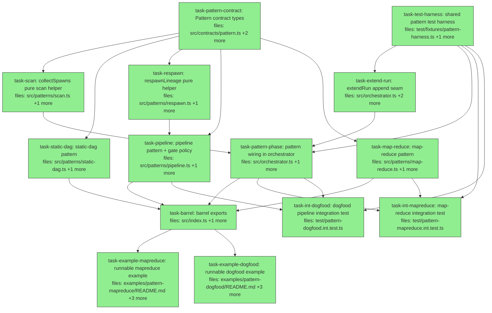

## Context

Implements `docs/superpowers/specs/2026-06-05-agora-pattern-layer-design.md` — the pattern
layer: per-queue execution patterns (`plan` + `onTaskDone → {spawn?}`) over the literally
unchanged engine. Curated set (static-dag, pipeline with gating, map-reduce), the audited
`extendRun` append seam, and two offline demos (fake executors, no API credits).

Key spec invariants every task must honor:

- **`engine/*` is untouched** — zero diffs under `src/engine/`. Pattern hooks and helpers are
  pure; the orchestrator applies their decisions.
- **Spawn is audited**: extendRun normalizes + validates the merged graph via the existing
  `validateRun`/`normalizeRun`, attributes `pattern:<queue>`, appends `'run.extended'`.
- **Replay safety**: deterministic spawn ids + extendRun id-skip; at-least-once `onTaskDone`.
- **`cancelled` is operator intent**: curated patterns never spawn from a cancelled cause.
- Paths below are relative to `packages/agora-orchestrator/` unless they start with `examples/`.

All file paths in `files:` are written repo-relative. Test runner is vitest. Offline test
machinery (id-keyed fake executor that seals manifests, orchestrator factory, drive loops) is
owned ONCE by `task-test-harness` at `test/fixtures/pattern-harness.ts` (sibling of the
existing `test/fixtures/executors.ts`); `task-extend-run`, `task-pattern-phase`, and both
integration tests import it rather than re-inlining the `handoff-dag.int.test.ts` harness.

Consumer-grep results (authoring-time): `AuditEntryKind` has no exhaustive-list test
assertions (additive member is safe); `QueueConfig` is consumed only by `src/index.ts` +
`src/orchestrator.ts` (additive optional field is safe); barrel tests assert presence only
(`test/barrel-surface.test.ts` style) — the new barrel task adds its own surface test file.
`PRIVILEGE` (`contracts/privilege.ts`) DOES have an exhaustive-membership test — extendRun
deliberately gets no entry (see task-extend-run's boundaries).

**Post-landing (controller checklist, not DAG tasks):** (1) update the vault pages per spec §1
— record the `onTaskDone → {route, ready, spawn}` → `{spawn?}` supersession on
`concept-execution-pattern` / `decision-2026-06-04-execution-patterns-are-queue-level`, add
`implementation:` + Shipped notes to `concept-execution-pattern` and
`synthesis-composable-execution-model`; (2) PR sizing is an execution-time choice — the
handoff precedent was wave-sized PRs (a natural split here: contract/harness/patterns/seam →
PR1; wiring/tests/barrel/examples → PR2), but tasks are individually review-gated either way.

## Tasks

## Task: Pattern contract types

```yaml
id: task-pattern-contract
depends_on: []
files:
  - packages/agora-orchestrator/src/contracts/pattern.ts
  - packages/agora-orchestrator/src/contracts/index.ts
  - packages/agora-orchestrator/test/patterns/pattern-contract.test.ts
status: done
```

The pattern layer's public contract (spec §4): `Pattern`, `SpawnDirective`, `PatternContext`,
plus the user-authored config shapes (`GateConfig`, `MapReduceConfig`, `SpawnTemplate`) that
ride reserved `inputs` keys. Lives in `contracts/` per the repo's contract-colocation
convention (the `Trigger` precedent). Re-export from `contracts/index.ts` following its
existing style.

## Implementation

```typescript
// packages/agora-orchestrator/src/contracts/pattern.ts
import type { ItemState, Run, WorkItem } from './types.js';

/** Items a pattern asks to append to a run, in submission (pre-namespace) id space. */
export interface SpawnDirective {
  items: WorkItem[];   // deterministic ids — replay-safe by construction (spec §5.1)
}

export interface PatternContext {
  /** All items of the run, de-namespaced — the pattern's ENTIRE world.
   *  Derived from the store by the orchestrator; patterns never touch the store. */
  runItems: ItemState[];
}

export interface Pattern {
  id: string;          // 'static-dag' | 'pipeline' | 'map-reduce'
  /** Expand/normalize a submission BEFORE validateRun. Pure. Identity for static-dag.
   *  MAY throw a descriptive Error on malformed pattern config — submitRun surfaces it
   *  before saveRun, so the store stays clean (spec §4). */
  plan(run: Run): Run;
  /** Called AT LEAST ONCE per terminal item of an in-scope run, every tick until the run
   *  seals. MUST be pure and idempotent (deterministic spawn ids). Curated patterns never
   *  spawn from a `cancelled` cause (spec §4). */
  onTaskDone(item: ItemState, ctx: PatternContext): SpawnDirective | null;
}

/** A user-declared template for items a pattern will spawn (subset of WorkItem). */
export interface SpawnTemplate {
  executor: string;
  inputs: Record<string, unknown>;
  subagentShape?: string;
  resourceLocks?: string[];
}

/** Gate policy carried on a gate item's reserved `inputs.gate` key (spec §6c). */
export interface GateConfig {
  onRed: 'advance' | 'spawn-fix';
  subject: string;              // itemId whose product is being gated
  fixTemplate?: SpawnTemplate;
  maxFixAttempts?: number;      // default 1
}

/** Map-reduce config carried on the splitter's reserved `inputs.mapReduce` key (spec §6d). */
export interface MapReduceConfig {
  map: SpawnTemplate & { needsKey?: string; outputPath?: string };   // defaults 'input', 'result'
  reduce: SpawnTemplate & { keyPrefix?: string };                    // default 'part'
}

/** One applied scan result: which terminal item caused which spawn (collectSpawns return). */
export interface CollectedSpawn {
  causeItemId: string;     // de-namespaced id of the terminal item that triggered the spawn
  items: WorkItem[];       // pre-namespace id space (extendRun namespaces)
}
```

```typescript
// packages/agora-orchestrator/test/patterns/pattern-contract.test.ts
import { it, expect } from 'vitest';
import type { Pattern } from '../../src/contracts/index.js';   // reachable via contracts barrel
import type { Run } from '../../src/contracts/index.js';

it('a no-op object satisfies the Pattern contract and plan can be identity', () => {
  const noop: Pattern = { id: 'noop', plan: (r: Run) => r, onTaskDone: () => null };
  const run: Run = { id: 'r1', queue: 'default', items: [] };
  expect(noop.plan(run)).toBe(run);
  expect(noop.onTaskDone({} as never, { runItems: [] })).toBeNull();
});
```

## Acceptance criteria

- `Pattern`, `SpawnDirective`, `PatternContext`, `SpawnTemplate`, `GateConfig`,
  `MapReduceConfig`, `CollectedSpawn` are importable from `../../src/contracts/index.js` (the
  contracts barrel).
- A literal `{ id, plan: r => r, onTaskDone: () => null }` type-checks as `Pattern`.
- `contracts/pattern.ts` imports only from `./types.js` — no engine, store, or IO imports.
- `npx vitest run test/patterns/pattern-contract.test.ts` passes.

Test file: `packages/agora-orchestrator/test/patterns/pattern-contract.test.ts`.

## Task: shared pattern test harness

```yaml
id: task-test-harness
depends_on: []
files:
  - packages/agora-orchestrator/test/fixtures/pattern-harness.ts
  - packages/agora-orchestrator/test/fixtures/pattern-harness.test.ts
status: done
```

The shared offline test harness (S7 hoist) — sibling of the existing
`test/fixtures/executors.ts`. Owns the fake-executor + orchestrator + drive-loop machinery
that `task-extend-run`, `task-pattern-phase`, and both integration tests would otherwise each
inline (the duplication `handoff-dag.int.test.ts` set as precedent). Built only on
pre-existing surface — it forwards extra orchestrator options verbatim, so later-landing
fields (`pattern` on `QueueConfig`, `maxItemsPerRun`) flow through without this task depending
on them.

## Why this abstraction

Four sibling tasks need byte-identical harness logic (id-keyed deterministic fake executor
that seals resolved `inputRefs` into manifests, orchestrator factory with audit wiring, tick
drive-loops, blob-backed storage). Without an owner, the first-dispatched implementer's
version gets ad-hoc-duplicated by the other three (plan-quality S7).

## Implementation

```typescript
// packages/agora-orchestrator/test/fixtures/pattern-harness.ts
import { AgoraOrchestrator, type AgoraOrchestratorOptions } from '../../src/orchestrator.js';
import { ManualTrigger } from '../../src/triggers/manual.js';
import { SqliteRunStateStore } from '../../src/runstate/sqlite.js';
import { AuditLog } from '../../src/audit/audit-log.js';
import { NoneSigner } from '../../src/audit/signer.js';
import { LocalAnchor } from '../../src/audit/anchor.js';
import { buildManifest } from '../../src/audit/manifest.js';
import type { Executor } from '../../src/contracts/index.js';

export interface ItemBehavior {
  status: 'done' | 'failed';
  resultRef?: string;
  outputRefs?: Record<string, string>;
  verify?: { passed: boolean };
}

/** Id-keyed deterministic fake: fire() seals the engine-resolved inputs.inputRefs into a
 *  manifest blob (handoff-dag.int.test.ts pattern); reconcile() returns behavior(itemId).
 *  Item ids arrive de-namespaced (the orchestrator wraps executors). */
export function idKeyedExecutor(
  blobs: Map<string, Uint8Array>,
  behavior: (itemId: string) => ItemBehavior,
): Executor { /* ... fire stores manifest in blobs, maps dispatchHash -> itemId ... */ }

/** Orchestrator factory with audit wiring; `extra` is spread into the options verbatim
 *  (queues override, maxItemsPerRun, ...) so this file never references late-landing fields. */
export function makeOrch(
  store: SqliteRunStateStore,
  executor: Executor,
  extra?: Partial<AgoraOrchestratorOptions>,
): { orch: AgoraOrchestrator; anchor: LocalAnchor } { /* ... */ }

export async function driveUntilDone(orch: AgoraOrchestrator, maxTicks = 32): Promise<void> { /* ... */ }
export async function driveUntil(orch: AgoraOrchestrator, pred: () => boolean, maxTicks = 32): Promise<void> { /* ... */ }
export function storageFromBlobs(blobs: Map<string, Uint8Array>): { get(ref: string): Promise<Uint8Array> } { /* ... */ }
```

```typescript
// packages/agora-orchestrator/test/fixtures/pattern-harness.test.ts
import { it, expect } from 'vitest';
import { idKeyedExecutor, makeOrch, driveUntilDone } from './pattern-harness.js';

it('idKeyedExecutor drives a one-item run to the behavior-declared terminal status', async () => {
  const store = new (await import('../../src/runstate/sqlite.js')).SqliteRunStateStore();
  const { orch } = makeOrch(store, idKeyedExecutor(new Map(), () => ({ status: 'done', resultRef: 'agora://r' })));
  orch.submitRun({ id: 'r1', queue: 'default', items: [{ id: 'a', executor: 'dispatch', inputs: {}, depends_on: [], resourceLocks: [] }] }, 'human:test');
  await driveUntilDone(orch);
  expect(orch.getStatus('r1')[0]!.status).toBe('done');
  store.close();
});
```

## Acceptance criteria

- `idKeyedExecutor` returns terminal status/refs per `behavior(itemId)` with de-namespaced
  ids, and seals any engine-resolved `inputs.inputRefs` into a `buildManifest` blob stored in
  `blobs` keyed by `manifestRef` (byte-compatible with `assembleBundle` + `storageFromBlobs`).
- `makeOrch` wires `AuditLog` (NoneSigner + LocalAnchor over the store) and a `default` queue
  (concurrency 5); `extra` options spread last so callers can override/extend.
- `driveUntilDone` stops at all-terminal or maxTicks; `driveUntil` at predicate or maxTicks.
- Imports only pre-existing `src/*` surface — compiles independently of every other task in
  this plan.

Test file: `packages/agora-orchestrator/test/fixtures/pattern-harness.test.ts`.

## Task: collectSpawns pure scan helper

```yaml
id: task-scan
depends_on: [task-pattern-contract]
files:
  - packages/agora-orchestrator/src/patterns/scan.ts
  - packages/agora-orchestrator/test/patterns/scan.test.ts
status: done
```

The pure scan the orchestrator applies (spec §4, audit amendment B): given ONE run's
de-namespaced items and the queue's pattern, call `onTaskDone` for every terminal item and
collect the spawn directives. Mirrors `computeNewlyReady`/`selectRunnable` — no store, no IO.

## Implementation

```typescript
// packages/agora-orchestrator/src/patterns/scan.ts
import type { ItemState } from '../contracts/types.js';
import type { Pattern, CollectedSpawn } from '../contracts/pattern.js';   // S8: contract lives in contracts/

const TERMINAL = new Set(['done', 'failed', 'skipped', 'cancelled']);

/** PURE — runItems are ONE run's items, de-namespaced. The orchestrator groups by run,
 *  de-namespaces, and applies the returned directives via extendRun. */
export function collectSpawns(runItems: ItemState[], pattern: Pattern): CollectedSpawn[] {
  const out: CollectedSpawn[] = [];
  for (const it of runItems) {
    if (!TERMINAL.has(it.status)) continue;
    const d = pattern.onTaskDone(it, { runItems });
    if (d && d.items.length > 0) out.push({ causeItemId: it.id, items: d.items });
  }
  return out;
}
```

```typescript
// packages/agora-orchestrator/test/patterns/scan.test.ts
import { it, expect } from 'vitest';
import { collectSpawns } from '../../src/patterns/scan.js';
import type { Pattern } from '../../src/contracts/pattern.js';

it('invokes onTaskDone only for terminal items and collects non-empty directives', () => {
  const seen: string[] = [];
  const pattern: Pattern = {
    id: 'probe',
    plan: (r) => r,
    onTaskDone: (item) => { seen.push(item.id); return item.id === 'a' ? { items: [{ id: 'spawned', executor: 'x', inputs: {}, depends_on: [], resourceLocks: [] }] } : null; },
  };
  const items = [
    { id: 'a', status: 'done' }, { id: 'b', status: 'running' }, { id: 'c', status: 'failed' },
  ] as never[];
  const collected = collectSpawns(items, pattern);
  expect(seen).toEqual(['a', 'c']);              // 'b' is not terminal
  expect(collected).toEqual([{ causeItemId: 'a', items: [expect.objectContaining({ id: 'spawned' })] }]);
});
```

## Acceptance criteria

- `onTaskDone` is invoked for every item whose status ∈ {done, failed, skipped, cancelled} and
  for NO item in {pending, ready, running}.
- A `null` or empty directive contributes nothing to the result.
- Each collected entry carries the cause item's id and the directive's items, in scan order.
- The module imports nothing beyond `contracts/*` types — pure, no store/IO.

Test file: `packages/agora-orchestrator/test/patterns/scan.test.ts`.

## Task: static-dag pattern

```yaml
id: task-static-dag
depends_on: [task-pattern-contract]
files:
  - packages/agora-orchestrator/src/patterns/static-dag.ts
  - packages/agora-orchestrator/test/patterns/static-dag.test.ts
status: done
model_hint: cheap
```

The inert pattern (spec §6a): identity `plan`, never spawns. Exists so the curated set is
uniform; a queue bound to it behaves exactly like an unbound queue.

## Implementation

```typescript
// packages/agora-orchestrator/src/patterns/static-dag.ts
import type { Pattern } from '../contracts/pattern.js';

export const staticDag: Pattern = {
  id: 'static-dag',
  plan: (run) => run,
  onTaskDone: () => null,
};
```

```typescript
// packages/agora-orchestrator/test/patterns/static-dag.test.ts
import { it, expect } from 'vitest';
import { staticDag } from '../../src/patterns/static-dag.js';

it('plan is identity (same reference) and onTaskDone never spawns', () => {
  const run = { id: 'r', queue: 'q', items: [] };
  expect(staticDag.plan(run)).toBe(run);
  expect(staticDag.onTaskDone({ status: 'done' } as never, { runItems: [] })).toBeNull();
});
```

## Acceptance criteria

- `staticDag.plan(run)` returns the same object reference.
- `staticDag.onTaskDone` returns `null` for items of every terminal status.
- `staticDag.id === 'static-dag'`.

Test file: `packages/agora-orchestrator/test/patterns/static-dag.test.ts`.

## Task: respawnLineage pure helper

```yaml
id: task-respawn
depends_on: [task-pattern-contract]
files:
  - packages/agora-orchestrator/src/patterns/respawn.ts
  - packages/agora-orchestrator/test/patterns/respawn.test.ts
status: done
```

The shared circle-back helper (spec §6c): given a terminal gate, its `GateConfig`, and the
run's items, build the fix item + suffixed copies of the gate and its skipped descendants with
edges remapped through the substitution map S. Returns `[]` when no respawn should happen
(attempt bound exceeded, cancelled member in lineage, missing fixTemplate).

## Implementation

```typescript
// packages/agora-orchestrator/src/patterns/respawn.ts
import type { ItemState, WorkItem } from '../contracts/types.js';
import type { GateConfig } from '../contracts/pattern.js';

/** 'review' -> {base:'review', attempt:1}; 'review~2' -> {base:'review', attempt:2}. */
export function parseAttempt(id: string): { base: string; attempt: number } {
  const m = /^(.*)~(\d+)$/.exec(id);
  return m ? { base: m[1]!, attempt: Number(m[2]) } : { base: id, attempt: 1 };
}

/** PURE. Builds [fix, gateCopy, ...skippedCopies] or [] when respawn must not happen:
 *  - cause attempt > maxFixAttempts (default 1)
 *  - any lineage member (gate or skipped descendant) is `cancelled` (spec §6c)
 *  - no fixTemplate configured
 *  Lineage = the gate + items transitively reachable FROM the gate via depends_on
 *  (i.e. items that depend on it) whose status is 'skipped'.
 *  S = { subject -> fixId, gate.id -> gateCopyId, each skipped d -> `${d}~${next}` }.
 *  Edge remap applies S to every copy's depends_on AND needs[*].from (identity otherwise).
 *  Fix item: id `${base}-fix-${attempt}`; needs.work = subject's patch product; when the
 *  gate is done-but-red AND gate.outputRefs?.['findings'] exists, needs.findings binds it;
 *  when the gate failed, `gateReason: gate.reason` is merged into the fix's inputs (a failed
 *  gate has no outputRefs — provenance closure only admits done producers, spec §6c). */
export function respawnLineage(args: {
  gate: ItemState;
  config: GateConfig;
  runItems: ItemState[];
}): WorkItem[] { /* ... */ }
```

```typescript
// packages/agora-orchestrator/test/patterns/respawn.test.ts
import { it, expect } from 'vitest';
import { respawnLineage, parseAttempt } from '../../src/patterns/respawn.js';

it('failed gate respawns fix + gate~2 + skipped descendants~2 with edges remapped through S', () => {
  const items = [
    { id: 'implement', status: 'done', executor: 'x', inputs: {}, depends_on: [], resourceLocks: [] },
    { id: 'review', status: 'failed', reason: 'red', executor: 'x', inputs: {}, depends_on: ['implement'], resourceLocks: [],
      needs: { work: { from: 'implement', select: { kind: 'patch' } } } },
    { id: 'package', status: 'skipped', executor: 'x', inputs: {}, depends_on: ['review'], resourceLocks: [],
      needs: { work: { from: 'implement', select: { kind: 'patch' } } } },
  ] as never[];
  const out = respawnLineage({
    gate: items[1] as never,
    config: { onRed: 'spawn-fix', subject: 'implement', fixTemplate: { executor: 'x', inputs: {} } },
    runItems: items,
  });
  const ids = out.map((w) => w.id).sort();
  expect(ids).toEqual(['package~2', 'review-fix-1', 'review~2']);
  const pkg = out.find((w) => w.id === 'package~2')!;
  expect(pkg.depends_on).toEqual(['review~2']);                       // gate -> gate copy
  expect(pkg.needs!['work']!.from).toBe('review-fix-1');              // subject -> fix
});
```

## Acceptance criteria

- Failed gate `review` (attempt 1, subject done, one skipped descendant) yields exactly
  `review-fix-1`, `review~2`, `package~2`; copies' `depends_on`/`needs.from` are remapped
  through S; references to items outside S are untouched.
- `review~2` failing yields `review-fix-2`/`review~3`/`package~3` (attempt derives from the
  cause id's `~N` suffix, never from counting existing fix items).
- Cause attempt > `maxFixAttempts` (default 1) → `[]`.
- Any cancelled member in the lineage → `[]`; missing `fixTemplate` → `[]`.
- Failed-gate case: fix has NO needs binding on the gate; `gateReason` appears in fix inputs.
  Done-but-red case with `outputRefs['findings']`: fix gains `needs.findings` on the gate.
- Determinism: two calls with identical args return deeply-equal arrays.
- Diamond downstream (two skipped items both depending on the gate, one shared grandchild)
  copies each skipped item exactly once.

Test file: `packages/agora-orchestrator/test/patterns/respawn.test.ts`.

## Task: pipeline pattern with gate policy

```yaml
id: task-pipeline
depends_on: [task-pattern-contract, task-respawn]
files:
  - packages/agora-orchestrator/src/patterns/pipeline.ts
  - packages/agora-orchestrator/test/patterns/pipeline.test.ts
status: done
```

The pipeline pattern (spec §6b/§6c): `plan` auto-chains items lacking `depends_on` in
submission order (`needs` stays explicit); `onTaskDone` applies gate policy — a terminal gate
item carrying `inputs.gate` with `onRed: 'spawn-fix'` triggers `respawnLineage` when the gate
failed OR is done with `verify.passed === false`. Never spawns from `cancelled` causes.

## Implementation

```typescript
// packages/agora-orchestrator/src/patterns/pipeline.ts
import type { Pattern } from '../contracts/pattern.js';
import type { GateConfig } from '../contracts/pattern.js';
import { respawnLineage } from './respawn.js';

const isGateConfig = (v: unknown): v is GateConfig =>
  !!v && typeof v === 'object' && 'onRed' in v && 'subject' in v;

export const pipeline: Pattern = {
  id: 'pipeline',
  /** Chain: each item with depends_on [] (except the first) depends on the previous item. */
  plan: (run) => ({
    ...run,
    items: run.items.map((it, i) =>
      i > 0 && it.depends_on.length === 0
        ? { ...it, depends_on: [run.items[i - 1]!.id] }
        : it,
    ),
  }),
  onTaskDone: (item, ctx) => {
    if (item.status === 'cancelled') return null;                  // operator intent (spec §4)
    const gate = item.inputs['gate'];
    if (!isGateConfig(gate) || gate.onRed !== 'spawn-fix') return null;
    const red = item.status === 'failed' || (item.status === 'done' && item.verify?.passed === false);
    if (!red) return null;
    const items = respawnLineage({ gate: item, config: gate, runItems: ctx.runItems });
    return items.length > 0 ? { items } : null;
  },
};
```

```typescript
// packages/agora-orchestrator/test/patterns/pipeline.test.ts
import { it, expect } from 'vitest';
import { pipeline } from '../../src/patterns/pipeline.js';

it('plan chains items lacking depends_on in submission order, leaving explicit deps alone', () => {
  const run = { id: 'r', queue: 'q', items: [
    { id: 'a', executor: 'x', inputs: {}, depends_on: [], resourceLocks: [] },
    { id: 'b', executor: 'x', inputs: {}, depends_on: [], resourceLocks: [] },
    { id: 'c', executor: 'x', inputs: {}, depends_on: ['a'], resourceLocks: [] },
  ] };
  const planned = pipeline.plan(run);
  expect(planned.items.map((i) => i.depends_on)).toEqual([[], ['a'], ['a']]);
});
```

## Acceptance criteria

- `plan`: first item keeps `[]`; later no-dep items chain to the immediately preceding item;
  items with explicit `depends_on` are untouched; input run object is not mutated.
- `onTaskDone` spawns (via `respawnLineage`) when the cause is a gate item
  (`inputs.gate.onRed === 'spawn-fix'`) AND (status failed OR done with
  `verify.passed === false`).
- Returns `null` for: non-gate items, `onRed: 'advance'`, green gates (done +
  `verify.passed !== false`), cancelled causes, and when `respawnLineage` returns `[]`.
- Replay: calling `onTaskDone` twice with the same args returns deeply-equal directives
  (idempotency is downstream id-skip; determinism is asserted here).

Test file: `packages/agora-orchestrator/test/patterns/pipeline.test.ts`.

## Task: map-reduce pattern

```yaml
id: task-map-reduce
depends_on: [task-pattern-contract]
files:
  - packages/agora-orchestrator/src/patterns/map-reduce.ts
  - packages/agora-orchestrator/test/patterns/map-reduce.test.ts
status: done
```

The map-reduce pattern (spec §6d): the splitter item carries `inputs.mapReduce`
(`MapReduceConfig`). `plan` validates the config (throw on malformed — fail-fast at submit) and
passes the run through. `onTaskDone(splitter done)` spawns one map per `outputRefs` key;
`onTaskDone(map terminal)` spawns the reduce with spawn-time-concretized `needs` once ALL maps
are done. All state derived from `ctx.runItems` by id convention.

## Implementation

```typescript
// packages/agora-orchestrator/src/patterns/map-reduce.ts
import type { Pattern, MapReduceConfig } from '../contracts/pattern.js';

/** Sorted for determinism — spawn order and reduce key order are stable across replays. */
const sortedKeys = (o: Record<string, unknown>) => Object.keys(o).sort();

export const mapReduce: Pattern = {
  id: 'map-reduce',
  plan: (run) => {
    const splitters = run.items.filter((i) => i.inputs['mapReduce'] !== undefined);
    if (splitters.length > 1) throw new Error(`map-reduce: at most one splitter per run, found ${splitters.length}`);
    if (splitters.length === 1) assertMapReduceConfig(splitters[0]!.inputs['mapReduce']); // throws descriptive Error
    return run;
  },
  onTaskDone: (item, ctx) => {
    if (item.status === 'cancelled') return null;
    const splitter = ctx.runItems.find((i) => i.inputs['mapReduce'] !== undefined);
    if (!splitter || splitter.status !== 'done') return null;
    const cfg = splitter.inputs['mapReduce'] as MapReduceConfig;
    const keys = sortedKeys(splitter.outputRefs ?? {});
    if (keys.length === 0) return null;
    // Phase 1 — cause is the splitter: spawn map-<key> per output (id-skip absorbs replays).
    if (item.id === splitter.id) {
      return { items: keys.map((k) => ({
        id: `map-${k}`,
        executor: cfg.map.executor, inputs: cfg.map.inputs,
        ...(cfg.map.subagentShape ? { subagentShape: cfg.map.subagentShape } : {}),
        depends_on: [], resourceLocks: cfg.map.resourceLocks ?? [],
        needs: { [cfg.map.needsKey ?? 'input']: { from: splitter.id, select: { kind: 'output' as const, path: k } } },
      })) };
    }
    // Phase 2 — cause is a map: when ALL maps are done and no reduce exists, spawn it.
    const byId = new Map(ctx.runItems.map((i) => [i.id, i]));
    if (byId.has('reduce')) return null;
    if (!keys.every((k) => byId.get(`map-${k}`)?.status === 'done')) return null; // any failed -> never all done
    const prefix = cfg.reduce.keyPrefix ?? 'part';
    return { items: [{
      id: 'reduce',
      executor: cfg.reduce.executor, inputs: cfg.reduce.inputs,
      ...(cfg.reduce.subagentShape ? { subagentShape: cfg.reduce.subagentShape } : {}),
      depends_on: [], resourceLocks: cfg.reduce.resourceLocks ?? [],
      needs: Object.fromEntries(keys.map((k) => [
        `${prefix}-${k}`,
        { from: `map-${k}`, select: { kind: 'output' as const, path: cfg.map.outputPath ?? 'result' } },
      ])),
    }] };
  },
};
```

```typescript
// packages/agora-orchestrator/test/patterns/map-reduce.test.ts
import { it, expect } from 'vitest';
import { mapReduce } from '../../src/patterns/map-reduce.js';

it('spawns one map per splitter outputRefs key with concrete needs bindings', () => {
  const splitter = { id: 'split', status: 'done', executor: 'x', depends_on: [], resourceLocks: [],
    inputs: { mapReduce: { map: { executor: 'x', inputs: {} }, reduce: { executor: 'x', inputs: {} } } },
    outputRefs: { 'b.json': 'agora://b', 'a.json': 'agora://a' } } as never;
  const d = mapReduce.onTaskDone(splitter, { runItems: [splitter] as never[] });
  expect(d!.items.map((i) => i.id)).toEqual(['map-a.json', 'map-b.json']);   // sorted, deterministic
  expect(d!.items[0]!.needs!['input']).toEqual({ from: 'split', select: { kind: 'output', path: 'a.json' } });
});
```

## Acceptance criteria

- `plan` throws a descriptive Error on: >1 splitter; missing/malformed `map`/`reduce`
  templates (no `executor` or `inputs`). Valid config passes the run through unchanged.
- Splitter done with N `outputRefs` → exactly N map items, ids `map-<key>` over SORTED keys,
  each `needs[needsKey ?? 'input'] = { from: splitter, select: { kind:'output', path: key } }`.
- Reduce spawns only when every `map-<key>` is `done` and no `reduce` item exists; its needs
  cover all keys as `<keyPrefix ?? 'part'>-<key>` → `{ from: map-<key>, select:
  { kind:'output', path: outputPath ?? 'result' } }`.
- Any map terminally failed/skipped → reduce never spawns. Cancelled cause → `null`.
- Replay: same `ctx` → deeply-equal directives (determinism; id-skip handles the rest).

Test file: `packages/agora-orchestrator/test/patterns/map-reduce.test.ts`.

## Task: extendRun append seam

```yaml
id: task-extend-run
depends_on: [task-test-harness]
files:
  - packages/agora-orchestrator/src/orchestrator.ts
  - packages/agora-orchestrator/src/contracts/audit.ts
  - packages/agora-orchestrator/test/extend-run.test.ts
status: done
```

The audited append seam (spec §5): a public-but-documented-internal `extendRun` on
`AgoraOrchestrator`, plus the additive `'run.extended'` member on `AuditEntryKind`
(`contracts/audit.ts` — `canonEntry` is kind-agnostic, verified). Reuses `store.saveRun`
verbatim (plain transactional INSERT) — zero `RunStateStore` change. Adds the
`maxItemsPerRun` option (default 1000).

Two explicit boundaries:

- **Do NOT touch `contracts/privilege.ts`.** `PRIVILEGE` is the registry of client/operator
  *operation surfaces* and `test/privilege.test.ts` asserts its exact membership. extendRun is
  not an operation surface (internal-only v1; external extend is deferred per spec §9) — no
  entry, no test change.
- **DRY the namespacing (shared private helpers, reused by task-pattern-phase).** submitRun
  already maps items through `ns()` (id, `depends_on`, `needs[*].from` — orchestrator.ts:74-86);
  factor that into a private `nsWorkItems(runId, items)` used by BOTH submitRun and extendRun,
  and a private `toLogicalItem(it)` inverse (full deNs of id/depends_on/needs.from) used by
  extendRun's merged-graph view — task-pattern-phase reuses it for the scan view (the two
  tasks serialize on this file).

## Implementation

```typescript
// packages/agora-orchestrator/src/orchestrator.ts (additions — shape only)
// contracts/audit.ts: AuditEntryKind gains | 'run.extended'
// AgoraOrchestratorOptions gains: maxItemsPerRun?: number  (default 1000)

/** INTERNAL — the pattern layer is the sole v1 caller (spec §5). Appends items to an
 *  EXISTING run through the audited path. Returns the logical ids actually appended. */
extendRun(runId: string, items: WorkItem[], actor: string, causeItemId?: string): string[] {
  const existing = this.store.getItems(runId);
  if (existing.length === 0) throw new Error(`extendRun: unknown run '${runId}'`);
  const have = new Set(existing.map((i) => i.id));
  const fresh = items.filter((it) => !have.has(ns(runId, it.id)));     // 1. id-skip (idempotent)
  if (fresh.length === 0) return [];
  if (existing.length + fresh.length > this.maxItemsPerRun)            // 6. runaway fuse
    throw new Error(`extendRun: run '${runId}' would exceed maxItemsPerRun`);
  // 2. normalize new items, then validate the MERGED graph in logical-id space.
  //    Existing items are de-namespaced to WorkItem view (id, depends_on, needs.from).
  const queue = existing[0]!.queue;
  const normalized = normalizeRun({ id: runId, queue, items: fresh }).items;
  const merged = { id: runId, queue, items: [...existing.map(toLogicalWorkItem), ...normalized] };
  const errors = validateRun(merged, this.packs);
  if (errors.length) throw new Error(`extendRun: run '${runId}' failed validation:\n${errors.join('\n')}`);
  // 3. namespace + save via the EXISTING saveRun (plain INSERT; items.id PK backstops).
  const nsItems = normalized.map((it) => ({ ...it, id: ns(runId, it.id),
    depends_on: it.depends_on.map((d) => ns(runId, d)),
    ...(it.needs ? { needs: Object.fromEntries(Object.entries(it.needs).map(([k, b]) => [k, { ...b, from: ns(runId, b.from) }])) } : {}) }));
  this.store.saveRun({ id: runId, queue, items: nsItems }, actor, new Date().toISOString());
  // 4. audit — best-effort, names the cause (spec §5.4).
  try { this.auditLog?.append({ kind: 'run.extended', runId, ...(causeItemId ? { itemId: causeItemId } : {}), actor, at: new Date().toISOString() }); } catch { /* best-effort */ }
  return normalized.map((it) => it.id);
}
```

```typescript
// packages/agora-orchestrator/test/extend-run.test.ts
import { it, expect } from 'vitest';
import { idKeyedExecutor, makeOrch, driveUntilDone } from './fixtures/pattern-harness.js';

it('re-appending the same item ids is a no-op (id-skip idempotency)', () => {
  orch.submitRun({ id: 'r1', queue: 'default', items: [itemA] }, 'human:test');
  const first = orch.extendRun('r1', [spawnB], 'pattern:default', 'a');
  const second = orch.extendRun('r1', [spawnB], 'pattern:default', 'a');
  expect(first).toEqual(['b']);
  expect(second).toEqual([]);                            // no duplicate rows, no audit entry
  expect(orch.getStatus('r1')).toHaveLength(2);
});
```

## Acceptance criteria

- Appending a new item persists it `pending` with `actor` as given; it readies and runs on
  subsequent ticks (deps on `done` items resolve via the normal engine path).
- Id-skip: re-appending existing ids returns `[]`, adds zero rows, appends zero audit entries.
- Merged-graph validation: an append introducing an unknown `depends_on` ref, a duplicate id,
  or a `needs` edge to a nonexistent item throws and leaves the store unchanged
  (all-or-nothing).
- `needs[*].from` on appended items is auto-unioned into `depends_on` (normalizeRun reuse).
- Exceeding `maxItemsPerRun` (set low in test, e.g. 3) throws; store unchanged.
- A successful append emits exactly one `'run.extended'` audit entry carrying `runId`,
  `actor`, and the `causeItemId` when given; `contracts/audit.ts` compiles with the new kind.
- `extendRun` on an unknown runId throws.
- `contracts/privilege.ts` and `test/privilege.test.ts` are untouched (exhaustive-membership
  test stays green).
- submitRun's namespacing is factored into the shared `nsWorkItems` helper (no duplicated
  ns-mapping between submitRun and extendRun); existing orchestrator tests stay green.
- Zero diffs under `src/engine/` (spec invariant).

Test file: `packages/agora-orchestrator/test/extend-run.test.ts`.

## Task: pattern wiring in the orchestrator

```yaml
id: task-pattern-phase
depends_on: [task-extend-run, task-scan, task-test-harness]
files:
  - packages/agora-orchestrator/src/orchestrator.ts
  - packages/agora-orchestrator/test/pattern-phase.test.ts
status: done
```

Wires the pattern layer into the orchestrator (spec §3/§4): `QueueConfig` gains `pattern?:
Pattern` (retained on the orchestrator — today `opts.queues` is only read for `ensureQueue`);
`submitRun` invokes `pattern.plan(run)` before normalize/validate; `tick()` gains the pattern
phase between the engine tick and the seal block — group queue items by run, scope the scan
(unsealed runs when `auditLog` present, all runs otherwise), de-namespace, `collectSpawns`,
apply via `extendRun` with `actor: 'pattern:<queue>'`. A failing spawn must not abort the tick.

## Implementation

```typescript
// packages/agora-orchestrator/src/orchestrator.ts (additions — shape only)
export interface QueueConfig { concurrency: number; pattern?: Pattern; }
// constructor: this.patterns = Object.fromEntries(Object.entries(opts.queues).map(([n, q]) => [n, q.pattern]));

// submitRun, before normalizeRun:
const pat = this.patterns[run.queue];
const planned = pat ? pat.plan(run) : run;     // plan() MAY throw -> surfaces pre-saveRun

// tick(), AFTER the engine tick result, BEFORE the seal block:
private applyPatternPhase(q: string): void {
  const pattern = this.patterns[q];
  if (!pattern) return;
  const queueItems = this.store.getItems().filter((i) => i.queue === q);
  const byRun = new Map<string, ItemState[]>();
  for (const it of queueItems) { (byRun.get(it.runId) ?? byRun.set(it.runId, []).get(it.runId)!).push(it); }
  for (const [runId, items] of byRun) {
    if (this.auditLog && (this.store as unknown as { getAuditRoot(e: string): unknown }).getAuditRoot(runId) !== undefined) continue;  // sealed
    const view = items.map(toLogicalItem);   // the shared deNs helper task-extend-run factored
    for (const spawn of collectSpawns(view, pattern)) {
      try { this.extendRun(runId, spawn.items, `pattern:${q}`, spawn.causeItemId); }
      catch { /* spawn failure must not abort the tick; run is unharmed (spec §5.2) */ }
    }
  }
}
```

```typescript
// packages/agora-orchestrator/test/pattern-phase.test.ts
import { it, expect } from 'vitest';
import { idKeyedExecutor, makeOrch, driveUntil, driveUntilDone } from './fixtures/pattern-harness.js';
// queue bound (via makeOrch's `extra.queues`) to an inline fake pattern that spawns 'b' once 'a' is done.

it('a run that spawns in the completing tick does NOT seal that tick, and seals after spawned work finishes', async () => {
  orch.submitRun({ id: 'r1', queue: 'default', items: [itemA] }, 'human:test');
  await driveUntil(() => statusOf('a') === 'done');        // tick where a completes + pattern spawns b
  expect(orch.getAuditExport('r1').root).toBeUndefined();  // grew this tick -> cannot seal
  await driveUntilDone(orch);
  expect(orch.getStatus('r1').map((s) => s.id).sort()).toEqual(['a', 'b']);
  expect(orch.getAuditExport('r1').root).toBeDefined();    // seals once spawned work is terminal
});
```

## Acceptance criteria

- A queue with no `pattern` behaves byte-identically to today (existing test suite green,
  zero behavior change).
- `plan()` runs in `submitRun` before validation; a throwing `plan` rejects the submission and
  the store stays clean (`getItems(runId)` empty).
- Seal ordering: a run that spawns in tick N has no audit root after tick N; it seals when all
  items (original + spawned) are terminal.
- Crash-replay: completing item, then constructing a SECOND orchestrator over the same store
  (simulated restart) and ticking → no duplicate spawned items (at-least-once + id-skip).
- Without `auditLog`: spawns still apply; settled runs are re-scanned harmlessly (no-op).
- A pattern whose spawn fails validation does not abort the tick; other runs still advance.
- The spawned item's `actor` is `pattern:<queue>` in `getAuditExport().items`.
- Zero diffs under `src/engine/` (spec invariant: tick.ts untouched).

Test file: `packages/agora-orchestrator/test/pattern-phase.test.ts`.

## Task: barrel exports for the pattern surface

```yaml
id: task-barrel
depends_on: [task-static-dag, task-pipeline, task-map-reduce, task-pattern-phase]
files:
  - packages/agora-orchestrator/src/index.ts
  - packages/agora-orchestrator/test/barrel-pattern-surface.test.ts
status: done
is_wiring_task: true
```

Exposes the pattern layer from the package root, following the existing barrel style
(`src/index.ts`): `staticDag`, `pipeline`, `mapReduce`, `collectSpawns`, `respawnLineage`,
`parseAttempt`, and the types `Pattern`, `SpawnDirective`, `PatternContext`, `SpawnTemplate`,
`GateConfig`, `MapReduceConfig` (types already flow via `export * from './contracts/index.js'`
— verify, and add explicit lines only if not covered). Surface test mirrors
`test/barrel-surface.test.ts` (presence assertions only).

## Acceptance criteria

- `import { staticDag, pipeline, mapReduce, collectSpawns, respawnLineage } from
  '../src/index.js'` resolves; each value export is a function or object as expected.
- `import type { Pattern, GateConfig, MapReduceConfig } from '../src/index.js'` compiles.
- Existing barrel tests stay green (additive change only).

Test file: `packages/agora-orchestrator/test/barrel-pattern-surface.test.ts`.

## Task: map-reduce integration test

```yaml
id: task-int-mapreduce
depends_on: [task-pattern-phase, task-map-reduce, task-test-harness]
files:
  - packages/agora-orchestrator/test/pattern-mapreduce.int.test.ts
status: done
```

End-to-end offline proof of dynamic-spawn provability (spec §9 tests): a fake splitter
executor "produces" N outputs (N unknown at submit — the fake decides at reconcile time), the
map-reduce pattern spawns N maps + a reduce, and the sealed run passes provenance closure.
Mirrors `test/handoff-dag.int.test.ts` (manifest-building fake executor, `assembleBundle`,
`verifyBundle`).

## Implementation

```typescript
// packages/agora-orchestrator/test/pattern-mapreduce.int.test.ts — skeleton
// Harness: idKeyedExecutor/makeOrch/driveUntilDone/storageFromBlobs from './fixtures/pattern-harness.js'.
// Behavior map: 'split' -> done + outputRefs {'a.json': REF_A, 'b.json': REF_B, 'c.json': REF_C}
// (N decided here, at reconcile time); 'map-<k>' -> done + outputRefs {'result': REF_MAP_<k>};
// 'reduce' -> done. The harness executor seals resolved inputRefs into manifests automatically.
// makeOrch extra: { queues: { default: { concurrency: 5, pattern: mapReduce } } }.

it('N-unknown fan-out: 1 splitter -> 3 maps -> 1 reduce, sealed, provenance closure green', async () => {
  const runId = orch.submitRun(SPLITTER_ONLY_RUN, 'human:test');
  await driveUntilDone(orch);
  const ids = orch.getStatus(runId).map((s) => s.id).sort();
  expect(ids).toEqual(['map-a.json', 'map-b.json', 'map-c.json', 'reduce', 'split']);
  const exp = orch.getAuditExport(runId);
  expect(exp.root).toBeDefined();
  expect(exp.entries.filter((e) => e.kind === 'run.extended')).toHaveLength(2); // maps batch + reduce
  const report = await verifyBundle(await assembleBundle(exp, { anchor, storage }), { anchor });
  expect(report.intact).toBe(true);
  expect(report.checks.handoff.ok).toBe(true);      // 3 map inputRefs + N reduce inputRefs accounted for
});
```

```typescript
it('crash-replay: a second orchestrator over the same store spawns nothing new', async () => {
  // drive orch1 until the maps exist, then abandon it; orch2 shares the store
  const orch2 = makeOrch(store, executor).orch;
  await driveUntilDone(orch2);
  const ids = orch2.getStatus(runId).map((s) => s.id);
  expect(new Set(ids).size).toBe(ids.length);       // zero duplicate spawns
});
```

## Acceptance criteria

- Submitted run contains ONLY the splitter; final run contains splitter + N maps + reduce,
  all `done`, with N decided by the fake at reconcile time.
- The reduce's manifest seals one inputRef per map (spawn-time-concretized needs resolved at
  fire); `verifyBundle` reports `intact: true` and `checks.handoff.ok: true`.
- Exactly two `'run.extended'` entries (map batch, reduce), each carrying
  `actor: 'pattern:default'` and a `causeItemId`.
- A failed map (second scenario: fake fails `map-b.json` terminally) → reduce never spawns;
  run seals with the failure recorded; no `reduce` item exists.
- Crash-replay scenario passes: re-driving from a fresh orchestrator over the same store
  produces zero duplicate items.

Test file: `packages/agora-orchestrator/test/pattern-mapreduce.int.test.ts`.

## Task: dogfood pipeline integration test

```yaml
id: task-int-dogfood
depends_on: [task-pattern-phase, task-pipeline, task-test-harness]
files:
  - packages/agora-orchestrator/test/pattern-dogfood.int.test.ts
status: done
```

End-to-end offline proof of gated circle-back (spec §9): `implement → review(gate) → package`
on the pipeline pattern. The fake executor keys red/green off item id (`review` fails,
`review~2` succeeds — deterministic, no state). Asserts cascade → respawn → green re-gate →
`package~2` delivered, original branch preserved as history, and cancelled runs are never
resurrected.

## Implementation

```typescript
// packages/agora-orchestrator/test/pattern-dogfood.int.test.ts — skeleton
// Harness: idKeyedExecutor/makeOrch/driveUntilDone from './fixtures/pattern-harness.js'.
// Behavior map: 'implement' done + resultRef; 'review' FAILED; 'review-fix-1' done + resultRef;
// 'review~2' done; 'package~2' done. makeOrch extra: { maxAttempts: 1, queues: { default:
// { concurrency: 5, pattern: pipeline } } } so review goes terminal fast.
// review item carries inputs.gate = { onRed: 'spawn-fix', subject: 'implement',
//   fixTemplate: { executor: 'dispatch', inputs: {} } }.

it('red gate -> fix + lineage respawn -> green re-gate -> package~2 done; history preserved', async () => {
  const runId = orch.submitRun(DOGFOOD_RUN, 'human:test');   // [implement, review, package], no depends_on (plan chains)
  await driveUntilDone(orch);
  const byId = new Map(orch.getStatus(runId).map((s) => [s.id, s.status]));
  expect(byId.get('review')).toBe('failed');                  // original branch is sealed history
  expect(byId.get('package')).toBe('skipped');
  expect(byId.get('review-fix-1')).toBe('done');
  expect(byId.get('review~2')).toBe('done');
  expect(byId.get('package~2')).toBe('done');
  expect(orch.getAuditExport(runId).root).toBeDefined();
});
```

```typescript
it('a cancelled run is never resurrected by the gate', async () => {
  // drive until review fails, but cancelRun BEFORE the pattern phase can see a non-cancelled lineage:
  // cancel pending/ready items -> package becomes cancelled -> respawnLineage returns []
  orch.cancelRun(runId, 'human:test');
  await driveUntilDone(orch);
  const ids = orch.getStatus(runId).map((s) => s.id);
  expect(ids).not.toContain('review-fix-1');
});
```

## Acceptance criteria

- Final statuses: `implement` done, `review` failed, `package` skipped, `review-fix-1` done,
  `review~2` done, `package~2` done; run sealed.
- `package~2`'s manifest seals an inputRef on `review-fix-1`'s product (S remap: subject →
  fix); provenance closure (`verifyBundle`) green.
- Exactly one `'run.extended'` entry with `itemId: 'review'` as cause.
- `maxFixAttempts` exhaustion: a variant where `review~2` ALSO fails ends the run failed with
  no `review-fix-2` (default bound 1).
- Cancelled-lineage scenario: after `cancelRun`, no fix/copy items ever appear.

Test file: `packages/agora-orchestrator/test/pattern-dogfood.int.test.ts`.

## Task: runnable mapreduce example

```yaml
id: task-example-mapreduce
depends_on: [task-barrel]
files:
  - examples/pattern-mapreduce/README.md
  - examples/pattern-mapreduce/package.json
  - examples/pattern-mapreduce/plan.json
  - examples/pattern-mapreduce/src/index.ts
status: done
is_wiring_task: true
model_hint: cheap
```

User-facing runnable demo of N-unknown fan-out (spec §9), sibling of `examples/handoff-dag`
and following its workspace template exactly (`pnpm-workspace.yaml` already globs
`examples/*`): private `package.json` with `"@quarry-systems/agora-orchestrator":
"workspace:*"`, tsx + typescript devDeps, `start`/`typecheck`/`build` scripts, BUSL-1.1.
`plan.json` holds the splitter-only run (with `inputs.mapReduce` templates); `src/index.ts`
builds an in-memory orchestrator with a fake executor + the `mapReduce` pattern, drives it to
seal, prints the final item tree, the `'run.extended'` audit entries, and the `verifyBundle`
provenance-closure result; exits 0 on intact. README explains what to look at and why no
credits/workers are needed.

```typescript
// examples/pattern-mapreduce/src/index.ts — shape
import { AgoraOrchestrator, ManualTrigger, SqliteRunStateStore, AuditLog, NoneSigner,
         LocalAnchor, mapReduce, assembleBundle, verifyBundle, buildManifest } from '@quarry-systems/agora-orchestrator';
// fake executor as in the int test; queues: { default: { concurrency: 5, pattern: mapReduce } }
```

## Acceptance criteria

- `pnpm start` (after workspace install/build) exits 0, printing: the grown item list
  (splitter + N maps + reduce, all done), the `run.extended` entries, and
  `handoff: ok — N input refs accounted for` from the verification report.
- `pnpm typecheck` passes; `package.json` mirrors the handoff-dag template (private,
  `workspace:*` dep, no `test` script — behavior is covered by the orchestrator int test).
- `plan.json` submits ONLY the splitter item — the printed tree visibly contains items that
  were not in the plan (the demo's point).
- README states the offline/fake-executor posture and links the spec.

Test file: none — verified by running `pnpm start` (exit 0); behavior is covered by
`packages/agora-orchestrator/test/pattern-mapreduce.int.test.ts`.

## Task: runnable dogfood example

```yaml
id: task-example-dogfood
depends_on: [task-barrel]
files:
  - examples/pattern-dogfood/README.md
  - examples/pattern-dogfood/package.json
  - examples/pattern-dogfood/plan.json
  - examples/pattern-dogfood/src/index.ts
status: done
is_wiring_task: true
model_hint: cheap
```

User-facing runnable demo of the gated DAG-plan shape (spec §9 — the zero-credit dogfood
loop), following the handoff-dag workspace template (private `package.json`, `workspace:*`
dep on the orchestrator, tsx, `start`/`typecheck`/`build` scripts, BUSL-1.1): `plan.json`
holds `[implement, review(gate), package]` with `inputs.gate` on review; `src/index.ts` uses
the `pipeline` pattern and an id-keyed fake executor (`review` red, `review~2` green), drives
to seal, prints the before/after graph (original failed branch + respawned `~2` lineage) and
the provenance-closure verdict; exits 0 on intact.

## Acceptance criteria

- `pnpm start` exits 0; output shows `review: failed`, `package: skipped`,
  `review-fix-1/review~2/package~2: done`, one `run.extended` entry citing `review`, and a
  green verification report.
- `pnpm typecheck` passes; `package.json` mirrors the handoff-dag template.
- README explains the circle-back-as-spawn model (new forward arc, never a cycle; failed
  branch preserved as sealed history) and links the spec.

Test file: none — verified by running `pnpm start` (exit 0); behavior is covered by
`packages/agora-orchestrator/test/pattern-dogfood.int.test.ts`.
