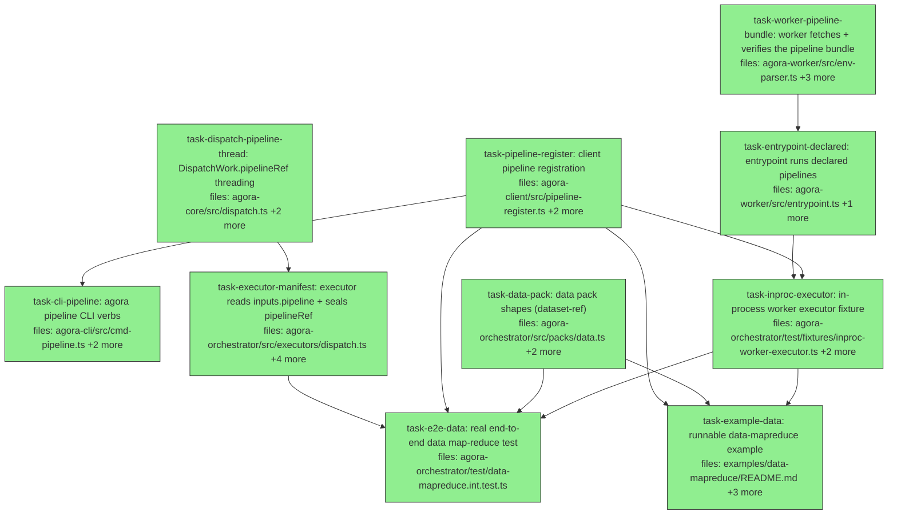

## Context

Implements **Wave 2** of
`docs/superpowers/specs/2026-06-05-agora-block-runner-data-pack-design.md` — the
registration surface + the `data` pack — against **as-merged Wave 1** (main `25c2be4`,
PR #46): `PipelineSpec`/`validatePipelineSpec`/`isPackScopedId` live in agora-core;
`runPipeline(spec, ctx, { declared })` + `buildDefaultPipeline` live in
`agora-worker/src/pipeline-runner.ts`; `BlockContext.log` requires `kind`;
`OutputSentinel.blocks?` is written only when `declared`.

The threading chain (the `inputRefs` precedent, link by link): a PINNED pipeline ref
travels `WorkItem.inputs.pipeline` → `DispatchExecutor` → `DispatchWork.pipelineRef` →
client dispatch (pinned-URI validation + `bundleRefs.pipeline` + `resolved.pipelineRef`)
→ `DispatchManifest.pipelineRef` (sealed at fire) → `AGORA_BUNDLE_REFS_JSON` →
`env-parser`/`bundle-fetcher` (subagentDef-path verification: fetch → parse →
`verifyContentHash` over the PARSED object — NOT raw-bytes `fetchVerified`) → worker
re-validates with `validatePipelineSpec` (`integrity-failed` on errors) →
`runPipeline(declared, ctx, { declared: true })`.

**v1 threading rule:** `inputs.pipeline` must be a PINNED `agora://` ref (what
`registerPipeline` returns). Bare-name resolution at dispatch is deferred — the executor
stays dumb and the manifest seal stays trivial.

Verified ground truth (greps run at planning): client barrel wires namespaced sub-APIs
(`client.subagent.register` pattern at `agora-client/src/index.ts:199`) — `client.pipeline`
mirrors it; `BundleRefs` (`agora-worker/src/env-parser.ts:15`) = `{ subagent, capabilities,
env, inputs? }` — `pipeline?` is additive with a validation branch; `InFlightDispatch.resolved`
already carries `inputRefs` for the manifest (`agora-client/src/dispatch.ts:77-84`) —
`pipelineRef?` joins it; `DispatchManifest.inputRefs?` precedent at
`contracts/manifest.ts:23`; `packs/dev.ts` provides the shape template (`WORKER_IMAGE`,
`outputEdgeType: 'patch-ref'`).

Standing invariants (every task): zero diffs under `src/engine/`, `contracts/privilege.ts`
untouched (exhaustive-membership test!), pattern layer untouched, all evidence additions
optional + hash-safe. Gates per task: package tests + `npx tsc --noEmit` + package lint
(typecheck is a SEPARATE gate from vitest/eslint — Wave 1 lesson). Existing test files are
modified by ADDITION only; an existing assertion failing = STOP + BLOCKED.

**Fixture-import rule (decided at planning):** the `InProcessWorkerExecutor` is a TEST
fixture (it bypasses container isolation by design — never a product surface). The example
imports it via a relative path (tsx compiles workspace TS directly:
`../../packages/agora-orchestrator/test/fixtures/inproc-worker-executor.js` style import
from the example's src) with a loud README caveat — no duplication, no publication.

**Lockfile rule:** the example task must NOT stage `pnpm-lock.yaml`; the controller
commits it once at the end (pattern-layer lesson).

## Tasks

## Task: client pipeline registration

```yaml
id: task-pipeline-register
depends_on: []
files:
  - packages/agora-client/src/pipeline-register.ts
  - packages/agora-client/src/index.ts
  - packages/agora-client/test/pipeline-register.test.ts
status: done
```

`registerPipeline(client, spec)` mirroring `subagent-register.ts` field-for-field (READ it
first — it is the canonical template), plus the namespaced `client.pipeline.register`
sub-API wired in the barrel exactly like `client.subagent.register`.

## Implementation

```typescript
// packages/agora-client/src/pipeline-register.ts
import { buildAgoraUri, canonicalJsonString, computeContentHash,
         validatePipelineSpec, type PipelineSpec } from '@quarry-systems/agora-core';
import type { AgoraClient } from './client.js';

export interface PipelineRef { id: string; registeredAt: string; contentHash: string; }

/** Register a pipeline spec. Rejects on validatePipelineSpec errors (collect-all message).
 *  Content hash over the SPEC OBJECT; canonical-JSON bytes written (the subagent-register
 *  byte/object hash-coherence contract); idempotent re-registration via resolveLatest;
 *  storage-as-authority for registeredAt (fail fast if resolveLatest is null post-put). */
export async function registerPipeline(client: AgoraClient, spec: PipelineSpec): Promise<PipelineRef> {
  const errors = validatePipelineSpec(spec);
  if (errors.length) throw new Error(`pipeline.register: invalid spec:\n${errors.join('\n')}`);
  // ... computeContentHash(spec) → buildAgoraUri({ namespace, type: 'pipeline', name: spec.id })
  //     base + pinned URIs → resolveLatest idempotency → put canonicalJsonString bytes →
  //     re-read registeredAt (mirror subagent-register.ts lines 94-126)
}
```

```typescript
// packages/agora-client/test/pipeline-register.test.ts
it('re-registering an identical spec is idempotent (same registeredAt, no second put)', async () => {
  // fake storage counting puts; register twice; assert one put, equal registeredAt/contentHash
});
```

## Acceptance criteria

- Valid spec → `PipelineRef { id, registeredAt, contentHash }`; pinned URI retrievable and
  its bytes parse back to the spec (byte/object hash coherence — storage `put` must not
  throw IntegrityMismatchError, proving canonical bytes match the object hash).
- Invalid spec → throws with ALL validator errors in the message (collect-all surfaced).
- Idempotent re-registration (same hash → same registeredAt, zero additional puts);
  different spec under the same id → NEW pinned version, both retrievable.
- `client.pipeline.register(spec)` reachable via the client namespace API (barrel wiring
  mirrors `client.subagent.register` — interface + constructor wiring both).
- Gates: `npx vitest run test/pipeline-register.test.ts` (from packages/agora-client),
  `npx tsc --noEmit`, package lint — all clean.

Test file: `packages/agora-client/test/pipeline-register.test.ts`.

## Task: agora pipeline CLI verbs

```yaml
id: task-cli-pipeline
depends_on: [task-pipeline-register]
files:
  - packages/agora-cli/src/cmd-pipeline.ts
  - packages/agora-cli/src/index.ts
  - packages/agora-cli/test/cmd-pipeline.test.ts
status: done
```

`agora pipeline register <file>` / `agora pipeline validate <file>` / `agora pipeline list`
— siblings of the existing subagent verbs. READ `cmd-subagent.ts` first and mirror its
structure (arg parsing, client construction, output format, error exit codes); wire into
the CLI dispatcher in `src/index.ts` following how existing `cmd-*` modules register.

## Implementation

```typescript
// packages/agora-cli/src/cmd-pipeline.ts — shape (mirror cmd-subagent.ts)
// register: read JSON file → client.pipeline.register(spec) → print { id, contentHash, uri }
// validate: read JSON file → validatePipelineSpec (packs-less, no storage) → print errors or OK; exit 1 on errors
// list:     storage listing by pipeline URI prefix (mirror however cmd-subagent lists, if it does;
//           if no list precedent exists, resolveLatest-based single lookup `list <id>` is acceptable —
//           match the nearest existing precedent rather than inventing one)
```

```typescript
// packages/agora-cli/test/cmd-pipeline.test.ts
it('validate exits non-zero and prints every error for an invalid spec file', async () => { /* ... */ });
```

## Acceptance criteria

- `register` round-trips a valid spec file to a pinned ref and prints it; invalid file →
  exit 1 with the validator errors.
- `validate` is storage-free (works with no client config), collect-all output, exit 0/1.
- `list` follows the nearest existing CLI precedent (document which in the code).
- CLI dispatcher recognizes the `pipeline` namespace; `--help` shows the verbs.
- Existing CLI tests green; gates (tests + tsc + lint) clean.

Test file: `packages/agora-cli/test/cmd-pipeline.test.ts`.

## Task: DispatchWork.pipelineRef threading

```yaml
id: task-dispatch-pipeline-thread
depends_on: []
files:
  - packages/agora-core/src/dispatch.ts
  - packages/agora-client/src/dispatch.ts
  - packages/agora-client/test/dispatch-pipeline.test.ts
status: done
is_wiring_task: true
```

The client-side link of the chain (cross-package wiring — core type + client threading):
`DispatchWork` gains `pipelineRef?: string` (a pinned `agora://` URI); client `dispatch()`
validates it EXACTLY like `inputRefs` entries (parseAgoraUri + pinned-hash check — see
`agora-client/src/dispatch.ts:186-199`, reuse that pattern/helper), adds
`bundleRefs.pipeline = { uri, contentHash }`, and threads `pipelineRef` into
`InFlightDispatch.resolved` (beside `inputRefs`) for the manifest.

```typescript
// the validation shape to mirror (dispatch.ts:190-199):
// const { contentHash } = parseAgoraUri(uri); if (!contentHash) throw — pinned required
```

## Acceptance criteria

- `DispatchWork.pipelineRef?` additive (no existing-caller changes needed — verify
  `git grep -l 'DispatchWork'` consumers compile via tsc).
- A dispatch with `pipelineRef` produces `bundleRefs.pipeline` in the worker env JSON
  (assert via the same seam existing dispatch tests use) and `resolved.pipelineRef` set.
- Malformed/unpinned ref → throws with a message naming `pipelineRef` (mirror the
  inputRefs error text style).
- No `pipelineRef` → bundleRefs has NO pipeline key (absence preserved — old workers
  unaffected).
- Gates clean in BOTH packages (core + client): tests + tsc + lint.

Test file: `packages/agora-client/test/dispatch-pipeline.test.ts`.

## Task: executor reads inputs.pipeline + seals pipelineRef

```yaml
id: task-executor-manifest
depends_on: [task-dispatch-pipeline-thread]
files:
  - packages/agora-orchestrator/src/executors/dispatch.ts
  - packages/agora-orchestrator/src/contracts/manifest.ts
  - packages/agora-orchestrator/src/audit/manifest.ts
  - packages/agora-orchestrator/test/executors/dispatch.test.ts
  - packages/agora-orchestrator/test/audit/manifest.test.ts
status: done
```

The orchestrator link: `DispatchExecutor.fire` reads the reserved `inputs.pipeline` key
(string, pinned ref — shape-guard like the existing `inputs.subagent` read at
`executors/dispatch.ts:42-45`), threads it into `DispatchWork.pipelineRef`, and seals it:
`DispatchManifest` gains `pipelineRef?` (beside `inputRefs` — `contracts/manifest.ts:23`),
`buildManifest` accepts it additively (hash-safe by the canonical drop-undefined contract —
prove with the same additive-hash test style the manifest suite already has for inputRefs).

## Implementation

```typescript
// executors/dispatch.ts (additions, beside the inputRefs handling at lines 46-51/68/98)
const rawPipeline = item.inputs.pipeline;
const pipelineRef = typeof rawPipeline === 'string' && rawPipeline.length > 0 ? rawPipeline : undefined;
// → client dispatch opts: ...(pipelineRef ? { pipelineRef } : {})
// → buildManifest input:  ...(pipelineRef ? { pipelineRef } : {})
```

```typescript
// test/audit/manifest.test.ts (added case)
it('adding pipelineRef does not perturb the hash of a manifest without it', () => { /* additive-safety, the inputRefs precedent test */ });
```

## Acceptance criteria

- `inputs.pipeline` (string) → `DispatchWork.pipelineRef` → manifest `pipelineRef` sealed
  inside `manifestHash`; absent → absent everywhere (old manifests byte-identical —
  asserted by the additive-hash test).
- Non-string `inputs.pipeline` values are ignored (shape guard, matching the inputRefs
  posture — not a throw).
- Existing executor + manifest tests green by addition only.
- Zero diffs to `contracts/privilege.ts`, `src/engine/`; gates (tests + tsc + lint) clean.

Test file: `packages/agora-orchestrator/test/executors/dispatch.test.ts` (+ the manifest
additive case in `test/audit/manifest.test.ts`).

## Task: worker fetches + verifies the pipeline bundle

```yaml
id: task-worker-pipeline-bundle
depends_on: []
files:
  - packages/agora-worker/src/env-parser.ts
  - packages/agora-worker/src/bundle-fetcher.ts
  - packages/agora-worker/test/env-parser.test.ts
  - packages/agora-worker/test/bundle-fetcher.test.ts
status: done
```

The worker ingestion link: `BundleRefs` gains `pipeline?: BundleRef` (env-parser additive
validation branch, mirroring the `inputs?` branch at `env-parser.ts:101-106`);
`fetchBundles` fetches it via the **subagentDef path** — fetch bytes → `JSON.parse` →
`verifyContentHash` over the PARSED object (`bundle-fetcher.ts:143` is the template; NOT
the raw-bytes `fetchVerified` used for capabilities) — returning
`FetchedBundles.pipeline?: Record<string, unknown>` (parse-only here; `validatePipelineSpec`
runs in the entrypoint task, where the failure can route through `failWith`).

## Implementation

```typescript
// env-parser.ts: BundleRefs gains pipeline?: BundleRef; validation: when present, must be
// an object with string uri + contentHash (mirror the inputs entry checks).
```

```typescript
// test/bundle-fetcher.test.ts (added case)
it('fetches and object-hash-verifies the pipeline bundle; tampered bytes throw', async () => {
  // store canonicalJsonString(spec) at a pinned URI; fetchBundles with refs.pipeline →
  // FetchedBundles.pipeline deep-equals spec; corrupt the stored bytes → fetchBundles throws
});
```

## Acceptance criteria

- `pipeline` absent → parsing/fetching identical to today (absence preserved end-to-end).
- Present → fetched, object-hash-verified (a tampered blob throws the integrity error the
  capabilities path throws), surfaced as parsed object on `FetchedBundles.pipeline`.
- Malformed env entry (non-object, missing uri/contentHash) → env-parser throws its
  established error style.
- Existing env-parser/bundle-fetcher tests green by addition only; gates clean.

Test file: `packages/agora-worker/test/env-parser.test.ts` +
`packages/agora-worker/test/bundle-fetcher.test.ts`.

## Task: entrypoint runs declared pipelines

```yaml
id: task-entrypoint-declared
depends_on: [task-worker-pipeline-bundle]
files:
  - packages/agora-worker/src/entrypoint.ts
  - packages/agora-worker/test/entrypoint.test.ts
status: done
is_wiring_task: true
```

The final worker link: when `bundles.pipeline` is present, `validatePipelineSpec` it
(errors → `failWith('integrity-failed', ...)` BEFORE the adapter/pipeline runs — a bundle
problem, exactly like a malformed capability bundle) and run
`runPipeline(spec, ctx, { declared: true })`; absent →
`buildDefaultPipeline(subagent), { declared: false }` exactly as Wave 1 left it. Existing
entrypoint tests green; NEW tests are ADDITIONS to entrypoint.test.ts (declared-pipeline
happy path with `blocks` evidence present in the sentinel; invalid declared spec →
integrity-failed; absent → byte-identical legacy sentinel — the Wave 1 golden already
pins this last one, do not duplicate it, just don't break it).

## Acceptance criteria

- Declared valid pipeline runs (a script-only pipeline with no agent block works — assert
  the adapter was NEVER invoked for it) and its sentinel carries `blocks[]`.
- Declared invalid pipeline → `dispatch.failed`/`integrity-failed`, exit 1, adapter never
  invoked, no sentinel.
- Absent pipeline → Wave 1 behavior bit-for-bit (existing tests + golden suite green
  UNCHANGED — `npx vitest run test/pipeline-golden.test.ts test/entrypoint.test.ts`).
- Full worker suite green; gates (tests + tsc + lint) clean.

Test file: `packages/agora-worker/test/entrypoint.test.ts` (additions only).

## Task: data pack shapes (dataset-ref)

```yaml
id: task-data-pack
depends_on: []
files:
  - packages/agora-orchestrator/src/packs/data.ts
  - packages/agora-orchestrator/src/index.ts
  - packages/agora-orchestrator/test/packs/data.test.ts
status: done
```

The second pack's orchestrator surface (spec §8): `packs/data.ts` — `data.split`,
`data.transform`, `data.aggregate` `SubagentShape`s with `outputEdgeType: 'dataset-ref'`
and matching `inputEdgeTypes` — mirroring `packs/dev.ts` field-for-field (same
`WORKER_IMAGE` constant approach, permissive zod inputSchemas, `dataPack` array +
`dataRegistry`), barrel-exported beside `devPack`.

## Implementation

```typescript
// packs/data.ts — mirror packs/dev.ts
export const dataSplit: SubagentShape = {
  id: 'data.split', effectTier: 'pure',
  inputSchema: z.record(z.unknown()), outputSchema: z.record(z.unknown()),
  capability: { imageDigest: WORKER_IMAGE, permissions: {}, contextShape: 'dataset at inputs/dataset' },
  outputEdgeType: 'dataset-ref',
};
// data.transform: inputEdgeTypes { input: 'dataset-ref' }, outputEdgeType 'dataset-ref'
// data.aggregate: inputEdgeTypes left OPEN (reduce keys are dynamic '<prefix>-<key>' — document
//   that validateRun's tag check is permissive per-key, so dynamic keys simply aren't tag-checked;
//   an explicit note beats silent magic)
```

```typescript
// test/packs/data.test.ts (mirror test/packs/dev.test.ts)
it('a dev->data needs edge fails validateRun tag-matching (patch-ref vs dataset-ref)', () => { /* the cross-pack mismatch proof */ });
```

## Acceptance criteria

- Three shapes registered via `new PackRegistry([...devPack, ...dataPack])` without
  validateShape errors; barrel exports `dataPack`/`dataRegistry` + the three shapes.
- `validateRun` accepts a data.split→data.transform needs edge (tags match) and REJECTS a
  dev.code-edit→data.transform edge with the established "incompatible; needs an adapter
  block" error (the cross-domain tag exercise — the first ever with two packs).
- Existing pack/registry tests green; gates clean.

Test file: `packages/agora-orchestrator/test/packs/data.test.ts`.

## Task: in-process worker executor fixture

```yaml
id: task-inproc-executor
depends_on: [task-pipeline-register, task-entrypoint-declared]
files:
  - packages/agora-orchestrator/test/fixtures/inproc-worker-executor.ts
  - packages/agora-orchestrator/test/fixtures/inproc-worker-executor.test.ts
  - packages/agora-orchestrator/package.json
status: done
```

The bridge that makes the e2e real (spec §8): an `Executor` whose `fire` invokes the
worker's `runWorker(env, deps)` IN-PROCESS via `RunWorkerDeps` (shared local storage +
local secret store + stub `RuntimeAdapter` — data pipelines have no agent block; the stub
satisfies the chassis and throws if actually invoked) and whose `reconcile` reads the real
sentinel from the dispatch-record URI into
`{ status, resultRef?, outputRefs?, verify? }` (mirror `readSentinel`'s defensive
reconstruction in `executors/dispatch.ts`). `package.json` gains a `devDependency` on
`@quarry-systems/agora-worker` (workspace:*) — devDep ONLY, never a prod dep.

## Implementation

```typescript
// test/fixtures/inproc-worker-executor.ts
import { runWorker } from '@quarry-systems/agora-worker';   // check the worker barrel exports runWorker; if not, import from src path via workspace — prefer the package entry
// fire(item, ctx): build the env map a dispatcher would (AGORA_DISPATCH_ID/NAMESPACE/STORAGE_URI/
//   AGORA_BUNDLE_REFS_JSON incl. pipeline ref from item.inputs.pipeline, AGORA_INPUT_JSON,
//   AGORA_SECRET_STORE_KIND=local...) and await runWorker(env, { storage, secretStore, adapter: stub,
//   workspaceDir: mkdtemp }) — store exit code keyed by dispatchHash.
// reconcile(hash): fetch dispatch-record output.json from the SHARED storage; map exit 0 + sentinel →
//   { status:'done', resultRef: patchRef?, outputRefs: outputs[] → Record<path,ref>, verify } ;
//   non-zero → { status:'failed' }.
```

```typescript
// test/fixtures/inproc-worker-executor.test.ts — smoke
it('runs a script-only declared pipeline in-process and reconciles its real outputRefs', async () => {
  // register a one-block script pipeline (writes outputs/x.txt), seed bundles in shared storage,
  // fire+reconcile → done with a content-addressed outputRefs entry resolvable from storage
});
```

## Acceptance criteria

- fire→reconcile round-trips a REAL `runWorker` execution: declared script pipeline runs,
  sentinel read back, `outputRefs` keyed by posix path with pinned refs whose bytes are
  retrievable from the shared storage.
- The stub adapter throws if invoked (proving script pipelines never touch it); a pipeline
  WITH an agent block fails loudly rather than silently.
- Subagent/pipeline bundles seeded through the REAL client registration paths (no
  hand-rolled storage writes for registered artifacts).
- worker devDep added to package.json (devDependencies only); `pnpm install` clean.
- Gates clean (orchestrator tests + tsc + lint).

Test file: `packages/agora-orchestrator/test/fixtures/inproc-worker-executor.test.ts`.

## Task: real end-to-end data map-reduce test

```yaml
id: task-e2e-data
depends_on: [task-inproc-executor, task-data-pack, task-pipeline-register, task-executor-manifest]
files:
  - packages/agora-orchestrator/test/data-mapreduce.int.test.ts
status: done
```

THE wave's proof (spec §8/§9): a fully real, fully offline run — real orchestrator +
real `mapReduce` pattern spawning through the audited `extendRun` + the in-process
executor running REAL `runWorker` executions of REAL script pipelines over a REAL CSV →
content-addressed datasets → manifests sealing `inputRefs` AND `pipelineRef` → provenance
closure green. No fakes anywhere in the execution path. Data pipeline specs + scripts
defined in-test as `node -e` command strings (cross-platform; read by needs KEY:
`inputs/dataset`, `inputs/part`; aggregate reads every file under `inputs/`).

## Implementation

```typescript
// test/data-mapreduce.int.test.ts — skeleton
// pipelines (registered via client.pipeline.register):
//   data.split:     [{ kind:'script', command: NODE_SPLIT }]    — reads inputs/dataset, writes outputs/part-0.csv..part-N.csv (N from the data)
//   data.transform: [{ kind:'script', command: NODE_TRANSFORM }] — reads inputs/part, group-sums, writes outputs/result.json
//   data.aggregate: [{ kind:'script', command: NODE_AGG }]      — reads ALL files under inputs/, writes outputs/total.json
// run: ONE split item (subagentShape 'data.split', inputs.pipeline = splitRef, inputs.mapReduce
//   templates carrying the transform/aggregate pipeline refs + executor 'inproc'), seed CSV bound
//   via needs { dataset: ... } from a seeder item OR staged as an input ref — pick the simplest
//   real path: a tiny 'seed' item whose pipeline writes outputs/dataset.csv, with split needs-ing it.
// assertions: grown graph (seed+split+N transforms+aggregate) all done; total.json bytes correct
//   (sum verified against the CSV fixture!); TWO run.extended entries; every transform manifest
//   seals BOTH inputRefs (its part) AND pipelineRef; verifyBundle intact + handoff ok.
```

```typescript
it('the aggregate result is numerically correct for the seeded CSV', async () => {
  // fetch outputs ref bytes for total.json from storage; JSON.parse; expect exact group sums
});
```

## Acceptance criteria

- The run grows from its seeded items to seed+split+N+aggregate, ALL via the real pattern
  phase; N derived from the actual CSV content at runtime.
- `total.json`'s CONTENT is asserted numerically (real computation, not just statuses).
- Every spawned consumer's manifest seals `inputRefs` + `pipelineRef`; `verifyBundle` →
  `intact: true`, `checks.handoff.ok: true` over the grown graph.
- Crash-replay variant: second orchestrator over the same store completes with zero
  duplicate items (the established scenario, now over real executions).
- Runs offline (no Docker, no network, no LLM); suite + tsc + lint clean.

Test file: `packages/agora-orchestrator/test/data-mapreduce.int.test.ts`.

## Task: runnable data-mapreduce example

```yaml
id: task-example-data
depends_on: [task-inproc-executor, task-data-pack, task-pipeline-register]
files:
  - examples/data-mapreduce/README.md
  - examples/data-mapreduce/package.json
  - examples/data-mapreduce/plan.json
  - examples/data-mapreduce/src/index.ts
status: done
is_wiring_task: true
model_hint: cheap
```

The user-facing "second pack forcing function" demo (spec §8), handoff-dag workspace
template (private, `workspace:*` deps on orchestrator+client+worker+storage-local, tsx,
start/typecheck/build, BUSL-1.1, no test script): registers the three data pipelines,
submits the split item from `plan.json`, drives via the in-process executor (imported by
RELATIVE PATH from the orchestrator test fixture — tsx compiles it; README states LOUDLY
that this executor bypasses container isolation and is a demo/test bridge, never
production), prints the grown graph + per-block `blocks[]` evidence + the sealed
`pipelineRef`s + the green `verifyBundle`. Exit 0 iff intact && handoff ok. Do NOT stage
`pnpm-lock.yaml`.

## Acceptance criteria

- `pnpm --filter data-mapreduce-example start` exits 0 printing: items grown from 2-ish to
  seed+split+N+aggregate (visibly more than plan.json), the aggregate's numeric result,
  one `blocks[]` evidence sample, and the verification report (intact + handoff line).
- `pnpm --filter data-mapreduce-example typecheck` passes.
- README: the offline rationale, the in-process-executor caveat, what this proves (a
  SECOND domain running on the same engine/pattern/handoff/seal with zero engine changes),
  spec link.

Test file: none — verified by `pnpm start` (exit 0); behavior covered by
`packages/agora-orchestrator/test/data-mapreduce.int.test.ts`.
