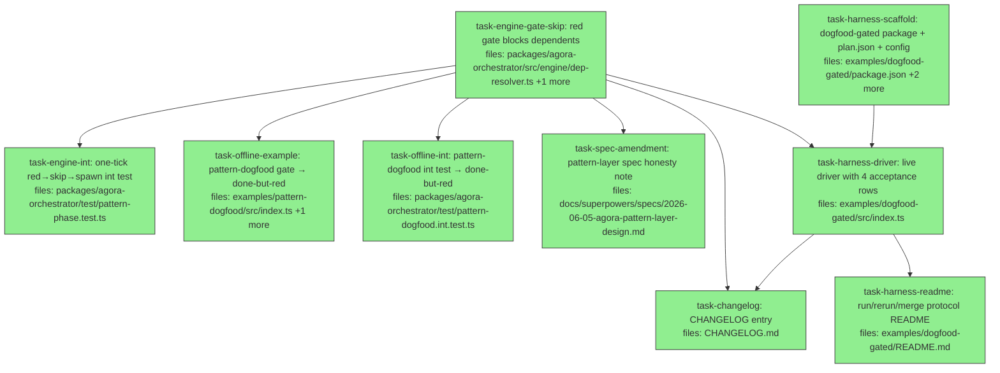

## Context

Driven by `docs/superpowers/specs/2026-06-06-dogfood-run3-gated-circleback-design.md` (audited; R7 added after the audit found the engine gap). Two phases on ONE branch/PR (`feat/dogfood-run3`): the scoped engine change (a red gate blocks its dependents — without it, `announce~2` is unreachable and the offline demo's full arc is a lie of omission), then the live harness `examples/dogfood-gated`. The run itself happens after merge, manually, with credits.

Engine ground truth (verified): `computeNewlyReady`/`computeSkipped` in `packages/agora-orchestrator/src/engine/dep-resolver.ts:4-22` take `ItemState[]`; `ItemState` carries `inputs` and `verify`, so the failed-like predicate is local to the file. Consumers of these functions: `engine/tick.ts`, `orchestrator.ts`, tests `dep-resolver.test.ts`, `tick.test.ts`, `orchestrator-cancel.test.ts`, `index.test.ts` (barrel). The predicate is additive — existing tests must stay green unmodified (no current fixture declares `inputs.gate` + red verify together).

Spec-pinned facts the tasks lean on: gate policy lives on the gate item's `inputs.gate` (`contracts/pattern.ts:34-40`), queue config is `{ concurrency, pattern: pipeline }` (the Pattern object); fix id `fact-check-fix-1`; findings key is EXACTLY `outputs/findings` (no extension — `outputRefs` keys are posix relpaths verbatim, `respawn.ts:184` looks up `'findings'` literally); verify is subagent-level `verify: { command }` (#37, report-only); `run.extended` carries the cause in `itemId` and `actor === 'pattern:default'`; the evidence read recipe is `parseAgoraUri(item.manifestRef).name` → `buildDispatchRecordUri(ns, dispatchId, 'output.json')` → `storage.get` → `.usage`; the fix subagent must NOT setup-apply the subject patch (patch-stacking trap — it writes the corrected page from scratch so its patch is cumulative).

Gates before PR: `pnpm -r lint`, `pnpm -r typecheck`, `pnpm -r test`, harness `tsc --noEmit` strict (run-2 convention), docs-site untouched.

## Tasks

## Task: engine — red gate blocks dependents

```yaml
id: task-engine-gate-skip
depends_on: []
files:
  - packages/agora-orchestrator/src/engine/dep-resolver.ts
  - packages/agora-orchestrator/test/dep-resolver.test.ts
status: done
model_hint: standard
```

The R7/§7 predicate, scoped to declared gates: a dependency that is `done` AND `verify.passed === false` AND declares `inputs.gate.onRed === 'spawn-fix'` counts as failed-like — it blocks readiness and triggers the skip cascade. One shared helper used by both functions (DRY); everything else untouched. Red verify on a NON-gate item changes nothing (the global report-only contract).

## Implementation

```typescript
// packages/agora-orchestrator/src/engine/dep-resolver.ts
/** §7 (run-3 spec): a red GATE blocks its dependents. Failed-like = done +
 *  verify.passed === false + the item declares inputs.gate.onRed === 'spawn-fix'.
 *  Red verify on any non-gate item remains report-only (never blocks). */
function isBlockingRedGate(item: ItemState): boolean {
  if (item.status !== 'done' || item.verify?.passed !== false) return false;
  const gate = (item.inputs as { gate?: { onRed?: string } } | undefined)?.gate;
  return gate?.onRed === 'spawn-fix';
}

// computeNewlyReady: a dep satisfies readiness only when done AND NOT a blocking red gate.
// computeSkipped: cascade when dep is failed/skipped/cancelled OR a blocking red gate.
// (Both keep their single-pass shape; build a Map<string, ItemState> instead of Map<string, status>.)
```

```typescript
// packages/agora-orchestrator/test/dep-resolver.test.ts (new cases appended to the existing suite)
// AUDIT NOTE: the file's existing helpers are POSITIONAL — mk(id, deps, status) at :5 and
// item(id, status, deps) at :47 — and accept neither `verify` nor `inputs`. The red-gate cases
// need a NEW object-literal helper (or plain ItemState literals); do NOT extend the positional ones.
function gateItem(over: Partial<ItemState> & { id: string }): ItemState {
  return { executor: 'dispatch', inputs: {}, depends_on: [], resourceLocks: [], status: 'pending', attempts: 0, runId: 'r', queue: 'q', ...over } as ItemState;
}

it('a done-but-red GATE blocks readiness and cascades skip to its dependents', () => {
  const gate = gateItem({ id: 'g', status: 'done', verify: { passed: false }, inputs: { gate: { onRed: 'spawn-fix', subject: 's', fixTemplate: { executor: 'dispatch', inputs: {} } } } });
  const dep = gateItem({ id: 'd', status: 'pending', depends_on: ['g'] });
  expect(computeNewlyReady([gate, dep])).toEqual([]);
  expect(computeSkipped([gate, dep])).toEqual(['d']);
});

it('a done-but-red NON-gate item does NOT block (report-only verify)', () => {
  const red = gateItem({ id: 'n', status: 'done', verify: { passed: false } });
  const dep = gateItem({ id: 'd', status: 'pending', depends_on: ['n'] });
  expect(computeNewlyReady([red, dep])).toEqual(['d']);
  expect(computeSkipped([red, dep])).toEqual([]);
});
```

(Adapt the helper's required-field set to the real `ItemState` — read `contracts/types.ts` first; the shape above is illustrative.) Also cover: green gate (verify absent or passed !== false) passes dependents normally; a gate COPY (`g~2`) carrying the same `inputs.gate` blocks identically (copies inherit `inputs` via `toWorkItemFields`). All PRE-EXISTING cases in `dep-resolver.test.ts`, `tick.test.ts`, `orchestrator-cancel.test.ts` must pass unmodified.

## Acceptance criteria

- Red gate dep (`done` + `verify.passed===false` + `inputs.gate.onRed==='spawn-fix'`): dependent is NOT readied AND IS skipped.
- Red non-gate dep: dependent readies normally (report-only preserved).
- Green gate dep: dependent readies normally.
- Gate copy with inherited `inputs.gate`: blocks identically.
- Full orchestrator suite green with zero modifications to pre-existing tests (`pnpm --filter @quarry-systems/agora-orchestrator test`).

Test file: `packages/agora-orchestrator/test/dep-resolver.test.ts`.

## Task: one-tick red→skip→full-spawn integration

```yaml
id: task-engine-int
depends_on: [task-engine-gate-skip]
files:
  - packages/agora-orchestrator/test/pattern-phase.test.ts
status: done
model_hint: standard
```

Tick-level proof of the §7 ordering: gate reconciles done-but-red → its dependent is NOT readied in that tick → skip cascade marks it `skipped` → the pattern phase then sees a skipped descendant and the spawn directive is the FULL `[fix, gate~2, dependent~2]` (previously only `[fix, gate~2]` was reachable on the done-but-red path). Also: bounded termination — `gate~2` red at attempt 2 > `maxFixAttempts: 1` → no respawn → `dependent~2` stays skipped → run settles.

## Implementation

```typescript
// appended to packages/agora-orchestrator/test/pattern-phase.test.ts — reuse the file's
// existing harness (fake executor + store + pattern phase invocation patterns; read it first):
it('done-but-red gate skips its dependent in the same tick and respawn copies it', async () => {
  // 3-item run: subject(done) -> gate(reconciles done + verify.passed=false + outputRefs.findings) -> downstream(pending)
  // assert: downstream becomes 'skipped' (never 'ready'); extendRun receives [<base>-fix-1, <gate>~2, <downstream>~2]
});
```

```typescript
it('red gate~2 beyond maxFixAttempts leaves descendants skipped and the run settles', async () => {
  // drive the second-attempt gate copy red; assert no further extendRun; isSettled true.
});
```

## Acceptance criteria

- Same-tick ordering proven: downstream `skipped` before the pattern phase runs; spawn directive includes the downstream copy with `needs`/`depends_on` remapped per `respawnLineage`.
- Attempt-bound termination proven: no infinite respawn; run settles with the second-generation descendants `skipped`.
- Existing pattern-phase cases untouched and green.

Test file: `packages/agora-orchestrator/test/pattern-phase.test.ts`.

## Task: offline example gate → done-but-red

```yaml
id: task-offline-example
depends_on: [task-engine-gate-skip]
files:
  - examples/pattern-dogfood/src/index.ts
  - examples/pattern-dogfood/README.md
status: done
model_hint: standard
```

Upgrade the offline proof so it exercises the SAME arc as run 3 (this is what masked the engine gap): the fake executor's `review` behavior changes from `{ status: 'failed' }` to **done-but-red** — `done` with `verify: { passed: false }` and `outputRefs: { findings: <fake sha ref> }` (first attempt) and done-green on `review~2`. The respawned fix now carries BOTH auto-bound needs (`work` from subject, `findings` from the gate) — assert/print both; provenance closure must account for the findings edge too. README's expected-output block and the circle-back narrative update to match (review: done-but-red rather than failed; `run.extended` wording unchanged).

## Implementation

```typescript
// examples/pattern-dogfood/src/index.ts — the deterministic behavior table changes shape:
// review (attempt 1): { status: 'done', verify: { passed: false }, outputRefs: { findings: fakeRef('findings-1') } }
// review~2:           { status: 'done' }  // green re-gate
// package: skipped via the §7 cascade (no behavior entry fires for it on attempt 1)
//
// AUDIT NOTE (required widening): the example's LOCAL ItemBehavior type is
// `{ status: 'done' | 'failed'; resultRef?: string }` (index.ts:55) and its reconcile forwards
// ONLY status+resultRef (index.ts:98-102) — it has NO verify/outputRefs plumbing. You MUST
// (a) widen ItemBehavior with `verify?: { passed: boolean }` and `outputRefs?: Record<string,string>`,
// and (b) extend reconcile's return to forward both — mirror test/fixtures/pattern-harness.ts:71-77.
// Without this the done-but-red signal never reaches the engine. (The int-test twin does NOT need
// this — its idKeyedExecutor fixture already supports both; the asymmetry is expected.)
```

```typescript
// driver assertions added (the example IS its own test — exit non-zero on miss):
// - review-fix-1 manifest inputRefs has BOTH work and findings
// - package~2 inputRefs.work === review-fix-1 resultRef
// - verifyBundle: intact + handoff ok (now 3+ input refs accounted for)
```

NOTE: the fake executor must seal `findings` as a *produced* ref of the done gate (resultRef or outputRefs value) so provenance closure admits it — mirror how the existing fake seals resultRefs.

## Acceptance criteria

- `pnpm --filter pattern-dogfood-example start` exits 0 with the full arc: review done-but-red → package SKIPPED → fix + review~2 + package~2 spawned → all done → bundle intact + handoff ok.
- Fix's manifest shows both `work` AND `findings` inputRefs (printed + asserted).
- README expected-output matches the new actual output.

Test file: n/a (the example is self-asserting; its in-repo twin is task-offline-int).

## Task: offline int test → done-but-red

```yaml
id: task-offline-int
depends_on: [task-engine-gate-skip]
files:
  - packages/agora-orchestrator/test/pattern-dogfood.int.test.ts
status: done
model_hint: standard
```

The in-repo twin of task-offline-example: switch the int test's gate from failed to done-but-red with findings, assert the full arc (skip, full spawn set, findings-by-provenance on the fix, remap on the downstream copy, closure green over the grown graph). Keep it independently runnable — do not import from the example.

## Implementation

```typescript
// packages/agora-orchestrator/test/pattern-dogfood.int.test.ts — same fake-executor shape change as the example:
it('done-but-red gate: full circle-back with findings-by-provenance and downstream remap', async () => {
  // assert items: subject done; gate done+red; downstream SKIPPED; fix done; gate~2 done+green; downstream~2 done
  // assert fix manifest inputRefs: work === subject.resultRef AND findings === gate.outputRefs.findings
  // assert downstream~2 manifest inputRefs.work === fix.resultRef
  // assert verifyBundle intact && checks.handoff.ok
});
```

```typescript
it('run.extended entry carries itemId=<gate id> and actor=pattern:default', async () => {
  // from the assembled bundle's auditLog.entries
});
```

## Acceptance criteria

- All assertions above green; any pre-existing failed-gate case either updated to the new arc or retained alongside (the failed-gate path is still legal engine behavior — keep one failed-gate case to pin gateReason degradation).
- Full orchestrator suite green.

Test file: `packages/agora-orchestrator/test/pattern-dogfood.int.test.ts`.

## Task: pattern-layer spec honesty amendment

```yaml
id: task-spec-amendment
depends_on: [task-engine-gate-skip]
files:
  - docs/superpowers/specs/2026-06-05-agora-pattern-layer-design.md
status: done
model_hint: cheap
is_wiring_task: true
```

Append a clearly-dated amendment to the pattern-layer spec: the "engine zero diff" headline gains one scoped exception, pulled by the first live gated run — the §7 failed-like predicate in dep-resolver (red gate blocks dependents). State why the original arc was incomplete (done-but-red never skipped descendants; the offline demo used a failed gate, which loses findings) and link the run-3 spec. AUDIT NOTE: the spec has NO prior amendment-section template (only an inline `(amendment)` reference near the top) — create one: a new `## Amendment (2026-06-06): red gates block dependents` section at the end of the file. Original text untouched.

## Acceptance criteria

- Amendment is dated, names the predicate and its scope condition (`inputs.gate.onRed === 'spawn-fix'`), links `2026-06-06-dogfood-run3-gated-circleback-design.md` §7, and does not rewrite history (original text untouched).

Test file: n/a.

## Task: dogfood-gated scaffold — package + plan + seeds config

```yaml
id: task-harness-scaffold
depends_on: []
files:
  - examples/dogfood-gated/package.json
  - examples/dogfood-gated/plan.json
  - examples/dogfood-gated/src/config.ts
status: done
model_hint: standard
```

The harness skeleton per spec §2: `package.json` mirroring `examples/dogfood-selftest/package.json` (same scripts incl. `start:env` reading `../../.env`, same workspace deps, BUSL-1.1, private); `plan.json` with the three items exactly as spec-pinned (order `[write-page, fact-check, announce]`, `depends_on: []` throughout — `pipeline.plan()` chains them; gate item carries the full `inputs.gate` literal incl. fixTemplate; `needs.work` on fact-check AND announce from write-page; resourceLocks per spec); `src/config.ts` exporting the topic/seed manifest as data (page path, seed-file lists for `docs-seeds`/`source-seeds`/`announce-seeds`, instructions text per subagent, findings contract + strict bar text, CHANGELOG entry contract) so the R6 rerun (block-runner topic) is a config swap, not code.

## Implementation

```typescript
// examples/dogfood-gated/src/config.ts (shape)
export interface RunTopic {
  pagePath: string;                      // docs-site/src/content/docs/explanation/execution-patterns.md
  subjectSeeds: string[];                // pattern-layer spec, pattern-dogfood README, how-offload-runs.md
  gateSeeds: string[];                   // patterns/*.ts (5), contracts/pattern.ts, orchestrator.ts
  announceSeeds: string[];               // CHANGELOG.md
  instructions: { writePage: string; factCheck: string; fixPage: string; announce: string };
}
export const EXECUTION_PATTERNS_TOPIC: RunTopic = { /* spec §2/§3 literals */ };
```

```json
// examples/dogfood-gated/plan.json — gate item per the spec §2 audit-pinned literal; write-page and announce
// items follow the run-2 item shape (subagent + workerInput.instructions + needs + resourceLocks).
{ "id": "dogfood-gated-run3", "queue": "default", "items": [ { "id": "write-page", "...": "..." } ] }
```

The plan.json instructions fields may reference config.ts text or inline it — pick ONE source of truth: instructions live in `plan.json` verbatim (the driver does not template them); `config.ts` carries only seeds + page path + contracts the DRIVER needs (registry construction). State this split in a comment in both files.

## Acceptance criteria

- `plan.json` validates the spec literal: 3 items, gate `inputs.gate` complete (onRed/subject/maxFixAttempts/fixTemplate with executor+inputs.subagent+resourceLocks), needs edges on fact-check and announce, resourceLocks per spec, `depends_on: []` everywhere.
- `config.ts` compiles standalone (`tsc --noEmit` strict, run-2 example tsconfig conventions) and every seed path exists in the repo. AUDIT NOTE: seed paths are FULL repo-relative — e.g. `packages/agora-orchestrator/src/contracts/pattern.ts` and the five `packages/agora-orchestrator/src/patterns/*.ts` files (map-reduce, pipeline, respawn, scan, static-dag) — not the spec's shorthand.
- Findings contract text includes the exact-filename rule (`outputs/findings`, no extension).

Test file: n/a (validated by the driver task's typecheck + the live run; plan.json shape re-checked by reviewer against `contracts/pattern.ts`).

## Task: dogfood-gated driver

```yaml
id: task-harness-driver
depends_on: [task-harness-scaffold, task-engine-gate-skip]
files:
  - examples/dogfood-gated/src/index.ts
status: done
model_hint: opus
```

The live driver per spec §4 — self-contained per repo convention, modeled line-for-line where possible on `examples/dogfood-selftest/src/index.ts` (same local stack, fresh temp dirs, serve loop, watch loop, patch download, audit retry loop, honest exit). Deltas from run 2:

1. **Registry:** 4 subagents (`page-writer` standard, `fact-checker` max + `verify: { command: 'test ! -s outputs/findings' }`, `page-fixer` standard WITHOUT apply-work-patch, `announcer` standard) and capabilities (`docs-seeds`, `source-seeds`, `announce-seeds` from `config.ts` seed lists read off the repo; `apply-work-patch` = run-2's setup script with key `work`).
2. **Queues:** `{ default: { concurrency: 2, pattern: pipeline } }` (`pipeline` imported from the orchestrator barrel).
3. **Acceptance rows (spec §4 — the driver IS the assertion):** (1) `verifyBundle` intact + handoff ok over the grown graph; (2) red path: `run.extended` with `itemId==='fact-check'` + `actor==='pattern:default'`, `fact-check-fix-1` done, `fact-check~2` done+green, `announce~2` manifest `inputRefs.work === ` fix resultRef; (3) green path: announce done, print `GATE GREEN — no circle-back exercised`, exit 0; (4) evidence table per item (`requested` from manifest `executorManifest.model.id`, `actual/cost/turns` from the sentinel read recipe: `parseAgoraUri(item.manifestRef).name` → `buildDispatchRecordUri(ns, dispatchId, 'output.json')` → `storage.get` → `.usage`), `(not captured)` for absent usage, FAIL only if ALL sentinels lack usage (stale-image preflight).

## Implementation

```typescript
// examples/dogfood-gated/src/index.ts (driver skeleton — run-2 driver is the template)
import { AgoraOrchestrator, /* … */ pipeline, verifyBundle } from '@quarry-systems/agora-orchestrator';
import { parseAgoraUri, buildDispatchRecordUri } from '@quarry-systems/agora-core';
import { EXECUTION_PATTERNS_TOPIC as TOPIC } from './config.js';

const orchestrator = new AgoraOrchestrator({
  store, executors: { dispatch: new DispatchExecutor({ client, target: 'local', workerImage: WORKER_IMAGE, secrets: { ANTHROPIC_API_KEY: { inline: apiKey } } }) },
  triggers: { manual: new ManualTrigger() },
  queues: { default: { concurrency: 2, pattern: pipeline } },
  auditLog,
});
```

```typescript
// evidence table (criterion 4)
async function readUsage(item: { manifestRef?: string }): Promise<RuntimeUsage | undefined> {
  if (!item.manifestRef) return undefined;
  const dispatchId = parseAgoraUri(item.manifestRef).name;
  try {
    const bytes = await client.storage.get(buildDispatchRecordUri(NS, dispatchId, 'output.json'));
    return (JSON.parse(new TextDecoder().decode(bytes)) as { usage?: RuntimeUsage }).usage;
  } catch { return undefined; }
}
```

Timeout 15 min. A failed ITEM alone does not fail the harness (Tier-0); the four criteria are the contract. Patches land in `examples/dogfood-gated/patches/` (gitignored? NO — run-2 convention commits escaped patches post-run; the driver only writes the dir).

## Acceptance criteria

- `pnpm typecheck` (strict, run-2 example flags) green in `examples/dogfood-gated/`.
- Registry/queues/pattern wiring matches spec §2/§3 literals exactly (incl. fact-checker verify command, page-fixer WITHOUT apply-work-patch, all four `model` levels as specced).
- All four §4 acceptance rows implemented with honest exits; red-path assertions reference the spec-pinned ids (`fact-check-fix-1`, `fact-check~2`, `announce~2`).
- Evidence table implemented via the pinned read recipe; all-usage-missing → non-zero exit with a "rebuild the worker image from this branch" message.
- No live execution in CI — the driver is `start`/`start:env` only (run-2 convention).

Test file: n/a (live harness; typecheck is the gate — run-2 convention).

## Task: dogfood-gated README

```yaml
id: task-harness-readme
depends_on: [task-harness-driver]
files:
  - examples/dogfood-gated/README.md
status: done
model_hint: standard
is_wiring_task: true
```

Run instructions documenting the ACTUAL landed driver/plan (claims code-verified — run-2 lesson): what run 3 proves (one paragraph, the three-run lineage); prerequisites — Docker, `ANTHROPIC_API_KEY` via `../../.env`, and the **mandatory worker-image rebuild from this branch** (#52 + §7 are worker/engine-side; the run-2-era image silently breaks criteria 3–4) with the literal `docker build` command; the red and green outcome protocols; the R6 rerun protocol (swap the topic in `config.ts`/`plan.json`); the red-arc merge protocol (fix patch + announce~2 patch; write-page's patch is history); the §6 sidebar follow-up note.

## Acceptance criteria

- Every claim matches the landed driver/plan (no invented flags, paths, ids).
- Image-rebuild mandate present with the literal command; merge + rerun protocols present.

Test file: n/a.

## Task: CHANGELOG entry

```yaml
id: task-changelog
depends_on: [task-engine-gate-skip, task-harness-driver]
files:
  - CHANGELOG.md
status: done
model_hint: cheap
is_wiring_task: true
```

One entry, file's established format: the §7 engine change (red gate blocks dependents — scoped failed-like predicate, why) and the `examples/dogfood-gated` harness (what run 3 will prove live). Cite the run-3 spec path. No claims beyond what landed.

## Acceptance criteria

- Matches existing entry format; names both surfaces; cites the spec.

Test file: n/a.
