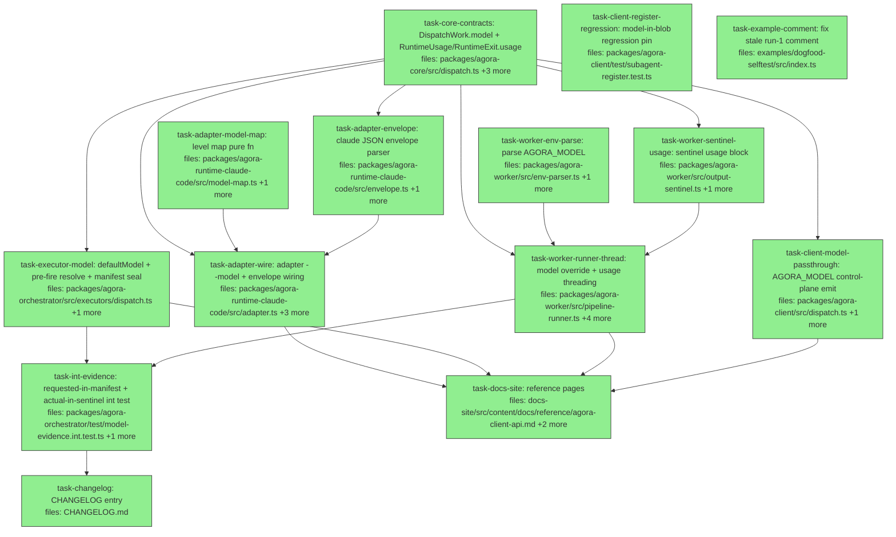

## Context

Driven by `docs/superpowers/specs/2026-06-06-agora-model-cost-evidence-design.md` (audited, 8 amendments applied — see its §10). Motivated by dogfood run 2: workers ran `claude-opus-4-7[1m]` by image-default fall-through; manifests sealed `model: { id: '' }`; cost/tokens discarded.

Feature: pin-optional capture-always model identity. One opaque `model` string (`fast`/`standard`/`max` reserved levels mapped by the adapter to `haiku`/`sonnet`/`opus`; anything else passes through). Per-layer resolution (spec D6): client passes `work.model` verbatim and emits control-plane `AGORA_MODEL`; executor owns authorization (`def.model ?? defaultModel`, sealed in manifest ≡ set on work); worker owns runtime effect (`parsed.model ?? subagentDef.model` → `RuntimeInvocation.model`); adapter owns provider mapping (`spec.model` → `--model`, never env). Capture: adapter switches to `claude --print --output-format json`, parses the envelope (byte-identical text incl. trailing-newline rule; usage best-effort), worker seals an additive `usage` block in the output sentinel (after `outputs`, before `blocks`).

Key audit facts the plan leans on: registration + CLI `--model` already exist (`subagent-register.ts:34,74`, `cmd-subagent.ts:33`) — test/docs only; `RuntimeInvocation.model` already exists and is populated (`runtime-adapter.ts:42`, `pipeline-runner.ts:125`); the §7.7 env firewall strips all `AGORA_*` from runtime env (`runtime-env-filter.ts:54`); `DispatchExecutor` fires before resolving the subagent today (`dispatch.ts:68-77`) — pre-fire fetch restructure required; adapter `invoke()` tests are posix-gated, so level-map/envelope logic must be exported pure functions.

Gates before PR: `pnpm -r lint`, `pnpm -r typecheck` (tsc --noEmit), `pnpm -r test`, docs-site build.

## Tasks

## Task: core contracts — DispatchWork.model + RuntimeUsage

```yaml
id: task-core-contracts
depends_on: []
files:
  - packages/agora-core/src/dispatch.ts
  - packages/agora-core/src/runtime-adapter.ts
  - packages/agora-core/src/index.ts
  - packages/agora-core/test/model-contracts.test.ts
status: done
model_hint: standard
```

Both additive contract changes (spec §3.3) in the types-only package: `DispatchWork.model` (the authorized request) and the shared `RuntimeUsage` shape used by `RuntimeExit.usage` (adapter→worker carrier) and later by the sentinel. One definition — the sentinel and envelope parser import it (DRY; spec §4.3).

## Implementation

```typescript
// packages/agora-core/src/runtime-adapter.ts (additions)
/** Actual model usage reported by the runtime CLI for one invocation.
 *  Best-effort: absent whenever the runtime's output is not parseable.
 *  durationMs is MODEL time as reported by the runtime — distinct from
 *  DispatchResult.durationMs (worker wall) and BlockOutcome.durationMs (block wall). */
export interface RuntimeUsage {
  /** Actual model ids that served the invocation (e.g. keys of claude's modelUsage). */
  models: string[];
  costUsd?: number;
  turns?: number;
  durationMs?: number;
}

export interface RuntimeExit {
  // ...existing fields unchanged...
  /** Best-effort usage capture. Optional + additive. */
  usage?: RuntimeUsage;
}
```

```typescript
// packages/agora-core/test/model-contracts.test.ts
import type { DispatchWork, RuntimeExit, RuntimeUsage } from '../src/index.js';

it('DispatchWork accepts an optional model string', () => {
  const w: DispatchWork = { subagent: 's', target: 't', model: 'max' };
  expect(w.model).toBe('max');
});

it('RuntimeExit accepts an optional usage block typed as RuntimeUsage', () => {
  const usage: RuntimeUsage = { models: ['claude-opus-4-7'], costUsd: 0.05, turns: 3 };
  const exit: RuntimeExit = { exitCode: 0, stdout: '', stderr: '', usage };
  expect(exit.usage?.models).toEqual(['claude-opus-4-7']);
});
```

`DispatchWork` gains `model?: string` (document the §2 grammar in its doc comment: reserved levels `fast|standard|max`, anything else provider-native; non-secret). Verify `src/index.ts` re-exports `RuntimeUsage` (add to the barrel if export lists are explicit). DispatchWork construction sites elsewhere are unaffected (optional field).

## Acceptance criteria

- `DispatchWork` compiles with and without `model`; doc comment states the level grammar and pin-optional posture.
- `RuntimeUsage` is exported from the package root; `RuntimeExit.usage?: RuntimeUsage` compiles with and without the field.
- `pnpm --filter @quarry-systems/agora-core build && pnpm --filter @quarry-systems/agora-core test` green; package keeps zero runtime dependencies.

Test file: `packages/agora-core/test/model-contracts.test.ts`.

## Task: adapter level map

```yaml
id: task-adapter-model-map
depends_on: []
files:
  - packages/agora-runtime-claude-code/src/model-map.ts
  - packages/agora-runtime-claude-code/test/model-map.test.ts
status: done
model_hint: cheap
```

Pure exported function (platform-independent tests — adapter `invoke()` suites are posix-gated, this must not be). Maps the reserved levels to claude-code's bare aliases; passes any other string through; absent → undefined (spec §2, §4.2).

## Implementation

```typescript
// packages/agora-runtime-claude-code/src/model-map.ts
/** Reserved portable levels (spec §2). A second adapter brings its own map. */
const LEVEL_MAP: Record<string, string> = { fast: 'haiku', standard: 'sonnet', max: 'opus' };

/** Resolve the requested model string to the value passed to `--model`.
 *  Levels map to claude CLI bare aliases (version-free); anything else passes through verbatim. */
export function resolveModelArg(model: string | undefined): string | undefined {
  if (!model) return undefined;
  return LEVEL_MAP[model] ?? model;
}
```

```typescript
// packages/agora-runtime-claude-code/test/model-map.test.ts
import { resolveModelArg } from '../src/model-map.js';

it('maps the three reserved levels to claude bare aliases', () => {
  expect(resolveModelArg('fast')).toBe('haiku');
  expect(resolveModelArg('standard')).toBe('sonnet');
  expect(resolveModelArg('max')).toBe('opus');
});
```

## Acceptance criteria

- `fast`→`haiku`, `standard`→`sonnet`, `max`→`opus`.
- Non-level strings pass through byte-identical (`claude-opus-4-7` → `claude-opus-4-7`).
- `undefined`/empty → `undefined` (no flag emitted downstream).
- Tests run on Windows (no spawn, no skip gate).

Test file: `packages/agora-runtime-claude-code/test/model-map.test.ts`.

## Task: claude JSON envelope parser

```yaml
id: task-adapter-envelope
depends_on: [task-core-contracts]
files:
  - packages/agora-runtime-claude-code/src/envelope.ts
  - packages/agora-runtime-claude-code/test/envelope.test.ts
status: done
model_hint: standard
```

Pure exported parser for `claude --print --output-format json` stdout (spec §4.2). Extracts the agent text (byte-identity with raw mode, trailing-newline rule pinned) and best-effort `RuntimeUsage`. Malformed/non-JSON stdout falls back to raw text with no usage — capture must never fail a dispatch that would otherwise succeed.

## Implementation

```typescript
// packages/agora-runtime-claude-code/src/envelope.ts
import type { RuntimeUsage } from '@quarry-systems/agora-core';

export interface ParsedEnvelope {
  /** Agent text, normalized to end with at least one trailing \n (never double-appended) —
   *  matching what raw `claude --print` stdout carries for the same content. */
  text: string;
  usage?: RuntimeUsage;
}

/** Best-effort parse. Non-JSON / wrong-shape stdout => { text: rawStdout } verbatim (no normalization —
 *  raw mode IS the fallback), usage absent. */
export function parseClaudeEnvelope(rawStdout: string): ParsedEnvelope {
  try {
    const env = JSON.parse(rawStdout) as Record<string, unknown>;
    if (typeof env.result !== 'string') return { text: rawStdout };
    const text = env.result.endsWith('\n') ? env.result : env.result + '\n';
    const models = env.modelUsage && typeof env.modelUsage === 'object' ? Object.keys(env.modelUsage) : [];
    const usage: RuntimeUsage = { models };
    if (typeof env.total_cost_usd === 'number') usage.costUsd = env.total_cost_usd;
    if (typeof env.num_turns === 'number') usage.turns = env.num_turns;
    if (typeof env.duration_ms === 'number') usage.durationMs = env.duration_ms;
    return { text, usage };
  } catch {
    return { text: rawStdout };
  }
}
```

```typescript
// packages/agora-runtime-claude-code/test/envelope.test.ts
import { parseClaudeEnvelope } from '../src/envelope.js';

it('extracts text with exactly one trailing newline and usage from a well-formed envelope', () => {
  const raw = JSON.stringify({ result: 'ok', modelUsage: { 'claude-opus-4-7': {} }, total_cost_usd: 0.05, num_turns: 1, duration_ms: 1175 });
  const p = parseClaudeEnvelope(raw);
  expect(p.text).toBe('ok\n');
  expect(p.usage).toEqual({ models: ['claude-opus-4-7'], costUsd: 0.05, turns: 1, durationMs: 1175 });
});
```

Tolerances to cover: envelope without `modelUsage` (older CLIs) → `usage.models: []` with whatever scalars exist; `result` already newline-terminated (no double append); non-JSON stdout → verbatim fallback; JSON that isn't the envelope shape (no string `result`) → verbatim fallback.

## Acceptance criteria

- Well-formed envelope: text ends with at least one trailing `\n`, appended only when `result` lacks one (never double-appended); usage carries models (keys of `modelUsage`), costUsd, turns, durationMs when present.
- `result` already ending in `\n` passes through byte-identical.
- Missing `modelUsage`/scalars tolerated (fields omitted, models `[]`).
- Non-JSON and wrong-shape-JSON stdout: returned verbatim as text, usage absent.
- Tests run on Windows (pure function, no spawn).

Test file: `packages/agora-runtime-claude-code/test/envelope.test.ts`.

## Task: adapter wiring — --model flag + envelope capture

```yaml
id: task-adapter-wire
depends_on: [task-core-contracts, task-adapter-model-map, task-adapter-envelope]
files:
  - packages/agora-runtime-claude-code/src/adapter.ts
  - packages/agora-runtime-claude-code/src/claude-spawn.ts
  - packages/agora-runtime-claude-code/test/adapter.test.ts
  - packages/agora-runtime-claude-code/test/claude-spawn.test.ts
status: done
model_hint: standard
```

Wire the two pure pieces into the adapter (spec §4.2): `spec.model` (the existing `RuntimeInvocation.model` typed seam, ignored until now) → `resolveModelArg` → `--model <id>` spawn arg; spawn always adds `--output-format json`; stdout flows through `parseClaudeEnvelope` so `RuntimeExit.stdout` carries the normalized text and `RuntimeExit.usage` the capture. The adapter never reads model from env (SoC; §7.7 firewall untouched).

## Implementation

```typescript
// packages/agora-runtime-claude-code/src/claude-spawn.ts — args shape becomes:
const args = [
  '--print',
  '--output-format', 'json',
  ...(opts.dangerouslySkipPermissions ? ['--dangerously-skip-permissions'] : []),
  ...(opts.model ? ['--model', opts.model] : []),   // new optional SpawnClaudeOptions.model (already level-resolved)
  opts.prompt,
  ...(opts.extraArgs ?? []),
];
```

```typescript
// packages/agora-runtime-claude-code/test/claude-spawn.test.ts (arg-construction assertions, platform-independent
// if args-building is extracted; spawn-level assertions stay in the posix-gated suite per repo convention)
it('includes --output-format json always and --model only when provided', () => {
  expect(buildClaudeArgs({ prompt: 'p', model: 'opus' })).toEqual(['--print', '--output-format', 'json', '--model', 'opus', 'p']);
  expect(buildClaudeArgs({ prompt: 'p' })).toEqual(['--print', '--output-format', 'json', 'p']);
});
```

In `adapter.ts` `invoke()`: `const modelArg = resolveModelArg(spec.model)` → pass to spawn; after spawn, `const { text, usage } = parseClaudeEnvelope(result.stdout)` → return `{ ...exit, stdout: text, ...(usage ? { usage } : {}) }`. Extract an exported `buildClaudeArgs(opts)` helper so arg construction is testable on all platforms (keeps the existing `spawnClaude` behavior contract; posix-gated suites keep covering the spawn path).

## Acceptance criteria

- `spec.model: 'max'` produces `--model opus` in spawn args; `spec.model: 'claude-opus-4-7'` produces `--model claude-opus-4-7`; no `spec.model` → no `--model` flag.
- `--output-format json` present on every spawn.
- `RuntimeExit.stdout` equals the envelope-normalized text (trailing-newline rule per task-adapter-envelope); on unparseable stdout it equals raw stdout verbatim and `usage` is absent.
- `RuntimeExit.usage` populated from the envelope when present.
- Existing posix-gated adapter suite updated and green in CI; arg-construction tests green on Windows.

Test file: `packages/agora-runtime-claude-code/test/claude-spawn.test.ts` (plus updates in `test/adapter.test.ts`).

## Task: client control-plane pass-through

```yaml
id: task-client-model-passthrough
depends_on: [task-core-contracts]
files:
  - packages/agora-client/src/dispatch.ts
  - packages/agora-client/test/dispatch-model.test.ts
status: done
model_hint: standard
```

`fireWork` emits the control-plane env var `AGORA_MODEL=<work.model>` beside `AGORA_DISPATCH_ID` et al. (the `dispatch.ts:248-275` block) when `work.model` is set; emits nothing when unset. The client performs NO def-fallback and NO level interpretation — pass-through verbatim (spec D6 — the worker owns the def-fallback; regression-pin this absence).

## Implementation

```typescript
// packages/agora-client/src/dispatch.ts — inside the env assembly block (the map is
// named `envVars`, dispatch.ts:248):
if (work.model !== undefined && work.model !== '') {
  envVars.AGORA_MODEL = work.model;
}
```

```typescript
// packages/agora-client/test/dispatch-model.test.ts
it('emits AGORA_MODEL verbatim when work.model is set and omits it when unset', async () => {
  const { taskSpec: withModel } = await fireCapturingTaskSpec({ subagent: 'echo', target: 'local', model: 'max' });
  expect(withModel.env.AGORA_MODEL).toBe('max'); // verbatim — no level mapping client-side
  const { taskSpec: without } = await fireCapturingTaskSpec({ subagent: 'echo', target: 'local' });
  expect('AGORA_MODEL' in without.env).toBe(false);
});
```

Follow the existing test conventions in `packages/agora-client/test/` for capturing the `TaskSpec` handed to the compute provider (the suite already fakes `ComputeProvider`). Add a case registering a subagent WITH `model` and dispatching WITHOUT `work.model` — assert `AGORA_MODEL` is absent (the client does not resolve the def; D6 regression).

## Acceptance criteria

- `work.model: 'max'` → `TaskSpec.env.AGORA_MODEL === 'max'` (verbatim, unmapped).
- No `work.model` → no `AGORA_MODEL` key, even when the subagent def carries `model` (D6: no client-side def-fallback).
- Existing dispatch tests untouched and green.

Test file: `packages/agora-client/test/dispatch-model.test.ts`.

## Task: registration model regression pin

```yaml
id: task-client-register-regression
depends_on: []
files:
  - packages/agora-client/test/subagent-register.test.ts
status: done
model_hint: cheap
```

Test-only. The audit found `subagent.register` already persists `model` into the canonical def blob inside the content hash (`subagent-register.ts:34,74`) — pre-existing behavior with no dedicated coverage. Pin it so the feature's foundation can't silently regress. **Append the new cases to the EXISTING suite** — its memory-storage harness (`makeMemoryStorage`/`makeClient`, `subagent-register.test.ts:11-60`) is file-local and not exported; a separate file would force duplicating it (plan-audit finding 3).

## Implementation

```typescript
// appended to packages/agora-client/test/subagent-register.test.ts — use the file's
// existing local harness (makeMemoryStorage/makeClient, lines 11-60) and its existing
// stored-blob read pattern verbatim:
it('persists model into the stored canonical def', async () => {
  const ref = await client.subagent.register({ name: 's', promptTemplate: 'p', model: 'max' });
  const def = readStoredDef(ref); // however the surrounding suite reads the canonical blob
  expect(def.model).toBe('max');
});
```

```typescript
it('content hash differs between model and no-model registrations', async () => {
  const a = await client.subagent.register({ name: 'a', promptTemplate: 'p', model: 'max' });
  const b = await client.subagent.register({ name: 'b', promptTemplate: 'p' });
  expect(a.contentHash).not.toBe(b.contentHash); // model participates in identity
});
```

## Acceptance criteria

- Registered `model` survives to the stored blob (`def.model === 'max'`); omitted model stores `null` (current canonicalization).
- `model` participates in the content hash (different hash with vs without).
- All pre-existing cases in the suite untouched and green.

Test file: `packages/agora-client/test/subagent-register.test.ts`.

## Task: worker env-parser AGORA_MODEL

```yaml
id: task-worker-env-parse
depends_on: []
files:
  - packages/agora-worker/src/env-parser.ts
  - packages/agora-worker/test/env-parser.test.ts
status: done
model_hint: cheap
```

Parse the new optional control-plane var `AGORA_MODEL` into the worker's parsed-env struct (spec §4.1). Optional string, no validation of content (opaque — levels are the adapter's business). Like every `AGORA_*` var it is already stripped from the runtime env by the §7.7 firewall; no firewall change.

## Implementation

```typescript
// packages/agora-worker/src/env-parser.ts — WorkerConfig gains the field; parseWorkerEnv
// returns a literal object (env-parser.ts:189-203), so the addition rides that literal:
/** Requested model (control-plane; work.model pass-through). Opaque string — levels resolve in the adapter. */
model?: string;
// in the returned literal (follow the file's existing optional-var idiom):
...(env.AGORA_MODEL ? { model: env.AGORA_MODEL } : {}),
```

```typescript
// packages/agora-worker/test/env-parser.test.ts
it('parses AGORA_MODEL when present and omits it when absent or empty', () => {
  expect(parseEnv({ ...minimalValidEnv(), AGORA_MODEL: 'max' }).model).toBe('max');
  expect(parseEnv(minimalValidEnv()).model).toBeUndefined();
  expect(parseEnv({ ...minimalValidEnv(), AGORA_MODEL: '' }).model).toBeUndefined();
});
```

Follow the file's existing optional-var conventions (`env-parser.ts:66-204`) — match how other optional vars are parsed and tested.

## Acceptance criteria

- `AGORA_MODEL=max` → `parsed.model === 'max'`; absent or empty → `undefined`.
- No validation/mapping of the value (opaque pass-through).
- Existing env-parser tests untouched and green.

Test file: `packages/agora-worker/test/env-parser.test.ts`.

## Task: sentinel usage block

```yaml
id: task-worker-sentinel-usage
depends_on: [task-core-contracts]
files:
  - packages/agora-worker/src/output-sentinel.ts
  - packages/agora-worker/test/output-sentinel.test.ts
status: done
model_hint: standard
```

Additive `usage?: RuntimeUsage` on `OutputSentinel` and an optional `usage` input on `writeSentinel` (spec §4.3). Insertion position is a frozen byte contract: conditional assignment lands **after `outputs`, before `blocks`** in the existing fixed order (`output-sentinel.ts:211-218`). Absence changes zero bytes (golden discipline — same posture as `verify`/`outputs`).

## Implementation

```typescript
// packages/agora-worker/src/output-sentinel.ts (additions)
import type { RuntimeUsage } from '@quarry-systems/agora-core';

export interface OutputSentinel {
  // ...existing fields...
  /** Wave: model-cost-evidence — best-effort actual usage (model ids, cost, turns, model time). Optional + additive. */
  usage?: RuntimeUsage;
  // blocks stays after usage in insertion order
}

// in writeSentinel(opts): accept opts.usage?: RuntimeUsage and, in the fixed
// conditional-assignment sequence, assign usage AFTER outputs and BEFORE blocks.
```

```typescript
// packages/agora-worker/test/output-sentinel.test.ts
it('includes usage after outputs and before blocks in key order, and omits it entirely when absent', async () => {
  const withUsage = await writeSentinel({ ...base(), usage: { models: ['claude-opus-4-7'], costUsd: 0.05 } });
  const keys = Object.keys(JSON.parse(await readStored(withUsage)));
  expect(keys.indexOf('usage')).toBeGreaterThan(keys.indexOf('outputs'));
  const withoutUsage = await writeSentinel({ ...base() });
  expect(Object.keys(JSON.parse(await readStored(withoutUsage)))).not.toContain('usage');
});
```

Mirror the existing `writeSentinel` test patterns at `output-sentinel.test.ts:277-341`. When `blocks` is present in a sentinel, assert `usage` sorts between `outputs` and `blocks`.

## Acceptance criteria

- Sentinel without `usage` is byte-identical to today (no key, no order shift).
- Sentinel with `usage` carries it after `outputs`, before `blocks`; round-trips stably.
- `usage` shape is `RuntimeUsage` imported from agora-core (no local duplicate type).

Test file: `packages/agora-worker/test/output-sentinel.test.ts`.

## Task: worker runner threading — model override + usage to seal

```yaml
id: task-worker-runner-thread
depends_on: [task-core-contracts, task-worker-env-parse, task-worker-sentinel-usage]
files:
  - packages/agora-worker/src/pipeline-runner.ts
  - packages/agora-worker/src/entrypoint.ts
  - packages/agora-worker/test/pipeline-runner.test.ts
  - packages/agora-worker/test/entrypoint.test.ts
  - packages/agora-worker/test/pipeline-golden.test.ts
status: done
model_hint: opus
```

Two threads through the worker (spec §4.1): (1) the runtime-effect model override — `parsed.model ?? subagentDef.model` applied where `BlockContext.subagent` is built (`entrypoint.ts:463-468`); `runAgentBlock` already forwards `ctx.subagent.model` as `RuntimeInvocation.model` (`pipeline-runner.ts:125`), so the override is one expression at the build site. (2) usage capture — `runAgentBlock` surfaces `RuntimeExit.usage`; the pipeline aggregates across agent blocks and the auto-seal passes it to `writeSentinel`.

Aggregation rule (multiple agent blocks in one pipeline): union of `models` (deduped, first-seen order); `costUsd`/`turns`/`durationMs` summed across blocks that report them (absent values skipped, not zeroed); if NO agent block reports usage, the sentinel gets no `usage` key at all.

## Implementation

```typescript
// packages/agora-worker/src/entrypoint.ts — where the subagent def feeds BlockContext
// (the parsed config is named `cfg` at entrypoint.ts:134; the def is `subagent` at :463):
const subagentForCtx = { ...subagent, model: cfg.model ?? subagent.model };
```

```typescript
// packages/agora-worker/test/pipeline-runner.test.ts
it('threads adapter usage into the sealed sentinel and prefers parsed.model over def.model', async () => {
  const adapter = makeFakeAdapter({ exitCode: 0, stdout: 'ok\n', stderr: '', usage: { models: ['claude-haiku-4-5'], costUsd: 0.01 } });
  const { sentinel, invocations } = await runPipelineCapturing({ adapter, parsedModel: 'fast', defModel: 'max' });
  expect(invocations[0].model).toBe('fast');           // worker forwards opaque string; no level mapping here
  expect(sentinel.usage).toEqual({ models: ['claude-haiku-4-5'], costUsd: 0.01 });
});
```

Golden additions in `pipeline-golden.test.ts`: one new case with a fake adapter reporting usage — pin the exact key array with `usage` after `outputs` (`blocks` is absent here: this file covers default pipelines only, where `blocks` never appears — the before-`blocks` position pin is owned by task-worker-sentinel-usage) and round-trip stability; assert all EXISTING golden cases remain byte-identical (no usage → no key). Fake adapters in existing tests are unaffected (`usage` optional on `RuntimeExit`).

## Acceptance criteria

- `cfg.model` set → `RuntimeInvocation.model` receives it (overrides def); unset → def's model flows as today; worker performs no level mapping (opaque).
- Single agent block reporting usage → sentinel `usage` equals it verbatim.
- Two agent blocks reporting usage → models unioned in first-seen order, scalars summed; one reporting + one silent → silent one contributes nothing.
- No agent block reports usage → sentinel has no `usage` key; existing goldens byte-identical.
- New golden pins the key array with `usage` after `outputs` (default pipeline; `blocks` absent).
- Firewall regression (spec §6): in `entrypoint.test.ts`, with `AGORA_MODEL` set in the worker env, the adapter's received `ctx.env` does NOT contain `AGORA_MODEL` (stripped like all `AGORA_*`), while the invocation `model` field carries the value.

Test file: `packages/agora-worker/test/pipeline-runner.test.ts` (plus golden case in `test/pipeline-golden.test.ts`, override case in `test/entrypoint.test.ts`).

## Task: executor defaultModel + pre-fire resolve + manifest seal

```yaml
id: task-executor-model
depends_on: [task-core-contracts]
files:
  - packages/agora-orchestrator/src/executors/dispatch.ts
  - packages/agora-orchestrator/test/executors/dispatch.test.ts
status: done
model_hint: opus
```

The authorization side (spec §3.4). `DispatchExecutorOptions` gains `defaultModel?: string`. Restructure `fire`: today the `DispatchWork` fires (`dispatch.ts:68-77`) before the subagent resolves and `resolveModel` fetches the def blob post-fire (`dispatch.ts:88-89, 190-208`). Add a **pre-fire** `resolveLatest` + def-blob fetch; compute `effective = def.model ?? defaultModel` ONCE; set `work.model = effective` when defined; seal `manifest.model.id = effective ?? ''`; the post-fire `resolveModel` fetch is **replaced** (not duplicated) by the held value. Best-effort posture preserved: pre-fire fetch failure → no `work.model`, manifest `id: ''`, fire proceeds (matching today's `resolveModel` zero fallback — the existing "unreadable subagent blob yields model { id: '' } without failing fire" test at `dispatch.test.ts:1272` must keep passing with the new structure).

Race caveat (record in a code comment): pre-fire `resolveLatest` can race a concurrent re-registration relative to the client's own resolve inside `fire`. The guaranteed invariant is **manifest ≡ dispatched work** (both from the single pre-fire resolution); manifest-vs-worker-blob equality is the deferred verify row's business (spec §9).

## Implementation

```typescript
// packages/agora-orchestrator/src/executors/dispatch.ts (shape)
export interface DispatchExecutorOptions {
  // ...existing...
  /** Authorization-side default when the subagent def pins no model (spec D3/D6). */
  defaultModel?: string;
}

// in fire(), BEFORE building DispatchWork:
const requested = await this.resolveRequestedModel(subagentName); // def.model ?? this.opts.defaultModel; undefined on fetch failure with no default
const work: DispatchWork = { ...existing, ...(requested ? { model: requested } : {}) };
// manifest assembly reuses `requested`:
model: { id: requested ?? '', temperature: 0, maxTokens: 0 },
```

```typescript
// packages/agora-orchestrator/test/executors/dispatch.test.ts
it('seals defaultModel into manifest AND dispatched work when the subagent def has no model', async () => {
  const { executor, captured } = makeExecutor({ defaultModel: 'standard', subagentDef: { name: 's' } });
  await executor.fire(item());
  expect(captured.work.model).toBe('standard');
  expect(captured.manifest.model.id).toBe('standard');   // manifest ≡ work, the §3.4 invariant
});
```

Precedence matrix to cover: def-only / default-only / both (def wins) / neither (manifest `''`, work carries no model) — asserting `manifest.model.id === (captured.work.model ?? '')` in every case. Reuse the existing executor test harness (`makeDeferredCompute`, `makeMemoryStorage` patterns already in this file). **Capture seam (plan-audit finding 8):** the harness has no `captured.work` — capture the `DispatchWork` by wrapping/spying `client.dispatch.fire`; do NOT observe via `TaskSpec.env.AGORA_MODEL` (that's the sibling passthrough task's surface, deliberately not a dependency).

## Acceptance criteria

- Precedence: `def.model` > `defaultModel` > unset; all four matrix cells pass with `manifest.model.id ≡ work.model ?? ''`.
- Exactly ONE subagent def-blob fetch per fire (the pre-fire one) — no post-fire duplicate.
- Unreadable def blob: existing best-effort test (`dispatch.test.ts:1272` behavior) still passes — fire proceeds, manifest `id: ''` (or `defaultModel` when configured), work.model absent (or `defaultModel`).
- Race caveat documented at the pre-fire fetch site.

Test file: `packages/agora-orchestrator/test/executors/dispatch.test.ts`.

## Task: integration — requested in manifest, actual in sentinel

```yaml
id: task-int-evidence
depends_on: [task-executor-model, task-worker-runner-thread]
files:
  - packages/agora-orchestrator/test/model-evidence.int.test.ts
  - packages/agora-orchestrator/test/fixtures/inproc-worker-executor.ts
status: done
model_hint: opus
```

End-to-end (spec §6): one in-proc run through the `InprocWorkerExecutor` fixture proving the full evidence story — requested model sealed in the dispatch manifest, actual usage sealed in the output sentinel, AND the worker invocation actually receiving the model (the chain must be real, not faked at the manifest). The fixture today seals `executorManifest: {}` (`inproc-worker-executor.ts:194`), emits no `AGORA_MODEL` in `workerEnv` (`:149-158`), and its stub adapter throws on agent blocks (`:45-51`); `RunWorkerDeps` is the injection seam (`:163-168`, `entrypoint.ts:90-96`). FOUR fixture extensions are required, all additive:

1. `adapter?: RuntimeAdapter` option — injected for agent blocks (default: reject as today).
2. `defaultModel?: string` option + requested-model resolution mirroring the executor (`def.model ?? defaultModel`, def fetched from the pinned subagent URI in `item.inputs.subagent`).
3. `model: { id: <effective ?? ''>, temperature: 0, maxTokens: 0 }` sealed into `executorManifest`.
4. `AGORA_MODEL=<effective>` emitted into `workerEnv` when set — WITHOUT this the manifest would claim a model the in-proc worker never received, faking the very chain under test.

## Implementation

```typescript
// packages/agora-orchestrator/test/model-evidence.int.test.ts
it('seals requested model in the manifest and actual usage in the sentinel on a real in-proc run', async () => {
  const fakeAdapter = adapterReturning({ exitCode: 0, stdout: 'done\n', stderr: '', usage: { models: ['claude-sonnet-4-6'], costUsd: 0.02, turns: 2 } });
  const h = await runInprocPlan({ defaultModel: 'standard', adapter: fakeAdapter, plan: singleAgentItemPlan() });
  const manifest = await h.readManifest('item-1');
  expect(manifest.executorManifest.model.id).toBe('standard');     // requested (authorization)
  expect(h.invocations[0].model).toBe('standard');                 // the worker invocation REALLY received it
  const sentinel = await h.readSentinel('item-1');
  expect(sentinel.usage).toEqual({ models: ['claude-sonnet-4-6'], costUsd: 0.02, turns: 2 }); // actual (capture)
});
```

```typescript
// fixture extension shape (test/fixtures/inproc-worker-executor.ts)
export interface InprocOptions {
  // ...existing...
  /** Inject a RuntimeAdapter for agent blocks (default: reject as today). */
  adapter?: RuntimeAdapter;
}
```

Also assert the unpinned cell end-to-end: no def model + no defaultModel → manifest `model.id === ''` AND the worker invocation received `model: undefined` (pin-optional posture survives the whole chain).

## Acceptance criteria

- Requested: manifest `model.id` equals the executor's effective requested string.
- Actual: sentinel `usage` equals the fake adapter's reported usage.
- Unpinned chain: manifest `''`, invocation model `undefined`, sentinel without `usage` when the adapter reports none.
- Fixture change is additive — all existing fixture consumers (`pattern-dogfood`, `data-mapreduce`, `pattern-mapreduce` int tests) untouched and green.

Test file: `packages/agora-orchestrator/test/model-evidence.int.test.ts`.

## Task: docs-site reference updates

```yaml
id: task-docs-site
depends_on: [task-adapter-wire, task-executor-model, task-worker-runner-thread, task-client-model-passthrough]
files:
  - docs-site/src/content/docs/reference/agora-client-api.md
  - docs-site/src/content/docs/reference/dispatch-lifecycle.md
  - docs-site/src/content/docs/reference/cli.md
status: done
model_hint: standard
is_wiring_task: true
```

Documentation for the shipped behavior (spec §7) — written against the LANDED code of the dependency tasks, claims code-verified (the run-2 lesson: no invented specifics). `agora-client-api.md`: subagent `model` field, `DispatchWork.model`, the level vocabulary (`fast`/`standard`/`max` → claude `haiku`/`sonnet`/`opus`, pass-through otherwise, pin-optional) — the single home for the level table. `dispatch-lifecycle.md`: requested-in-manifest (`model.id`, precedence def > executor `defaultModel`), actual-in-sentinel (`usage` block, best-effort), and the three-durations disambiguation (`usage.durationMs` is model time, adapter-reported — distinct from `DispatchResult.durationMs` and per-block durations). `cli.md`: `subagent register --model` (documents the existing flag). Cross-link the level table from the other two pages rather than restating it.

## Acceptance criteria

- Every stated claim matches landed code (verify each against the merged dependency tasks' diffs — no `inputs/patch.diff`-class inventions).
- Level table appears exactly once (client-api) and is cross-linked, not duplicated.
- `pnpm build` in `docs-site/` green including `starlight-links-validator`.

Test file: n/a (docs; the site build is the gate).

## Task: CHANGELOG entry

```yaml
id: task-changelog
depends_on: [task-int-evidence, task-docs-site]
files:
  - CHANGELOG.md
status: done
model_hint: cheap
is_wiring_task: true
```

One CHANGELOG entry for the wave, following the file's existing entry format: pin-optional capture-always model identity — `DispatchWork.model` + levels, executor `defaultModel`, `--model` + JSON-envelope capture in the claude adapter, additive sentinel `usage` block. Cite the spec path.

## Acceptance criteria

- Entry matches the file's established format and names all four surfaces (core contract, executor option, adapter capture, sentinel block).
- No claims beyond what landed.

Test file: n/a.

## Task: fix stale run-1 comment in dogfood driver

```yaml
id: task-example-comment
depends_on: []
files:
  - examples/dogfood-selftest/src/index.ts
status: done
model_hint: cheap
is_wiring_task: true
```

Ride-along (spec §8): the run-2 driver still carries run-1's concurrency comment ("concurrency 2: the 4 items hold disjoint per-file locks…", `index.ts:149-150`). Reword for the current two-item dependent chain (A then B via `needs`; concurrency 2 is a no-op pacing bound for a chain of two). Comment-only change.

## Acceptance criteria

- Comment accurately describes the run-2 plan (two items, dependent via `needs`, B strictly after A).
- No code changes; `pnpm typecheck` in `examples/dogfood-selftest/` green.

Test file: n/a.
