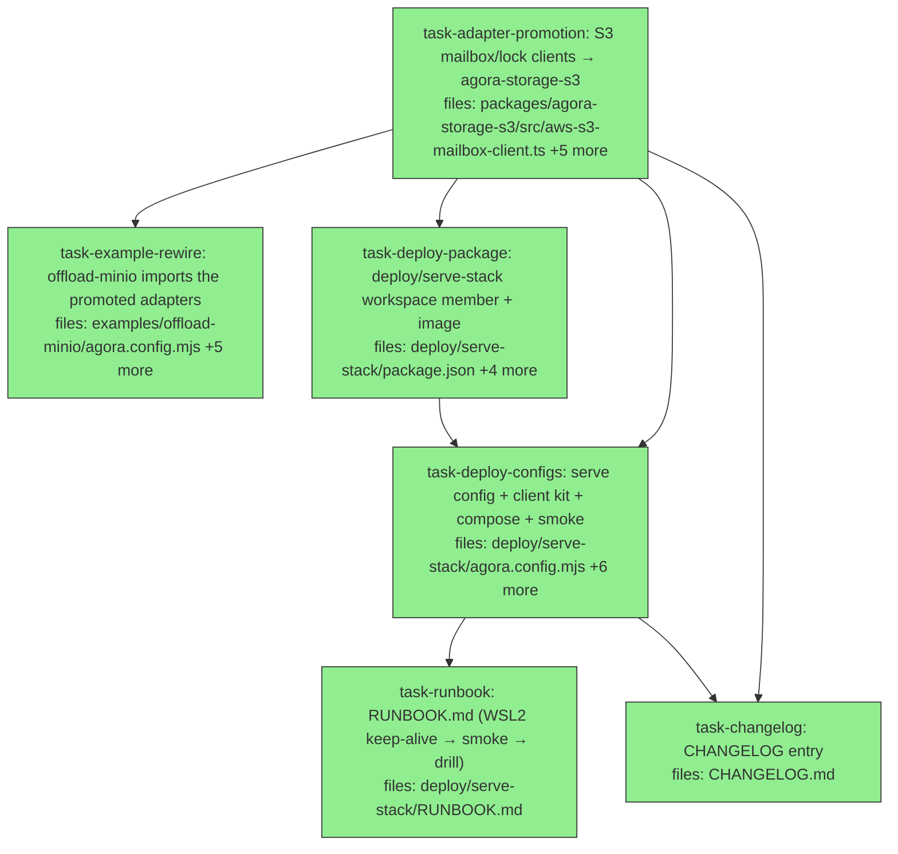

## Context

Driven by `docs/superpowers/specs/2026-06-07-agora-serve-stack-design.md` (audited — 8 amendments, §7 changelog; the audit-pinned details are BINDING — read the spec first). The wave has exactly ONE product change (the adapter promotion the offload-minio README itself predicted: "promote … a second consumer now exists") plus the `deploy/serve-stack/` artifact set. Everything here is offline-verifiable; the live deployment (runbook execution on the WSL2 host) happens after merge with the user.

Audit-pinned facts the tasks lean on: `createLocalSigner` is generate-only — the serve config persists a `randomBytes(32)` seed and rebuilds the PKCS8 (`302e020100300506032b657004220420` + seed) per `examples/offload-minio/agora.config.mjs:77-92`; `storage.put` rejects arbitrary keys — public-key publication is a raw `PutObjectCommand` to `agora-data`; the worker image is config-level (`DispatchExecutor.workerImage`) and MUST be `:main` (never the example's `:latest` — pre-handoff); `pattern: pipeline` goes on a dedicated `gated` queue, never `default` (auto-chaining); `submitRun` is idempotent by run id → the smoke stamps `smoke-<epoch>`; `Dockerfile.serve` needs repo-root context and currently copies only `packages/ examples/` → the deploy Dockerfile additionally copies `deploy/`; endpoint duality (in-container `host.docker.internal:9000`, laptop `localhost:9000`) with `extra_hosts` on serve AND `LocalDockerProvider.extraHosts` for siblings.

CONTROLLER PREREQUISITE (before dispatching task-deploy-package): none — that task owns `pnpm-workspace.yaml` + `pnpm-lock.yaml` itself (it IS the scaffold; marked wiring).

STALE-DIST RULE: after task-adapter-promotion lands, `pnpm --filter @quarry-systems/agora-storage-s3 build` before dispatching task-example-rewire / task-deploy-configs (their imports resolve from dist).

Gates before PR: `pnpm -r lint`, `pnpm -r typecheck`, `pnpm -r test` (the storage-s3 adapter tests are S3-endpoint-gated — skipped locally, same as today in the example), `docker compose -f deploy/serve-stack/docker-compose.yml config -q` (compose syntax gate), offload-minio offline smoke test green.

## Tasks

## Task: promote S3 mailbox and lock clients into agora-storage-s3

```yaml
id: task-adapter-promotion
depends_on: []
files:
  - packages/agora-storage-s3/src/aws-s3-mailbox-client.ts
  - packages/agora-storage-s3/src/aws-s3-lock-client.ts
  - packages/agora-storage-s3/src/index.ts
  - packages/agora-storage-s3/package.json
  - packages/agora-storage-s3/test/aws-s3-mailbox-client.test.ts
  - packages/agora-storage-s3/test/aws-s3-lock-client.test.ts
status: done
model_hint: standard
```

AUDIT-PINNED DEPENDENCY: both adapters TYPE-import `MailboxS3Client`/`S3LockClient` from `@quarry-systems/agora-orchestrator` (mailbox-client.ts:2 / lock-client.ts:2) — add it to storage-s3's package.json as a **devDependency** (imports are type-only; runtime consumers already depend on the orchestrator directly; no cycle — orchestrator does not depend on storage-s3). Do NOT run `pnpm install` (the lockfile is owned by task-deploy-package, which now depends on this task and regenerates it once).

The one product change (spec §3, audit #5 — the example README's own second-consumer trigger). MOVE `AwsS3MailboxClient` and `AwsS3LockClient` from `examples/offload-minio/src/` into `agora-storage-s3` as exported classes (verbatim semantics — this is a promotion, not a rewrite; ~30 lines each), export from the package barrel, and bring their integration tests across (`examples/offload-minio/test/aws-s3-mailbox-client.test.ts` / `aws-s3-lock-client.test.ts` — keep the `AGORA_S3_ENDPOINT`-gated skip convention so they stay CI/local-optional exactly as today). Do NOT touch the example's files (a sibling task rewires it).

## Implementation

```typescript
// packages/agora-storage-s3/src/index.ts (additions to the barrel)
export { AwsS3MailboxClient } from './aws-s3-mailbox-client.js';
export { AwsS3LockClient } from './aws-s3-lock-client.js';
```

```typescript
// packages/agora-storage-s3/test/aws-s3-mailbox-client.test.ts — moved suite, same gate:
const endpoint = process.env.AGORA_S3_ENDPOINT;
describe.skipIf(!endpoint)('AwsS3MailboxClient (integration)', () => { /* moved cases verbatim */ });
```

Check the source classes' imports (@aws-sdk client + types) against agora-storage-s3's existing dependencies (it already depends on the S3 SDK); add nothing new unless the classes genuinely need it. Match the package's lint/test conventions.

## Acceptance criteria

- Both classes exported from `@quarry-systems/agora-storage-s3`; semantics verbatim (diff against the example sources shows only path/import deltas).
- Moved tests keep the endpoint-gated skip; `pnpm --filter @quarry-systems/agora-storage-s3 test` green locally (suites skip), lint + typecheck + build green.
- Example files untouched by THIS task.

Test file: `packages/agora-storage-s3/test/aws-s3-mailbox-client.test.ts` (+ lock twin).

## Task: rewire offload-minio onto the promoted adapters

```yaml
id: task-example-rewire
depends_on: [task-adapter-promotion]
files:
  - examples/offload-minio/agora.config.mjs
  - examples/offload-minio/src/aws-s3-mailbox-client.ts
  - examples/offload-minio/src/aws-s3-lock-client.ts
  - examples/offload-minio/test/aws-s3-mailbox-client.test.ts
  - examples/offload-minio/test/aws-s3-lock-client.test.ts
  - examples/offload-minio/README.md
status: done
model_hint: standard
```

Delete the example's local adapter copies (BOTH src files AND both test twins — the lock test imports the source it would otherwise dangle on) and import from `@quarry-systems/agora-storage-s3` everywhere they were used (grep both class names across the example first; the example's package.json ALREADY depends on storage-s3 — audit-verified, no manifest change). UNCONDITIONAL README edit (audit #4): README.md:261-262 names both deleted test paths — update the test section to point at the promoted suites in `packages/agora-storage-s3/test/`, and update the :295 Tier-2 promotion-trigger note to record that it has FIRED (this deploy is the second consumer).

## Implementation

```javascript
// examples/offload-minio/agora.config.mjs — import delta only:
import { AwsS3MailboxClient, AwsS3LockClient } from '@quarry-systems/agora-storage-s3';
```

```sh
# verification: the example's offline smoke + the e2e suite (skipped without env) still type/lint clean
pnpm --filter offload-minio-example test
```

## Acceptance criteria

- No local copies of the two classes remain in the example; all imports resolve to the package.
- `pnpm --filter offload-minio-example test` green (offline smoke; gated suites skip).
- Example package.json gains the storage-s3 workspace dep ONLY if not already present (check first) — if it must change, it IS in scope? It is NOT in files: — report BLOCKED if needed rather than editing.

Test file: existing example suites (offline smoke).

## Task: deploy/serve-stack workspace member + serve image

```yaml
id: task-deploy-package
depends_on: [task-adapter-promotion]
files:
  - deploy/serve-stack/package.json
  - deploy/serve-stack/Dockerfile
  - deploy/serve-stack/serve-entrypoint.mjs
  - pnpm-workspace.yaml
  - pnpm-lock.yaml
status: done
model_hint: standard
is_wiring_task: true
```

The scaffold (spec §3 rows 1; audit #2): add `deploy/*` to `pnpm-workspace.yaml`; create `deploy/serve-stack/package.json` (private, BUSL-1.1, type module, workspace deps: agora-orchestrator, agora-client, agora-storage-s3, agora-secret-store, agora-providers-local-docker, agora-cli as devDep for the laptop verbs; scripts: `smoke` → `node client/smoke.mjs`); run `pnpm install` (lockfile delta confined to the new member). `Dockerfile` = offload-minio's `Dockerfile.serve` shape (READ it first; repo-root context) additionally copying `deploy/` and with CMD pointing at this package's `serve-entrypoint.mjs`. `serve-entrypoint.mjs` = the example's entrypoint shape (READ `examples/offload-minio/serve-entrypoint.mjs`): import the deploy `agora.config.mjs`'s orchestrator/transport, run the serve loop with signal handling. NOTE: `agora.config.mjs` is a SIBLING task's file — the entrypoint imports it by path but must not create it; if the import target's expected export names need pinning, use the example's export names verbatim (`createOrchestrator`/transport per the example entrypoint) and state them in a comment as the contract.

## Acceptance criteria

- `pnpm install` succeeds with the new member (this regenerates the lockfile ONCE for both the new package and the promotion task's storage-s3 devDep — single-owner); `pnpm -r build` unaffected (the package has no build script or a no-op).
- `Dockerfile` copies `deploy/` in addition to the example shape; **CMD is `["node", "deploy/serve-stack/serve-entrypoint.mjs"]` — plain node, NOT the example's tsx** (audit #5: the example needs tsx only because its config imports TS sources; the deploy config is pure .mjs importing built dist; this package deliberately has no tsx dep).
- Entrypoint mirrors the example's signal handling; export-name contract with the config stated in a comment.

Test file: n/a (wiring; compose-config gate + the live runbook validate).

## Task: serve config + client kit + compose + smoke

```yaml
id: task-deploy-configs
depends_on: [task-adapter-promotion, task-deploy-package]
files:
  - deploy/serve-stack/agora.config.mjs
  - deploy/serve-stack/client/agora.config.mjs
  - deploy/serve-stack/client/smoke-plan.json
  - deploy/serve-stack/client/smoke.mjs
  - deploy/serve-stack/.env.example
  - deploy/serve-stack/docker-compose.yml
  - deploy/serve-stack/scripts/init-buckets.sh
status: done
model_hint: opus
```

AUDIT #3: `minio-init` bind-mounts `scripts/init-buckets.sh` — COPY the example's script into this stack (mounting the example's path would couple the "tear-downable as a unit" stack to example internals; ~40 duplicated shell lines is the accepted SoC trade, same judgement as the per-dir configs).

The heart of the deployment (spec §3 — every row's audit-pinned details are binding; READ the spec AND `examples/offload-minio/{agora.config.mjs,docker-compose.yml}` first — the example is the proven template, the spec lists the exact deltas):

- **`agora.config.mjs`** (serve-side): example shape + deltas — persisted-seed signer (first boot `randomBytes(32)` → `/data/signer-seed.hex` 0600; rebuild PKCS8 via the documented prefix; inline `Signer`); public-key publication via raw `PutObjectCommand` to `agora-data` as `public-key.json` `{ keyRef, alg: 'ed25519', spkiDer: base64 }` on boot (idempotent overwrite); `workerImage: 'ghcr.io/quarrysystems/agora-worker:main'` (NEVER `:latest`); queues `{ default: { concurrency: 2 }, gated: { concurrency: 2, pattern: pipeline } }`; promoted-adapter imports; `LocalDockerProvider.extraHosts` for sibling workers; everything else (mailbox/storage/anchor/secret-lane/executors `dispatch-a`/`dispatch-b`) per the example.
- **`client/agora.config.mjs`**: plain `.mjs`, promoted-adapter imports, `http://localhost:9000`, NO Anthropic key, default `client` export + named `orch` `{ transport, storage, anchor, verifySignature }`, `verifySignature` reading `client/public-key.json` (fetched per runbook) lazily/best-effort (absent file → return false, import-safe).
- **`client/smoke-plan.json` + `client/smoke.mjs`**: one `dispatch-a` item, subagent `smoke-edit`; `smoke.mjs` registers the capability+subagent (tiny inline fixture file content), stamps `smoke-<Date.now()>` as the run id, submits via the client config's transport, prints the id + the watch/audit/verify command lines.
- **`.env.example`**: `ANTHROPIC_API_KEY=`, `DOCKER_GID=` (stat one-liner comment).
- **`docker-compose.yml`**: the example's five services with the spec's hardening deltas (restart policies on long-lived; named volumes minio-data/serve-data only; project-local `env_file: .env`; build context `../..` with this package's Dockerfile; everything endpoint-duality verbatim).

## Implementation

```javascript
// deploy/serve-stack/agora.config.mjs — the signer delta (shape; the example's :77-92 block is the template)
import { randomBytes, createPrivateKey, createPublicKey, sign as edSign } from 'node:crypto';
const SEED_PATH = process.env.AGORA_SIGNER_SEED_PATH ?? '/data/signer-seed.hex';
function loadOrCreateSeed() { /* readFileSync hex | randomBytes(32) → writeFileSync mode 0o600 */ }
const PKCS8_PREFIX = Buffer.from('302e020100300506032b657004220420', 'hex');
// privateKey = createPrivateKey({ key: Buffer.concat([PKCS8_PREFIX, seed]), format: 'der', type: 'pkcs8' })
// signer = { keyRef: 'serve-stack-local', sign: async (root) => ({ alg: 'ed25519', bytes: edSign(null, root, privateKey), keyRef }) }
// publish: PutObjectCommand({ Bucket: 'agora-data', Key: 'public-key.json', Body: JSON.stringify({ keyRef, alg, spkiDer }) })
```

```sh
# verification gates for this task:
docker compose -f deploy/serve-stack/docker-compose.yml config -q          # compose syntax/interpolation
node --check deploy/serve-stack/agora.config.mjs                          # parse (import-safety is by construction: no top-level S3 I/O)
node --check deploy/serve-stack/client/agora.config.mjs
node --check deploy/serve-stack/client/smoke.mjs
```

## Acceptance criteria

- Compose config gate green (with a populated `.env` stub during the check); both configs + smoke parse; serve config performs NO top-level I/O beyond what the example's does (import-safe).
- The example's healthchecks, pinned upstream image tags (minio/localstack/mc release pins), and `depends_on` conditions are PRESERVED verbatim in the deploy compose (audit #7 — binding, not implied).
- All audit-pinned details present: `:main` image, gated queue (default queue patternless), seed persistence + 0600, raw-put publication, promoted-adapter imports, executor names matching the smoke plan, fresh smoke run ids.
- Client config exports default + orch; verify path lazy/best-effort.

Test file: n/a (config artifacts; gates above + the live runbook validate).

## Task: RUNBOOK.md

```yaml
id: task-runbook
depends_on: [task-deploy-configs]
files:
  - deploy/serve-stack/RUNBOOK.md
status: done
model_hint: standard
is_wiring_task: true
```

The ops half, documenting the LANDED artifacts (claims artifact-verified — read the sibling files first; spec §4's nine ordered steps are the binding outline, including: WSL2 prep + systemd, the keep-alive Task Scheduler step with its verification, the localhost-forwarding flakiness with both fixes (`networkingMode=mirrored` / sshd-in-WSL2), first boot (clone → install/build → .env with DOCKER_GID → docker pull `:main` → compose up), laptop setup (clone+install+build, ssh LocalForward, fetch public-key.json, smoke via smoke.mjs → watch live view → audit → verify), the crash drill with its two honest nuances (auto-restart IS the demo; orphaned sibling worker; recovery consumes the only retry), the update procedure (incl. the explicit worker `docker pull` — compose pull does NOT cover it), teardown, and §4.9's warts verbatim-honest (LocalStack reconcile-vs-fire-time distinction, clock skew `hwclock -s`, disk prune).

## Acceptance criteria

- All nine spec-§4 steps present, ordered, with copy-pasteable commands that match the landed compose/config/smoke files exactly (paths, service names, env names).
- The public-key fetch step carries a copy-pasteable command (the bucket is authed S3: an `aws s3 cp --endpoint-url http://localhost:9000 s3://agora-data/public-key.json deploy/serve-stack/client/public-key.json` line with the minio creds, or the `mc` equivalent — audit #6).
- The §5 operational acceptance list reproduced as the final checklist.

Test file: n/a.

## Task: CHANGELOG entry

```yaml
id: task-changelog
depends_on: [task-adapter-promotion, task-deploy-configs]
files:
  - CHANGELOG.md
status: done
model_hint: cheap
is_wiring_task: true
```

One entry, established format: (1) `AwsS3MailboxClient`/`AwsS3LockClient` promoted from the offload-minio example into `@quarry-systems/agora-storage-s3` (the example README's second-consumer trigger, fired); (2) new `deploy/serve-stack/` — always-on serve deployment for WSL2 (compose + persisted-signer config + laptop client kit + runbook); cite the spec path; note the live deployment itself is a runbook execution, not claimed done.

## Acceptance criteria

- Matches existing format; names both surfaces; cites the spec; does not claim the deployment has been executed.

Test file: n/a.
