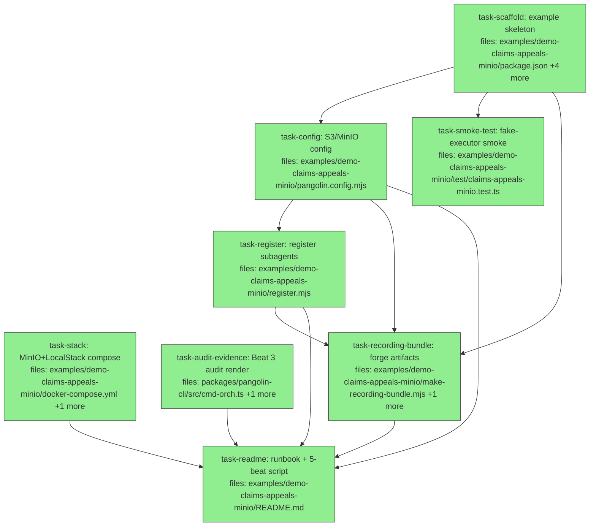

## Context

Drives `docs/superpowers/specs/2026-06-10-demo-claims-appeals-minio-design.md` — a new
sibling example `examples/demo-claims-appeals-minio` that runs the GTM script's 5 beats
against local MinIO with S3 Object Lock (truthfully **tamper-evident**), reskinning
`examples/offload-minio` into the claims-appeals domain. Host-side serve topology so the
recorded terminal is `pangolin orch …` verbatim.

**Repo-convention guardrails (from the interconnectivity audit):**
- Each example is **self-contained**; lift subagent defs / fixtures / the ~2-line forge
  snippet verbatim rather than sharing a cross-example module (matches offload-fanout vs
  offload-minio). Do NOT introduce a shared helper package.
- Config is **import-safe** (no I/O at module load; SQLite + signer derived without file
  writes — seeded ed25519 signer, the offload-minio pattern).
- Standard inline secret pattern: the launcher/compose supplies env; the config does not
  read `.env` itself.

Parallelism: `task-scaffold`, `task-stack`, and `task-audit-evidence` are roots and run
concurrently. `task-audit-evidence` (the shared `pangolin-cli` Beat-3 feature) runs fully
parallel to the example build.

## Tasks

## Task: example skeleton

```yaml
id: task-scaffold
depends_on: []
files:
  - examples/demo-claims-appeals-minio/package.json
  - examples/demo-claims-appeals-minio/plan.json
  - examples/demo-claims-appeals-minio/fixture/claims/claim-001.json
  - examples/demo-claims-appeals-minio/fixture/claims/claim-002.json
  - examples/demo-claims-appeals-minio/fixture/claims/claim-003.json
status: done
model_hint: cheap
is_wiring_task: true
```

The declarative skeleton: the package manifest, the run plan, and the three synthetic
denial fixtures. No logic — these are static files the rest of the example is wired
around. Combined as one task because splitting trivial file-disjoint static data buys no
parallelism and adds dispatch overhead; they share the one `examples/demo-claims-appeals-minio`
subsystem.

`package.json`: name `demo-claims-appeals-minio-example`, `type: module`, license
`BUSL-1.1`, scripts `{ start, start:env, test, typecheck, build }` mirroring
`examples/offload-minio/package.json`, plus the workspace deps it imports
(`@quarry-systems/pangolin-client`, `-orchestrator`, `-providers-local-docker`,
`-secret-store`, `-storage-s3`, `@aws-sdk/client-s3`) and devDeps `tsx`, `typescript`,
`vitest`.

`plan.json`: lift verbatim from `examples/demo-claims-appeals/plan.json` (id
`claims-demo-1`, 3 `claim-appeal` appeals with per-output `resourceLocks`
`appeals/CLM-00N.md`, a `verify` gate `depends_on` all three). Each appeal's `inputs`
must carry `"env": "minimal"` and `workerInput.claim` pointing at
`fixture/claims/claim-00N.json`.

`fixture/claims/claim-00{1,2,3}.json`: lift verbatim from
`examples/demo-claims-appeals/fixture/` (synthetic denials — `claimId` `CLM-00N`,
`claimant`, `service`, `denialReason`, `policySection`, `supportingFacts`; no real PHI).

## Acceptance criteria

- `pnpm --filter demo-claims-appeals-minio-example install` resolves (package name +
  workspace deps valid); `cat package.json | node -e "JSON.parse(...)"` parses.
- `plan.json` parses and has exactly 4 items: `appeal-001/002/003` (each
  `depends_on: []`, one `resourceLocks` entry) + `verify` (`depends_on` the three
  appeals).
- Each `fixture/claims/claim-00N.json` parses and contains all six fields; `claimId`
  equals `CLM-00N`.

Test file: `examples/demo-claims-appeals-minio/test/claims-appeals-minio.test.ts` (the
plan-shape assertion lives in task-smoke-test).

## Task: MinIO+LocalStack compose

```yaml
id: task-stack
depends_on: []
files:
  - examples/demo-claims-appeals-minio/docker-compose.yml
  - examples/demo-claims-appeals-minio/scripts/init-buckets.sh
status: done
model_hint: standard
is_wiring_task: true
```

The local infra the host `pangolin orch serve` talks to. Reskin
`examples/offload-minio/docker-compose.yml` and `scripts/init-buckets.sh`, **removing the
`serve` / `serve-data-init` services** (host-side serve topology — Approach A in the
spec). Keep `minio`, `localstack` (Secrets Manager), and `minio-init`. The
`pangolin-audit` bucket MUST be created with Object Lock (`mc mb --with-lock`,
COMPLIANCE) — that is what makes the run `external-immutable` / tamper-evident. Container
name prefix `pangolin-claims-*` to avoid colliding with the offload-minio stack.

## Implementation

```yaml
# docker-compose.yml — services: minio (9000/9001), localstack (4566, SERVICES=secretsmanager),
# minio-init (one-shot, runs scripts/init-buckets.sh). NO serve service.
name: pangolin-claims-minio
services:
  minio: { image: minio/minio:RELEASE..., command: server /data --console-address ":9001", ports: ["9000:9000","9001:9001"] }
  localstack: { image: localstack/localstack:3.8, environment: { SERVICES: secretsmanager } , ports: ["4566:4566"] }
  minio-init: { image: minio/mc:RELEASE..., entrypoint: ["/bin/sh","/init-buckets.sh"], volumes: ["./scripts/init-buckets.sh:/init-buckets.sh:ro"] }
```

```sh
# scripts/init-buckets.sh — object-lock audit bucket + normal data bucket (idempotent)
mc mb --with-lock --ignore-existing myminio/pangolin-audit   # WORM (COMPLIANCE) — basis for tamper-evident
mc mb --ignore-existing myminio/pangolin-data
```

## Acceptance criteria

- `docker compose -f docker-compose.yml config` validates and lists exactly three
  services: `minio`, `localstack`, `minio-init` (no `serve`).
- `scripts/init-buckets.sh` creates `pangolin-audit` with `--with-lock` and
  `pangolin-data` without; both `mc mb` calls use `--ignore-existing` (re-run safe).
- Manual check documented in README: after `docker compose up`, `mc ls` shows both
  buckets and `pangolin-audit` reports Object Lock enabled.

Test file: `examples/demo-claims-appeals-minio/test/claims-appeals-minio.test.ts` (no
automated container test — manual per spec §7).

## Task: S3/MinIO config

```yaml
id: task-config
depends_on: [task-scaffold]
files:
  - examples/demo-claims-appeals-minio/pangolin.config.mjs
status: done
model_hint: standard
is_wiring_task: true
```

The wired client + orch context. Reskin `examples/offload-minio/pangolin.config.mjs`:
namespace `demo-claims-appeals`, S3 storage + S3 mailbox + **S3ObjectLockAnchor**
(`pangolin-audit`), `AwsSecretStore`, the **seeded ed25519 signer** (import-safe, the
offload-minio pattern), `queues.default.concurrency: 2`. Host process defaults endpoints
to `localhost`; worker containers get `host.docker.internal` via `LocalDockerProvider`
`extraEnv` (lift offload-minio's `extraHosts`/`extraEnv`). Stage **two** per-dispatch
secrets in `makeExecutors`: `ANTHROPIC_API_KEY` and a synthetic `PAYER_PORTAL_TOKEN`
(default `'sk-payer-DEMO-not-a-real-token'` so Beat 2's redaction shows even unset).
Import-safe: no I/O at module load; SQLite only inside `createOrchestrator()`.

## Implementation

```javascript
// host endpoint default localhost; workers reach host.docker.internal via extraEnv (offload-minio).
const s3 = new S3Client({ endpoint: process.env.PANGOLIN_S3_ENDPOINT ?? 'http://localhost:9000',
  forcePathStyle: true, region: 'us-east-1',
  credentials: { accessKeyId: process.env.PANGOLIN_S3_ACCESS_KEY ?? 'minioadmin', secretAccessKey: process.env.PANGOLIN_S3_SECRET_KEY ?? 'minioadmin' } });
const anchor = new S3ObjectLockAnchor(new AwsS3LockClient({ client: s3, bucket: 'pangolin-audit' }), 'pangolin-audit');
// seeded signer: derive ed25519 keypair from PANGOLIN_SIGNER_SEED_HEX (no file I/O) — see offload-minio lines 76-91.
function makeExecutors() {
  const opts = { client, target: 'local', workerImage,
    secrets: { ANTHROPIC_API_KEY: { inline: process.env.ANTHROPIC_API_KEY ?? '' },
               PAYER_PORTAL_TOKEN: { inline: process.env.PAYER_PORTAL_TOKEN ?? 'sk-payer-DEMO-not-a-real-token' } } };
  return { dispatch: new DispatchExecutor(opts) };
}
export const orch = { transport, anchor, storage, verifySignature, createOrchestrator };
```

## Acceptance criteria

- `node -e "import('./pangolin.config.mjs')"` imports with **no file written under
  `tmpdir()`** at load (import-safe; assert no signer `.pem`/`.db` created by the import).
- `orch` export has keys `transport, anchor, storage, verifySignature, createOrchestrator`;
  `anchor` is an `S3ObjectLockAnchor` over bucket `pangolin-audit`.
- Sign→verify roundtrip: `orch.verifySignature(root, await signer.sign(root))` is `true`
  with the seeded key, and a second module instance (fresh `import`) produces the **same**
  public key (cross-process determinism).
- Dispatch secrets include both `ANTHROPIC_API_KEY` and `PAYER_PORTAL_TOKEN`.

Test file: `examples/demo-claims-appeals-minio/test/claims-appeals-minio.test.ts`.

## Task: register subagents

```yaml
id: task-register
depends_on: [task-config]
files:
  - examples/demo-claims-appeals-minio/register.mjs
status: done
model_hint: standard
is_wiring_task: true
```

The out-of-process registration step the host-serve CLI flow needs (subagents must be in
shared storage before `pangolin orch serve`). Imports the default client from
`pangolin.config.mjs` and registers: the `appeal-kit` capability (the `pangolin-setup.sh`
that makes `appeals/`, **plus the 3 claim fixtures seeded into the worker workspace**),
the `claim-appeal` drafting subagent **with a pinned model** (so Beat 3 renders a non-empty
model id — pin `claude-haiku-4-5-20251001`, cheap → the "pennies per appeal" cost story)
and its `verify` self-check command, the `verify` cross-item gate subagent, and the
`minimal` env. Lift the prompt + verify command verbatim from
`examples/demo-claims-appeals/src/index.ts`.

**Claim-path consistency (load-bearing):** `plan.json` references
`workerInput.claim: "fixture/claims/claim-00N.json"`. The `appeal-kit` capability MUST
seed each claim fixture under that exact key so the worker materializes it at that
workspace path (the worker overlay engine `mkdir -p`s parent dirs, so nested keys are
safe — see `packages/pangolin-worker/src/overlay-engine.ts:81`). The `claim-appeal`
prompt reads the JSON at `{{claim}}` (the full path).

## Implementation

```javascript
import client from './pangolin.config.mjs';
import { readFile } from 'node:fs/promises';
import { fileURLToPath } from 'node:url';
import { dirname, join } from 'node:path';

// Seed the 3 claim fixtures at the SAME keys plan.json's workerInput.claim uses, so the
// worker materializes them at fixture/claims/claim-00N.json (overlay mkdir -p's dirs).
const here = dirname(fileURLToPath(import.meta.url));
const claimKeys = ['fixture/claims/claim-001.json', 'fixture/claims/claim-002.json', 'fixture/claims/claim-003.json'];
const claimFiles = Object.fromEntries(
  await Promise.all(claimKeys.map(async (k) => [k, await readFile(join(here, k), 'utf8')])));
await client.capabilities.register({
  name: 'appeal-kit',
  files: { 'pangolin-setup.sh': '#!/bin/sh\nmkdir -p appeals\n', ...claimFiles },
});
await client.subagent.register({
  name: 'claim-appeal', model: 'claude-haiku-4-5-20251001', capabilities: ['appeal-kit'],
  promptTemplate: [/* lift verbatim from demo-claims-appeals: read the JSON at {{claim}}, write appeals/<claimId>.md */].join('\n'),
  verify: { command: 'ls appeals/*.md >/dev/null 2>&1 && grep -q "§" appeals/*.md', timeout: 60 },
});
await client.subagent.register({ name: 'verify', capabilities: ['appeal-kit'], systemPrompt: /* lift verbatim */ '' });
await client.env.register({ name: 'minimal', values: { LOG_LEVEL: 'info' } });
console.log('registered: claim-appeal (model pinned), verify, appeal-kit, minimal');
```

## Acceptance criteria

- `node register.mjs` exits 0 and prints the registration confirmation.
- After it runs, `client.subagent` resolves `claim-appeal` with `model` ===
  `claude-haiku-4-5-20251001` and a non-empty `verify.command`, and resolves `verify`.
- `appeal-kit` capability resolves and its `files` include all three
  `fixture/claims/claim-00N.json` keys (matching `plan.json`'s `workerInput.claim`) plus
  `pangolin-setup.sh`; `minimal` env resolves from storage.
- Re-running `node register.mjs` is idempotent (same content hash → no error).

Test file: `examples/demo-claims-appeals-minio/test/claims-appeals-minio.test.ts`.

## Task: Beat 3 audit evidence render

```yaml
id: task-audit-evidence
depends_on: []
files:
  - packages/pangolin-cli/src/cmd-orch.ts
  - packages/pangolin-cli/test/cmd-orch-audit-evidence.test.ts
status: done
model_hint: opus
```

Surface per-item **self-verify PASS/FAIL + model + costUsd** in `pangolin orch audit`
output (Beat 3 — the govern-and-run beat). The data already exists in run-state: the
item's `verify` field (Gap-A self-verify) and the run view's per-node `usage`
(`model`, `costUsd`) computed by `buildRunView` (model-cost-evidence, landed). This task
reads that existing data and renders a per-item evidence block in the `audit` command —
no new evidence capture. If the per-item model/cost turns out to be unreachable from the
CLI without an orchestrator API change, report NEEDS_CONTEXT (the spec's fallback shows
Beat 3 via `watch`, which already renders model/cost) rather than expanding scope into
the orchestrator package.

## Implementation

```typescript
// packages/pangolin-cli/src/cmd-orch.ts — in the `audit <run-id>` action, before printing
// the bundle, fetch run status + build the view and render a per-item evidence table.
const status = await api.status(runId);            // items carry { id, status, verify? }
const view = buildRunView(/* plan/status/evidence as `watch` already does */);
for (const item of items) {
  const node = view.nodes.find(n => n.id === item.id);
  console.log(renderEvidenceLine(item.id, item.verify, node?.usage?.model, node?.usage?.costUsd));
  // e.g. "  appeal-001  self-verify: PASS   model: claude-haiku-4-5   $0.0021"
}
```

```typescript
// packages/pangolin-cli/test/cmd-orch-audit-evidence.test.ts
it("audit output shows per-item self-verify, model, and cost", () => {
  const line = renderEvidenceLine("appeal-001", { passed: true }, "claude-haiku-4-5-20251001", 0.0021);
  expect(line).toMatch(/appeal-001/);
  expect(line).toMatch(/PASS/);
  expect(line).toMatch(/claude-haiku-4-5-20251001/);
  expect(line).toMatch(/\$0\.0021|0\.0021/);
});
```

## Acceptance criteria

- `pangolin orch audit <run-id>` prints, per dispatched item: the item id, self-verify
  result (PASS/FAIL from the item's `verify`), the resolved model id, and `costUsd`.
- The evidence render is pure/unit-testable (extract a `renderEvidenceLine` helper) — the
  test asserts the four fields appear for a given item without needing a live run.
- Existing `pangolin orch audit` behavior (bundle JSON to stdout / `--out`) is preserved;
  the evidence block is additive and does not change exit codes.
- `pnpm --filter @quarry-systems/pangolin-cli test` and repo `pnpm -r lint` pass.

Test file: `packages/pangolin-cli/test/cmd-orch-audit-evidence.test.ts`.

## Task: forge recording artifacts

```yaml
id: task-recording-bundle
depends_on: [task-scaffold, task-config, task-register]
files:
  - examples/demo-claims-appeals-minio/make-recording-bundle.mjs
  - examples/demo-claims-appeals-minio/test/recording-bundle.test.ts
status: done
model_hint: standard
```

A helper that produces the two committed-untracked recording artifacts per the script's
"never depend on a live edit" guardrail: a known-green `bundle.json` (assembled from a
completed run via `orch.audit`) and a `bundle.forged.json` (one byte flipped in the first
audit entry's hash). Imports the `orch` context from `pangolin.config.mjs`. The forge is
the same ~2-line snippet as `demo-claims-appeals/src/index.ts` (intentional standalone
duplication — do not extract a shared module).

## Implementation

```javascript
// make-recording-bundle.mjs
import { orch } from './pangolin.config.mjs';
import { verifyBundle } from '@quarry-systems/pangolin-orchestrator';
import { writeFile } from 'node:fs/promises';

export function forgeOneByte(bundle) {                 // pure, unit-testable
  const f = structuredClone(bundle);
  const e0 = f.auditLog.entries[0];
  e0.entryHash = (e0.entryHash[0] === '0' ? '1' : '0') + e0.entryHash.slice(1);
  return f;
}
// main(): const bundle = await api.audit(runId); await writeFile('bundle.json', JSON.stringify(bundle,null,2));
//         await writeFile('bundle.forged.json', JSON.stringify(forgeOneByte(bundle),null,2));
```

```javascript
// test/recording-bundle.test.ts — forge breaks verification (deterministic, no run)
import { forgeOneByte } from '../make-recording-bundle.mjs';
import { verifyBundle } from '@quarry-systems/pangolin-orchestrator';
it('forged bundle fails verification', async () => {
  const clean = /* a fixture bundle with a valid single-entry chain */;
  const report = await verifyBundle(forgeOneByte(clean), { anchor: fakeAnchor, verifySignature: () => true });
  expect(report.intact).toBe(false);
  expect(report.failure).toBe('chain');
});
```

## Acceptance criteria

- `forgeOneByte` is exported and pure; flipping returns a bundle whose `verifyBundle`
  report is `{ intact: false, failure: 'chain' }` while the input is unchanged.
- Running the script against a completed run writes `bundle.json` (intact) and
  `bundle.forged.json` (one byte differs from `bundle.json`, in the first entry's hash).
- The forged file differs from the clean file by exactly one character in
  `auditLog.entries[0].entryHash`.

Test file: `examples/demo-claims-appeals-minio/test/recording-bundle.test.ts`.

## Task: fake-executor smoke test

```yaml
id: task-smoke-test
depends_on: [task-scaffold]
files:
  - examples/demo-claims-appeals-minio/test/claims-appeals-minio.test.ts
status: done
model_hint: standard
```

The deterministic CI smoke test (no containers / no MinIO / no LLM), mirroring
`examples/demo-claims-appeals/test/claims-appeals.test.ts`: a fake executor drives a real
`PangolinOrchestrator` over `plan.json` to completion. Asserts the fan-out shape and that
every appeal reaches `done` with a `resultRef`. The MinIO/Object-Lock path is exercised
manually (spec §7), not here.

## Implementation

```typescript
// test/claims-appeals-minio.test.ts
import plan from '../plan.json' assert { type: 'json' };
it('plan.json has 3 per-output-locked appeals gating one verify', () => {
  const appeals = plan.items.filter(i => i.id.startsWith('appeal-'));
  expect(appeals).toHaveLength(3);
  appeals.forEach(a => expect(a.resourceLocks).toHaveLength(1));
  const verify = plan.items.find(i => i.id === 'verify');
  expect(verify.depends_on).toEqual(['appeal-001', 'appeal-002', 'appeal-003']);
});
```

```typescript
it('a real orchestrator drives the plan to done via a fake executor', async () => {
  const orch = new PangolinOrchestrator({ store, executors: { dispatch: fakeExecutor }, /* ... */ });
  const runId = await submitAndDrive(orch, plan);
  const items = await statusItems(runId);
  expect(items.filter(i => i.id.startsWith('appeal-')).every(i => i.status === 'done' && i.resultRef)).toBe(true);
});
```

## Acceptance criteria

- Test asserts `plan.json` shape: 3 appeals each with exactly one `resourceLocks` entry;
  `verify` `depends_on` all three.
- A real `PangolinOrchestrator` + fake executor drives the run to terminal; every
  `appeal-*` item ends `done` with a truthy `resultRef`.
- `pnpm --filter demo-claims-appeals-minio-example test` is green with no Docker/network.

Test file: `examples/demo-claims-appeals-minio/test/claims-appeals-minio.test.ts`.

## Task: runbook + 5-beat script

```yaml
id: task-readme
depends_on: [task-config, task-register, task-stack, task-recording-bundle, task-audit-evidence]
files:
  - examples/demo-claims-appeals-minio/README.md
status: done
model_hint: standard
is_wiring_task: true
```

The operator runbook + the GTM 5-beat script inline + the honesty wording. Documents the
prerequisites (worker image **rebuilt** not pulled; `docker compose up`; key + synthetic
`PAYER_PORTAL_TOKEN`; `pangolin` on PATH), the exact command sequence
(`node register.mjs` → `pangolin orch serve &` → `submit` → `watch` → `audit` →
`verify --full` → forge → `verify --full`), and the Beat-2/3/4/5 framing. Depends on the
behavior-bearing tasks so the documented commands and audit output match reality.

## Acceptance criteria

- README documents the full host-serve CLI sequence and maps each command to its beat.
- Honesty wording present and exact: this stack is `external-immutable` →
  "tamper-evident"; states the "it's *your* MinIO" nuance; Beat 2 narration is
  "credential staged into each dispatch, provably absent from the record" (NOT "used to
  pull the denial" — denials are fixtures).
- States CI covers only the fake-executor smoke test; the MinIO/Object-Lock path is
  manual. States the worker image must be rebuilt, not pulled.
- A reader can follow it end-to-end without referencing the spec.

Test file: `examples/demo-claims-appeals-minio/test/claims-appeals-minio.test.ts` (docs
task — no code test; reviewed for accuracy against sibling tasks).
