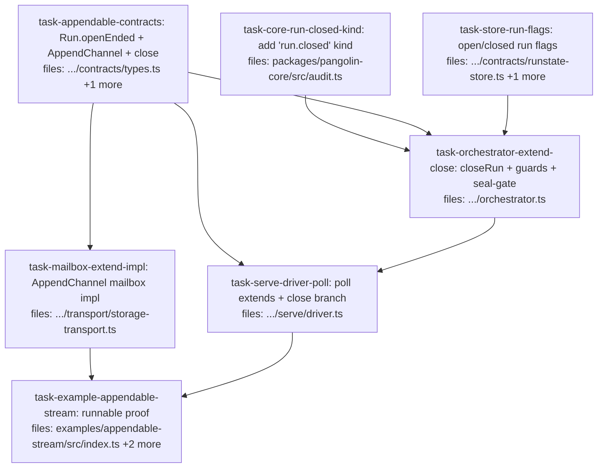

## Context

Drives `docs/superpowers/specs/2026-06-25-appendable-submission-design.md` — the **push-then-close proof** for append-able submission: an external producer pushes work items into an already-running, durable, audited run over time, then sends a `close` (epoch-boundary) signal, and the run seals once over the grown graph.

**Repo-pattern decisions baked into this plan (from the design + plan audits):**

1. **Append-able is OPT-IN via `Run.openEnded` (back-compat).** A unilateral "seal when all-terminal AND closed" would break *every existing run* (closed-plan runs never call `close`). Fix: a run seals at all-terminal as today UNLESS submitted `openEnded: true`, in which case it waits for `close`. Seal-gate = `all-terminal && (!isOpenEnded(runId) || isClosed(runId))`. Existing tests untouched.
2. **Producer push is a NEW `producerExtend`; `extendRun` is UNCHANGED.** The closed-guard lives on `producerExtend`, NOT on `extendRun` — because the pattern layer's spawn uses `extendRun` (`orchestrator.ts:292`), and guarding it would block legitimate pattern circle-back *after* close. `producerExtend` = unknown-run + closed guard → delegate to the existing `extendRun`. The driver calls `producerExtend`.
3. **Patterns compose for free.** `collectSpawns` (`patterns/scan.ts:8-12`) fires `onTaskDone` for every terminal item regardless of origin, so pushed items route through gating/circle-back. `applyPatternPhase` runs BEFORE the seal block (`orchestrator.ts:333-335`), so a post-close circle-back leaves pending items and the run can't seal until the pattern drains — **quiescence is free, no extra check**. (Pattern *templating* of pushed units — `planExtend` — is explicitly DEFERRED; see the spec's _Deferred_.)
4. **`extend` is a SEPARATE optional `AppendChannel` capability**, mirroring `ControlChannel` — NOT new required methods on `SubmissionTransport` (the repo has ~9 fakes that would break). Composed as `Partial<AppendChannel>`, optional-chained by the driver.
5. **Store flag methods are OPTIONAL** (`isOpenEnded?`/`markOpenEnded?`/`isClosed?`/`markClosed?`), mirroring the `runningSinceMs?` "back-compat for fakes" precedent (~4 `RunStateStore` fakes stay compiling); orchestrator null-coalesces (`?? false`). **`close`** is an additive `ControlEnvelope.kind` variant — no new control methods.

Other scope notes: the engine (`tick.ts`, dep-resolver, locks, concurrency) and the audit-bundle format are untouched; there is exactly one `RunStateStore` impl (`SqliteRunStateStore`, in-memory via `:memory:`); the mailbox impl reuses the existing module-level `enc`/`dec` helpers and keys extends by `randomUUID`.

Parallel waves: **{core-kind, appendable-contracts, store-run-flags}** → **{orchestrator, mailbox-impl}** → **{driver}** → **{example}**. All branches are file-disjoint by construction.

## Tasks

## Task: add 'run.closed' audit-entry kind

```yaml
id: task-core-run-closed-kind
depends_on: []
files:
  - packages/pangolin-core/src/audit.ts
status: pending
```

Add `'run.closed'` to the `AuditEntryKind` union so `closeRun` can emit a sealed lifecycle entry distinct from `run.completed`. Additive union member only.

## Implementation

```typescript
// packages/pangolin-core/src/audit.ts — AuditEntryKind union (~line 172)
export type AuditEntryKind =
  // ...existing members unchanged...
  | 'run.completed'
  | 'run.extended'
  | 'run.closed'; // NEW — producer signalled "no more work; seal this epoch"
```

```typescript
// packages/pangolin-core/test/audit-kind.test.ts
import type { AuditEntry, AuditEntryKind } from '../src/audit.js';

it("admits 'run.closed' as an AuditEntryKind and on an AuditEntry", () => {
  const kind: AuditEntryKind = 'run.closed'; // type-checks ONLY if the union member exists
  const e = { kind, runId: 'r1', at: '2026-06-25T00:00:00Z', seq: 0 } as AuditEntry;
  expect(e.kind).toBe('run.closed');
});
```

## Acceptance criteria

- `'run.closed'` is a member of `AuditEntryKind` (the literal type-checks where an `AuditEntryKind` is expected).
- The union still contains the pre-existing `'run.completed'` and `'run.extended'` members (nothing removed or renamed).
- `pnpm --filter @quarry-systems/pangolin-core typecheck` passes.

Test file: `packages/pangolin-core/test/audit-kind.test.ts`.

## Task: append-able contract surface

```yaml
id: task-appendable-contracts
depends_on: []
files:
  - packages/pangolin-orchestrator/src/contracts/types.ts
  - packages/pangolin-orchestrator/src/contracts/submission-transport.ts
status: pending
```

Define the producer-push contract surface, co-located in `contracts/`: the opt-in `Run.openEnded` flag, the `ExtendEnvelope` type, a NEW optional `AppendChannel` capability interface (mirroring `ControlChannel` — NOT methods on `SubmissionTransport`), and the additive `'close'` member on `ControlEnvelope.kind`.

## Implementation

```typescript
// packages/pangolin-orchestrator/src/contracts/types.ts — Run (~line 49)
export interface Run {
  id: string;
  queue: string;
  items: WorkItem[];
  /** OPT-IN append-able mode. When true the run does NOT auto-seal at all-terminal —
   *  it waits for an explicit close (the epoch boundary). Absent/false = today's
   *  closed-plan behaviour (seal at all-terminal). */
  openEnded?: boolean;
}
```

```typescript
// packages/pangolin-orchestrator/src/contracts/submission-transport.ts
import type { Run, WorkItem } from './types.js';

/** An incremental append to an already-submitted run — the producer's "push". */
export interface ExtendEnvelope {
  runId: string;
  items: WorkItem[];     // logical-id items, same shape as Run.items
  actor: string;         // "human:<id>" | "agent:<id>" | "app:<name>"
  at: string;            // ISO-8601
  causeItemId?: string;  // optional provenance — named on the run.extended entry
  seq?: string;          // TRANSPORT-assigned unique key (producers omit it); surfaced by pollExtends for ack
}

/** Optional capability a transport MAY also implement — the append path. Kept SEPARATE
 *  from SubmissionTransport (exactly like ControlChannel) so existing impls/fakes are
 *  unaffected. */
export interface AppendChannel {
  extend(env: ExtendEnvelope): Promise<void>;            // producer → extend-inbox
  pollExtends(): Promise<ExtendEnvelope[]>;              // service: claim un-ingested extends (all runs), each carrying its seq
  ackExtend(runId: string, seq: string): Promise<void>; // service: consume one
}

export interface ControlEnvelope {
  kind: 'cancel' | 'close'; // 'close' added — the explicit epoch-boundary marker
  target: string;
  actor: string;
  at: string;
}
```

```typescript
// packages/pangolin-orchestrator/test/appendable-contracts.test.ts
import type { AppendChannel, ControlEnvelope } from '../src/contracts/submission-transport.js';
import type { Run } from '../src/contracts/types.js';

it("Run admits openEnded; ControlEnvelope admits 'close'; AppendChannel is structurally separate", () => {
  const r: Run = { id: 'r1', queue: 'default', items: [], openEnded: true };
  const c: ControlEnvelope = { kind: 'close', target: 'r1', actor: 'app:x', at: 'T' };
  const ok: (a: AppendChannel) => void = () => {}; // type only — AppendChannel exists
  expect([r.openEnded, c.kind, typeof ok]).toEqual([true, 'close', 'function']);
});
```

## Acceptance criteria

- `Run` gains optional `openEnded?: boolean`; absent/false preserves today's behaviour.
- `ExtendEnvelope` exports `{ runId, items, actor, at, causeItemId?, seq? }` (`seq` is transport-assigned, producer-omitted).
- A new `AppendChannel` interface declares `extend`/`pollExtends`/`ackExtend`; `SubmissionTransport` itself gains NO new members (existing fakes unaffected).
- `ControlEnvelope.kind` is `'cancel' | 'close'` (cancel retained); no method added to `ControlChannel`.

Test file: `packages/pangolin-orchestrator/test/appendable-contracts.test.ts`.

## Task: run-level open/closed flags (interface + sqlite)

```yaml
id: task-store-run-flags
depends_on: []
files:
  - packages/pangolin-orchestrator/src/contracts/runstate-store.ts
  - packages/pangolin-orchestrator/src/runstate/sqlite.ts
status: pending
```

Add OPTIONAL `markOpenEnded`/`isOpenEnded`/`markClosed`/`isClosed` to `RunStateStore` (optional, mirroring the `runningSinceMs?` back-compat-for-fakes precedent so the ~4 test fakes keep compiling) and implement them in the sole impl (`SqliteRunStateStore`) via a new `runs` table. Interface + only-impl of one capability are co-owned here (an interface method without its impl is an untestable stub).

## Implementation

```typescript
// packages/pangolin-orchestrator/src/contracts/runstate-store.ts — add to interface (ALL OPTIONAL)
export interface RunStateStore {
  // ...existing...
  markOpenEnded?(runId: string): void; // record an append-able run; orchestrator is sole writer (D3)
  isOpenEnded?(runId: string): boolean;
  markClosed?(runId: string): void;    // idempotent
  isClosed?(runId: string): boolean;
}
```

```typescript
// packages/pangolin-orchestrator/src/runstate/sqlite.ts
// 1. add to SCHEMA (re-exec'd each construct → no MIGRATIONS entry needed):
//    CREATE TABLE IF NOT EXISTS runs (
//      run_id TEXT PRIMARY KEY, open_ended INTEGER NOT NULL DEFAULT 0, closed INTEGER NOT NULL DEFAULT 0);
// 2. methods on SqliteRunStateStore (upsert open/closed independently):
markOpenEnded(runId: string): void {
  this.db.prepare(
    'INSERT INTO runs(run_id, open_ended) VALUES(?,1) ON CONFLICT(run_id) DO UPDATE SET open_ended=1',
  ).run(runId);
}
isOpenEnded(runId: string): boolean {
  const r = this.db.prepare('SELECT open_ended FROM runs WHERE run_id=?').get(runId) as { open_ended: number } | undefined;
  return r?.open_ended === 1;
}
markClosed(runId: string): void {
  this.db.prepare(
    'INSERT INTO runs(run_id, closed) VALUES(?,1) ON CONFLICT(run_id) DO UPDATE SET closed=1',
  ).run(runId);
}
isClosed(runId: string): boolean {
  const r = this.db.prepare('SELECT closed FROM runs WHERE run_id=?').get(runId) as { closed: number } | undefined;
  return r?.closed === 1;
}
```

```typescript
// packages/pangolin-orchestrator/test/runstate-run-flags.test.ts
import { SqliteRunStateStore } from '../src/runstate/sqlite.js';

it("open/closed flags default false, set independently, idempotent, durable", () => {
  const s = new SqliteRunStateStore();
  expect([s.isOpenEnded!('r1'), s.isClosed!('r1')]).toEqual([false, false]);
  s.markOpenEnded!('r1'); s.markOpenEnded!('r1'); // idempotent
  expect([s.isOpenEnded!('r1'), s.isClosed!('r1')]).toEqual([true, false]);
  s.markClosed!('r1');
  expect([s.isOpenEnded!('r1'), s.isClosed!('r1')]).toEqual([true, true]);
});
```

## Acceptance criteria

- `RunStateStore` declares OPTIONAL `markOpenEnded?`/`isOpenEnded?`/`markClosed?`/`isClosed?` (so the existing `RunStateStore` test fakes still type-check unchanged).
- `SqliteRunStateStore` creates the `runs` table via `CREATE TABLE IF NOT EXISTS` in `SCHEMA` (no `MIGRATIONS` entry) and implements all four.
- `open_ended` and `closed` are independent: `markOpenEnded` does not set `closed` and vice-versa; both default `false` for an unknown run; both `mark*` are idempotent.
- Durability: with a file-backed db, flags set then `close()` + reopen at the same path still read back identically.

Test file: `packages/pangolin-orchestrator/test/runstate-run-flags.test.ts`.

## Task: producerExtend + closeRun + opt-in seal-gate

```yaml
id: task-orchestrator-extend-close
depends_on: [task-core-run-closed-kind, task-appendable-contracts, task-store-run-flags]
files:
  - packages/pangolin-orchestrator/src/orchestrator.ts
status: pending
```

In `submitRun`, mark `openEnded` runs. Add a NEW `producerExtend` (the guarded producer push that delegates to the **unchanged** internal `extendRun`); add `closeRun` (sibling of `cancelRun`); make the seal-gate opt-in. The closed-guard lives on `producerExtend`, NOT on `extendRun` — `extendRun` stays untouched so the pattern layer's spawn (`orchestrator.ts:292`) still circles back after `close` and drains. All store flag calls null-coalesce (the methods are optional).

## Implementation

```typescript
// packages/pangolin-orchestrator/src/orchestrator.ts

// (a) submitRun: after validation/saveRun (~:195), record append-able mode.
if (run.openEnded) this.store.markOpenEnded?.(run.id);

// (b) producerExtend — the guarded PRODUCER push. extendRun is NOT modified and still OWNS the
//     unknown-run check + merged-graph validation + run.extended audit + fuse, so producerExtend
//     adds ONLY the closed-guard (no duplicate unknown-run check — extendRun throws on that).
producerExtend(runId: string, items: WorkItem[], actor: string, causeItemId?: string): string[] {
  if (this.store.isClosed?.(runId)) throw new Error(`producerExtend: run '${runId}' is closed`);
  return this.extendRun(runId, items, actor, causeItemId); // throws on unknown run; validates; audits; fuses
}

// (c) closeRun — mirrors cancelRun(runId, actor?) at ~:387; throws on unknown run.
closeRun(runId: string, actor?: string): void {
  if (this.store.getItems(runId).length === 0) throw new Error(`closeRun: unknown run '${runId}'`);
  this.store.markClosed?.(runId); // idempotent
  this.auditLog?.tryAppend({ kind: 'run.closed', runId, actor, at: new Date().toISOString() });
}

// (d) seal-gate (tick seal block, ~:337-368): opt-in. An openEnded run waits for close;
//     a normal run is unaffected (isOpenEnded false → !false = true → seals at terminal).
//   was: if (runItems.length > 0 && runItems.every((i) => TERMINAL_STATUSES.has(i.status)))
//   now: ... && (!(this.store.isOpenEnded?.(runId) ?? false) || (this.store.isClosed?.(runId) ?? false))
```

```typescript
// packages/pangolin-orchestrator/test/orchestrator-extend-close.test.ts
it("a NORMAL run still seals at all-terminal (back-compat, no close needed)", async () => {
  // submit a 1-item run WITHOUT openEnded, drive to 'done', tick → getAuditRoot(runId) defined
});
it("an openEnded run does NOT seal until closed, then seals on the next tick", async () => {
  // submit { openEnded:true }, drive items to terminal, tick → getAuditRoot undefined;
  // closeRun → tick → getAuditRoot defined + a run.closed and run.completed entry exist
});
it("producerExtend throws on a closed run; extendRun (the spawn path) still appends to one", () => {
  // closeRun(runId); producerExtend(runId, ...) throws; extendRun(runId, ...) succeeds (unguarded)
});
```

## Acceptance criteria

- Back-compat: a run submitted WITHOUT `openEnded` seals at all-terminal exactly as before (no `close` required) — `getAuditRoot(runId)` defined after the tick.
- An `openEnded` run whose items are all terminal does NOT seal until `closeRun`: `getAuditRoot` stays `undefined`, then is defined on the next tick after close (with a `run.completed` entry).
- `producerExtend` throws when the run is closed (store unchanged); an unknown run still throws (via the delegated `extendRun`, not a duplicate check); on an open run it delegates and appends.
- **Regression guard:** `extendRun` is unmodified — calling it directly against a *closed* run still appends (the pattern-spawn path stays unguarded).
- `closeRun` on an unknown run throws; on a known run it is idempotent and emits a `run.closed` audit entry.

Test file: `packages/pangolin-orchestrator/test/orchestrator-extend-close.test.ts`.

## Task: AppendChannel mailbox impl

```yaml
id: task-mailbox-extend-impl
depends_on: [task-appendable-contracts]
files:
  - packages/pangolin-orchestrator/src/transport/storage-transport.ts
status: pending
```

Implement `AppendChannel` on `MailboxSubmissionTransport` over the existing `MailboxStore`, REUSING the module-level `enc`/`dec` helpers and the existing key-builder idiom. Each extend gets a unique, restart-safe mailbox key (`randomUUID`) under `{ns}/extends/{runId}/`; `pollExtends` surfaces that key as `seq` so the service can `ackExtend`. `close` needs no code here (it rides the existing control mailbox).

## Implementation

```typescript
// packages/pangolin-orchestrator/src/transport/storage-transport.ts
import { randomUUID } from 'node:crypto';
// class now: implements SubmissionTransport, ControlChannel, AppendChannel
private extendKey = (runId: string, seq: string) => `${this.ns}/extends/${runId}/${seq}.json`;

async extend(env: ExtendEnvelope): Promise<void> {
  const seq = randomUUID();                                    // unique, restart-safe (NOT env.at)
  await this.mbox.put(this.extendKey(env.runId, seq), enc({ ...env, seq })); // reuse module-level enc
}
async pollExtends(): Promise<ExtendEnvelope[]> {
  const keys = await this.mbox.list(`${this.ns}/extends/`);
  const out: ExtendEnvelope[] = [];
  for (const k of keys) { if (!k.endsWith('.json')) continue; const b = await this.mbox.get(k); if (b) out.push(dec(b) as ExtendEnvelope); }
  return out;                                                  // each envelope carries its seq
}
async ackExtend(runId: string, seq: string): Promise<void> {
  await this.mbox.delete(this.extendKey(runId, seq));          // idempotent
}
```

```typescript
// packages/pangolin-orchestrator/test/storage-transport-extend.test.ts
it("round-trips an extend with a surfaced seq: extend → pollExtends → ackExtend", async () => {
  const t = new MailboxSubmissionTransport(makeMailbox(), 'ns');
  await t.extend({ runId: 'r1', items: [], actor: 'app:x', at: 'T1' });
  const polled = await t.pollExtends();
  expect(polled.map((e) => e.runId)).toEqual(['r1']);
  expect(typeof polled[0]!.seq).toBe('string');               // transport-assigned
  await t.ackExtend('r1', polled[0]!.seq!);
  expect(await t.pollExtends()).toEqual([]);
});
```

## Acceptance criteria

- `MailboxSubmissionTransport` additionally `implements AppendChannel`.
- `extend` reuses the module-level `enc` helper and writes under `{ns}/extends/{runId}/{uuid}.json` (NOT keyed by `env.at`); the stored envelope carries its assigned `seq`.
- `pollExtends` returns every un-acked extend across all runs, each with its `seq`; `ackExtend(runId, seq)` deletes exactly that one and is idempotent.
- No `enc`/`dec`/`JSON` duplication is introduced; no `close`/`pollCloses`/`ackClose` method is added.

Test file: `packages/pangolin-orchestrator/test/storage-transport-extend.test.ts`.

## Task: serve loop — poll extends + close branch

```yaml
id: task-serve-driver-poll
depends_on: [task-appendable-contracts, task-orchestrator-extend-close]
files:
  - packages/pangolin-orchestrator/src/serve/driver.ts
status: pending
```

Widen the `ServeOptions.transport` type to compose `Partial<AppendChannel>`, add one new poll step (`pollExtends` → `orchestrator.producerExtend`, ack by surfaced `seq`) before the existing control poll, and add a `close` branch to the existing control dispatch. The driver uses `producerExtend` (the guarded producer path), NOT `extendRun`. Best-effort + dead-letter, matching the existing submit/cancel handling.

## Implementation

```typescript
// packages/pangolin-orchestrator/src/serve/driver.ts
// (a) widen the type (~:10):
//   transport: SubmissionTransport & Partial<ControlChannel> & Partial<AppendChannel>;

// (b) in the loop, AFTER the pollInbox/submit block:
for (const env of (await opts.transport.pollExtends?.()) ?? []) {
  try {
    opts.orchestrator.producerExtend(env.runId, env.items, env.actor, env.causeItemId);
    if (env.seq) await opts.transport.ackExtend?.(env.runId, env.seq);
  } catch (err) {
    onError(err);
    await opts.transport.deadLetter(env.runId);
  }
}

// (c) the EXISTING control loop (~:104-107) gains the close branch:
for (const ctl of (await opts.transport.pollControl?.()) ?? []) {
  if (ctl.kind === 'cancel') opts.orchestrator.cancelRun(ctl.target, ctl.actor);
  else if (ctl.kind === 'close') opts.orchestrator.closeRun(ctl.target, ctl.actor);
  await opts.transport.ackControl?.(ctl.target);
}
```

```typescript
// packages/pangolin-orchestrator/test/serve-driver-appendable.test.ts
it("ingests a polled extend then a polled close, and the openEnded run seals", async () => {
  // fake transport implementing Partial<AppendChannel>: pollExtends yields one extend (1 item, seq)
  // for an already-submitted openEnded run; pollControl then yields { kind:'close', target: runId }.
  // Drive serve a few ticks → the extended item ran AND getAuditExport(runId).root is defined (sealed).
});
```

## Acceptance criteria

- `ServeOptions.transport` composes `Partial<AppendChannel>`; a transport WITHOUT append support still type-checks and runs (the existing `Partial<ControlChannel>` posture is preserved).
- Each iteration calls `pollExtends` (after `pollInbox`, before the control poll), routes each envelope to `orchestrator.producerExtend`, and `ackExtend`s by the envelope's `seq` on success.
- A throwing extend is routed to `deadLetter` and does not abort the loop.
- The control dispatch routes `ctl.kind === 'close'` to `orchestrator.closeRun(ctl.target, ctl.actor)`; the `cancel` branch is unchanged.

Test file: `packages/pangolin-orchestrator/test/serve-driver-appendable.test.ts`.

## Task: runnable appendable-stream proof example

```yaml
id: task-example-appendable-stream
depends_on: [task-mailbox-extend-impl, task-serve-driver-poll]
files:
  - examples/appendable-stream/src/index.ts
  - examples/appendable-stream/test/appendable-stream.test.ts
  - examples/appendable-stream/package.json
status: pending
```

A driver-is-the-assertion example on a **patterned** open-ended queue: an external producer submits a seed run with `openEnded: true` to a queue bound to a curated pattern (e.g. `pipeline`), pushes items across several waves via `transport.extend`, the pattern routes them via `onTaskDone` (so ≥1 pushed item triggers a pattern spawn), sends a `close`, then reads the sealed bundle and verifies it `intact` over the grown+routed graph. Demonstrates pattern-aware extend end-to-end. Runs $0 in CI via the fake in-proc compute — mirrors `examples/offload-fanout` (+ `dogfood-gated`'s fake-arc for the scripted pattern outcome).

## Implementation

```typescript
// examples/appendable-stream/src/index.ts (shape — fake in-proc compute, like dogfood-gated PANGOLIN_FAKE)
// 1. wire client + orchestrator (queues: { 'pipeline-q': { concurrency, pattern: pipeline(...) } }) +
//    MailboxSubmissionTransport + serve (in-proc fake executor with a scripted arc)
// 2. await transport.submit({ run: { id, queue:'pipeline-q', items:[seed], openEnded: true }, actor, submittedAt })
// 3. for wave of [waveA, waveB]:                              // ≥2 waves over time
//      await sleep(150)
//      await transport.extend({ runId, items: wave, actor: 'app:appendable-stream', at: stamp() })
//    → serve.producerExtend appends; the pattern's onTaskDone routes/spawns as items finish
// 4. await transport.control({ kind: 'close', target: runId, actor: 'app:appendable-stream', at: stamp() })
// 5. poll readOutbox(runId) until a kind:'audit' record appears → verifyBundle(bundle)
// 6. process.exitCode = (intact && allItemsDone) ? 0 : 1      // the driver IS the assertion
```

```typescript
// examples/appendable-stream/test/appendable-stream.test.ts
it("pushes items into a patterned open-ended run, the pattern routes them, close seals an intact bundle", async () => {
  const { bundle, items } = await runAppendableStream(); // exported from src/index.ts
  expect(bundle.report.intact).toBe(true);
  expect(items.every((i) => i.status === 'done' || i.status === 'skipped')).toBe(true);
  expect(items.length).toBeGreaterThan(2); // seed + appended waves + ≥1 pattern-spawned item
});
```

## Acceptance criteria

- Submits an initial run with `openEnded: true` (≥1 seed item) to a queue bound to a curated pattern, then pushes ≥2 waves of additional items via `transport.extend`, with a delay between waves.
- The pattern routes the pushed items: at least one pattern-spawned follow-on item (via `onTaskDone`) appears in the run and in the sealed graph.
- Sends a single `transport.control({ kind: 'close', target: runId })` after the last wave; the run does NOT seal until after the close (and after the pattern's spawns drain).
- The sealed `audit` record then appears in the outbox and `verifyBundle` returns `report.intact === true` over the grown+routed graph.
- Runs entirely with the fake in-proc compute — $0, no Docker, no `ANTHROPIC_API_KEY` — so `pnpm --filter appendable-stream-example test` is green in CI.

Test file: `examples/appendable-stream/test/appendable-stream.test.ts`.
