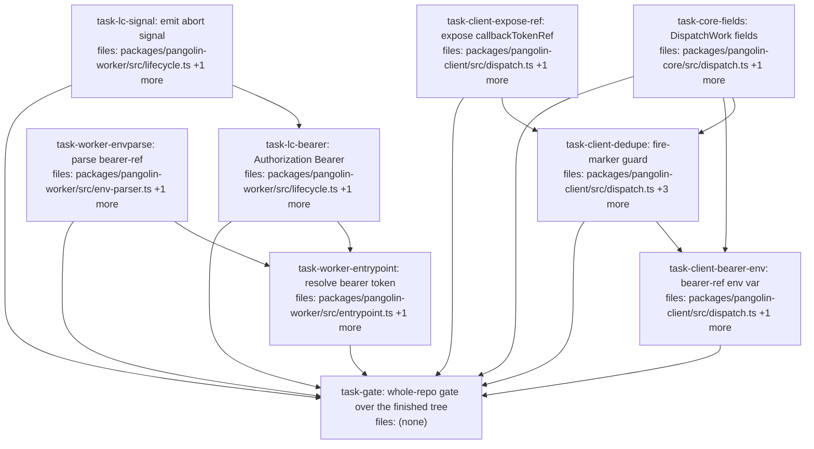

## Context

Drives `docs/superpowers/specs/2026-07-23-callback-consumer-seam-design.md` — the four additive changes ai-os needs to integrate Pangolin by direct dispatch, plus the §5 `emit()` abort-surface amendment. Every task is additive; none touches the seal path, the dep-allowlist, or `pangolin-core`'s dependency surface (spec §8).

**Two of the spec's items are NOT DAG tasks, by design:**
- **Change 4 (publish the `pangolin-*` packages)** is a manual release action (npm `@quarry-systems`, 2FA-on-writes), not implementer-TDD work. `computeContentHash` is already exported from `pangolin-core`'s barrel (`index.ts:9`), so no code change is required to unblock ai-os's import — only a version bump + publish. Tracked in the spec (§4); perform after these tasks land, as a `0.2.0 → 0.3.0` minor bump.
- **The slice-C corrections** (`2026-07-23-worker-termination-design.md` constraints 2/5, Q3) are doc-only and were already applied in the authoring session. Nothing to execute.

**External prerequisites — re-verified against git 2026-07-24 (an earlier draft of this section was stale):**
- **Slice A — LANDED** (commit `4122336`; `lifecycle.ts`/`notifications.ts`/`safeEndpointLabel` committed, clean vs HEAD). `task-lc-signal`, `task-lc-bearer`, and all four core/client tasks build on committed code.
- **Slice B — LANDED** (commits `aaba01e`…`0dc111b`; its DAG plan marks all three tasks `done`). `entrypoint.ts` already imports `deliverLifecycle`/`deliverNotifications` and routes the `emit` closure through them, and — load-bearing for this plan — **the HMAC key resolution has been relocated to `entrypoint.ts:217-231`**, ahead of storage construction (`:234`), bundle fetch (`:255`), and pipeline validation (`:265`). `deliver.ts` exists (`persistUndelivered` → `undelivered/<kind>.json`). The working tree is clean on `entrypoint.ts`/`deliver.ts`/`lifecycle.ts`/`env-parser.ts`. **So `task-worker-entrypoint`'s "assumes B landed" precondition is satisfied, and there is no live file collision** — B's edits are committed, not in flight. Every reference below to the key-resolution site is `:217-231` (an earlier draft cited the pre-B `:259-273`/`:262-271`; those line numbers are wrong against the current tree).
- **Coordination note:** the `security/worker-credential-custody` branch (worktree `agora-cred`) is a *separate branch* that also touched worker credential handling in `entrypoint.ts`. It does not affect execution on this branch, but reconcile it against `:217-231` before either merges.

**Parallelism:** four roots start together — `task-core-fields`, `task-client-expose-ref`, `task-worker-envparse`, `task-lc-signal`. Serialization is only where it must be: the three `pangolin-client/src/dispatch.ts` edits chain, and the two `pangolin-worker/src/lifecycle.ts` edits chain.

**Gate ownership — exactly one task runs anything wider than a single package.** The eight implementation tasks run concurrently in one shared checkout, so each runs ONLY package-scoped commands: `pnpm --filter <its-package> lint|typecheck|test`. They must NOT run `pnpm -r build`, `pnpm -r test`, `pnpm lint/typecheck`, or `pnpm check:deps` — two parallel `pnpm -r build` runs race on `packages/*/dist`, and a whole-repo test run executes a sibling's half-written file. The terminal `task-gate` (`single_threaded`, depends on all eight) is the only run of the full repo gate — including `pnpm -r build && pnpm run check:deps`, which is the first time on this branch the dependency guard runs against a fresh build after these changes, and the only run that sees the finished tree.

## Tasks

## Task: Add optional DispatchWork contract fields

```yaml
id: task-core-fields
depends_on: []
files:
  - packages/pangolin-core/src/dispatch.ts
  - packages/pangolin-core/test/dispatch-work-fields.test.ts
status: done
```

Extend the `DispatchWork` contract with the two optional fields the client-side changes consume: `callback.bearerRef` (spec §1) and `dedupeOnDispatchId` (spec §3). Both are additive and optional, so no existing consumer changes. Co-located here because both client tasks depend on this one type file, and splitting would only force a same-file serialization for no parallelism gain.

## Implementation

```typescript
// packages/pangolin-core/src/dispatch.ts — DispatchWork (currently callback?: { url; signatureAlgorithm? })
export interface DispatchWork {
  // ...all existing fields unchanged...
  callback?: {
    url: string;
    signatureAlgorithm?: 'sha256';
    /** SecretStore ref the consumer supplies; the worker sends its resolved value as
     *  `Authorization: Bearer` for ingress admission (distinct from the HMAC integrity header). */
    bearerRef?: string;
  };
  /** Opt-in: fireWork checks for a `dispatches/<id>/fired.json` marker before provider.run()
   *  and throws DispatchAlreadyExistsError if present. Best-effort dedupe, not a mutex. */
  dedupeOnDispatchId?: boolean;
}
```

```typescript
// packages/pangolin-core/test/dispatch-work-fields.test.ts — a runtime smoke test ONLY.
// NOTE: this file is NOT type-checked. pangolin-core's tsconfig `include` is ["src/**/*"], and
// `vitest`/esbuild strips types without excess-property checking — so a type-only assertion here
// passes against `main` whether or not the fields exist (it does NOT gate the contract). The
// binding gate for these fields is the DOWNSTREAM `pangolin-core typecheck` of the whole package
// PLUS the client tasks that READ these fields in `pangolin-client/src/` (which IS type-checked):
// `task-client-dedupe` reads `work.dedupeOnDispatchId`, `task-client-bearer-env` reads
// `work.callback.bearerRef`. If either field is absent, those tasks' `typecheck` fails. This test
// exists to document intended usage and lock the runtime shape, not to prove the types.
import type { DispatchWork } from '../src/dispatch.js';

it('a DispatchWork carrying the new fields round-trips at runtime', () => {
  const w: DispatchWork = {
    target: 'local',
    callback: { url: 'https://ingress.example', bearerRef: 'secretref://bearer' },
    dedupeOnDispatchId: true,
  } as DispatchWork;
  expect(w.callback?.bearerRef).toBe('secretref://bearer');
  expect(w.dedupeOnDispatchId).toBe(true);
});
```

## Acceptance criteria

- `DispatchWork.callback.bearerRef` exists in `src/dispatch.ts`, typed `string | undefined`.
- `DispatchWork.dedupeOnDispatchId` exists, typed `boolean | undefined`.
- Both are optional: an object with neither still satisfies `DispatchWork` (existing `test/` and `src/`
  compile unchanged).
- `pnpm --filter @quarry-systems/pangolin-core typecheck` passes and `pnpm --filter @quarry-systems/pangolin-core test` is green.
- **Honest scope note:** this task's standalone test does NOT discriminate the type (see the comment in
  the test file) — `test/` is not type-checked here. The real proof the fields landed is that the
  downstream client tasks, which read them in `pangolin-client/src/`, type-check. Do not claim this test
  "fails against main"; it does not.

Test file: `packages/pangolin-core/test/dispatch-work-fields.test.ts`.

## Task: Expose callbackTokenRef on InFlightDispatch

```yaml
id: task-client-expose-ref
depends_on: []
files:
  - packages/pangolin-client/src/dispatch.ts
  - packages/pangolin-client/test/dispatch-fire.test.ts
status: done
```

Return the per-dispatch callback HMAC-key ref (already computed as a local at `dispatch.ts:174`, currently discarded) on the `InFlightDispatch` so a direct-dispatch consumer can fetch the key and verify inbound callback signatures without coupling to the internal key-naming convention (spec §2). No behaviour change — a value that was computed and dropped is now surfaced.

## Implementation

```typescript
// packages/pangolin-client/src/dispatch.ts
export interface InFlightDispatch {
  readonly dispatchId: string;
  // ...existing fields unchanged...
  /** SecretStore ref for the per-dispatch callback HMAC key, when a callback was configured. */
  readonly callbackTokenRef?: string;
}

// in fireWork's returned object (currently dispatch.ts:441-457), add the in-scope local:
return {
  dispatchId,
  // ...existing...
  callbackTokenRef, // undefined when work.callback was not set
  awaitExit,
  reconcile,
  cleanup,
};
```

```typescript
// packages/pangolin-client/test/dispatch-fire.test.ts (extend existing harness)
it('exposes callbackTokenRef equal to the staged ref when a callback is configured', async () => {
  const inflight = await fireWork(client, { ...workWithCallback }, opts);
  expect(inflight.callbackTokenRef).toBe(stagedCallbackRef); // the ref the injected store recorded
});

it('callbackTokenRef is undefined when no callback is configured', async () => {
  const inflight = await fireWork(client, { ...workNoCallback }, opts);
  expect(inflight.callbackTokenRef).toBeUndefined();
});
```

## Acceptance criteria

- With a callback configured, `inflight.callbackTokenRef` equals the ref the injected `SecretStore.stage()` returned for the HMAC key.
- With no callback, `inflight.callbackTokenRef === undefined`.
- No other `InFlightDispatch` field changes; existing `dispatch-fire.test.ts` cases pass unchanged.

Test file: `packages/pangolin-client/test/dispatch-fire.test.ts`.

## Task: Guard duplicate fires with a fire-marker

```yaml
id: task-client-dedupe
depends_on: [task-core-fields, task-client-expose-ref]
files:
  - packages/pangolin-client/src/dispatch.ts
  - packages/pangolin-client/src/errors.ts
  - packages/pangolin-client/test/dispatch-dedupe.test.ts
  - packages/pangolin-client/test/errors.test.ts
status: done
quality_reviewer_hint: opus
```

When `work.dedupeOnDispatchId` is set, check for a `dispatches/<id>/fired.json` marker and write it **before any staging or minting**, throwing a typed `DispatchAlreadyExistsError` on a repeat (spec §3). Placement is load-bearing: the check must precede `mintCallbackHmac` (`dispatch.ts:168`), because the bug it prevents is a re-fire re-staging the HMAC key under the same name and replacing the first container's key mid-run — a check placed after the mint runs too late. Conceptual precedent: `orchestrator.extendRun`'s id-skip (`orchestrator.ts:216`), which is unreachable under direct dispatch.

## Implementation

```typescript
// packages/pangolin-client/src/errors.ts — mirror the file's existing SecretStoreMismatchError shape
export class DispatchAlreadyExistsError extends Error {
  constructor(public readonly dispatchId: string) {
    super(`dispatch "${dispatchId}" was already fired (dedupeOnDispatchId)`);
    this.name = 'DispatchAlreadyExistsError';
  }
}
```

```typescript
// packages/pangolin-client/src/dispatch.ts — inserted right after `store` is resolved (dispatch.ts:144),
// BEFORE per-dispatch secret staging (:148), the HMAC mint (:168), and emit('dispatch.accepted') (:318).
import { buildDispatchRecordUri, type StorageProvider } from '@quarry-systems/pangolin-core';
import { DispatchAlreadyExistsError } from './errors.js';

if (work.dedupeOnDispatchId) {
  const markerUri = buildDispatchRecordUri(client.namespace, dispatchId, 'fired.json');
  if (await markerPresent(client.storage, markerUri)) {
    throw new DispatchAlreadyExistsError(dispatchId);
  }
  await client.storage.put(
    markerUri,
    new TextEncoder().encode(
      JSON.stringify({ dispatchId, firedAt: new Date().toISOString(), traceId: trace.traceId }),
    ),
  );
}

// file-local helper — the reliable existence primitive for a URI-addressed overwrite put:
async function markerPresent(storage: StorageProvider, uri: string): Promise<boolean> {
  try { await storage.get(uri); return true; } catch { return false; }
}
```

```typescript
// packages/pangolin-client/test/dispatch-dedupe.test.ts
it('throws DispatchAlreadyExistsError on a second fire of the same id, and does not re-run compute', async () => {
  await fireWork(client, { ...work, dedupeOnDispatchId: true, dispatchId: 'D1' }, opts);
  await expect(
    fireWork(client, { ...work, dedupeOnDispatchId: true, dispatchId: 'D1' }, opts),
  ).rejects.toBeInstanceOf(DispatchAlreadyExistsError);
  expect(computeRunMock).toHaveBeenCalledTimes(1);
});
```

## Acceptance criteria

- A second `fireWork` with the same `dispatchId` and `dedupeOnDispatchId: true` rejects with `DispatchAlreadyExistsError` (carrying `dispatchId`), and `compute.run` is called exactly once across both fires.
- The `fired.json` `put` is ordered **before** the per-dispatch secret `stage()` and the `mintCallbackHmac` `stage()` (assert call order on the injected store) — the ordering that prevents the key re-stage.
- With `dedupeOnDispatchId` absent, no marker `put` and no existence `get` occur, and a repeated id fires twice (default behaviour preserved).
- The marker body deep-equals `{ dispatchId, firedAt, traceId }` — no secret, no URL.
- The marker URI is built with `buildDispatchRecordUri` (not `buildPangolinUri`, which rejects `type:'dispatches'`).

Test file: `packages/pangolin-client/test/dispatch-dedupe.test.ts`.

## Task: Emit the callback bearer-ref env var

```yaml
id: task-client-bearer-env
depends_on: [task-core-fields, task-client-dedupe]
files:
  - packages/pangolin-client/src/dispatch.ts
  - packages/pangolin-client/test/dispatch-callback-bearer.test.ts
status: done
```

Pass the consumer-supplied `work.callback.bearerRef` to the worker as a new env var `PANGOLIN_CALLBACK_BEARER_REF`, in the existing `if (work.callback) { … }` block (`dispatch.ts:280-285`) alongside `PANGOLIN_CALLBACK_URL` / `PANGOLIN_CALLBACK_TOKEN_REF` (spec §1). Pure pass-through of the caller's ref — `fireWork` never resolves it. Depends on `task-client-dedupe` only to serialize the shared `dispatch.ts` edit.

## Implementation

```typescript
// packages/pangolin-client/src/dispatch.ts — inside the existing `if (work.callback) { ... }` block
if (work.callback) {
  envVars.PANGOLIN_CALLBACK_URL = work.callback.url;
  envVars.PANGOLIN_CALLBACK_TOKEN_REF = callbackTokenRef!;
  if (work.callback.bearerRef) {
    envVars.PANGOLIN_CALLBACK_BEARER_REF = work.callback.bearerRef; // optional; pass-through, never resolved here
  }
}
```

```typescript
// packages/pangolin-client/test/dispatch-callback-bearer.test.ts
it('emits PANGOLIN_CALLBACK_BEARER_REF when callback.bearerRef is set', async () => {
  await fireWork(client, { ...work, callback: { url: 'https://x', bearerRef: 'secretref://b' } }, opts);
  const spec = computeRunMock.mock.calls[0][0];
  expect(spec.env.PANGOLIN_CALLBACK_BEARER_REF).toBe('secretref://b');
});

it('omits PANGOLIN_CALLBACK_BEARER_REF when bearerRef is absent', async () => {
  await fireWork(client, { ...work, callback: { url: 'https://x' } }, opts);
  const spec = computeRunMock.mock.calls[0][0];
  expect(spec.env.PANGOLIN_CALLBACK_BEARER_REF).toBeUndefined();
});
```

## Acceptance criteria

- With `callback.bearerRef` set, `taskSpec.env.PANGOLIN_CALLBACK_BEARER_REF` equals the supplied ref verbatim.
- With `callback` set but `bearerRef` absent, the env var is not present on `taskSpec.env`.
- The ref is passed through unresolved (no `SecretStore.resolve` call for it in the client).

Test file: `packages/pangolin-client/test/dispatch-callback-bearer.test.ts`.

## Task: Parse the callback bearer-ref env var

```yaml
id: task-worker-envparse
depends_on: []
files:
  - packages/pangolin-worker/src/env-parser.ts
  - packages/pangolin-worker/test/env-parser.test.ts
status: done
```

Parse `PANGOLIN_CALLBACK_BEARER_REF` into the worker config as `callbackBearerRef` (spec §1). It is **optional and independent** of `callbackTokenRef` — unlike `PANGOLIN_CALLBACK_TOKEN_REF`, which `env-parser.ts:173-177` makes mandatory whenever `PANGOLIN_CALLBACK_URL` is set — because a receiver may want HMAC integrity without bearer admission.

## Implementation

```typescript
// packages/pangolin-worker/src/env-parser.ts — add to the parsed config type and the parse result
export interface WorkerEnvConfig {
  // ...existing fields (callbackUrl, callbackTokenRef, ...)...
  callbackBearerRef?: string; // optional; NOT paired-mandatory with callbackUrl
}

// in parseWorkerEnv(...):
callbackBearerRef: env.PANGOLIN_CALLBACK_BEARER_REF, // undefined when unset; no pairing validation
```

```typescript
// packages/pangolin-worker/test/env-parser.test.ts
it('parses PANGOLIN_CALLBACK_BEARER_REF as an optional field', () => {
  const withRef = parseWorkerEnv({ ...baseEnvWithCallback, PANGOLIN_CALLBACK_BEARER_REF: 'secretref://b' });
  expect(withRef.callbackBearerRef).toBe('secretref://b');
});

it('does not require the bearer ref when a callback URL is set', () => {
  const noBearer = parseWorkerEnv({ ...baseEnvWithCallback }); // has URL + TOKEN_REF, no BEARER_REF
  expect(noBearer.callbackBearerRef).toBeUndefined(); // and no throw
});
```

## Acceptance criteria

- `parseWorkerEnv` returns `callbackBearerRef` equal to `PANGOLIN_CALLBACK_BEARER_REF` when present.
- `callbackBearerRef` is `undefined` when the env var is absent, and its absence does **not** throw even when `PANGOLIN_CALLBACK_URL` is set (contrast the mandatory `callbackTokenRef` pairing).
- Existing `env-parser.test.ts` cases pass unchanged.

Test file: `packages/pangolin-worker/test/env-parser.test.ts`.

## Task: Add an external abort signal to emit

```yaml
id: task-lc-signal
depends_on: []
files:
  - packages/pangolin-worker/src/lifecycle.ts
  - packages/pangolin-worker/test/lifecycle.test.ts
status: done
```

Give `LifecycleEmitter.emit` an optional external `AbortSignal`, composed with the internal per-attempt timeout via `AbortSignal.any` (spec §5 — the slice-A amendment decided now while `lifecycle.ts` is uncommitted, so slice C never re-edits the signature). The `'aborted'` reason and its classification are **out of scope** — they belong to slice C, the caller that produces them; classification here stays on `timeout.aborted` so an external abort is not miscounted as a timeout.

## Implementation

```typescript
// packages/pangolin-worker/src/lifecycle.ts — emit() gains opts?.signal
async emit(event: LifecycleEvent, opts?: { signal?: AbortSignal }): Promise<DeliveryOutcome> {
  if (!this.opts.callbackUrl || !this.opts.hmacKey) return { delivered: false };
  // ...unchanged: timestamp, payload, signature, headers, delayMs clamp...
  const timeout = AbortSignal.timeout(delayMs);
  const signal = opts?.signal ? AbortSignal.any([timeout, opts.signal]) : timeout;
  try {
    const res = await (this.opts.fetchImpl ?? fetch)(this.opts.callbackUrl, {
      method: 'POST', headers, body: payload, signal,
    });
    return res.status >= 200 && res.status < 300
      ? { delivered: true, status: res.status }
      : { delivered: false, status: res.status, reason: 'http-status' };
  } catch {
    // Classify on timeout.aborted, NOT signal.aborted: an external abort (slice C) must not read as timeout.
    return { delivered: false, reason: timeout.aborted ? 'timeout' : 'network' };
  }
}
```

```typescript
// packages/pangolin-worker/test/lifecycle.test.ts
it('aborts the in-flight fetch when the external signal fires', async () => {
  const ac = new AbortController();
  const fetchImpl = ((_url, init) => new Promise((_res, rej) => {
    (init!.signal as AbortSignal).addEventListener('abort', () => rej(new Error('aborted')));
    ac.abort();
  })) as typeof fetch;
  const outcome = await new LifecycleEmitter({ callbackUrl: 'https://x', hmacKey: 'k', fetchImpl })
    .emit(event, { signal: ac.signal });
  expect(outcome.delivered).toBe(false); // external abort ⇒ 'network' for now (slice C adds 'aborted')
  expect(outcome.reason).toBe('network');
});

it('still classifies the internal deadline as timeout when no external signal is passed', async () => {
  const fetchImpl = ((_url, init) => new Promise((_res, rej) => {
    (init!.signal as AbortSignal).addEventListener('abort', () => rej(new Error('t')));
  })) as typeof fetch;
  const outcome = await new LifecycleEmitter({ callbackUrl: 'https://x', hmacKey: 'k', fetchImpl, attemptTimeoutMs: 20 })
    .emit(event);
  expect(outcome.reason).toBe('timeout');
});
```

## Acceptance criteria

- `emit(event, { signal })` passes a composed signal to `fetch`; aborting the external signal rejects the fetch and yields `{ delivered: false, reason: 'network' }` (external abort is classified `network`, not `timeout`, until slice C adds `'aborted'`).
- `emit(event)` with no `opts` is unchanged: the internal `attemptTimeoutMs` deadline still yields `reason: 'timeout'`.
- No new member is added to `DeliveryFailureReason` in this task.
- Existing `lifecycle.test.ts` cases pass unchanged.
- **Latent-edge note (consistency with slice A's discipline):** `AbortSignal.any([...])` sits BEFORE the
  `try`, so an untyped JS caller passing a non-`AbortSignal` as `opts.signal` would throw a `TypeError`
  out of `emit` — the same escape-the-guarded-region shape slice A guarded for `AbortSignal.timeout` and
  the reverted `new Headers`. Unreachable from typed in-repo callers (only slice C will pass `opts.signal`,
  typed), so not fixed here — but state it in a code comment so it is a known edge, not a surprise.

Test file: `packages/pangolin-worker/test/lifecycle.test.ts`.

## Task: Send Authorization Bearer from the emitter

```yaml
id: task-lc-bearer
depends_on: [task-lc-signal]
files:
  - packages/pangolin-worker/src/lifecycle.ts
  - packages/pangolin-worker/test/lifecycle.test.ts
status: done
quality_reviewer_hint: opus
```

Give `LifecycleEmitter` an optional `bearerToken` constructor option and, when set, add an `Authorization: Bearer <token>` header to the callback POST (spec §1). This coexists with the HMAC signature header — bearer is admission, HMAC is integrity. Depends on `task-lc-signal` to serialize the shared `lifecycle.ts` edit.

## Implementation

```typescript
// packages/pangolin-worker/src/lifecycle.ts — constructor gains bearerToken; emit() adds the header conditionally
export class LifecycleEmitter {
  constructor(
    private readonly opts: {
      callbackUrl?: string;
      hmacKey?: string;
      fetchImpl?: typeof fetch;
      attemptTimeoutMs?: number;
      bearerToken?: string;
    },
  ) {}
  // ...in emit(), the plain-object headers literal:
  // const headers: Record<string, string> = {
  //   'Content-Type': 'application/json',
  //   'X-Pangolin-Signature': `sha256=${signature}`,
  //   'X-Pangolin-Dispatch-Id': event.dispatchId,
  //   'X-Pangolin-Timestamp': timestamp,
  //   ...(this.opts.bearerToken ? { Authorization: `Bearer ${this.opts.bearerToken}` } : {}),
  // };
}
```

```typescript
// packages/pangolin-worker/test/lifecycle.test.ts
it('adds Authorization: Bearer when bearerToken is configured', async () => {
  let captured: Record<string, string> = {};
  const fetchImpl = ((_url, init) => { captured = init!.headers as Record<string, string>; return Promise.resolve(new Response('ok')); }) as typeof fetch;
  await new LifecycleEmitter({ callbackUrl: 'https://x', hmacKey: 'k', fetchImpl, bearerToken: 'T0KEN' }).emit(event);
  expect(captured['Authorization']).toBe('Bearer T0KEN');
});

it('omits Authorization when no bearerToken is configured', async () => {
  let captured: Record<string, string> = {};
  const fetchImpl = ((_url, init) => { captured = init!.headers as Record<string, string>; return Promise.resolve(new Response('ok')); }) as typeof fetch;
  await new LifecycleEmitter({ callbackUrl: 'https://x', hmacKey: 'k', fetchImpl }).emit(event);
  expect(captured['Authorization']).toBeUndefined();
});
```

## Acceptance criteria

- With `bearerToken` set, the POST carries `Authorization: Bearer <token>`.
- With no `bearerToken`, no `Authorization` header is present (default path byte-identical to today).
- The `X-Pangolin-Signature` HMAC value is identical whether or not `bearerToken` is set (bearer and HMAC independent).

Test file: `packages/pangolin-worker/test/lifecycle.test.ts`.

## Task: Resolve the callback bearer token in the worker entrypoint

```yaml
id: task-worker-entrypoint
depends_on: [task-worker-envparse, task-lc-bearer]
files:
  - packages/pangolin-worker/src/entrypoint.ts
  - packages/pangolin-worker/test/entrypoint.test.ts
status: done
quality_reviewer_hint: opus
```

Resolve `cfg.callbackBearerRef` via the `SecretStore`, register the resolved value for log redaction, and pass it into the `LifecycleEmitter` construction (spec §1), reusing the same `secretStore.resolve` + `logger.registerSecret` primitives the HMAC key resolution uses. Slice B has landed, so the emitter is constructed once inside the `if (cfg.callbackUrl && cfg.callbackTokenRef)` block at **`entrypoint.ts:217-231`**. **Resolve `bearerToken` BEFORE that single emitter construction and pass it into the constructor** — do NOT add a sibling `if` *after* the emitter is built, or the token never reaches it (the emitter is constructed exactly once). Since `env-parser.ts:173-177` makes `callbackTokenRef` mandatory whenever `callbackUrl` is set, `callbackUrl` always implies the emitter block runs, so resolving the optional bearer just ahead of it is safe.

## Implementation

```typescript
// packages/pangolin-worker/src/entrypoint.ts — resolve BEFORE the single emitter construction at :217-231
let bearerToken: string | undefined;
if (cfg.callbackUrl && cfg.callbackBearerRef) {
  bearerToken = await secretStore.resolve(cfg.callbackBearerRef);
  logger.registerSecret(bearerToken); // never reaches a log line, the manifest, or an outcome
}

// the existing (slice-B-relocated) emitter construction, now also passing bearerToken:
lifecycleEmitter = new LifecycleEmitter({
  callbackUrl: cfg.callbackUrl,
  hmacKey: key,
  bearerToken, // undefined when no bearer ref configured
  // ...existing options...
});
```

```typescript
// packages/pangolin-worker/test/entrypoint.test.ts (extend existing harness: h.env + fetchImpl capture)
it('resolves the bearer ref and sends Authorization on the callback POST', async () => {
  // h.env has PANGOLIN_CALLBACK_URL, PANGOLIN_CALLBACK_TOKEN_REF, PANGOLIN_CALLBACK_BEARER_REF;
  // the fake secretsManagerClient resolves the bearer ref to 'RESOLVED_BEARER'.
  await runWorker(deps);
  const callbackPost = capturedFetch.calls.find((c) => c.url === cfg.callbackUrl);
  expect((callbackPost!.init.headers as Record<string, string>)['Authorization']).toBe('Bearer RESOLVED_BEARER');
});

it('registers the resolved bearer token for redaction (positive control — asserts the CALL, not just absence)', async () => {
  // A happy-path "not.toContain('RESOLVED_BEARER')" is VACUOUS: the worker never logs the bearer on
  // success regardless of whether registerSecret was called. Assert the registration itself.
  const registerSpy = vi.spyOn(deps.logger, 'registerSecret'); // or the harness's injected logger
  await runWorker(deps);
  expect(registerSpy).toHaveBeenCalledWith('RESOLVED_BEARER');
});
```

## Acceptance criteria

- When `PANGOLIN_CALLBACK_URL` and `PANGOLIN_CALLBACK_BEARER_REF` are both set, the worker resolves the ref via `secretStore.resolve` and the callback POST carries `Authorization: Bearer <resolved>`.
- **`logger.registerSecret` is asserted to have been CALLED with the resolved token** — not merely that the token is absent from a happy-path log (which passes vacuously whether or not registration happened). If the harness cannot spy on `registerSecret`, instead drive a `failWith` path whose `detail` would embed the token and assert it is scrubbed — a real positive control either way.
- With no `callbackBearerRef`, no `secretStore.resolve` for a bearer occurs and the callback carries no `Authorization` header (HMAC path unchanged).
- `bearerToken` is resolved and passed into the **single** emitter construction (not a sibling `if` after it), and it does not alter the mandatory `callbackTokenRef` (HMAC) resolution.

Test file: `packages/pangolin-worker/test/entrypoint.test.ts`.

## Task: Run the whole-repo gate over the finished tree

```yaml
id: task-gate
depends_on: [task-core-fields, task-client-expose-ref, task-client-dedupe, task-client-bearer-env, task-worker-envparse, task-lc-signal, task-lc-bearer, task-worker-entrypoint]
files: []
status: done
single_threaded: true
is_wiring_task: true
quality_reviewer_hint: opus
```

The only task permitted to run whole-workspace commands. It exists because the eight implementation tasks run concurrently in one shared checkout, and `pnpm -r build` / `pnpm -r test` / `pnpm lint` / `pnpm typecheck` / `pnpm check:deps` are workspace-wide: run from two tasks at once they race on `packages/*/dist`, and a suite run from one task executes another's half-written files. Depending on all eight also makes this the only run that sees the finished tree. `single_threaded: true` guarantees nothing else is in flight while it runs.

This task writes nothing. If the gate fails, **attribute and report** — do not repair; each source file belongs to a task whose scope this is not:

| File | Owner |
|---|---|
| `packages/pangolin-core/src/dispatch.ts` (+ its test) | task-core-fields |
| `packages/pangolin-client/src/dispatch.ts` (+ `dispatch-fire`/`dispatch-dedupe`/`dispatch-callback-bearer` tests) | task-client-expose-ref / task-client-dedupe / task-client-bearer-env (per the field touched) |
| `packages/pangolin-client/src/errors.ts` (+ test) | task-client-dedupe |
| `packages/pangolin-worker/src/env-parser.ts` (+ test) | task-worker-envparse |
| `packages/pangolin-worker/src/lifecycle.ts` (+ test) | task-lc-signal / task-lc-bearer |
| `packages/pangolin-worker/src/entrypoint.ts` (+ test) | task-worker-entrypoint |
| anything else | pre-existing — report, do not touch |

## Acceptance criteria

- The full repo gate passes, in this order (build precedes the dep guard because `check:deps` reads built `dist/`): `pnpm lint && pnpm typecheck`, then `pnpm -r build && pnpm run check:deps`, then `pnpm -r --workspace-concurrency=1 test`.
- **`pnpm run check:deps` is clean** — no `packages/*` change introduced a dependency on `@stoa-mcp/*`, `@quarry-systems/bedrock-*`, `@rastate/*`, or `@quarry-systems/drift-*` (the orthogonality guard), and no undeclared specifier.
- Every workspace package's tests are green (no `.only`, no added `.skip`, no excluded file). Note the plan's from-a-clean-tree gate order: if `pnpm typecheck` fails on an example that needs built `dist/` (e.g. `examples/hello-world` importing `@quarry-systems/pangolin-client`), run `pnpm -r build` first, then re-run typecheck — that is an environment ordering artifact, not a defect in these changes.
- Every command's output is recorded in the task result.
- **No file is modified by this task.** `git status --porcelain` shows nothing beyond what the eight upstream tasks produced. On failure, report the failing command, its output, and the owning task from the table above.

Test file: none — this task *is* the test.
