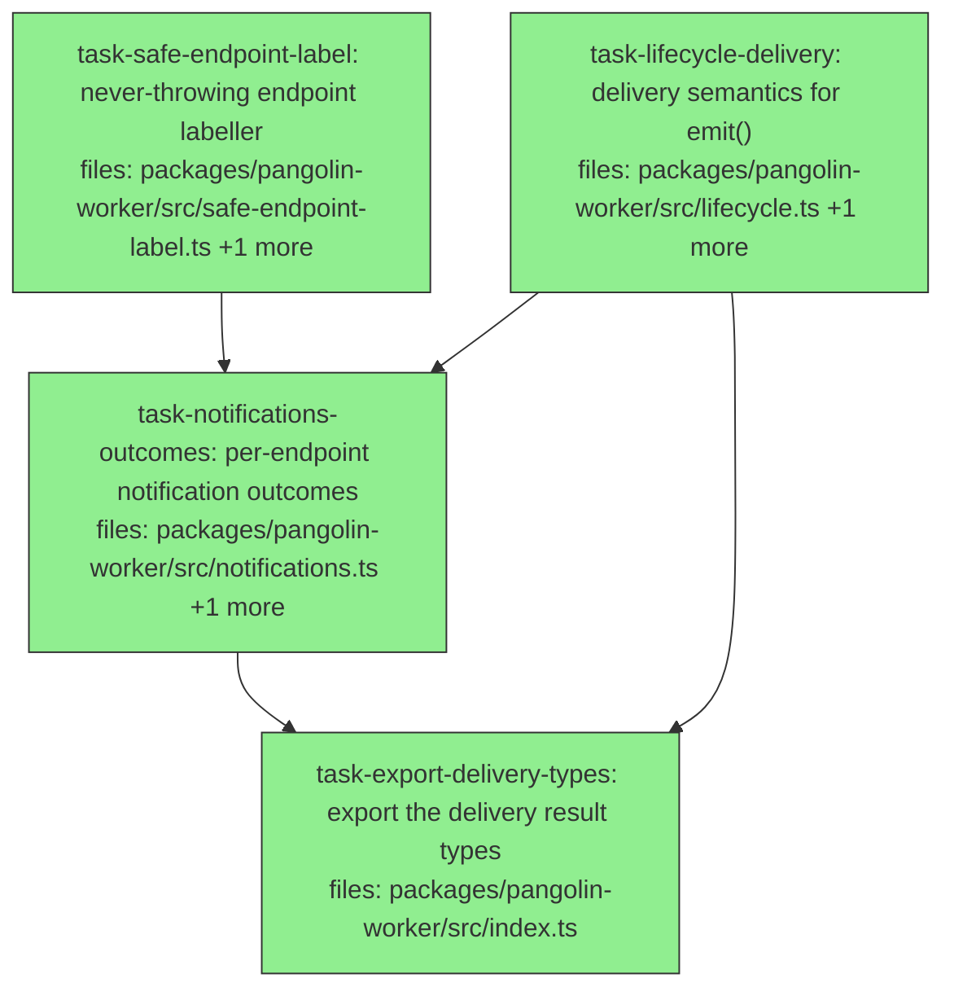

## Context

Drives `docs/superpowers/specs/2026-07-23-callback-delivery-correctness-design.md` (slice A of 3).

Every lifecycle and notification webhook Pangolin sends is **dead on arrival**. `lifecycle.ts:25-27` and
`notifications.ts:86-88` send `'X-Pangolin Scale-Signature'`, `'X-Pangolin Scale-Dispatch-Id'`,
`'X-Pangolin Scale-Timestamp'` — a space is not a valid HTTP field-name character (RFC 9110 §5.1), so
`fetch` throws before the request leaves the process. Reproduced on Node v22.20.0. Around that defect the
path has no status check and no timeout.

**There is no retry in this plan, and that is deliberate.** Spec §2.2.1 is the argument; the two-line
version is that nothing inside Pangolin consumes the callback (verified: the only code touching
`callbackUrl` is the client minting the env var at `pangolin-client/src/dispatch.ts:281`, the worker
parsing it at `env-parser.ts:171`, and the worker sending it — the orchestrator learns a dispatch
finished by polling `Executor.reconcile()` at `engine/tick.ts:90`), and a worker-side retry cannot
outlive its own container anyway. Delivery is **at-most-once by design**. If a reviewer or implementer
thinks retry is missing, read §2.2.1 first — including the part explaining why the obvious tier argument
*fails* and the worker would in fact be the right home if retry belonged anywhere.

**Headers stay a plain object in production. Do not "improve" this to `new Headers(...)`.** It looks like
the stronger fix and it is not: `Headers` validates header **values** as well as names, and
`event.dispatchId` is a caller-supplied string that nothing character-validates (`env-parser.ts:75`
checks presence only; `uri.ts:216-224` rejects only empty and `/`). Constructing it eagerly turns a
`dispatchId` containing `\n` into a throw that escapes `fireNotifications` **before**
`Promise.allSettled` and reaches `entrypoint.ts:172`, which awaits it with no `try/catch` — a worker
crash on every terminal path, and a violation of the never-throws contract at `notifications.ts:17-19`.
Keeping the plain object leaves that failure exactly where it is on `main`: inside `fetch`, caught.

**Why the tests did not catch the header defect, and what that obliges.** `lifecycle.test.ts:83-89,:119-120`
and `notifications.test.ts:169-175` assert the header names — and assert the *misspelled* ones — passing
because they inject a `fetchImpl` mock and read `init.headers` cast to `Record<string,string>`
(`notifications.test.ts:166`), where a space is an ordinary object key. **An injected-fetch mock that
treats headers as a plain object is structurally incapable of catching an invalid-header-name defect.**
The fix is to construct a real `Headers` **in the test**, from whatever production actually passed. That
assertion then stays live forever: a header added later with an invalid name fails it with nobody writing
a new test. (Had production passed a `Headers` instance, this assertion would have been inert from its
first green run, because a `Headers` instance cannot carry an invalid name — which is the second reason
the plain object is correct.)

**Assert on returned outcomes, never on call count alone.** `main`'s `emit` (`lifecycle.ts:11-31`)
already makes exactly one attempt for every status, so any acceptance criterion of the form "attempted
exactly once" is **green on `main`** and proves nothing. Call count is a supplementary check only.

**Scope.** Confined to `pangolin-worker` and touching no control flow. Widening `emit`'s return type is
source-compatible at all six call sites (`entrypoint.ts:164` plus `lifecycle.test.ts:32,:52,:76,:115,:143`
— all `await` and discard), and the entrypoint already discards `fireNotifications`' result, so
**`entrypoint.ts` is not edited by any task in this plan**. Consuming those return values — logging — is
slice B. D5's keyless-emitter window and D6's SIGTERM handling are slices B and C. Making the two e2e
tests execute is unowned by any slice; do not attempt it here.

**Known consequence, carried from spec §5:** once `emit` returns instead of throwing, the `try/catch` at
`entrypoint.ts:163-170` that logs `lifecycle.emit.failed` **stops firing for delivery failures** — every
HTTP-status, network, and timeout failure is now returned, not thrown. (It is not strictly unreachable:
a pre-`fetch` throw such as `JSON.stringify` on a circular event would still land there. That distinction
is why the clamp on `attemptTimeoutMs` below matters.) Until slice B consumes the outcome, a lifecycle
delivery failure is silent. This plan is mergeable on its own; it should not
reach production without B. Do not "fix" this by editing `entrypoint.ts` — that file belongs to slice B.

**Path-scope every replacement to `packages/` and `test/`.** The working tree carries four stale source
copies under `.claude/worktrees/` (`agent-a758713d7d25e656b`, `agent-a9bbc36e043575237`,
`agent-af642df0583932d68`, `secret-handling-hardening`), so a repo-wide grep returns 17 hits across 30
files rather than 6 in 2. Replace the three header **names**, not the substring `Pangolin Scale-`:
`overlay-engine.ts:7,:87` carry that in prose. That same file holds two raw NUL bytes (`:115`), so grep
skips it as binary unless `-a` is passed.

**Test-harness facts every task must respect.** `packages/pangolin-worker` has **no `vitest.config.*`**,
so `globals` is `false` and the default `testTimeout` is 5 s. Every test file must import from `vitest`
explicitly — all 23 existing files do. The 5 s default is why the per-attempt timeout must be injectable.
`pnpm lint` is `eslint src --ext .ts` and the package tsconfig's `include` is `src/**/*`: **`test/` is
neither linted nor typechecked**, so neither gate can catch a broken test file.

**Gate ownership.** The implementation tasks run in **one shared checkout**, so they must NOT run
whole-repo commands: two concurrent `pnpm -r build` runs emit into the same `packages/*/dist` that
`check:deps` then reads, and a whole-repo `pnpm test` from one task runs another task's half-rewritten
test file and mis-attributes the failure. Each implementation task runs only:

```
pnpm --filter @quarry-systems/pangolin-worker lint
pnpm --filter @quarry-systems/pangolin-worker typecheck
pnpm --filter @quarry-systems/pangolin-worker test <its own test file>
```

**These are package-scoped, not task-scoped — know the difference.** `typecheck` is `tsc --noEmit` over
`src/**/*` and `lint` is `eslint src`, so both read **every** file in `src`, including one a concurrent
sibling task is mid-write. `tsc --noEmit` writes nothing (no `incremental`/`composite` in
`tsconfig.base.json`, so no `.tsbuildinfo`), so this is a read-contamination flake, not corruption: **if
either fails in a file outside your declared `files:`, that is a sibling task mid-write, not your defect
— re-run once, then report it without editing.**

`task-export-delivery-types` depends on the two source tasks and owns the full repo gate.

## Tasks

## Task: never-throwing endpoint labeller

```yaml
id: task-safe-endpoint-label
depends_on: []
files:
  - packages/pangolin-worker/src/safe-endpoint-label.ts
  - packages/pangolin-worker/test/safe-endpoint-label.test.ts
status: done
quality_reviewer_hint: opus
```

A pure, total function turning a webhook URL into a label safe to log and persist, per spec §2.4. It
exists because the naive form throws on ordinary input: `NotificationConfig` is `{ when, webhook: string }`
(`pangolin-core/src/dispatch.ts:26-29`) with no validation anywhere — `loadCapabilityNotifications` is a
bare `JSON.parse(raw) as NotificationConfig[]` (`notifications.ts:44`) — so a typo'd webhook in a
capability's `pangolin-notifications.json` reaches this code unchecked.

Its own module because `pangolin-worker/src` is flat and single-purpose per file (`merge-rules.ts`,
`env-parser.ts`, `runtime-env-filter.ts`), and because a separate file lets it be built and reviewed in
parallel with the lifecycle work.

**Note on the pre-fix bar:** this module does not exist on `main`, so its tests can only fail at import.
That is the one honest exemption from the fail-by-asserting rule (spec §4).

## Implementation

```typescript
// packages/pangolin-worker/src/safe-endpoint-label.ts

/**
 * A label for a notification endpoint that is safe to log, persist, and hand to
 * an operator. NEVER throws and NEVER returns the raw URL: a webhook can carry
 * credentials in userinfo, a query token, or a path segment.
 *
 * `new URL(u).origin` alone is unusable here — it raises ERR_INVALID_URL for
 * 'not-a-url', '', and '//example.com/x', and yields the literal string 'null'
 * for opaque-origin schemes (file:, data:). Verified on Node v22.20.0.
 *
 * `index` is a position within one reported fan-out, NOT a position in the
 * operator's config file — `matches` in notifications.ts is a flattened merge
 * of two sources, then filtered by event kind (spec §2.4).
 */
export function safeEndpointLabel(webhook: string, index: number): string {
  const fallback = `notification[${index}] <unparseable>`;
  try {
    const u = new URL(webhook);
    if (u.protocol !== 'http:' && u.protocol !== 'https:') return fallback;
    // .origin strips userinfo; it keeps a non-default port, which is not credential-bearing.
    return u.origin;
  } catch {
    return fallback;
  }
}
```

```typescript
// packages/pangolin-worker/test/safe-endpoint-label.test.ts
// ILLUSTRATIVE — this is the discriminating core, not the full suite. The
// acceptance criteria below list behaviours not covered here; implement all of them.
import { describe, it, expect } from 'vitest';
import { safeEndpointLabel } from '../src/safe-endpoint-label.js';

describe('safeEndpointLabel', () => {
  it('strips userinfo rather than leaking it', () => {
    expect(safeEndpointLabel('https://u:p@h.example.com/a?t=1', 0)).toBe('https://h.example.com');
  });

  it.each(['not-a-url', '', '//example.com/x', 'file:///etc/passwd', 'data:text/plain,hi'])(
    'never throws and never returns "null" for %j',
    (bad) => {
      expect(safeEndpointLabel(bad, 2)).toBe('notification[2] <unparseable>');
    },
  );
});
```

## Acceptance criteria

- `safeEndpointLabel('https://u:p@h.example.com/a?t=1', 0)` returns exactly `'https://h.example.com'` —
  userinfo, path, and query all absent.
- Each of the five inputs `'not-a-url'`, `''`, `'//example.com/x'`, `'file:///etc/passwd'`,
  `'data:text/plain,hi'` returns `'notification[<index>] <unparseable>'` and throws nothing. The
  `file:`/`data:` cases matter specifically: `new URL(...).origin` returns the literal string `'null'` for
  them, so an implementation returning `u.origin` unconditionally would label every opaque-scheme
  endpoint `'null'`.
- **A non-default port is preserved:** `safeEndpointLabel('http://h:8080/x', 0)` returns
  `'http://h:8080'`. Not covered by the illustrative block above.
- *(Supplementary, not a discriminator — no implementation satisfying the userinfo and port criteria
  above can fail it.)* No returned label contains `@` or `?`, asserted over every case in the suite.
- At least one input that parses successfully is included, so "never throws" carries a positive control
  rather than passing because every case took the `catch`.
- Imports from `'vitest'` explicitly.
- Gate (package-scoped — do **not** run whole-repo commands, see Context):
  `pnpm --filter @quarry-systems/pangolin-worker lint`, `... typecheck`,
  `... test test/safe-endpoint-label.test.ts`.

Test file: `packages/pangolin-worker/test/safe-endpoint-label.test.ts`.

## Task: delivery semantics for the lifecycle callback

```yaml
id: task-lifecycle-delivery
depends_on: []
files:
  - packages/pangolin-worker/src/lifecycle.ts
  - packages/pangolin-worker/test/lifecycle.test.ts
status: done
quality_reviewer_hint: opus
```

Fix the three header names and give `LifecycleEmitter.emit` status checking and a per-attempt timeout,
returning a `DeliveryOutcome` instead of `Promise<void>` (spec §2.1, §2.2). **One attempt, no retry** —
§2.2.1. The signature scheme is unchanged: lowercase hex HMAC-SHA256 over
`${dispatchId}.${timestamp}.${payload}`, prefixed `sha256=`. The types live in `lifecycle.ts` beside
their producer, matching this package's convention (`NeedsInputOutcome` in `needs-input.ts`, `EnvBundle`
in `env-merger.ts`, `ChannelHandle` in `channel-loader.ts`).

`signCallback` already exists in `pangolin-client/src/callback-hmac.ts` and this file hand-rolls
`createHmac` instead. Consolidating means moving it into `pangolin-core` (the worker does not depend on
`pangolin-client`, and `pnpm check:deps` fails on undeclared specifiers) and is **deferred** by §2.1 — do
not attempt it. The mitigation is that this task asserts the signature construction against a locally
computed HMAC, which is why that assertion is required below rather than optional.

`DeliveryFailureReason` is exported from this file because `notifications.ts` reuses it — that task
depends on this one for exactly that reason.

## Implementation

```typescript
// packages/pangolin-worker/src/lifecycle.ts

export type DeliveryFailureReason = 'http-status' | 'network' | 'timeout';

export interface DeliveryOutcome {
  delivered: boolean;
  status?: number;
  /** Closed enum — never a fetch error string, which can embed the callback URL (§3).
   *  'aborted' is deliberately absent: nothing in this slice produces it (slice C owns
   *  cancellation), and shipping an unreachable member from a published package is
   *  building ahead of demand. */
  reason?: DeliveryFailureReason;
}

export class LifecycleEmitter {
  constructor(private readonly opts: {
    callbackUrl?: string;
    hmacKey?: string;
    fetchImpl?: typeof fetch;
    /** Default 5_000. Injectable because the package has no vitest.config.* and runs at
     *  vitest's 5 s default testTimeout. Mirrors orchestrator/src/engine/tick.ts:22/:37.
     *  NOT an env var: the worker's env is minted by the client
     *  (pangolin-client/src/dispatch.ts:255-296), so a PANGOLIN_* knob is dead on arrival. */
    attemptTimeoutMs?: number;
  }) {}

  async emit(event: LifecycleEvent): Promise<DeliveryOutcome> {
    if (!this.opts.callbackUrl || !this.opts.hmacKey) return { delivered: false };

    const timestamp = new Date().toISOString();
    const payload = JSON.stringify(event);
    const signature = createHmac('sha256', this.opts.hmacKey)
      .update(`${event.dispatchId}.${timestamp}.${payload}`)
      .digest('hex');

    // A PLAIN OBJECT, deliberately — see Context. `new Headers({...})` here would validate
    // header VALUES too, and a caller-supplied dispatchId containing '\n' would throw out of
    // emit instead of returning an outcome. The real Headers is constructed in the TEST,
    // from whatever is passed here, which is what keeps that assertion live forever.
    const headers = {
      'Content-Type': 'application/json',
      'X-Pangolin-Signature': `sha256=${signature}`,
      'X-Pangolin-Dispatch-Id': event.dispatchId,
      'X-Pangolin-Timestamp': timestamp,
    };

    // Clamp before constructing: AbortSignal.timeout throws a RangeError on a negative,
    // NaN, or fractional delay (measured). Unclamped and outside the try, that is the same
    // escape-the-guarded-region shape as the reverted `new Headers` bug — lower likelihood,
    // identical failure mode.
    const signal = AbortSignal.timeout(Math.trunc(Math.max(0, this.opts.attemptTimeoutMs ?? 5_000)));
    try {
      const res = await (this.opts.fetchImpl ?? fetch)(this.opts.callbackUrl, {
        method: 'POST', headers, body: payload, signal,
      });
      return res.status >= 200 && res.status < 300
        ? { delivered: true, status: res.status }
        : { delivered: false, status: res.status, reason: 'http-status' };
    } catch {
      // Classify on the SIGNAL, not on the error's name or message: a hand-rolled mock
      // rejecting with new Error('aborted') must not be able to pin the wrong branch.
      return { delivered: false, reason: signal.aborted ? 'timeout' : 'network' };
    }
  }
}
```

There is **no kind-dependent branching**. An earlier draft carved `dispatch.started` out as
fire-and-forget while giving terminal kinds a retry budget; with retry gone the distinction dissolves.
(For the record, the earlier draft's justification for a `dispatch.accepted` arm was false:
`lifecycle.test.ts:17-35` and `:37-55` both short-circuit at the `callbackUrl`/`hmacKey` guard before
`kind` is ever read, and the worker never emits `dispatch.accepted` — `entrypoint.ts`'s only `kind:`
literals are `dispatch.failed`, `started`, `needs_input`, `finished`.)

```typescript
// packages/pangolin-worker/test/lifecycle.test.ts — the discriminating assertions.
import { describe, it, expect, vi } from 'vitest';

it('sends header names that are valid HTTP field names', async () => {
  const mockFetch = vi.fn().mockResolvedValue(new Response('ok', { status: 200 }));
  const emitter = new LifecycleEmitter({
    callbackUrl: 'https://example.com/callback',
    hmacKey: 'k',
    fetchImpl: mockFetch as unknown as typeof fetch,
  });
  // This file has no event factory — the five existing cases build events inline. Keep that style.
  const event: LifecycleEvent = {
    kind: 'dispatch.started', dispatchId: 'd-1', providerTaskId: 'p-1', at: '2026-05-21T12:00:00Z',
  };
  await emitter.emit(event);

  const [, init] = mockFetch.mock.calls[0]!;
  // Fails by ASSERTION on main: expect(fn).not.toThrow() catches the TypeError and converts
  // it to an AssertionError. Stays live after the fix because production passes a plain object.
  let headers!: Headers;
  expect(() => { headers = new Headers(init.headers as HeadersInit); }).not.toThrow();
  // Positive control — keeps .not.toThrow() from passing vacuously.
  expect([...headers.keys()].sort()).toEqual([
    'content-type', 'x-pangolin-dispatch-id', 'x-pangolin-signature', 'x-pangolin-timestamp',
  ]);
});

it('reports a non-2xx as an http-status failure', async () => {
  const mockFetch = vi.fn().mockResolvedValue(new Response('nope', { status: 500 }));
  // ... construct emitter as above ...
  const outcome = await emitter.emit(event);
  // Asserting the OBJECT is what discriminates: on main this is `undefined` vs an object,
  // an assertion failure. A toHaveBeenCalledOnce() check would be GREEN on main.
  expect(outcome).toEqual({ delivered: false, status: 500, reason: 'http-status' });
});
```

## Acceptance criteria

- The three header names are exactly `X-Pangolin-Signature`, `X-Pangolin-Dispatch-Id`,
  `X-Pangolin-Timestamp`. Production passes them as a **plain object** — do not construct `Headers` in
  `lifecycle.ts` (Context explains why; it is a crash path and it deadens the test). The test asserts
  `new Headers(init.headers as HeadersInit)` does not throw (the discriminator against `main`) and then
  asserts the key set for equality (its positive control).
- The signature header equals a locally recomputed `sha256=` + hex HMAC-SHA256 over
  `${dispatchId}.${timestamp}.${payload}`, using the timestamp read back from the request. Required, not
  optional: it is the mitigation for the deliberately-deferred `signCallback` duplication.
- `emit` returns `{ delivered, status?, reason? }` and **never throws**. `reason` is one of
  `'http-status' | 'network' | 'timeout'` and is never a fetch error string. There is **no** `attempts`
  field and **no** `'aborted'` member. `DeliveryFailureReason` and `DeliveryOutcome` are both exported.
- A receiver returning **500** yields exactly `{ delivered: false, status: 500, reason: 'http-status' }`,
  asserted as an object. A **403** yields the same shape with `status: 403` — pinning that no
  status-dependent branching remains.
- A rejecting `fetch` yields `{ delivered: false, reason: 'network' }` with **no `status` key**. Assert
  with `toStrictEqual`, or add `expect(outcome).not.toHaveProperty('status')` — plain `toEqual` ignores
  keys whose value is `undefined`, so `{ status: undefined }` would satisfy it.
- **One code path for every kind:** `dispatch.started`, `dispatch.accepted`, and a terminal kind against
  the identical 500 mock each yield exactly `{ delivered: false, status: 500, reason: 'http-status' }` —
  asserted against that **literal**, not against each other. Comparing the three to one another is green
  on `main`, where all three yield `undefined` and `expect(undefined).toEqual(undefined)` passes. This
  pins the *absence* of per-kind policy.
- The `fetch` init carries an `AbortSignal` (fails by assertion on `main`, where none is passed), and a
  receiver that settles only on abort yields `{ delivered: false, reason: 'timeout' }` with
  `attemptTimeoutMs` injected small. **Classification is on `signal.aborted`**, not on the error's name;
  the mock must reject only after observing the `abort` event on the signal it was handed.
- `attemptTimeoutMs` is an optional constructor option defaulting to 5000, and **`emit` does not throw
  for any value of it** — including negative, `NaN`, and fractional, each of which makes a raw
  `AbortSignal.timeout` throw a `RangeError`. Clamp with `Math.trunc(Math.max(0, …))`. Assert this.
- **No new environment variable** and no new client-side dispatch option. **No retry, no `maxAttempts`,
  no `backoffMs`, no jitter** — see spec §2.2.1 before adding any of them.
- The three existing mocks at `lifecycle.test.ts:58, :97, :128` resolve `{ ok: true }` with **no
  `status`**; they gain `status: 200` or become real `Response` objects. This is hygiene, not a repair —
  those three tests discard the return value, so a status-classifying `emit` silently yields
  `delivered: false` without failing them. Change them so the fixtures stop modelling an impossible state.
- All five existing `lifecycle.test.ts` cases still pass. `entrypoint.ts` is **not** edited.
- `test/index.test.ts:454` drives `emit` through `runWorker` with `PANGOLIN_CALLBACK_URL` set and a
  `Response(null, { status: 204 })` mock; 204 is 2xx and the test never inspects the outcome or the
  headers, so it is **verified unaffected**. It is owned by no task — **run it as part of your gate**
  (below) so a break surfaces here rather than two waves later. If it goes red, that is a real defect in
  your change: report it, do not edit the file.
- Imports from `'vitest'` explicitly. Gate (package-scoped): `pnpm --filter @quarry-systems/pangolin-worker
  lint`, `... typecheck`, `... test test/lifecycle.test.ts test/index.test.ts`. Running `index.test.ts`
  here is race-free: the only concurrent sibling adds `src/safe-endpoint-label.ts`, which nothing imports
  until the next wave.

Test file: `packages/pangolin-worker/test/lifecycle.test.ts`.

## Task: per-endpoint notification outcomes

```yaml
id: task-notifications-outcomes
depends_on: [task-safe-endpoint-label, task-lifecycle-delivery]
files:
  - packages/pangolin-worker/src/notifications.ts
  - packages/pangolin-worker/test/notifications.test.ts
status: done
quality_reviewer_hint: opus
```

Fix the three header names, add status classification and a per-attempt timeout, and return a
per-endpoint outcome array instead of `Promise<void>` (spec §2.1, §2.3). Status classification is
required rather than optional: `Promise.allSettled` marks a fetch returning HTTP 500 as `fulfilled`, so
inspecting settled results alone leaves a 500-returning endpoint **completely silent** — the most common
dead-endpoint mode, and the reason spec §6 calls this the riskier channel.

**The timeout closes D4 on the channel where it matters most.** `fireNotifications` is awaited at
`entrypoint.ts:172` on every terminal path and fans out to N **third-party** endpoints; today any one of
them can hang the dispatch forever. **No retry** — §2.2.1, plus the contract at `notifications.ts:17-19`.

This task depends on `task-lifecycle-delivery` for one reason: it imports `DeliveryFailureReason` from
`./lifecycle.js` rather than redeclaring an identical union (spec §2.3).

## Implementation

```typescript
// packages/pangolin-worker/src/notifications.ts
import { safeEndpointLabel } from './safe-endpoint-label.js';
import type { DeliveryFailureReason } from './lifecycle.js';

export interface NotificationOutcome {
  /** safeEndpointLabel output — NEVER the raw webhook URL, which can carry credentials (§3). */
  label: string;
  delivered: boolean;
  status?: number;
  reason?: DeliveryFailureReason;
}

export async function fireNotifications(opts: {
  event: LifecycleEvent;
  sources: NotificationConfig[][];
  hmacKey: string;
  fetchImpl?: typeof fetch;
  attemptTimeoutMs?: number; // default 5_000
}): Promise<NotificationOutcome[]> {
  // ... existing match collection unchanged ...

  // Both early paths return [] rather than undefined — notifications.test.ts:219-225
  // currently asserts resolves.toBeUndefined() and must be updated to the [] contract.
  if (matches.length === 0) return [];

  // ... existing single timestamp / payload / signature for the whole fan-out, then the
  //     header PLAIN OBJECT (see Context — `new Headers` here is a crash path) with the
  //     corrected names: 'X-Pangolin-Signature' / '-Dispatch-Id' / '-Timestamp'.
  //
  // Then Promise.allSettled over the matches. Each fetch gets its OWN signal, because
  // this is a per-ATTEMPT timeout and each fetch is its own attempt; one signal shared
  // across N fetches registers N abort listeners on one object and is semantically wrong.
  // (It would NOT, however, cross-abort — all N are created in the same synchronous map,
  // so a shared AbortSignal.timeout fires at the same instant as N separate ones. That is
  // why the acceptance test asserts signal IDENTITY rather than timing.)
  // Compute the delay once, clamped, OUTSIDE the map — AbortSignal.timeout throws a
  // RangeError on a value that is non-integral or outside [0, 2^32-1], and a throw here
  // would escape fireNotifications before allSettled.
  //
  // MIRROR THE COMMITTED CLAMP IN src/lifecycle.ts — do NOT write
  // `Math.trunc(Math.max(0, opts.attemptTimeoutMs ?? 5_000))`. That expression shipped in
  // an earlier revision of this plan and is WRONG, proven by measurement over two review
  // cycles on the lifecycle task: `Math.max(0, NaN)` is NaN (still throws); Infinity,
  // 2**32 and MAX_SAFE_INTEGER still throw; clamping garbage to 0 is worse than throwing
  // because AbortSignal.timeout(0) aborts within a macrotask, so a misconfiguration
  // silently becomes "always times out, never delivers"; and values above 2^31-1 do not
  // throw but collapse to a 1 ms timer with a TimeoutOverflowWarning. The correct shape:
  //
  //   const DEFAULT_ATTEMPT_TIMEOUT_MS = 5_000;
  //   const MAX_ATTEMPT_TIMEOUT_MS = 2_147_483_647; // Node's TIMEOUT_MAX
  //   const requested = opts.attemptTimeoutMs;
  //   const delayMs =
  //     Number.isFinite(requested) && (requested as number) > 0
  //       ? Math.trunc(Math.min(requested as number, MAX_ATTEMPT_TIMEOUT_MS))
  //       : DEFAULT_ATTEMPT_TIMEOUT_MS;
  //
  // then per match: AbortSignal.timeout(delayMs). Each settled result maps to an outcome:
  //   fulfilled + 2xx          -> { label, delivered: true, status }
  //   fulfilled + non-2xx      -> { label, delivered: false, status, reason: 'http-status' }
  //   rejected, signal.aborted -> { label, delivered: false, reason: 'timeout' }
  //   rejected otherwise       -> { label, delivered: false, reason: 'network' }
  // label = safeEndpointLabel(cfg.webhook, i) using the match's index.
  // This function must still never throw: a failing endpoint becomes an outcome, and
  // formatting it must not throw either (which is why the label helper is total).
}
```

```typescript
// packages/pangolin-worker/test/notifications.test.ts
import { describe, it, expect } from 'vitest';

it('reports a 500-returning endpoint as failed rather than settled-ok', async () => {
  const fetchImpl = (async (url: string) =>
    url.endsWith('/dead')
      ? new Response('nope', { status: 500 })
      : new Response('ok', { status: 200 })) as unknown as typeof fetch;

  const outcomes = await fireNotifications({
    event: makeFinishedEvent(),
    sources: [[
      { when: ['dispatch.finished'], webhook: 'https://a.example.com/dead' },
      { when: ['dispatch.finished'], webhook: 'https://b.example.com/ok' },
    ]],
    hmacKey: 'k',
    fetchImpl,
  });

  expect(outcomes).toEqual([
    { label: 'https://a.example.com', delivered: false, status: 500, reason: 'http-status' },
    { label: 'https://b.example.com', delivered: true, status: 200 },
  ]);
});
```

## Acceptance criteria

- The three header names are exactly `X-Pangolin-Signature`, `X-Pangolin-Dispatch-Id`,
  `X-Pangolin-Timestamp`, passed as a **plain object** — do not construct `Headers` in
  `notifications.ts`; it escapes the never-throws contract (Context). The test asserts
  `new Headers(init.headers as HeadersInit)` does not throw, then asserts the key set for equality. The
  existing plain-object read at `notifications.test.ts:166` (`init.headers as Record<string, string>`) is
  replaced — it is why this defect survived.
- The signature header equals a locally recomputed `sha256=` HMAC over
  `${dispatchId}.${timestamp}.${payload}`, asserted in **this** file as well as in `lifecycle.test.ts`.
  Both are required: §2.1 accepts the `signCallback` duplication only because both copies are pinned.
- `fireNotifications` returns `NotificationOutcome[]` — one entry per matched endpoint, in match order —
  and `reason` is the `DeliveryFailureReason` imported from `./lifecycle.js`, not a redeclared union.
- An endpoint returning **500** is reported `{ delivered: false, status: 500, reason: 'http-status' }`,
  not as a success. A `Promise.allSettled` result alone marks it `fulfilled`.
- An endpoint whose fetch rejects is reported `reason: 'network'`.
- **Per-fetch signals, proved by IDENTITY — not by wall clock.** Capture `init.signal` from every fetch
  call across a fan-out of two matching endpoints; assert both are `AbortSignal` instances and that they
  are **distinct objects** (`expect(signals[0]).not.toBe(signals[1])`). A shared signal fails this by
  assertion. Deterministic, no timer race.
- **Timeout classification, as its own case.** With `attemptTimeoutMs: 20`, an endpoint whose mock
  rejects **only after observing the `abort` event on the signal it was handed** is
  `{ delivered: false, reason: 'timeout' }`, while a sibling resolving immediately with 200 is
  `{ delivered: true, status: 200 }`. Classification is on `signal.aborted`, **never** on the error's
  name or message — a mock rejecting with a hand-written `Error('aborted')` must land on `'network'`, and
  this test exists to pin that.
- **Do NOT write a test giving one endpoint a wall-clock settle time longer than `attemptTimeoutMs` and
  asserting it still delivers.** Measured on Node v22.20.0: because all fan-out fetches launch in one
  synchronous `map`, N `AbortSignal.timeout(30)` and one shared `AbortSignal.timeout(30)` fire at the
  same instant. A 60 ms sibling that honours its signal is reported `'timeout'` under **both**
  implementations (unsatisfiable); one that ignores its signal is `delivered: true` under **both**
  (vacuous). `AbortSignal.timeout` cannot cross-abort — that would need a shared `AbortController`
  aborted on first failure, which is not the implementation at issue.
- `attemptTimeoutMs` is an optional option defaulting to 5000. **No retry** is added, and
  `fireNotifications` still never throws out of the function, per `notifications.ts:17-19`.
- Every outcome's `label` is `safeEndpointLabel(webhook, index)` output. **No raw webhook URL appears in
  any returned value.** Assert positively: give one endpoint a URL with userinfo *and* a query token and
  assert the returned label contains neither.
- The zero-match early return (`notifications.ts:76`) and the empty-`sources` path both return `[]`;
  `notifications.test.ts:219-225`'s `resolves.toBeUndefined()` is updated to the `[]` contract. Note that
  this test's title — *"uses the global fetch when fetchImpl is not supplied"* — describes something it
  does not assert (zero matches means fetch is never reached). Pre-existing vacuity; either retitle it to
  what it checks or add the assertion its title claims, but do not leave the mismatch unremarked.
- All other existing `notifications.test.ts` cases still pass; `entrypoint.ts` is **not** edited.
- Imports from `'vitest'` explicitly. Gate: `pnpm --filter @quarry-systems/pangolin-worker lint`,
  `... typecheck`, then the **whole package suite** — `pnpm --filter @quarry-systems/pangolin-worker test`.
  This task runs alone in its wave (both its dependencies are complete and nothing else is in flight), so
  the whole-package run is race-free and catches any cross-file break before the terminal task. Still do
  **not** run whole-repo commands (`pnpm -r build`, `pnpm test`) — those belong to the terminal task.

Test file: `packages/pangolin-worker/test/notifications.test.ts`.

## Task: export the delivery result types

```yaml
id: task-export-delivery-types
depends_on: [task-lifecycle-delivery, task-notifications-outcomes]
files:
  - packages/pangolin-worker/src/index.ts
status: done
is_wiring_task: true
quality_reviewer_hint: opus
```

`src/index.ts:9,:28` already export `LifecycleEmitter` and `fireNotifications`, but nothing exports the
types their methods now return. `package.json` declares no `exports` map, so a consumer could deep-import
`dist/lifecycle.js`, but a published package whose entry point omits its own return types is a defect.
This task adds the type re-exports and, because it depends on both source tasks, is also where the **full
repo gate** runs — the parallel tasks deliberately run only package-scoped commands so they cannot race
on `dist/` or run each other's half-written test files.

`safeEndpointLabel` is **not** exported: it is an internal helper of the notifications path, and widening
the public surface for it would be building ahead of demand.

```typescript
// packages/pangolin-worker/src/index.ts — added alongside the existing exports
export { LifecycleEmitter, type DeliveryOutcome, type DeliveryFailureReason } from './lifecycle.js';
export {
  loadCapabilityNotifications,
  fireNotifications,
  type NotificationOutcome,
} from './notifications.js';
```

## Acceptance criteria

- `src/index.ts` exports the types `DeliveryOutcome`, `DeliveryFailureReason`, and `NotificationOutcome`
  alongside the existing `LifecycleEmitter` / `loadCapabilityNotifications` / `fireNotifications` value
  exports. No existing export is removed or renamed.
- `safeEndpointLabel` is **not** added to the barrel.
- `test/index.test.ts` still passes — it checks exports individually rather than exhaustively (`:78-180`,
  including a negative check for `SecretResolver` at `:102`), so adding members breaks nothing. Confirm
  rather than assume.
- **Full repo gate passes:** `pnpm lint && pnpm typecheck`, then `pnpm -r build && pnpm run check:deps`,
  then `pnpm -r --workspace-concurrency=1 test`. This is the only task that runs whole-repo commands.
  Note this is deliberately **stricter than `ci.yml`**, which runs build → `check:deps` → lint → build →
  test and never runs `typecheck` at all — do not "align" it down to CI's weaker gate.
- No file outside `src/index.ts` is modified. If the full gate fails because of another task's work,
  **attribute it and report it** — repairing it is not this task's job, and the owning task's `files:`
  scope is not this task's to edit. Attribute using this map (inlined because you cannot see the other
  tasks):

  | File | Owner |
  |---|---|
  | `src/lifecycle.ts`, `test/lifecycle.test.ts` | `task-lifecycle-delivery` |
  | `src/notifications.ts`, `test/notifications.test.ts` | `task-notifications-outcomes` |
  | `src/safe-endpoint-label.ts`, `test/safe-endpoint-label.test.ts` | `task-safe-endpoint-label` |
  | `src/index.ts` | this task |
  | anything else | pre-existing — report, do not touch |

Test file: `packages/pangolin-worker/test/index.test.ts` (existing; not modified).
