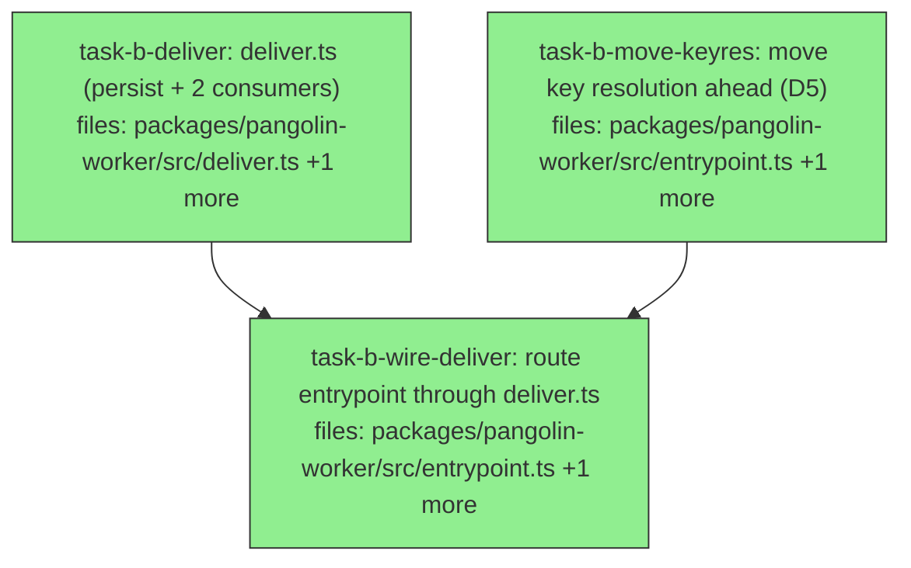

## Context

Drives `docs/superpowers/specs/2026-07-23-callback-delivery-durability-design.md` (slice B of 3). Slice A made lifecycle delivery correct and its outcome reportable; slice B (1) makes delivery **reach the failures that matter** — today the emitter is a hard no-op until step 4, so the five earliest `failWith` sites send nothing (**D5**) — and (2) makes a failed delivery leave a **durable record** instead of vanishing.

**Prerequisite — verified 2026-07-24:** slice A is **LANDED** (commit `4122336`; `lifecycle.ts` exports `DeliveryOutcome`/`DeliveryFailureReason`, `notifications.ts` returns per-endpoint outcomes, `safeEndpointLabel` exists). This plan builds directly on that committed code — `deliverLifecycle` consumes slice A's `DeliveryOutcome`; `deliverNotifications` consumes slice A's `fireNotifications` return array and `safeEndpointLabel`.

**Decomposition choice.** Slice B is described entirely against `entrypoint.ts`, which would force a fully serial plan. To recover parallelism and separate concerns, the §2.2 outcome-consumer functions **and** the §2.3 durable-record write are extracted into one worker module, `deliver.ts`, mirroring the repo's per-concern module convention (`output-sentinel.ts` bundles several dispatch-record writes in one domain module; `lifecycle.ts` co-locates its types). `entrypoint.ts` keeps only the §2.1 move and the wiring. `persistUndelivered` lives in `deliver.ts` (exported for direct test), **not** its own module — a 2-line `buildDispatchRecordUri` + `put` is too thin to hoist per the repo's grouping convention — and **not** `output-sentinel.ts`, which owns result capture (a different domain). This is a design refinement the spec leaves open ("extract the emit closure into a named function") resolved toward one cohesive module for testability.

**`entrypoint.ts` is contended — slice B should land first.** Three other work items edit the same `:245-276` secret-resolution region: the consumer-seam `task-worker-entrypoint` (bearer resolution beside the HMAC key), slice C (SIGTERM handler), and the `security/worker-credential-custody` branch (worktree `agora-cred`). Slice B's §2.1 **relocates** that region; landing B first makes it the base the others rebase onto, instead of three-way churn. Sequence accordingly.

**Out of scope (spec §5):** D6/SIGTERM (slice C), wrapping `storeFromConfig`'s throw, any reconciliation/discovery path over `undelivered/`, and anything in slice A's scope.

**Parallelism:** two roots — `task-b-deliver` and `task-b-move-keyres` — start together. The only serialization is `deliver` → `wire-deliver` and the two `entrypoint.ts` edits (`move-keyres` → `wire-deliver`).

## Tasks

## Task: Build the deliver.ts delivery-consumer module

```yaml
id: task-b-deliver
depends_on: []
files:
  - packages/pangolin-worker/src/deliver.ts
  - packages/pangolin-worker/test/deliver.test.ts
status: done
quality_reviewer_hint: opus
```

One worker module for §2.2 outcome consumption and its §2.3 durable-record write, grouped the way `output-sentinel.ts` groups its dispatch-record writes. `deliverLifecycle` emits, then on `delivered: false` persists via the file-local `persistUndelivered` when storage is present and logs the outcome; when storage is absent it emits, logs an "unpersisted" line, and does not throw. `deliverNotifications` fans out via slice A's `fireNotifications` and logs one line per failed endpoint using the outcome's own `label` — slice A's `NotificationOutcome` already carries `safeEndpointLabel` output and **never** the raw URL (verified `notifications.ts:28-30`), so this must not re-derive it. `persistUndelivered` is exported for direct test but lives here — not `output-sentinel.ts` (result capture, a different domain) and not its own module (a 2-line `buildDispatchRecordUri` + `put` is too thin to hoist per the repo's grouping convention).

## Implementation

```typescript
// packages/pangolin-worker/src/deliver.ts
import { buildDispatchRecordUri, type StorageProvider, type LifecycleEvent, type NotificationConfig } from '@quarry-systems/pangolin-core';
import { LifecycleEmitter, type DeliveryOutcome } from './lifecycle.js';
import { fireNotifications } from './notifications.js';
import type { StructuredLogger } from './logger.js';

export interface DeliverContext {
  emitter: LifecycleEmitter;
  storage?: StorageProvider; // optional — the storage-construction failure path has none (spec §2.3)
  logger: StructuredLogger;
  namespace: string;
  dispatchId: string;
  notifications?: { sources: NotificationConfig[][]; hmacKey: string; fetchImpl?: typeof fetch };
}

/** §2.3 durable record: write {event, outcome} to
 *  dispatches/<id>/undelivered/<kind>.json — URI-addressed overwrite put, last-write-wins per kind.
 *  Exported for direct test; forensic, not a reconciliation path. */
export async function persistUndelivered(
  storage: StorageProvider, namespace: string, dispatchId: string,
  event: LifecycleEvent, outcome: DeliveryOutcome,
): Promise<void> {
  const uri = buildDispatchRecordUri(namespace, dispatchId, `undelivered/${event.kind}.json`);
  await storage.put(uri, new TextEncoder().encode(JSON.stringify({ event, outcome })));
}

export async function deliverLifecycle(event: LifecycleEvent, ctx: DeliverContext): Promise<void> {
  const outcome: DeliveryOutcome = await ctx.emitter.emit(event);
  if (outcome.delivered) return;
  if (ctx.storage) {
    await persistUndelivered(ctx.storage, ctx.namespace, ctx.dispatchId, event, outcome);
    ctx.logger.log({ kind: 'lifecycle.delivery.failed', dispatchId: ctx.dispatchId, eventKind: event.kind, reason: outcome.reason });
  } else {
    ctx.logger.log({ kind: 'lifecycle.delivery.unpersisted', dispatchId: ctx.dispatchId, eventKind: event.kind, reason: outcome.reason });
  }
}

export async function deliverNotifications(event: LifecycleEvent, ctx: DeliverContext): Promise<void> {
  if (!ctx.notifications) return;
  const outcomes = await fireNotifications({ event, ...ctx.notifications });
  for (const o of outcomes) {
    if (!o.delivered) ctx.logger.log({ kind: 'notifications.delivery.failed', endpoint: o.label, reason: o.reason });
  }
}
```

```typescript
// packages/pangolin-worker/test/deliver.test.ts
it('persistUndelivered writes {event, outcome} to the per-kind undelivered URI', async () => {
  const puts: Array<{ uri: string; body: string }> = [];
  const storage = { put: async (uri: string, b: Uint8Array) => { puts.push({ uri, body: new TextDecoder().decode(b) }); return { contentHash: 'h' }; } } as unknown as StorageProvider;
  await persistUndelivered(storage, 'ns', 'D1', { kind: 'dispatch.failed', dispatchId: 'D1' } as LifecycleEvent, { delivered: false, reason: 'network' });
  expect(puts[0].uri).toBe('pangolin://ns/dispatches/D1/undelivered/dispatch.failed.json');
  expect(JSON.parse(puts[0].body)).toEqual({ event: { kind: 'dispatch.failed', dispatchId: 'D1' }, outcome: { delivered: false, reason: 'network' } });
});

it('deliverLifecycle persists and logs when a delivery fails and storage is present', async () => {
  const puts: string[] = [];
  const storage = { put: async (uri: string) => { puts.push(uri); return { contentHash: 'h' }; } } as unknown as StorageProvider;
  const emitter = { emit: async () => ({ delivered: false, reason: 'network' }) } as unknown as LifecycleEmitter;
  const logs: unknown[] = [];
  await deliverLifecycle({ kind: 'dispatch.failed', dispatchId: 'D1' } as LifecycleEvent,
    { emitter, storage, logger: { log: (l: unknown) => logs.push(l) } as unknown as StructuredLogger, namespace: 'ns', dispatchId: 'D1' });
  expect(puts[0]).toContain('/undelivered/dispatch.failed.json');
  expect(logs).toHaveLength(1);
});

it('deliverLifecycle emits but does not persist (and does not throw) when storage is undefined', async () => {
  const emitter = { emit: async () => ({ delivered: false, reason: 'network' }) } as unknown as LifecycleEmitter;
  const logs: Array<{ kind: string }> = [];
  await expect(deliverLifecycle({ kind: 'dispatch.failed', dispatchId: 'D1' } as LifecycleEvent,
    { emitter, logger: { log: (l: { kind: string }) => logs.push(l) } as unknown as StructuredLogger, namespace: 'ns', dispatchId: 'D1' })).resolves.toBeUndefined();
  expect(logs[0]).toMatchObject({ kind: 'lifecycle.delivery.unpersisted' });
});
```

## Acceptance criteria

- `persistUndelivered` writes to `pangolin://<namespace>/dispatches/<dispatchId>/undelivered/<kind>.json` (via `buildDispatchRecordUri`, not `buildPangolinUri` which rejects `type:'dispatches'`); body deep-equals `{ event, outcome }` (no URL, no free text); a second failure of the same kind overwrites (last-write-wins).
- `deliverLifecycle`: on `delivered: false` with `ctx.storage` present, calls `persistUndelivered` and logs one failure line carrying the closed-enum `reason`.
- `deliverLifecycle`: with `ctx.storage === undefined`, emits, logs `lifecycle.delivery.unpersisted`, and **does not throw** (TS2454-safe — storage optional). On `delivered: true`, neither persists nor logs.
- `deliverNotifications`: logs one line per failed endpoint carrying the outcome's own `label` (assert it contains no userinfo or query token from a raw webhook), and re-derives nothing; a healthy endpoint in the same fan-out is not logged.

Test file: `packages/pangolin-worker/test/deliver.test.ts`.

## Task: move key resolution ahead of failure-prone steps

```yaml
id: task-b-move-keyres
depends_on: []
files:
  - packages/pangolin-worker/src/entrypoint.ts
  - packages/pangolin-worker/test/entrypoint.test.ts
status: done
quality_reviewer_hint: opus
```

Fix **D5** (§2.1): relocate the SecretStore construction **and the emitter rebuild** (`entrypoint.ts:245-276` inclusive) to ahead of storage construction (`:203`), bundle fetch (`:222`), and pipeline-spec validation — so the five early `failWith` sites (`:205/:216/:224/:238`) emit a real `dispatch.failed` instead of nothing. The emitter **rebuild** is the load-bearing half: moving only the SecretStore construction leaves the emitter keyless past those sites and delivers none of the fix.

## Implementation

```typescript
// packages/pangolin-worker/src/entrypoint.ts
// MOVE (do not duplicate) the block currently at :245-276 — secretsClient/secretStore construction
// (:248-256) AND the `if (cfg.callbackUrl && cfg.callbackTokenRef) { ...; lifecycleEmitter = new
// LifecycleEmitter({ ..., hmacKey: key }) }` rebuild (:259-276) — to immediately after parseWorkerEnv,
// BEFORE `storage = ...` (:203), `bundles = fetchBundles(...)` (:222), and pipeline-spec validation.
// The same `secretStore` const is reused unchanged at its later sites (:355, :385). Do not disturb
// storeFromConfig's newly-reachable throw (local-file without dir) — it is out of scope to wrap (§2.1).
```

```typescript
// packages/pangolin-worker/test/entrypoint.test.ts
it('emits dispatch.failed on an early bundle-integrity failure when a callback is configured', async () => {
  // Harness additions this test requires (spec §4.1): PANGOLIN_CALLBACK_URL + PANGOLIN_CALLBACK_TOKEN_REF
  // in h.env, and a fetchImpl on makeDeps that records calls.
  const h = setupHarness({ capabilityHashCorrect: false });
  const fetchCalls: string[] = [];
  await runWorker(makeDeps(h, { fetchImpl: async (u: string) => { fetchCalls.push(u); return new Response('ok'); } }));
  // On main the integrity failure returns at :224 BEFORE key resolution → zero fetch calls (fails by assertion).
  expect(fetchCalls.some((u) => u === h.env.PANGOLIN_CALLBACK_URL)).toBe(true);
});
```

## Acceptance criteria

- After the move, a forced bundle-integrity failure with a callback configured attempts a `dispatch.failed` POST (the emitter is keyed before the failing step) — this fails by assertion on `main`.
- The block is **moved, not duplicated**: `secretStore` still resolves at its later use sites (`:355`, `:385`); a partial move (SecretStore only, emitter left late) is rejected.
- The `:264` callback-key-fetch failure still emits nothing (irreducible — the key is what failed).
- No existing `entrypoint.test.ts` case regresses (the suite is the guard on the reordering).

Test file: `packages/pangolin-worker/test/entrypoint.test.ts`.

## Task: Route the entrypoint emit path through deliver.ts

```yaml
id: task-b-wire-deliver
depends_on: [task-b-move-keyres, task-b-deliver]
files:
  - packages/pangolin-worker/src/entrypoint.ts
  - packages/pangolin-worker/test/entrypoint.test.ts
status: done
quality_reviewer_hint: opus
```

Replace the inline `emit` closure (`entrypoint.ts:161-179`) with calls to `deliverLifecycle` / `deliverNotifications` from `deliver.ts`, passing a `DeliverContext` built from the in-scope `lifecycleEmitter`, `storage` (optional), `logger`, `cfg.namespace`, `cfg.dispatchId`, and the notification sources. This also repairs the §2.4 leak: the current `catch` logs `(err as Error).message` (`:168`), which embeds the callback URL on a network failure — outcome-based logging removes it rather than adding a second instance.

## Implementation

```typescript
// packages/pangolin-worker/src/entrypoint.ts — the closure at :161-179 becomes a thin adapter over deliver.ts
import { deliverLifecycle, deliverNotifications, type DeliverContext } from './deliver.js';

const emit = async (event: LifecycleEvent): Promise<void> => {
  deps.onLifecycleEvent?.(event);
  const ctx: DeliverContext = {
    emitter: lifecycleEmitter,
    storage, // optional; undefined on the storage-construction failure path (spec §2.3)
    logger,
    namespace: cfg.namespace,
    dispatchId: cfg.dispatchId,
    notifications: (capabilityNotifications.length || dispatchLevelNotifications.length)
      ? { sources: [capabilityNotifications, dispatchLevelNotifications], hmacKey: hmacKeyForNotifications, fetchImpl: deps.fetchImpl }
      : undefined,
  };
  await deliverLifecycle(event, ctx);       // no more try/catch logging (err as Error).message
  await deliverNotifications(event, ctx);
};
```

```typescript
// packages/pangolin-worker/test/entrypoint.test.ts
it('does not log the callback URL when a lifecycle delivery fails on the network', async () => {
  const logLines: string[] = [];
  const h = setupHarness({});
  await runWorker(makeDeps(h, {
    fetchImpl: async () => { throw new Error(`connect ECONNREFUSED ${h.env.PANGOLIN_CALLBACK_URL}`); },
    logSink: (l: unknown) => logLines.push(JSON.stringify(l)),
  }));
  expect(logLines.join('\n')).not.toContain(h.env.PANGOLIN_CALLBACK_URL);
});
```

## Acceptance criteria

- The lifecycle path routes through `deliverLifecycle` and the notification path through `deliverNotifications`; the old inline `try/catch` around `lifecycleEmitter.emit` is gone.
- On a network-failure lifecycle delivery, no log line contains the callback URL (the `(err as Error).message` leak is removed, not duplicated).
- The `DeliverContext.storage` is passed as optional and the storage-construction failure path (no `StorageProvider`) still emits (via `deliverLifecycle`'s no-storage branch) without throwing.
- No existing `entrypoint.test.ts` case regresses.

Test file: `packages/pangolin-worker/test/entrypoint.test.ts`.
