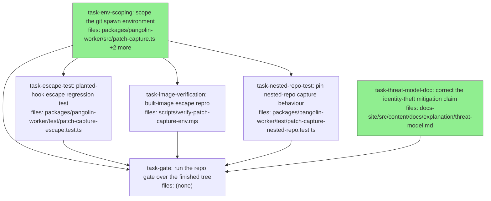

## Context

Drives `docs/superpowers/specs/2026-07-23-patch-capture-env-scoping-design.md`.

`patch-capture.ts:63` spawns `git` with **no `env` option**, so it inherits the worker's full
`process.env`. `captureBaseline` runs `git init` before the adapter (`entrypoint.ts:453`), the agent's cwd
is that workspace at the same uid, and ordinary `git add`/`git diff` execute commands named by repo-local
config (`core.fsmonitor`, `filter.*.clean`, `diff.*.textconv`, `core.hooksPath`). Reproduced three times:
a planted `core.fsmonitor` executed during `git add -A` and read back a planted `AWS_SESSION_TOKEN`,
`PANGOLIN_CALLBACK_TOKEN_REF`, and `NPM_TOKEN`.

The agent already has code execution as uid 1000 — it *is* the agent. The defect grants it the worker's
**ambient environment**, which is why the fix is one `env` argument. `patch-capture.ts:63` is the only
inheriting spawn in the repo; every other command path already passes an explicit `env`.

**Scope boundaries carried from the spec.** This plan does **not** close the `/proc/<pid>/environ` path
(separate finding, `2026-07-23-worker-env-block-exposure-design.md`, no mechanism chosen), does not
relocate `GIT_DIR` (obscurity, not a boundary, at a shared uid), and does not fix nested-repo capture
(logged as its own `agora` task) — `task-nested-repo-test` pins that behaviour so this change cannot
silently alter it.

**Blast radius.** `captureBaseline` / `computeWorkspacePatch` signatures are unchanged, and a scoped grep
across `packages/` + `test/` shows both are consumed only inside `pangolin-worker` — no API cascade. But
`output-sentinel.test.ts` invokes `captureBaseline` **seven** times (`:111, :146, :171, :191, :212, :238,
:259`) and `pipeline-golden.test.ts` pre-initialises a git repo for it. Both drive real `git` under the
new environment, so `task-env-scoping`'s acceptance covers the whole worker suite, not just
`patch-capture.test.ts`.

**One real capture-semantics change, stated rather than discovered later.** `GIT_CONFIG_GLOBAL=/dev/null`
plus `HOME=/nonexistent` also disables a global `core.excludesFile` and `core.attributesFile`. In the
shipped image this is a no-op — no `~/.gitconfig` exists — but on a contributor machine with a global
gitignore, `git add -A` will now stage files it previously excluded, changing patch content. Spec §4.3's
*"this changes the environment, not the capture contract"* is therefore slightly overstated; the contract
is unchanged **in the deployed image**, which is the environment that matters. No test pins this; it is
recorded so a contributor seeing a local diff change knows why.

**Silent-regression risk.** `captureBaseline` swallows its own errors (`patch-capture.ts:23-25`) and
`computeWorkspacePatch` returns `null` on throw (`:46-48`). Capture broken by this change would produce
empty patches on successful dispatches with no log line. There is no runtime kill-switch and none is
proposed — the pre-merge tests are the gate. This is why **every absence assertion in this plan carries a
positive control**: a test that observes nothing must prove it was looking.

**Test-harness facts every task must respect.** `packages/pangolin-worker` has **no `vitest.config.*`**,
so `globals` is `false` and the default `testTimeout` is 5 s. Every new test file must import from
`vitest` explicitly — all 23 existing files in that directory do. Separately, `pnpm lint` is
`eslint src --ext .ts` and the package tsconfig's `include` is `src/**/*`: **`test/` is neither linted nor
typechecked**, so neither gate can catch a broken test file. Only running it can.

**Gate ownership — exactly one task may run anything wider than a single package.** Repo gate:
`pnpm lint && pnpm typecheck && pnpm test` plus `pnpm check:deps` (`node scripts/check-declared-deps.mjs`,
which runs against built `dist/` — so `pnpm -r build` first). **All of it belongs to `task-gate`**, which
depends on every other task. Assigning it by file ownership — "the task touching `src/` owns the repo
gate" — is wrong, because these are whole-workspace operations and the tasks share one checkout:

- **The worker suite collides.** `task-env-scoping` creates `test/patch-capture-env.test.ts`, which
  imports `buildGitEnv` from `src/patch-capture.js`. Vitest globs `test/*.test.ts`. Between that file
  landing and the export existing, **every** worker-suite run dies at collection — so a concurrent task
  whose acceptance is "the worker suite passes in full" fails on a file it does not own, cannot fix, and
  (never having seen the sibling's text) cannot diagnose. `task-nested-repo-test` therefore now
  `depends_on: [task-env-scoping]`; the plan already argues its test is valid on both sides of that
  change **by construction**, verified by measurement, so ordering it after costs nothing.
- **`docs-site/dist/` is a real parallel write.** `docs-site` is a workspace member
  (`pnpm-workspace.yaml`), so `pnpm -r build` runs `astro build` into the same directory that
  `task-threat-model-doc`'s own `pnpm --filter @pangolin/docs-site build` targets. Astro clears its
  outDir at start; two concurrent builds is an EPERM/ENOENT flake attributed to whichever loses.
- **No gate run would otherwise see the final tree.** Two tasks add files *after* whichever task owns the
  gate, so a gate owned by `task-env-scoping` would run against a tree missing them.

Every task other than `task-gate` runs at most
`pnpm --filter @quarry-systems/pangolin-worker lint|typecheck|test`.

## Tasks

## Task: scope the git spawn environment

```yaml
id: task-env-scoping
depends_on: []
files:
  - packages/pangolin-worker/src/patch-capture.ts
  - packages/pangolin-worker/src/runtime-env-filter.ts
  - packages/pangolin-worker/test/patch-capture-env.test.ts
status: done
quality_reviewer_hint: opus
```

Pass `git` an explicit six-key environment instead of inheriting the worker's, and update the
`runtime-env-filter.ts:19-20` comment that documents the old behaviour and becomes false the moment this
lands. The environment is built by an exported pure function so the allow-list is assertable as a **set** —
a deny-list assertion ("no `AWS_*`") would pass an implementation that leaked `ANTHROPIC_API_KEY`.

The test file carries **two** tests: the set-equality assertion, and a cross-platform proof that `git()`
actually *calls* `buildGitEnv()`. Without the second, nothing outside the POSIX-flavoured escape test
proves the function is wired in at all, and a `buildGitEnv` that is exported but never called would pass.

### Implementation — `packages/pangolin-worker/src/patch-capture.ts`

Add the exported function, and pass its result as the spawn's `env`. Everything else in `git()` —
the `-C`/`-c` arguments, the stdout/stderr collection, the `settled` guard, the exit handling — is
unchanged.

```typescript
/** The complete environment `git` runs with. Exported so the allow-list is assertable as a set.
 *  Everything absent is the point: no AWS_*, no PANGOLIN_*, nothing a future deploy adds. */
export function buildGitEnv(): Record<string, string> {
  return {
    // Node resolves the `git` binary through the PASSED env; omitting this risks ENOENT.
    PATH: process.env.PATH ?? '/usr/local/bin:/usr/bin:/bin',
    // A fixed value with no directory to create, own, or clean up. ~/.gitconfig is a live
    // attack vector (HOME is in runtime-env-filter's BUILTIN_ALLOW), and GIT_CONFIG_GLOBAL
    // below neutralises it regardless.
    HOME: '/nonexistent',
    GIT_CONFIG_GLOBAL: '/dev/null', // kills ~/.gitconfig and $XDG_CONFIG_HOME/git/config
    GIT_CONFIG_NOSYSTEM: '1', // kills /etc/gitconfig
    GIT_TERMINAL_PROMPT: '0', // capture must never block on a credential prompt
    LC_ALL: 'C', // deterministic stdout; capture parses it
  };
}
```

```typescript
    const child = spawn(
      'git',
      [
        '-C', dir,
        '-c', 'safe.directory=*',
        '-c', 'user.email=pangolin@local',
        '-c', 'user.name=pangolin',
        '-c', 'commit.gpgsign=false',
        ...args,
      ],
      { env: buildGitEnv() }, // <-- the fix
    );
```

`GIT_EXEC_PATH` is deliberately absent — git injects it and prepends `/usr/lib/git-core` to `PATH`
itself (confirmed by reading back a planted hook's environment). So are `LD_LIBRARY_PATH`, `LANG`,
`TMPDIR`, and `XDG_*`. On Windows, libuv additionally injects `SYSTEMROOT`/`TEMP`/`PATHEXT`/`COMSPEC` on
its own, so the table needs no platform escape hatch. Proxy variables are irrelevant because this helper
runs only local plumbing (`init`, `add`, `write-tree`, `diff`) and never performs network I/O —
`runtime-env-filter.ts:17-18` flags them as a migration concern for the *agent*, not here.

### Implementation — `packages/pangolin-worker/src/runtime-env-filter.ts`

In the "Migration notes" block at `:19-20`, replace the now-false bullet:

```
//   - git is unaffected: patch-capture spawns git with the worker's own
//     unfiltered process.env, not the filtered baseEnv.
```

with one describing the current behaviour, e.g.:

```
//   - git does not use this filter at all: patch-capture spawns git with its
//     own fixed six-key environment (`buildGitEnv` in patch-capture.ts), which
//     is narrower than baseEnv and carries no credential of any kind.
```

Change nothing else in this file — `BUILTIN_ALLOW`, the prefixes, and the redaction-asymmetry note are
untouched.

### Implementation — `packages/pangolin-worker/test/patch-capture-env.test.ts` (new file)

```typescript
import { describe, it, expect, afterEach } from 'vitest';
import { mkdtemp, writeFile } from 'node:fs/promises';
import { tmpdir } from 'node:os';
import { join } from 'node:path';
import { buildGitEnv, captureBaseline, computeWorkspacePatch } from '../src/patch-capture.js';

describe('buildGitEnv', () => {
  it('gives git exactly the six-key allow-list and nothing else', () => {
    process.env.AWS_SESSION_TOKEN = 'MUST-NOT-LEAK';
    process.env.PANGOLIN_CALLBACK_TOKEN_REF = 'MUST-NOT-LEAK';
    expect(Object.keys(buildGitEnv()).sort()).toEqual([
      'GIT_CONFIG_GLOBAL',
      'GIT_CONFIG_NOSYSTEM',
      'GIT_TERMINAL_PROMPT',
      'HOME',
      'LC_ALL',
      'PATH',
    ]);
    expect(buildGitEnv().HOME).toBe('/nonexistent');
    expect(buildGitEnv().GIT_CONFIG_GLOBAL).toBe('/dev/null');
    expect(buildGitEnv().GIT_CONFIG_NOSYSTEM).toBe('1');
  });
});

describe('git() wiring', () => {
  afterEach(() => {
    delete process.env.GIT_DIR;
  });

  // Cross-platform proof that git() runs under buildGitEnv() rather than process.env,
  // with no shell hook involved. GIT_DIR is honoured by git when inherited and would
  // redirect the repo away from the workspace: pre-fix, `git add -A` exits 128
  // ("this operation must be run in a work tree"), captureBaseline swallows it and
  // returns { unavailable: true }, and computeWorkspacePatch returns null. Post-fix
  // GIT_DIR is simply absent from the child's environment and capture is unaffected.
  // Verified to discriminate on git 2.35.1.
  it('ignores GIT_DIR set in the worker process.env', async () => {
    const dir = await mkdtemp(join(tmpdir(), 'gitenv-'));
    await writeFile(join(dir, 'a.txt'), 'one\n');
    process.env.GIT_DIR = join(tmpdir(), 'hijacked-should-not-be-used.git');

    const base = await captureBaseline(dir);
    expect(base).toMatchObject({ treeOid: expect.any(String) }); // pre-fix: { unavailable: true }

    await writeFile(join(dir, 'a.txt'), 'one\ntwo\n');
    const patch = await computeWorkspacePatch(dir, base);
    expect(patch).not.toBeNull(); // pre-fix: null
    expect(new TextDecoder().decode(patch!)).toContain('+two');
  });
});
```

## Acceptance criteria

- `Object.keys(buildGitEnv())` sorted equals exactly
  `['GIT_CONFIG_GLOBAL','GIT_CONFIG_NOSYSTEM','GIT_TERMINAL_PROMPT','HOME','LC_ALL','PATH']` — an
  equality assertion on the key set, not an absence check — and it holds with `AWS_SESSION_TOKEN` and
  `PANGOLIN_CALLBACK_TOKEN_REF` set in `process.env`.
- `buildGitEnv().HOME` is `/nonexistent`; `GIT_CONFIG_GLOBAL` is `/dev/null`; `GIT_CONFIG_NOSYSTEM` is
  `'1'`.
- `spawn` in `git()` receives `{ env: buildGitEnv() }`, and the `GIT_DIR` test **passes**. Confirm it
  discriminates: with the `env` option removed it must fail on `expect(base).toMatchObject(...)`. This is
  checkable inside this task's own `files:` — do not edit any other task's files to demonstrate it.
- Both tests import from `'vitest'` explicitly; the file runs green under
  `pnpm --filter @quarry-systems/pangolin-worker test patch-capture-env`.
- The `runtime-env-filter.ts:19-20` comment no longer claims *"git is unaffected: patch-capture spawns git
  with the worker's own unfiltered process.env"*; it describes the scoped environment instead. No other
  part of that file changes.
- The **entire worker suite** passes unmodified — `pnpm --filter @quarry-systems/pangolin-worker test`.
  This is wider than `patch-capture.test.ts`'s five cases: `output-sentinel.test.ts` calls
  `captureBaseline` seven times and `pipeline-golden.test.ts` pre-initialises a git repo.
- Gate, package-scoped only: `pnpm --filter @quarry-systems/pangolin-worker lint`, `... typecheck`,
  `... test`. **Do not run `pnpm -r build`, `pnpm -r test`, `pnpm lint`, `pnpm typecheck`, or
  `pnpm check:deps`** — those are whole-workspace operations owned by `task-gate`, and running them here
  races the tasks executing alongside you (see Context).

Test file: `packages/pangolin-worker/test/patch-capture-env.test.ts`.

## Task: planted-hook escape regression test

```yaml
id: task-escape-test
depends_on: [task-env-scoping]
files:
  - packages/pangolin-worker/test/patch-capture-escape.test.ts
status: done
quality_reviewer_hint: opus
```

Reproduce the original escape end to end and assert it no longer yields anything. A repo-local
`core.fsmonitor` hook still *executes* after the fix — that is accepted, and stated in the spec — so the
assertion is about what the hook can *learn*, not whether it runs.

**The whole file is one code path away from being vacuous**, so it carries three defences:

1. **No `.catch(() => '')` on the leak read.** If the hook never ran, the file is absent and `readFile`
   must throw, failing the test loudly. Swallowing that turns every absence assertion into a pass on the
   empty string.
2. **Positive assertions that the observation happened** — the captured environment must contain
   `PATH=` (the hook ran at all) and `HOME=/nonexistent` (it ran under the *scoped* env specifically).
3. **A second test in the same file driving an unscoped spawn directly**, which must show the leak. This
   is the discrimination proof: it replaces the "temporarily revert `git()` and record it in the PR
   description" step, which wrote to a file this task does not own and which no isolated agent can
   perform.

The leak file is written to a directory **outside** the captured workspace. Written inside it, the hook's
output is staged by the very `git add -A` that triggered it and the planted credential lands in the
produced patch.

Both tests run on all platforms. The `#!/bin/sh` hook was verified to execute under
`git 2.35.1.windows.2` (Git for Windows ships `sh`) as well as on Linux, so there is no `skipIf` — this
is the only test that exercises the real hook vector, and skipping it on the development platform would
leave that vector unproven where it is most often run. Backslashes are escape characters in
`.git/config`, so the hook path must be written with forward slashes.

### Implementation — `packages/pangolin-worker/test/patch-capture-escape.test.ts` (new file)

```typescript
import { describe, it, expect } from 'vitest';
import { mkdtemp, writeFile, chmod, readFile } from 'node:fs/promises';
import { spawn } from 'node:child_process';
import { tmpdir } from 'node:os';
import { join, sep } from 'node:path';
import { captureBaseline, computeWorkspacePatch } from '../src/patch-capture.js';

const AWS_VALUE = 'TOPSECRET-TASK-ROLE';
const REF_VALUE = 'secret-ref-abc';

/** Writes the hook + the repo-local config that invokes it. `leakDir` is deliberately
 *  outside `dir` so the hook's own output is not staged into the captured patch. */
async function plantHook(dir: string, leakDir: string): Promise<string> {
  const leak = join(leakDir, 'leak.txt');
  const hook = join(dir, '.git', 'evil.sh');
  await writeFile(hook, `#!/bin/sh\nenv > '${leak.split(sep).join('/')}'\nexit 1\n`);
  await chmod(hook, 0o755);
  // Backslashes are escapes in .git/config — forward-slash the path on every platform. Quote it
  // too: git runs core.fsmonitor through a shell, so an unquoted path containing a space breaks
  // the vector. That failure is fail-SAFE (no leak file, and the no-.catch read fails loudly)
  // rather than a false pass, but a mkdtemp path under a spaced user directory would waste a run.
  const cfgPath = hook.split(sep).join('/');
  await writeFile(join(dir, '.git', 'config'), `[core]\n\tfsmonitor = '${cfgPath}'\n`, {
    flag: 'a',
  });
  return leak;
}

describe('patch-capture escape', () => {
  it('a repo-local core.fsmonitor hook sees no credential from the worker', async () => {
    const dir = await mkdtemp(join(tmpdir(), 'escape-'));
    const leakDir = await mkdtemp(join(tmpdir(), 'escape-leak-'));

    await writeFile(join(dir, 'file.txt'), 'hello\n');
    const base = await captureBaseline(dir); // creates .git/ before the "agent" acts
    expect(base).toMatchObject({ treeOid: expect.any(String) }); // capture actually ran

    const leak = await plantHook(dir, leakDir); // the agent's move
    await writeFile(join(dir, 'file.txt'), 'hello\nagent change\n');

    process.env.AWS_SESSION_TOKEN = AWS_VALUE;
    process.env.PANGOLIN_CALLBACK_TOKEN_REF = REF_VALUE;
    await computeWorkspacePatch(dir, base);

    // No .catch — an absent file means the hook never ran and the test must fail loudly.
    const captured = await readFile(leak, 'utf8');

    // Positive controls: the hook executed, and it executed under the SCOPED env.
    expect(captured).toMatch(/^PATH=/m);
    expect(captured).toMatch(/^HOME=\/nonexistent$/m);

    // The actual security assertions.
    expect(captured).not.toContain(AWS_VALUE);
    expect(captured).not.toContain(REF_VALUE);
    expect(captured).not.toMatch(/^AWS_/m);
    expect(captured).not.toMatch(/^PANGOLIN_/m);
  });

  it('POSITIVE CONTROL: the same hook under an unscoped spawn does leak the worker env', async () => {
    const dir = await mkdtemp(join(tmpdir(), 'escape-ctl-'));
    const leakDir = await mkdtemp(join(tmpdir(), 'escape-ctl-leak-'));
    await writeFile(join(dir, 'file.txt'), 'hello\n');

    // Drive git locally with NO env option — the pre-fix behaviour — so this test proves
    // the vector is live and the assertions above discriminate. No source file is touched.
    const rawGit = (args: string[]) =>
      new Promise<void>((resolve, reject) => {
        const c = spawn('git', ['-C', dir, '-c', 'safe.directory=*', ...args]);
        c.on('error', reject);
        c.on('exit', () => resolve()); // the hook exits 1 by design; ignore the status
      });

    await rawGit(['init', '-q']);
    const leak = await plantHook(dir, leakDir);
    process.env.AWS_SESSION_TOKEN = AWS_VALUE;
    await rawGit(['add', '-A']);

    const captured = await readFile(leak, 'utf8');
    expect(captured).toContain(AWS_VALUE);
  });
});
```

## Acceptance criteria

- With `AWS_SESSION_TOKEN` and `PANGOLIN_CALLBACK_TOKEN_REF` present in the worker's `process.env`, the
  hook's captured environment contains neither value, and contains no line matching `^AWS_` or
  `^PANGOLIN_`.
- The leak file is read **without** a `.catch` fallback, so a hook that never ran fails the test.
- The first test asserts `captureBaseline` returned a `treeOid`, and that the captured environment
  matches `^PATH=` and `^HOME=/nonexistent$` — the positive controls proving the observation occurred and
  occurred under the scoped environment.
- The second test — the positive control — **passes**, showing the identical hook leaks `AWS_SESSION_TOKEN`
  through an unscoped spawn. This is the discrimination proof, and it lives in this task's own file: do
  **not** edit `patch-capture.ts` to demonstrate the failure.
- The leak file is written outside the captured workspace directory, so no planted credential can be
  staged into the produced patch.
- Both tests import from `'vitest'` explicitly and run on all platforms — no `skipIf`. The hook path is
  written with forward slashes in `.git/config`.
- `pnpm --filter @quarry-systems/pangolin-worker test` passes in full.
- If either test approaches the 5 s default `testTimeout` (this package has no `vitest.config.*`), raise
  it per-test with `it('…', async () => {…}, 15_000)` rather than adding a config file.

Test file: `packages/pangolin-worker/test/patch-capture-escape.test.ts`.

## Task: pin nested-repo capture behaviour

```yaml
id: task-nested-repo-test
depends_on: [task-env-scoping]
files:
  - packages/pangolin-worker/test/patch-capture-nested-repo.test.ts
status: done
```

A characterisation test for a defect this plan does **not** fix: git records a nested `.git` as a
gitlink, so an agent editing files inside a mounted repository produces an empty diff with a successful
outcome. Pinning it means the environment change cannot silently alter capture semantics for that case.

The test is valid on both sides of `task-env-scoping` **by construction**, not by being run twice: it
asserts only on `computeWorkspacePatch` output and references no environment detail. Verified by
measurement to produce an identical result under both the inherited and the scoped environment
(`newtop.txt` present, `agent change` absent, same patch either way).

**It nonetheless `depends_on: [task-env-scoping]`, and that is about execution, not semantics.** This
task's acceptance runs the whole worker suite, and `task-env-scoping` adds a test file importing a symbol
it exports in the same edit session — so running concurrently means a guaranteed window where the suite
dies at collection on a file this task does not own and cannot diagnose. Ordering costs nothing here
precisely *because* the test is env-independent.

Do not assert anything about the patch's byte length: it is machine-dependent (a
Git-for-Windows **system** `core.autocrlf=true` reaches the pre-fix path and is disabled post-fix by
`GIT_CONFIG_NOSYSTEM=1`). Assert on content only.

### Implementation — `packages/pangolin-worker/test/patch-capture-nested-repo.test.ts` (new file)

```typescript
import { describe, it, expect } from 'vitest';
import { mkdtemp, mkdir, writeFile } from 'node:fs/promises';
import { execFileSync } from 'node:child_process';
import { tmpdir } from 'node:os';
import { join } from 'node:path';
import { captureBaseline, computeWorkspacePatch } from '../src/patch-capture.js';

// Pins CURRENT behaviour, not desired behaviour. The underlying defect is tracked as the
// `agora` wiki task
// `task-patch-capture-silently-drops-every-edit-inside-a-nested-repository-gitlink`,
// which carries the reproduction and four candidate fix shapes. When that task lands,
// this test is expected to change.
describe('patch-capture with a nested repository', () => {
  it('does NOT capture edits inside a nested repository (documented gitlink behaviour)', async () => {
    const dir = await mkdtemp(join(tmpdir(), 'nested-'));
    const inner = join(dir, 'repo');
    await mkdir(inner);
    await writeFile(join(inner, 'src.txt'), 'original\n');
    const g = (args: string[], cwd: string) =>
      execFileSync('git', ['-c', 'user.email=t@t', '-c', 'user.name=t', ...args], { cwd });
    g(['init', '-q', '.'], inner);
    g(['add', '-A'], inner);
    g(['commit', '-qm', 'init'], inner);

    await writeFile(join(dir, 'top.txt'), 'top\n');
    const base = await captureBaseline(dir);

    await writeFile(join(inner, 'src.txt'), 'original\nagent change\n'); // invisible
    await writeFile(join(dir, 'newtop.txt'), 'new top file\n'); // visible

    const bytes = await computeWorkspacePatch(dir, base);
    expect(bytes).not.toBeNull();
    const patch = new TextDecoder().decode(bytes!);

    // Positive control first: capture ran and produced real output, so the absence
    // assertion below cannot pass for the wrong reason.
    expect(patch.length).toBeGreaterThan(0);
    expect(patch).toContain('newtop.txt');

    expect(patch).not.toContain('agent change');
  });
});
```

## Acceptance criteria

- The computed patch is non-null, non-empty, and contains `newtop.txt` — proving capture ran and produced
  output before any absence is asserted.
- The computed patch does **not** contain `agent change`, the edit made inside the nested repository.
- The test asserts only on `computeWorkspacePatch` output and references no environment detail
  (`buildGitEnv`, `HOME`, `GIT_CONFIG_*`, `GIT_DIR`), which is what makes it valid both before and after
  `task-env-scoping`. Do not attempt to apply, revert, or detect that task's change.
- A comment in the test names the `agora` task
  `task-patch-capture-silently-drops-every-edit-inside-a-nested-repository-gitlink` so the pinned
  behaviour is not mistaken for desired behaviour.
- Imports from `'vitest'` explicitly; `pnpm --filter @quarry-systems/pangolin-worker test` passes in full.

Test file: `packages/pangolin-worker/test/patch-capture-nested-repo.test.ts`.

## Task: built-image escape repro

```yaml
id: task-image-verification
depends_on: [task-env-scoping]
files:
  - scripts/verify-patch-capture-env.mjs
status: done
quality_reviewer_hint: opus
```

Discharges spec §4.4 (`HOME=/nonexistent` is harmless, exercised in a container) and §7 (record one run of
the escape repro against the **built worker image**). Both were orphaned in rev 1.

**§7 is impossible in the form the spec implies, so the shape changes.** `packages/pangolin-worker/package.json`
declares `"files": ["dist","README.md","LICENSE"]` and the image is built with
`pnpm deploy --filter=@quarry-systems/pangolin-worker --prod /deploy/worker`, so **`test/` is not in the
image** and **vitest is not installed** (it is a root devDependency and the deploy is `--prod`). The
verification is therefore a standalone `node` script importing the compiled module at
`/opt/pangolin/worker/dist/patch-capture.js`, mounted in at run time — not the vitest file.

The image has what the script needs: the runtime stage installs `git`, runs as `pangolin:pangolin`
(uid 1000), and `WORKDIR /workspace` is writable.

**The script must carry its own positive control.** A container check that only asserts absence fails
exactly the way rev 1's escape test did: if the fsmonitor vector does not fire under that image's git
version, every assertion passes and the check reports success having proven nothing. So the script runs
both arms — an unscoped spawn that must leak, then the real capture path that must not — and fails if
*either* expectation is unmet.

**A standing PR-time image build is deliberately NOT part of this task.** The image workflow
(`.github/workflows/pangolin-worker-image.yml`) triggers only on `push` to `main`, `v*` tags, and
`workflow_dispatch`, so no PR builds it — an earlier revision added a `pull_request` arm here. That was
withdrawn for a reason worth stating, because it generalises: **a change whose correctness cannot be
verified from the environment the executing agent runs in does not belong in a plan that agent
executes.** Two concrete failures made the point — the loaded image's tag comes from
`docker/metadata-action` and is `ghcr.io/quarrysystems/pangolin-worker:sha-<sha>`, not the
`pangolin-worker:verify` the run step referenced; and the provenance/SBOM-vs-`load` hazard **succeeds
locally** on a daemon using the containerd image store while failing on `ubuntu-latest`'s classic store,
so an instruction to "verify rather than assume" returns a false negative on the machine that runs it.
Neither is catchable by any acceptance criterion this task could carry.

Spec §7 asks for **one recorded run** against the built image, which this task delivers. The standing CI
arm is un-speced, permanently-owned infrastructure; it is logged as its own `agora` task, where opening
the PR *is* the test.

### Implementation — `scripts/verify-patch-capture-env.mjs` (new file)

A plain ESM script, no test framework. Exit 0 on success; exit 1 with a diagnostic on any failure.
Structure it as:

1. `import { captureBaseline, computeWorkspacePatch } from '/opt/pangolin/worker/dist/patch-capture.js'`
   — accept the module path from `process.argv[2]` with that as the default, so the script can also be
   run against a local `packages/pangolin-worker/dist/` build while developing it.
2. A `plantHook(dir, leakDir)` helper mirroring the escape test: writes `.git/evil.sh` (`#!/bin/sh`,
   `env > <leak>`, `exit 1`), `chmod 0755`, appends `[core]\n\tfsmonitor = <hook>` to `.git/config`.
   `leakDir` is outside `dir`.
3. **Arm A — positive control.** `spawn('git', ['-C', dir, '-c', 'safe.directory=*', 'init', '-q'])` with
   no `env`, plant the hook, then `git add -A` with no `env`. Read the leak file. **Require** it to
   contain the planted `AWS_SESSION_TOKEN` value. If it does not, fail with
   `"positive control did not leak — the fsmonitor vector is not live in this image; arm B proves nothing"`.
4. **Arm B — the real path.** Fresh workspace, `captureBaseline`, assert a `treeOid` came back, plant the
   hook, mutate a file, `computeWorkspacePatch`. Read the leak file **without** a fallback. Require
   `^PATH=` and `^HOME=/nonexistent$` present; require the planted `AWS_SESSION_TOKEN` /
   `PANGOLIN_CALLBACK_TOKEN_REF` values and any `^AWS_` / `^PANGOLIN_` line absent.
5. Print one line per arm and a final `OK` / `FAIL: <reason>`.

The credential values come from `process.env` (`AWS_SESSION_TOKEN`, `PANGOLIN_CALLBACK_TOKEN_REF`), which
the `docker run` supplies; the script must fail fast if they are unset rather than assert against
`undefined`.

Invocation. **Use the stdin form, not a bind mount** — under Git Bash, MSYS mangles a `-v` path spec and
Docker silently creates an empty *directory* at the target, so `node /tmp/verify.mjs` fails with a
confusing module error rather than a mount error, and `MSYS_NO_PATHCONV=1` does not fix it. The stdin form
is platform-independent and was verified working:

```bash
docker build -f docker/pangolin-worker/Dockerfile -t pangolin-worker:verify .
docker run -i --rm \
  -e AWS_SESSION_TOKEN=TOPSECRET-TASK-ROLE \
  -e PANGOLIN_CALLBACK_TOKEN_REF=secret-ref-abc \
  --entrypoint sh pangolin-worker:verify \
  -c 'cat > /tmp/verify.mjs; node /tmp/verify.mjs' < scripts/verify-patch-capture-env.mjs
```

## Acceptance criteria

- `scripts/verify-patch-capture-env.mjs` exists and is plain ESM requiring no test framework. It defaults
  its module path to `/opt/pangolin/worker/dist/patch-capture.js` and accepts an override as `argv[2]`.
  **The override must be converted with `pathToFileURL(resolve(p)).href` before `import()`** — a bare
  Windows path throws `ERR_UNSUPPORTED_ESM_URL_SCHEME`, which would make the documented "run it against a
  local `dist/` build while developing" use unusable on the machine writing it. The in-container default
  needs no conversion.
- The script runs **both** arms and exits non-zero if the positive-control arm fails to leak — a run in
  which the fsmonitor vector never fired must be reported as a failure, not a pass.
- Arm B reads the leak file with no `.catch` fallback and asserts `^PATH=` and `^HOME=/nonexistent$`
  present before asserting any credential absent.
- **Arm B also asserts `computeWorkspacePatch` returned non-null bytes containing the mutated line.**
  This is the second half of spec §4.4 (*"assert exit 0 **and a correct diff**"*) — without it the arm
  proves the environment is clean but not that capture still works under it, which is the whole
  silent-regression risk. Measured in the real image: it returns 109 bytes, so the assertion is free.
- The script exits non-zero if `AWS_SESSION_TOKEN` or `PANGOLIN_CALLBACK_TOKEN_REF` is unset.
- Running the two commands above against a locally built image prints `OK` and exits 0. **Record the
  actual terminal output in the task result** — this is the §7 evidence, and the one acceptance bullet
  that cannot be satisfied by reading the code. Use the **stdin form**, not `-v` (see above).
- `docker/pangolin-worker/Dockerfile` is **not** modified. The image is verified as it ships.
- **No CI workflow file is modified.** The standing PR-time image build is out of scope and logged
  separately; adding it here is over-build against spec §7.

Test file: none — verified by the recorded container run.

## Task: correct the identity-theft mitigation claim

```yaml
id: task-threat-model-doc
depends_on: []
files:
  - docs-site/src/content/docs/explanation/threat-model.md
status: done
model_hint: cheap
review_mode: merged
```

The published threat model states a mitigation that does not hold. The *Identity theft* row (line **83**)
claims the env firewall means the whole AWS credential chain is dropped; the agent need not run
`env`/`printenv` — it reads `/proc/<pid>/environ` at the same uid. This is a correction of current fact,
independent of any code fix, so it ships with whichever change lands first.

**Exactly two rows change.** Rev 1 asked for "the diagram and the later credentials prose" to be updated
while also forbidding any other row from being edited — a contradiction, and both halves were wrong about
the file:

- Line **48** is a mermaid node label,
  `boundary{{"execution boundary<br/>+ env firewall + privilege split"}}`. It makes **no**
  credential-chain claim, so there is nothing to correct. **Leave it unchanged.**
- Line **97** is not prose. It is the `**Over-broad environment**` row of the `### Credentials` table
  (heading at `:88`), and it does repeat the mitigation. It is the second row that changes.

### Implementation — line 83, the *Identity theft* row

Qualify the Mitigation cell and state the shared-uid limit in the Honest-limit cell.

```markdown
<!-- BEFORE (Mitigation cell, and the Honest-limit cell that follows it) -->
… every `PANGOLIN_*` var and the whole AWS credential chain are dropped. Creds the agent genuinely
needs arrive separately via the scoped secret lane. See [credentials](#credentials). | An operator can
re-open it via `PANGOLIN_RUNTIME_ENV_ALLOW`; a bare `*` re-opens everything. Operator footgun,
documented in code, not blocked. |
```

```markdown
<!-- AFTER -->
… every `PANGOLIN_*` var and the whole AWS credential chain are dropped **from the environment handed to
the agent process**. Creds the agent genuinely needs arrive separately via the scoped secret lane. See
[credentials](#credentials). | **The firewall does not isolate the worker's own process.** The agent and
the worker run as the same uid, `/proc/<pid>/environ` is mode 0400 owned by that uid, and Docker sets no
`hidepid` — so an agent can read the worker's environment directly, without `env`/`printenv`. Verified
2026-07-23; tracked in `2026-07-23-worker-env-block-exposure-design.md`, no mechanism chosen yet.
Separately, an operator can re-open the filter via `PANGOLIN_RUNTIME_ENV_ALLOW`; a bare `*` re-opens
everything. |
```

### Implementation — line 97, the *Over-broad environment* row

Add one sentence to its **Honest limit** cell, keeping the existing allow-list-asymmetry text:

> The firewall scopes only the environment handed to the agent, not the worker's own process — at a
> shared uid the agent reads that directly at `/proc/<pid>/environ` (see *Identity theft* above).

Verification is by targeted grep, since no automated check covers this file:

```bash
# must return nothing — the unqualified claim is gone
grep -n "the whole AWS credential chain are dropped\. " docs-site/src/content/docs/explanation/threat-model.md
# must exit 0 — the shared-uid limit is stated on the Identity-theft row
sed -n '83p' docs-site/src/content/docs/explanation/threat-model.md | grep -q '/proc/'
# must exit 0 — and on the Over-broad-environment row
sed -n '97p' docs-site/src/content/docs/explanation/threat-model.md | grep -q '/proc/'
# must return nothing — the diagram is untouched. NOTE `git diff HEAD`, not `git diff`:
# the latter is empty for a staged or committed file and would false-pass.
git diff HEAD -- docs-site/src/content/docs/explanation/threat-model.md | grep '^[-+].*boundary{{'
```

Line numbers shift if the edit spans lines; re-derive them with
`grep -n 'Identity theft\|Over-broad environment'` rather than trusting `83`/`97` after editing.

## Acceptance criteria

- The *Identity theft* row's Mitigation cell no longer asserts the credential chain is dropped without
  qualification; it scopes the claim to the environment handed to the agent process.
- That row's Honest-limit cell states the shared-uid `/proc/<pid>/environ` exposure explicitly and names
  `2026-07-23-worker-env-block-exposure-design.md` as where it is tracked.
- The *Over-broad environment* row's Honest-limit cell gains the shared-uid sentence, keeping its existing
  allow-list-asymmetry text.
- The mermaid diagram (`boundary{{…}}`, line 48) is **unchanged** — it carries no credential-chain claim.
- **No row other than those two is edited**, and no section outside the two tables is touched.
- All four verification commands above give their stated results.
- `pnpm --filter @pangolin/docs-site build` succeeds — this is what actually runs
  starlight-links-validator. Note that neither `pnpm lint` nor the link-check workflow covers this change:
  `docs-site/package.json` has **no `lint` script**, so root `pnpm -r run lint` is a no-op here, and
  `external-link-check.yml` runs on `pull_request` only for `paths: ['lychee.toml', …]`. Beyond the
  docs-site build, this task is review-only — do not claim a gate it does not have.

Test file: none — verified by the four commands above plus review against these criteria.

## Task: run the repo gate over the finished tree

```yaml
id: task-gate
depends_on: [task-env-scoping, task-escape-test, task-nested-repo-test, task-image-verification, task-threat-model-doc]
files: []
status: done
single_threaded: true
is_wiring_task: true
quality_reviewer_hint: opus
```

The only task permitted to run whole-workspace commands. It exists because every other task runs
concurrently in one shared checkout, and `pnpm -r build` / `pnpm -r test` / `pnpm lint` / `pnpm typecheck`
are workspace-wide: run from two tasks at once they race on `packages/*/dist` and `docs-site/dist`, and a
suite run from one task executes another's half-written files. Depending on all five also makes this the
only run that sees the **finished** tree — a gate owned by any earlier task would miss the files added
after it. `single_threaded: true` is what guarantees nothing else is in flight while it runs.

This task writes nothing. If the gate fails, **attribute and report** — do not repair, because every
source file belongs to a task whose scope this is not:

| File | Owner |
|---|---|
| `src/patch-capture.ts`, `src/runtime-env-filter.ts`, `test/patch-capture-env.test.ts` | `task-env-scoping` |
| `test/patch-capture-escape.test.ts` | `task-escape-test` |
| `test/patch-capture-nested-repo.test.ts` | `task-nested-repo-test` |
| `scripts/verify-patch-capture-env.mjs` | `task-image-verification` |
| `docs-site/src/content/docs/explanation/threat-model.md` | `task-threat-model-doc` |
| anything else | pre-existing — report, do not touch |

## Acceptance criteria

- The full repo gate passes, in this order: `pnpm lint && pnpm typecheck`, then
  `pnpm -r build && pnpm run check:deps` (the dep guard reads built `dist/`, so the build must precede
  it), then `pnpm -r --workspace-concurrency=1 test`.
- `pnpm --filter @pangolin/docs-site build` succeeds — it is what actually runs starlight-links-validator
  over the threat-model edit, and root `pnpm lint` does not cover it (`docs-site` has no `lint` script).
- The worker suite is green **in full**, including all four new test files, with no `.only`, no `.skip`
  added, and no test file excluded.
- Every command's output is recorded in the task result. A gate whose result is asserted rather than
  shown is not a gate.
- **No file is modified by this task.** `git status --porcelain` shows nothing beyond what the five
  upstream tasks produced. If the gate fails, report the failing command, its output, and the owning task
  from the table above.

Test file: none — this task *is* the test.
