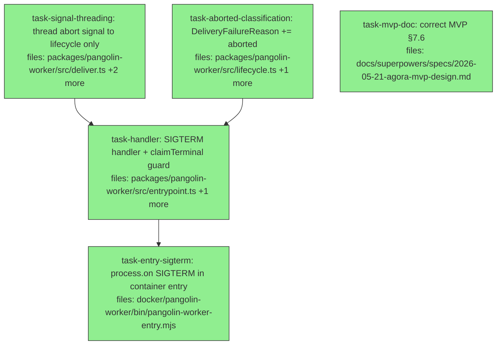

## Context

Drives from `docs/superpowers/specs/2026-07-23-worker-termination-design.md` (slice C of 3, twice
spec-audited). The Pangolin worker runs as **PID 1** with no SIGTERM handler; Linux discards an unhandled
default-action signal to PID 1, so a cancelled dispatch loses its terminal event and dies by SIGKILL. Slices
A + B + the abort seam shipped in PR #93; this plan is the remaining handler + the `'aborted'` classification.

**Load-bearing decisions (from the spec, do not re-litigate):** Q1 = flush-only (never re-emit `cancelled`
when a terminal is already claimed); Q2 = the claim is set at the START of a terminal emit; the safety net is
slice B's durable-undelivered record (`deliver.ts:34-43`), so the handler only needs to MINT `cancelled`
through the same `emit()` path, not guarantee delivery. **The double-terminal bug the second audit caught
lives in the one `dispatch.failed` site that bypasses `failWith` — the direct `provider-failed` emit at
`entrypoint.ts:570`.** The complete `emit(` set is grep-verified: four terminal sites (`:187` failWith,
`:548` needs_input, `:570` provider-failed, `:580` finished) plus the non-terminal `dispatch.started`
(`:295`, NOT guarded).

**TDD note:** implementers write their own tests within each task (that is why there is no separate test
task — a separate one would collide on `entrypoint.test.ts`). The spec §6 cases are distributed to the task
that owns each behavior.

**Out of scope for this DAG (tracked, not executable here):** the exec-replace requirement recorded in the
`/proc` credential spec lives on branch `security/worker-credential-custody` — a one-line cross-branch note
(spec §7), not a change to this branch. Adapter-kill on cancel is deferred (spec §4.2). The MVP §7.6
correction IS in scope (task-mvp-doc) — it ships regardless per spec §5.

## Tasks

## Task: aborted classification

```yaml
id: task-aborted-classification
depends_on: []
files:
  - packages/pangolin-worker/src/lifecycle.ts
  - packages/pangolin-worker/test/lifecycle.test.ts
status: done
```

Add the `'aborted'` member to `DeliveryFailureReason` and classify an external-signal abort distinctly from
the internal timeout, per spec §4.3. Observability only — `deliverLifecycle` already persists the undelivered
record on any non-delivered reason; this makes "we aborted for grace" distinguishable from "endpoint timed
out". Slice A deliberately withheld `'aborted'` as unreachable until a caller passes `opts.signal`; this is
half of making it reachable (the caller is task-handler).

## Implementation

```typescript
// packages/pangolin-worker/src/lifecycle.ts
export type DeliveryFailureReason = 'http-status' | 'network' | 'timeout' | 'aborted';

// inside emit()'s existing catch (currently: return { delivered: false, reason: timeout.aborted ? 'timeout' : 'network' })
// Classify on the INTERNAL timeout first, so an external abort never reads as 'timeout':
} catch {
  const reason: DeliveryFailureReason = timeout.aborted
    ? 'timeout'
    : opts?.signal?.aborted
      ? 'aborted'
      : 'network';
  return { delivered: false, reason };
}
```

```typescript
// packages/pangolin-worker/test/lifecycle.test.ts
it("classifies an external-signal abort as 'aborted', not 'timeout'/'network'", async () => {
  const ctrl = new AbortController();
  const emitter = new LifecycleEmitter({
    callbackUrl: 'https://x', hmacKey: 'k',
    fetchImpl: (_u, init) =>
      new Promise((_res, rej) =>
        (init!.signal as AbortSignal).addEventListener('abort', () =>
          rej(new DOMException('aborted', 'AbortError')))),
  });
  const p = emitter.emit(
    { kind: 'dispatch.cancelled', dispatchId: 'd1', at: '2026-01-01T00:00:00Z' },
    { signal: ctrl.signal });
  ctrl.abort();
  expect(await p).toEqual({ delivered: false, reason: 'aborted' });
});
```

## Acceptance criteria

- `DeliveryFailureReason` includes `'aborted'` (union is now `'http-status' | 'network' | 'timeout' | 'aborted'`).
- When `opts.signal` aborts and the internal timeout has NOT fired, `emit` returns `{ delivered: false, reason: 'aborted' }`.
- When the internal timeout fires, the reason is still `'timeout'` even if `opts.signal` is also present (positive control: external-signal presence must not change the timeout branch).
- A generic network failure with no abort still returns `'network'`.

Test file: `packages/pangolin-worker/test/lifecycle.test.ts`.

## Task: signal threading to lifecycle

```yaml
id: task-signal-threading
depends_on: []
files:
  - packages/pangolin-worker/src/deliver.ts
  - packages/pangolin-worker/src/entrypoint.ts
  - packages/pangolin-worker/test/deliver.test.ts
status: done
```

Thread an optional `AbortSignal` from the worker's `emit` closure through `deliverLifecycle` to
`emitter.emit(event, { signal })`, routed to the **lifecycle webhook only** — never to `deliverNotifications`
(notifications stay out of scope, spec §4.3). Without this the budget signal never reaches the fetch:
`emit({…}, { signal })` does not even compile today because the closure signature is `(event) =>
Promise<void>` and `deliverLifecycle` drops `opts`. This is the audit's B2 fix and must land before
task-handler.

## Implementation

```typescript
// packages/pangolin-worker/src/deliver.ts — forward an optional signal to the lifecycle emit only
export async function deliverLifecycle(
  event: LifecycleEvent,
  ctx: DeliverContext,
  opts?: { signal?: AbortSignal },
): Promise<void> {
  const outcome = await ctx.emitter.emit(event, { signal: opts?.signal });
  // ...existing persist-undelivered-on-failure + log path is unchanged...
}

// packages/pangolin-worker/src/entrypoint.ts — the emit closure gains an optional signal, forwarded to lifecycle ONLY
const emit = async (event: LifecycleEvent, opts?: { signal?: AbortSignal }): Promise<void> => {
  deps.onLifecycleEvent?.(event);
  const ctx: DeliverContext = { /* ...unchanged... */ };
  await deliverLifecycle(event, ctx, { signal: opts?.signal });
  await deliverNotifications(event, ctx); // deliberately NOT given the signal (§4.3)
};
```

```typescript
// packages/pangolin-worker/test/deliver.test.ts
it("deliverLifecycle forwards opts.signal to emitter.emit and never to notifications", async () => {
  let seen: AbortSignal | undefined = undefined;
  const emitter = { emit: (_e: unknown, o?: { signal?: AbortSignal }) => {
    seen = o?.signal; return Promise.resolve({ delivered: true, status: 200 });
  } };
  const sig = new AbortController().signal;
  await deliverLifecycle(
    { kind: 'dispatch.cancelled', dispatchId: 'd1', at: '2026-01-01T00:00:00Z' },
    { emitter, logger: fakeLogger, namespace: 'n', dispatchId: 'd1' } as unknown as DeliverContext,
    { signal: sig });
  expect(seen).toBe(sig);
});
```

## Acceptance criteria

- The `emit` closure accepts `opts?: { signal?: AbortSignal }` and forwards it to `deliverLifecycle`.
- `deliverLifecycle` forwards `opts.signal` to `ctx.emitter.emit(event, { signal })`.
- `deliverNotifications` does NOT receive the signal (assert the notification path's emitter/fetch is called without a signal, or that the signal object handed to lifecycle is not handed to notifications).
- Every existing caller of `emit(event)` / `deliverLifecycle(event, ctx)` with no `opts` compiles unchanged and behaves identically (the existing `deliver.test.ts` cases still pass).

Test file: `packages/pangolin-worker/test/deliver.test.ts`.

## Task: SIGTERM termination handler

```yaml
id: task-handler
depends_on: [task-signal-threading, task-aborted-classification]
files:
  - packages/pangolin-worker/src/entrypoint.ts
  - packages/pangolin-worker/test/entrypoint.test.ts
status: done
model_hint: opus
quality_reviewer_hint: opus
```

The core mechanism (spec §4.1–4.2, §5). Add `RunWorkerDeps.terminationSignal?: AbortSignal`; hoist
`runWorker`'s body into an inner `mainFlow()`. The state the handler reads — `terminalClaimed`,
`terminalDelivery`, and the already-`runWorker`-scoped `emit` closure and `failWith` (`:155`/`:177`) — sits at
`runWorker` scope, above `mainFlow()`; only the ~470-line body moves inside. Add a `claimTerminal()` read+set
guard on **all four** terminal-emit sites; and race `mainFlow()` against an inner `terminationOutcome()` that
flushes (claim already taken) or emits `dispatch.cancelled` under a 2 s budget (claim won). Depends on
task-signal-threading (shares `entrypoint.ts`; needs the threaded signal for the budget emit) and
task-aborted-classification (the end-to-end `'aborted'` case asserts that reason).

## Implementation

```typescript
// packages/pangolin-worker/src/entrypoint.ts
export interface RunWorkerDeps {
  // ...existing fields...
  /** Container SIGTERM bridge: the entry script's AbortController.signal (tests pass it directly). */
  terminationSignal?: AbortSignal;
}

export async function runWorker(env = process.env, deps: RunWorkerDeps = {}): Promise<number> {
  // ...existing setup (logger, cfg, emitter, the `emit` closure, `failWith`) — LIFTED to this scope...
  let terminalClaimed = false;
  let terminalDelivery: Promise<void> | null = null;
  const claimTerminal = (): boolean => (terminalClaimed ? false : ((terminalClaimed = true), true));

  // Guard EVERY terminal emit site — the four are :187 (failWith), :548 (needs_input),
  // :570 (provider-failed), :580 (finished). dispatch.started (:295) is NON-terminal: NOT guarded.
  //   if (claimTerminal()) { terminalDelivery = emit(ev); await terminalDelivery; }

  const B_MS = 2000; // self-bounded cancel budget (§5): < the 5s internal attempt timeout, leaves room for the storage.put

  const mainFlow = async (): Promise<number> => {
    // ...the entire existing runWorker body, with each terminal emit wrapped in the claim guard above...
  };

  const terminationOutcome = async (): Promise<number> => {
    const sig = deps.terminationSignal;
    if (!sig) return new Promise<number>(() => {}); // never resolves when no signal injected → race is a no-op
    if (!sig.aborted) await new Promise<void>((r) => sig.addEventListener('abort', () => r(), { once: true }));
    if (claimTerminal()) {
      await emit(
        { kind: 'dispatch.cancelled', dispatchId: cfg.dispatchId, at: new Date().toISOString() },
        { signal: AbortSignal.timeout(B_MS) });
    } else if (terminalDelivery) {
      await terminalDelivery; // flush: self-bounded by the terminal emit's own internal timeout
    }
    return 0; // graceful cancellation is not a worker failure
  };

  return Promise.race([mainFlow(), terminationOutcome()]);
}
```

```typescript
// packages/pangolin-worker/test/entrypoint.test.ts — the handler-first race (the one the first draft missed)
it("suppresses a trailing provider-failed terminal after the handler emits cancelled", async () => {
  const events: string[] = [];
  const ctrl = new AbortController();
  // adapter completes with a NON-ZERO exit (→ the :570 provider-failed tail) only AFTER cancel begins:
  const runWorkerP = runWorker(fakeEnv, {
    ...baseDeps,
    terminationSignal: ctrl.signal,
    onLifecycleEvent: (e) => { events.push(e.kind); if (e.kind === 'dispatch.cancelled') releaseAdapterNonZero(); },
    adapter: adapterThatBlocksThenExitsNonZero,
  });
  ctrl.abort();
  const code = await runWorkerP;
  // dispatch.started (:295) is non-terminal and DOES appear — assert on the TERMINAL set, not all dispatch.* events:
  const terminals = events.filter((k) => ['dispatch.finished', 'dispatch.failed', 'dispatch.needs_input'].includes(k));
  expect(terminals).toEqual([]);                  // the trailing provider-failed terminal is suppressed
  expect(events).toContain('dispatch.cancelled'); // the handler's cancel stands
  expect(code).toBe(0);
});
```

## Acceptance criteria

- `RunWorkerDeps` gains `terminationSignal?: AbortSignal`; with it absent, `runWorker` registers no listener and behaves byte-identically (an existing `entrypoint.test.ts` case passing no `terminationSignal` still passes).
- `claimTerminal()` guards all four terminal emit sites (`failWith` `:187`, `needs_input` `:548`, `provider-failed` `:570`, `finished` `:580`); the `dispatch.started` emit (`:295`) is NOT guarded.
- Cancel path: SIGTERM while the adapter runs with no terminal produced → exactly one `dispatch.cancelled` observed, no terminal precedes it, `runWorker` resolves `0`.
- Flush path: the run reaches `dispatch.finished`, then SIGTERM → no `dispatch.cancelled` observed, resolves `0`.
- Main-first race: SIGTERM during a terminal emit → flush branch taken (`finished` observed, `cancelled` not); mutating the claim to set-on-complete flips the outcome (positive control).
- Handler-first race, driven specifically through the `provider-failed` `:570` tail AND through an early `failWith`: adapter completes within budget → `cancelled` delivered, the trailing terminal suppressed (not observed); dropping the `claimTerminal` read-guard (bare set) flips the outcome (positive control).
- The cancel `emit` is passed `AbortSignal.timeout(2000)`; a callback endpoint that hangs aborts at ~2 s, the delivery outcome reason is `'aborted'`, AND the durable record `dispatches/<dispatchId>/undelivered/dispatch.cancelled.json` is persisted (assert the storage write, not just the reason — spec §6 case 5; this is the end-to-end proof that slice B's backstop is wired to the cancel emit).

Test file: `packages/pangolin-worker/test/entrypoint.test.ts`.

## Task: register SIGTERM in the container entry

```yaml
id: task-entry-sigterm
depends_on: [task-handler]
files:
  - docker/pangolin-worker/bin/pangolin-worker-entry.mjs
status: done
is_wiring_task: true
review_mode: merged
```

Wire the OS signal to the injected seam: the PID-1 entry script creates an `AbortController`, registers
`process.on('SIGTERM', () => controller.abort())`, and passes `controller.signal` as `deps.terminationSignal`
to `runWorker`, keeping its existing `.then((code) => process.exit(code))`. This is the only site with
`process.on`/`process.exit` on the worker container path (spec §4.1, constraint 1). It is untestable at unit
level — the spec §6 deliberately avoids real signals/containers — so it is a wiring task; its behavior is
proven transitively by task-handler's `terminationSignal` cases. **Cross-spec constraint (spec §7): this
placement is correct only if the `/proc` credential fix's C1 launcher uses `exec`-replace (worker stays
PID 1); do not introduce a supervising PID 1 here.**

```javascript
// docker/pangolin-worker/bin/pangolin-worker-entry.mjs
import { runWorker } from '../dist/index.js';

const controller = new AbortController();
process.on('SIGTERM', () => controller.abort());

runWorker(process.env, { terminationSignal: controller.signal })
  .then((code) => process.exit(code))
  .catch((err) => { console.error('[pangolin-worker-entry] uncaught:', err); process.exit(1); });
```

## Acceptance criteria

- The entry script registers a single `SIGTERM` listener that calls `controller.abort()`.
- `controller.signal` is passed as `deps.terminationSignal` to `runWorker`.
- The existing exit contract is preserved: `runWorker`'s resolved code drives `process.exit(code)`; an uncaught rejection still logs and exits `1`.
- No process is inserted between PID 1 and `runWorker` (no supervising launcher added here — see the §7 exec-replace constraint).

Test file: none (OS-signal wiring; verified transitively via `packages/pangolin-worker/test/entrypoint.test.ts`).

## Task: correct MVP 7.6

```yaml
id: task-mvp-doc
depends_on: []
files:
  - docs/superpowers/specs/2026-05-21-agora-mvp-design.md
status: done
model_hint: cheap
review_mode: merged
```

Correct MVP §7.6, which documents a SIGTERM handler that never existed and claims the worker "releases
channel subscriptions" (it does not — `channel.stop()` runs in the pipeline `finally`, and on the termination
path the in-container subscription ends with container teardown). Per spec §5/§7 this is a statement of
current fact and ships regardless of the rest. Independent of the code tasks (different subsystem, no shared
file); the corrected behavior is fully determined by the spec.

## Implementation

```markdown
<!-- docs/superpowers/specs/2026-05-21-agora-mvp-design.md §7.6 — replace the SIGTERM sentence -->
The worker traps SIGTERM and, if no terminal event has yet been produced for the dispatch, emits
`dispatch.cancelled` (a run that already produced a terminal outcome is flushed, not re-cancelled), then
exits. It does not separately release channel subscriptions — the subscription is an in-container background
loop that ends when the container is torn down.
```

```bash
# fails until §7.6 no longer asserts the worker "releases channel subscriptions"
grep -q "releases channel subscriptions" docs/superpowers/specs/2026-05-21-agora-mvp-design.md && exit 1
grep -q "does not separately release channel subscriptions" docs/superpowers/specs/2026-05-21-agora-mvp-design.md
```

## Acceptance criteria

- §7.6 no longer claims the worker "releases channel subscriptions"; it states container teardown ends the subscription.
- §7.6 states the trap emits `dispatch.cancelled` only when no terminal was produced, and flushes otherwise (matches spec Q1).
- The rest of §7.6 (TTL / secret cleanup paragraph) is unchanged.

Test file: `grep` assertion above (docs-only task; no unit test).
