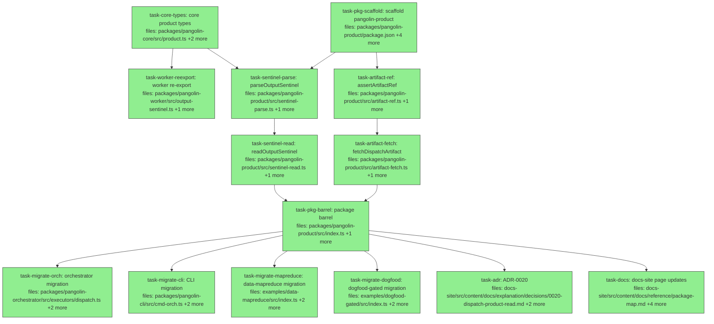

## Context

Driven by `docs/superpowers/specs/2026-07-27-dispatch-product-read-design.md`.

Publishes the read side of the dispatch product. Today four in-repo call sites
hand-roll the same sentinel read (`pangolin-orchestrator/src/executors/dispatch.ts:206-251`,
`pangolin-cli/src/cmd-orch.ts:185-188`, `examples/data-mapreduce/src/index.ts:430-438`,
`examples/dogfood-gated/src/index.ts:165-171`), and out-of-process consumers have
no supported path at all because `writeDispatchRecord` runs inside `reconcile`
(`pangolin-client/src/dispatch.ts:447`), making `dispatch.describe` permanently
unavailable to fire-and-forget callers.

Shape: the wire types move to `pangolin-core`; all I/O lands in a new
`packages/pangolin-product` leaf package depending only on core — following the
`pangolin-verify` precedent, whose own package description states the rule
("Owns the RFC 3161 / ASN.1 (pkijs) dependency so pangolin-core stays
dependency-light"). Core takes no `StorageProvider` today and that stays true.

Conventions every task must follow (verified against the repo, not assumed):

- **Vitest is not configured with globals.** Every test file imports explicitly:
  `import { it, expect } from 'vitest';` (see
  `packages/pangolin-core/test/audit-canon-authorization.test.ts:1`). The test
  blocks below include that import; do not drop it.
- **Error classes assign `this.name` in the constructor**, matching
  `packages/pangolin-core/src/errors.ts:75` — that file's header documents
  `err.name === '...'` structural matching. The repo targets ES2022, so a class
  field would be define-semantics; use constructor assignment.
- **`toThrow` matches message or class, never properties.** Asserting an error's
  `reason` requires catching the instance (`packages/pangolin-core/test/dispatch-uri.test.ts`
  uses bare `.toThrow()` throughout).
- **Tests import specific modules** (`../src/audit.js`), not the package barrel.
  The one deliberate exception is `task-core-types`, whose assertion *is* that
  the barrel re-export lands.

Two invariants every task must respect:

- **The worker's written bytes must not change.** The sentinel's additive-only
  discipline is load-bearing for sealed-bundle reproducibility.
- **`bundle-fetcher.ts` is not touched.** Its private `fetchVerified` stays; the
  spec rejects merging it (a dual-mode fetcher ships a branch that is silently
  unsafe for consumers reading an unhashed sentinel).

Release is 0.4.0 across the train, with `pangolin-product` published for the
first time at that version. `pnpm-workspace.yaml` globs `packages/*`, so no
workspace file needs editing.

**Merge order.** Branch `docs/adr-0019-target-isolation-boundary` is open off
`main` and touches two files this plan also touches:
`docs-site/.../decisions/index.md` (it appends the 0019 bullet; `task-adr`
appends 0020) and `docs-site/.../reference/pangolin-client-api.md` (it documents
target semantics; `task-docs` adds the `describe` constraint). Both are
append-adjacent edits, so land ADR-0019 first and rebase this branch on it —
otherwise the PR carries two avoidable conflicts. Neither file conflict affects
execution; it only affects the merge.

## Tasks

## Task: core product types

```yaml
id: task-core-types
depends_on: []
files:
  - packages/pangolin-core/src/product.ts
  - packages/pangolin-core/src/index.ts
  - packages/pangolin-core/test/product.test.ts
status: done
commit: 43da668
```

Move the sentinel wire shape into core as types-only. These are contract — the
worker writes the shape, readers read it — and core is the sink every package
already depends on. No `StorageProvider`, no I/O.

## Implementation

```typescript
// packages/pangolin-core/src/product.ts
import type { VerifyOutcome } from './verify.js';
import type { RuntimeUsage } from './runtime-adapter.js';

export interface OutputEntry {
  path: string;
  ref: string;
}

export interface BlockOutcome {
  kind: string;
  ordinal: number;
  status: 'ok' | 'failed';
  exitCode?: number;
  durationMs: number;
  verify?: VerifyOutcome;
  patchRef?: string;
  outputs?: OutputEntry[];
}

export interface OutputSentinel {
  schemaVersion: 1;
  patchRef?: string;
  summary?: string;
  verify?: VerifyOutcome;
  outputs?: OutputEntry[];
  usage?: RuntimeUsage;
  blocks?: BlockOutcome[];
}

/** Maximum output entries captured per run; also the reader's clamp. */
export const MAX_OUTPUT_ENTRIES = 256;
```

```typescript
// packages/pangolin-core/test/product.test.ts
import { it, expect } from 'vitest';
// Imports the BARREL deliberately — the assertion is that the re-export lands.
// Sibling core tests import specific modules (`../src/audit.js`); this one is
// the exception on purpose.
import { MAX_OUTPUT_ENTRIES } from '../src/index.js';

it('exports MAX_OUTPUT_ENTRIES from the barrel at the worker-side value 256', () => {
  expect(MAX_OUTPUT_ENTRIES).toBe(256);
});
```

Add `export * from './product.js';` to `packages/pangolin-core/src/index.ts`,
matching the existing per-file `export *` style at lines 7-31.

## Acceptance criteria

- `packages/pangolin-core/src/product.ts` exports exactly four symbols:
  `OutputEntry`, `BlockOutcome`, `OutputSentinel`, `MAX_OUTPUT_ENTRIES`.
- `MAX_OUTPUT_ENTRIES === 256`, matching the worker's current literal.
- `OutputSentinel` field set and optionality are unchanged from the worker's
  current declaration: `schemaVersion: 1` required; `patchRef`, `summary`,
  `verify`, `outputs`, `usage`, `blocks` all optional.
- `product.ts` imports only from within `packages/pangolin-core/src/` — no
  `StorageProvider`, no `node:` builtins, no external packages.
- `packages/pangolin-core/package.json` still has `"dependencies": {}`.
- `pnpm --filter @quarry-systems/pangolin-core typecheck` passes.

Test file: `packages/pangolin-core/test/product.test.ts`.

## Task: worker re-export of moved types

```yaml
id: task-worker-reexport
depends_on: [task-core-types]
files:
  - packages/pangolin-worker/src/output-sentinel.ts
  - packages/pangolin-worker/test/output-sentinel.test.ts
status: done
commit: f05166a
quality_reviewer_hint: opus
```

Delete the local type declarations and re-export them from core, and consume
core's `MAX_OUTPUT_ENTRIES`. This must be a pure type move — the bytes
`writeSentinel` produces are an input to sealed audit bundles, so any change to
field order or serialization breaks reproducibility of already-sealed evidence.

## Implementation

```typescript
// packages/pangolin-worker/src/output-sentinel.ts — replace local declarations
import { MAX_OUTPUT_ENTRIES } from '@quarry-systems/pangolin-core';
export type {
  OutputEntry,
  BlockOutcome,
  OutputSentinel,
} from '@quarry-systems/pangolin-core';
export { MAX_OUTPUT_ENTRIES } from '@quarry-systems/pangolin-core';

// MAX_OUTPUT_FILE_BYTES stays local — it is a worker write-side cap with no
// reader-side meaning.
export const MAX_OUTPUT_FILE_BYTES = 100 * 1024 * 1024;

// writeSentinel body is UNCHANGED, including the field-assignment order and the
// JSON.stringify call.
```

```typescript
// packages/pangolin-worker/test/output-sentinel.test.ts — add to the existing suite
import { it, expect } from 'vitest';

it('serializes byte-identically after the type move', async () => {
  const sentinel = await writeSentinel({
    workspaceDir, storage, namespace: 'ns', dispatchId: 'd1',
    patchRef: 'pangolin://ns/artifact/d1/sha256:abc',
  });
  const bytes = new TextEncoder().encode(JSON.stringify(sentinel));
  expect(new TextDecoder().decode(bytes)).toBe(
    '{"schemaVersion":1,"patchRef":"pangolin://ns/artifact/d1/sha256:abc"}',
  );
});
```

## Acceptance criteria

- `packages/pangolin-worker/src/output-sentinel.ts` declares no local
  `interface OutputEntry`, `interface BlockOutcome`, or `interface OutputSentinel`
  — each is re-exported from `@quarry-systems/pangolin-core`.
- `MAX_OUTPUT_ENTRIES` is imported from core, not redeclared;
  `MAX_OUTPUT_FILE_BYTES` remains declared locally.
- Existing importers of these types from `pangolin-worker` still compile
  unchanged (the re-export preserves the old import path).
- `writeSentinel`'s body is byte-for-byte unchanged: same conditional-assignment
  order for `patchRef`, `summary`, `verify`, `outputs`, `usage`, `blocks`, and the
  same single `JSON.stringify(sentinel)` call.
- `packages/pangolin-worker/test/output-sentinel.test.ts` and
  `packages/pangolin-worker/test/pipeline-golden.test.ts` pass **without
  modification** to their existing assertions.
- `examples/dogfood-gated/bundle.json` still verifies after the change — run the
  example's verify path and confirm it does not report a tampered chain.
- `packages/pangolin-worker/src/bundle-fetcher.ts` has zero diff.

Test file: `packages/pangolin-worker/test/output-sentinel.test.ts`.

## Task: scaffold pangolin-product package

```yaml
id: task-pkg-scaffold
depends_on: []
files:
  - packages/pangolin-product/package.json
  - packages/pangolin-product/tsconfig.json
  - packages/pangolin-product/README.md
  - packages/pangolin-product/LICENSE
  - packages/pangolin-product/test/package-shape.test.ts
status: done
commit: f5342ad
is_wiring_task: true
```

Create the sixteenth workspace package as a leaf depending only on
`pangolin-core`. `packages/pangolin-verify/package.json` is the field-for-field
template. No `src/` in this task — the modules land in their own tasks so they
can be built in parallel.

```json
{
  "name": "@quarry-systems/pangolin-product",
  "version": "0.4.0",
  "license": "BUSL-1.1",
  "description": "Consumer-side read of a dispatch's product — the output sentinel and its content-addressed artifacts. Depends only on pangolin-core.",
  "main": "dist/index.js",
  "types": "dist/index.d.ts",
  "type": "module",
  "publishConfig": { "access": "public" },
  "files": ["dist", "README.md", "LICENSE"],
  "repository": {
    "type": "git",
    "url": "git+https://github.com/QuarrySystems/pangolin.git",
    "directory": "packages/pangolin-product"
  },
  "homepage": "https://quarrysystems.github.io/pangolin",
  "bugs": { "url": "https://github.com/QuarrySystems/pangolin/issues" },
  "scripts": {
    "lint": "eslint src --ext .ts",
    "test": "vitest run",
    "typecheck": "tsc --noEmit",
    "build": "tsc",
    "clean": "rm -rf dist"
  },
  "dependencies": {
    "@quarry-systems/pangolin-core": "workspace:*"
  }
}
```

## Acceptance criteria

- `packages/pangolin-product/package.json` declares exactly one dependency,
  `@quarry-systems/pangolin-core`, and no devDependencies beyond what siblings
  carry.
- Version is `0.4.0`, matching the release train — not `0.1.0`.
- All five standard scripts present: `lint`, `test`, `typecheck`, `build`,
  `clean`. No `bin` field.
- `tsconfig.json` extends `../../tsconfig.base.json` with
  `outDir: "dist"`, `rootDir: "src"`, `include: ["src/**/*"]`, matching
  `packages/pangolin-verify/tsconfig.json`.
- `LICENSE` is BUSL-1.1, byte-identical to `packages/pangolin-verify/LICENSE`.
- `pnpm install` completes with no workspace-dependency cycle warning.
- `node scripts/check-dep-allowlist.mjs` passes with the new package present.

Test file: `packages/pangolin-product/test/package-shape.test.ts`.

## Task: parseOutputSentinel pure validator

```yaml
id: task-sentinel-parse
depends_on: [task-core-types, task-pkg-scaffold]
files:
  - packages/pangolin-product/src/sentinel-parse.ts
  - packages/pangolin-product/test/sentinel-parse.test.ts
status: done
commit: 82df84e
```

Pure validation and defensive reconstruction of sentinel bytes, lifted from the
orchestrator's private `readSentinel` (`executors/dispatch.ts:225-250`). Kept
free of I/O so the whole hostile-input matrix tests with byte literals.

## Implementation

```typescript
// packages/pangolin-product/src/sentinel-parse.ts
import { MAX_OUTPUT_ENTRIES } from '@quarry-systems/pangolin-core';
import type { OutputSentinel, OutputEntry } from '@quarry-systems/pangolin-core';

export type SentinelMalformedReason = 'not-json' | 'not-an-object' | 'bad-schema-version';

export type SentinelReadResult =
  | { status: 'ok'; sentinel: OutputSentinel }
  | { status: 'absent' }
  | { status: 'malformed'; reason: SentinelMalformedReason };

const MAX_REPORT_CHARS = 16_000;

export function parseOutputSentinel(bytes: Uint8Array): SentinelReadResult {
  let raw: unknown;
  try {
    raw = JSON.parse(new TextDecoder().decode(bytes));
  } catch {
    return { status: 'malformed', reason: 'not-json' };
  }
  if (raw === null || typeof raw !== 'object' || Array.isArray(raw)) {
    return { status: 'malformed', reason: 'not-an-object' };
  }
  const src = raw as Record<string, unknown>;
  if (src.schemaVersion !== 1) return { status: 'malformed', reason: 'bad-schema-version' };

  // Reconstruct field by field — never forward the parsed object.
  const sentinel: OutputSentinel = { schemaVersion: 1 };
  if (typeof src.patchRef === 'string') sentinel.patchRef = src.patchRef;
  if (typeof src.summary === 'string') sentinel.summary = src.summary;

  const v = src.verify as Record<string, unknown> | undefined;
  if (v && typeof v.passed === 'boolean') {
    const verify: NonNullable<OutputSentinel['verify']> = { passed: v.passed };
    if (typeof v.report === 'string') verify.report = v.report.slice(0, MAX_REPORT_CHARS);
    if (typeof v.durationMs === 'number' && Number.isFinite(v.durationMs)) {
      verify.durationMs = v.durationMs;
    }
    sentinel.verify = verify;
  }

  if (Array.isArray(src.outputs)) {
    const outputs: OutputEntry[] = [];
    for (const e of src.outputs.slice(0, MAX_OUTPUT_ENTRIES)) {
      if (e && typeof e === 'object'
          && typeof (e as OutputEntry).path === 'string'
          && typeof (e as OutputEntry).ref === 'string') {
        outputs.push({ path: (e as OutputEntry).path, ref: (e as OutputEntry).ref });
      }
    }
    if (outputs.length > 0) sentinel.outputs = outputs;
  }
  // usage and blocks reconstructed by the same type-guarded pattern.
  return { status: 'ok', sentinel };
}
```

```typescript
// packages/pangolin-product/test/sentinel-parse.test.ts
import { it, expect } from 'vitest';
import { parseOutputSentinel } from '../src/sentinel-parse.js';

const enc = (o: unknown) => new TextEncoder().encode(JSON.stringify(o));

it('drops a verify block whose passed field is not a boolean', () => {
  const res = parseOutputSentinel(enc({ schemaVersion: 1, verify: { passed: 'yes' } }));
  expect(res).toEqual({ status: 'ok', sentinel: { schemaVersion: 1 } });
});
```

## Acceptance criteria

- Returns `{status:'malformed', reason:'not-json'}` for non-JSON bytes.
- Returns `{status:'malformed', reason:'not-an-object'}` for valid JSON that is
  an array, a string, or a number.
- Returns `{status:'malformed', reason:'bad-schema-version'}` when
  `schemaVersion` is absent or not the literal `1`.
- A bare `{"schemaVersion":1}` returns `status:'ok'` with every optional field
  `undefined` — nothing optional is required.
- Unknown future fields are ignored, not rejected: `{"schemaVersion":1,"futureThing":42}`
  returns `status:'ok'`.
- `verify.report` longer than 16,000 characters is truncated to exactly 16,000.
- An `outputs` array of 300 well-formed entries yields exactly 256 (the
  `MAX_OUTPUT_ENTRIES` clamp).
- Entries in `outputs` missing a string `path` or string `ref` are dropped, not
  propagated.
- The returned object is a fresh construction: mutating the source object after
  the call does not change the returned sentinel.
- `malformed` results carry only the reason enum — no field named `detail`, and
  no substring of the input bytes appears in the result.

Test file: `packages/pangolin-product/test/sentinel-parse.test.ts`.

## Task: assertArtifactRef pure guard

```yaml
id: task-artifact-ref
depends_on: [task-pkg-scaffold]
files:
  - packages/pangolin-product/src/artifact-ref.ts
  - packages/pangolin-product/test/artifact-ref.test.ts
status: done
commit: 8a1c2a9
quality_reviewer_hint: opus
```

The security boundary of this package. A product ref is named by the sentinel,
which is an unhashed overwrite-put, so following one unguarded lets an attacker
aim the caller's credential at another dispatch's or namespace's bytes. Pure and
separately exported so consumers can validate without fetching.

## Implementation

```typescript
// packages/pangolin-product/src/artifact-ref.ts
import { parsePangolinUri, parseStorageUri } from '@quarry-systems/pangolin-core';

export type ArtifactRefRejection =
  | 'malformed-uri'
  | 'not-a-blob'
  | 'wrong-namespace'
  | 'wrong-dispatch'
  | 'unpinned';

export class ArtifactRefRejectedError extends Error {
  constructor(
    readonly reason: ArtifactRefRejection,
    readonly ref: string,
  ) {
    super(`artifact ref rejected (${reason}): ${ref}`);
    // Assign in the constructor, matching pangolin-core/src/errors.ts:75 — that
    // file's header documents `err.name === '...'` structural matching, and the
    // repo targets ES2022 (class fields would be define-semantics own props).
    this.name = 'ArtifactRefRejectedError';
  }
}

export function assertArtifactRef(
  ref: string,
  expect: { namespace: string; dispatchId: string },
): { contentHash: string } {
  // parseStorageUri FIRST: it RETURNS kind 'dispatch-record' for a dispatches/
  // URI (uri.ts:152-157) whereas parsePangolinUri THROWS a bare Error on that
  // reserved type — so this ordering buys a typed rejection.
  let kind: string;
  try {
    kind = parseStorageUri(ref).kind;
  } catch {
    // Not a well-formed pangolin URI at all — distinct from a well-formed
    // non-blob, so it gets its own reason rather than being mislabelled.
    throw new ArtifactRefRejectedError('malformed-uri', ref);
  }
  if (kind !== 'blob') throw new ArtifactRefRejectedError('not-a-blob', ref);

  const parts = parsePangolinUri(ref);
  if (parts.namespace !== expect.namespace) {
    throw new ArtifactRefRejectedError('wrong-namespace', ref);
  }
  if (parts.name !== expect.dispatchId) {
    throw new ArtifactRefRejectedError('wrong-dispatch', ref);
  }
  if (parts.contentHash === undefined) {
    throw new ArtifactRefRejectedError('unpinned', ref);
  }
  return { contentHash: parts.contentHash };
}
```

```typescript
// packages/pangolin-product/test/artifact-ref.test.ts
import { it, expect } from 'vitest';
import { assertArtifactRef, ArtifactRefRejectedError } from '../src/artifact-ref.js';

it('rejects a ref for the same dispatchId under a different namespace', () => {
  // Capture and inspect — `toThrow` matches message/class, not properties, so
  // asserting `reason` requires the caught instance.
  let caught: unknown;
  try {
    assertArtifactRef('pangolin://other-ns/artifact/d1/sha256:abc', {
      namespace: 'ns', dispatchId: 'd1',
    });
  } catch (e) { caught = e; }
  expect(caught).toBeInstanceOf(ArtifactRefRejectedError);
  expect((caught as ArtifactRefRejectedError).reason).toBe('wrong-namespace');
});
```

## Acceptance criteria

- Accepts `pangolin://ns/artifact/d1/sha256:abc` for `{namespace:'ns', dispatchId:'d1'}`
  and returns `{ contentHash: 'sha256:abc' }`.
- Rejects `pangolin://ns/dispatches/d1/record.json` with reason `'not-a-blob'`.
- Rejects a string that is not a well-formed pangolin URI (e.g. `"http://x"` or
  `"pangolin://ns"`) with reason `'malformed-uri'` — distinct from `'not-a-blob'`,
  so a garbage input is not mislabelled as a well-formed non-blob.
- Rejects `pangolin://other-ns/artifact/d1/sha256:abc` with reason
  `'wrong-namespace'` — a matching dispatchId under a foreign namespace must not
  pass.
- Rejects `pangolin://ns/artifact/other-id/sha256:abc` with reason
  `'wrong-dispatch'`.
- Rejects `pangolin://ns/artifact/d1` (no content hash) with reason `'unpinned'`.
- Every rejection throws `ArtifactRefRejectedError` with `name ===
  'ArtifactRefRejectedError'` and the offending `ref` on the instance — tests
  assert the `reason` value, not merely that it throws.
- The function performs no I/O: it imports no storage type and takes no provider.

Test file: `packages/pangolin-product/test/artifact-ref.test.ts`.

## Task: readOutputSentinel storage read

```yaml
id: task-sentinel-read
depends_on: [task-sentinel-parse]
files:
  - packages/pangolin-product/src/sentinel-read.ts
  - packages/pangolin-product/test/sentinel-read.test.ts
status: done
commit: 5c34370
```

The I/O wrapper: build the dispatch-record URI, fetch, delegate to the pure
parser. Missing objects become `absent` rather than throwing, because a finished
dispatch with no sentinel is a normal outcome — `writeSentinel` is best-effort
and the entrypoint emits `dispatch.finished` regardless.

## Implementation

```typescript
// packages/pangolin-product/src/sentinel-read.ts
import { buildDispatchRecordUri } from '@quarry-systems/pangolin-core';
import type { StorageProvider } from '@quarry-systems/pangolin-core';
import { parseOutputSentinel, type SentinelReadResult } from './sentinel-parse.js';

export async function readOutputSentinel(
  deps: { storage: StorageProvider; namespace: string },
  dispatchId: string,
): Promise<SentinelReadResult> {
  const uri = buildDispatchRecordUri(deps.namespace, dispatchId, 'output.json');
  let bytes: Uint8Array;
  try {
    bytes = await deps.storage.get(uri);
  } catch (err) {
    if (isNotFound(err)) return { status: 'absent' };
    throw err; // unrelated storage errors propagate
  }
  return parseOutputSentinel(bytes);
}

// Duplicated from pangolin-client/src/retention.ts:90-97 by design — see spec
// §4.2/§9.3. The real defect is that StorageProvider has no typed not-found.
function isNotFound(err: unknown): boolean {
  if (err === null || typeof err !== 'object') return false;
  if ((err as { code?: unknown }).code === 'ENOENT') return true;
  const message = (err as { message?: unknown }).message;
  return typeof message === 'string' && /not found/i.test(message);
}
```

```typescript
// packages/pangolin-product/test/sentinel-read.test.ts
import { it, expect } from 'vitest';
import { readOutputSentinel } from '../src/sentinel-read.js';

it('propagates a non-not-found storage error instead of reporting absent', async () => {
  const storage = { get: async () => { throw new Error('connection reset'); } };
  await expect(
    readOutputSentinel({ storage: storage as never, namespace: 'ns' }, 'd1'),
  ).rejects.toThrow('connection reset');
});
```

## Acceptance criteria

- Reads from `pangolin://<namespace>/dispatches/<dispatchId>/output.json`,
  constructed via `buildDispatchRecordUri` — not string concatenation.
- Returns `{status:'absent'}` when the provider throws `ENOENT` or an error whose
  message matches `/not found/i`.
- A storage error that is neither (e.g. `new Error('connection reset')`)
  propagates to the caller and is NOT reported as `absent`.
- On success, returns exactly what `parseOutputSentinel` returned for those bytes
  — the read layer adds no validation of its own.
- `deps` is structural: a `PangolinClient` instance (which exposes readonly
  `storage` and `namespace`) satisfies the parameter without adaptation.
- An empty-string `dispatchId` throws from `buildDispatchRecordUri` rather than
  reading an unintended prefix.

Test file: `packages/pangolin-product/test/sentinel-read.test.ts`.

## Task: fetchDispatchArtifact verified byte read

```yaml
id: task-artifact-fetch
depends_on: [task-artifact-ref]
files:
  - packages/pangolin-product/src/artifact-fetch.ts
  - packages/pangolin-product/test/artifact-fetch.test.ts
status: done
commit: 9fc1fe2
quality_reviewer_hint: opus
```

Fetch one artifact and verify it. The guard runs before any I/O, and the expected
hash comes only from the URI — never from the caller — so a hash pulled from the
same untrusted sentinel cannot be used to authenticate foreign bytes.

## Implementation

```typescript
// packages/pangolin-product/src/artifact-fetch.ts
import { computeContentHash, IntegrityMismatchError } from '@quarry-systems/pangolin-core';
import type { StorageProvider } from '@quarry-systems/pangolin-core';
import { assertArtifactRef } from './artifact-ref.js';

/**
 * Fetch and verify one product artifact.
 *
 * NOTE: `StorageProvider.get` takes no size bound and the interface exposes no
 * size metadata, so an oversized object cannot be pre-checked here. Bound it in
 * your own provider (e.g. HeadObject/Content-Length before GetObject).
 */
export async function fetchDispatchArtifact(
  storage: StorageProvider,
  ref: string,
  expect: { namespace: string; dispatchId: string },
): Promise<Uint8Array> {
  const { contentHash } = assertArtifactRef(ref, expect); // throws BEFORE any I/O
  const bytes = await storage.get(ref);
  const actual = computeContentHash(bytes); // raw bytes, never a parsed object
  if (actual !== contentHash) throw new IntegrityMismatchError(contentHash, actual);
  return bytes;
}
```

```typescript
// packages/pangolin-product/test/artifact-fetch.test.ts
import { it, expect } from 'vitest';
import { fetchDispatchArtifact } from '../src/artifact-fetch.js';

it('never calls storage.get when the ref is rejected', async () => {
  let called = false;
  const storage = { get: async () => { called = true; return new Uint8Array(); } };
  await expect(
    fetchDispatchArtifact(storage as never, 'pangolin://other-ns/artifact/d1/sha256:abc', {
      namespace: 'ns', dispatchId: 'd1',
    }),
  ).rejects.toThrow();
  expect(called).toBe(false);
});
```

## Acceptance criteria

- Returns the fetched bytes when the ref passes `assertArtifactRef` and the
  recomputed hash equals the hash embedded in the ref.
- Throws `IntegrityMismatchError` when the fetched bytes hash to anything other
  than the ref's embedded `contentHash`.
- A rejected ref throws before `storage.get` is invoked — the test asserts the
  provider double was never called, not merely that an error was raised.
- The expected hash is read only from the URI: the signature accepts no
  caller-supplied hash parameter.
- Hashing is over the raw `Uint8Array` returned by `storage.get` — the bytes are
  never `JSON.parse`d before hashing.
- The exported function's docstring states the unbounded-read limitation and
  names the caller-side mitigation.
- Only one ref is fetched per call; no batch or fan-out helper is exported.

Test file: `packages/pangolin-product/test/artifact-fetch.test.ts`.

## Task: pangolin-product public barrel

```yaml
id: task-pkg-barrel
depends_on: [task-sentinel-read, task-artifact-fetch]
files:
  - packages/pangolin-product/src/index.ts
  - packages/pangolin-product/test/barrel.test.ts
status: done
commit: fab7c6e
is_wiring_task: true
```

Single public entry point for the package, matching core's barrel convention
("Every other Pangolin Scale package imports from this barrel, never from
individual sub-files").

```typescript
// packages/pangolin-product/src/index.ts
export { parseOutputSentinel } from './sentinel-parse.js';
export type { SentinelReadResult, SentinelMalformedReason } from './sentinel-parse.js';
export { readOutputSentinel } from './sentinel-read.js';
export { assertArtifactRef, ArtifactRefRejectedError } from './artifact-ref.js';
export type { ArtifactRefRejection } from './artifact-ref.js';
export { fetchDispatchArtifact } from './artifact-fetch.js';
```

## Acceptance criteria

- The barrel exports exactly five values — `parseOutputSentinel`,
  `readOutputSentinel`, `assertArtifactRef`, `ArtifactRefRejectedError`,
  `fetchDispatchArtifact` — plus three types: `SentinelReadResult`,
  `SentinelMalformedReason`, `ArtifactRefRejection`.
- No sub-module is reachable to consumers except through this barrel.
- `pnpm --filter @quarry-systems/pangolin-product build` emits
  `dist/index.js` and `dist/index.d.ts`.
- `pnpm --filter @quarry-systems/pangolin-product test` passes.
- Importing the barrel does not perform I/O or read env vars at module load.

Test file: `packages/pangolin-product/test/barrel.test.ts`.

## Task: migrate orchestrator to published reader

```yaml
id: task-migrate-orch
depends_on: [task-pkg-barrel]
files:
  - packages/pangolin-orchestrator/src/executors/dispatch.ts
  - packages/pangolin-orchestrator/package.json
  - packages/pangolin-orchestrator/test/dispatch-sentinel-read.test.ts
status: done
commit: fe36a68
```

Delete the 46-line private `readSentinel` and delegate. The projection to
`ExecutionResult` stays here — it is orchestrator-specific and does not belong in
the published package.

**Naming trap to verify, not assume:** `reconcile` passes a variable called
`dispatchHash` (`executors/dispatch.ts:177`), but `:162` returns
`{ dispatchHash: flight.dispatchId }` — it *is* the dispatchId under a different
name. No hash-to-id lookup is needed, and none should be added. Confirm this
before wiring, because the published reader keys the storage URI on it.

## Implementation

```typescript
// packages/pangolin-orchestrator/src/executors/dispatch.ts
import { readOutputSentinel } from '@quarry-systems/pangolin-product';

private async readSentinel(dispatchId: string): Promise<{
  patchRef?: string;
  verify?: ExecutionResult['verify'];
  outputRefs?: ExecutionResult['outputRefs'];
}> {
  const res = await readOutputSentinel(
    { storage: this.opts.client.storage, namespace: this.opts.client.namespace },
    dispatchId,
  ).catch(() => ({ status: 'absent' as const }));
  if (res.status !== 'ok') return {};          // absent | malformed -> {}
  const { patchRef, verify, outputs } = res.sentinel;
  const out: { patchRef?: string; verify?: ExecutionResult['verify']; outputRefs?: ExecutionResult['outputRefs'] } = {};
  if (patchRef) out.patchRef = patchRef;
  if (verify) out.verify = verify;
  if (outputs?.length) {
    const outputRefs = Object.create(null) as Record<string, string>;
    for (const e of outputs) outputRefs[e.path] = e.ref;
    out.outputRefs = outputRefs;
  }
  return out;
}
```

```typescript
// packages/pangolin-orchestrator/test/dispatch-sentinel-read.test.ts (new file)
import { it, expect } from 'vitest';

it('returns {} when the sentinel is absent, without throwing', async () => {
  const res = await executor['readSentinel']('missing-dispatch');
  expect(res).toEqual({});
});
```

## Acceptance criteria

- The local defensive-reconstruction block (type guards, 16 KiB report clamp,
  `MAX_SENTINEL_OUTPUTS` loop) is deleted — that clamping now happens inside
  `parseOutputSentinel`.
- The constant `MAX_SENTINEL_OUTPUTS` no longer appears in the orchestrator.
- `readSentinel` still never throws: `absent`, `malformed`, and a rejected
  promise all yield `{}`.
- The `outputs[] → Record<path, ref>` projection still produces a
  null-prototype object.
- The value passed as the reader's `dispatchId` is the same value
  `reconcile` receives — confirmed to be `flight.dispatchId` per `:162` — with no
  new hash-to-id translation introduced.
- `packages/pangolin-orchestrator/package.json` adds
  `"@quarry-systems/pangolin-product": "workspace:*"`.
- The pre-existing orchestrator test suite passes **without edits to existing
  assertions** — this is a behavior-preserving lift, so a required assertion
  change means the lift was wrong.

Test file: `packages/pangolin-orchestrator/test/dispatch-sentinel-read.test.ts`
(new — the existing suite has `dispatch-executor-timeout.test.ts`, not a general
dispatch-executor test file).

## Task: migrate CLI watch evidence read

```yaml
id: task-migrate-cli
depends_on: [task-pkg-barrel]
files:
  - packages/pangolin-cli/src/cmd-orch.ts
  - packages/pangolin-cli/package.json
  - packages/pangolin-cli/test/cmd-orch.test.ts
status: done
commit: e0cd969
```

Replace the hand-built URI plus `JSON.parse` at `cmd-orch.ts:185-188` with the
published reader. The dispatchId still comes from parsing the item's
`manifestRef`, and the surrounding best-effort `catch` stays.

## Implementation

```typescript
// packages/pangolin-cli/src/cmd-orch.ts
import { readOutputSentinel } from '@quarry-systems/pangolin-product';

try {
  const p = parsePangolinUri(s.manifestRef!);
  const res = await readOutputSentinel({ storage: oc.storage!, namespace: p.namespace }, p.name);
  const usage = res.status === 'ok' ? res.sentinel.usage : undefined;
  if (usage !== undefined) evidence.set(s.id, usage);
} catch { /* best-effort — never fail the watch */ }
```

```typescript
// packages/pangolin-cli/test/cmd-orch.test.ts — add to the existing suite
import { it, expect } from 'vitest';

it('records no usage evidence when the sentinel is absent', async () => {
  const evidence = await collectEvidence({ storage: emptyStorage, items: [doneItem] });
  expect(evidence.size).toBe(0);
});
```

## Acceptance criteria

- No `buildDispatchRecordUri(...'output.json')` call and no `JSON.parse` of
  sentinel bytes remain in `cmd-orch.ts`.
- The namespace passed to the reader is `parsePangolinUri(s.manifestRef).namespace`
  and the dispatchId is `.name` — preserving today's derivation.
- `usage` is recorded only when the read returns `status: 'ok'` and
  `sentinel.usage` is defined.
- The enclosing `catch` still swallows all errors so a watch is never failed by
  an unreadable sentinel.
- `packages/pangolin-cli/package.json` adds
  `"@quarry-systems/pangolin-product": "workspace:*"`.

Test file: `packages/pangolin-cli/test/cmd-orch.test.ts`.

## Task: migrate data-mapreduce example

```yaml
id: task-migrate-mapreduce
depends_on: [task-pkg-barrel]
files:
  - examples/data-mapreduce/src/index.ts
  - examples/data-mapreduce/package.json
  - examples/data-mapreduce/test/sentinel-read.test.ts
status: done
commit: 11c7b42
review_mode: merged
```

Replace the hand-built sentinel URI at `src/index.ts:430-438`, including the
explanatory comment that documents the storage layout — the published reader now
carries that knowledge. This example has **no test harness today** (no `test`
script, no `test/` directory), so the task adds the standard `"test": "vitest run"`
script alongside the migration; changing a read path with no way to verify it
would leave the change unverifiable.

## Implementation

```typescript
// examples/data-mapreduce/src/index.ts
import { readOutputSentinel } from '@quarry-systems/pangolin-product';

const res = await readOutputSentinel({ storage, namespace: NAMESPACE }, dispatchId);
const outputs = res.status === 'ok' ? (res.sentinel.outputs ?? []) : [];
```

```typescript
// examples/data-mapreduce/test/sentinel-read.test.ts
import { it, expect } from 'vitest';

it('reads zero outputs when the dispatch wrote no sentinel', async () => {
  const outputs = await collectOutputs(emptyStorage, 'no-such-dispatch');
  expect(outputs).toEqual([]);
});
```

## Acceptance criteria

- No `buildDispatchUri`/`buildDispatchRecordUri` call for `'output.json'` remains
  in the example.
- The stale comment block describing the `pangolin://<namespace>/dispatches/<dispatchId>/output.json`
  layout is removed, since the example no longer encodes that knowledge.
- The example's console output for a successful run is unchanged from before the
  migration.
- The example still runs fully offline with no credentials, verified by running
  it end to end — not by the unit test alone.
- `examples/data-mapreduce/package.json` adds
  `"@quarry-systems/pangolin-product": "workspace:*"` and a
  `"test": "vitest run"` script, so `pnpm -r test` covers it.

Test file: `examples/data-mapreduce/test/sentinel-read.test.ts`.

## Task: migrate dogfood-gated example

```yaml
id: task-migrate-dogfood
depends_on: [task-pkg-barrel]
files:
  - examples/dogfood-gated/src/index.ts
  - examples/dogfood-gated/package.json
  - examples/dogfood-gated/test/usage-read.test.ts
status: done
commit: 2b6f7a9
review_mode: merged
```

Replace the hand-built usage read at `src/index.ts:165-171`. This example carries
a committed sealed `bundle.json`, so the migration must not disturb it. Like the
map-reduce example it has no `test` script or `test/` directory today; the task
adds the standard `"test": "vitest run"` script so the change is verifiable.

## Implementation

```typescript
// examples/dogfood-gated/src/index.ts
import { readOutputSentinel } from '@quarry-systems/pangolin-product';

const res = await readOutputSentinel({ storage, namespace: NAMESPACE }, dispatchId);
const usage = res.status === 'ok' ? res.sentinel.usage : undefined;
// best-effort by contract — any failure renders as "(not captured)"
```

```typescript
// examples/dogfood-gated/test/usage-read.test.ts
import { it, expect } from 'vitest';

it('renders "(not captured)" when the sentinel carries no usage block', async () => {
  expect(renderUsage(undefined)).toBe('(not captured)');
});
```

## Acceptance criteria

- No `buildDispatchRecordUri(...'output.json')` call remains in the example.
- Usage stays best-effort: a missing sentinel or missing `usage` block renders
  the existing "(not captured)" text rather than throwing.
- `examples/dogfood-gated/bundle.json` is **not modified** by this task — `git
  diff --exit-code examples/dogfood-gated/bundle.json` is clean.
- The committed bundle still verifies after the change, confirmed by running the
  example's verify path in `PANGOLIN_FAKE` mode (no Docker, no credits).
- `examples/dogfood-gated/package.json` adds
  `"@quarry-systems/pangolin-product": "workspace:*"` and a
  `"test": "vitest run"` script.

Test file: `examples/dogfood-gated/test/usage-read.test.ts`.

## Task: ADR-0020 for the product-read contract

```yaml
id: task-adr
depends_on: [task-pkg-barrel]
files:
  - docs-site/src/content/docs/explanation/decisions/0020-dispatch-product-read.md
  - docs-site/src/content/docs/explanation/decisions/index.md
  - docs-site/test/decisions-index.test.ts
  - docs-site/vitest.config.ts
status: done
commit: 44bf2ef
is_wiring_task: true
review_mode: merged
```

> **Scope amended mid-flight (controller, after a BLOCKED report).** `docs-site/vitest.config.ts`
> sets `include: ['src/**/*.test.ts']`, which OVERRIDES vitest's defaults rather than
> merging with them — so no file under `docs-site/test/` is ever collected, and an
> explicit path argument is still filtered against the glob. The plan specified
> `docs-site/test/*.test.ts` for both docs tasks without checking this, making those
> tests dead code. This task now owns widening the glob to
> `['src/**/*.test.ts', 'test/**/*.test.ts']`, which also un-deadens
> `task-docs`'s already-committed `test/product-read-docs.test.ts`. Every other
> package in the repo uses `test/`; docs-site was the outlier.

Record the decision now that the surface exists. Marked `is_wiring_task` because
its `files:` span `docs-site/src` and `docs-site/test` (two subsystem prefixes)
and because adding the index row is registration, matching how `task-docs` is
treated — the two documentation tasks should not be classified differently. Note that
`scripts/validate-adrs.mjs` targets a nonexistent `docs/decisions/` directory and
is unwired from CI, so the ADR conventions below are matched by hand against the
existing series, not by a validator.

## Implementation

```markdown
---
title: "ADR-0020: The dispatch product read is a public, storage-keyed contract"
description: "Reading a dispatch's product is keyed on storage plus dispatchId, with no fire-side handle. The sentinel is an unverifiable record; the artifacts it names are self-verifying."
status: accepted
date: 2026-07-27
deciders: pangolin-consumer-roadmap-review
---

## Context
...
## Decision
...
## Consequences
...
```

```markdown
<!-- index.md — the index is a BULLET LIST, not a table. Append after the last
     entry, matching the existing one-line-per-ADR format exactly. -->
- [0020](/pangolin/explanation/decisions/0020-dispatch-product-read/) — Reading a dispatch's product is a public contract keyed on storage + `dispatchId`, with no fire-side handle. The sentinel is an unverifiable overwrite-put record; the artifacts it names are content-addressed and self-verifying.
```

## Acceptance criteria

- Frontmatter carries `title`, `description`, `status: accepted`, `date`, and
  `deciders`, matching the shape of `0019-target-is-an-isolation-boundary.md`.
- Body contains all three headings `## Context`, `## Decision`, `## Consequences`.
- The Decision section states the trust asymmetry explicitly: the sentinel is a
  URI-addressed overwrite-put with no hash to verify against, while `patchRef`
  and `outputs[].ref` are content-addressed and self-verifying.
- Records why the worker's private `fetchVerified` was not merged into the
  published fetcher: a dual-mode fetcher would ship a `{contentHash}` branch that
  is safe only when the hash came from a trusted channel, which a consumer
  reading an unhashed sentinel cannot guarantee.
- Records lockstep pairing as the supported model and names backward-read (new
  reader, old bytes) as the surviving obligation.
- `index.md` links the new ADR as a **bullet-list entry** matching the format of
  the surrounding lines — the index is a list, not a table.
- The number of ADR bullets in `index.md` matches the number of `NNNN-*.md`
  files in the directory.

Test file: `docs-site/test/decisions-index.test.ts`.

## Task: update docs-site product-read pages

```yaml
id: task-docs
depends_on: [task-pkg-barrel]
files:
  - docs-site/src/content/docs/reference/package-map.md
  - docs-site/src/content/docs/reference/dispatch-lifecycle.md
  - docs-site/src/content/docs/reference/pangolin-client-api.md
  - docs-site/src/content/docs/explanation/architecture-overview.md
  - docs-site/test/product-read-docs.test.ts
status: done
commit: d91bb25
is_wiring_task: true
review_mode: merged
```

Document the published read and fix two inaccuracies that predate it. Nothing
here may describe surface that did not land — in particular, do not document a
size-bounded read, because none was built.

## Acceptance criteria

- `package-map.md` says sixteen packages, not fourteen — all three occurrences
  (the frontmatter `description:`, the prose sentence, and the
  `## The fourteen packages` heading) are corrected, and the count matches the
  number of directories under `packages/`.
- `package-map.md` gains a table row for `pangolin-product` describing it as the
  consumer-side product read depending only on `pangolin-core`, plus a node and
  edge in the mermaid dependency graph pointing at core.
- `pangolin-client-api.md` states that `dispatch.describe` observes only
  dispatches reconciled through `client.dispatch(...)` — a `fire`-only dispatch
  never writes a record — and points fire-and-forget consumers at
  `readOutputSentinel`.
- `dispatch-lifecycle.md` documents the public read and states that the sentinel
  is URI-addressed and overwrite-put (so nothing verifies it) while the artifacts
  it names are content-addressed.
- `architecture-overview.md`'s escape step notes that the sentinel is readable
  without reconcile, not only via the executor's `result_ref` path.
- No page documents a `summary` field as populated, since no worker path writes
  one.
- No page documents a size cap, `head()` probe, or batch fetch — none exist.
- `pnpm --filter docs-site build` succeeds and the external-link check passes.

Test file: `docs-site/test/product-read-docs.test.ts`.
