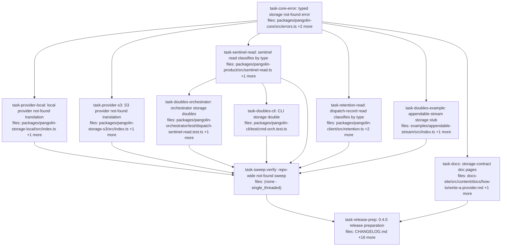

## Context

Drives `docs/superpowers/specs/2026-07-28-storage-not-found-and-bounded-product-reads-design.md`
(**rev 6**). A missing storage object becomes a typed `StorageNotFoundError`
instead of a message every caller sniffs. The sniff today silently breaks the
`absent` contract on S3: `readOutputSentinel` builds a dispatch-record URI, S3's
`getDispatchRecord` has no not-found handling, and the caller's `/not found/i`
test does not match an SDK `NoSuchKey` — so a finished dispatch with no sentinel
**throws** where the contract says it returns `{ status: 'absent' }`.

**Scope is the storage contract and the two read paths that consume it.** There
are no dispatch fire-path changes and no bounded-read work. Nothing here alters
when a dispatch fires, fails, or retries.

Deliberately **not** in this plan, each with a reason in spec §6:

- All three `dispatch.ts` not-found catches (`:520`, `:681`, `:743`). Narrowing
  any of them turns a transient storage blip into a permanent, un-retryable
  failure at the consumer — ai-os records `action.failed` durably
  (`packages/action/src/handle.ts:29-36`) and early-returns on redelivery
  (`:16`). They defer as one unit alongside the dedupe-marker ordering they
  share. Leaving them regresses nothing: they are fail-open today.
- Bounded product reads (`head()`, size ceilings) — spec §6.2.
- The `.catch` at `packages/pangolin-orchestrator/src/executors/dispatch.ts:215`
  stays. It is a documented `NEVER throws` contract, and removing it strands the
  run permanently (spec §3.4).

**Outside this repo, tracked on the ai-os side (spec §5), not tasks here:**
ai-os must land all four `@quarry-systems/*` dependency lines on the 0.4 train,
and whatever `StorageProvider` it injects must throw `StorageNotFoundError` — a
`0.3.x` provider paired with `pangolin-product@0.4.0` gets the deleted sniff and
no typed throw, which is strictly worse than today. Without both, this release
does not reach its only consumer.

**Publish is manual.** `task-release-prep` bumps versions and moves the changelog
section; `pnpm -r publish`, `git tag`, and `gh release create` stay operator steps
per `RELEASING.md` (npm 2FA).

Accepted quality warnings: S2 and S9-5 on `task-release-prep` (17 files, wiring
task at `standard`/`merged` review — the check is a countable bump plus a dry-run
publish, not logic); SRP on `task-retention-read` (bundles the `cancel.ts` comment
correction, justified in that task).

## Tasks

## Task: typed storage not-found error

```yaml
id: task-core-error
depends_on: []
files:
  - packages/pangolin-core/src/errors.ts
  - packages/pangolin-core/src/storage.ts
  - packages/pangolin-core/test/storage-not-found.test.ts
status: pending
```

Adds the typed not-found signal to the contract sink plus the single helper both
readers use, and states the obligation on `StorageProvider.get`. Spec §3.1. This
is the fix `sentinel-read.ts:26-29` asks for — a typed *class* in core, with
*detection* left in each provider.

## Implementation

```typescript
// packages/pangolin-core/src/errors.ts — appended after IntegrityMismatchError (:69)
export class StorageNotFoundError extends Error {
  constructor(
    readonly uri: string,
    message = `storage object not found: ${uri}`,
  ) {
    super(message);
    this.name = 'StorageNotFoundError';
  }
}

/**
 * True when `err` signals a missing storage object.
 *
 * The `name` comparison is the load-bearing leg — per this file's header
 * convention it survives realms and duplicate package copies. `instanceof` is
 * exact-match insurance for a single-copy tree and adds no behaviour the name
 * check does not already cover. Not a type predicate: a name comparison cannot
 * soundly narrow to the class.
 */
export function isStorageNotFound(err: unknown): boolean {
  if (err instanceof StorageNotFoundError) return true;
  return (
    typeof err === 'object' &&
    err !== null &&
    (err as { name?: unknown }).name === 'StorageNotFoundError'
  );
}
```

```typescript
// packages/pangolin-core/test/storage-not-found.test.ts
import { StorageNotFoundError, isStorageNotFound } from '../src/errors.js';

it('lets a provider supply its own message while keeping uri and name', () => {
  const uri = 'pangolin://ns/dispatches/d1/output.json';
  const e = new StorageNotFoundError(uri, `LocalStorageProvider: dispatch record not found for URI: ${uri}`);
  expect(e.message).toMatch(/dispatch record not found/); // storage-local keeps its two messages
  expect(e.uri).toBe(uri);
  expect(e.name).toBe('StorageNotFoundError');
});

it('does not classify unrelated values as not-found', () => {
  expect(isStorageNotFound(new Error('S3 bucket policy denies access'))).toBe(false);
  expect(isStorageNotFound(null)).toBe(false);
  expect(isStorageNotFound('not found')).toBe(false);
});
```

## Acceptance criteria

- `new StorageNotFoundError(uri)` produces `message === 'storage object not found: ' + uri`,
  `name === 'StorageNotFoundError'`, and a readable `uri`.
- A second constructor argument overrides the message while `uri` and `name` are
  unchanged. This is what lets `LocalStorageProvider` keep its two distinct
  messages ("blob not found for URI" / "dispatch record not found for URI")
  rather than collapsing both into one generic string.
- `isStorageNotFound` returns `true` for an instance and for a plain object whose
  `name` is `'StorageNotFoundError'`; `false` for `null`, `undefined`, a string,
  and an unrelated `Error`.
- `StorageProvider.get`'s doc comment in `src/storage.ts` states that a missing
  object MUST throw `StorageNotFoundError`, and that the error's `uri` carries
  the caller-facing `pangolin://` URI rather than a backend key.
- Both symbols are importable from `@quarry-systems/pangolin-core` with no barrel
  edit — `src/index.ts:7` is already `export * from './errors.js'`.
- `resolveLatest`, `list`, and `resolveByHash` are unchanged; they already return
  `null` for absence.

Test file: `packages/pangolin-core/test/storage-not-found.test.ts`.

## Task: local provider not-found translation

```yaml
id: task-provider-local
depends_on: [task-core-error]
files:
  - packages/pangolin-storage-local/src/index.ts
  - packages/pangolin-storage-local/test/not-found.test.ts
status: pending
```

Both `LocalStorageProvider` not-found sites throw the typed error while keeping
their existing messages, so the two tests that assert on message specificity stay
green unmodified. Spec §3.2.

## Implementation

```typescript
// packages/pangolin-storage-local/src/index.ts — getBlob, replacing the generic throw at :286
import { StorageNotFoundError } from '@quarry-systems/pangolin-core';

    } catch (err) {
      if ((err as NodeJS.ErrnoException).code === 'ENOENT') {
        throw new StorageNotFoundError(uri, `LocalStorageProvider: blob not found for URI: ${uri}`);
      }
      throw err;
    }

// getDispatchRecord (:329) takes the identical shape, with its own existing message:
//   `LocalStorageProvider: dispatch record not found for URI: ${uri}`
// Both already have `uri` in scope (getDispatchRecord's signature at :314-317 carries it).
```

```typescript
// packages/pangolin-storage-local/test/not-found.test.ts
it('throws StorageNotFoundError for a missing blob without changing the message', async () => {
  const sp = new LocalStorageProvider({ rootDir });
  const uri = `pangolin://test/capability/ghost/sha256:${'0'.repeat(64)}`;
  await expect(sp.get(uri)).rejects.toMatchObject({ name: 'StorageNotFoundError', uri });
  await expect(sp.get(uri)).rejects.toThrow(/blob not found/i); // keeps smoke.test.ts:58-63 green
});
```

## Acceptance criteria

- A missing blob throws `StorageNotFoundError` whose message still matches
  `/blob not found/i`, so `test/smoke.test.ts:58-63` — named "get() surfaces a
  descriptive error for missing blob (not raw ENOENT)" — passes **unmodified**.
- A missing dispatch record throws `StorageNotFoundError` whose message still
  matches `/not found/i`, so `test/integration.test.ts:315-318` passes
  **unmodified**.
- `.uri` on both is the `pangolin://…` URI passed to `get()`, never a filesystem
  path.
- A non-`ENOENT` `readFile` failure still propagates unchanged rather than being
  converted.
- The path-traversal guard `parseSafe` (`src/index.ts:346`) and the unpinned-URI
  guard (`:272-274`) are untouched.

Test file: `packages/pangolin-storage-local/test/not-found.test.ts`.

## Task: S3 provider not-found translation

```yaml
id: task-provider-s3
depends_on: [task-core-error]
files:
  - packages/pangolin-storage-s3/src/index.ts
  - packages/pangolin-storage-s3/test/not-found.test.ts
status: pending
```

The two S3 read paths gain a not-found catch reusing the provider's existing
type-aware `isNotFound`, and `getDispatchRecord` gains the `uri` it needs to
construct the error. This is the call that fixes the defect in spec §2.

## Implementation

```typescript
// packages/pangolin-storage-s3/src/index.ts
import { StorageNotFoundError } from '@quarry-systems/pangolin-core';

  async get(uri: string): Promise<Uint8Array> {
    const parsed = parseStorageUri(uri);
    if (parsed.kind === 'dispatch-record') {
      return this.getDispatchRecord(parsed, uri);        // NEW: thread uri (was `(parsed)` at :228)
    }
    // …blob branch, inline at :230-243 — wrap the GetObjectCommand send:
    try {
      resp = await this.s3.send(new GetObjectCommand({ Bucket: this.opts.bucket, Key: blobKey }));
    } catch (err) {
      if (isNotFound(err)) throw new StorageNotFoundError(uri); // reuses the helper at :112-121
      throw err;
    }
  }

  private async getDispatchRecord(
    parsed: Extract<StorageUriParts, { kind: 'dispatch-record' }>,
    uri: string,                                          // NEW — only the S3 key was in scope
  ): Promise<Uint8Array> {
    const key = this.dispatchRecordKey(parsed);
    try {
      const resp = await this.s3.send(new GetObjectCommand({ Bucket: this.opts.bucket, Key: key }));
      return await streamToUint8Array(resp.Body);
    } catch (err) {
      if (isNotFound(err)) throw new StorageNotFoundError(uri);
      throw err;
    }
  }
```

```typescript
// packages/pangolin-storage-s3/test/not-found.test.ts
import { NoSuchKey } from '@aws-sdk/client-s3';

it('translates NoSuchKey on a dispatch record into StorageNotFoundError', async () => {
  const err = new NoSuchKey({ $metadata: { httpStatusCode: 404 }, message: 'The specified key does not exist.' });
  const sp = new S3StorageProvider({ ...opts, client: s3ThatThrows(err) });
  const uri = 'pangolin://ns/dispatches/d1/output.json';
  await expect(sp.get(uri)).rejects.toMatchObject({ name: 'StorageNotFoundError', uri });
});
```

## Acceptance criteria

- A `NoSuchKey` on the **dispatch-record** path throws `StorageNotFoundError`.
  Today it propagates the raw SDK error, which is what breaks `readOutputSentinel`'s
  `absent` contract on S3 — this assertion fails before the fix.
- A `NoSuchKey` on the **blob** path likewise throws `StorageNotFoundError`.
- `.uri` is the `pangolin://…` URI, **not** the S3 key. Asserted explicitly:
  `getDispatchRecord` previously had only `dispatchRecordKey(parsed)` in scope,
  so without the threaded argument the two providers would populate the same
  field with different URI spaces.
- The test fixture is a real `NoSuchKey` instance, so `isNotFound`'s
  `err instanceof NoSuchKey` leg (`src/index.ts:113`) is exercised rather than
  the `name` fallback. A hand-rolled `{ name: 'NoSuchKey' }` object would assert
  the mock rather than the SDK.
- Detection stays private to the provider: no new not-found helper is added, the
  existing `isNotFound` at `src/index.ts:112-121` is reused, and
  `src/aws-s3-mailbox-client.ts:18` is left alone rather than becoming a fourth
  variant.
- A non-404 SDK error (e.g. a 403 `AccessDenied`) still propagates unchanged.
- The LocalStack-gated `test/integration.test.ts` is not modified.

Test file: `packages/pangolin-storage-s3/test/not-found.test.ts`.

## Task: sentinel read classifies by type

```yaml
id: task-sentinel-read
depends_on: [task-core-error]
files:
  - packages/pangolin-product/src/sentinel-read.ts
  - packages/pangolin-product/test/sentinel-read.test.ts
status: pending
```

Replaces the message sniff with `isStorageNotFound` and deletes the local
heuristic. Spec §3.3. The inverted test is the point of the change: an error
whose message merely contains "not found" must stop being recorded as "this
dispatch produced nothing."

## Implementation

```typescript
// packages/pangolin-product/src/sentinel-read.ts
import { buildDispatchRecordUri, isStorageNotFound } from '@quarry-systems/pangolin-core';

  let bytes: Uint8Array;
  try {
    bytes = await deps.storage.get(uri);
  } catch (err) {
    if (isStorageNotFound(err)) return { status: 'absent' };
    throw err; // DNS, throttle, misconfiguration — no longer silently 'absent'
  }
  return parseOutputSentinel(bytes);

// The local isNotFound (:34-39) and its blast-radius comment (:26-33) are deleted.
```

```typescript
// packages/pangolin-product/test/sentinel-read.test.ts — replaces the assertion at :40
it('does NOT treat a generic /not found/i message as absent', async () => {
  const storage = { async get() { throw new Error('DNS lookup failed: host not found'); } };
  await expect(
    readOutputSentinel({ storage: storage as never, namespace: 'ns' }, 'd1'),
  ).rejects.toThrow(/DNS lookup failed/); // today this resolves to { status: 'absent' }
});
```

## Acceptance criteria

- A provider throwing `StorageNotFoundError` yields `{ status: 'absent' }`.
- A provider throwing a generic `Error` whose message contains "not found"
  **propagates**. This inverts the existing test at `test/sentinel-read.test.ts:40`
  ("returns absent when the provider throws an error whose message matches
  `/not found/i`") and fails against today's code.
- The ENOENT-coded double at `test/sentinel-read.test.ts:28` is rewritten to throw
  `StorageNotFoundError`; no test in this file asserts on `err.code`.
- `src/sentinel-read.ts` contains no `/not found/i` regex and no local
  `isNotFound` function.
- `packages/pangolin-product` gains **no** new dependency. The doubles throw
  `StorageNotFoundError` directly and no storage provider is imported, preserving
  the package's declared "Depends only on pangolin-core" identity
  (`package.json:5`, `:34-37`). Provider translation is covered by
  `task-provider-local` / `task-provider-s3`; neither half is sufficient alone
  and the split is deliberate.

Test file: `packages/pangolin-product/test/sentinel-read.test.ts`.

## Task: dispatch-record read classifies by type

```yaml
id: task-retention-read
depends_on: [task-core-error]
files:
  - packages/pangolin-client/src/retention.ts
  - packages/pangolin-client/src/cancel.ts
  - packages/pangolin-client/test/retention.test.ts
status: pending
```

The same substitution for `readDispatchRecord`, plus a comment-only correction to
`cancelDispatch`. The two are bundled because they are one concern — the accuracy
of this client's not-found story — and because `cancel.ts`'s comment describes the
very function being changed. It is already false today: it claims failures of any
participant collapse to a no-op, while `retention.ts:86` rethrows.

## Implementation

```typescript
// packages/pangolin-client/src/retention.ts
import { isStorageNotFound } from '@quarry-systems/pangolin-core';

  } catch (err) {
    if (isStorageNotFound(err)) return null;
    throw err;
  }
// The local isNotFound (:90-97) is deleted.

// packages/pangolin-client/src/cancel.ts:17-21 — COMMENT ONLY, no code change:
// -  * unconditionally; failures of any participant (storage, credentials,
// -  * provider) collapse to a silent no-op per §7.6's idempotency contract.
// +  * unconditionally when the dispatch record is missing or purged. Other
// +  * backend errors propagate — `readDispatchRecord` rethrows anything that is
// +  * not a StorageNotFoundError, and this function does not catch.
```

```typescript
// packages/pangolin-client/test/retention.test.ts
it('rethrows a generic /not found/i message instead of reporting the record missing', async () => {
  const client = makeClient(storageThatThrows(new Error('endpoint not found (DNS)')));
  await expect(readDispatchRecord(client, 'd1')).rejects.toThrow(/endpoint not found/);
});
```

## Acceptance criteria

- `StorageNotFoundError` yields `null`; a generic error whose message contains
  "not found" now propagates instead of being reported as a missing record.
- `src/retention.ts` contains no `/not found/i` regex and no
  `err.code === 'ENOENT'` check; the local `isNotFound` at `:90-97` is gone.
- The ENOENT double at `test/retention.test.ts:174` and the memory-storage double
  at `:8,24` throw `StorageNotFoundError`.
- `src/describe.ts` is **not** modified, and `test/describe.test.ts:160-180` —
  which asserts an `'S3 bucket policy denies access'` error propagates and is not
  a `DispatchRecordExpiredError` — passes unchanged. `describe.ts:33-35` has
  always documented "Unrelated storage errors are re-thrown unchanged", so this
  is not a behaviour change and must not be reported as one.
- `cancelDispatch`'s **code** is unchanged — no wrap is added. Wrapping the call
  would swallow the `JSON.parse` at `retention.ts:83` too, turning a corrupt
  `record.json` into a silent no-op.
- `src/cancel.ts:17-21`'s comment states that a missing or purged record is a
  no-op while other backend errors propagate.

Test file: `packages/pangolin-client/test/retention.test.ts`.

## Task: orchestrator storage doubles

```yaml
id: task-doubles-orchestrator
depends_on: [task-sentinel-read]
files:
  - packages/pangolin-orchestrator/test/dispatch-sentinel-read.test.ts
  - packages/pangolin-orchestrator/test/executors/dispatch.test.ts
status: pending
```

Two doubles signal absence by message. After `task-sentinel-read` lands they would
exercise the `.catch` swallow at `src/executors/dispatch.ts:215` instead of the
real `absent` branch — the suite stays green while silently testing something
else. Spec §3.5.

## Implementation

```typescript
// packages/pangolin-orchestrator/test/dispatch-sentinel-read.test.ts:82-86
import { StorageNotFoundError } from '@quarry-systems/pangolin-core';

    async get(uri: string) {
      const v = blobs.get(uri);
      if (!v) throw new StorageNotFoundError(uri);
      return v;
    },

// The header comment at :28-30 — "`get` on a missing key throws a 'not found'
// message, matching pangolin-product's isNotFound sniff" — is rewritten; it
// otherwise describes deleted code.
// test/executors/dispatch.test.ts:72 takes the identical change, same double shape.
```

```typescript
it('signals absence by type, so the real absent branch is still exercised', async () => {
  const storage = makeMemoryStorage(); // now throws StorageNotFoundError
  await expect(
    readOutputSentinel({ storage, namespace: 'ns' }, 'missing'),
  ).resolves.toEqual({ status: 'absent' }); // not the .catch at executors/dispatch.ts:215
});
```

## Acceptance criteria

- Both doubles — `test/dispatch-sentinel-read.test.ts:84` and
  `test/executors/dispatch.test.ts:72` — throw `StorageNotFoundError` instead of
  an `Error` carrying a `/not found/i` message.
- The header comment at `test/dispatch-sentinel-read.test.ts:28-30` no longer
  refers to `pangolin-product`'s deleted sniff.
- `test/dispatch-sentinel-read.test.ts:235` ("reconcile yields no
  patchRef/verify/outputRefs when the sentinel is absent") still reaches
  `readOutputSentinel`'s `absent` return, asserted directly by that call
  resolving to `{ status: 'absent' }`. Without this the test silently becomes a
  duplicate of `:268` ("reconcile never throws even when storage.get rejects with
  an unrelated error").
- `test/executors/dispatch.test.ts:725` likewise still exercises the real absent
  path rather than the swallow.
- `src/executors/dispatch.ts` is **not** modified — the `.catch` at `:215` is a
  documented `NEVER throws` contract and removing it strands the item.

Test file: `packages/pangolin-orchestrator/test/dispatch-sentinel-read.test.ts`.

## Task: CLI storage double

```yaml
id: task-doubles-cli
depends_on: [task-sentinel-read]
files:
  - packages/pangolin-cli/test/cmd-orch.test.ts
status: pending
```

The CLI's `OrchContext.storage` double signals absence by message, so the same
silent coverage loss applies — and here it hides behind the bare `catch {}` at
`src/cmd-orch.ts:240`, which would absorb the resulting throw without any visible
failure. Spec §3.5.

## Implementation

```typescript
// packages/pangolin-cli/test/cmd-orch.test.ts:561-565
import { StorageNotFoundError } from '@quarry-systems/pangolin-core';

      const storage = {
        async get(ref: string): Promise<Uint8Array> {
          throw new StorageNotFoundError(ref);
        },
      };
```

```typescript
it('reports no usage evidence via the absent branch, not via the bare catch', async () => {
  const res = await readOutputSentinel({ storage: storage as never, namespace: 'ns' }, 'd1');
  expect(res).toEqual({ status: 'absent' });
});
```

## Acceptance criteria

- The double at `test/cmd-orch.test.ts:561-565` throws `StorageNotFoundError`
  rather than `new Error('not found')`.
- The absence path is asserted on `readOutputSentinel` resolving to
  `{ status: 'absent' }`, so the assertion cannot pass merely because
  `src/cmd-orch.ts:240`'s bare `catch {}` swallowed a throw.
- `src/cmd-orch.ts` is **not** modified. `OrchContext.storage` keeps its minimal
  `{ get(ref): Promise<Uint8Array> }` shape at `:38` and the narrowing cast at
  `:235` stays — widening that published config surface belongs to the deferred
  bounded-read work, not here.
- No manifest change: `packages/pangolin-cli` already declares
  `@quarry-systems/pangolin-core`.

Test file: `packages/pangolin-cli/test/cmd-orch.test.ts`.

## Task: appendable-stream storage stub

```yaml
id: task-doubles-example
depends_on: [task-core-error]
files:
  - examples/appendable-stream/src/index.ts
  - examples/appendable-stream/package.json
status: pending
```

A **src-tree** stub whose entire contract is the message being deleted. It is
behaviourally inert today — its consumer `assembleBundle` absorbs any throw at
`packages/pangolin-orchestrator/src/audit/bundle.ts:41-47` — but it must move, and
the package needs a `pangolin-core` edge it does not currently declare.

## Implementation

```typescript
// examples/appendable-stream/src/index.ts:237-241
import { StorageNotFoundError } from '@quarry-systems/pangolin-core';

    const emptyStorage = {
      async get(ref: string): Promise<Uint8Array> {
        throw new StorageNotFoundError(ref);
      },
    };
```

```json
// examples/appendable-stream/package.json — the manifest currently declares only
// pangolin-orchestrator, so importing the error class needs a new edge.
"dependencies": {
  "@quarry-systems/pangolin-orchestrator": "workspace:*",
  "@quarry-systems/pangolin-core": "workspace:*"
}
```

## Acceptance criteria

- The stub at `src/index.ts:237-241` throws `StorageNotFoundError(ref)` instead of
  `` new Error(`storage: not found: ${ref}`) ``; the file contains no
  `/not found/` string.
- `package.json` declares `@quarry-systems/pangolin-core": "workspace:*"`
  alongside the existing `pangolin-orchestrator` entry. Without it the import is
  undeclared and the example does not build.
- `examples/appendable-stream/test/appendable-stream.test.ts` passes unchanged —
  the stub feeds `assembleBundle`, which absorbs any throw, so behaviour is
  identical either way.
- The example still builds and typechecks.

Test file: `examples/appendable-stream/test/appendable-stream.test.ts`.

## Task: storage-contract doc pages

```yaml
id: task-docs
depends_on: [task-core-error]
files:
  - docs-site/src/content/docs/how-to/write-a-provider.md
  - docs-site/src/content/docs/reference/dispatch-lifecycle.md
status: pending
model_hint: cheap
review_mode: merged
```

The provider-authoring page reproduces the `StorageProvider` interface literally
and must carry the new obligation — it is the page a future implementor reads.
The lifecycle page's `absent` sentence stays true and gains the contract it now
rests on. Spec §7.

## Implementation

```markdown
<!-- docs-site/src/content/docs/how-to/write-a-provider.md — in the interface section (:126-166) -->
`get(uri)` — return the object's bytes. **If the object does not exist, throw
`StorageNotFoundError` from `@quarry-systems/pangolin-core`.** Its `uri` field
carries the `pangolin://` URI you were handed, not your backend key. Callers
classify absence with `isStorageNotFound`; a provider that throws an untyped
error will have a missing object treated as an infrastructure failure instead.
```

```markdown
<!-- docs-site/src/content/docs/reference/dispatch-lifecycle.md (:200-207) -->
A missing sentinel comes back as `{ status: 'absent' }` rather than throwing.
That rests on the storage contract: `StorageProvider.get` signals a missing
object with `StorageNotFoundError`, and `readOutputSentinel` classifies on that
type rather than on the error message.
```

## Acceptance criteria

- `how-to/write-a-provider.md`'s `StorageProvider` interface section states that
  `get` MUST throw `StorageNotFoundError` for a missing object, and that the
  error's `uri` is the `pangolin://` URI rather than a backend key.
- `reference/dispatch-lifecycle.md` keeps its existing sentence that a missing
  sentinel returns `{ status: 'absent' }` and names the provider contract that
  guarantees it.
- Neither page mentions a `head()` probe or a size-bounded read.
  `docs-site/test/product-read-docs.test.ts:91-108` guards `dispatch-lifecycle.md`
  against `/head\(\)/` and `/size[- ]?(bound|cap|limit)ed? read/i` and must stay
  green — that surface is deferred, so the guard is correct.
- `docs-site/test/product-read-docs.test.ts` is **not** modified, and no new doc
  page is added. (`write-a-provider.md` is not in that guard's file list, so its
  edit is unconstrained.)

Test file: `docs-site/test/product-read-docs.test.ts` (must remain green; not modified).

## Task: repo-wide not-found sweep

```yaml
id: task-sweep-verify
depends_on:
  - task-provider-local
  - task-provider-s3
  - task-sentinel-read
  - task-retention-read
  - task-doubles-orchestrator
  - task-doubles-cli
  - task-doubles-example
files: []
status: pending
single_threaded: true
quality_reviewer_hint: opus
```

The sweep mandated by spec §3.5, run as an explicit step with a pass criterion
rather than a claim. Three prior spec revisions each shipped a list of affected
doubles asserted to be complete and each was missing sites — so this task's job is
to prove closure, and it runs alone so it can safely touch anything it finds.

## Implementation

```bash
# Five trees: the four pnpm-workspace.yaml roots PLUS test/, which sits outside
# every workspace root and has its own runner (vitest.e2e.config.ts).
rg -n --type ts -e 'not found' -e 'ENOENT' -e 'NoSuchKey' \
   packages/ examples/ deploy/ docs-site/ test/
```

```markdown
| file:line | reaches storage.get on a narrowed path? | disposition |
|---|---|---|
| packages/pangolin-storage-s3/src/index.ts:112-121 | no — provider-internal detection | keep |
| test/e2e/inline-secret-lifecycle.test.ts:93 | no — SecretStore, not StorageProvider | keep |
| <every remaining hit> | yes / no | converted / keep + reason |
```

## Acceptance criteria

- The grep is run over all five trees — `packages/`, `examples/`, `deploy/`,
  `docs-site/`, and `test/`. A workspace-scoped sweep would miss the last, which
  holds `test/e2e/` (22 files) and `test/monorepo-bootstrap.test.ts`.
- Every hit is recorded in the disposition table with exactly one of two verdicts:
  "reaches `storage.get` on a narrowed read path" → converted to throw
  `StorageNotFoundError`, or "does not" → left alone with the reason named. A hit
  with no verdict is a failure of this task.
- No file under the five trees still signals a **storage** not-found by message or
  by `err.code === 'ENOENT'`. Non-storage uses are explicitly named as out —
  e.g. the `SecretStore` mock at `test/e2e/inline-secret-lifecycle.test.ts:93`,
  which is a different interface.
- Any site fixed here that no earlier task already covered is listed separately in
  the report, so a gap in the plan is visible rather than silently absorbed.
- `pnpm -r test` is green, and `typecheck:test` passes for the six packages that
  have it (`pangolin-product`, `pangolin-providers-aws-creds`,
  `pangolin-secret-store`, `pangolin-signer-aws-kms`, `pangolin-storage-local`,
  `pangolin-storage-s3`).

Test file: none — verification is the disposition table plus a green `pnpm -r test`.

## Task: 0.4.0 release preparation

```yaml
id: task-release-prep
depends_on: [task-sweep-verify, task-docs]
files:
  - CHANGELOG.md
  - packages/pangolin-cli/package.json
  - packages/pangolin-client/package.json
  - packages/pangolin-core/package.json
  - packages/pangolin-mcp/package.json
  - packages/pangolin-orchestrator/package.json
  - packages/pangolin-product/package.json
  - packages/pangolin-providers-aws-creds/package.json
  - packages/pangolin-providers-fargate/package.json
  - packages/pangolin-providers-local-docker/package.json
  - packages/pangolin-runtime-claude-code/package.json
  - packages/pangolin-secret-store/package.json
  - packages/pangolin-signer-aws-kms/package.json
  - packages/pangolin-storage-local/package.json
  - packages/pangolin-storage-s3/package.json
  - packages/pangolin-verify/package.json
  - packages/pangolin-worker/package.json
status: pending
is_wiring_task: true
model_hint: cheap
review_mode: merged
```

Lockstep version bump plus the changelog entry. `files:` spans every package by
design — a lockstep release is repo-wide assembly with no novel implementation,
which is why `is_wiring_task` is set. Publish, tag, and GitHub release remain
manual operator steps per `RELEASING.md` (the npm account enforces 2FA on writes).

## Acceptance criteria

- All 16 `packages/*/package.json` read `"version": "0.4.0"`. Fifteen move from
  `0.3.1`; `pangolin-product` already reads `0.4.0` and is left unchanged. No
  package is `"private": true`, so all 16 publish.
- `CHANGELOG.md`'s `[Unreleased]` section becomes `## [0.4.0] - 2026-07-28`,
  retaining the six already-merged entries (#97, #98, #100, #102, #104, #105) and
  adding this change, with link references updated at the bottom.
- The **Breaking** heading names exactly one item: `StorageProvider.get` must now
  throw `StorageNotFoundError` for a missing object. `describeDispatch` and
  `cancelDispatch` are **not** listed as breaking — `describe.ts:33-35` has always
  documented the rethrow.
- A **Fixed** entry records the provider-dependent `absent` path: a missing
  sentinel returned `absent` on the local provider but threw on S3.
- `pnpm -r run build` succeeds and `pnpm -r publish --dry-run --no-git-checks`
  reports every tarball containing only `dist/`, `README.md`, `LICENSE`, and
  `package.json`.
- No `npm publish`, `git tag`, or `gh release create` is executed by this task.

Test file: `test/monorepo-bootstrap.test.ts` (must remain green; it reads the workspace manifests).
