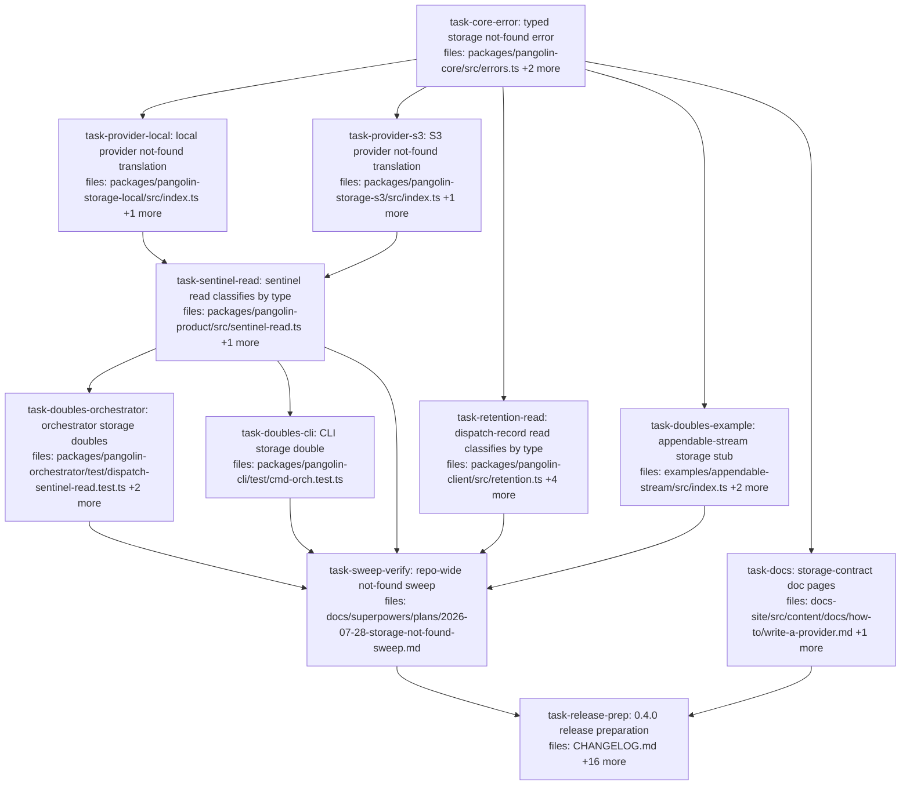

## Context

Drives `docs/superpowers/specs/2026-07-28-storage-not-found-and-bounded-product-reads-design.md`
(**rev 6**). A missing storage object becomes a typed `StorageNotFoundError`
instead of a message every caller sniffs. The sniff today silently breaks the
`absent` contract on S3: `readOutputSentinel` builds a dispatch-record URI, S3's
`getDispatchRecord` has no not-found handling, and the caller's `/not found/i`
test does not match an SDK `NoSuchKey` — so a finished dispatch with no sentinel
**throws** where the contract says it returns `{ status: 'absent' }`.

**Scope is the storage contract and the two read paths that consume it.** There
are no dispatch fire-path changes and no bounded-read work. Nothing here alters
when a dispatch fires, fails, or retries.

Deliberately **not** in this plan, each with a reason in spec §6:

- All three `dispatch.ts` not-found sites (`:520` `markerPresent`, `:681`
  `readSubagentCapabilities`, `:743` env-bundle). All three are bare
  `catch {}` blocks, not copies of the message heuristic. Narrowing any of them
  turns a transient storage blip into a permanent, un-retryable failure at the
  consumer — ai-os records `action.failed` durably
  (`packages/action/src/handle.ts:29-36`) and early-returns on redelivery
  (`:16`). They defer as one unit alongside the dedupe-marker ordering they
  share. Leaving them regresses nothing: they are fail-open today.
- Bounded product reads (`head()`, size ceilings) — spec §6.2.
- The `.catch` at `packages/pangolin-orchestrator/src/executors/dispatch.ts:215`
  stays. It is a documented `NEVER throws` contract, and removing it strands the
  run permanently (spec §3.4).

**Outside this repo, tracked on the ai-os side (spec §5), not tasks here:**
ai-os must land all four `@quarry-systems/*` dependency lines on the 0.4 train,
and whatever `StorageProvider` it injects must throw `StorageNotFoundError` — a
`0.3.x` provider paired with `pangolin-product@0.4.0` gets the deleted sniff and
no typed throw, which is strictly worse than today.

**Publish is manual.** `task-release-prep` bumps versions and moves the changelog
section; `pnpm -r publish`, `git tag`, and `gh release create` stay operator steps
per `RELEASING.md` (npm 2FA).

### Two mechanics every task depends on

**Cross-package changes are only visible through `dist/`.** `pangolin-core` is
`main: dist/index.js` / `types: dist/index.d.ts`, `dist/` is gitignored
(`.gitignore:5`), `tsconfig.base.json` declares no `paths` and no project
references, and each package's `node_modules/@quarry-systems/*` is a symlink to
the package directory. CI encodes this — `.github/workflows/ci.yml:46,62` runs
`pnpm -r build` before tests, commented at `:59` as needed because vitest
"resolves cross-package imports … via each package's dist entry."

**Plan-wide rule: every task that modifies a package's `src/` runs that
package's build as an acceptance criterion.** Stated as a rule rather than a
per-task consumer list, because that list has been wrong twice — the consumer
is often a *sibling package's test* rather than a downstream task, so it is
invisible in the DAG. `examples/data-mapreduce/test/sentinel-read.test.ts:13`
imports `LocalStorageProvider` from the package (resolving to
`packages/pangolin-storage-local/dist/`) and drives it through
`readOutputSentinel` via `readSentinelBlocks`, which does not catch
(`examples/data-mapreduce/src/index.ts:285`) — so `task-provider-local` needs a
build even though no *task* consumes it.

The trap is that a task's own tests import `../src/…` directly and go green
against a stale `dist`, so the failure surfaces in someone else's suite.

**Stale `dist` also makes `pnpm -r test` an unsound gate on its own.** Any
task-level test command is `pnpm -r build && pnpm -r test`.

**`StorageNotFoundError`'s default message contains the words "not found"**
(`storage object not found: ${uri}`). A test double that throws it with the
default message therefore *also* satisfies the `/not found/i` sniff being
deleted, so an assertion against such a double passes identically before the
change, after it, and if it were reverted. The doubles tasks deliberately give
their errors a message **without** those words, so the test can only pass if
classification is by type.

Accepted quality warnings: S2 and S9-5 on `task-release-prep` (17 files, wiring
task at `standard`/`merged` review — the check is a countable bump plus a dry-run
publish, not logic); SRP on `task-retention-read` (bundles the `cancel.ts` comment
correction, justified in that task).

## Tasks

## Task: typed storage not-found error

```yaml
id: task-core-error
depends_on: []
files:
  - packages/pangolin-core/src/errors.ts
  - packages/pangolin-core/src/storage.ts
  - packages/pangolin-core/test/storage-not-found.test.ts
status: pending
```

Adds the typed not-found signal to the contract sink plus the single helper both
readers use, and states the obligation on `StorageProvider.get`. Spec §3.1. This
is the fix `sentinel-read.ts:26-29` asks for — a typed *class* in core, with
*detection* left in each provider.

## Implementation

```typescript
// packages/pangolin-core/src/errors.ts — appended after IntegrityMismatchError (:69)
export class StorageNotFoundError extends Error {
  constructor(
    readonly uri: string,
    message = `storage object not found: ${uri}`,
  ) {
    super(message);
    this.name = 'StorageNotFoundError';
  }
}

/**
 * True when `err` signals a missing storage object.
 *
 * The `name` comparison is the load-bearing leg — per this file's header
 * convention it survives realms and duplicate package copies. `instanceof` is
 * exact-match insurance for a single-copy tree and adds no behaviour the name
 * check does not already cover. Not a type predicate: a name comparison cannot
 * soundly narrow to the class.
 */
export function isStorageNotFound(err: unknown): boolean {
  if (err instanceof StorageNotFoundError) return true;
  return (
    typeof err === 'object' &&
    err !== null &&
    (err as { name?: unknown }).name === 'StorageNotFoundError'
  );
}
```

```typescript
// packages/pangolin-core/test/storage-not-found.test.ts
import { describe, expect, it } from 'vitest';
import { StorageNotFoundError, isStorageNotFound } from '../src/errors.js';

it('lets a provider supply its own message while keeping uri and name', () => {
  const uri = 'pangolin://ns/dispatches/d1/output.json';
  const e = new StorageNotFoundError(uri, `LocalStorageProvider: dispatch record not found for URI: ${uri}`);
  expect(e.message).toMatch(/dispatch record not found/); // storage-local keeps its two messages
  expect(e.uri).toBe(uri);
  expect(e.name).toBe('StorageNotFoundError');
});

it('does not classify unrelated values as not-found', () => {
  expect(isStorageNotFound(new Error('S3 bucket policy denies access'))).toBe(false);
  expect(isStorageNotFound(null)).toBe(false);
  expect(isStorageNotFound('not found')).toBe(false);
});
```

## Acceptance criteria

- `new StorageNotFoundError(uri)` produces `message === 'storage object not found: ' + uri`,
  `name === 'StorageNotFoundError'`, and a readable `uri`.
- A second constructor argument overrides the message while `uri` and `name` are
  unchanged. This is what lets `LocalStorageProvider` keep its two distinct
  messages ("blob not found for URI" / "dispatch record not found for URI")
  rather than collapsing both into one generic string.
- `isStorageNotFound` returns `true` for an instance and for a plain object whose
  `name` is `'StorageNotFoundError'`; `false` for `null`, `undefined`, a string,
  and an unrelated `Error`.
- `StorageProvider.get`'s doc comment in `src/storage.ts` states that a missing
  object MUST throw `StorageNotFoundError`, and that the error's `uri` carries
  the caller-facing `pangolin://` URI rather than a backend key.
- **`pnpm --filter @quarry-systems/pangolin-core run build` succeeds and the
  emitted `packages/pangolin-core/dist/errors.d.ts` declares both
  `StorageNotFoundError` and `isStorageNotFound`.** Seven tasks import these
  symbols across the package boundary and resolve them through `dist/` (see
  Context); without the build they fail with "has no exported member". No barrel
  edit is needed — `src/index.ts:7` is already `export * from './errors.js'`.
- `resolveLatest`, `list`, and `resolveByHash` are unchanged; they already return
  `null` for absence.

Test file: `packages/pangolin-core/test/storage-not-found.test.ts`.

## Task: local provider not-found translation

```yaml
id: task-provider-local
depends_on: [task-core-error]
files:
  - packages/pangolin-storage-local/src/index.ts
  - packages/pangolin-storage-local/test/not-found.test.ts
status: pending
```

Both `LocalStorageProvider` not-found sites throw the typed error while keeping
their existing messages, so the two tests that assert on message specificity stay
green unmodified. Spec §3.2.

## Implementation

```typescript
// packages/pangolin-storage-local/src/index.ts — getBlob, replacing the generic throw at :286
import { StorageNotFoundError } from '@quarry-systems/pangolin-core';

    } catch (err) {
      if ((err as NodeJS.ErrnoException).code === 'ENOENT') {
        throw new StorageNotFoundError(uri, `LocalStorageProvider: blob not found for URI: ${uri}`);
      }
      throw err;
    }

// getDispatchRecord (:329) takes the identical shape, with its own existing message:
//   `LocalStorageProvider: dispatch record not found for URI: ${uri}`
// Both already have `uri` in scope (getDispatchRecord's signature at :314-317 carries it).
```

```typescript
// packages/pangolin-storage-local/test/not-found.test.ts
import { expect, it } from 'vitest';
import { LocalStorageProvider } from '../src/index.js';

it('throws StorageNotFoundError for a missing blob without changing the message', async () => {
  const sp = new LocalStorageProvider({ rootDir });
  const uri = `pangolin://test/capability/ghost/sha256:${'0'.repeat(64)}`;
  await expect(sp.get(uri)).rejects.toMatchObject({ name: 'StorageNotFoundError', uri });
  await expect(sp.get(uri)).rejects.toThrow(/blob not found/i); // keeps smoke.test.ts:58-63 green
});
```

## Acceptance criteria

- A missing blob throws `StorageNotFoundError` whose message still matches
  `/blob not found/i`, so `test/smoke.test.ts:58-63` — named "get() surfaces a
  descriptive error for missing blob (not raw ENOENT)" — passes **unmodified**.
- A missing dispatch record throws `StorageNotFoundError` whose message still
  matches `/not found/i`, so `test/integration.test.ts:315-318` passes
  **unmodified**.
- `.uri` on both is the `pangolin://…` URI passed to `get()`, never a filesystem
  path.
- A non-`ENOENT` `readFile` failure still propagates unchanged rather than being
  converted.
- The path-traversal guard `parseSafe` (`src/index.ts:346`) and the unpinned-URI
  guard (`:272-274`) are untouched.
- `pnpm --filter @quarry-systems/pangolin-storage-local run typecheck:test`
  passes — this package carries a `tsconfig.test.json` covering `test/**/*` and
  is wired into `.github/workflows/typecheck.yml`, so a new test file that does
  not typecheck fails CI even with a green suite.
- **`pnpm --filter @quarry-systems/pangolin-storage-local run build` succeeds.**
  `examples/data-mapreduce/test/sentinel-read.test.ts:13` imports this provider
  from the package, not from source, and drives it through `readOutputSentinel`
  via `readSentinelBlocks` — which does not catch
  (`examples/data-mapreduce/src/index.ts:285`). Against a stale `dist` the
  provider still throws a plain `Error`, `isStorageNotFound` returns false, and
  that example's test at `:47` goes red even though this task's own suite is
  green.

Test file: `packages/pangolin-storage-local/test/not-found.test.ts`.

## Task: S3 provider not-found translation

```yaml
id: task-provider-s3
depends_on: [task-core-error]
files:
  - packages/pangolin-storage-s3/src/index.ts
  - packages/pangolin-storage-s3/test/not-found.test.ts
status: pending
```

The two S3 read paths gain a not-found catch reusing the provider's existing
type-aware `isNotFound`, and `getDispatchRecord` gains the `uri` it needs to
construct the error. This is the call that fixes the defect in spec §2.

## Implementation

```typescript
// packages/pangolin-storage-s3/src/index.ts
import { StorageNotFoundError } from '@quarry-systems/pangolin-core';

  async get(uri: string): Promise<Uint8Array> {
    const parsed = parseStorageUri(uri);
    if (parsed.kind === 'dispatch-record') {
      return this.getDispatchRecord(parsed, uri);        // NEW: thread uri (was `(parsed)` at :228)
    }
    // …blob branch, inline at :230-243 — wrap the GetObjectCommand send:
    try {
      resp = await this.s3.send(new GetObjectCommand({ Bucket: this.opts.bucket, Key: blobKey }));
    } catch (err) {
      if (isNotFound(err)) throw new StorageNotFoundError(uri); // reuses the helper at :112-121
      throw err;
    }
  }

  private async getDispatchRecord(
    parsed: Extract<StorageUriParts, { kind: 'dispatch-record' }>,
    uri: string,                                          // NEW — only the S3 key was in scope
  ): Promise<Uint8Array> {
    const key = this.dispatchRecordKey(parsed);
    try {
      const resp = await this.s3.send(new GetObjectCommand({ Bucket: this.opts.bucket, Key: key }));
      return await streamToUint8Array(resp.Body);
    } catch (err) {
      if (isNotFound(err)) throw new StorageNotFoundError(uri);
      throw err;
    }
  }
```

```typescript
// packages/pangolin-storage-s3/test/not-found.test.ts
import { expect, it } from 'vitest';
import { NoSuchKey } from '@aws-sdk/client-s3';
import { S3StorageProvider } from '../src/index.js';

it('translates NoSuchKey on a dispatch record into StorageNotFoundError', async () => {
  const err = new NoSuchKey({ $metadata: { httpStatusCode: 404 }, message: 'The specified key does not exist.' });
  // `client?: S3Client` (src/index.ts:56) will not accept a hand-rolled { send } —
  // the fake needs an explicit cast at the construction site.
  const sp = new S3StorageProvider({ ...opts, client: s3ThatThrows(err) as unknown as S3Client });
  const uri = 'pangolin://ns/dispatches/d1/output.json';
  await expect(sp.get(uri)).rejects.toMatchObject({ name: 'StorageNotFoundError', uri });
});
```

## Acceptance criteria

- A `NoSuchKey` on the **dispatch-record** path throws `StorageNotFoundError`.
  Today it propagates the raw SDK error, which is what breaks `readOutputSentinel`'s
  `absent` contract on S3 — this assertion fails before the fix.
- A `NoSuchKey` on the **blob** path likewise throws `StorageNotFoundError`.
- `.uri` is the `pangolin://…` URI, **not** the S3 key. Asserted explicitly:
  `getDispatchRecord` previously had only `dispatchRecordKey(parsed)` in scope,
  so without the threaded argument the two providers would populate the same
  field with different URI spaces.
- The test fixture is a real `NoSuchKey` instance, so `isNotFound`'s
  `err instanceof NoSuchKey` leg (`src/index.ts:113`) is exercised rather than
  the `name` fallback. A hand-rolled `{ name: 'NoSuchKey' }` object would assert
  the mock rather than the SDK.
- Detection stays private to the provider: no new not-found helper is added, the
  existing `isNotFound` at `src/index.ts:112-121` is reused, and
  `src/aws-s3-mailbox-client.ts:18` is left alone rather than becoming a fourth
  variant.
- A non-404 SDK error (e.g. a 403 `AccessDenied`) still propagates unchanged.
- The LocalStack-gated `test/integration.test.ts` is not modified.
- `pnpm --filter @quarry-systems/pangolin-storage-s3 run typecheck:test` passes —
  this package's `tsconfig.test.json` covers `test/**/*`, so the fake S3 client
  must typecheck, not merely run.
- `pnpm --filter @quarry-systems/pangolin-storage-s3 run build` succeeds, per the
  plan-wide build rule. No in-plan task consumes this package, but `pnpm -r test`
  and the root `test/e2e` suite resolve it through `dist/` like every other
  cross-package import.

Test file: `packages/pangolin-storage-s3/test/not-found.test.ts`.

## Task: sentinel read classifies by type

```yaml
id: task-sentinel-read
depends_on: [task-provider-local, task-provider-s3]
files:
  - packages/pangolin-product/src/sentinel-read.ts
  - packages/pangolin-product/test/sentinel-read.test.ts
status: pending
```

Replaces the message sniff with `isStorageNotFound` and deletes the local
heuristic. Spec §3.3. The inverted test is the point of the change: an error
whose message merely contains "not found" must stop being recorded as "this
dispatch produced nothing."

It depends on **both providers**, not just on `task-core-error`, because
`examples/data-mapreduce/test/sentinel-read.test.ts:47` drives a real
`LocalStorageProvider` (constructed at `:50`) through this function via
`readSentinelBlocks`, which does not catch
(`examples/data-mapreduce/src/index.ts:285`). Landing this before the providers
throw the typed error turns that test red, and the file does not match the
`task-sweep-verify` grep terms, so nothing downstream would catch it.

`examples/dogfood-gated/test/usage-read.test.ts:70` uses the same shape but is
**not** at risk — `readUsage` wraps the call in `try { … } catch { return
undefined; }` (`examples/dogfood-gated/src/index.ts:153-165`) and the test expects
`undefined`, so it passes whether the read returns `absent` or throws. It is
listed here as non-discriminating rather than as evidence.

## Implementation

```typescript
// packages/pangolin-product/src/sentinel-read.ts
import { buildDispatchRecordUri, isStorageNotFound } from '@quarry-systems/pangolin-core';

  let bytes: Uint8Array;
  try {
    bytes = await deps.storage.get(uri);
  } catch (err) {
    if (isStorageNotFound(err)) return { status: 'absent' };
    throw err; // DNS, throttle, misconfiguration — no longer silently 'absent'
  }
  return parseOutputSentinel(bytes);

// The local isNotFound (:34-39) and its blast-radius comment (:26-33) are deleted.
```

```typescript
// packages/pangolin-product/test/sentinel-read.test.ts — replaces the assertion at :40
import { expect, it } from 'vitest';
import { readOutputSentinel } from '../src/sentinel-read.js';

it('does NOT treat a generic /not found/i message as absent', async () => {
  const storage = { async get() { throw new Error('DNS lookup failed: host not found'); } };
  await expect(
    readOutputSentinel({ storage: storage as never, namespace: 'ns' }, 'd1'),
  ).rejects.toThrow(/DNS lookup failed/); // today this resolves to { status: 'absent' }
});
```

## Acceptance criteria

- A provider throwing `StorageNotFoundError` yields `{ status: 'absent' }`.
- A provider throwing a generic `Error` whose message contains "not found"
  **propagates**. This inverts the existing test at `test/sentinel-read.test.ts:40`
  ("returns absent when the provider throws an error whose message matches
  `/not found/i`") and fails against today's code.
- The ENOENT-coded double at `test/sentinel-read.test.ts:28` is rewritten to throw
  `StorageNotFoundError`; no test in this file asserts on `err.code`.
- `src/sentinel-read.ts` contains no `/not found/i` regex and no local
  `isNotFound` function.
- `packages/pangolin-product` gains **no** new dependency. The doubles throw
  `StorageNotFoundError` directly and no storage provider is imported, preserving
  the package's declared "Depends only on pangolin-core" identity
  (`package.json:5`, `:34-37`). Provider translation is covered by
  `task-provider-local` / `task-provider-s3`; neither half is sufficient alone
  and the split is deliberate.
- `examples/data-mapreduce/test/sentinel-read.test.ts:47` passes **unmodified**.
  This is the discriminating one — it drives a real `LocalStorageProvider`
  through an uncaught path, which is why the provider tasks are dependencies.
  (`examples/dogfood-gated/test/usage-read.test.ts:70` also passes, but its
  `readUsage` catches everything, so it proves nothing either way.)
- **`pnpm --filter @quarry-systems/pangolin-product run build` succeeds**, so the
  two doubles tasks (which import `readOutputSentinel` across the package
  boundary, resolving through `dist/`) see this change.
- `pnpm --filter @quarry-systems/pangolin-product run typecheck:test` passes.

Test file: `packages/pangolin-product/test/sentinel-read.test.ts`.

## Task: dispatch-record read classifies by type

```yaml
id: task-retention-read
depends_on: [task-core-error]
files:
  - packages/pangolin-client/src/retention.ts
  - packages/pangolin-client/src/cancel.ts
  - packages/pangolin-client/test/retention.test.ts
  - packages/pangolin-client/test/cancel.test.ts
  - packages/pangolin-client/test/describe.test.ts
status: pending
```

The same substitution for `readDispatchRecord`, plus a comment-only correction to
`cancelDispatch`. The two are bundled because they are one concern — the accuracy
of this client's not-found story — and because `cancel.ts`'s comment describes the
very function being changed. It is already false today: it claims failures of any
participant collapse to a no-op, while `retention.ts:86` rethrows.

`cancelDispatch` (`src/cancel.ts:32`) and `describeDispatch` (`src/describe.ts:41`)
both call `readDispatchRecord` **bare**. Their doubles signal absence the old way,
so this task owns them too — five tests in two sibling files go red otherwise.

## Implementation

```typescript
// packages/pangolin-client/src/retention.ts
import { isStorageNotFound } from '@quarry-systems/pangolin-core';

  } catch (err) {
    if (isStorageNotFound(err)) return null;
    throw err;
  }
// The local isNotFound (:90-97) is deleted.

// packages/pangolin-client/src/cancel.ts:17-21 — COMMENT ONLY, no code change:
// -  * unconditionally; failures of any participant (storage, credentials,
// -  * provider) collapse to a silent no-op per §7.6's idempotency contract.
// +  * unconditionally when the dispatch record is missing or purged. Other
// +  * backend errors propagate — `readDispatchRecord` rethrows anything that is
// +  * not a StorageNotFoundError, and this function does not catch.
```

```typescript
// packages/pangolin-client/test/retention.test.ts
import { expect, it } from 'vitest';

it('rethrows a generic /not found/i message instead of reporting the record missing', async () => {
  const client = makeClient(storageThatThrows(new Error('endpoint not found (DNS)')));
  await expect(readDispatchRecord(client, 'd1')).rejects.toThrow(/endpoint not found/);
});
```

## Acceptance criteria

- `StorageNotFoundError` yields `null`; a generic error whose message contains
  "not found" now propagates instead of being reported as a missing record.
- `src/retention.ts` contains no `/not found/i` regex and no
  `err.code === 'ENOENT'` check; the local `isNotFound` at `:90-97` is gone.
- In `test/retention.test.ts`: the ENOENT double at `:174` and the memory-storage
  double whose `get` throws at `:24` both throw `StorageNotFoundError`; the doc
  comment at `:8` (which describes the double as surfacing a `/not found/i`
  message) is rewritten; and the title at `:167`, "returns null when the record
  was never written (not-found message)", no longer names a mechanism that no
  longer exists.
- In `test/cancel.test.ts`: `makeEnoentStorage()` (`:44-54`) and
  `makeMemoryStorage()`'s throw (`:32`) throw `StorageNotFoundError`, so `:110`
  ("is a no-op when the dispatch record is missing (ENOENT)"), `:122`
  ("…(not-found message)"), and `:324` ("emits dispatch.cancelled (intent) even
  when there is no provider to reap", which cancels an id never written) still
  resolve to `undefined`. All three fail without this — `cancelDispatch` does not
  catch. Converting the two factories fixes all three; the third is named because
  a reviewer checking only the first two would miss it.
- In `test/describe.test.ts`: the ENOENT double (`:68-69`) and
  `makeMemoryStorage()` (`:25`) throw `StorageNotFoundError`, so `:61`, `:85`,
  and `:93` still reach `DispatchRecordExpiredError` rather than a raw rethrow.
- Every converted double in this task carries a message **without** the words
  "not found" (the class default contains them). Otherwise `:167` — "returns null
  when the record was never written (not-found message)", which this task renames
  — would pass identically before the change, after it, and if reverted.
- The comments that describe the deleted mechanism are rewritten, not just the
  code: `test/retention.test.ts:8`, `test/cancel.test.ts:16` ("surfaces a
  `/not found/i`-matching error on get"), and `test/describe.test.ts:8-10`.
- `src/describe.ts` and `cancelDispatch`'s **code** are unchanged. The pinned
  test at `test/describe.test.ts:159-180` — which asserts an `'S3 bucket policy
  denies access'` error propagates and is not a `DispatchRecordExpiredError` —
  passes with no edit, because `describe.ts:33-35` has always documented
  "Unrelated storage errors are re-thrown unchanged". Note this is true of that
  test only; the three above genuinely need their doubles converted.
- No wrap is added to `cancelDispatch`: wrapping would swallow the `JSON.parse`
  at `retention.ts:83` too, turning a corrupt `record.json` into a silent no-op.
- `src/cancel.ts:17-21`'s comment states that a missing or purged record is a
  no-op while other backend errors propagate.
- `pnpm --filter @quarry-systems/pangolin-client run build` succeeds, per the
  plan-wide build rule. `pangolin-orchestrator` reads this package through
  `dist/`; its cancel path happens to swallow
  (`src/executors/dispatch.ts:187-191`), so a stale build would not surface as a
  failure — which is exactly why the build is a stated criterion rather than
  something inferred from whether anything currently breaks.

Test file: `packages/pangolin-client/test/retention.test.ts`.

## Task: orchestrator storage doubles

```yaml
id: task-doubles-orchestrator
depends_on: [task-sentinel-read]
files:
  - packages/pangolin-orchestrator/test/dispatch-sentinel-read.test.ts
  - packages/pangolin-orchestrator/test/executors/dispatch.test.ts
  - packages/pangolin-orchestrator/test/executors/dispatch-orchestrator.int.test.ts
status: pending
```

Three doubles signal absence by message. After `task-sentinel-read` lands they
would exercise the `.catch` swallow at `src/executors/dispatch.ts:215` instead of
the real `absent` branch — the suite stays green while silently testing something
else. Spec §3.5.

## Implementation

```typescript
// packages/pangolin-orchestrator/test/dispatch-sentinel-read.test.ts:82-86
import { StorageNotFoundError } from '@quarry-systems/pangolin-core';

    async get(uri: string) {
      const v = blobs.get(uri);
      // Message deliberately omits "not found": the default message contains it,
      // and a double using the default would still satisfy the deleted sniff.
      if (!v) throw new StorageNotFoundError(uri, `absent: ${uri}`);
      return v;
    },

// The header comment at :28-30 — "`get` on a missing key throws a 'not found'
// message, matching pangolin-product's isNotFound sniff" — is rewritten; it
// otherwise describes deleted code.
// test/executors/dispatch.test.ts:72 and
// test/executors/dispatch-orchestrator.int.test.ts:60 take the identical change.
```

```typescript
it('signals absence by type, so the real absent branch is still exercised', async () => {
  const storage = makeMemoryStorage(); // throws StorageNotFoundError, message has no "not found"
  await expect(
    readOutputSentinel({ storage, namespace: 'ns' }, 'missing'),
  ).resolves.toEqual({ status: 'absent' }); // not the .catch at executors/dispatch.ts:215
});
```

## Acceptance criteria

- All three doubles — `test/dispatch-sentinel-read.test.ts:84`,
  `test/executors/dispatch.test.ts:72`, and
  `test/executors/dispatch-orchestrator.int.test.ts:60` — throw
  `StorageNotFoundError` instead of an `Error` carrying a `/not found/i` message.
- Each double's message **does not contain the words "not found"**. With the
  class's default message it would, and the assertions below would then pass
  identically before this change, after it, and if `task-sentinel-read` were
  reverted — proving nothing.
- The header comment at `test/dispatch-sentinel-read.test.ts:28-30` no longer
  refers to `pangolin-product`'s deleted sniff.
- `test/dispatch-sentinel-read.test.ts:235` ("reconcile yields no
  patchRef/verify/outputRefs when the sentinel is absent") reaches
  `readOutputSentinel`'s `absent` return, asserted through the spy wrapper this
  file already installs at `:22-25`. Without this the test silently becomes a
  duplicate of `:268` ("reconcile never throws even when storage.get rejects with
  an unrelated error").
- `test/executors/dispatch.test.ts:725` ("reconcile of a done dispatch with no
  sentinel yields resultRef undefined, no throw") gains the same
  `vi.mock('@quarry-systems/pangolin-product', …)` spy that
  `test/dispatch-sentinel-read.test.ts:19-25` already installs, and asserts the
  spy's resolved value is `{ status: 'absent' }`. Asserting `resultRef ===
  undefined` alone is **not** sufficient — `readSentinel`
  (`src/executors/dispatch.ts:207-216`) produces that identically from the
  `absent` branch and from the `.catch` at `:215`, so the bare assertion passes
  even if `task-sentinel-read` were reverted. Asserting that the double itself
  throws `StorageNotFoundError` is also insufficient: that tests the mock.
- `test/executors/dispatch-orchestrator.int.test.ts:394` ("reconciles done with
  resultRef undefined when worker wrote no sentinel") is the absent-path test the
  `:60` conversion protects, and passes after it.
- `src/executors/dispatch.ts` is **not** modified. Its `.catch` at `:215` is a
  documented `NEVER throws` contract; `test/dispatch-sentinel-read.test.ts:268`
  is the characterisation that pins it (spec §4) and must remain green and
  unmodified.

Test file: `packages/pangolin-orchestrator/test/dispatch-sentinel-read.test.ts`.

## Task: CLI storage double

```yaml
id: task-doubles-cli
depends_on: [task-sentinel-read]
files:
  - packages/pangolin-cli/test/cmd-orch.test.ts
status: pending
```

The CLI's `OrchContext.storage` double signals absence by message, so the same
silent coverage loss applies — and here it hides behind the bare `catch {}` at
`src/cmd-orch.ts:240`, which would absorb the resulting throw without any visible
failure. Spec §3.5.

## Implementation

```typescript
// packages/pangolin-cli/test/cmd-orch.test.ts:561-565
import { StorageNotFoundError } from '@quarry-systems/pangolin-core';

      const storage = {
        async get(ref: string): Promise<Uint8Array> {
          // message omits "not found" so the assertion below cannot pass via the deleted sniff
          throw new StorageNotFoundError(ref, `absent: ${ref}`);
        },
      };
```

```typescript
// Spy on the product read so the assertion is about the CLI's path, not about
// readOutputSentinel in isolation — cmd-orch.ts:240's bare catch would otherwise
// make any outcome look identical.
vi.mock('@quarry-systems/pangolin-product', async (orig) => {
  const actual = await orig<typeof import('@quarry-systems/pangolin-product')>();
  return { ...actual, readOutputSentinel: vi.fn(actual.readOutputSentinel) };
});

it('skips evidence because the sentinel read returned absent, not because it threw', async () => {
  await attachOrchCmd(/* … existing watch fixture … */);
  const spy = vi.mocked(readOutputSentinel);
  await expect(spy.mock.results[0]!.value).resolves.toEqual({ status: 'absent' });
});
```

## Acceptance criteria

- The double at `test/cmd-orch.test.ts:561-565` throws `StorageNotFoundError`
  rather than `new Error('not found')`, with a message that does **not** contain
  the words "not found" — otherwise the assertion passes via the deleted sniff
  and proves nothing.
- The absence path is asserted through a spy on `readOutputSentinel` while
  driving the CLI's own watch path, so the assertion cannot pass merely because
  `src/cmd-orch.ts:240`'s bare `catch {}` swallowed a throw. Calling
  `readOutputSentinel` directly would be a `pangolin-product` test living in the
  CLI suite and would leave the CLI's real coverage undiscriminating.
- `test/cmd-orch.test.ts:543`'s title — "skips evidence when the sentinel reads
  absent (storage.get rejects with a not-found error)" — names the deleted
  mechanism and is renamed, the same reason `retention.test.ts:167` is.
- `src/cmd-orch.ts` is **not** modified. `OrchContext.storage` keeps its minimal
  `{ get(ref): Promise<Uint8Array> }` shape at `:38` and the narrowing cast at
  `:235` stays — widening that published config surface belongs to the deferred
  bounded-read work, not here.
- No manifest change: `packages/pangolin-cli` already declares
  `@quarry-systems/pangolin-core`.

Test file: `packages/pangolin-cli/test/cmd-orch.test.ts`.

## Task: appendable-stream storage stub

```yaml
id: task-doubles-example
depends_on: [task-core-error]
files:
  - examples/appendable-stream/src/index.ts
  - examples/appendable-stream/package.json
  - pnpm-lock.yaml
status: pending
is_wiring_task: true
single_threaded: true
```

`single_threaded` because `pnpm install` rewrites `node_modules/` symlinks across
every workspace package, and up to four sibling tasks may be running `vitest`
against those symlinks concurrently. The lockfile itself is conflict-free — no
other task declares it — but the install is a repo-wide mutation, not a
file-scoped one.

`is_wiring_task` is set because this task adds a cross-package dependency edge
and therefore necessarily touches the root `pnpm-lock.yaml` alongside the
example's own files — a mixed-prefix `files:` by construction, not by sloppy
scoping. The `## Implementation` section below is retained regardless.

A **src-tree** stub whose entire contract is the message being deleted. It is
behaviourally inert today — its consumer `assembleBundle` absorbs any throw at
`packages/pangolin-orchestrator/src/audit/bundle.ts:41-47` — but it must move, and
the package needs a `pangolin-core` edge it does not currently declare.

## Implementation

```typescript
// examples/appendable-stream/src/index.ts:237-241
import { StorageNotFoundError } from '@quarry-systems/pangolin-core';

    const emptyStorage = {
      async get(ref: string): Promise<Uint8Array> {
        throw new StorageNotFoundError(ref);
      },
    };
```

```json
// examples/appendable-stream/package.json — the manifest currently declares only
// pangolin-orchestrator, so importing the error class needs a new edge.
// `pnpm install` must follow, to create the node_modules symlink and update
// pnpm-lock.yaml — the package's typecheck script passes bare file paths to tsc
// with no tsconfig, so an unresolvable import fails immediately.
"dependencies": {
  "@quarry-systems/pangolin-orchestrator": "workspace:*",
  "@quarry-systems/pangolin-core": "workspace:*"
}
```

## Acceptance criteria

- The stub at `src/index.ts:237-241` throws `StorageNotFoundError(ref)` instead of
  `` new Error(`storage: not found: ${ref}`) ``; the file contains no
  `/not found/` string.
- `package.json` declares `"@quarry-systems/pangolin-core": "workspace:*"`
  alongside the existing `pangolin-orchestrator` entry.
- `pnpm install` is run so the `node_modules/@quarry-systems/pangolin-core`
  symlink exists, and the resulting `pnpm-lock.yaml` change is committed. Without
  it the example's typecheck fails with "Cannot find module". Note
  `scripts/check-declared-deps.mjs:21` walks `packages/` only, so CI does not
  catch an undeclared import here.
- `examples/appendable-stream/test/appendable-stream.test.ts` passes unchanged —
  the stub feeds `assembleBundle`, which absorbs any throw, so behaviour is
  identical either way.
- The example builds and typechecks.

Test file: `examples/appendable-stream/test/appendable-stream.test.ts`.

## Task: storage-contract doc pages

```yaml
id: task-docs
depends_on: [task-core-error]
files:
  - docs-site/src/content/docs/how-to/write-a-provider.md
  - docs-site/src/content/docs/reference/dispatch-lifecycle.md
status: pending
model_hint: cheap
review_mode: merged
```

The provider-authoring page reproduces the `StorageProvider` interface literally
and must carry the new obligation — it is the page a future implementor reads.
The lifecycle page's `absent` sentence stays true and gains the contract it now
rests on. Spec §7.

## Implementation

```markdown
<!-- docs-site/src/content/docs/how-to/write-a-provider.md — in the interface section (:126-166) -->
`get(uri)` — return the object's bytes. **If the object does not exist, throw
`StorageNotFoundError` from `@quarry-systems/pangolin-core`.** Its `uri` field
carries the `pangolin://` URI you were handed, not your backend key. Callers
classify absence with `isStorageNotFound`; a provider that throws an untyped
error will have a missing object treated as an infrastructure failure instead.
```

```markdown
<!-- docs-site/src/content/docs/reference/dispatch-lifecycle.md (:200-207) -->
A missing sentinel comes back as `{ status: 'absent' }` rather than throwing.
That rests on the storage contract: `StorageProvider.get` signals a missing
object with `StorageNotFoundError`, and `readOutputSentinel` classifies on that
type rather than on the error message.
```

## Acceptance criteria

- `how-to/write-a-provider.md`'s `StorageProvider` interface section states that
  `get` MUST throw `StorageNotFoundError` for a missing object, and that the
  error's `uri` is the `pangolin://` URI rather than a backend key.
- `reference/dispatch-lifecycle.md` keeps its existing sentence that a missing
  sentinel returns `{ status: 'absent' }` and names the provider contract that
  guarantees it.
- Neither page mentions a `head()` probe or a size-bounded read.
  `docs-site/test/product-read-docs.test.ts:91-109` guards `dispatch-lifecycle.md`
  against `/head\(\)/` and `/size[- ]?(bound|cap|limit)ed? read/i` and must stay
  green — that surface is deferred, so the guard is correct.
- `docs-site/test/product-read-docs.test.ts` is **not** modified, and no new doc
  page is added. (`write-a-provider.md` is not in that guard's file list, so its
  edit is unconstrained.)

Test file: `docs-site/test/product-read-docs.test.ts` (must remain green; not modified).

## Task: repo-wide not-found sweep

```yaml
id: task-sweep-verify
depends_on:
  - task-sentinel-read
  - task-retention-read
  - task-doubles-orchestrator
  - task-doubles-cli
  - task-doubles-example
files:
  - docs/superpowers/plans/2026-07-28-storage-not-found-sweep.md
status: pending
single_threaded: true
quality_reviewer_hint: opus
```

The sweep mandated by spec §3.5, run as an explicit step with a pass criterion
rather than a claim. Three prior spec revisions each shipped a list of affected
doubles asserted to be complete and each was missing sites. It runs
`single_threaded` because it may need to edit files no task foresaw; the declared
file is the report it must leave behind, so its findings are reviewable rather
than living only in a transcript.

## Implementation

```bash
# Five trees: the four pnpm-workspace.yaml roots PLUS test/, which sits outside
# every workspace root and has its own runner (vitest.e2e.config.ts).
# -i is load-bearing: the sniff being deleted is /not found/i, and hits like
# "Object Not Found" (pangolin-product/test/sentinel-read.test.ts:43) only match
# case-insensitively. Expect 103 hits across 55 files with -i (97 without).
# Most are verdict (c) or (d).
rg -ni --type ts -e 'not found' -e 'ENOENT' -e 'NoSuchKey' \
   packages/ examples/ deploy/ docs-site/ test/
```

```markdown
<!-- docs/superpowers/plans/2026-07-28-storage-not-found-sweep.md -->
| file:line | verdict | note |
|---|---|---|
| packages/pangolin-storage-s3/src/index.ts:112-121 | (b) not a caller | provider-internal detection — keep |
| packages/pangolin-client/test/dispatch-dedupe.test.ts:73 | (c) deferred caller | feeds markerPresent (§6.1) — keep |
| test/e2e/inline-secret-lifecycle.test.ts:93 | (b) not a caller | SecretStore, not StorageProvider — keep |
| <every remaining hit> | (a) / (b) / (c) | converted / reason |
```

## Acceptance criteria

- The grep is run over all five trees — `packages/`, `examples/`, `deploy/`,
  `docs-site/`, and `test/`. A workspace-scoped sweep would miss the last, which
  holds `test/e2e/` (22 files) and `test/monorepo-bootstrap.test.ts`.
- Every hit is recorded in `docs/superpowers/plans/2026-07-28-storage-not-found-sweep.md`
  with exactly one of four verdicts:
  **(a)** feeds `storage.get` on a narrowed read path (`readOutputSentinel` or
  `readDispatchRecord`) → converted to throw `StorageNotFoundError`;
  **(b)** not a `StorageProvider` not-found signal at all (e.g. a `SecretStore`
  mock, a prose string, provider-internal detection) → keep, reason named;
  **(c)** a `StorageProvider` not-found signal feeding only a §6.1-deferred bare
  `catch {}` (`packages/pangolin-client/src/dispatch.ts:520-527`, `:681-684`,
  `:743-751`) → keep, because those catches swallow every throw and are deferred
  by design;
  **(d)** a `StorageProvider` not-found signal on a path this change does not
  narrow — the register / resolve / catalog reads — → keep, reason named.
  **Precedence: (a) dominates.** A double feeding both a narrowed path and a
  deferred catch (e.g. `packages/pangolin-orchestrator/test/executors/dispatch.test.ts:72`)
  is (a). A hit with no verdict is a failure of this task.
- Verdict (d) is expected to cover much of `packages/pangolin-client/test/` —
  `subagent-register.test.ts:42,222`, `pipeline-register.test.ts:48,160`,
  `capabilities-register.test.ts:41`, `env-register.test.ts:48` and siblings.
  These are genuine `StorageProvider` not-found doubles, so they are not (b), but
  they feed `resolveLatest`/registration paths that §3.3 does not touch.
- Verdict (c) covers the `dispatch.ts` fire-path doubles —
  `dispatch-dedupe.test.ts:73`, `dispatch.test.ts:78`, `dispatch-fire.test.ts:66`
  and siblings. These are **not** converted; spec §3.5 names them out of scope.
- Any hit given verdict (a) that no earlier task already covered is listed in a
  separate "gaps" section of the report, so a hole in the plan is visible rather
  than silently absorbed.
- **`pnpm -r build && pnpm -r test && pnpm test:e2e` is green.** All three parts
  are load-bearing. Without the build, the run resolves cross-package imports
  through whatever stale `dist/` is on disk (`.github/workflows/ci.yml:46,59,62`).
  Without `test:e2e`, the `test/` tree this sweep was extended to cover is not
  executed at all — `vitest.e2e.config.ts`'s header states it is "NOT a workspace
  package and is therefore not covered by `pnpm -r test`", and the root scripts
  confirm it (`test` is `pnpm -r run test`; `test:e2e` is a separate config).
  Docker-gated e2e suites self-skip.
- `typecheck:test` passes for the six packages that have it (`pangolin-product`,
  `pangolin-providers-aws-creds`, `pangolin-secret-store`,
  `pangolin-signer-aws-kms`, `pangolin-storage-local`, `pangolin-storage-s3`).

Test file: `docs/superpowers/plans/2026-07-28-storage-not-found-sweep.md` is the reviewable artifact; the executable gate is `pnpm -r build && pnpm -r test && pnpm test:e2e`.

## Task: 0.4.0 release preparation

```yaml
id: task-release-prep
depends_on: [task-sweep-verify, task-docs]
files:
  - CHANGELOG.md
  - packages/pangolin-cli/package.json
  - packages/pangolin-client/package.json
  - packages/pangolin-core/package.json
  - packages/pangolin-mcp/package.json
  - packages/pangolin-orchestrator/package.json
  - packages/pangolin-product/package.json
  - packages/pangolin-providers-aws-creds/package.json
  - packages/pangolin-providers-fargate/package.json
  - packages/pangolin-providers-local-docker/package.json
  - packages/pangolin-runtime-claude-code/package.json
  - packages/pangolin-secret-store/package.json
  - packages/pangolin-signer-aws-kms/package.json
  - packages/pangolin-storage-local/package.json
  - packages/pangolin-storage-s3/package.json
  - packages/pangolin-verify/package.json
  - packages/pangolin-worker/package.json
status: pending
is_wiring_task: true
model_hint: cheap
review_mode: merged
```

Lockstep version bump plus the changelog entry. `files:` spans every package by
design — a lockstep release is repo-wide assembly with no novel implementation,
which is why `is_wiring_task` is set. Publish, tag, and GitHub release remain
manual operator steps per `RELEASING.md` (the npm account enforces 2FA on writes).

## Acceptance criteria

- All 16 `packages/*/package.json` read `"version": "0.4.0"`. Fifteen move from
  `0.3.1`; `pangolin-product` already reads `0.4.0` and is left unchanged. No
  package is `"private": true`, so all 16 publish.
- `CHANGELOG.md`'s `[Unreleased]` section becomes `## [0.4.0] - 2026-07-28` with
  link references updated at the bottom. **No existing bullet is dropped** — it
  currently carries eight bullets across Added / Changed / Fixed.
- A new `### Breaking` heading is added naming exactly one item:
  `StorageProvider.get` must now throw `StorageNotFoundError` for a missing
  object. `describeDispatch` and `cancelDispatch` are **not** listed as breaking —
  `describe.ts:33-35` has always documented the rethrow.
- A **Fixed** entry records the provider-dependent `absent` path: a missing
  sentinel returned `absent` on the local provider but threw on S3.
- `pnpm -r run build` succeeds and `pnpm -r publish --dry-run --no-git-checks`
  reports every tarball containing only `dist/`, `README.md`, `LICENSE`, and
  `package.json`.
- No `npm publish`, `git tag`, or `gh release create` is executed by this task.

Test file: `test/monorepo-bootstrap.test.ts` (must remain green; it reads the workspace manifests).
