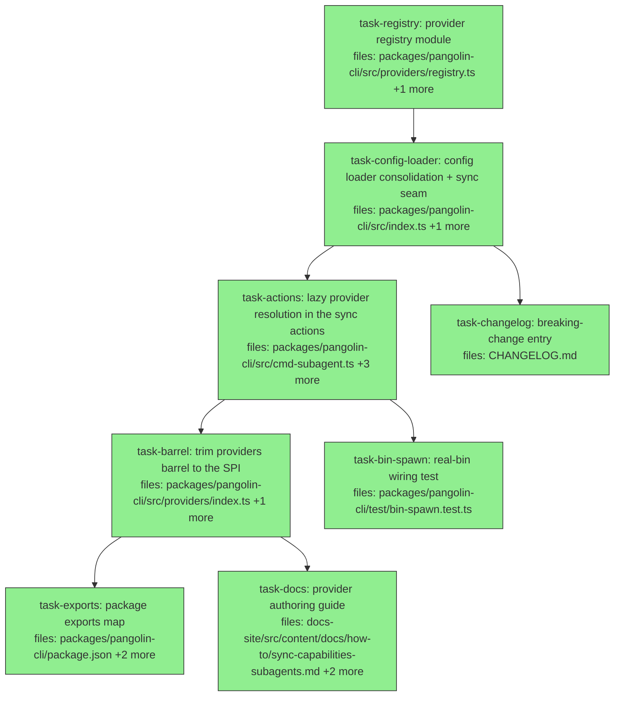

## Context

Implements `docs/superpowers/specs/2026-07-29-sync-provider-spi-design.md` (rev
`5827b0c9702c`, audited twice — round 2 verdict NOT READY/3 blocking, all
resolutions applied). The spec makes `SyncProvider` implementable and registerable
from outside the repo: a published `./providers` subpath so a third party can
*write* a provider, and a `syncProviders` export on `pangolin.config.{ts,js,mjs}`
so they can *register* it.

**Why the chain is mostly serial.** `task-registry` → `task-config-loader` →
`task-actions` → `task-barrel` is a genuine dependency chain, not incidental
ordering: the actions cannot call `ctx.getSyncProviders` before `CliContext`
declares it, and `providers/index.ts` cannot drop its registry exports while the
actions still import them from there. Parallelism appears at the leaves
(`task-bin-spawn` ∥ `task-barrel`; `task-exports` ∥ `task-docs`) and at
`task-changelog`, which forks early off `task-config-loader`.

### Scope guards — read before starting any task

**1. Do not widen the `CliContext` fixture sweep.** A grep for `getClient:` under
`packages/pangolin-cli/test/` finds **44 construction sites across 11 test files**.
Adding a third required member does *not* break them at compile time:
`packages/pangolin-cli` has no `tsconfig.test.json`, so its test files are
type-checked by nothing (see `.claude/audit-charter.md`, enforcement map). They are
*already* type-violating — none supplies the existing required `getOrchContext`.

Exactly **one** site breaks at runtime: `test/cmd-subagent.test.ts:129` passes
`--provider made-up`, the suite's only built-in **miss**, so it is the only test
that reaches the new seam. `task-actions` fixes that file and, defensively,
`test/cmd-capabilities.test.ts`. **The other nine test files are out of scope.**
Touching them is scope creep, not thoroughness.

The sweep above is package-scoped. Two further `CliContext`-shaped literals exist
outside it — `test/e2e/manifest-deploy.test.ts:187,189` and
`examples/manifest/test/deploy.test.ts:145-146`. Neither drives `sync`, neither is
type-checked (there is no root `tsconfig.json`; root `typecheck` is
`pnpm -r run typecheck` and root `test/` is not a workspace package), so both are
correctly untouched.

**2. The optional-member repair is forbidden.** When `test/cmd-subagent.test.ts`
goes red, do **not** declare `getSyncProviders` optional and do **not** call it
with `?.`. Either silences the test and simultaneously deletes the only thing
protecting `src/index.ts:110`, which sits inside `require.main === module`
(`:109`) and is therefore unreachable from vitest. The compiler is the sole guard.
Widen the fixture instead. (Spec §4.5; charter recurring bug class "green tests,
dead runnable artifact".)

**3. `pangolin-mcp` is out of scope.** `packages/pangolin-mcp/src/bin.ts:14-49` is
a third copy of the config-resolution loop. Spec D10 deliberately leaves it alone
rather than adding a `pangolin-mcp` → `pangolin-cli` package-graph edge. Do not
refactor it.

### Verification

`pnpm -r build`, `pnpm -r lint`, `pnpm -r typecheck`,
`pnpm -r --workspace-concurrency=1 test`, and `pnpm test:e2e`
(`.github/workflows/e2e.yml:60` gates it on every PR) must all pass. Note
`pnpm -r typecheck:test` is opt-in per package and `pangolin-cli` does not
participate — do not rely on it.

`pnpm -r lint` runs `eslint src test --ext .ts` and `.eslintrc.cjs:25` makes
`@typescript-eslint/no-unused-vars` an **error** for non-`_`-prefixed names. Code
sketches in this plan are illustrative: import only what you use.

## Tasks

## Task: provider registry module

```yaml
id: task-registry
depends_on: []
files:
  - packages/pangolin-cli/src/providers/registry.ts
  - packages/pangolin-cli/test/providers-registry.test.ts
status: done
model_hint: opus
quality_reviewer_hint: opus
```

Create the internal registry module holding the built-in map, shape validation,
merge, and resolution. This is the core of the design (spec §3.2, §4.2-§4.6, §5) —
every other task consumes its contract. It is a new file; nothing is deleted from
`providers/index.ts` yet (that is `task-barrel`).

## Implementation

```typescript
// packages/pangolin-cli/src/providers/registry.ts
import { ClaudeCodeProvider } from './claude-code.js';
import { StoaProvider } from './stoa.js';
import type { SyncProvider } from './types.js';

/** The raw `syncProviders` export plus the config filename it came from. */
export interface ConfigProviders {
  /** Unvalidated — including "not an array". The array check is mergeProviders'. */
  providers: unknown;
  /** The config filename that actually resolved, e.g. 'pangolin.config.js'. */
  source: string;
}

const PROVIDERS: ReadonlyMap<string, SyncProvider> = new Map<string, SyncProvider>([
  ['claude-code', new ClaudeCodeProvider()],
  ['stoa', new StoaProvider()],
]);

export function findBuiltIn(name: string): SyncProvider | undefined {
  return PROVIDERS.get(name);
}

export function listProviderNames(): string[] {
  return [...PROVIDERS.keys()];
}

/** Module-private on purpose: a second entry point would reopen the bypass D6 closes. */
function validateEntry(value: unknown, index: number, source: string): SyncProvider {
  const fail = (why: string): never => {
    throw new Error(`${source}: syncProviders[${index}] ${why}`);
  };
  if (typeof value !== 'object' || value === null) return fail('is not an object');
  const p = value as Record<string, unknown>;
  if (typeof p.name !== 'string' || p.name.length === 0) return fail('has no non-empty string `name`');
  for (const m of ['loadSubagents', 'loadCapabilities']) {
    if (typeof p[m] !== 'function') return fail(`has no \`${m}\` function`);
  }
  for (const d of ['defaultSubagentDir', 'defaultCapabilityDir']) {
    if (typeof p[d] !== 'string') return fail(`has no \`${d}\` string`);
  }
  return value as SyncProvider;
}

export function mergeProviders(extra: unknown, source: string): ReadonlyMap<string, SyncProvider> {
  if (!Array.isArray(extra)) {
    throw new Error(`${source}: syncProviders must be an array (got ${extra === null ? 'null' : typeof extra})`);
  }
  const merged = new Map(PROVIDERS);
  const seen = new Set<string>();
  extra.forEach((raw, i) => {
    const p = validateEntry(raw, i, source);
    if (PROVIDERS.has(p.name)) {
      throw new Error(`${source}: syncProviders[${i}] name '${p.name}' collides with a built-in provider`);
    }
    if (seen.has(p.name)) {
      throw new Error(`${source}: syncProviders[${i}] duplicate name '${p.name}'`);
    }
    seen.add(p.name);
    merged.set(p.name, p);
  });
  return merged;
}

export function resolveProvider(name: string, extra: unknown, source: string): SyncProvider {
  const merged = mergeProviders(extra, source);
  const provider = merged.get(name);
  if (!provider) {
    throw new Error(`unknown --provider '${name}' (known: ${[...merged.keys()].join(', ')})`);
  }
  return provider;
}

export async function resolveProviderLazily(
  name: string,
  getExtra: () => Promise<ConfigProviders | null>,
): Promise<SyncProvider> {
  const builtIn = findBuiltIn(name);
  if (builtIn) return builtIn;
  const config = await getExtra();
  if (!config) {
    throw new Error(`unknown --provider '${name}' (known: ${listProviderNames().join(', ')})`);
  }
  return resolveProvider(name, config.providers, config.source);
}
```

```typescript
// packages/pangolin-cli/test/providers-registry.test.ts
import { it, expect, vi } from 'vitest';
import { mergeProviders, resolveProviderLazily } from '../src/providers/registry.js';

it('names the real resolved config file, not a hardcoded .mjs', () => {
  expect(() => mergeProviders([{ name: 'remora' }], 'pangolin.config.js')).toThrow(
    /pangolin\.config\.js: syncProviders\[0\] has no `loadSubagents` function/,
  );
});

it('does not consult the config when the name is a built-in', async () => {
  const getExtra = vi.fn(async () => {
    throw new Error('must not be called');
  });
  await expect(resolveProviderLazily('claude-code', getExtra)).resolves.toMatchObject({
    name: 'claude-code',
  });
  expect(getExtra).not.toHaveBeenCalled();
});
```

## Acceptance criteria

- `findBuiltIn('claude-code')` and `findBuiltIn('stoa')` return providers;
  `findBuiltIn('remora')` returns `undefined`.
- `resolveProviderLazily` with a built-in name **never invokes** `getExtra` — asserted
  with a fake that throws if called. Paired positive companion: a config-supplied
  name **does** invoke it and resolves to the config provider, so the negative
  cannot pass on a no-op.
- `mergeProviders(null, 'pangolin.config.mjs')` throws naming the file; `undefined`
  is *not* special-cased here (the loader normalizes it) but a non-array still throws.
- An entry that is `null`, or lacks a non-empty string `name`, or lacks
  `loadSubagents` / `loadCapabilities` as functions, or lacks
  `defaultSubagentDir` / `defaultCapabilityDir` as strings, throws an error text
  containing both the `source` filename and the literal `syncProviders[<index>]`.
- A config entry named `claude-code` throws a collision error; two config entries
  sharing a name throw a duplicate error. Both name the file and the index.
- `resolveProvider` with an unknown name throws
  `unknown --provider '<name>' (known: claude-code, stoa, <config names…>)` —
  built-ins first, config names after, in insertion order.
- `resolveProviderLazily` with an unknown name and `getExtra` returning `null`
  throws listing only `claude-code, stoa`.
- The shape validator is **not** exported from this module.

Test file: `packages/pangolin-cli/test/providers-registry.test.ts`.

## Task: config loader consolidation with sync-provider seam

```yaml
id: task-config-loader
depends_on: [task-registry]
files:
  - packages/pangolin-cli/src/index.ts
  - packages/pangolin-cli/test/config-loader.test.ts
status: done
```

Collapse the two duplicated config-resolution loops into one helper, add
`defaultGetSyncProviders` on top of it, extend `CliContext` with the third seam,
and wire it at the real construction site (spec §4.5, §7). The consolidation is
what gives `source` a producer: today the filename is loop-local at
`src/index.ts:52` and dies there.

## Implementation

```typescript
// packages/pangolin-cli/src/index.ts
import type { ConfigProviders } from './providers/registry.js';

export interface CliContext {
  getClient: () => Promise<PangolinClient>;
  getOrchContext: () => Promise<OrchContext>;
  /** Lazily-loaded config providers. `null` = no pangolin.config.* in cwd. */
  getSyncProviders: () => Promise<ConfigProviders | null>;
}

const CONFIG_FILENAMES = ['pangolin.config.ts', 'pangolin.config.js', 'pangolin.config.mjs'];

/** Locate and import ./pangolin.config.{ts,js,mjs} from cwd. `null` when absent. */
async function loadConfigModule(): Promise<{ mod: Record<string, unknown>; filename: string } | null> {
  const { pathToFileURL } = await import('node:url');
  const { resolve } = await import('node:path');
  const { access } = await import('node:fs/promises');
  for (const filename of CONFIG_FILENAMES) {
    const path = resolve(process.cwd(), filename);
    try {
      await access(path);
    } catch {
      continue;
    }
    const mod = (await import(pathToFileURL(path).href)) as Record<string, unknown>;
    return { mod, filename };
  }
  return null;
}

export async function defaultGetClient(): Promise<PangolinClient> {
  const loaded = await loadConfigModule();
  if (!loaded) throw new Error(`pangolin-cli: no pangolin.config.{ts,js,mjs} found in ${process.cwd()}`);
  const client = loaded.mod.default ?? loaded.mod.client;
  if (!client) {
    throw new Error(
      `pangolin-cli: ${loaded.filename} must export an PangolinClient instance as default or named 'client'`,
    );
  }
  return client as PangolinClient;
}

export async function defaultGetSyncProviders(): Promise<ConfigProviders | null> {
  const loaded = await loadConfigModule();
  if (!loaded) return null;
  const raw = loaded.mod.syncProviders;
  return { providers: raw === undefined ? [] : raw, source: loaded.filename };
}

// …and at the direct-invocation guard (was: two properties):
//   buildProgram({ getClient: defaultGetClient, getOrchContext: defaultGetOrchContext,
//                  getSyncProviders: defaultGetSyncProviders })
```

```typescript
// packages/pangolin-cli/test/config-loader.test.ts
import { it, expect } from 'vitest';
import { defaultGetSyncProviders } from '../src/index.js';

it('reports the .js filename when that is the leg that resolved', async () => {
  // fixture cwd contains only pangolin.config.js exporting syncProviders: []
  const got = await defaultGetSyncProviders();
  expect(got).toEqual({ providers: [], source: 'pangolin.config.js' });
});
```

## Acceptance criteria

- `defaultGetSyncProviders()` returns `null` when no `pangolin.config.*` exists in cwd.
- With a config present and **no** `syncProviders` export, returns
  `{ providers: [], source: <filename> }` — not `null`, and not an error.
- With `export const syncProviders = undefined`, returns
  `{ providers: [], source: <filename> }` (D7 step 1: `undefined` is normalized here,
  not rejected).
- `source` is the filename that actually resolved: a fixture cwd containing only
  `pangolin.config.js` yields `source: 'pangolin.config.js'`, never a hardcoded
  `.mjs`.
- `defaultGetClient` and `defaultGetOrchContext` throw their existing message
  strings unchanged. There are **three** distinct strings, not four — `index.ts:68`
  and `:93` are byte-identical. Assert all three against these literals, typed into
  the test rather than imported from source (importing from post-refactor source
  makes the pin tautological):
  - `pangolin-cli: no pangolin.config.{ts,js,mjs} found in ${process.cwd()}`
  - `pangolin-cli: ${filename} must export an PangolinClient instance as default or named 'client'`
  - `pangolin-cli: ${filename} must export an OrchContext as a named 'orch' export for pangolin orch commands`
- Resolution order: assert `.js` resolves before `.mjs`. **Do not assert the `.ts`
  leg.** Type-stripping is default-on only from Node 22.18; the workspace declares
  `"node": ">=20"`, where importing a `.ts` config fails with
  `ERR_UNKNOWN_FILE_EXTENSION` (verified: Node 20.17.0 fails, Node 22.20.0 succeeds).
  CI pins Node 22, so a `.ts` assertion would be green in CI and red for any
  contributor on the declared floor — a failure CI structurally cannot see.
- `CliContext.getSyncProviders` is a **required** member, and `src/index.ts:110`
  passes `defaultGetSyncProviders`.

Test file: `packages/pangolin-cli/test/config-loader.test.ts`.

## Task: lazy provider resolution in the sync actions

```yaml
id: task-actions
depends_on: [task-config-loader]
files:
  - packages/pangolin-cli/src/cmd-subagent.ts
  - packages/pangolin-cli/src/cmd-capabilities.ts
  - packages/pangolin-cli/test/cmd-subagent.test.ts
  - packages/pangolin-cli/test/cmd-capabilities.test.ts
status: done
```

Switch both sync actions from the synchronous `resolveProvider` to
`resolveProviderLazily`, importing from `registry.js` rather than the barrel, and
widen the two fixtures that reach the new seam.

**When `test/cmd-subagent.test.ts` goes red, widen the fixture — do not make
`getSyncProviders` optional and do not call it with `?.`.** Either silences the
test and simultaneously deletes the only thing protecting `src/index.ts:110`: that
line is inside `if (typeof require !== 'undefined' && require.main === module)`,
which vitest never executes, so the compiler is the sole guard on it. Weakening the
type leaves an unwired binary shipping green.

Only two test files are in scope. The other nine `CliContext`-constructing files
under `packages/pangolin-cli/test/` never reach a built-in miss, so they never touch
the seam; leave them alone.

## Implementation

```typescript
// packages/pangolin-cli/src/cmd-subagent.ts  (and cmd-capabilities.ts, same shape)
import { resolveProviderLazily } from './providers/registry.js';

// inside the `sync` action, replacing `const provider = resolveProvider(opts.provider);`
const provider = await resolveProviderLazily(opts.provider, ctx.getSyncProviders);
const dir = opts.from ?? provider.defaultSubagentDir;   // defaultCapabilityDir in cmd-capabilities
```

```typescript
// packages/pangolin-cli/test/cmd-subagent.test.ts — the one fixture that breaks
// Widen it. Do NOT make the member optional and do NOT use `?.` (scope guard 2).
attachSubagentCmd(program, {
  getClient: async () => ({} as any),
  getSyncProviders: async () => null,
});

it('still reports an unknown provider by name', async () => {
  await expect(
    program.parseAsync(['node', 'pangolin', 'subagent', 'sync', '--provider', 'made-up', '--from', '.']),
  ).rejects.toThrow(/unknown --provider 'made-up'/);
});
```

## Acceptance criteria

- Both sync actions resolve via `resolveProviderLazily`, importing from
  `./providers/registry.js`; neither file imports `resolveProvider` from
  `./providers/index.js` any more.
- `test/cmd-subagent.test.ts` at the `--provider made-up` case still throws
  `unknown --provider 'made-up'` — proving the fixture was widened rather than the
  member weakened.
- **Subagent side, negative:** `subagent sync --provider claude-code --from <dir>
  --dry-run` succeeds with a `getSyncProviders` fake that throws if invoked.
- **Subagent side, positive companion:** `subagent sync --provider probe --from
  <dir> --dry-run` with a fake returning one shape-valid provider named `probe`
  resolves it and prints `(dry-run) subagent <name>`. Without this the negative
  above passes on any no-op.
- **Capabilities side:** both halves of the same pair —
  `--provider claude-code --dry-run` does not invoke the seam;
  `--provider probe --dry-run` does, and resolves.
- `--help` succeeds without invoking a throwing `getSyncProviders` fake, pinning
  that help text stays generic and does not eagerly enumerate providers.
- `git diff --name-only` for this task lists exactly the four paths in `files:` —
  no other test file is modified. (Use this rather than a `grep` count: the tree has
  no POSIX `grep` on Windows, and a line count would not distinguish files anyway.)
- `pnpm -r --workspace-concurrency=1 test` is green at the end of this task.

Test file: `packages/pangolin-cli/test/cmd-subagent.test.ts`.

## Task: trim providers barrel to the SPI

```yaml
id: task-barrel
depends_on: [task-actions]
files:
  - packages/pangolin-cli/src/providers/index.ts
  - packages/pangolin-cli/test/providers-barrel.test.ts
status: done
```

Reduce `providers/index.ts` to exactly the published SPI surface — three types plus
two provider classes plus `splitFrontmatter` — now that nothing imports the registry
from it (spec §3.2). Under the `exports` map landing in `task-exports`, whatever
remains here becomes public API by placement, so the removals matter as much as the
additions.

## Implementation

```typescript
// packages/pangolin-cli/src/providers/index.ts — the whole file after this task
export type { SyncProvider, SubagentDef, CapabilityBundle } from './types.js';
export { ClaudeCodeProvider } from './claude-code.js';
export { StoaProvider } from './stoa.js';
export { splitFrontmatter } from '../frontmatter.js';
```

```typescript
// packages/pangolin-cli/test/providers-barrel.test.ts
import { it, expect } from 'vitest';
import * as barrel from '../src/providers/index.js';

it('publishes exactly the SPI surface and no registry internals', () => {
  expect(Object.keys(barrel).sort()).toEqual(
    ['ClaudeCodeProvider', 'StoaProvider', 'splitFrontmatter'].sort(),
  );
});
```

## Acceptance criteria

- The barrel's runtime exports are exactly `ClaudeCodeProvider`, `StoaProvider`,
  `splitFrontmatter` — asserted as a whole-set equality on `Object.keys`, so a later
  addition fails the test rather than passing silently.
- `PROVIDERS`, `resolveProvider`, `resolveProviderLazily`, `mergeProviders`,
  `findBuiltIn`, and `listProviderNames` are **not** reachable from
  `src/providers/index.js`.
- The three types (`SyncProvider`, `SubagentDef`, `CapabilityBundle`) remain
  exported as types. **This criterion is review-only and has no automated check** —
  `Object.keys` cannot see erased types, nothing in `src/` imports the barrel after
  `task-actions`, and `pangolin-cli` has no `tsconfig.test.json`. Deleting the
  `export type {…}` line leaves build, typecheck, lint, and the barrel test all
  green while removing the one thing an out-of-tree author needs to write
  `implements SyncProvider`. The reviewer must read the line, not run something.
- `pnpm -r build` and `pnpm -r typecheck` pass — nothing still imports a removed
  symbol from this path.

Test file: `packages/pangolin-cli/test/providers-barrel.test.ts`.

## Task: real-bin wiring test

```yaml
id: task-bin-spawn
depends_on: [task-actions]
files:
  - packages/pangolin-cli/test/bin-spawn.test.ts
status: done
```

Spawn the built binary against a **real `pangolin.config.mjs`** in a scratch cwd.
This is the only construction that executes `src/index.ts:110` — `:109`'s
`require.main === module` guard makes it unreachable from vitest — and the only
place in this plan where the config-side producer (`defaultGetSyncProviders`) is
bound to the resolver-side consumer (`resolveProviderLazily`) through that line.
Mirror the scratch-cwd harness at `test/e2e/mcp-tool-surface.test.ts:94-121`:
`mkdtemp` a directory, `writeFile` a config into it, spawn with `cwd: configDir`,
`rm` in `afterEach`.

**A built-in-only spawn is not sufficient and must not be the whole test.**
`resolveProviderLazily` returns from `findBuiltIn` before touching
`getSyncProviders`, so a built-in case passes against a build that never wired
`:110` at all. The config-provider case below is the discriminating one.

## Implementation

```typescript
// packages/pangolin-cli/test/bin-spawn.test.ts
import { it, expect, beforeEach, afterEach } from 'vitest';
import { execFile } from 'node:child_process';
import { promisify } from 'node:util';
import { mkdtemp, writeFile, rm } from 'node:fs/promises';
import { tmpdir } from 'node:os';
import { dirname, join, resolve } from 'node:path';
import { fileURLToPath } from 'node:url';

const run = promisify(execFile);
const pkgRoot = resolve(dirname(fileURLToPath(import.meta.url)), '..');
const bin = join(pkgRoot, 'dist/index.js');

// A shape-valid provider defined inline in the config. No client is needed:
// cmd-subagent.ts:125 is `opts.dryRun ? null : await ctx.getClient()`, so
// --dry-run never constructs one.
const CONFIG_WITH_PROVIDER = `
export const syncProviders = [{
  name: 'probe',
  defaultSubagentDir: 'agents',
  defaultCapabilityDir: 'capabilities',
  async loadSubagents() { return [{ name: 'probe-agent', promptTemplate: 'hi {{x}}' }]; },
  async loadCapabilities() { return []; },
}];
`;

let cwd: string;
beforeEach(async () => { cwd = await mkdtemp(join(tmpdir(), 'pangolin-bin-')); });
afterEach(async () => { await rm(cwd, { recursive: true, force: true }); });

it('resolves a CONFIG-SUPPLIED provider through the real bin', async () => {
  await writeFile(join(cwd, 'pangolin.config.mjs'), CONFIG_WITH_PROVIDER);
  const { stdout } = await run(process.execPath, [bin, 'subagent', 'sync', '--provider', 'probe', '--dry-run'], { cwd });
  expect(stdout).toContain('(dry-run) subagent probe-agent');
});
```

```typescript
// The same file: blast radius against a config that throws at module scope.
const HOSTILE_CONFIG = `throw new Error('boom-from-config');\n`;

it('a built-in under --dry-run survives an import-hostile config', async () => {
  await writeFile(join(cwd, 'pangolin.config.mjs'), HOSTILE_CONFIG);
  const { stdout } = await run(process.execPath, [bin, 'subagent', 'sync', '--provider', 'claude-code', '--from', cwd, '--dry-run'], { cwd });
  expect(stdout).not.toContain('boom-from-config');
});

it('a typo surfaces the import error, not the unknown-provider message', async () => {
  await writeFile(join(cwd, 'pangolin.config.mjs'), HOSTILE_CONFIG);
  await expect(
    run(process.execPath, [bin, 'subagent', 'sync', '--provider', 'claude-cod', '--dry-run'], { cwd }),
  ).rejects.toThrow(/boom-from-config/);
});
```

## Acceptance criteria

- Spawns `dist/index.js` as a **child process**, never an in-process import, so the
  `require.main === module` guard at `src/index.ts:109` actually fires.
- **The discriminating case:** a scratch cwd containing a `pangolin.config.mjs` that
  exports `syncProviders` with an inline provider named `probe` resolves
  `subagent sync --provider probe --dry-run` to exit 0 printing
  `(dry-run) subagent probe-agent`. This case is red if `src/index.ts:110` omits
  `getSyncProviders` (TypeError on `await getExtra()` against `undefined`) **and**
  red if the member is made optional or called with `?.` (yields `null`, producing
  `unknown --provider 'probe'`). No other assertion in this plan distinguishes those
  two states from success.
- Blast radius, same harness, against a config that throws at module scope:
  a built-in under `--dry-run` **succeeds** and its stdout does not contain the
  config's error text; `--provider claude-cod` (a typo, hence a built-in miss)
  **fails with the config's import error**, not with `unknown --provider`.
- Every case writes its config with `writeFile` into a `mkdtemp` cwd and removes it
  in `afterEach` — no test may depend on another's leftover config.
- The suite fails, rather than passing, if run against a `dist/` predating this
  change: verify once by running it before rebuilding. The discriminating case is
  the recorded evidence; **no manual source-mutation step is required or wanted.**

Test file: `packages/pangolin-cli/test/bin-spawn.test.ts`.

## Task: package exports map

```yaml
id: task-exports
depends_on: [task-barrel]
files:
  - packages/pangolin-cli/package.json
  - packages/pangolin-cli/test/exports-resolution.test.ts
  - packages/pangolin-cli/.gitignore
status: done
```

Declare the `./providers` subpath, making this the first package in the monorepo
with an `exports` map (spec §3.1, §3.3). The `"."` entry is mandatory — omitting it
breaks every existing root import.

**The probe file must live inside `packages/pangolin-cli/`.** Node resolves bare
specifiers from the *importing file's* URL, not from `process.cwd()`, so a probe
written to the OS temp directory cannot resolve
`@quarry-systems/pangolin-cli/providers` no matter what `cwd` the child is given —
it fails identically whether the `exports` map is correct, wrong, or absent, and
`test/e2e/mcp-tool-surface.test.ts:13-18` documents this same limitation. Placing
the probe inside the package activates Node's **package self-reference**, which is
enabled *only* when `package.json` has an `exports` field — so the resolution
succeeding is itself the test that the map landed. A package-level `.gitignore`
covers the transient probe; `docs-site/` and `examples/*/` already carry
package-level ignores, so this follows convention.

## Implementation

```json
{
  "main": "dist/index.js",
  "types": "dist/index.d.ts",
  "exports": {
    ".": { "types": "./dist/index.d.ts", "default": "./dist/index.js" },
    "./providers": {
      "types": "./dist/providers/index.d.ts",
      "default": "./dist/providers/index.js"
    }
  }
}
```

```typescript
// packages/pangolin-cli/test/exports-resolution.test.ts
import { it, expect, beforeEach, afterEach } from 'vitest';
import { execFile } from 'node:child_process';
import { promisify } from 'node:util';
import { mkdtemp, writeFile, rm } from 'node:fs/promises';
import { dirname, join, resolve } from 'node:path';
import { fileURLToPath } from 'node:url';

const run = promisify(execFile);
// Same idiom as test/scaffold-shape.test.ts:6-8.
const pkgRoot = resolve(dirname(fileURLToPath(import.meta.url)), '..');

// INSIDE the package — self-reference resolution requires it, and self-reference
// is active only when package.json has an `exports` field.
let probeDir: string;
beforeEach(async () => { probeDir = await mkdtemp(join(pkgRoot, '.probe-')); });
afterEach(async () => { await rm(probeDir, { recursive: true, force: true }); });

it('an ESM consumer named-imports the SPI from the subpath', async () => {
  const probe = join(probeDir, 'probe.mjs');
  await writeFile(
    probe,
    `import { ClaudeCodeProvider } from '@quarry-systems/pangolin-cli/providers';\n` +
      `console.log(new ClaudeCodeProvider().name);\n`,
  );
  const { stdout } = await run(process.execPath, [probe]);
  expect(stdout.trim()).toBe('claude-code');
});

it('a registry internal is NOT reachable through the subpath', async () => {
  const probe = join(probeDir, 'internal.mjs');
  await writeFile(
    probe,
    `import { ClaudeCodeProvider, mergeProviders } from '@quarry-systems/pangolin-cli/providers';\n` +
      `console.log(typeof ClaudeCodeProvider, typeof mergeProviders);\n`,
  );
  // Must name mergeProviders specifically — a bare "it throws" is satisfied by
  // ERR_MODULE_NOT_FOUND, which is what a MISSING exports map produces.
  await expect(run(process.execPath, [probe])).rejects.toThrow(/mergeProviders/);
});
```

```
packages/pangolin-cli/.gitignore
.probe-*/
```

## Acceptance criteria

- `package.json` declares both `"."` and `"./providers"`; `main` and `types` are
  retained for older resolvers.
- The probe `.mjs` files are written **inside `packages/pangolin-cli/`** (a
  `mkdtemp` dir under the package root) and removed in `afterEach`. A probe in the
  OS temp dir cannot resolve the specifier at all and is not an acceptable
  implementation — `cwd` does not affect bare-specifier resolution.
- A real `.mjs` file, run as a node **subprocess**, named-imports
  `ClaudeCodeProvider` from `@quarry-systems/pangolin-cli/providers` and prints
  `claude-code`. In-process `await import()` does not satisfy this: it observes
  vitest's resolver and never exercises `cjs-module-lexer`.
- **Do not** add a `require`/`import` condition split to make the above pass. tsc's
  `Object.defineProperty(exports, …)` re-export emit is already lexer-visible; a
  split would mask a real failure.
- The negative probe fails with an error whose text **names `mergeProviders`**. A
  bare "it throws" is satisfied by `ERR_MODULE_NOT_FOUND` — which is exactly what a
  package with *no* `exports` map produces — so the specific-symbol assertion is
  what makes this a real check. The same probe file importing `ClaudeCodeProvider`
  successfully is its control.
- `packages/pangolin-cli/.gitignore` contains `.probe-*/` so a crashed run leaves no
  tracked debris.
- `pnpm -r build` runs before `pnpm -r test` in `ci.yml:61-69`, so `dist/` is current.

Test file: `packages/pangolin-cli/test/exports-resolution.test.ts`.

## Task: provider authoring guide

```yaml
id: task-docs
depends_on: [task-barrel]
files:
  - docs-site/src/content/docs/how-to/sync-capabilities-subagents.md
  - docs-site/src/content/docs/reference/config.md
  - docs-site/src/content/docs/reference/cli.md
status: done
```

Rewrite the authoring section, which currently instructs the impossible — "add an
entry to the `PROVIDERS` map in `packages/pangolin-cli/src/providers/index.ts`"
(`sync-capabilities-subagents.md:160-161`) — and carry the import-safety
requirement, which no other document reaches the right audience with (spec §10).

## Implementation

```markdown
<!-- sync-capabilities-subagents.md — replaces the "To register a provider" block -->
## Registering an out-of-tree provider

Implement `SyncProvider` against `@quarry-systems/pangolin-cli/providers`, then
register it in your `pangolin.config`:

    import { RemoraProvider } from 'remora-pangolin-provider';
    export const syncProviders = [new RemoraProvider()];

Built-in names (`claude-code`, `stoa`) cannot be overridden — a collision is a
hard error naming the file and the array index.

### Import safety is a requirement

Your provider package is imported by `pangolin.config`, and that file is
evaluated by the **`pangolin-mcp` server at startup**, which has nothing to do
with `sync`. Your package must therefore be a real `dependency` (not a
`devDependency`), survive a pruned production install, and must not throw at
module scope. A provider that violates this takes down the MCP server.
```

```markdown
<!-- config.md — new export, alongside `default`/`client` and `orch` -->
### `syncProviders`

Optional. An array of `SyncProvider` instances; see the provider authoring guide.
Loaded lazily — only when `--provider` names something the built-ins do not cover.

Note this file is imported by two processes: the `pangolin` CLI and the
`pangolin-mcp` server (at startup).
```

## Acceptance criteria

- The `sync-capabilities-subagents.md` instruction to edit the in-tree `PROVIDERS`
  map is replaced for out-of-tree readers.
- The **retained** in-tree paragraph (for pangolin's own providers) is updated to
  name `packages/pangolin-cli/src/providers/registry.ts` and `resolveProviderLazily`.
  As it stands it names `providers/index.ts`, which no longer holds the map, and
  `resolveProvider(name)`, whose signature no longer exists — relocating the
  "instructs the impossible" defect rather than removing it. `pnpm --filter docs-site
  build` cannot catch this: it validates links, not prose.
- The authoring guide states the import-safety requirement in all three of its
  parts: real `dependency`, survives a pruned production install, no module-scope
  throw — and names `pangolin-mcp` startup as the reason.
- The guide does **not** claim capability bundles are credential-scanned. Bundle
  bytes are `Uint8Array` and pass through unscanned.
- The provisional-stability note lands in
  `docs-site/src/content/docs/how-to/sync-capabilities-subagents.md`, names the
  `./providers` subpath specifically, and gives the reason inline in two sentences:
  `loadSubagents(dir)` means "the directory containing subagent files" to
  `ClaudeCodeProvider` (`claude-code.ts:28,31-32`) but "a repo root" to
  `StoaProvider`, which sets `defaultSubagentDir = '.'` and rebuilds both paths
  internally (`stoa.ts:33,38-40`). One parameter, two meanings — unresolved, so the
  interface may change on a minor release.
- `config.md` documents `syncProviders` and notes the two importing processes.
- `config.md`'s existing "Resolution order" list gains a caveat on the
  `pangolin.config.ts` leg: type-stripping is on by default only from Node 22.18, and
  the workspace declares `"node": ">=20"`, where that leg fails with
  `ERR_UNKNOWN_FILE_EXTENSION`. (Verified: Node 20.17.0 fails, Node 22.20.0 succeeds.)
  Either state the caveat or drop `.ts` from the documented order.
- **Both** `sync` rows in `cli.md` — `:37` (capabilities) and `:49` (subagent) —
  state that `--provider` may name a config-supplied provider and that built-in
  names cannot be overridden. There is no separate `--provider` row; the flag
  appears only inside those two rows' options cells, so updating one and stopping
  leaves the other wrong.
- `pnpm --filter docs-site build` succeeds (starlight link validation passes).

Test file: `docs-site` has no per-page test; verification is
`pnpm --filter docs-site build` plus the content criteria above.

## Task: breaking-change entry

```yaml
id: task-changelog
depends_on: [task-config-loader]
files:
  - CHANGELOG.md
status: done
is_wiring_task: true
model_hint: cheap
review_mode: merged
```

Create a new `## [Unreleased]` section at the top of the changelog and record the
`CliContext` breaking change plus the two additive items. Marked `is_wiring_task`
because the artifact is a changelog entry — there is no implementation or test pair
to anchor, only the record itself.

**Do not append to `## [0.4.0]`.** That section is git-tagged `v0.4.0` and
published to npm as `latest`; npm versions are immutable (`RELEASING.md:32-45`).
Writing a not-yet-shipped change into it asserts that the released tarballs contain
something they do not, and leaves the next release cut nothing to promote. The
repo's flow is `[Unreleased]` → promoted at release time
(`RELEASING.md:13-14`); the sibling plan `docs/superpowers/plans/2026-07-28-storage-not-found-dag.md:997`
(`task-release-prep`, `status: done`) is what created the `## [0.4.0]` heading by
promoting `[Unreleased]`. There is no CI check on this file, so review is the only
gate.

Insert immediately above the existing `## [0.4.0] - 2026-07-28` line:

```markdown
## [Unreleased]

### Breaking

- `CliContext` now requires a third member,
  `getSyncProviders: () => Promise<{ providers: unknown; source: string } | null>`.
  Any code constructing a `CliContext` to call `buildProgram` must supply it;
  `defaultGetSyncProviders` is exported from `@quarry-systems/pangolin-cli` as the
  drop-in default.

### Added

- `pangolin.config.{ts,js,mjs}` accepts a `syncProviders` named export — an array of
  `SyncProvider` instances registering out-of-tree sync providers for
  `pangolin subagent sync` / `pangolin capabilities sync`. Built-in provider names
  (`claude-code`, `stoa`) cannot be overridden; a collision is an error.
- `@quarry-systems/pangolin-cli/providers` subpath export, publishing the
  `SyncProvider` / `SubagentDef` / `CapabilityBundle` types plus `ClaudeCodeProvider`,
  `StoaProvider`, and `splitFrontmatter` for out-of-tree provider authors. Provisional
  — may change on a minor release.
```

The breaking bullet describes the seam's shape inline rather than naming
`ConfigProviders`: that type is internal to `providers/registry.ts` and is not
exported, so a consumer told to supply the member could not name its type.

## Acceptance criteria

- A new `## [Unreleased]` section is created **above** `## [0.4.0] - 2026-07-28`;
  the `[0.4.0]` section is left byte-identical.
- `[Unreleased]` contains a `### Breaking` subsection naming `CliContext`,
  `getSyncProviders`, and `defaultGetSyncProviders` as the drop-in default, and
  spelling the member's type inline as
  `() => Promise<{ providers: unknown; source: string } | null>`.
- It contains an `### Added` subsection with exactly two bullets: the
  `syncProviders` config export, and the `./providers` subpath export.
- The breaking item is **not** filed under `### Added`, and neither additive item is
  filed under `### Breaking`.
- The entry does not name `ConfigProviders` — that type is not exported.

Test file: none — `CHANGELOG.md` has no automated check (`grep -rn CHANGELOG
.github/workflows/` returns nothing); verified by review against the criteria above.

---

## Execution record

- **2026-07-30** · **8/8 done, 0 failed, 0 skipped.** Five dispatch ticks; two ran
  two implementers in parallel (`task-actions` ∥ `task-changelog`,
  `task-barrel` ∥ `task-bin-spawn`, `task-exports` ∥ `task-docs`).
- Commits, in order: `0e04fab` registry · `32c65f8` config loader · `e07a732`
  changelog · `de9016b` actions · `60fe40d` barrel · `33f3120` bin-spawn ·
  `fdbb0f9` bin-spawn fixup · `0b1be89` exports · `a83dad6` docs.
- **One review loop.** `task-bin-spawn` failed quality review on an Important
  finding: `--from <cwd>` in the hostile-config case was load-bearing but
  unexplained (without it the built-in's default `.claude/agents` ENOENTs before
  the assertion), and `expect(stdout).not.toContain(...)` was vacuous because
  stdout is unconditionally empty on that path. Fixed in `fdbb0f9` by documenting
  the flag and seeding a real `agents/demo.md` so the case asserts
  `(dry-run) subagent demo` positively. Re-review APPROVED.
- **Gate-2's B2 was validated in practice, not just in principle.** The
  `task-bin-spawn` implementer ran the new suite against the pre-change `dist/`
  and got exactly the predicted RED: `unknown --provider 'probe'`. The
  spec reviewer then independently mutation-tested the built output under both
  failure modes — construction site unwired, and the member weakened with `?.` —
  and confirmed the discriminating case goes red for each. That case is the only
  assertion in the suite that distinguishes those states from success.
- Final gates, repo-wide: `pnpm -r build` ✓ · `pnpm run check:deps` ✓ ·
  `pnpm -r lint` ✓ · `pnpm -r typecheck` ✓ ·
  `pnpm -r --workspace-concurrency=1 test` ✓ (`pangolin-cli` 23 files / 213 tests,
  up from 193 at branch start) · `pnpm --filter docs-site build` ✓.
- Adding the repo's first `exports` map broke nothing: the clean-room dependency
  guard passes and every package still builds.
- Open polish, non-blocking, both raised as review Suggestions: the docs' example
  imports `remora-pangolin-provider`, which is not a real npm package and reads
  like one; and `providers/index.ts`'s type re-export line remains covered by no
  automated check (documented as review-only in `task-barrel`).

---

## Audit record

- **2026-07-30** · rev `bafadca038b1` · gate 2, lenses: coverage, dag-integrity,
  grounding, charter, context-sufficiency, verifiability, coherence ·
  **NOT READY — 3 blocking**
  - **B1** — `task-exports`' probe writes to `tmpdir()` and relies on `cwd` for bare
    specifier resolution. Node resolves from the *importing file's* URL, so it fails
    identically whether the `exports` map is right, wrong, or absent. Reproduced
    three times; the decisive experiment is that an in-package probe also fails when
    the `exports` field is removed, which is what makes in-package placement a real
    test of the map. Fix: JR-2.
  - **B2** — `task-bin-spawn` passes against the **pre-change** `dist/`; both its
    assertions already hold today. No test anywhere in the plan puts a real
    `pangolin.config.*` in front of the real binary, so `src/index.ts:110` can be
    left unwired — or the compiler guard deleted via the forbidden `?.` repair — with
    all four gates green. This is round-1 B2 restored and the charter's own recurring
    bug class, whose instance 2 cites this exact line. Fix: JR-1.
  - **B3** — `task-changelog` targets `CHANGELOG.md:12`, a `### Breaking` heading
    under `## [0.4.0]`, which is git-tagged and published as npm `latest`. No
    `[Unreleased]` section exists; `RELEASING.md:13-14` documents the staging
    convention, and the sibling plan's `task-release-prep` is what created the cited
    heading. Fix: JR-3.
  - Promotions: 1 (charter's DEFERRED on the changelog → BLOCKING; an unenforced
    *convention* is drift, but a falsehood in the permanent record of an immutable
    published artifact is not).
  - Downgrades: **none** — all 7 proposed BLOCKING upheld, merged to 3.
  - Two reclassifications logged to avoid reopening frozen spec ground: the `cli.md`
    `--provider` mislabel (a citation error in §10, not a design decision), and the
    `ConfigProviders`-not-publicly-nameable item (confined to changelog wording; the
    version that would export the type reopens §3.2/D8 and was **not** upheld).
  - **EU1 SETTLED, not deferred.** The reconciler ran the spec's own probe:
    Node 20.17.0 → `ERR_UNKNOWN_FILE_EXTENSION`, Node 22.20.0 → OK. The spec's
    hypothesis is confirmed exactly, discharging the duty §9 assigned this plan. Two
    one-line consequences now have decided answers (JR-5 assertion wording, JR-4
    `config.md` caveat). No probe task needed.
  - Six joint resolutions (JR-1…JR-6). Net artifact growth across all six: at most
    one `.gitignore` line.
- **2026-07-30 (post-gate-2 revision)** — all six joint resolutions applied.
  - **JR-1** — `task-bin-spawn` rewritten around a real `pangolin.config.mjs` in a
    scratch cwd (harness mirrored from `test/e2e/mcp-tool-surface.test.ts:94-121`).
    Its discriminating case resolves a **config-supplied** provider through the real
    bin, and is red both when `:110` is unwired and when the member is weakened —
    the two states nothing previously distinguished. Absorbed §9's three unowned
    Blast-radius rows. The manual source-mutation step is **deleted**: the task got
    smaller, not bigger.
  - **JR-2** — `task-exports`' probe moved inside the package (self-reference
    resolution, which activates only when `exports` is present, making resolution
    itself the test). `pkgRoot` bound per `test/scaffold-shape.test.ts:6-8`; the
    negative probe now asserts on `mergeProviders` by name so it cannot pass on
    `ERR_MODULE_NOT_FOUND`. `packages/pangolin-cli/.gitignore` added to `files:`.
  - **JR-3** — `task-changelog` now creates `## [Unreleased]` above the tagged
    `## [0.4.0]`, with all three bullets written verbatim, and describes the seam's
    shape inline rather than naming the internal `ConfigProviders`.
  - **JR-4** — `task-docs`: both `sync` rows (`cli.md:37,49`, there is no
    `--provider` row); provisional-stability note given a destination file and
    inlined content; new criterion on the **retained** in-tree paragraph, which
    would otherwise keep naming `providers/index.ts` and `resolveProvider(name)`;
    `config.md` resolution-order caveat.
  - **JR-5** — three distinct error literals pasted verbatim (`:68` and `:93` are
    byte-identical, so "four" was wrong); the `.ts`-leg hedge replaced with a
    decided "do not assert it".
  - **JR-6** — 12→11 files, ten→nine; `grep -c` replaced with `git diff --name-only`;
    guard-2 *rationale* inlined into `task-actions` (the guard lives in `## Context`,
    which no implementer receives); `pnpm test:e2e` added to Verification; guard 1
    noted as package-scoped with the two out-of-package sites named.
  - Also fixed: unused `describe` imports in three sketches (a `pnpm -r lint` error
    under `.eslintrc.cjs:25`); `task-barrel`'s type-export criterion marked
    review-only rather than implying a check that cannot exist.
  - **Round 2 is due — this entry's `rev` is stale by construction.**
