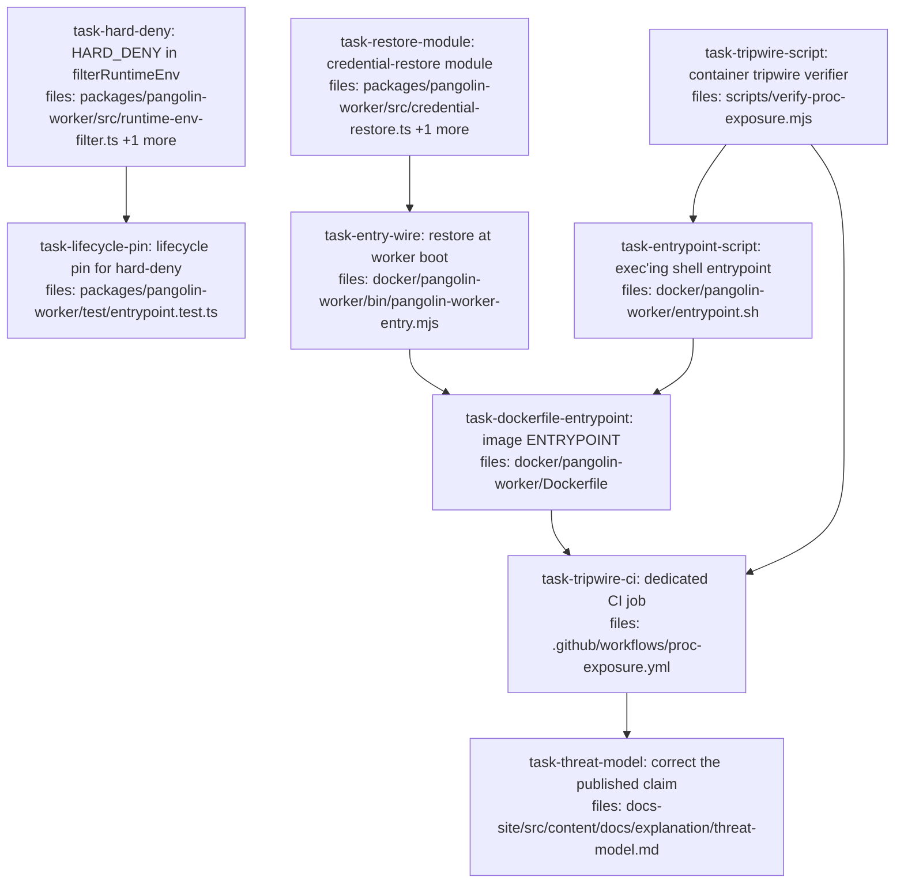

## Context

Implements §7 (**C1′-restore**) of
[`../specs/2026-07-23-worker-env-block-exposure-design.md`](../specs/2026-07-23-worker-env-block-exposure-design.md).
Build order is §7.8; testing constraints are §7.6.

**The finding.** A prompt-injected agent reads the worker's AWS chain and callback HMAC key reference
from `/proc/<worker-pid>/environ` — same uid, no exploit. `runtime-env-filter.ts` scopes only the
environment handed to the agent *process*, not the worker's own, so it does not achieve what it exists
to do. Severity high, reproduced three times.

**The mechanism.** The entrypoint `exec`s the worker with a clean environment, hands the captured
environment over an inherited fd whose file is already unlinked, and the worker restores it into its own
`process.env` — which is not the region `/proc` exposes. Every premise was measured in the real image
before the design was written; evidence lives in
[`../specs/experiments/2026-07-31-proc-c1-prime-restore/`](../specs/experiments/2026-07-31-proc-c1-prime-restore/).

**Three traps this plan is shaped around**, all recorded in the spec:

1. **The instrument can lie.** `$(wc -c < /proc/self/environ)` reads 0 bytes with the credential plainly
   present. Every absence assertion here carries a positive control that must *find* a credential in the
   same run, or the run is void. `scripts/verify-patch-capture-env.mjs` already does exactly this (its
   Arm A) and is the named reference implementation for `task-tripwire-script`.
2. **A tripwire in a passes-as-skipped lane is theatre.** `.github/workflows/e2e.yml` runs `pnpm test:e2e`
   without `PANGOLIN_E2E_DOCKER=1`, which is how a *dangling* worker digest survived four releases at a
   clean "77 passed". The tripwire gets its own workflow (`task-tripwire-ci`), never that lane.
3. **A test on the threaded `env` proves nothing here.** The mechanism acts on the real process
   environment before `execve`. Every existing `runWorker(...)` call site in tests passes a synthetic
   object; only `docker/pangolin-worker/bin/pangolin-worker-entry.mjs:19` passes the real thing. Tasks
   below say explicitly which level each assertion lives at.

**Scope note.** §5's scope-note steps (a), (c) and (d) are **withdrawn** by §7.1 — no `credentials` field
on `S3StorageProviderOpts`, no `SecretsManagerClient({ credentials })`, no new package dependency. The
measured reason: a credential restored into `process.env` after `execve` is invisible to `/proc` *and* is
picked up by the SDK's own chain on both credential shapes.

`task-hard-deny` and `task-lifecycle-pin` carry value independent of the rest: they close the
`PANGOLIN_RUNTIME_ENV_ALLOW=*` footgun against the credentials that are ambient in the worker **today**.

## Tasks

## Task: HARD_DENY in filterRuntimeEnv

```yaml
id: task-hard-deny
depends_on: []
files:
  - packages/pangolin-worker/src/runtime-env-filter.ts
  - packages/pangolin-worker/test/runtime-env-filter.test.ts
status: pending
quality_reviewer_hint: opus
```

Add a non-overridable deny set consulted **before** the operator allow-list, so
`PANGOLIN_RUNTIME_ENV_ALLOW=*` cannot hand a credential to the agent (spec §7.4). The module already
reasons this way — its docstring forbids extending adapter-config by a `PANGOLIN_` prefix precisely so
`PANGOLIN_CALLBACK_TOKEN_REF` cannot be re-exposed — this makes that reasoning enforceable rather than
advisory.

## Implementation

```typescript
// packages/pangolin-worker/src/runtime-env-filter.ts

/**
 * Credential-bearing names that NO operator allow-list entry may pass. Checked
 * before `matchesAllow`, so a bare `*` — a valid glob with an empty prefix that
 * otherwise re-opens the whole firewall — cannot reach them.
 *
 * AWS_REGION / AWS_DEFAULT_REGION are deliberately NOT here: non-credential,
 * and the runtime needs them (they are in BUILTIN_ALLOW).
 */
const HARD_DENY: ReadonlySet<string> = new Set([
  'AWS_ACCESS_KEY_ID',
  'AWS_SECRET_ACCESS_KEY',
  'AWS_SESSION_TOKEN',
  'PANGOLIN_CALLBACK_TOKEN_REF',
  'PANGOLIN_CALLBACK_BEARER_REF',
  'PANGOLIN_PER_DISPATCH_SECRET_REFS_JSON',
]);
const HARD_DENY_PREFIXES: ReadonlyArray<string> = ['AWS_CONTAINER_CREDENTIALS_'];

function isHardDenied(key: string): boolean {
  return HARD_DENY.has(key) || HARD_DENY_PREFIXES.some((p) => key.startsWith(p));
}

export function filterRuntimeEnv(
  env: Record<string, string>,
  opts: FilterRuntimeEnvOpts = {},
): Record<string, string> {
  const allow = opts.allow ?? [];
  const out: Record<string, string> = {};
  for (const [key, value] of Object.entries(env)) {
    if (isHardDenied(key)) continue; // before the allow-list, deliberately
    if (
      BUILTIN_ALLOW.has(key) ||
      BUILTIN_ALLOW_PREFIXES.some((p) => key.startsWith(p)) ||
      matchesAllow(key, allow)
    ) {
      out[key] = value;
    }
  }
  return out;
}
```

```typescript
// packages/pangolin-worker/test/runtime-env-filter.test.ts
it('HARD_DENY survives a bare * allow-list, while a benign var passes', () => {
  const out = filterRuntimeEnv(
    {
      AWS_SECRET_ACCESS_KEY: 'secret',
      AWS_CONTAINER_CREDENTIALS_RELATIVE_URI: '/v2/credentials/x',
      PANGOLIN_CALLBACK_TOKEN_REF: 'arn:...:hmac',
      MY_APP_FLAG: 'true',
    },
    { allow: ['*'] },
  );
  // Positive control: `*` genuinely is in force, so the absences below mean something.
  expect(out.MY_APP_FLAG).toBe('true');
  expect(out).not.toHaveProperty('AWS_SECRET_ACCESS_KEY');
  expect(out).not.toHaveProperty('AWS_CONTAINER_CREDENTIALS_RELATIVE_URI');
  expect(out).not.toHaveProperty('PANGOLIN_CALLBACK_TOKEN_REF');
});
```

## Acceptance criteria

- With `allow: ['*']`, `MY_APP_FLAG` passes **and** each of the six `HARD_DENY` names plus
  `AWS_CONTAINER_CREDENTIALS_RELATIVE_URI` is absent from the output. The passing var is the control: it
  proves `*` was actually in force, so the absences are not an artifact of the allow-list being ignored.
- The same six names are absent with `allow: ['AWS_*']` and with `allow: ['PANGOLIN_*']` (prefix globs,
  not just `*`).
- `AWS_REGION` and `AWS_DEFAULT_REGION` still pass with no allow-list — they are non-credential and the
  runtime needs them.
- Every pre-existing test in `runtime-env-filter.test.ts` still passes unmodified: the 10 cases covering
  built-ins, `LC_*`, default drops, adapter-config exact-name passing, and non-mutation of the input.

Test file: `packages/pangolin-worker/test/runtime-env-filter.test.ts`.

## Task: lifecycle pin for the hard-deny

```yaml
id: task-lifecycle-pin
depends_on: [task-hard-deny]
files:
  - packages/pangolin-worker/test/entrypoint.test.ts
status: pending
```

Pin the hard-deny at the **lifecycle** level, not only on the filter. Repo convention, and it exists for
a measured reason: `KNOWN-ISSUES.md` records a case where the unit test alone would not have caught the
var failing to reach `ctx.env` through the real worker path.

## Implementation

```typescript
// packages/pangolin-worker/test/entrypoint.test.ts — alongside 'does not leak worker control-plane
// or ambient AWS credentials into the runtime env' (:584), reusing its setupHarness/makeDeps shape.
it('a hard-denied credential does not reach the adapter even with PANGOLIN_RUNTIME_ENV_ALLOW=*', async () => {
  const h = await setupHarness();
  cleanupDirs.push(h.workDir, h.adaptersRoot);
  h.env.PANGOLIN_RUNTIME_ENV_ALLOW = '*';
  h.env.AWS_SECRET_ACCESS_KEY = 'super-secret-task-role-key';
  h.env.AWS_CONTAINER_CREDENTIALS_RELATIVE_URI = '/v2/credentials/abc';
  h.env.PANGOLIN_CALLBACK_TOKEN_REF = 'arn:aws:secretsmanager:us-east-1:1:secret:hmac';
  h.env.BENIGN_PASSTHROUGH = 'yes';

  let captured: Record<string, string> | undefined;
  const deps = makeDeps(h);
  deps.adapter = {
    name: 'claude-code',
    reservedPaths: [],
    invoke: async (_spec, ctx) => {
      captured = ctx.env;
      return { exitCode: 0, stdout: '', stderr: '' };
    },
  };

  expect(await runWorker(h.env, deps)).toBe(0);
  expect(captured!.BENIGN_PASSTHROUGH).toBe('yes'); // control: `*` reached the filter
  expect(captured).not.toHaveProperty('AWS_SECRET_ACCESS_KEY');
  expect(captured).not.toHaveProperty('AWS_CONTAINER_CREDENTIALS_RELATIVE_URI');
  expect(captured).not.toHaveProperty('PANGOLIN_CALLBACK_TOKEN_REF');
});
```

```typescript
// The control is load-bearing: without BENIGN_PASSTHROUGH this test passes identically
// if `PANGOLIN_RUNTIME_ENV_ALLOW` were silently dropped and no allow-list ran at all.
expect(captured!.BENIGN_PASSTHROUGH).toBe('yes');
```

## Acceptance criteria

- Through a full `runWorker` lifecycle with `PANGOLIN_RUNTIME_ENV_ALLOW='*'`, the adapter's `ctx.env`
  contains `BENIGN_PASSTHROUGH='yes'` and does **not** contain `AWS_SECRET_ACCESS_KEY`,
  `AWS_CONTAINER_CREDENTIALS_RELATIVE_URI`, or `PANGOLIN_CALLBACK_TOKEN_REF`. The passing var is the
  control — it proves the allow-list ran.
- The assertion reads `ctx.env` captured from a stub adapter's `invoke`, matching the existing
  env-firewall test's shape rather than asserting on `filterRuntimeEnv` directly.
- The pre-existing test `'does not leak worker control-plane or ambient AWS credentials into the runtime
  env'` (`entrypoint.test.ts:584`) still passes — it asserts `AWS_REGION` survives while the credential
  vars do not, and the new test must not weaken it.

Test file: `packages/pangolin-worker/test/entrypoint.test.ts`.

## Task: credential-restore module

```yaml
id: task-restore-module
depends_on: []
files:
  - packages/pangolin-worker/src/credential-restore.ts
  - packages/pangolin-worker/test/credential-restore.test.ts
status: pending
quality_reviewer_hint: opus
```

Parse the NUL-separated `KEY=VALUE` payload handed over the inherited fd and restore it into
`process.env` (spec §7.3). NUL framing because `PANGOLIN_BUNDLE_REFS_JSON` is arbitrary JSON and newline
framing would corrupt it — the same framing `/proc/<pid>/environ` itself uses.

## Implementation

```typescript
// packages/pangolin-worker/src/credential-restore.ts
import { readFileSync } from 'node:fs';

export class CredentialRestoreError extends Error {}

/** Parse a NUL-separated KEY=VALUE block. A trailing NUL is normal and yields no empty entry. */
export function parseEnvPayload(raw: string): Record<string, string> {
  const out: Record<string, string> = {};
  for (const entry of raw.split('\0')) {
    if (entry.length === 0) continue;
    const eq = entry.indexOf('=');
    if (eq <= 0) throw new CredentialRestoreError(`malformed entry (no KEY=): ${entry.slice(0, 24)}`);
    out[entry.slice(0, eq)] = entry.slice(eq + 1); // values may contain '='
  }
  return out;
}

/**
 * Restore the handed-off environment into `process.env`.
 *
 * Acts on the REAL process environment, never a threaded `env` object — that is
 * the only thing the AWS SDK and `bundle-fetcher.ts`'s direct `process.env`
 * reads observe (spec §3a gate item 3). Mutating it is invisible to
 * `/proc/<pid>/environ`, which is fixed at `execve`.
 *
 * No fd => no hand-off => leave `process.env` alone (today's behaviour).
 * An fd that cannot be read is a FAILURE, never a silent fallback: a quiet
 * degrade walks the credential chain into an IMDS timeout on the post-agent
 * upload path, where the work is done and about to be lost (spec §7.5).
 */
export function restoreCredentials(env: NodeJS.ProcessEnv = process.env): string[] {
  const raw = env.PANGOLIN_CRED_FD;
  if (raw === undefined) return [];
  const fd = Number(raw);
  if (!Number.isInteger(fd) || fd < 0) {
    throw new CredentialRestoreError(`PANGOLIN_CRED_FD is not a valid fd: ${raw}`);
  }
  let payload: string;
  try {
    payload = readFileSync(fd, 'utf8');
  } catch (err) {
    throw new CredentialRestoreError(`could not read fd ${fd}: ${(err as Error).message}`);
  }
  const parsed = parseEnvPayload(payload);
  for (const [k, v] of Object.entries(parsed)) env[k] = v;
  delete env.PANGOLIN_CRED_FD;
  return Object.keys(parsed);
}
```

```typescript
// packages/pangolin-worker/test/credential-restore.test.ts
import { parseEnvPayload, restoreCredentials, CredentialRestoreError } from '../src/credential-restore.js';

it('preserves a value containing = and newlines (JSON bundle refs)', () => {
  const json = '{"subagent":{"uri":"a=b"},"n":"line1\nline2"}';
  expect(parseEnvPayload(`PANGOLIN_BUNDLE_REFS_JSON=${json}\0PATH=/usr/bin\0`)).toEqual({
    PANGOLIN_BUNDLE_REFS_JSON: json,
    PATH: '/usr/bin',
  });
});

it('throws rather than silently continuing when the fd is unreadable', () => {
  expect(() => restoreCredentials({ PANGOLIN_CRED_FD: '9999' })).toThrow(CredentialRestoreError);
});
```

## Acceptance criteria

- `parseEnvPayload` round-trips a value containing `=` and a literal newline — specifically a
  `PANGOLIN_BUNDLE_REFS_JSON` payload — returning the value byte-for-byte.
- `parseEnvPayload` ignores a trailing NUL (no empty-key entry) and throws `CredentialRestoreError` on an
  entry with no `=` and on an entry starting with `=`.
- `restoreCredentials({})` with no `PANGOLIN_CRED_FD` returns `[]` and adds no keys to the object.
- `restoreCredentials` throws `CredentialRestoreError` for an unreadable fd (`'9999'`) and for a
  non-integer value (`'abc'`) — it never returns normally in either case.
- On success the restored keys are present on the passed object, `PANGOLIN_CRED_FD` is deleted from it,
  and the returned array lists exactly the restored key names.

Test file: `packages/pangolin-worker/test/credential-restore.test.ts`.

## Task: container tripwire verifier

```yaml
id: task-tripwire-script
depends_on: []
files:
  - scripts/verify-proc-exposure.mjs
status: pending
quality_reviewer_hint: opus
```

The executable acceptance criterion the spec's §5 asks for, as a standalone container verifier. Mirrors
`scripts/verify-patch-capture-env.mjs` — the repo's existing verifier for the sibling spec — including
its Arm-A positive control, which is the convention this repo already uses for exactly this failure mode.
Landed **before** the mechanism: `--arm=full` is expected to fail until `task-dockerfile-entrypoint` lands.

## Implementation

```javascript
// scripts/verify-proc-exposure.mjs
// Arms:
//   control    — WITHOUT the mechanism the credential IS readable from /proc. Must LEAK or the
//                run is void: it proves the probe can see, so the other arms' absences mean
//                something. A /proc read returning 0 bytes with the credential present is a
//                measured failure mode (spec §3a), not a hypothetical.
//   entrypoint — entrypoint.sh alone: worker is pid 1, payload arrives, no file survives.
//   full       — the shipped image end-to-end: no process in the namespace leaks the credential.
import { spawn } from 'node:child_process';

const IMAGE = process.env.PANGOLIN_WORKER_IMAGE ?? 'ghcr.io/quarrysystems/pangolin-worker:main';
const NEEDLE = 'TOPSECRET-TASK-ROLE';
const CRED = `/v2/credentials/${NEEDLE}`;

const fail = (why) => {
  console.error(`FAIL: ${why}`);
  process.exit(1);
};

function docker(args, opts = {}) {
  return new Promise((res) => {
    const c = spawn('docker', args, opts);
    let out = '';
    c.stdout.on('data', (d) => (out += d));
    c.stderr.on('data', (d) => (out += d));
    c.on('error', () => fail('docker is not available — this verifier must never skip'));
    c.on('exit', (code) => res({ code, out }));
  });
}

// Sweeps every readable /proc/<pid>/environ, exactly as an injected agent would.
const SWEEP = `xargs -0 -n1 echo < /proc/1/environ | grep -c ${NEEDLE} || true`;

async function armControl() {
  const { out } = await docker([
    'run', '--rm', '-e', `AWS_CONTAINER_CREDENTIALS_RELATIVE_URI=${CRED}`,
    '--entrypoint', '/bin/sh', IMAGE, '-c', SWEEP,
  ]);
  if (Number(out.trim()) < 1) {
    fail('positive control did not leak — the probe cannot see a credential that IS present; every other arm proves nothing');
  }
  console.log('Arm control: leaked as expected — the probe works.');
}

// Runs through the image's own ENTRYPOINT (no --entrypoint override), so this arm
// exercises exactly what the providers launch.
async function armFull() {
  const { out } = await docker([
    'run', '--rm', '-e', `AWS_CONTAINER_CREDENTIALS_RELATIVE_URI=${CRED}`,
    IMAGE, '/bin/sh', '-c', SWEEP,
  ]);
  if (Number(out.trim()) !== 0) fail(`credential still readable from /proc (${out.trim()} hit(s))`);
  console.log('Arm full: no process env block leaks the credential.');
}
```

```sh
# Before task-dockerfile-entrypoint lands, --arm=full is EXPECTED to fail this way:
$ node scripts/verify-proc-exposure.mjs --arm=full
Arm control: leaked as expected — the probe works.
FAIL: credential still readable from /proc (1 hit(s))
$ echo $?
1
```

## Acceptance criteria

- `--arm=control` exits 0 only when the sweep finds the credential at least once; when the sweep finds
  zero it exits 1 with the "positive control did not leak" diagnostic. Verify by running it against the
  current image, which is still exposed — it must report the leak, not a pass.
- When `docker` is absent the script exits **non-zero** with a diagnostic. It never exits 0 for an
  un-run check — a verifier that skips silently is the failure this plan exists to avoid.
- `--arm=full` against the current (pre-mechanism) image exits 1 and prints the hit count. This is the
  expected-fail state; it is the criterion `task-dockerfile-entrypoint` flips.
- Run with no `--arm`, all arms execute and the exit code is non-zero if any arm fails.
- `PANGOLIN_WORKER_IMAGE` overrides the image under test; unset defaults to
  `ghcr.io/quarrysystems/pangolin-worker:main`.

Test file: `scripts/verify-proc-exposure.mjs` is itself the executable check (mirrors
`scripts/verify-patch-capture-env.mjs`, which is likewise self-verifying and framework-free — vitest is
not installed in the worker image).

## Task: exec'ing shell entrypoint

```yaml
id: task-entrypoint-script
depends_on: [task-tripwire-script]
files:
  - docker/pangolin-worker/entrypoint.sh
status: pending
quality_reviewer_hint: opus
```

The container `ENTRYPOINT`: capture the ambient environment, hand it over an fd whose file is unlinked
before the `exec`, and `exec` the worker with a clean `envp` (spec §7.2–7.3). `exec` is load-bearing —
it calls `execve()`, so this process does not survive to be read. That is precisely the defect that
refuted C1, where a Node launcher could not replace its own image and stayed alive holding the credential.

## Implementation

```sh
#!/bin/sh
# docker/pangolin-worker/entrypoint.sh
set -eu

CRED_DIR=$(mktemp -d)
umask 077

# Everything, not just the AWS chain: PANGOLIN_CALLBACK_TOKEN_REF and
# PANGOLIN_PER_DISPATCH_SECRET_REFS_JSON are named targets of the finding, and any
# per-var sensitivity list drifts. NUL-separated, because bundle refs are JSON.
env -0 > "$CRED_DIR/payload"

# Open it, then remove it. The fd survives execve (a shell `exec N<` redirect sets
# no FD_CLOEXEC); the directory entry does not survive this line. No on-disk window.
exec 3< "$CRED_DIR/payload"
rm -f "$CRED_DIR/payload"
rmdir "$CRED_DIR"

# env -i is the default-deny polarity: an unknown ambient var (a Fargate secrets:[]
# entry, a future AWS injection) is dropped because nobody listed it (spec §3a).
exec env -i \
  PATH="${PATH:-/usr/local/bin:/usr/local/sbin:/usr/sbin:/usr/bin:/sbin:/bin}" \
  HOME="${HOME:-/home/pangolin}" \
  PANGOLIN_CRED_FD=3 \
  "$@"
```

```sh
# Failing check before this file exists — run the entrypoint arm against a stub worker:
$ node scripts/verify-proc-exposure.mjs --arm=entrypoint
Arm control: leaked as expected — the probe works.
FAIL: docker/pangolin-worker/entrypoint.sh not found in image
$ echo $?
1
```

## Acceptance criteria

- `node scripts/verify-proc-exposure.mjs --arm=entrypoint` exits 0, having asserted all four: the worker
  process is **pid 1** (proving `exec` replaced the shell rather than forking it), the payload arrives on
  fd 3 and contains the planted credential, `/proc/1/environ` does **not** contain it, and no file remains
  under the `mktemp -d` directory. The fd-arrival check is the control for the two absence checks.
- The `env -0` payload preserves a `PANGOLIN_BUNDLE_REFS_JSON` value containing a literal newline —
  assert the round-tripped value equals the planted one.
- `PATH` and `HOME` are present in the exec'd process's `/proc/1/environ`; `AWS_*` and `PANGOLIN_*` names
  other than `PANGOLIN_CRED_FD` are absent from it.
- The script `exec`s rather than spawns: the shell's pid is reused by the worker. This is the regression
  that would silently reintroduce C1's surviving launcher.
- `"$@"` is honoured, so the image `CMD` still selects what runs.

Test file: `scripts/verify-proc-exposure.mjs` (`--arm=entrypoint`).

## Task: restore at worker boot

```yaml
id: task-entry-wire
depends_on: [task-restore-module]
files:
  - docker/pangolin-worker/bin/pangolin-worker-entry.mjs
status: pending
```

Call `restoreCredentials()` as the first statement of the container entry stub — before `runWorker`, and
therefore before anything constructs a storage or Secrets Manager client (spec §7.5).

## Implementation

```javascript
// docker/pangolin-worker/bin/pangolin-worker-entry.mjs
import { restoreCredentials } from '../dist/credential-restore.js';
import { runWorker } from '../dist/index.js';

// FIRST — ahead of runWorker, because `constructStorageProvider` reads
// process.env.PANGOLIN_S3_ENDPOINT / AWS_REGION directly (bundle-fetcher.ts:78-81),
// not the threaded env. A late restore yields a misconfigured S3 client, not an error.
// Throwing here is deliberate: the catch below exits 1 with the diagnostic.
const restored = restoreCredentials();
if (restored.length > 0) {
  console.log(JSON.stringify({ kind: 'worker.credentials.restored', count: restored.length }));
}

const controller = new AbortController();
process.on('SIGTERM', () => controller.abort());

runWorker(process.env, { terminationSignal: controller.signal })
  .then((code) => process.exit(code))
  .catch((err) => {
    console.error('[pangolin-worker-entry] uncaught:', err);
    process.exit(1);
  });
```

```sh
# Failing check before the stub is wired — stage a payload on fd 3 and run the stub directly.
# Pre-wiring the restored name is absent from process.env, so the probe prints "MISSING".
$ printf 'PANGOLIN_PROBE=restored-ok\0' > /tmp/p && \
  PANGOLIN_CRED_FD=3 node -e '
    import("/opt/pangolin/worker/bin/pangolin-worker-entry.mjs").catch(() => {});
    setTimeout(() => console.log(process.env.PANGOLIN_PROBE ?? "MISSING"), 200);
  ' 3< /tmp/p
MISSING
```

## Acceptance criteria

- `restoreCredentials()` is called before `runWorker` and before any import-time client construction —
  verifiable by reading the file: the call precedes the `runWorker(...)` invocation.
- With a staged payload fd, the stub logs `worker.credentials.restored` with a `count` equal to the
  number of `KEY=VALUE` entries in the payload, and `process.env` then carries those names. Assert a
  planted `PANGOLIN_PROBE=restored-ok` is readable from `process.env` after the call — this is the
  positive control for the absence checks below.
- With no `PANGOLIN_CRED_FD`, `runWorker` still receives `process.env` and completes a dispatch, and no
  `worker.credentials.restored` line is emitted. The completed dispatch is what distinguishes "restore
  correctly skipped" from "the stub crashed before logging anything".
- An unreadable fd exits non-zero with the `CredentialRestoreError` message on stderr, and no
  `dispatch.started` event is emitted — the worker does not proceed to `runWorker`.
- The log line carries only `count`; neither the restored names nor their values appear in stdout.
  Assert the planted `restored-ok` value is absent from the captured output while the `count` is present.

Test file: `scripts/verify-proc-exposure.mjs` (`--arm=full`, which exercises the wired stub in the image).

## Task: image ENTRYPOINT

```yaml
id: task-dockerfile-entrypoint
depends_on: [task-entrypoint-script, task-entry-wire]
files:
  - docker/pangolin-worker/Dockerfile
status: pending
is_wiring_task: true
```

Copy the entrypoint script into the image and make it the `ENTRYPOINT`, so the mechanism is in force for
every container the providers launch. The node base image already ships a `docker-entrypoint.sh` that
`exec "$@"`s, so the exec chain is unchanged in kind — this replaces which script sits at the head of it.

```dockerfile
COPY docker/pangolin-worker/entrypoint.sh /opt/pangolin/worker/bin/entrypoint.sh
RUN chmod 0755 /opt/pangolin/worker/bin/entrypoint.sh
ENTRYPOINT ["/opt/pangolin/worker/bin/entrypoint.sh"]
CMD ["node", "/opt/pangolin/worker/bin/pangolin-worker-entry.mjs"]
```

## Acceptance criteria

- `docker inspect --format '{{json .Config.Entrypoint}}'` on the rebuilt image returns
  `["/opt/pangolin/worker/bin/entrypoint.sh"]`, and `.Config.Cmd` still returns
  `["node","/opt/pangolin/worker/bin/pangolin-worker-entry.mjs"]`.
- `node scripts/verify-proc-exposure.mjs` (all arms) exits 0 against the rebuilt image: control leaks,
  entrypoint arm passes, full arm passes. The control arm leaking is what makes the full arm's zero
  meaningful.
- A hello-world dispatch against the rebuilt image still succeeds end to end — the mechanism must not
  break the worker it protects. Run the local-docker path; a `dispatch.finished` with exit 0 is the pass.
- The entrypoint script is mode `0755` and owned such that uid 1000 can execute it.

Test file: `scripts/verify-proc-exposure.mjs`.

## Task: dedicated CI job

```yaml
id: task-tripwire-ci
depends_on: [task-dockerfile-entrypoint, task-tripwire-script]
files:
  - .github/workflows/proc-exposure.yml
status: pending
```

Wire the verifier to its own workflow, which **builds the worker image** and runs every arm. Deliberately
not `e2e.yml`: that job runs `pnpm test:e2e` without `PANGOLIN_E2E_DOCKER=1`, so its container suites
pass-as-skipped — the exact mechanism by which a dangling worker digest survived four releases at a clean
"77 passed" (spec §5).

## Implementation

```yaml
# .github/workflows/proc-exposure.yml
name: proc-exposure
on:
  pull_request:
  push:
    branches: [main]
concurrency:
  group: ${{ github.workflow }}-${{ github.ref }}
  cancel-in-progress: true
jobs:
  proc-exposure:
    name: worker /proc credential exposure
    runs-on: ubuntu-latest
    steps:
      - uses: actions/checkout@v4
      # Build rather than pull: this must test the image THIS commit produces.
      # A pulled tag would let the tripwire pass against an image the PR did not build.
      - name: Build worker image
        run: docker build -t pangolin-worker:ci -f docker/pangolin-worker/Dockerfile .
      - uses: actions/setup-node@v4
        with:
          node-version: '22'
      - name: Verify /proc exposure is closed
        env:
          PANGOLIN_WORKER_IMAGE: pangolin-worker:ci
        run: node scripts/verify-proc-exposure.mjs
```

```sh
# Failing check that the gate actually bites — revert the ENTRYPOINT line, rebuild, re-run.
# If this prints "Arm full" as a pass, the workflow is theatre and the task is not done.
$ git stash push docker/pangolin-worker/Dockerfile && \
  docker build -t pangolin-worker:ci -f docker/pangolin-worker/Dockerfile . >/dev/null && \
  PANGOLIN_WORKER_IMAGE=pangolin-worker:ci node scripts/verify-proc-exposure.mjs; echo "exit=$?"
Arm control: leaked as expected — the probe works.
FAIL: credential still readable from /proc (1 hit(s))
exit=1
```

## Acceptance criteria

- The workflow builds the image from `docker/pangolin-worker/Dockerfile` at the PR's commit rather than
  pulling a published tag, and passes that image via `PANGOLIN_WORKER_IMAGE`.
- The workflow runs `node scripts/verify-proc-exposure.mjs` with no `--arm`, so all arms execute.
- The job sets no skip flag and has no `continue-on-error`: `grep -c 'continue-on-error' ` over the file
  returns 0, and the file contains no `PANGOLIN_E2E_DOCKER` reference.
- Triggered on `pull_request` and on `push` to `main`, matching `e2e.yml`'s triggers.
- Verify the gate bites: with the entrypoint temporarily reverted locally, the same command exits
  non-zero. A workflow that cannot fail is the theatre this task exists to avoid.

Test file: `.github/workflows/proc-exposure.yml` is exercised by its own run; the assertion it carries is
`scripts/verify-proc-exposure.mjs`.

## Task: correct the published claim

```yaml
id: task-threat-model
depends_on: [task-tripwire-ci]
files:
  - docs-site/src/content/docs/explanation/threat-model.md
status: pending
model_hint: cheap
review_mode: merged
```

Update the two rows that publish the falsified mitigation, now that it is true (spec §6). Deliberately
last: "overclaiming is the one thing an audit tool can't afford" is that page's own rule, so the claim
may not be written before the mechanism is verified in CI.

## Implementation

```markdown
<!-- Identity theft row, Honest limit column — replaces the "firewall does not isolate the
     worker's own process" text -->
The worker's own environment block is no longer readable: the container entrypoint `exec`s the
worker with a cleared environment and hands the credential over an unlinked fd, so
`/proc/<pid>/environ` carries no credential for any process in the namespace (verified per-commit
by the `proc-exposure` workflow). **Remaining limit:** the credential is resident in the worker's
heap, so a host whose `ptrace_scope` permits same-uid tracing exposes it by that route — an ambient
setting Pangolin does not control.
```

```markdown
<!-- Over-broad environment row, Honest limit column — the footgun is now prevented, not merely
     documented -->
A hard-deny set in `filterRuntimeEnv` is consulted before the operator allow-list, so
`PANGOLIN_RUNTIME_ENV_ALLOW=*` can no longer pass the AWS chain or the callback key references.
```

## Acceptance criteria

- The *Identity theft* row's Honest-limit column no longer asserts that an agent can read the worker's
  environment via `/proc/<pid>/environ`, and states the heap/`ptrace_scope` residual instead.
- The *Over-broad environment* row no longer describes the `PANGOLIN_RUNTIME_ENV_ALLOW` footgun as
  "documented, not prevented" for credential vars, and names the hard-deny.
- The diagram at `:48` and the text at `:97` are updated consistently — no remaining sentence in the file
  claims the exposure is open. Verify with `grep -n 'proc/' docs-site/src/content/docs/explanation/threat-model.md`
  returning only occurrences that describe it as closed.
- No sentence claims the heap/ptrace residual is mitigated; it is stated as a limit.
- `pnpm --filter docs-site build` succeeds (the page is MDX-adjacent Markdown in a Starlight site).

Test file: `docs-site/src/content/docs/explanation/threat-model.md` is prose; the check is the
`grep` assertion above plus the docs build.
