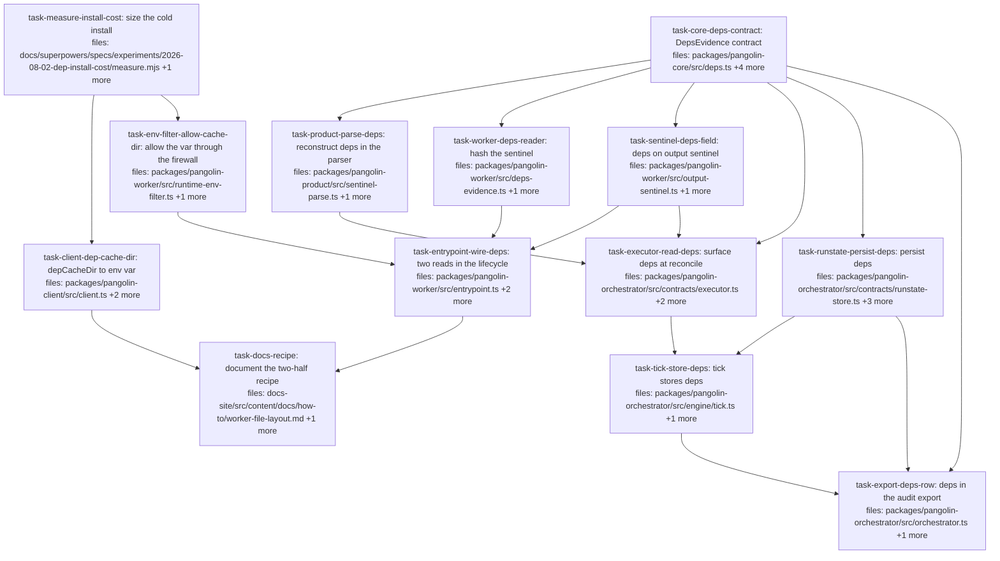

## Context

Implements [`../specs/2026-08-02-dependency-cache-and-evidence-design.md`](../specs/2026-08-02-dependency-cache-and-evidence-design.md).

**Two drivers** (KNOWN-ISSUES 17): dispatched gates cannot run because the worker
has no toolchain, and installing per dispatch is slow because every dispatch gets
a fresh container and therefore a cold store. 17b established the first already
works via `pangolin-setup.sh` plus an env-bundle PATH; this plan is for the
second, plus the audit evidence that makes a shared cache safe to trust.

**Pangolin adds two things and no more:** a path (`depCacheDir` →
`PANGOLIN_DEP_CACHE_DIR`) and an evidence sentinel. It learns no package manager
and owns no mount abstraction — the operator provisions and mounts the cache
out-of-band, which is what makes read-only and per-target scoping kernel-enforced
rather than honour-system (spec §5.2, §5.3).

**A design correction was made during authoring, and it shapes the whole DAG.**
The spec originally sealed dependency evidence into `DispatchExecutorManifest`.
That is unimplementable: the manifest is built at **fire time**
(`executors/dispatch.ts:141`), immediately after `client.dispatch.fire()`, when
the worker has not yet run setup or the agent. Evidence therefore travels as a
**fourth sibling of `patchRef` / `verify` / `outputs`** on the output sentinel,
down the reconcile path `verify` already uses.

**That route passes through three files a first draft of this plan did not own**,
and gate-2 audit found all three. They are now owned: `pangolin-core/src/product.ts`
declares `OutputSentinel`; `pangolin-product/src/sentinel-parse.ts` is a
hostile-input allowlist reconstructor that rebuilds six named fields and **drops
everything else**, so an unowned `deps` would be silently discarded on every
orchestrator-side read; and `orchestrator/src/contracts/types.ts` declares
`ItemState`. `verify`'s own route required exactly these files.

**`task-measure-install-cost` is a decision gate, not a formality.** Spec §8
records that no measurement yet shows the cache beats a warm in-VPC registry. It
gates the transport tasks by `depends_on` deliberately, and each gated task body
inlines the stop condition — an ordering edge alone tells an implementer nothing
about what a "don't build" verdict looks like. The evidence branch is independent
of that outcome and runs in parallel.

**Scope note.** Nothing here verifies dependencies. The sealed tier is the
literal `'recorded'` and must never be described as attested: the sentinel is
written inside the workspace, in the same environment the agent runs in, so an
agent can forge it (spec §5.4). This is the same trust level as `VerifyOutcome`.

**Known limit, accepted (audit D8).** When one of the two evidence reads succeeds
and the other does not, the field is omitted entirely rather than reported
asymmetrically — because spec §4.2 types `atSetup` and `atFinish` as required
strings. The plan's guarantee is therefore narrower than "a mid-run `pnpm add` is
always visible": **changes to an existing sentinel are visible.** Closing the gap
fully means making `atSetup` optional, which is a spec §4.2 amendment and outside
what a plan may decide.

## Tasks

## Task: size the cold install against the setup timeout

```yaml
id: task-measure-install-cost
depends_on: []
files:
  - docs/superpowers/specs/experiments/2026-08-02-dep-install-cost/measure.mjs
  - docs/superpowers/specs/experiments/2026-08-02-dep-install-cost/README.md
status: pending
```

The decision gate for the transport half (spec §8). Measures a cold `pnpm install`
of this repo's own lockfile inside the real worker image against the 120 s
`PANGOLIN_SETUP_TIMEOUT_SECONDS` default. Mirrors `scripts/verify-patch-capture-env.mjs`,
which carries the positive-control idiom this repo already uses: framework-free,
and it must **fail loudly rather than skip** when Docker is absent.

## Implementation

```javascript
// docs/superpowers/specs/experiments/2026-08-02-dep-install-cost/measure.mjs
import { spawn } from 'node:child_process';
const IMAGE = process.env.PANGOLIN_WORKER_IMAGE ?? 'ghcr.io/quarrysystems/pangolin-worker:main';
const SETUP_TIMEOUT_DEFAULT = 120;
const fail = (why) => { console.error(`FAIL: ${why}`); process.exit(1); };

function docker(args) {
  return new Promise((res) => {
    const c = spawn('docker', args);
    let out = '';
    c.stdout.on('data', (d) => (out += d));
    c.stderr.on('data', (d) => (out += d));
    c.on('error', () => fail('docker is not available — this measurement must never skip'));
    c.on('exit', (code) => res({ code, out }));
  });
}

// The workspace reaches the container by bind mount: pnpm-workspace.yaml, every
// member package.json, and pnpm-lock.yaml. pnpm itself is installed in an
// UNTIMED region, so the number measures the install and not the toolchain.
async function armFull(repoRoot) {
  const { code, out } = await docker([
    'run', '--rm', '-v', `${repoRoot}:/w:ro`, '--entrypoint', '/bin/bash', IMAGE, '-c',
    'export NPM_CONFIG_PREFIX="$HOME/.npm-global"; mkdir -p "$NPM_CONFIG_PREFIX";' +
    ' npm i -g pnpm --silent >/dev/null 2>&1 || exit 3;' +          // untimed
    ' export PATH="$NPM_CONFIG_PREFIX/bin:$PATH"; cp -r /w /build && cd /build;' +
    ' S=$(date +%s); pnpm install --frozen-lockfile >/dev/null 2>&1 || exit 4;' +
    ' echo "elapsed_seconds:$(( $(date +%s) - S ))";' +
    ' test -d node_modules/.pnpm && echo "store_populated:yes"',
  ]);
  if (code !== 0) fail(`full arm: docker run exited ${code} — a failed install is NOT a measurement`);
  if (!/store_populated:yes/.test(out)) fail('full arm: node_modules/.pnpm absent — install produced nothing');
  const m = /elapsed_seconds:(\d+)/.exec(out);
  if (!m) fail(`full arm produced no timing; output: ${out.slice(0, 300)}`);
  const secs = Number(m[1]);
  if (secs > SETUP_TIMEOUT_DEFAULT) console.log(`EXCEEDS_SETUP_TIMEOUT ${secs} > ${SETUP_TIMEOUT_DEFAULT}`);
  return secs;
}
```

```sh
# Failing check BEFORE the script exists, and the shape it must keep afterwards:
# with docker unavailable it exits NON-ZERO rather than reporting a pass.
$ node docs/superpowers/specs/experiments/2026-08-02-dep-install-cost/measure.mjs --arm=full
FAIL: docker is not available — this measurement must never skip
$ echo $?
1
```

## Acceptance criteria

- `--arm=toolchain` prints an integer `elapsed_seconds` and exits 0 against the
  real image. A hand measurement already put this at **2 seconds**, so a result
  above 30 s means the arm is measuring the wrong thing.
- `--arm=full` exits **non-zero** when `docker run` exits non-zero, and
  **non-zero** when `node_modules/.pnpm` is absent afterwards. A `pnpm install`
  that failed must not be able to produce a number — that is the whole point of
  the gate, and it is the defect this criterion exists to prevent.
- `--arm=full` on success prints an integer `elapsed_seconds`, and additionally
  prints `EXCEEDS_SETUP_TIMEOUT <n> > 120` when that integer exceeds 120.
- With `docker` absent the script exits non-zero with the `must never skip`
  diagnostic. This is the positive-control pairing: a harness that can silently
  report nothing is the failure mode this task exists to avoid.
- `README.md` records both integers, the image digest measured, and a verdict
  line that is exactly one of `cache-justified` or `cache-not-justified`, naming
  which number it compared against 120.

Test file: `docs/superpowers/specs/experiments/2026-08-02-dep-install-cost/measure.mjs`
is itself the executable check (mirrors `scripts/verify-patch-capture-env.mjs`,
which is likewise self-verifying and framework-free — vitest is not in the image).

## Task: core contract for dependency evidence

```yaml
id: task-core-deps-contract
depends_on: []
files:
  - packages/pangolin-core/src/deps.ts
  - packages/pangolin-core/src/index.ts
  - packages/pangolin-core/src/audit.ts
  - packages/pangolin-core/src/product.ts
  - packages/pangolin-core/test/deps.test.ts
status: pending
quality_reviewer_hint: opus
```

Defines `DepsEvidence` as a sibling of `VerifyOutcome` (`core/src/verify.ts`),
declares it on `OutputSentinel` (`core/src/product.ts`, which is where that
interface actually lives), and exposes it on `AuditItemOutcome`. The `'recorded'`
tier literal is the load-bearing part: spec §5.4 forbids ever describing this
evidence as attested.

## Implementation

```typescript
// packages/pangolin-core/src/deps.ts
/**
 * Dependency evidence a dispatch reports about itself.
 *
 * `tier` is deliberately a single-member union rather than a free string. The
 * sentinel is written inside the workspace, in the same environment the agent
 * runs in, so an agent can forge it — this is RECORDED, never attested. Widening
 * this union is a security decision, not a typing convenience.
 *
 * `atSetup` / `atFinish` are sha256 of the canonicalised `.pangolin/deps.json`
 * observed after the setup script and after the agent block.
 */
export interface DepsEvidence {
  atSetup: string;
  atFinish: string;
  tier: 'recorded';
}
```

```typescript
// packages/pangolin-core/test/deps.test.ts
import type { DepsEvidence } from '../src/deps.js';
import { it, expect } from 'vitest';

it('a differing pre/post pair is representable — the mid-run change case', () => {
  const e: DepsEvidence = { atSetup: 'sha256:aaa', atFinish: 'sha256:bbb', tier: 'recorded' };
  expect(e.atSetup).not.toBe(e.atFinish);
  expect(e.tier).toBe('recorded');
});
```

## Acceptance criteria

- `DepsEvidence` is exported from `packages/pangolin-core/src/index.ts` and
  importable as `import type { DepsEvidence } from '@quarry-systems/pangolin-core'`.
- `OutputSentinel` in `packages/pangolin-core/src/product.ts` gains an optional
  `deps?: DepsEvidence`, declared beside its existing `verify` field.
- `AuditItemOutcome` in `audit.ts` gains an optional `deps?: DepsEvidence`, whose
  doc comment states the row carries a self-reported value, mirroring the note
  added for `verify` in #144.
- A `@ts-expect-error` line pins that `tier: 'attested'` does not typecheck.
  **This is documentation-grade, not build-enforced** — `pangolin-core`'s
  `tsconfig.json` includes only `src/**/*` and the package has no `typecheck:test`
  script, so the idiom matches the existing unenforced usage at
  `test/refs.test.ts:7-8`. The literal itself IS enforced by `pnpm -r typecheck`
  at every `src/` assignment site, of which this plan creates five.
- Every pre-existing `pangolin-core` test still passes unmodified.

Test file: `packages/pangolin-core/test/deps.test.ts`.

## Task: reconstruct deps in the product sentinel parser

```yaml
id: task-product-parse-deps
depends_on: [task-core-deps-contract]
files:
  - packages/pangolin-product/src/sentinel-parse.ts
  - packages/pangolin-product/test/sentinel-parse.test.ts
status: pending
quality_reviewer_hint: opus
```

`parseOutputSentinel` is a hostile-input allowlist reconstructor: it rebuilds
`patchRef`, `summary`, `verify`, `outputs`, `usage` and `blocks` by hand from
type-guarded reads and **discards every other field**. Without a `buildDeps`
counterpart, `deps` is silently dropped on every orchestrator-side read no matter
what the worker writes — the entire evidence chain would be inert while every
other task passed.

## Implementation

```typescript
// packages/pangolin-product/src/sentinel-parse.ts — mirroring buildVerify (:31-41)
function buildDeps(raw: unknown): DepsEvidence | undefined {
  if (typeof raw !== 'object' || raw === null) return undefined;
  const r = raw as Record<string, unknown>;
  // Every field type-guarded individually; a partial object yields undefined
  // rather than a half-built one. `tier` must be the exact literal.
  if (typeof r.atSetup !== 'string' || typeof r.atFinish !== 'string') return undefined;
  if (r.tier !== 'recorded') return undefined;
  return { atSetup: r.atSetup, atFinish: r.atFinish, tier: 'recorded' };
}
// ...and in the reconstructor, beside the existing verify line:
//   const deps = buildDeps(parsed.deps);
//   if (deps) out.deps = deps;
```

```typescript
// packages/pangolin-product/test/sentinel-parse.test.ts
it('reconstructs deps from a well-formed sentinel', () => {
  const r = parseOutputSentinel(JSON.stringify({
    patchRef: 'pangolin://ns/p/sha256:a',
    deps: { atSetup: 'sha256:a', atFinish: 'sha256:b', tier: 'recorded' },
  }));
  // Positive control: a sibling field survived the same parse, so a missing
  // `deps` below would mean buildDeps failed rather than the parse failing.
  expect(r.status).toBe('ok');
  expect(r.sentinel.patchRef).toBe('pangolin://ns/p/sha256:a');
  expect(r.sentinel.deps).toEqual({ atSetup: 'sha256:a', atFinish: 'sha256:b', tier: 'recorded' });
});
```

## Acceptance criteria

- A well-formed `deps` object survives `parseOutputSentinel` deep-equal, asserted
  alongside a sibling field (`patchRef`) from the same parse as the control.
- Each of these yields `sentinel.deps === undefined` while the sibling `patchRef`
  still parses: `deps` absent; `deps: null`; `deps: "string"`; `atSetup` missing;
  `atFinish` a number; `tier: 'attested'`; `tier` absent. The surviving sibling in
  every case is what distinguishes a rejected field from a rejected document.
- A `deps` object carrying **extra** unknown keys parses to exactly the three
  declared fields — the reconstructor copies named fields, never spreads.
- Every pre-existing `sentinel-parse.test.ts` case passes unmodified, including
  the hostile-input matrix for `verify` and `outputs`.

Test file: `packages/pangolin-product/test/sentinel-parse.test.ts`.

## Task: surface depCacheDir as a dispatch env var

```yaml
id: task-client-dep-cache-dir
depends_on: [task-measure-install-cost]
files:
  - packages/pangolin-client/src/client.ts
  - packages/pangolin-client/src/dispatch.ts
  - packages/pangolin-client/test/dep-cache-dir.test.ts
status: pending
```

Adds `depCacheDir?: string` to `TargetConfig` (`client.ts:24`) and emits it as
`PANGOLIN_DEP_CACHE_DIR` alongside the other `PANGOLIN_*` vars (`dispatch.ts:285`).

**Before implementing, read `docs/superpowers/specs/experiments/2026-08-02-dep-install-cost/README.md`.
If its verdict line is `cache-not-justified`, stop and do not implement — report
that back so the controller marks this task `skipped`.** The `depends_on` edge is
ordering only; this sentence is what makes the gate binding.

## Implementation

```typescript
// packages/pangolin-client/src/client.ts — on TargetConfig
export interface TargetConfig {
  compute: string;
  credentials: string;
  secretStore?: string;
  defaultResources?: { cpu?: number; memory?: number };
  /**
   * Absolute in-container path of an OPERATOR-PROVISIONED dependency cache.
   * Pangolin neither creates nor manages the mount — it cannot, since ECS
   * RunTask cannot add volumes — it only tells the dispatch where to look.
   * The mount is untrusted: read-only and per-target scoping are the operator's
   * mount flags (spec §5.2, §5.3).
   */
  depCacheDir?: string;
}
```

```typescript
// packages/pangolin-client/test/dep-cache-dir.test.ts
// Idiom per packages/pangolin-client/test/dispatch-model.test.ts:100-159 — a stub
// ComputeProvider capturing TaskSpec.env from a real fire(). There is no
// `buildWorkerEnv` symbol in this repo; the env is only observable this way.
it('omits PANGOLIN_DEP_CACHE_DIR entirely when the target sets no depCacheDir', async () => {
  const { captured } = await fireWithStubCompute({ target: { compute: 'c', credentials: 'r' } });
  // Positive control: the builder ran and produced sibling vars.
  expect(captured.env.PANGOLIN_DISPATCH_ID).toBeDefined();
  expect('PANGOLIN_DEP_CACHE_DIR' in captured.env).toBe(false);
});
```

## Acceptance criteria

- A target with `depCacheDir: '/var/cache/pangolin-deps'` produces
  `TaskSpec.env.PANGOLIN_DEP_CACHE_DIR === '/var/cache/pangolin-deps'`, captured
  from a real `fire()` through a stub `ComputeProvider`, asserted alongside a
  sibling `PANGOLIN_*` var proving the env builder ran.
- A target without `depCacheDir` produces a `TaskSpec.env` where
  `'PANGOLIN_DEP_CACHE_DIR' in env` is `false` — absent, not `undefined`.
- Setting `depCacheDir` on `DispatchWork` or a work item's `inputs` does **not**
  reach `TaskSpec.env`, while the target-config value in the same test does —
  the target is the only source, mirroring the existing rule that target and
  workerImage come only from executor config.
- Every pre-existing `pangolin-client` test still passes unmodified.

Test file: `packages/pangolin-client/test/dep-cache-dir.test.ts`.

## Task: allow the cache-dir var through the env firewall

```yaml
id: task-env-filter-allow-cache-dir
depends_on: [task-measure-install-cost]
files:
  - packages/pangolin-worker/src/runtime-env-filter.ts
  - packages/pangolin-worker/test/runtime-env-filter.test.ts
status: pending
```

`filterRuntimeEnv` is default-deny and drops every `PANGOLIN_*` var, so
`PANGOLIN_DEP_CACHE_DIR` never reaches the setup script or the agent without an
explicit entry. Adds it to `BUILTIN_ALLOW_ADAPTER_CONFIG` **by exact name** — the
file's own rule at `:51-54` forbids a `PANGOLIN_` prefix rule, because
`PANGOLIN_CALLBACK_TOKEN_REF` is also a `PANGOLIN_` var and a prefix rule would
re-open the whole firewall.

**Before implementing, read `docs/superpowers/specs/experiments/2026-08-02-dep-install-cost/README.md`.
If its verdict line is `cache-not-justified`, stop and do not implement — report
that back so the controller marks this task `skipped`.**

## Implementation

```typescript
// packages/pangolin-worker/src/runtime-env-filter.ts
const BUILTIN_ALLOW_ADAPTER_CONFIG: ReadonlyArray<string> = [
  'PANGOLIN_CLAUDE_PERMISSION_MODE',
  'PANGOLIN_DISABLE_NEEDS_INPUT_HELPER',
  // Non-credential: an absolute path to an operator-provisioned cache mount.
  // EXACT NAME, never a prefix rule — see the header rule above.
  'PANGOLIN_DEP_CACHE_DIR',
];
```

```typescript
// packages/pangolin-worker/test/runtime-env-filter.test.ts
it('passes PANGOLIN_DEP_CACHE_DIR while still dropping the credential refs', () => {
  const out = filterRuntimeEnv({
    PANGOLIN_DEP_CACHE_DIR: '/var/cache/pangolin-deps',
    PANGOLIN_CALLBACK_TOKEN_REF: 'arn:...:hmac',
    PANGOLIN_DISPATCH_ID: 'd-1',
  });
  expect(out.PANGOLIN_DEP_CACHE_DIR).toBe('/var/cache/pangolin-deps');
  expect(out).not.toHaveProperty('PANGOLIN_CALLBACK_TOKEN_REF');
  expect(out).not.toHaveProperty('PANGOLIN_DISPATCH_ID');
});
```

## Acceptance criteria

- `filterRuntimeEnv` passes `PANGOLIN_DEP_CACHE_DIR` with no operator allow-list,
  in the same call that drops `PANGOLIN_CALLBACK_TOKEN_REF` and
  `PANGOLIN_DISPATCH_ID` — the two drops are the control proving default-deny is
  still in force and the passing var is not an artifact of a disabled filter.
- The hard-deny set added in #141 still wins: with `allow: ['*']`,
  `PANGOLIN_DEP_CACHE_DIR` passes while `AWS_SECRET_ACCESS_KEY` and
  `PANGOLIN_CALLBACK_TOKEN_REF` do not.
- The entry is an exact name in `BUILTIN_ALLOW_ADAPTER_CONFIG`, not a prefix rule:
  a sibling var `PANGOLIN_DEP_CACHE_DIR_EXTRA` is **dropped**, while
  `PANGOLIN_DEP_CACHE_DIR` in the same call passes.
- All 14 pre-existing `runtime-env-filter.test.ts` cases pass unmodified,
  including the four hard-deny cases added in #141.

Test file: `packages/pangolin-worker/test/runtime-env-filter.test.ts`.

## Task: hash the dependency sentinel

```yaml
id: task-worker-deps-reader
depends_on: [task-core-deps-contract]
files:
  - packages/pangolin-worker/src/deps-evidence.ts
  - packages/pangolin-worker/test/deps-evidence.test.ts
status: pending
```

Reads `.pangolin/deps.json` and returns a **discriminated result** — the caller
needs to distinguish "no evidence offered" from "evidence offered but unusable",
because spec §9.6 requires the second to be logged while neither fails the
dispatch. Canonicalises with `canonicalJsonString` from `@quarry-systems/pangolin-core`
(`content-hash.ts:69`), which is key-order insensitive; `JSON.stringify(JSON.parse(…))`
is **not** and would report spurious mid-run changes.

## Implementation

```typescript
// packages/pangolin-worker/src/deps-evidence.ts
import { readFile } from 'node:fs/promises';
import { createHash } from 'node:crypto';
import { join } from 'node:path';
import { canonicalJsonString } from '@quarry-systems/pangolin-core';

const MAX_BYTES = 64 * 1024;

export type DepsEvidenceRead =
  | { kind: 'ok'; hash: string }
  | { kind: 'absent' }
  | { kind: 'unusable'; reason: string };

/**
 * NEVER throws. Unlike the needs_input sentinel (malformed ⇒ `worker-failed`) and
 * the setup script (a hard failure by design), neither the run's success nor its
 * correctness depends on this evidence — so an unusable sentinel is reported as
 * such and logged by the caller, not raised.
 */
export async function readDepsEvidence(workspaceDir: string): Promise<DepsEvidenceRead> {
  let raw: Buffer;
  try {
    raw = await readFile(join(workspaceDir, '.pangolin', 'deps.json'));
  } catch {
    return { kind: 'absent' };
  }
  if (raw.byteLength > MAX_BYTES) return { kind: 'unusable', reason: `oversized: ${raw.byteLength}B` };
  try {
    const canonical = canonicalJsonString(JSON.parse(raw.toString('utf8')));
    return { kind: 'ok', hash: `sha256:${createHash('sha256').update(canonical).digest('hex')}` };
  } catch (err) {
    return { kind: 'unusable', reason: `unparseable: ${(err as Error).message}` };
  }
}
```

```typescript
// packages/pangolin-worker/test/deps-evidence.test.ts
it('is insensitive to key order — the same evidence hashes identically', async () => {
  const a = await readInWorkspaceWith('{"ecosystem":"pnpm","packageCount":2}');
  const b = await readInWorkspaceWith('{"packageCount":2,"ecosystem":"pnpm"}');
  // Positive control: both produced a real hash, so equality is not two failures.
  expect(a).toEqual({ kind: 'ok', hash: expect.stringMatching(/^sha256:[0-9a-f]{64}$/) });
  expect(a).toEqual(b);
});
```

## Acceptance criteria

- Two sentinels with identical content but **different key order** return
  `kind: 'ok'` with the same hash. Both hashes match
  `/^sha256:[0-9a-f]{64}$/` — the shape assertion is the control proving neither
  was a failure result. This is the case `JSON.stringify(JSON.parse(…))` fails.
- Two sentinels differing in any value return `kind: 'ok'` with **different**
  hashes, asserted with the same shape check on both.
- An absent file returns exactly `{ kind: 'absent' }`.
- A non-JSON body and a body larger than 64 KiB each return `kind: 'unusable'`
  with a non-empty `reason`, **and neither throws** — asserted with
  `await expect(...).resolves.toMatchObject({ kind: 'unusable' })` so a rejection
  fails rather than passing as a falsy value.
- A valid sentinel read in the same test file returns `kind: 'ok'`: the positive
  control distinguishing "correctly classified" from "the reader is broken".

Test file: `packages/pangolin-worker/test/deps-evidence.test.ts`.

## Task: carry deps on the output sentinel

```yaml
id: task-sentinel-deps-field
depends_on: [task-core-deps-contract]
files:
  - packages/pangolin-worker/src/output-sentinel.ts
  - packages/pangolin-worker/test/output-sentinel.test.ts
status: pending
```

Threads `deps` through `writeSentinel`'s options and onto the written
`.pangolin/output.json`, beside `patchRef`, `verify` and `outputs`. **The
`OutputSentinel` interface is NOT declared here** — it lives in
`packages/pangolin-core/src/product.ts` and is owned by `task-core-deps-contract`;
this task only adds the option and the assignment.

## Implementation

```typescript
// packages/pangolin-worker/src/output-sentinel.ts — options + assignment only
export interface WriteSentinelOpts {
  patchRef?: string;
  verify?: VerifyOutcome;
  deps?: DepsEvidence;   // declared on OutputSentinel in pangolin-core/src/product.ts
  // ...existing fields unchanged
}

// beside the existing `if (verify !== undefined) sentinel.verify = verify;`
if (deps !== undefined) sentinel.deps = deps;
```

```typescript
// packages/pangolin-worker/test/output-sentinel.test.ts
it('omits deps from the written sentinel when none was supplied', async () => {
  const written = JSON.parse(await writeAndReadBack({ verify: { passed: true } }));
  // Positive control: the writer ran and emitted its sibling field.
  expect(written.verify).toEqual({ passed: true });
  expect('deps' in written).toBe(false);
});
```

## Acceptance criteria

- A sentinel written with `deps: { atSetup: 'sha256:a', atFinish: 'sha256:b', tier: 'recorded' }`
  round-trips that exact object through `JSON.parse` of the written file.
- A sentinel written without `deps` has no `deps` key — `'deps' in parsed` is
  `false` — asserted alongside a sibling field that IS present.
- `patchRef`, `verify` and `outputs` still round-trip unchanged when `deps` is
  present, so the new field displaces nothing.
- This task adds no `interface OutputSentinel` declaration:
  `grep -c 'interface OutputSentinel' packages/pangolin-worker/src/output-sentinel.ts`
  returns 0, since the declaration is owned by `pangolin-core/src/product.ts`.
- Every pre-existing `output-sentinel.test.ts` case passes unmodified.

Test file: `packages/pangolin-worker/test/output-sentinel.test.ts`.

## Task: wire the two evidence reads into the worker lifecycle

```yaml
id: task-entrypoint-wire-deps
depends_on: [task-worker-deps-reader, task-sentinel-deps-field, task-env-filter-allow-cache-dir]
files:
  - packages/pangolin-worker/src/entrypoint.ts
  - packages/pangolin-worker/src/pipeline-runner.ts
  - packages/pangolin-worker/test/entrypoint-deps.test.ts
status: pending
is_wiring_task: true
```

Reads evidence twice and forwards both to the sentinel writer. **Both reads live
in this one task deliberately** — the `atSetup` read is in `entrypoint.ts` after
step 9, but the `atFinish` read must happen in `pipeline-runner.ts` immediately
before its auto-append seal (`:490`), which is where the sentinel is actually
written. Splitting them is the half-owned requirement that leaves `atFinish`
homeless.

```typescript
// packages/pangolin-worker/src/entrypoint.ts — after step 9, before captureBaseline.
// NOTE: the local is `depsAtSetup`. The identifier `deps` is RESERVED for
// runWorker's own `deps: RunWorkerDeps` parameter throughout this function.
const depsAtSetup = await readDepsEvidence(workspaceDir);
if (depsAtSetup.kind === 'unusable') {
  logger.log({ kind: 'deps.evidence.unusable', phase: 'setup', reason: depsAtSetup.reason });
}
// ...threaded into runPipeline's ctx; pipeline-runner reads atFinish before its seal.
```

## Acceptance criteria

- Through a full `runWorker` lifecycle with a `.pangolin/deps.json` present before
  the agent runs and **unchanged** by it, the written sentinel carries
  `deps.atSetup === deps.atFinish` and `deps.tier === 'recorded'`.
- Through a lifecycle where the stub adapter **rewrites** `.pangolin/deps.json`,
  the sentinel carries `deps.atSetup !== deps.atFinish`, with both values matching
  `/^sha256:[0-9a-f]{64}$/` — the shape check distinguishes this from two failed
  reads.
- Through a lifecycle with no `.pangolin/deps.json` at any point, the sentinel has
  no `deps` key **and** the dispatch exits 0 emitting `dispatch.finished`. The
  completed dispatch separates "evidence correctly absent" from "the worker
  crashed before writing".
- Where exactly one of the two reads yields `kind: 'ok'`, the sentinel has no
  `deps` key and the dispatch still completes — the accepted asymmetric-null limit
  recorded in Context, pinned so a later change to it is deliberate.
- An unusable sentinel at either phase emits a `deps.evidence.unusable` log entry
  carrying a non-empty `reason`, and the dispatch still exits 0.
- The `atSetup` read happens **after** the setup script: a `deps.json` written by
  `pangolin-setup.sh` is observed in `atSetup`. Asserted through the real
  lifecycle, not a synthetic env object — every existing `runWorker` call site in
  tests passes a synthetic object, so a test written the usual way is vacuous.
- With `PANGOLIN_DEP_CACHE_DIR` set in `h.env`, a `pangolin-setup.sh` that echoes
  `$PANGOLIN_DEP_CACHE_DIR` into a workspace file observes the value — **paired
  with `PATH` (a `BUILTIN_ALLOW` member) as the positive control**, so an empty
  result is not an empty env. POSIX-gate with the `itPosix` idiom at
  `setup-script.test.ts:30`. This discharges spec §9.2.
- `grep -c 'const deps' packages/pangolin-worker/src/entrypoint.ts` returns 0 —
  no local shadows `runWorker`'s `deps: RunWorkerDeps` parameter.

Test file: `packages/pangolin-worker/test/entrypoint-deps.test.ts`.

## Task: surface deps at reconcile

```yaml
id: task-executor-read-deps
depends_on: [task-core-deps-contract, task-sentinel-deps-field, task-product-parse-deps]
files:
  - packages/pangolin-orchestrator/src/contracts/executor.ts
  - packages/pangolin-orchestrator/src/executors/dispatch.ts
  - packages/pangolin-orchestrator/test/dispatch-sentinel-read.test.ts
status: pending
```

Adds `deps?: DepsEvidence` to `ExecutionResult` (`contracts/executor.ts:5`) and
surfaces it from `readSentinel` (`executors/dispatch.ts:225`) onto the reconcile
return, exactly as `verify` and `outputRefs` are at `:192-193`. Depends on
`task-product-parse-deps` because the sentinel is read through
`parseOutputSentinel`, which drops any field it does not explicitly rebuild.

## Implementation

```typescript
// packages/pangolin-orchestrator/src/executors/dispatch.ts — in readSentinel
const { patchRef, verify, deps, outputs } = res.sentinel;
if (patchRef) out.patchRef = patchRef;
if (verify) out.verify = verify;
if (deps) out.deps = deps;
// ...and on the reconcile return, alongside its siblings:
return { status, output: result, resultRef: patchRef, verify, deps, outputRefs };
```

```typescript
// packages/pangolin-orchestrator/test/dispatch-sentinel-read.test.ts
it('surfaces deps from the sentinel onto the reconcile result', async () => {
  const res = await reconcileWithSentinel({
    patchRef: 'pangolin://ns/p/sha256:a',
    deps: { atSetup: 'sha256:a', atFinish: 'sha256:b', tier: 'recorded' },
  });
  // Positive control: a sibling field came through the same read.
  expect(res.resultRef).toBe('pangolin://ns/p/sha256:a');
  expect(res.deps).toEqual({ atSetup: 'sha256:a', atFinish: 'sha256:b', tier: 'recorded' });
});
```

## Acceptance criteria

- A sentinel carrying `deps` yields a reconcile result whose `deps` deep-equals
  it, asserted alongside `resultRef` from the same read as the control.
- A sentinel with no `deps` yields a reconcile result where
  `result.deps === undefined`, asserted alongside `resultRef` being defined from
  the same read.
- `readSentinel` returns `{}` for an absent sentinel and for a malformed one —
  the existing `.catch(() => ({ status: 'absent' }))` posture is preserved.
- A reconcile over an **exit-code-0** dispatch whose sentinel is absent returns a
  status and does not throw. The zero exit matters: `readSentinel` is called only
  inside `if (status === 'done')` (`dispatch.ts:190-196`), so a non-zero-exit test
  would satisfy this criterion without ever reaching the sentinel path.
- Every pre-existing `dispatch-sentinel-read.test.ts` case passes unmodified.

Test file: `packages/pangolin-orchestrator/test/dispatch-sentinel-read.test.ts`.

## Task: persist deps in the run-state store

```yaml
id: task-runstate-persist-deps
depends_on: [task-core-deps-contract]
files:
  - packages/pangolin-orchestrator/src/contracts/runstate-store.ts
  - packages/pangolin-orchestrator/src/contracts/types.ts
  - packages/pangolin-orchestrator/src/runstate/sqlite.ts
  - packages/pangolin-orchestrator/test/runstate-deps.test.ts
status: pending
```

Adds `setDeps` to the `RunStateStore` contract (`runstate-store.ts:29-30`), the
`deps` field to `ItemState` (`contracts/types.ts`, beside its `verify`), and the
SQLite implementation plus migration entry — mirroring `setVerify`
(`sqlite.ts:264`) one-for-one.

## Implementation

```typescript
// packages/pangolin-orchestrator/src/contracts/runstate-store.ts
setDeps(itemId: string, deps: DepsEvidence): void; // persist self-reported dependency evidence
```

```typescript
// packages/pangolin-orchestrator/src/runstate/sqlite.ts — mirroring setVerify
setDeps(itemId: string, deps: DepsEvidence): void {
  this.db.prepare('UPDATE items SET deps = ? WHERE id = ?').run(JSON.stringify(deps), itemId);
}
```

```typescript
// packages/pangolin-orchestrator/test/runstate-deps.test.ts
import Database from 'better-sqlite3';
it('migrates a PRE-CHANGE database that has no deps column', () => {
  const file = join(tmpdir(), `rs-${Date.now()}.db`);
  const raw = new Database(file);                       // schema WITHOUT `deps`
  raw.exec('CREATE TABLE items (id TEXT PRIMARY KEY, runId TEXT, status TEXT, verify TEXT)');
  raw.close();
  const store = new SqliteRunStateStore(file);          // migrate() must add the column
  seedItem(store, 'i1');
  store.setDeps('i1', { atSetup: 'sha256:a', atFinish: 'sha256:b', tier: 'recorded' });
  expect(store.getItems('run-1').find((i) => i.id === 'i1')?.deps)
    .toEqual({ atSetup: 'sha256:a', atFinish: 'sha256:b', tier: 'recorded' });
});
```

## Acceptance criteria

- `ItemState` in `contracts/types.ts` gains `deps?: DepsEvidence` beside its
  existing `verify?: VerifyOutcome`, and `rowToItem` maps the column to it.
- `setDeps` then `getItems` round-trips the exact object including the
  `tier: 'recorded'` literal.
- An item never passed to `setDeps` reads back with `deps` undefined **while a
  sibling item in the same store that WAS set reads back non-undefined** — the
  sibling proves the read path works.
- **The migration is tested against a file-backed database created with the
  pre-change schema** — raw `better-sqlite3` `CREATE TABLE items (…)` without
  `deps`, closed, then reopened through `SqliteRunStateStore`. `:memory:` cannot
  express this, and this is the only form that goes red when the migration entry
  is missing.
- Every pre-existing SQLite run-state test passes unmodified.

Test file: `packages/pangolin-orchestrator/test/runstate-deps.test.ts`.

## Task: store deps on reconcile in tick

```yaml
id: task-tick-store-deps
depends_on: [task-executor-read-deps, task-runstate-persist-deps]
files:
  - packages/pangolin-orchestrator/src/engine/tick.ts
  - packages/pangolin-orchestrator/test/engine/tick-deps.test.ts
status: pending
is_wiring_task: true
```

Wires the reconcile result to the store, one line beside the existing `setVerify`
/ `setOutputRefs` calls (`tick.ts:110-111`) under the same `res.status === 'done'`
guard.

```typescript
// packages/pangolin-orchestrator/src/engine/tick.ts — beside its two siblings
if (res.status === 'done' && res.deps) store.setDeps(it.id, res.deps);
```

## Acceptance criteria

- A reconcile returning `status: 'done'` with `deps` produces exactly one
  `setDeps` call carrying that object, asserted with a spy that records one
  `setVerify` call in the same tick — the sibling call proves the branch ran.
- A reconcile returning a **non-done** terminal status with `deps` present
  produces zero `setDeps` calls, asserted with the same spy showing a status
  transition did occur, so the absence is not a tick that never ran.
- A reconcile returning `done` with no `deps` produces zero `setDeps` calls while
  `setVerify` is still called for the same item.
- Every pre-existing tick test passes unmodified.

Test file: `packages/pangolin-orchestrator/test/engine/tick-deps.test.ts`.

## Task: carry deps in the audit export

```yaml
id: task-export-deps-row
depends_on: [task-core-deps-contract, task-runstate-persist-deps, task-tick-store-deps]
files:
  - packages/pangolin-orchestrator/src/orchestrator.ts
  - packages/pangolin-orchestrator/test/orchestrator-audit-export.test.ts
status: pending
```

Adds `deps` to `getAuditExport`'s item rows with the same conditional spread as
its three siblings (`orchestrator.ts:488-491`), following the route `verify` took
in #144. Depends on `task-tick-store-deps` because every existing test in the
target file drives the real `tick()` loop rather than seeding the store directly,
so the export only observes `deps` once tick's wiring exists.

## Implementation

```typescript
// packages/pangolin-orchestrator/src/orchestrator.ts — in getAuditExport's map
...(i.outputRefs !== undefined ? { outputRefs: i.outputRefs } : {}),
...(i.verify !== undefined ? { verify: i.verify } : {}),
...(i.deps !== undefined ? { deps: i.deps } : {}),
```

```typescript
// packages/pangolin-orchestrator/test/orchestrator-audit-export.test.ts
it('audit export items carry deps when the dispatch reported them', async () => {
  const exp = await runToCompletionWithDeps({ atSetup: 'sha256:a', atFinish: 'sha256:b', tier: 'recorded' });
  expect(exp.items.find((i) => i.id === 'step-a')!.deps)
    .toEqual({ atSetup: 'sha256:a', atFinish: 'sha256:b', tier: 'recorded' });
});
```

## Acceptance criteria

- An item whose dispatch reported deps has them in `getAuditExport().items`,
  deep-equal to what was stored.
- An item with no deps has no `deps` key — `'deps' in outcome` is `false` —
  asserted on a run that DID complete and produced a populated item row.
- A `deps` whose `atSetup !== atFinish` survives the export unchanged: the
  mid-run-change signal is not normalised away.
- Every pre-existing `getAuditExport` test still passes unmodified.

Test file: `packages/pangolin-orchestrator/test/orchestrator-audit-export.test.ts`.

## Task: document the two-half toolchain recipe

```yaml
id: task-docs-recipe
depends_on: [task-client-dep-cache-dir, task-entrypoint-wire-deps]
files:
  - docs-site/src/content/docs/how-to/worker-file-layout.md
  - docs-site/src/content/docs/explanation/threat-model.md
status: pending
```

Documents the toolchain recipe, the `.pangolin/deps.json` contract, and the
`depCacheDir` mount (spec §7). Both halves of the recipe must appear together:
either alone silently yields a worker with no usable toolchain — the install half
fails loudly at setup, the PATH half fails as `command not found` at agent time.

## Implementation

```markdown
<!-- how-to/worker-file-layout.md -->
## Recipe: install a package manager and point it at a cache

Half one — `pangolin-setup.sh`. The worker runs as uid 1000 and npm's global
prefix is root-owned, so `npm i -g` fails with EACCES; install into `$HOME`:

    export NPM_CONFIG_PREFIX="$HOME/.npm-global"
    mkdir -p "$NPM_CONFIG_PREFIX"
    npm i -g pnpm --silent

Half two — an **env bundle** must set `PATH` to include
`/home/pangolin/.npm-global/bin`. The setup script is a separate process, so its
own `export PATH` does not survive to the agent.

Locally, mount a cache with the provider's existing `extraBinds` option:
`extraBinds: ['/host/cache:/var/cache/pangolin-deps:ro']`.
```

```markdown
<!-- explanation/threat-model.md — new section -->
### Dependency evidence is recorded, not attested

`.pangolin/deps.json` is written inside the workspace, in the same environment the
agent runs in, so an agent can forge it; the worker seals whatever it reads. Same
trust level as a worker's self-verify result. The cache itself is untrusted and
contributes no assurance: read-only mounting and per-target scoping are the
operator's mount configuration.
```

## Acceptance criteria

- The `worker-file-layout` recipe shows **both** halves — the
  `NPM_CONFIG_PREFIX`-into-`$HOME` install and the env-bundle `PATH` — and states
  in one sentence that either alone leaves the toolchain unusable.
- The recipe documents `.pangolin/deps.json`: its exact path, the §4.2 example
  body, and that Pangolin only hashes it and treats its fields as opaque. Without
  this no consumer knows what filename to write, and the evidence branch is
  permanently unexercised.
- The recipe names the 120 s `PANGOLIN_SETUP_TIMEOUT_SECONDS` default, that
  exceeding it fails the dispatch with `worker-failed`, and shows `extraBinds`
  as the local/dev cache-mount path.
- `threat-model.md` gains a `Dependency evidence is recorded, not attested`
  section. Verify with `grep -A6 'recorded, not attested' docs-site/src/content/docs/explanation/threat-model.md`
  returning that section's body — a non-empty result is the control that it was
  written. **The pre-existing occurrences of `attested` at `threat-model.md:113`
  and `:123` are expected, correct, and out of scope — do not remove them.**
- The `depCacheDir` contract is documented as an operator-provisioned, untrusted
  mount that Pangolin does not create.
- `pnpm --filter docs-site build` succeeds.

Test file: `docs-site/src/content/docs/explanation/threat-model.md` is prose; the
check is the `grep` assertion above plus the docs build.

## Audit record

- **2026-08-03** · rev `e9531c67f1e3` · commit `ce913d0` · lenses: coverage,
  dag-integrity, grounding, charter, context-sufficiency, verifiability, coherence
  (7/7 dispatched, 7/7 ran — no gaps) · **NOT READY — 13 blocking**
  - Baseline for round two: **13 blocking, 795 lines**; resolutions would land it
    near 965. If round two returns ~13 again and the plan crosses ~1100 lines, stop
    auditing and build — 6 of 13 (B1, B2, B3, B5, B6) are compiler-detectable in
    the first hour.
  - Blocking clusters, resolved jointly (A–I): three unowned contract files
    (`pangolin-product/src/sentinel-parse.ts`, `pangolin-core/src/product.ts`,
    `orchestrator/src/contracts/types.ts`); the `atFinish` seal living in
    `pipeline-runner.ts` which no task owns; `PANGOLIN_DEP_CACHE_DIR` stripped by
    the worker's own default-deny env firewall; `extraBinds` already shipping;
    a missing `tick → export` edge; and four acceptance criteria that cannot fail.
  - Deferred, accepted (15): D6 `@ts-expect-error` has no enforcer in this repo —
    the `'recorded'` literal is still enforced at every `src/` assignment site, so
    the requirement is not lost, only its guard. D7 the `readDepsEvidence` "is
    logged" claim is unimplementable in its own stated signature — no branch breaks
    the build; folded into joint resolution B. D8 the asymmetric-null case defeats
    the plan's own headline mid-run-change scenario — **closing it fully is a spec
    §4.2 amendment (`atSetup` optional), which gate 2 may not make.**
  - Empirical unknowns opened: **E1** cold `pnpm install` vs the 120 s setup
    timeout — probe task `task-measure-install-cost` already exists and owns it;
    **E2** concurrent store access under dispatch concurrency — no owning task,
    deliberately, since read-only mounting makes it non-blocking here.
  - **`rev` durability caveat:** `git check-attr` reports `text: unspecified` and
    `eol: unspecified` for this path. `.gitattributes` pins only
    `examples/**/bundle.json -text`. On a Windows checkout with `core.autocrlf` on,
    this file can be rewritten CRLF and every hash moves, silently disabling the
    step-3 short-circuit. Fix is one line: `docs/superpowers/**/*.md text eol=lf`.
- **2026-08-03** · rev `c39b279e21bb` · lenses: none — NOT YET RE-AUDITED.
  Joint resolutions A–I applied as one change per cluster: +2 tasks
  (`task-product-parse-deps`, `task-env-filter-allow-cache-dir`), −1 task
  (`task-local-docker-binds`, dropped because `extraBinds` already ships), +5 files
  net, +3 edges net. D8 is now stated as an accepted limit in Context rather than
  left implicit. A re-audit should be diff-scoped per step 3.
