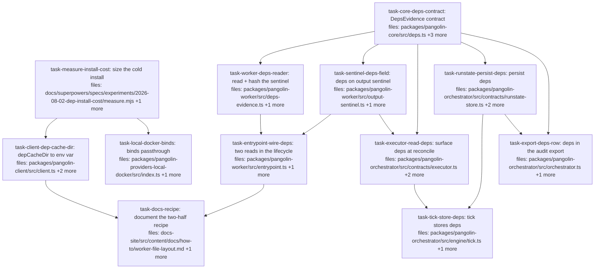

## Context

Implements [`../specs/2026-08-02-dependency-cache-and-evidence-design.md`](../specs/2026-08-02-dependency-cache-and-evidence-design.md).

**Two drivers** (KNOWN-ISSUES 17): dispatched gates cannot run because the worker
has no toolchain, and installing per dispatch is slow because every dispatch gets
a fresh container and therefore a cold store. 17b established the first already
works via `pangolin-setup.sh` plus an env-bundle PATH; this plan is for the
second, plus the audit evidence that makes a shared cache safe to trust.

**Pangolin adds two things and no more:** a path (`depCacheDir` →
`PANGOLIN_DEP_CACHE_DIR`) and an evidence sentinel. It learns no package manager
and owns no mount abstraction — the operator provisions and mounts the cache
out-of-band, which is what makes read-only and per-target scoping kernel-enforced
rather than honour-system (spec §5.2, §5.3).

**A design correction was made during authoring, and it shapes the whole DAG.**
The spec originally sealed dependency evidence into `DispatchExecutorManifest`.
That is unimplementable: the manifest is built at **fire time**
(`executors/dispatch.ts:141`), immediately after `client.dispatch.fire()`, when
the worker has not yet run setup or the agent. Evidence therefore travels as a
**fourth sibling of `patchRef` / `verify` / `outputs`** on the output sentinel,
down the reconcile path `verify` already uses. Tasks 5-11 are that route, and it
is why they mirror `verify`'s files one-for-one.

**`task-measure-install-cost` is a decision gate, not a formality.** Spec §8
records that no measurement yet shows the cache beats a warm in-VPC registry. It
gates the two transport tasks by `depends_on` deliberately: if a cold install is
already fast enough, `depCacheDir` and the binds passthrough should not be built
at all. The evidence branch is independent of that outcome — sealed dependency
provenance is worth having whether or not a cache exists — so it runs in
parallel.

**Scope note.** Nothing here verifies dependencies. The sealed tier is the
literal `'recorded'` and must never be described as attested: the sentinel is
written inside the workspace, in the same environment the agent runs in, so an
agent can forge it (spec §5.4). This is the same trust level as `VerifyOutcome`.

## Tasks

## Task: size the cold install against the setup timeout

```yaml
id: task-measure-install-cost
depends_on: []
files:
  - docs/superpowers/specs/experiments/2026-08-02-dep-install-cost/measure.mjs
  - docs/superpowers/specs/experiments/2026-08-02-dep-install-cost/README.md
status: pending
```

The decision gate for the transport half (spec §8). Measures a cold `pnpm install`
of this repo's own lockfile inside the real worker image, against the 120 s
`PANGOLIN_SETUP_TIMEOUT_SECONDS` default. Mirrors `scripts/verify-proc-exposure.mjs`:
framework-free, and it must **fail loudly rather than skip** when Docker is absent.

## Implementation

```javascript
// docs/superpowers/specs/experiments/2026-08-02-dep-install-cost/measure.mjs
// Arms: `toolchain` (install pnpm only) and `full` (pnpm install over the lockfile).
import { spawn } from 'node:child_process';

const IMAGE = process.env.PANGOLIN_WORKER_IMAGE ?? 'ghcr.io/quarrysystems/pangolin-worker:main';
const SETUP_TIMEOUT_DEFAULT = 120;

const fail = (why) => { console.error(`FAIL: ${why}`); process.exit(1); };

function docker(args) {
  return new Promise((res) => {
    const c = spawn('docker', args);
    let out = '';
    c.stdout.on('data', (d) => (out += d));
    c.stderr.on('data', (d) => (out += d));
    c.on('error', () => fail('docker is not available — this measurement must never skip'));
    c.on('exit', (code) => res({ code, out }));
  });
}

// Prints `elapsed_seconds:<N>`; the caller compares against SETUP_TIMEOUT_DEFAULT.
async function armToolchain() {
  const { out } = await docker(['run', '--rm', '--entrypoint', '/bin/bash', IMAGE, '-c',
    'S=$(date +%s); export NPM_CONFIG_PREFIX="$HOME/.npm-global"; mkdir -p "$NPM_CONFIG_PREFIX";' +
    ' npm i -g pnpm --silent >/dev/null 2>&1 || exit 3;' +
    ' echo "elapsed_seconds:$(( $(date +%s) - S ))"']);
  const m = /elapsed_seconds:(\d+)/.exec(out);
  if (!m) fail(`toolchain arm produced no timing; output was: ${out.slice(0, 300)}`);
  return Number(m[1]);
}
```

```sh
# Failing check BEFORE the script exists, and the shape it must keep afterwards:
# with docker unavailable it exits NON-ZERO rather than reporting a pass.
$ node docs/superpowers/specs/experiments/2026-08-02-dep-install-cost/measure.mjs
FAIL: docker is not available — this measurement must never skip
$ echo $?
1
```

## Acceptance criteria

- `--arm=toolchain` prints an integer `elapsed_seconds` and exits 0 against the
  real image. Run it: on the measurement already taken by hand this was **2
  seconds**, so a result above 30 s means the arm is measuring the wrong thing.
- `--arm=full` prints an integer `elapsed_seconds` for a cold `pnpm install` over
  this repo's `pnpm-lock.yaml`, and prints an explicit `EXCEEDS_SETUP_TIMEOUT`
  line when that integer is greater than 120.
- With `docker` absent the script exits **non-zero** and prints the
  `must never skip` diagnostic. This is the positive-control pairing for the two
  criteria above: a measurement harness that can silently report nothing is the
  failure this task exists to avoid.
- `README.md` records both numbers, the image digest measured, and a one-line
  verdict naming which of the two spec §4.1 transport tasks the numbers justify.

Test file: `docs/superpowers/specs/experiments/2026-08-02-dep-install-cost/measure.mjs`
is itself the executable check (mirrors `scripts/verify-proc-exposure.mjs`, which
is likewise self-verifying and framework-free — vitest is not in the worker image).

## Task: core contract for dependency evidence

```yaml
id: task-core-deps-contract
depends_on: []
files:
  - packages/pangolin-core/src/deps.ts
  - packages/pangolin-core/src/index.ts
  - packages/pangolin-core/src/audit.ts
  - packages/pangolin-core/test/deps.test.ts
status: pending
quality_reviewer_hint: opus
```

Defines `DepsEvidence` as a sibling of `VerifyOutcome` (`core/src/verify.ts`) and
exposes it on `AuditItemOutcome`. Carries the `'recorded'` tier literal, which is
the load-bearing part: spec §5.4 forbids ever describing this evidence as
attested.

## Implementation

```typescript
// packages/pangolin-core/src/deps.ts
/**
 * Dependency evidence a dispatch reports about itself.
 *
 * `tier` is deliberately a single-member union rather than a free string. The
 * sentinel is written inside the workspace, in the same environment the agent
 * runs in, so an agent can forge it — this is RECORDED, never attested. Widening
 * this union is a security decision, not a typing convenience.
 *
 * `atSetup` and `atFinish` are sha256 of the canonicalised `.pangolin/deps.json`
 * observed after the setup script and after the agent block. They differ exactly
 * when the dispatch changed its own dependency set mid-run.
 */
export interface DepsEvidence {
  atSetup: string;
  atFinish: string;
  tier: 'recorded';
}
```

```typescript
// packages/pangolin-core/test/deps.test.ts
import type { DepsEvidence } from '../src/deps.js';
import { it, expect } from 'vitest';

it('a differing pre/post pair is representable — the mid-run change case', () => {
  const e: DepsEvidence = { atSetup: 'sha256:aaa', atFinish: 'sha256:bbb', tier: 'recorded' };
  expect(e.atSetup).not.toBe(e.atFinish);
  expect(e.tier).toBe('recorded');
});
```

## Acceptance criteria

- `DepsEvidence` is exported from `packages/pangolin-core/src/index.ts` and
  importable as `import type { DepsEvidence } from '@quarry-systems/pangolin-core'`.
- `tier` is typed as the literal union `'recorded'` — assigning the string
  `'attested'` to it is a **compile error**, asserted with a `@ts-expect-error`
  line that fails the build if the error stops occurring.
- `AuditItemOutcome` gains an optional `deps?: DepsEvidence`, and its doc comment
  states that this row carries a self-reported value, mirroring the note added
  for `verify` in #144.
- Every pre-existing `pangolin-core` test still passes unmodified.

Test file: `packages/pangolin-core/test/deps.test.ts`.

## Task: surface depCacheDir as a dispatch env var

```yaml
id: task-client-dep-cache-dir
depends_on: [task-measure-install-cost]
files:
  - packages/pangolin-client/src/client.ts
  - packages/pangolin-client/src/dispatch.ts
  - packages/pangolin-client/test/dep-cache-dir.test.ts
status: pending
```

Adds `depCacheDir?: string` to `TargetConfig` (`client.ts:24`) and emits it as
`PANGOLIN_DEP_CACHE_DIR` alongside the other `PANGOLIN_*` vars
(`dispatch.ts:285`). Pangolin tells the dispatch **where** the cache is and does
nothing else (spec §4.1).

## Implementation

```typescript
// packages/pangolin-client/src/client.ts — on TargetConfig
export interface TargetConfig {
  compute: string;
  credentials: string;
  secretStore?: string;
  defaultResources?: { cpu?: number; memory?: number };
  /**
   * Absolute in-container path of an OPERATOR-PROVISIONED dependency cache.
   * Pangolin neither creates nor manages the mount — it cannot, since ECS
   * RunTask cannot add volumes — it only tells the dispatch where to look.
   * The mount is untrusted: read-only and per-target scoping are the
   * operator's mount flags (spec §5.2, §5.3).
   */
  depCacheDir?: string;
}
```

```typescript
// packages/pangolin-client/test/dep-cache-dir.test.ts
it('omits PANGOLIN_DEP_CACHE_DIR entirely when the target sets no depCacheDir', () => {
  const env = buildWorkerEnv({ target: { compute: 'c', credentials: 'r' } });
  // Positive control: the builder DID run and produced the sibling vars, so the
  // absence below is meaningful rather than an artifact of an empty object.
  expect(env.PANGOLIN_STORAGE_URI).toBeDefined();
  expect('PANGOLIN_DEP_CACHE_DIR' in env).toBe(false);
});
```

## Acceptance criteria

- A target with `depCacheDir: '/var/cache/pangolin-deps'` produces
  `PANGOLIN_DEP_CACHE_DIR === '/var/cache/pangolin-deps'` in the dispatched env,
  asserted alongside a sibling `PANGOLIN_*` var proving the builder ran.
- A target without `depCacheDir` produces an env where
  `'PANGOLIN_DEP_CACHE_DIR' in env` is `false` — absent, not `undefined`,
  matching the conditional-spread posture of its neighbours.
- `depCacheDir` is **not** read from `DispatchWork` or per-item inputs: a value
  set there does not reach the env. Target config is the only source, mirroring
  the existing rule that target and workerImage come only from executor config.
- Every pre-existing `pangolin-client` test still passes unmodified.

Test file: `packages/pangolin-client/test/dep-cache-dir.test.ts`.

## Task: binds passthrough on the local Docker provider

```yaml
id: task-local-docker-binds
depends_on: [task-measure-install-cost]
files:
  - packages/pangolin-providers-local-docker/src/index.ts
  - packages/pangolin-providers-local-docker/test/binds.test.ts
status: pending
```

Adds `binds?: string[]` to `LocalDockerProviderOpts`, appended to the
`HostConfig.Binds` already built for secret staging (`index.ts:131-132`). A
passthrough for local/dev parity, deliberately with no `TaskSpec` counterpart —
lifting it there would create a contract Fargate cannot honour (spec §4.1).

## Implementation

```typescript
// packages/pangolin-providers-local-docker/src/index.ts
export interface LocalDockerProviderOpts {
  extraHosts?: string[];
  /**
   * Raw Docker bind strings (`<host>:<container>[:ro]`) appended to the binds
   * this provider already builds for secret staging. Local/dev parity ONLY:
   * there is deliberately no TaskSpec equivalent, because ECS RunTask cannot
   * add volumes and a provider-agnostic version would be a contract Fargate
   * could not honour.
   */
  binds?: string[];
}
```

```typescript
// packages/pangolin-providers-local-docker/test/binds.test.ts
it('appends configured binds WITHOUT dropping the secret-staging binds', async () => {
  const { createContainer } = await runWithProvider({
    binds: ['/host/cache:/var/cache/pangolin-deps:ro'],
    specWithInlineSecret: true,
  });
  const binds = createContainer.mock.calls[0][0].HostConfig.Binds;
  // Positive control: the secret-staging bind is still present, so this proves
  // appending rather than replacing.
  expect(binds.some((b) => b.includes('secret'))).toBe(true);
  expect(binds).toContain('/host/cache:/var/cache/pangolin-deps:ro');
});
```

## Acceptance criteria

- With `binds: ['/h:/c:ro']` and a spec that also stages an inline secret,
  `HostConfig.Binds` contains **both** entries — the configured bind and the
  secret-staging bind. The secret bind is the control proving append-not-replace.
- With no `binds` option and no secret staging, `HostConfig` is `undefined`
  rather than `{ Binds: [] }`, preserving the existing
  `Object.keys(hostConfig).length > 0` behaviour. Assert `HostConfig` is
  undefined **and** that `createContainer` was called, so the check cannot pass
  on a container that was never created.
- `TaskSpec` gains **no** new field: `grep -c 'binds' packages/pangolin-core/src/providers.ts`
  returns 0.
- Every pre-existing local-docker provider test still passes unmodified.

Test file: `packages/pangolin-providers-local-docker/test/binds.test.ts`.

## Task: hash the dependency sentinel

```yaml
id: task-worker-deps-reader
depends_on: [task-core-deps-contract]
files:
  - packages/pangolin-worker/src/deps-evidence.ts
  - packages/pangolin-worker/test/deps-evidence.test.ts
status: pending
```

Reads `.pangolin/deps.json` from the workspace and returns the sha256 of its
canonicalised bytes, or `null` when absent. Never throws: dependency evidence is
informational and must never become a new way for a dispatch to die (spec §9.6).

## Implementation

```typescript
// packages/pangolin-worker/src/deps-evidence.ts
import { readFile } from 'node:fs/promises';
import { createHash } from 'node:crypto';
import { join } from 'node:path';

/** Cap mirrors the needs_input sentinel bound: evidence is small by construction. */
const MAX_BYTES = 64 * 1024;

/**
 * sha256 of the canonicalised `.pangolin/deps.json`, or null when absent,
 * unreadable, oversized, or not valid JSON.
 *
 * NEVER throws. Unlike the needs_input sentinel (where malformed is
 * `worker-failed`) and the setup script (a hard failure by design), neither the
 * run's success nor its correctness depends on this evidence — so an unusable
 * sentinel degrades to "absent" and is logged, not raised.
 */
export async function readDepsEvidence(workspaceDir: string): Promise<string | null> {
  try {
    const raw = await readFile(join(workspaceDir, '.pangolin', 'deps.json'));
    if (raw.byteLength > MAX_BYTES) return null;
    const canonical = JSON.stringify(JSON.parse(raw.toString('utf8')));
    return `sha256:${createHash('sha256').update(canonical).digest('hex')}`;
  } catch {
    return null;
  }
}
```

```typescript
// packages/pangolin-worker/test/deps-evidence.test.ts
it('is insensitive to key order — the same evidence hashes identically', async () => {
  const a = await withSentinel('{"ecosystem":"pnpm","packageCount":2}', readDepsEvidence);
  const b = await withSentinel('{"packageCount":2,"ecosystem":"pnpm"}', readDepsEvidence);
  // Positive control: both produced a real hash, so equality is not two nulls.
  expect(a).toMatch(/^sha256:[0-9a-f]{64}$/);
  expect(a).toBe(b);
});
```

## Acceptance criteria

- Two sentinels with identical content but different key order hash to the same
  `sha256:<64-hex>` value, and both match `/^sha256:[0-9a-f]{64}$/` — the shape
  assertion is the control proving neither returned `null`.
- Two sentinels differing in any value hash to **different** values, asserted
  alongside the same shape check on both.
- An absent file, an unreadable path, a non-JSON body, and a body larger than
  64 KiB each return `null` **and do not throw** — asserted with
  `await expect(...).resolves.toBeNull()` on all four, so a thrown rejection
  fails rather than passing as a falsy result.
- A valid sentinel in the same run returns non-null: the positive control that
  distinguishes "correctly returned null" from "the reader is broken".

Test file: `packages/pangolin-worker/test/deps-evidence.test.ts`.

## Task: carry deps on the output sentinel

```yaml
id: task-sentinel-deps-field
depends_on: [task-core-deps-contract]
files:
  - packages/pangolin-worker/src/output-sentinel.ts
  - packages/pangolin-worker/test/output-sentinel.test.ts
status: pending
```

Adds an optional `deps` field to the `.pangolin/output.json` sentinel, alongside
`patchRef`, `verify` and `outputs` (`output-sentinel.ts:151,175`). This is the
channel the executor reads at reconcile.

## Implementation

```typescript
// packages/pangolin-worker/src/output-sentinel.ts — sentinel shape + writer
import type { DepsEvidence } from '@quarry-systems/pangolin-core';

export interface OutputSentinel {
  patchRef?: string;
  verify?: VerifyOutcome;
  deps?: DepsEvidence;
  outputs?: Array<{ path: string; ref: string }>;
}

// In the builder, mirroring the existing `if (verify !== undefined)` line:
if (deps !== undefined) sentinel.deps = deps;
```

```typescript
// packages/pangolin-worker/test/output-sentinel.test.ts
it('omits deps from the written sentinel when none was supplied', async () => {
  const written = JSON.parse(await buildSentinelJson({ verify: { passed: true } }));
  // Positive control: the builder ran and emitted its sibling field.
  expect(written.verify).toEqual({ passed: true });
  expect('deps' in written).toBe(false);
});
```

## Acceptance criteria

- A sentinel built with `deps: { atSetup: 'sha256:a', atFinish: 'sha256:b', tier: 'recorded' }`
  round-trips that exact object through `JSON.parse` of the written file.
- A sentinel built without `deps` has no `deps` key — `'deps' in parsed` is
  `false` — asserted alongside a sibling field that IS present, proving the
  builder ran.
- The three pre-existing sentinel fields (`patchRef`, `verify`, `outputs`) still
  round-trip unchanged when `deps` is present, so adding the field displaces
  nothing.
- Every pre-existing `output-sentinel.test.ts` case passes unmodified.

Test file: `packages/pangolin-worker/test/output-sentinel.test.ts`.

## Task: wire the two evidence reads into the worker lifecycle

```yaml
id: task-entrypoint-wire-deps
depends_on: [task-worker-deps-reader, task-sentinel-deps-field]
files:
  - packages/pangolin-worker/src/entrypoint.ts
  - packages/pangolin-worker/test/entrypoint-deps.test.ts
status: pending
is_wiring_task: true
```

Calls `readDepsEvidence` twice — after the setup script (step 9,
`entrypoint.ts:487`) and after the agent block (step 11) — and passes the pair to
the output sentinel. Two reads rather than one is what makes a mid-run
`pnpm add` visible instead of silently misreported (spec §4.2).

```typescript
// packages/pangolin-worker/src/entrypoint.ts — after step 9, before captureBaseline
const depsAtSetup = await readDepsEvidence(workspaceDir);
// ... agent block runs ...
const depsAtFinish = await readDepsEvidence(workspaceDir);
const deps = depsAtSetup !== null && depsAtFinish !== null
  ? { atSetup: depsAtSetup, atFinish: depsAtFinish, tier: 'recorded' as const }
  : undefined;
```

## Acceptance criteria

- Through a full `runWorker` lifecycle with a `.pangolin/deps.json` present
  before the agent runs and **unchanged** by it, the written sentinel carries
  `deps.atSetup === deps.atFinish` and `deps.tier === 'recorded'`.
- Through a lifecycle where the stub adapter **rewrites** `.pangolin/deps.json`,
  the sentinel carries `deps.atSetup !== deps.atFinish`. Both hashes are
  non-null, which is the control distinguishing this from two failed reads.
- Through a lifecycle with no `.pangolin/deps.json` at any point, the sentinel
  has no `deps` key and the dispatch still exits 0 with a `dispatch.finished`
  event — the completed dispatch is what separates "evidence correctly absent"
  from "the worker crashed before writing".
- The first read happens **after** the setup script: a `deps.json` written *by*
  `pangolin-setup.sh` is observed in `atSetup`. Asserted through the real
  lifecycle, not a synthetic env object — every existing `runWorker` call site in
  tests passes a synthetic object, so a test written the usual way would be
  vacuous.

Test file: `packages/pangolin-worker/test/entrypoint-deps.test.ts`.

## Task: surface deps at reconcile

```yaml
id: task-executor-read-deps
depends_on: [task-core-deps-contract, task-sentinel-deps-field]
files:
  - packages/pangolin-orchestrator/src/contracts/executor.ts
  - packages/pangolin-orchestrator/src/executors/dispatch.ts
  - packages/pangolin-orchestrator/test/dispatch-sentinel-read.test.ts
status: pending
```

Adds `deps?: DepsEvidence` to `ExecutionResult` (`contracts/executor.ts:5`) and
surfaces it from `readSentinel` (`executors/dispatch.ts:225`) onto the reconcile
return, exactly as `verify` and `outputRefs` already are (`:192-193`).

## Implementation

```typescript
// packages/pangolin-orchestrator/src/executors/dispatch.ts — in readSentinel
const { patchRef, verify, deps, outputs } = res.sentinel;
if (patchRef) out.patchRef = patchRef;
if (verify) out.verify = verify;
if (deps) out.deps = deps;
// ... and on the reconcile return, alongside its siblings:
return { status, output: result, resultRef: patchRef, verify, deps, outputRefs };
```

```typescript
// packages/pangolin-orchestrator/test/dispatch-sentinel-read.test.ts
it('surfaces deps from the sentinel onto the reconcile result', async () => {
  const res = await reconcileWithSentinel({
    patchRef: 'pangolin://ns/p/sha256:a',
    deps: { atSetup: 'sha256:a', atFinish: 'sha256:b', tier: 'recorded' },
  });
  // Positive control: a sibling field came through the same read.
  expect(res.resultRef).toBe('pangolin://ns/p/sha256:a');
  expect(res.deps).toEqual({ atSetup: 'sha256:a', atFinish: 'sha256:b', tier: 'recorded' });
});
```

## Acceptance criteria

- A sentinel carrying `deps` yields a reconcile result whose `deps` deep-equals
  it, asserted alongside a sibling field (`resultRef`) from the same read.
- A sentinel with no `deps` yields a reconcile result where `'deps' in result` is
  `false`, asserted alongside a sibling field that IS present.
- An **absent or malformed** sentinel still yields `{}` from `readSentinel` and
  does not throw — the existing `.catch(() => ({ status: 'absent' }))` posture is
  preserved, asserted by a reconcile that completes and returns a status.
- Every pre-existing `dispatch-sentinel-read.test.ts` case passes unmodified.

Test file: `packages/pangolin-orchestrator/test/dispatch-sentinel-read.test.ts`.

## Task: persist deps in the run-state store

```yaml
id: task-runstate-persist-deps
depends_on: [task-core-deps-contract]
files:
  - packages/pangolin-orchestrator/src/contracts/runstate-store.ts
  - packages/pangolin-orchestrator/src/runstate/sqlite.ts
  - packages/pangolin-orchestrator/test/runstate-deps.test.ts
status: pending
```

Adds `setDeps(itemId, deps)` to the `RunStateStore` contract
(`runstate-store.ts:29-30`) and its SQLite implementation (`sqlite.ts:264-268`),
mirroring `setVerify` one-for-one including the idempotent-migration pattern in
`migrate()`.

## Implementation

```typescript
// packages/pangolin-orchestrator/src/contracts/runstate-store.ts
setDeps(itemId: string, deps: DepsEvidence): void; // persist self-reported dependency evidence
```

```typescript
// packages/pangolin-orchestrator/src/runstate/sqlite.ts — mirroring setVerify
setDeps(itemId: string, deps: DepsEvidence): void {
  this.db.prepare('UPDATE items SET deps = ? WHERE id = ?').run(JSON.stringify(deps), itemId);
}
```

```typescript
// packages/pangolin-orchestrator/test/runstate-deps.test.ts
it('round-trips deps through a store opened on an EXISTING pre-migration db', () => {
  const store = new SqliteRunStateStore(); // migrate() adds the column idempotently
  seedItem(store, 'i1');
  store.setDeps('i1', { atSetup: 'sha256:a', atFinish: 'sha256:b', tier: 'recorded' });
  expect(store.getItems('run-1').find((i) => i.id === 'i1')?.deps)
    .toEqual({ atSetup: 'sha256:a', atFinish: 'sha256:b', tier: 'recorded' });
});
```

## Acceptance criteria

- `setDeps` then `getItems` round-trips the exact object, including the
  `tier: 'recorded'` literal.
- An item never passed to `setDeps` reads back with `deps` **undefined**, while a
  sibling item in the same store that WAS set reads back non-undefined — the
  sibling is the control proving the read path works.
- `migrate()` adds the `deps` column idempotently: constructing two stores over
  the same path in sequence does not throw, matching the existing
  post-release-column pattern at `sqlite.ts:101`.
- Every pre-existing SQLite run-state test passes unmodified.

Test file: `packages/pangolin-orchestrator/test/runstate-deps.test.ts`.

## Task: store deps on reconcile in tick

```yaml
id: task-tick-store-deps
depends_on: [task-executor-read-deps, task-runstate-persist-deps]
files:
  - packages/pangolin-orchestrator/src/engine/tick.ts
  - packages/pangolin-orchestrator/test/engine/tick-deps.test.ts
status: pending
is_wiring_task: true
```

Wires the reconcile result to the store, adding one line beside the existing
`setVerify` / `setOutputRefs` calls (`tick.ts:110-111`) under the same
`res.status === 'done'` guard.

```typescript
// packages/pangolin-orchestrator/src/engine/tick.ts — beside its two siblings
if (res.status === 'done' && res.deps) store.setDeps(it.id, res.deps);
```

## Acceptance criteria

- A reconcile returning `status: 'done'` with `deps` results in exactly one
  `setDeps` call carrying that object, asserted with a spy that also records one
  `setVerify` call in the same tick — the sibling call is the control proving the
  reconcile branch ran.
- A reconcile returning a **non-done** terminal status with `deps` present
  results in **zero** `setDeps` calls, asserted with the same spy that shows a
  status transition did occur, so the absence is not a tick that never ran.
- A reconcile returning `done` with no `deps` results in zero `setDeps` calls
  while `setVerify` is still called for the same item.
- Every pre-existing tick test passes unmodified.

Test file: `packages/pangolin-orchestrator/test/engine/tick-deps.test.ts`.

## Task: carry deps in the audit export

```yaml
id: task-export-deps-row
depends_on: [task-core-deps-contract, task-runstate-persist-deps]
files:
  - packages/pangolin-orchestrator/src/orchestrator.ts
  - packages/pangolin-orchestrator/test/orchestrator-audit-export.test.ts
status: pending
```

Adds `deps` to `getAuditExport`'s item rows with the same conditional spread as
its three siblings (`orchestrator.ts:488-491`), following exactly the route
`verify` took in #144.

## Implementation

```typescript
// packages/pangolin-orchestrator/src/orchestrator.ts — in getAuditExport's map
...(i.outputRefs !== undefined ? { outputRefs: i.outputRefs } : {}),
...(i.verify !== undefined ? { verify: i.verify } : {}),
...(i.deps !== undefined ? { deps: i.deps } : {}),
```

```typescript
// packages/pangolin-orchestrator/test/orchestrator-audit-export.test.ts
it('audit export items carry deps when the dispatch reported them', async () => {
  const exp = await runToCompletionWithDeps({ atSetup: 'sha256:a', atFinish: 'sha256:b', tier: 'recorded' });
  expect(exp.items.find((i) => i.id === 'step-a')!.deps)
    .toEqual({ atSetup: 'sha256:a', atFinish: 'sha256:b', tier: 'recorded' });
});
```

## Acceptance criteria

- An item whose dispatch reported deps has them in `getAuditExport().items`,
  deep-equal to what was stored.
- An item with no deps has no `deps` key — `'deps' in outcome` is `false` —
  asserted on a run that DID complete and produced a populated item row, so the
  absence is not an empty export.
- A `deps` whose `atSetup !== atFinish` survives the export unchanged: the
  mid-run-change signal is not normalised away.
- The four pre-existing `getAuditExport` tests, including the two added for
  `verify` in #144, pass unmodified.

Test file: `packages/pangolin-orchestrator/test/orchestrator-audit-export.test.ts`.

## Task: document the two-half toolchain recipe

```yaml
id: task-docs-recipe
depends_on: [task-client-dep-cache-dir, task-entrypoint-wire-deps]
files:
  - docs-site/src/content/docs/how-to/worker-file-layout.md
  - docs-site/src/content/docs/explanation/threat-model.md
status: pending
model_hint: cheap
review_mode: merged
```

Documents the toolchain recipe and the `depCacheDir` contract (spec §7). Both
halves of the recipe must appear together: either alone silently yields a worker
with no usable toolchain — the install half fails loudly at setup, the PATH half
fails as `command not found` at agent time.

## Implementation

```markdown
<!-- how-to/worker-file-layout.md — extending the existing "install a tool" recipe -->
## Recipe: install a package manager and point it at a cache

Half one — `pangolin-setup.sh`. The worker runs as uid 1000 and npm's global
prefix is root-owned, so `npm i -g` fails with EACCES; install into `$HOME`:

    export NPM_CONFIG_PREFIX="$HOME/.npm-global"
    mkdir -p "$NPM_CONFIG_PREFIX"
    npm i -g pnpm --silent

Half two — an **env bundle** must set `PATH` to include
`/home/pangolin/.npm-global/bin`. The setup script is a separate process, so its
own `export PATH` does not survive to the agent.
```

```markdown
<!-- explanation/threat-model.md — the recorded tier, stated without overclaiming -->
Dependency evidence is **recorded, not attested.** `.pangolin/deps.json` is
written inside the workspace, in the same environment the agent runs in, so an
agent can forge it; the worker seals whatever it reads. This is the same trust
level as a worker's self-verify result. The dependency cache itself is untrusted
and contributes no assurance: read-only mounting and per-target scoping are the
operator's mount configuration.
```

## Acceptance criteria

- The `worker-file-layout` recipe shows **both** halves — the
  `NPM_CONFIG_PREFIX`-into-`$HOME` install and the env-bundle `PATH` — and states
  in one sentence that either alone leaves the toolchain unusable.
- The recipe names the 120 s `PANGOLIN_SETUP_TIMEOUT_SECONDS` default and that
  exceeding it fails the dispatch with `worker-failed`.
- `threat-model.md` describes dependency evidence as `recorded` and contains the
  string `attested` **only** in a sentence denying it applies here. Verify with
  `grep -n 'attested' docs-site/src/content/docs/explanation/threat-model.md`
  returning only such occurrences — the grep returning at least one line is the
  control that the section was actually written.
- The `depCacheDir` contract is documented as an operator-provisioned, untrusted
  mount that Pangolin does not create.
- `pnpm --filter docs-site build` succeeds.

Test file: `docs-site/src/content/docs/explanation/threat-model.md` is prose; the
check is the `grep` assertion above plus the docs build.
