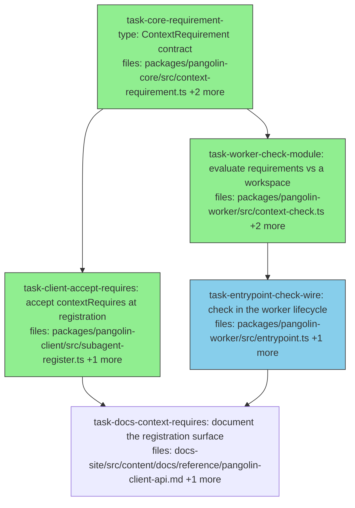

## Context

Implements v1 of [`../specs/2026-08-03-staged-context-verification-design.md`](../specs/2026-08-03-staged-context-verification-design.md).

**v1 is verification only — no declaration manifest, no prompt rendering.** That
ordering was inverted during design on consumer evidence: a declaration nobody checks
is the failure this area keeps producing (`contextShape` has five declaration sites
and zero readers), so shipping a declaration first would add a sixth unread
declaration to a system whose problem is unread declarations.

**The problem is drift, not ignorance.** Agents are not under-informed — authored
briefs are more explicit than any generated manifest. What is missing is detection
when a brief goes stale: bind a new toolchain bundle and a brief's true statements
become false with nothing noticing.

**Failing before the agent runs is about misattribution, not false greens.** When a
requirement is unmet the agent gets `command not found` at agent time, which reads as
a plan problem — a consumer lost a cycle to that class with the real cause four
layers from the report. Failing at the check point names the cause where it is
knowable.

**Placement** follows the packs decision spec, option A: `contextRequires` lives on
the subagent def, which the worker already reads — not on `SubagentShape`, which per
ADR-0018 D11 the worker is ignorant of. *(That spec currently lives on branch
`spec/packs-on-both-paths`; its option-A/D11 argument is restated here so this plan
does not depend on cross-branch availability.)*

**Explicit non-goal.** This does not give a verifier the base tree and does not check
"patch applied" — unverifiable by observation, and the half of KNOWN-ISSUES 17 that
stays open. No task here closes 17.

**One deliberate divergence from a neighbour, stated because copying it would be
wrong.** `captureBaseline` treats a missing `git` binary as best-effort and returns
`{unavailable:true}` without failing the dispatch (`patch-capture.ts:23-25`). This
check is **fail-closed**: a `git` requirement that cannot be evaluated is `met:false`
and fails the dispatch. An unevaluatable requirement is exactly the silent pass this
work exists to remove.

## Tasks

## Task: core contract for context requirements

```yaml
id: task-core-requirement-type
depends_on: []
files:
  - packages/pangolin-core/src/context-requirement.ts
  - packages/pangolin-core/src/index.ts
  - packages/pangolin-core/test/context-requirement.test.ts
status: done
quality_reviewer_hint: opus
```

Defines the requirement vocabulary as a discriminated union in core, so the client
(which persists it) and the worker (which evaluates it) share one shape. Every member
must be answerable by **observation alone** — the union deliberately cannot express
intent such as "patch applied", because checking that means re-doing the apply rather
than observing a property.

## Implementation

```typescript
// packages/pangolin-core/src/context-requirement.ts
/**
 * A property of the staged workspace that can be OBSERVED, not inferred.
 *
 * Deliberately excludes anything asserting intent — "patch applied", "snapshot at
 * revision" — because verifying those requires the diff and the base, which is
 * re-doing the work rather than checking it.
 *
 * `git.needs` semantics, fixed here so two implementers cannot diverge:
 *   'worktree' — a `.git` entry exists and the directory is usable as a working
 *                tree. TRUE for a freshly `git init`-ed directory with no commits.
 *   'history'  — the repository has at least ONE COMMIT. FALSE for a freshly
 *                `git init`-ed directory. This distinction is load-bearing: the
 *                worker's own `captureBaseline` runs `git init` without committing,
 *                so the two values differ precisely across that call.
 */
export type ContextRequirement =
  | { kind: 'paths'; glob: string; minCount?: number }
  | { kind: 'exec'; bin: string }
  | { kind: 'git'; needs: 'history' | 'worktree' };
```

```typescript
// packages/pangolin-core/test/context-requirement.test.ts
import type { ContextRequirement } from '../src/context-requirement.js';
import { it, expect } from 'vitest';

it('the union admits all three observable kinds and rejects an intent claim', () => {
  const reqs: ContextRequirement[] = [
    { kind: 'paths', glob: 'node_modules/**', minCount: 1 },
    { kind: 'exec', bin: 'pnpm' },
    { kind: 'git', needs: 'history' },
  ];
  expect(reqs.map((r) => r.kind)).toEqual(['paths', 'exec', 'git']);
  // @ts-expect-error — 'patch-applied' is deliberately NOT expressible
  const rejected: ContextRequirement = { kind: 'patch-applied' };
  expect(rejected).toBeDefined();
});
```

## Acceptance criteria

- `ContextRequirement` is exported from `packages/pangolin-core/src/index.ts` and
  importable as `import type { ContextRequirement } from '@quarry-systems/pangolin-core'`.
- All three kinds are constructible, asserted by an array whose `.map(r => r.kind)`
  equals exactly `['paths','exec','git']`. Exact-array, not `toContain` — the latter
  passes with a kind missing.
- `{ kind: 'patch-applied' }` does not typecheck, pinned with `@ts-expect-error`.
  **Documentation-grade, not build-enforced** — `pangolin-core` has no
  `tsconfig.test.json`, matching the unenforced idiom at `test/refs.test.ts:7-8`.
  Its real gate is `task-worker-check-module`'s `src/` typecheck, which reads these
  fields for real; this task's runtime assertion compares literals and would pass
  even for `export type ContextRequirement = unknown`. Stated so the criterion is not
  mistaken for a strong one.
- The `git.needs` doc comment states both values' semantics **and** that they differ
  across a `git init` without a commit. A downstream task's ordering pin depends on
  that distinction being written down here.
- Every pre-existing `pangolin-core` test passes unmodified.

Test file: `packages/pangolin-core/test/context-requirement.test.ts`.

## Task: accept contextRequires at subagent registration

```yaml
id: task-client-accept-requires
depends_on: [task-core-requirement-type]
files:
  - packages/pangolin-client/src/subagent-register.ts
  - packages/pangolin-client/test/context-requires.test.ts
status: done
```

Adds `contextRequires?: ContextRequirement[]` to `RegisterSubagentOpts`
(`subagent-register.ts:30`) and persists it onto the content-hashed def, written
**only when set** so existing subagent identities do not move.

## Implementation

```typescript
// packages/pangolin-client/src/subagent-register.ts
export interface RegisterSubagentOpts {
  // ...existing fields unchanged
  /** Observable properties the staged workspace must satisfy. Verified by the
   *  worker before the agent runs; an unmet requirement fails the dispatch. */
  contextRequires?: ContextRequirement[];
}

// In the def builder, IMMEDIATELY beside the existing `verify` line at :79 and for
// the same reason. `?? []` would be WRONG: an empty array is still a key, which
// changes the hash of every subagent that does not set the field.
if (opts.verify) def.verify = opts.verify;
if (opts.contextRequires) def.contextRequires = opts.contextRequires;
```

```typescript
// packages/pangolin-client/test/context-requires.test.ts
import { computeContentHash } from '@quarry-systems/pangolin-core';

it('a def without contextRequires hashes to the PRE-EDIT literal', () => {
  // Mirrors subagent-register.ts:70-77 exactly. This literal was derived from the
  // code BEFORE this change; if the guarded assignment regresses to `?? []` the
  // hash becomes sha256:1ba525f0cea7e0f980bdc333e89de66b0df868395ad84ec437c7a0c0adbe0fbe
  // and this goes red. Comparing two live registrations would NOT — both would move
  // together and stay equal.
  const def = { name: 'a', systemPrompt: 'x', promptTemplate: null, model: null, capabilities: [] };
  expect(computeContentHash(def)).toBe(
    'sha256:5001767f43a3fc2eaa7b7664acf684e9ea3236f36aac000a9738fc15e879318f',
  );
});
```

## Acceptance criteria

- A subagent registered with `contextRequires: [{kind:'exec',bin:'pnpm'}]` stores that
  array verbatim on its def blob, read back by fetching the pinned URI and parsing.
- A subagent registered **without** `contextRequires` produces a def with no
  `contextRequires` key — `'contextRequires' in def` is `false` — while a sibling
  registration in the same test that DID set it has the key. The sibling is the
  control proving the read path works.
- **Hash stability is pinned to a literal, not to a self-comparison.** A def of
  `{name:'a', systemPrompt:'x', promptTemplate:null, model:null, capabilities:[]}`
  hashes to `sha256:5001767f43a3fc2eaa7b7664acf684e9ea3236f36aac000a9738fc15e879318f`.
  An implementation writing `?? []` yields
  `sha256:1ba525f0cea7e0f980bdc333e89de66b0df868395ad84ec437c7a0c0adbe0fbe` and fails.
  Two live registrations compared against each other would pass under both
  implementations and must not be used as the fence.
- Two registrations differing only in `contextRequires` produce **different** content
  hashes, so the field participates in identity when present.
- **`packages/pangolin-client/test/subagent-register.test.ts` passes unmodified** —
  20 `registerSubagent` calls and the idempotency equality at `:136`. This is the
  file that actually exercises registration; an earlier draft of this plan named six
  other files as the fence, five of which never register a subagent at all.

Test file: `packages/pangolin-client/test/context-requires.test.ts`.

## Task: evaluate requirements against a workspace

```yaml
id: task-worker-check-module
depends_on: [task-core-requirement-type]
files:
  - packages/pangolin-worker/src/context-check.ts
  - packages/pangolin-worker/src/overlay-engine.ts
  - packages/pangolin-worker/test/context-check.test.ts
status: done
quality_reviewer_hint: opus
```

Evaluates a requirement list against a real workspace directory. Returns one result
**per requirement** — never fewer — because the failure detail must name which
requirement failed and what was observed instead.

**Glob engine decision, made here rather than left open:** export the existing
`matchesGlob` from `overlay-engine.ts:112` (currently module-private) and pair it with
`readdir(dir, { recursive: true })`. Rationale: a third glob matcher inside one
package would diverge in semantics, and adding a dependency would put
`package.json` + `pnpm-lock.yaml` in scope and route through `check:deps`
(`ci.yml:53`). **Do not reach for `fs.promises.glob`** — it typechecks against the
repo's `@types/node` and passes on CI's Node 22, then throws at runtime in the
worker image, which is pinned to Node 20 (`Dockerfile:23`).

## Implementation

```typescript
// packages/pangolin-worker/src/context-check.ts
import { access, readdir } from 'node:fs/promises';
import { join, delimiter } from 'node:path';
import type { ContextRequirement } from '@quarry-systems/pangolin-core';
import { matchesGlob } from './overlay-engine.js'; // newly exported by this task

export interface RequirementResult {
  requirement: ContextRequirement;
  met: boolean;
  observed: string;
}

/**
 * `env` is the MERGED runtime env — the same one the agent receives — not the
 * worker's `process.env`. Resolving `exec` against the worker's PATH answers a
 * different question than "can the agent run this".
 *
 * EXHAUSTIVE BY CONSTRUCTION: every branch pushes exactly one result, and the
 * default pushes `met:false`. A requirement producing NO result would read as
 * satisfied downstream (`results.filter(r => !r.met)` would be empty) — a silently
 * unchecked requirement, which is the failure this module exists to prevent.
 *
 * FAIL-CLOSED, deliberately diverging from captureBaseline's best-effort posture
 * (patch-capture.ts:23-25): if `git` cannot be run at all, the requirement is
 * `met:false`, not "skip".
 */
export async function checkContextRequirements(
  workspaceDir: string,
  reqs: ContextRequirement[],
  env: Record<string, string>,
): Promise<RequirementResult[]> {
  const out: RequirementResult[] = [];
  for (const requirement of reqs) {
    switch (requirement.kind) {
      case 'exec': {
        const dirs = (env.PATH ?? '').split(delimiter).filter(Boolean);
        let found = '';
        for (const d of dirs) {
          try { await access(join(d, requirement.bin)); found = join(d, requirement.bin); break; } catch { /* next */ }
        }
        out.push({ requirement, met: found !== '', observed: found || `not on PATH (${dirs.length} entries searched)` });
        break;
      }
      case 'paths': {
        const want = requirement.minCount ?? 1;
        let n = 0;
        // Short-circuit at `want`: the flagship glob is `node_modules/**`, and an
        // unbounded walk of the largest directory in the workspace would cost the
        // cycle this check exists to save.
        for (const rel of await readdir(workspaceDir, { recursive: true })) {
          if (matchesGlob(String(rel).split('\\').join('/'), requirement.glob) && ++n >= want) break;
        }
        out.push({ requirement, met: n >= want, observed: `${n} match(es) for ${requirement.glob}, wanted ${want}` });
        break;
      }
      case 'git': {
        // worktree: `.git` present and usable. history: >=1 commit, via a spawned
        // `git rev-parse HEAD` — patch-capture.ts:83 is the repo's spawn precedent.
        // Both fail CLOSED when git cannot run.
        break;
      }
      default: {
        const never: never = requirement;
        out.push({ requirement: never, met: false, observed: 'unknown requirement kind' });
      }
    }
  }
  return out;
}
```

```typescript
// packages/pangolin-worker/test/context-check.test.ts
it('returns one result per requirement, including for kinds it cannot satisfy', async () => {
  const dir = await mkdtemp(join(tmpdir(), 'cc-'));
  const reqs: ContextRequirement[] = [
    { kind: 'exec', bin: 'definitely-not-a-binary' },
    { kind: 'paths', glob: 'nothing/**' },
    { kind: 'git', needs: 'history' },
  ];
  const res = await checkContextRequirements(dir, reqs, { PATH: '/nonexistent' });
  // The arity invariant guards a branch that pushes nothing — a missing result
  // reads as SATISFIED downstream.
  expect(res).toHaveLength(reqs.length);
  expect(res.every((r) => r.met === false)).toBe(true);
  expect(res.every((r) => r.observed.length > 0)).toBe(true);
});
```

## Acceptance criteria

- **Arity invariant:** for a list containing all three kinds,
  `checkContextRequirements(...).length === reqs.length`, asserted together with all
  results `met:false` and all carrying non-empty `observed`. Length alone is
  insufficient — the three assertions are made against one known-length input so a
  branch that pushes nothing cannot pass.
- `exec`: a binary in a directory named by the **passed** `env.PATH` is `met:true`;
  the same binary with `env.PATH: '/nonexistent'` is `met:false`. **Third arm,
  discriminating:** with the binary planted on the *real* `process.env.PATH` and
  `env.PATH: '/nonexistent'`, the result is still `met:false` — proving the passed
  env is used and no fallback exists.
- `paths`: a glob matching one file is `met:true`; matching none is `met:false`.
  `minCount: 2` against exactly one match is `met:false` while `minCount: 1` on the
  same glob is `met:true` — the pair proves `minCount` is read.
- `paths` **short-circuits**: with `minCount: 1` satisfied by an early entry in a
  directory holding many more matches, `observed` reports exactly 1 match rather than
  the total. That is the observable proof the walk stopped.
- `git` `needs:'worktree'`: `met:true` in a `git init`-ed directory with **no
  commits**; `met:false` in a directory with no `.git`.
- `git` `needs:'history'`: `met:false` in that same **zero-commit** directory, and
  `met:true` once a commit exists. The zero-commit case is the state
  `captureBaseline` creates and is what makes the two values differ.
- `git` is **fail-closed**: with a `PATH` from which `git` is unresolvable, a `git`
  requirement is `met:false` with `observed` naming the cause — it does not skip and
  does not throw. This deliberately differs from `captureBaseline`'s best-effort
  `{unavailable:true}`; an implementer copying that neighbour would be wrong.
- `matchesGlob` is **exported** from `overlay-engine.ts` with its behaviour
  unchanged: all 19 `overlay-engine.test.ts` cases pass unmodified, including
  "applies adapter mergeRules to paths matched by a `**` glob".
- The function never throws for any kind against a nonexistent `workspaceDir`;
  asserted with `await expect(...).resolves.toHaveLength(3)` so a rejection fails.

Test file: `packages/pangolin-worker/test/context-check.test.ts`.

## Task: check requirements in the worker lifecycle

```yaml
id: task-entrypoint-check-wire
depends_on: [task-worker-check-module]
files:
  - packages/pangolin-worker/src/entrypoint.ts
  - packages/pangolin-worker/test/entrypoint-context.test.ts
status: running
is_wiring_task: true
```

Reads `contextRequires` off the subagent def, evaluates it after the setup script
(step 9) and **before** `captureBaseline`, and fails the dispatch when any
requirement is unmet.

**Insertion point:** a local cast of `bundles.subagentDef` immediately **before** the
`captureBaseline(workspaceDir)` call at `entrypoint.ts:514`. Do **not** extend the
existing cast at `:534` — that sits 20 lines *after* `captureBaseline` and cannot be
read from before it.

**Harness:** mirror `packages/pangolin-worker/test/integration.test.ts` — it drives
the genuine production path with `LocalStorageProvider` (`:38`), the `itPosix` gate
(`:43`), `packBundle` (`:54`) and `jsonBytes` (`:70`). Stage the subagent def with
the `jsonBytes` raw-def idiom rather than registering through the client; the worker
has no dependency on `pangolin-client` and must not gain one.

**`reason` and `detail` live on different surfaces.** Assert `reason` on the
`dispatch.failed` lifecycle event (via `RunWorkerDeps.onLifecycleEvent`); assert
`detail` on the worker's NDJSON **stdout**. The lifecycle event carries
`{kind, dispatchId, reason, at}` only — `detail` is deliberately withheld from it
(`entrypoint.ts:230-235`) so redacted secrets never reach a webhook.

```typescript
// packages/pangolin-worker/src/entrypoint.ts — immediately BEFORE captureBaseline (:514)
const ctxRequires = (bundles.subagentDef as { contextRequires?: ContextRequirement[] }).contextRequires;
if (ctxRequires?.length) {
  const results = await checkContextRequirements(workspaceDir, ctxRequires, mergedEnv);
  const unmet = results.filter((r) => !r.met);
  if (unmet.length > 0) {
    return failWith('worker-failed',
      `unmet context requirements: ${unmet.map((u) => `${u.requirement.kind} — ${u.observed}`).join('; ')}`);
  }
}
```

## Acceptance criteria

- A dispatch requiring `{kind:'exec',bin:'pnpm'}` where `pnpm` is unresolvable emits
  `dispatch.failed` with `reason: 'worker-failed'` on the lifecycle event, **and** the
  captured stdout contains `pnpm` in the `detail`. Two surfaces, asserted separately —
  `detail` is not on the event.
- The **same** subagent succeeds when a `pangolin-setup.sh` installs the binary into
  `$HOME` and an **env bundle** puts it on `PATH`, emitting `dispatch.finished` with
  exit 0. Positive control for the criterion above, and it exercises both halves of
  the recipe — a merged-env-only variant would leave the env-bundle half unexercised,
  since the worker's own `PATH` is already in `mergedEnv`.
- A stub adapter records **zero** invocations on the failing run and **exactly one**
  on the passing run. The passing count distinguishes "failed before the agent" from
  "the harness never dispatched".
- **`paths` binds to the real staged workspace, proven twice:** a requirement is met
  by a file delivered in a **capability bundle**, and separately by a file
  materialized at `inputs/<key>` from an `inputRef`. These are the only criteria that
  positively bind `workspaceDir` to the mkdtemp'd directory — an implementer passing
  the capability root or `process.cwd()` fails them and passes everything else.
- **Ordering pin, on `worktree`:** `{kind:'git',needs:'worktree'}` against a workspace
  with **no `.git`** fails the dispatch. Were the check to run after
  `captureBaseline`'s `git init`, `worktree` would be `met:true` and the dispatch
  would proceed — so this goes red under the wrong ordering. `history` cannot serve
  here: `captureBaseline` never commits, so `history` is `met:false` both before and
  after and would pass either way.
- **The ordering pin and the `.git`-bundle case MUST be two separate dispatches over
  two workspaces.** A bundle-carried `.git` in the same workspace makes `worktree`
  `met:true` and silently destroys the pin above.
- `{kind:'git',needs:'history'}` is met in a dispatch whose capability bundle carries
  a `.git` with at least one commit — the positive counterpart to the pin, in its own
  workspace.
- A subagent with **no** `contextRequires` completes a dispatch exactly as today,
  emitting `dispatch.finished` with exit 0.
- POSIX-gated with the `itPosix` idiom (`setup-script.test.ts:30`), since the setup
  script runs `/bin/bash`.
- All pre-existing `pangolin-worker` tests pass unmodified.

Test file: `packages/pangolin-worker/test/entrypoint-context.test.ts`.

## Task: document the registration surface

```yaml
id: task-docs-context-requires
depends_on: [task-client-accept-requires, task-entrypoint-check-wire]
files:
  - docs-site/src/content/docs/reference/pangolin-client-api.md
  - docs-site/src/content/docs/reference/dispatch-lifecycle.md
status: pending
```

Documents `contextRequires` on `subagent.register` and the lifecycle step that
evaluates it, including the two things a reader cannot infer: that it is verified
rather than declared, and that it deliberately cannot express "patch applied".

## Implementation

```markdown
<!-- pangolin-client-api.md — BOTH halves, mirroring how `verify` is documented:
     inside the reproduced RegisterSubagentOpts block (:107) AND as prose (:121-126) -->
  contextRequires?: ContextRequirement[];   // observable workspace properties, verified pre-agent

`contextRequires` — observable properties the staged workspace must satisfy, checked
by the worker after `pangolin-setup.sh` and before the agent runs. An unmet
requirement fails the dispatch with `reason: 'worker-failed'`. Three kinds: `paths`
(files match a glob), `exec` (binary resolvable on the runtime `PATH`), `git`
(`worktree` = a usable working tree; `history` = at least one commit).

It cannot express "patch applied" or "snapshot at revision" — not observable without
re-doing the work, so deliberately absent rather than unreliable.
```

```markdown
<!-- dispatch-lifecycle.md — worker-failed's cause list appears in THREE places
     (mermaid :263, prose :272-277, table :285); all three need the new cause -->
| Step 9a | unmet `contextRequires` | `worker-failed` |
```

## Acceptance criteria

- `pangolin-client-api.md` documents `contextRequires` in **both** places `verify` is
  documented: inside the reproduced `RegisterSubagentOpts` block and as prose. One
  without the other is half the established pattern for this file.
- The prose names all three kinds, both `git.needs` values, and states that an unmet
  requirement fails with `reason: 'worker-failed'`.
- It states plainly that "patch applied" is **not** expressible and why — a reader who
  does not see the omission stated will read it as a gap.
- `dispatch-lifecycle.md` adds the new `worker-failed` cause in **all three** places
  that enumerate causes — the mermaid at `:263`, the prose at `:272-277`, and the
  table at `:285`. Verify with `grep -c 'contextRequires'` on that file returning at
  least 3; a lower count means a cause list shipped incomplete.
- The check is described as sitting between the setup script and baseline capture, as
  an **unnumbered note** rather than a renumbered step — the 14-step list runs
  `9. run pangolin-setup.sh` straight to `10. start channel subscription`, baseline
  capture is not itself numbered, and the prose beneath hard-codes "Steps 1–10 and
  12–13" / "Step 11" (`:30-56`), which renumbering would falsify.
- `pnpm --filter docs-site build` succeeds with all internal links valid.

Test file: `docs-site/src/content/docs/reference/pangolin-client-api.md` is prose;
the check is the docs build plus the `grep -c` assertion above.

## Audit record

- **2026-08-03** · rev `beec7b54d544` · commit `f2d61ef` · lenses:
  coverage, dag-integrity, grounding, charter, context-sufficiency, verifiability,
  coherence (7/7 dispatched, 7/7 ran — no gaps) · **NOT READY — 8 blocking**
  - **No severity was downgraded.** All ten lens-proposed BLOCKING findings upheld,
    merged into B1–B8. Two DEFERRED were *promoted* (charter's ordering finding;
    coverage's §6.4 positive half) because a second lens falsified the detection
    story each rested on.
  - Baseline for round two: **8 blocking, 5 tasks, 401 lines**. The 8 collapse into
    **5 edit sites (R-A…R-E)**; 6 of 8 sat in `task-worker-check-module` and
    `task-entrypoint-check-wire`.
  - Worst finding: the check **failed OPEN** (B1) — `out.push` reachable only in the
    `exec` branch, so a `paths`/`git` requirement produced no result and read as
    satisfied. Root cause: an elided sibling.
  - The ordering pin **did not discriminate** (B3): `captureBaseline` never commits,
    so `history` was `met:false` under both orderings.
  - A cited fence was **fabricated** (B5): five of six named client test files never
    call `registerSubagent`; the real fence was omitted and the snippet was
    tautological.
  - A runtime split no test would catch (B4): no glob engine declared anywhere;
    `fs.promises.glob` typechecks on CI's Node 22 and throws on the worker's Node 20.
  - AC1 asserted on a surface that does not exist (B8): `detail` is deliberately not
    on the `dispatch.failed` lifecycle event.
  - Interaction: R-B × R-E is NOT benign — a fix for B7 would silently disable B3's
    ordering pin.
- **2026-08-03** · rev `b4a6027faeef` · lenses: none — NOT YET RE-AUDITED.
  Joint resolutions R-A…R-E applied as one change per cluster, plus all five
  interaction guards (two-workspace separation for the pin; the git-absent divergence
  stated; glob decided before the exhaustive switch; minCount short-circuit; jsonBytes
  keeping `pangolin-client` out of the worker). Net: +0 tasks, +1 file in scope
  (`overlay-engine.ts`), −1 edge (the spurious `client → entrypoint`), ~+120 lines.
  A re-audit should be diff-scoped.
